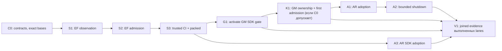

# План реализации: SDK gate и общее основание ownership/cleanup

Дата: 2026-09-14. Статус: **scope зафиксирован; C0 выполняется в изолированных
hosted workspaces. S1/K1 и последующие coding lanes не начинают работу до
проверки и фиксации соответствующего C0 contract revision**.
Это самостоятельная следующая поставка после предыдущего Get Modular hardening.
Dynamic plugins и работы RT-01/02/03 сюда не входят.

План применяет [q](/Users/belief/.codex/skills/q/SKILL.md): Clean Architecture,
SOLID и DRY через конкретные границы ответственности. Пользователь выбрал
раннее выделение полезного общего механизма; второй репозиторий не является
формальным условием начала работы. Повторяемость нужно подтвердить реальными
разными сценариями, а не количеством похожих классов.

## 1. Результат и зафиксированный scope

Поставка завершена, когда:

1. Engineering Foundation (EF) блокирует неучтённое расширение SDK по фактической
   поверхности пакета и проверяет решение поддерживать каждое изменение.
2. Текущие публичные поверхности EF, Get Modular (GM) и Agent Runtime (AR)
   подключены к этому механизму в required CI. Extension Foundation (XF)
   участвует в сверке границ; пустой package catalog не требует отдельного SDK PR.
3. Если C0 admission из раздела 4 прошёл, небольшой product-neutral пакет
   ownership/cleanup используется минимум на двух разных реальных путях AR:
   construction до передачи Host и освобождение ресурсов ordinary-session Host.
   Его можно установить без зависимости на AR.
4. Только для прошедшей ownership lane текущий ordinary shutdown ограничивает
   ожидание вызывающего, сохраняет незавершённую работу и не закрывает используемые
   ею ресурсы. Если A2 остановлен compatibility/recovery gate, этот пункт не
   считается выполненным и не заявляется как результат SDK-поставки.
5. Документация, точные CMS pins, consumer profiles и rejecting tests отражают
   реально введённое поведение. Старые ошибки, outcomes и binding semantics
   не меняются молча.

SDK lane S1-S3/G1/A3 является обязательным результатом этого плана. K1/A1
разрешены только после доказательства двух реальных scopes; конкретный A1 slice
дополнительно требует существующего recovery owner. A2 разрешён только после
K1/A1 и дополнительно требует доступного raw completion seam и совместимого
wait policy. Не прошедшая gate
часть сохраняет C0 stop evidence, не блокирует SDK lane и не порождает выдуманный
consumer, registry или публичный контракт. Она не отмечается как реализованная.

A2 переиспользует K1/A1 ownership ledger. Если K1/A1 остановлены, worker не
строит локальную копию primitive внутри AR; возможное AR-only улучшение shutdown
оформляется отдельным последующим scope.

Готовность плана не означает, что уже проверены новый timeout policy, CI trust
anchor и recoverability всех AR owners. Их конечный список входных проверок
зафиксирован в C0 ниже; это prerequisites соответствующих lanes, не разрешение
расширять задачу. Сигнатурная и поведенческая совместимость оцениваются отдельно.

**В scope:** API growth admission, package/entrypoint coverage, защита baselines,
тонкий общий ownership primitive, одноразовый handoff, pending/late cleanup,
сохранение исходной ошибки, truthful shutdown, scoped adoption и synthetic E2E.

**Вне scope, даже если обнаружится удобный момент добавить:**

- dynamic discovery, plugin install/uninstall, activation и hot reload;
- PluginRuntime, Active Head, desired/candidate generations, publication CAS;
- новый durable lifecycle journal, takeover, distributed lease или scheduler;
- новый consent engine/UI, расширение authorization policy, live migration;
- перенос contained-turn на новый runtime, изменение его dispatch/retry rules;
- новый supervisor, provider adapter, database или language-wide API analyzer;
- массовая миграция всех репозиториев организации, новый registry/dashboard;
- очистка всего legacy SDK и удаление публичных типов GM ради эстетики;
- массовый переход всех модулей на GM, node-per-helper, parallel Assembly.

Общий SDK gate означает переиспользуемый инструмент с consumer profiles. Первая
поставка поддерживает текущие Node/TypeScript package shapes EF, GM и AR.
Поддержка Dart, Go, Python и произвольных JS/CJS exports не подразумевается.

Не расширять scope самостоятельно. Новый request оформляется отдельным пунктом
за пределами этой поставки; это не блокирует уже независимый полезный PR.

## 2. Проверенные исходные точки

14 сентября повторно прочитаны remote refs через `gh` и исходники по SHA:

| Репозиторий | Срез для планирования |
| --- | --- |
| Get Modular | `ac49bb3374946330ec820591f8195a22d2c90900` |
| Engineering Foundation | `eadd117f98e8b93318426ab9d77d5890aab2e15e` |
| Extension Foundation | `6379c8d3be3b9946f9ef1dc168cb8272dd726078` |
| Agent Runtime | `be96f01ea54ec7d2ec0156774e3dfb75fac46803` |
| Organization quality standard, retained read | `4e8626382bb04ef14c4cf47ae419ca05e1574ea6` |

Это входные snapshots, не распоряжение реализовывать поверх устаревшего main.
В C0 заново получить remote SHA, проверить delta и записать integration base.
Локальные checkouts отстают; в GM есть чужие изменения `AGENTS.md` и quickstart.
Не делать reset, stash, checkout или синхронизацию поверх этих правок.

EF SHA `eadd117f` является непосредственным потомком прежнего планировочного
`b0f3e52f`; delta меняет только release workflow и его contract test. C0 обязан
использовать `eadd117f` как implementation base и отдельно проверить, влияет ли
этот workflow delta на CI authority S3.

AR SHA `be96f01e` на 9 коммитов новее прежнего планировочного `527d5fe9`.
Delta активирует Host-app FMS по ADR-0023, меняет active profiles/adoption
evidence, переносит feature contracts/adapters и тесты, а также затрагивает
ordinary Host composition. Поэтому старый AR C0 patch является только входом
для повторной проверки идей: его paths, pins, digests и выводы нельзя переносить
механически. AR C0 заново строится от `be96f01e` и повторно находит authority,
owner map, raw completion seam и обе production scope candidates. Остальные
перечисленные bases остаются точными integration bases текущей серии, пока C0
не зафиксирует новый remote delta.

Факты, влияющие на план:

- EF уже имеет API Extractor adapter, release fingerprints, accepted-decision
  evidence, wildcard/schema artifact inventory и bounded API audit. Они не
  реализуются повторно. Additive admission и полный condition identity ещё
  требуют дополнения. Audit с `releaseEligible:false` не считается release gate.
- GM `basic-host.mjs` уже использует явный `AsyncDisposableStack` и borrowed
  greeting port. Старое исследование о рефлексивном dispose больше не является
  описанием этого текущего примера. Простую корректную stack-модель сохранить.
- В свежем ordinary Host внешний код запускает `host.dispose()` и
  `feature.dispose()` параллельно, но raw Host внутри уже вызывает dispose того
  же OrdinaryFeature owner. Это две точки наблюдения одного owner-local flight,
  а не две независимые cleanup actions; точное правило закреплено в §7.2.
- Cleanup loop этого Host прекращается после первой ошибки. Это сохраняет
  нижележащих owners, но может удерживать независимые ресурсы. Исправление
  требует карты зависимостей; простое удаление `break` небезопасно.
- `createOrdinaryEngine().dispose()` ждёт submissions/flights без общего
  предела ожидания. Уже существующие `unfinished`, receipts и reconciliation
  являются владельцами результата; новый пакет их не заменяет.
- На AR `be96f01e` `createRuntimeSetupAttempt` удерживает созданный Host только
  локальной переменной `ownedHost`. В catch она очищается до `await host.dispose()`;
  при rejection наружу уходит error с cleanup failure, но доступный recovery
  handle/owner из этого пути не возвращается. Это наблюдаемый C0 blocker для
  construction scope, пока свежая owner map не покажет другой уже существующий
  сильный holder и entrypoint. Новый background registry ради обхода запрещён.
- Действующий CMS pin AR определяется активными profiles. Исторические
  `ordinary-session-pin-review.json` содержат прежние pins; брать последний
  встреченный файл как current authority нельзя.

Точные исходные ссылки и checkpoints приведены в разделе 14.

## 3. Архитектурный вариант и роль Get Modular

**Уточнённая рекомендация A:** отдельный необязательный пакет
`@get-modular/ownership` в `get-modular/packages/ownership`, плюс применение в AR.
Она заменяет прежнюю рекомендацию размещать пакет в XF. Это проект размещения,
не уже принятая новая repository boundary; её оформление входит в C0.

Primitive отслеживает lifetime произвольных owned resources. Он не знает
`ModuleId`, Assembly handles, artifact installation или plugin lifecycle.
Файл, connection и temporary process handle могут иметь одинаковую ownership
семантику независимо от того, собран их Host через GM или обычную Pure DI.

| Вариант | Что даёт | Оценка и объём самого основания |
| --- | --- | --- |
| A. Отдельный optional пакет GM | Переиспользуемое основание рядом с construction/handoff; отдельный API, без импорта Core/Assembly | 🎯 9/10 · 🛡️ 9/10 · 🧠 5/10; **760-1 270 LOC** плюс уже учтённый C0 |
| B. Отдельный нейтральный repository/package | Самостоятельный ownership utility; чистая граница, но собственное scaffolding/release сопровождение | 🎯 7/10 · 🛡️ 9/10 · 🧠 6/10; около **950-1 650 LOC** |
| C. Пакет XF | Возможен как helper extension Host, но нынешний контракт не содержит extension-specific semantics и также потребует изменения boundary | 🎯 6/10 · 🛡️ 8/10 · 🧠 5/10; **760-1 270 LOC**, дополнительный package-admission труд пока не оценён |

Оценки экспертные; высокий показатель сложности означает более дорогую работу.
Предыдущее обоснование смешивало владение lifecycle policy и предоставление
ownership primitive. Host может пользоваться общей библиотекой, сохраняя всю
authority. XF не является универсальным местом для любых нейтральных helpers.
Разница package placement почти не меняет алгоритм; ранняя надбавка за GM была
недостаточно обоснована. Новая admission boundary нужна при обоих размещениях.

**В Get Modular делаем:** новый optional ownership package, SDK adoption,
guidance CMS и пример Host integration. Core/Assembly не зависят от ownership
и не получают automatic disposal. Ownership не зависит от Core/Assembly или XF.
Public roots Core/Assembly и `FactoryProduct` сохраняются. Подключение ownership
выбирает consumer, а не package side effect или новая mandatory Assembly hook.

| Владелец | Единственная ответственность |
| --- | --- |
| EF public-api-compatibility | Наблюдение SDK и проверка admission; только development dependency |
| GM optional ownership package | Локальная семантика владения, transfer, settlement и незавершённого cleanup |
| AR resource owner | Конкретный ресурс, side effects, доказательство закрытия и допустимость повторения |
| AR Host/application | Порядок shutdown, время ожидания, зависимости owners и mapping public outcomes |
| GM | Граф, bindings, construction и точная передача результата Host |

Граф зависимостей: AR outer lifecycle feature → @get-modular/ownership;
AR composition → Core/Assembly; ownership → standard language primitives.
Обратных импортов нет. EF присутствует в dev tooling, не в runtime graph.

В GM текущая repository boundary допускает композицию и Assembly, но ещё не
этот пакет. В C0 оформить отдельное решение для packages/ownership, допустимые
dependency edges, source policy, API/packed tests и два AR use sites. Принятые
ADR не переписывать. Это расширяет набор опциональных библиотек; policy cleanup,
readiness и runtime authority остаются у Host. Старые запреты внутри Core и
Assembly не ослабляются; blanket lifecycle exception для всего repo запрещён.

### 3.1 Где использовать Get Modular для модульности

Feature/module boundary и node в GM graph - разные понятия. Применяем FMS,
узкие public contracts и явные dependencies во всех новых features. Graph
нужен в принятых composition scopes для реально собираемых capabilities.

| Часть плана | Использование GM | Конкретное действие |
| --- | --- | --- |
| AR passive/ordinary Host | Да, существующий Core/Assembly root | Сохранить profiles, factories и точные bindings; ownership использовать внутри lifecycle owner |
| AR зависимости Process → Provider и другие существующие capabilities | Да, через существующие declarations/slots | Проверить неправильное binding и identity того же provider; второй resolver не создавать |
| Новый ownership primitive | Обычный самостоятельный feature, без внутреннего GM graph | Закрытый API и private state transitions; reserve/settle не превращать в nodes |
| EF SDK gate | Existing feature/capability и Pure DI | Policy зависит от extractor/evidence ports; новый механизм собирается в текущем command composition |
| Host integration example | Да | Один небольшой graph с owned и borrowed resources; handoff/cleanup остаётся в Host code |

В этой поставке количество новых GM graph nodes может быть **нулём**: новая
библиотека не является новой самостоятельно выбираемой capability. Новые nodes
допустимы только для уже перечисленных AR use sites и Host example; новая
самостоятельная capability вне этих границ требует отдельного scope. Наличие
нескольких функций или test doubles само по себе не требует новых bindings.

Для EF отдельная миграция command Host на GM могла бы иметь смысл при доказанной
повторяемой конфигурации capabilities, но она не нужна для SDK admission и
выходит за данный scope. Не превращать её в скрытый prerequisite S1-S3.

## 4. C0: подготовить проверяемые контракты

До запуска writers:

1. Записать exact SHA четырёх repo, текущие package versions, активные CMS/FMS
   profiles, lock/archive digests и required checks.
2. Сопоставить полный upstream CMS с активным retained pin AR. Исторические
   evidence оставить неизменными; новое сравнение содержит before/after SHA и
   hash полных bytes. Статусы active/pending не выводятся из наличия пакета.
3. Прочитать актуальные package schema и approval ports EF. Добавления ниже
   реализовать в них, сохраняя supported v1 consumers.
4. На двух реальных AR paths составить таблицу: acquire, owner до/после handoff,
   cleanup action, prerequisites, pending/error semantics и reuse/retry policy.
5. Зафиксировать точный public API нового пакета и envelope SDK report. После
   этого writers используют exact relevant C0 revisions, не договариваются через casts.
6. Назначить каждому новому правилу тест, ожидаемый отказ и владельца.

**Конечные выходы C0, без TODO в передаваемом coding prompt:**

| Выход | Что именно должно быть записано | Блокирует |
| --- | --- | --- |
| Surface coverage | Имена всех EF/GM/AR packages, publish/development/private classification, реальные export shapes, поддержка каждого observer | S1 и соответствующую SDK activation |
| CI authority | Workflow/job, trusted tool SHA/artifact, источник base и owner decision, проверяемый required-check context | S3/G1/A3 |
| Ownership contract | Один .d.ts/псевдоконтракт, таблица §6, форма handoff и proof двух production use sites | K1/A1 |
| AR owner map | Для каждой acquisition/cleanup: сильный держатель, raw completion, prerequisites и точный путь повторного наблюдения после failure | A1/A2 |
| Wait policy | Число milliseconds, область применения, все вложенные wait boundaries, доступный raw completion seam, существующий error carrier, совместимость до/после, fixtures deadline boundary | A2 |
| Delivery identities | Package versions, upstream CMS commit/hash, список будущих dependency publications, их order и owners | Только зависимые adoption PR |

**Единственная go/no-go матрица C0:**

| Решение | `go` только если | Иначе |
| --- | --- | --- |
| S1 для package shape | Matrix называет exact package/export shape и реально поддерживающий observer | Activation только этого package остаётся `pending`; новый parser family не добавляется |
| S3/G1/A3 | Названы trusted workflow/verifier anchors, source base и проверяемый required-check context вне контроля candidate | Остановить trusted activation; passing candidate job не считать gate |
| K1/A1 | Два materially distinct production scopes используют одну семантику сверх обычного stack и каждый имеет достижимого owner | Сохранить stop evidence; не создавать package или второй искусственный use site |
| A2 | K1/A1 допущены, raw owner flight доступен без cast/reflection, identity одного OrdinaryFeature доказана, behavior delta разрешена | Остановить A2; не добавлять внешний timeout поверх внутреннего 1 000 ms |
| Registry activation | Опубликован тот же квалифицированный artifact с совпадающими version, digest/integrity и active profile evidence | Downstream остаётся draft/pending; tarball evidence не выдаётся за registry adoption |

Каждое решение имеет ровно один статус: `go` либо `blocked` с причиной и exact
evidence. `Partial`, «почти поддержано» и optimistic default запрещены. `Blocked`
останавливает только строки, явно перечисленные в таблице и DAG, а не соседние
независимые lanes.

Каждый выход C0 получает `contractRevision`, SHA-256 канонических bytes и список
разрешённых consumers. Writer принимает exact bytes, а не пересказ в prompt.
Если C0-файлы разных repo расходятся, источником истины является именованный
per-repo artifact; общий reference-индекс только связывает их digests.

Здесь `contractRevision` - явная версия формы/семантики контракта, а не hash.
SHA-256 считается по точным UTF-8 bytes файла в Git (с его LF и финальным newline)
и хранится во внешнем identity index/receipt вместе с path, source base и plan
hash. Artifact не включает собственный digest в хешируемые bytes: самоссылка
запрещена. Не вводить особую JSON canonicalization library; formatter меняет
bytes и требует пересчёта digest. Derived общий индекс не становится второй
редактируемой копией contract fields и проверяется против per-repo artifacts.

**Admission gate для общего пакета:** K1/A1 разрешены только если C0 показывает
два существенно разных production paths, которым действительно нужны хотя бы
`reserve before acquire`, late settlement, ownership handoff или retained
incomplete cleanup с одинаковой семантикой. Два вызова одного helper, две
обёртки одного Host или простой `AsyncDisposableStack` не считаются двумя
evidence scopes. Если construction path сводится только к синхронной передаче
готового `ownedHost`, а общий primitive не защищает дополнительный инвариант,
этот path не засчитывается. Тогда ownership lane останавливается на C0, K1 не
создаётся и второй use site не изобретается; независимая SDK lane продолжается.

Карта owners включает creation failure **без возвращённого Host**, а не только
успешный объект с доступным dispose. Если нет существующего recovery owner для
конкретного incomplete case, C0 не может назвать его покрытым. Зафиксировать
ограничение и остановить этот integration slice, не изобретать молча registry.
Предлагаемый initial ordinary wait budget - **30 000 ms** на один вызов ожидания;
это новая product policy, не найденная в текущем коде константа. C0 либо принимает
её с совместимостью §7.2, либо подставляет доказанный действующий policy budget.
Не выбирать число в coding-worker и не брать TTL grant как shutdown budget.

C0 является коротким implementation checkpoint, не новым раундом общего
исследования. Его выход: bounded набор согласованных per-repo schema/API contract
revisions, связанный digest-индексом, и карта фактических AR owners. Не возвращать
выбранные границы optional ownership/EF на бессрочное обсуждение.
Если точный API можно сократить без потери инвариантов, сократить до начала K1.

Если часть предложенного primitive не повторяется в реальных paths, убрать её
из пакета до кода. Общая библиотека должна использоваться production-кодом в
этой же поставке. Не выпускать пустую абстракцию с одним demo consumer.

C0 сам не объявляет consumers adopted: новые profiles до кода имеют pending
status. Обновление active CMS pins с действующими rejecting checks принадлежит
соответствующему K1/A1/G1/A3 PR. C0 tests проверяют admission/schema contract,
а не подменяют отсутствующую runtime реализацию проходящими заглушками.

## 5. SDK gate: реализация

### 5.1 Расширить существующий pipeline

В EF работать внутри `packages/engineering-foundation/src/capabilities/public-api-compatibility/`:

- `application/model/public-api.ts`: сохранять существующие snapshot identities;
  добавить отдельные growth/observation records, если старый format не выражает
  нужный факт без смены смысла;
- `application/policies/evaluate-public-api-compatibility.ts`: переиспользовать
  classification; growth admission получает свой domain-tagged fingerprint;
- `application/policies/validate-package-export-coverage.ts`: сохранить все
  существующие rejecting cases, добавить точное наблюдение resolution branches;
- `application/use-cases/analyze-public-api-compatibility.ts`: объединить
  observed surface, решения и diagnostics через существующие ports;
- outbound API Extractor/filesystem/artifact/governance adapters: переводить
  технические данные в внутренний model, не импортировать SDK types в policy.

Не расширять общий `PluginRuntime`, не писать regex parser типов, не создавать
новую команду со вторым comparator. Существующий command
`agent-teams-foundation check package.public-api-compatibility` остаётся точкой
входа consumer. Diagnostic/audit и promotion сохраняют свои отдельные claims.

### 5.2 Что наблюдаем и что не обещаем

1. Из существующего topology/workspace inventory получить все packages внутри
   принятого scope, включая public development subpaths private packages.
2. Каждый package классифицировать: governed surface либо явно private-only.
   Новый package, `private:false`, новый export или bin требует новой проверки.
3. Для typed surface наблюдать symbols, members, overloads и reachable types.
   `@internal` label не скрывает физически importable export.
4. Для exports map сохранить condition branches, их порядок, targets и `null`.
   JSON key order conditions и array fallback order могут менять resolution;
   их нельзя просто отсортировать вместе с незначимыми списками.
5. Различать root fallback без exports map, public bin, JSON/schema и concrete
   wildcard members. Internal implementation file не становится public API
   только потому, что вошёл в tarball при закрытом exports map.
6. Новое runtime-only имя наблюдать существующим compiler/export observer для
   поддержанных TS/ESM shapes. Если shape нельзя доказать статически, вернуть
   unsupported и запретить расширенный claim. Не импортировать пакет ради census.
7. Typed wildcards с разными types targets и динамические CJS exports не
   получают новый resolver в этом scope. Для них допустим явный закрытый
   entrypoint map или отдельная последующая поддержка.
8. Сравнивать source/build observation с exact packed output. Digest внутренних
   JS bytes связывает artifact evidence, но не превращает каждую правку тела
   функции в SDK addition. Поведение проверяет consumer conformance.

Существующий bounded audit может дать rich observations только при полной
поддержке нужного shape. Нельзя изменить `releaseEligible:false` на `true`
одним mapping или использовать incomplete report как approval.

Поддержка observer не предполагается по одному наличию TypeScript в repo. C0
сопоставляет реальный package shape с положительной fixture existing adapter.
S1 расширяет branch observation в этом adapter; новый универсальный runtime
export analyzer не входит в оценку. Непокрытый фактический export означает
`incomplete` для package и ненулевой exit, а не успешный отчёт с пропущенным
полем. Такой package не получает full-SDK claim до покрытия.

Нормативный вход S1 - конечная C0 matrix `package + export-shape kind + observer`.
Writer реализует только shape kinds, уже встречающиеся в exact EF/GM/AR bases и
явно перечисленные в matrix. Новый parser family, выполнение package code или
поддержка shape, отсутствующего в matrix, требует отдельного scope. Если один
из текущих packages нельзя покрыть существующим adapter без такого расширения,
останавливается только его activation; общий gate не получает ложный полный
claim и не превращается по ходу работы в language-wide analyzer.

Exports отсутствует: нельзя наблюдать только `main` и забывать доступные deep
imports. Использовать точный packed inventory; если existing observer не умеет
выразить эту поверхность, adoption остаётся pending. Введение закрытого exports
map может ломать deep imports и не является автоматическим исправлением gate.
Аналогично не добавлять typed wildcard resolver под видом manifest projection.

Список packages выводится из **union trusted-base и candidate topology**.
Удаление package directory, смена имени, `private` flag или workspace glob не
стирает предыдущие obligations. `private:true` само по себе не делает public
development entrypoints внутренними. Закрытость должна быть явно классифицирована.

### 5.3 Identity, fingerprint и решение о поддержке

Ключ typed элемента:
`packageName + exportPath + resolutionBranch + canonicalReference`.
`canonicalReference` остаётся opaque identity из extractor; signature и kind
входят в observed value и fingerprint, не переименовывают identity при edit.
Для export branch/bin/data/wildcard используется соответствующий kind/key.

`resolutionBranch` - структурный путь conditions/array index; его target, kind
и доступность являются observed values. Смена target не должна исчезать за
новой identity. Сохранить упорядоченное resolution tree отдельно от symbol map:
ветки могут быть семантически значимы даже при одинаковых symbols.

Изменение A→B с прежним count создаёт removal A и addition B. Одинаковый symbol
на двух subpaths не сливается. Public interface расширяется даже без нового
root export. Transitive hidden type change учитывается на reachable contract.

Минимальная decision record содержит:

- `decisionId` и `ownerRef` существующего semantic owner;
- точный набор затронутых coordinates и `changeFingerprint`;
- `stability`: development, experimental или supported;
- `consumerEvidenceRefs` с use case, source/artifact identity;
- короткое обоснование public exposure и совместимости;
- для shim/deprecation/removal: replacement, migration и removal conditions.

Admission не дублирует signatures, exports list или текущую реализацию.
Стабильному API не назначать выдуманную дату удаления. Related additions можно
разрешить одной записью с точным bounded набором, а не ADR на каждый method.

Fingerprint связывает before/after surface и policy semantics version. Он не
включает собственный admission file или финальный commit SHA: иначе возникнет
самоссылка. Финальный report отдельно связывает source commit/tree и artifact.
Evidence на candidate source использует content/tree references и проверяется
после commit; evidence на released consumer использует immutable SHA/digest.

### 5.4 Два сравнения с разными задачами

| Сравнение | Назначение |
| --- | --- |
| Trusted target merge base → candidate | Точный diff этого PR, новые поверхности после последнего release, scope drift |
| Last released surface/artifact → candidate | Все ещё действующие compatibility obligations, SemVer и removal |

Источник base задаёт доверенный CI context. Candidate не выбирает удобный base.
Missing/shallow base даёт incomplete, не сравнение с пустым проектом.
Base build и candidate build выполняются из exact source/lock/toolchain в
раздельных disposable directories. Cached evidence допустимо только при
совпадении всех соответствующих input identities.
Перед merge проверяется фактический merge result относительно актуального
target. Изменившийся base/surface требует обновлённого report; успешный старый
PR head не доказывает новую комбинацию. Не перепроверять неизменившиеся inputs.

Второй diff может включать additions из нескольких уже merged PR. Их exact
records сохраняются до release promotion; не требовать повторно вручную
разрешать прежние additions. Rebase с изменением фактического diff обновляет
fingerprint, старое разрешение не распространяется на новый набор.

Не искать равенство fingerprint всего release diff с fingerprint одного PR.
Growth decision связывается с точными **атомарными transitions**
`coordinate + before value digest/absent + after value digest/absent + policy
version`; group fingerprint - digest их упорядоченного набора. Trusted transition
receipts связывают base/candidate observation digests. Для уже merged additions
проверяется непрерывная цепочка от trusted release/initial observation до target
base, затем текущий PR diff. Наличие decision ID без совпадения переходов не
достаточно. Example: `absent→A` в PR1 и `A→B` в PR2 требуют двух решений;
PR1 не разрешает `absent→B`. Add→remove до релиза не создаёт published obligation,
но не стирает историю проверок. Не строить отдельный event store: использовать
retained EF records/artifacts; разрыв цепочки даёт incomplete. Не replay всей
Git history на каждом PR: достаточно trusted successful receipt exact target
base с admitted surface digest и проверить текущий transition. Первое включение
использует explicit initial admission. При squash/merge retained receipt должен
совпадать по итоговым tree/surface inputs; merge SHA связывается отдельно.

Release compatibility по-прежнему вычисляется **напрямую release→candidate**
старым comparator. Цепочка admission не разрешает SemVer break, снятие support
или удаление опубликованного API. Revert считается обычным обратным transition
с текущими obligations; исторические records не переписываются.

Published baseline bytes и promotion fingerprint format не переписывать ради
нового gate. Новое measurement vocabulary вводится отдельной versioned
projection с явной coverage. Исторический baseline без нового измерения
помечается limited; возможность выпуска в новом mode требует квалифицированного
bootstrap из exact released package. Нет release package - нет выдуманного
release evidence. Для нового unreleased пакета используется initial-unreleased
путь с пустым released surface и полноценным first-surface admission.
`initial-unreleased` определяется trusted catalog/history, не candidate flag и
не единичным registry 404/5xx. Утрата доступа к прежнему release даёт incomplete,
а смена имени package требует учесть removal obligations прежнего имени.

### 5.5 Проверяемый CI, без псевдо-защиты

- Новый gate включается явным consumer profile после migration; старые
  установленные v1 consumers продолжают старую семантику до pin upgrade.
- Изъятие package из policy не исключает его из inventory. На first adoption
  классифицируется текущая поверхность trusted base; baseline не генерируется
  заново из candidate для обхода проверки.
- Additive decision в том же PR разрешена, но требует проверяемого owner decision
  по существующему repo workflow. Generated JSON сам по себе не является approval.
- Trusted required CI проверяет наличие команды/ожидаемый scope/result; его trust
  anchor не должен браться только из изменённого `package.json` candidate.
- Отдельные mutation fixtures убирают command, делают no-op, меняют policy и
  baseline вместе, сужают scope. Все обязаны завершаться отказом.
- Для проверки изменённого checker выполняется его conformance, но это не
  заменяет trusted guard wiring. Root/admin изменение branch protection лежит
  вне обещания gate; новый signing service под этот риск не строится.
- Required CI на fork не запускает untrusted code с release credentials.
- Receipt включает source/tree, base SHA, artifact digests, policy/tool versions,
  полный package coverage, verdict и выполненные phases. Хеш доказывает identity,
  происхождение результата подтверждается CI run/artifact custody.

**Минимальное wiring:** required trusted entrypoint запускает закреплённый EF
checker напрямую с trusted base/scope, затем проверяет consumer command и receipt.
Success candidate script без matching coverage receipt не принимается.
Candidate build выполняется отдельно без write/release credentials и без записи
в verifier workspace, trusted configuration и место хранения verdict. Его outputs
считаются входными данными и повторно валидируются доверенным checker.

Инвариант доверия должен иметь конкретный repository/ruleset workflow anchor,
который этот PR не может заменить одноимённым успешным job. Обычный required
status name в candidate-controlled workflow этого не гарантирует. В C0 выбрать
существующий supported org/repo механизм и записать immutable ref; если такого
anchor нет, сначала S3 wiring, adoption не маркировать защищённой. Не использовать
`pull_request_target` для исполнения candidate code с privileged token.
Обновление самого EF checker: его candidate проходит conformance, а остальные
adopted consumers используют прежний trusted artifact до отдельного tool-pin
upgrade. Checker не выдаёт себе доверие собственным candidate workflow.

S3 обязан назвать конкретный механизм, который candidate branch не может
переписать: например, ruleset-required workflow из защищённого источника либо
внешний verifier/status producer с exact tool pin. Одного YAML в том же PR,
совпадающего имени job или проверки собственного receipt недостаточно. Если
такой anchor нельзя создать в разрешённом S3 scope, S3 завершается `blocked`,
а G1/A3 не активируются; worker не ослабляет claim до «лучшего из доступного».

Owner record проверяется через существующий authority/decision adapter: exact
owner identity, статус и соответствие source/diff. Нельзя обещать, что тест
докажет осмысленность решения человеком или модели. Режим `solo_owner` допустим;
второго человека, отдельный signing service или approval на каждый метод этот
план не добавляет. Если текущий workflow подтверждает только metadata, отчёт
обязан назвать именно эту ограниченную гарантию, а не owner approval.

### 5.6 Ограничения стоимости

Использовать текущие bounded inventory/graph limits EF. В рамках audit сейчас
есть пределы 4 096 files и 32 MiB на соответствующий input budget; сохранить
раздельные budgets исторического и текущего evidence. Превышение не означает
«изменений нет». Новый export shape не оправдывает переписывание archive engine.

Changed mode маршрутизирует manifests, barrels, reachable declarations, build
config, tsconfig, lockfile, policy и workflow. Fast mode проверяет текущий
governed diff; required full/packed CI завершает недоказанные artifact phases.
Не выдавать прошедший fast gate за full package qualification.

## 6. Общий пакет: минимальная реализация owned-lifetime

### 6.1 Что является общей семантикой

Общее основание кодирует только следующие инварианты:

1. Ответственность за acquisition записывается до запуска async acquire.
2. Donor может отказаться от fulfilled obligation максимум один раз; пакет не
   выдаёт это за доказательство принятия ресурса конкретным следующим owner.
3. Закрытый приём новых работ не отменяет уже pending acquisition.
4. Поздний success сохраняет владельца ресурса и cleanup obligation.
5. Завершение ожидания caller не является завершением ресурса.
6. Cleanup одной записи одновременно выполняется максимум одним владельцем.
7. Подтверждённый cleanup завершённой записи не выполняется повторно.
8. Ошибка/pending/unknown не стирает obligation; исходную причину сохраняет
   конкретный owner, а generic scope сохраняет только lifecycle phase.

Это локальные правила на время жизни процесса. Нет global registry, таймеров,
network, filesystem, БД, threads, durable leases и AR/GM-specific models.
Произвольный TS brand не становится authorization proof.

### 6.2 Узкая форма API

Рабочая форма до C0 freeze; не увеличивать её ради будущих plugins:

| Операция | Вход/результат | Ответственность |
| --- | --- | --- |
| `createOwnershipScope` | Новый instance-scoped scope | Закрытая таблица своих tickets; без global state |
| `reserve` | Opaque acquisition ticket | До вызова acquire; после seal отклоняется |
| `fulfill` / `reject` | Settlement того же ticket | Single assignment; reject допустим только при доказанном отсутствии остаточного resource |
| `transfer` | Owned ticket → transferred | Однократно завершает donor custody; не принимает receiver, не вызывает его и не доказывает внешнее принятие |
| `seal` | Закрытие нового admission | Идемпотентно; существующие tickets доступны owner |
| `beginCleanup` / `settleCleanup` | Single-flight claim и outcome | Исключают double cleanup, сохраняют incomplete |
| `snapshot` | Инертные counts/diagnostics | Без callbacks, grants, raw errors или live capabilities |

Имена могут уточняться в C0, но число ответственностей фиксировано. Reducer и
private bookkeeping принадлежат одному feature. Не вводить отдельный generic
state-machine framework, public event bus или фасад над каждым методом.

Все операции generic package синхронны: они только проверяют identity и меняют
локальное состояние, не ждут Promise и не вызывают consumer code. C0
псевдоконтракт обязан зафиксировать один error channel. Ожидаемые отказы перехода
(`sealed`, foreign/forged ticket, stale claim, already-in-flight) возвращаются
как стабильный discriminated result; исключение не используется как второй
способ сообщить тот же исход. Raw cleanup failure и исходная product error
остаются данными owner/Host, а не сохраняются generic package.

Явно типизировать outcomes: pending acquisition, rejected-empty, owned, transferred,
cleanup-in-flight, cleanup-incomplete, released. Admission open/sealed является
отдельным фактом. Без общего enum состояния всего Host.

Список ресурсов, cleanup functions и policy их запуска принадлежат consumer
adapter. Пакет отслеживает переходы, но не запускает пользовательский код и не
строит dependency DAG. Resource IDs, tenant, grants, operations и provider
receipts остаются типами своих owners; унифицируется только общий ownership ticket.

**Единственные источники истины:** scope владеет фазой ticket и валидностью
cleanup claim; owner-local record владеет resource handle, cleanup action и
фактом external effect; Host владеет порядком, deadline и public outcome.
Consumer не хранит параллельные `isOwned`/`isReleased` flags. Он проецирует эти
факты из scope и связывает payload с ticket по object identity. Это не две
конкурирующие state machines: библиотека не знает payload/effect, Host не
переписывает lifecycle phase вручную.

Один ticket соответствует одной **cleanup obligation**, а не обязательно одному
объекту. Resource/cleanup closure остаётся в owner-local записи с этим ticket;
это payload, не вторая независимо редактируемая таблица lifecycle states.
Borrowed ресурс вообще не регистрируется как собственная cleanup obligation.

При частичной acquisition owner сначала сохраняет resource/cleanup obligation
и делает `fulfill`, затем сообщает наружу исходную factory error. `reject`
означает только `rejected-empty`: allocation не началась либо factory доказанно
сама освободила всё. Exception и abort не являются таким доказательством.
Каждая независимо освобождаемая часть регистрируется сразу после её создания,
до следующего await/возможного throw. Итоговый aggregate ticket не заменяет
этот owner-local учёт. Альтернатива допустима только при доказанном factory
unwind или failure carrier с действующим cleanup/reconcile handle.
Если factory не отдала handle и результат эффекта неизвестен, obligation
остаётся у factory/effect owner; внешний ticket остаётся pending до его readback.
Нельзя вызвать `reject` ради опустошения snapshot или повторить acquisition.

### 6.2.1 Переходы и граница гарантий

| Исходное состояние | Операция/факт | Результат |
| --- | --- | --- |
| Open scope | reserve | pending ticket зарегистрирован до acquire |
| Sealed scope | reserve | Отказ без изменения и без acquire |
| pending | fulfill / reject-empty | owned / rejected-empty, в том числе после seal |
| owned + open scope | transfer | transferred; terminal для donor |
| owned + sealed scope | transfer | Отказ: поздний ресурс не публикуется |
| owned | beginCleanup | cleanup-in-flight и уникальный claim |
| cleanup-in-flight | beginCleanup повторно | already-in-flight, новый claim не выдан |
| cleanup-in-flight | caller deadline | Никакого перехода; raw action ещё идёт |
| cleanup-in-flight | observation `unresolved` по своему claim | cleanup-incomplete; тот же claim остаётся текущим только для readback refinement |
| cleanup-in-flight / cleanup-incomplete | terminal observation `released` по текущему claim | released |
| cleanup-in-flight / cleanup-incomplete | terminal observation `retry-safe` по текущему claim | cleanup-incomplete; разрешена одна новая cleanup attempt |
| cleanup-incomplete с terminal `retry-safe` | beginCleanup | cleanup-in-flight с новым claim; прежний claim отозван |
| cleanup-incomplete с `unresolved` | beginCleanup | Отказ до readback refinement; effect не повторяется |
| released / transferred / rejected-empty | Новый effect/transfer/settlement | Отказ; завершённое действие не повторяется |

Неизвестные/чужие tickets и claims дают стабильный discriminated отказ без
изменения state; `seal` идемпотентен. Claims создаются библиотекой, не числовым
счётчиком consumer. Cleanup observation принимает только claim конкретной
attempt: поздний callback первой попытки не может завершить вторую. C0 выбирает
одно точное имя метода, но фиксирует следующую семантику: `unresolved` является
нетерминальным наблюдением той же attempt; `released` и `retry-safe` являются её
терминальными исходами. После `unresolved` тот же claim можно монотонно уточнить
до `released` или `retry-safe` по readback. Повтор `unresolved` inert; изменить
terminal outcome нельзя. Новая cleanup attempt допустима только после terminal
`retry-safe`. Ни один outcome не записывается по observer timeout без settlement
raw action. После нового beginCleanup прежний claim окончательно недействителен.
Доказательство external effect/retry safety даёт owner, не библиотека.

**Handoff здесь локален и кооперативен.** `transfer` не принимает произвольный
callback, serialized receipt или destination с методами. Host заранее проверяет
готовый non-thenable carrier, cancellation, identity и все потенциально падающие
hooks, пока donor остаётся единственным cleanup owner. До commit receiver не
получает отдельную активную cleanup запись. Затем в одном синхронном участке
`transfer` завершает donor custody, owner-local marker очищается и уже проверенный
carrier немедленно возвращается. Между commit и return нет await, логирования,
getters, allocation или пользовательских callbacks; после commit не остаётся
операции, которая штатно может бросить. После commit отмена caller не возвращает
ownership donor. До commit любая ошибка оставляет donor owner.
Transfer не подтверждает, что caller прочитал результат Promise или вызовет
dispose. Это обычная обязанность consumer возвращённого Host.

В точке commit заранее созданный carrier становится единственным holder
self-contained disposer, а donor scope становится terminal `transferred` тем же
синхронным переходом. Нельзя сначала снять donor custody, а затем отдельной
операцией «активировать» carrier. Если carrier не способен владеть cleanup
самостоятельно уже в момент commit, transfer не выполняется.

Generic пакет детерминированно проверяет допустимость donor transition. Точное
совпадение возвращённого Host, наличие его действующего disposer и однократность
внешнего handoff проверяют AR integration tests. Не заявлять, что bookkeeping
сам доказывает внешний transfer. Transfer между двумя независимыми scopes,
cross-package-copy custody и transactional receiver API в эту версию не входят.

### 6.3 Тонкие места контракта

- Ticket другого scope/realm или копия serialized fields отклоняется. Не
  делать process-global WeakMap ради совместимости двух copies package.
- `fulfill` после seal допустим для ранее reserved acquisition, но не разрешает
  обычную работу: owner получает ресурс только для нужного завершения/cleanup.
- Abort до reserve не запускает acquire; abort между reserve и запуском
  закрывается явным not-acquired settlement.
- `fulfill` до resolve публичного Promise регистрирует ownership. Ни одна
  microtask не получает resource до этой регистрации.
- `transfer` не имеет промежуточного `await`. При невозможном/отклонённом
  transfer donor остаётся owner. Dynamic cross-host custody transfer отсутствует.
- Для async-return Host сохранить текущий non-thenable carrier. Нельзя после
  transfer вернуть произвольный thenable, чей `then` бросит или подменит Host
  при Promise assimilation; проверка carrier происходит до commit в Host code.
- Повторный cleanup после failure разрешает consumer policy только когда
  действие доказанно завершилось и replay безопасен. Timeout не снимает
  single-flight claim с ещё выполняющегося Promise.
- Перед вызовом cleanup effect owner синхронно получает claim и публикует в своей
  записи joinable deferred raw flight. Только затем он вызывает cleanup action.
  Поэтому синхронная реентерабельность присоединяется к уже существующему flight,
  а не запускает второй effect. Синхронный throw и rejected Promise проходят один
  outcome mapping. Owner сначала сохраняет settlement по текущему claim, затем
  завершает deferred для observers; late/stale claim не может завершить новый flight.
- Generic scope не планирует late cleanup и не подписывается на Promise. Owner,
  создавший `reserve`, удерживает acquisition continuation и после settlement
  вызывает `fulfill`/`reject-empty`, а при sealed admission сам запускает или
  ставит в очередь cleanup согласно Host policy.
- Unknown external effect разрешается readback существующего owner; общий
  пакет не исполняет effect повторно и не придумывает committed receipt.
- Snapshot immutable и инертен. Живой owner удерживает pending records до
  terminal settlement либо явного handoff в существующий owner recovery path.
- При construction failure до выдачи Host нельзя утверждать, что локальный
  scope сохраняется лишь потому, что на Promise повешен `.then`. C0 показывает
  конкретный сильный держатель, action driver и recovery entrypoint для failed
  settlement. Inert error/snapshot не являются ни держателем, ни recovery API.
  Сценарий «все promises settled, cleanup debt остался» имеет отдельный existing
  application/effect recovery owner, принимающий responsibility до утраты attempt.
  Если такого owner нет, A1 не готов; `.catch` и detached closure не исправляют
  это. На construction path не добавлять новый ранний timeout/reject: существующий
  raw construction/cleanup остаётся awaited до settlement либо передачи долга
  существующему effect owner. Общая библиотека не содержит background registry.
  Crash/restart остаётся ограничением существующего recovery contract.
- Released записи удаляются/компактируются без вечного append-only лога.
  Pending нельзя выкинуть ради memory cap. Budget admission берётся из
  действующих Host limits; новый произвольный глобальный лимит не вводится.

Terminal marker остаётся у opaque ticket, пока consumer хранит сам ticket;
активный scope не обязан сильно удерживать все завершённые tickets. ID не
переиспользуются для другой obligation. Weak identity membership допустим,
но **pending payload/resources/continuations должны иметь сильного owner**.
Snapshot возвращает counts и inert states; нет raw resource/error/closure.

### 6.4 Сравнение с существующими примитивами

`AsyncDisposableStack` достаточен для закрытого синхронного списка owned
resources с обычным unwind. Его не заменять повсеместно.
Новый пакет оправдан только там, где требуются pending acquisition, late
settlement, handoff и явный incomplete outcome, отсутствующие у простой stack.

Conformance kit не экспортируется в runtime root. Test fixtures остаются dev
artifact/явным testing entrypoint только при реальном consumer; каждый такой
entrypoint сам проходит SDK admission. Тесты используют independently written
expected traces, а не вызывают production reducer для расчёта expected value.

## 7. Agent Runtime: интеграция и поведение

### 7.1 Два production use sites

**Construction attempt:** `packages/apps/embedded-runtime/src/composition/default-agent-runtime-host.ts`
и owner-local lifecycle helper. Сохранить один Assembly path, `ownedHost`
handoff, cancellation phase, failed `returned` handling и creation error cause.
Общий ticket принимает ownership до отдачи Host наружу. Domain/application
execution не импортируют Assembly или construction metadata.

Этот path считается production evidence только для реально используемых им
операций общего контракта. Если проверка показывает лишь обычный local variable
`ownedHost` и синхронный return без pending acquisition, late settlement или
retained debt, не заменять его ticket ceremony ради второго consumer. Применить
решение admission gate C0 из §4.

**Ordinary resource lifetime:**
`packages/apps/embedded-runtime/src/features/ordinary-session-runtime/`.
Заменить дублирующий bookkeeping общим primitive. Сохранить existing factories,
lazy auth, same-instance provider/process coupling, borrowed Postgres pool и
consumer-owned ports. Новый package не выбирает capabilities или implementations.

Удалить только заменённый код; не оставлять два competing ledgers одного
ресурса. Existing operation `unfinished` имеет другой смысл и сохраняется,
пока не доказано точное совпадение обязанностей.

### 7.2 Bounded shutdown

1. Синхронно seal admission и запретить новые submissions данного Host.
2. Сохранить promises pending accept/acquire; observer cancellation не удаляет их.
3. Независимые stop requests отправлять параллельно. Использовать monotonic
   deadline, заданный Host policy, и отдельный timer adapter/fake clock в tests.
4. Host dispose и ordinary feature dispose уже могут идти параллельно. Их
   resources остаются живы, пока соответствующие prerequisites не выполнены.
5. При достижении deadline вернуть существующую форму incomplete failure с
   точной диагностикой. `dispose(): Promise<void>` по-прежнему resolve только
   при полном завершении; не менять silently return type или success semantics.
6. Pending raw Promise остаётся единственным flight. Следующий dispose/reconcile
   наблюдает его; не запускает второй destroy/close и не теряет late completion.
7. Поздняя acquisition добавляет cleanup к исходному owner, не открывает admission.
8. После settlement повторно выполнить только доказанно безопасные незавершённые
   actions. Successful actions не повторять.

Wait budget зафиксировать в C0 с точным значением и тестом согласно §4.
Лимит ожидания не обещает hard termination и не прерывает
event loop с синхронно заблокированным кодом.

**Граница A2:** bounded wait добавляется только на public disposer уже возвращённого
ordinary Host, включая его `Symbol.asyncDispose`. `ordinary-engine.dispose()`
и owners предоставляют raw completion; не заменять их completion искусственным
timeout rejection. Passive/contained-only Host и ожидание construction остаются
в прежнем наблюдаемом режиме.

На exact AR base внутренний `HostDisposalOrchestrator` уже ограничивает ожидание
caller значением **1 000 ms**, а внешний ordinary disposer вызывает его public
`host.dispose()`. Поэтому внешний budget 30 000 ms сам по себе бессмыслен: inner
wait может reject раньше и скрыть продолжающийся raw driver. C0 фиксирует полный
путь outer → inner → owner и выбирает минимальный owner-only raw completion seam.
Допустимая форма - разделить внутри существующего lifecycle owner один raw driver
и public wait facade, не экспортируя новый product API и сохраняя прежнее
contained-only поведение. Ordinary outer orchestration наблюдает raw driver;
public callers по-прежнему получают только документированный facade. Нельзя
доставать private Promise cast/reflection, запускать второй driver или просто
оборачивать 1 000 ms timeout новым 30 000 ms timer. Если raw seam нельзя ввести
без изменения supported public/contained contract, A2 остаётся blocked до
отдельного compatibility decision. Construction unwind не переводится на новый
outer budget и сохраняет текущую семантику этой поставки.

На `be96f01e` `buildHost` передаёт `dependencies["ordinary-turn"]` в raw Host как
`ordinaryOwner`, а `decorateHost` получает тот же instance как `feature`.
Следовательно, внутренний `disposeOrdinaryOwner()` и внешний `feature.dispose()`
не являются двумя независимыми cleanup actions. C0 обязан доказать эту object
identity; A2 регистрирует один effect owner и один raw flight. Не выдавать два
вызова одного idempotent/single-flight disposer за полезную параллельность и не
создавать два ownership tickets. Если на переходном этапе остаются две точки
наблюдения, только одна инициирует effect, а вторая присоединяется к тому же
owner-local flight; итоговая Host policy содержит action ровно один раз.

Host хранит отдельно `rawShutdown` и `waitAttempt`. До вызова stop/cleanup
синхронно seal и установить single-flight state, чтобы reentrant dispose не
создал второй driver. Конкурентные public dispose coalesce в один waitAttempt
с одним deadline. Первый caller когорты запускает budget после seal и создания
`rawShutdown`; более поздний concurrent caller получает оставшуюся часть того
же budget, а не отдельный таймер. После timeout только waitAttempt сбрасывается;
следующий вызов создаёт новую observer-когорту с полным budget и наблюдает
прежний rawShutdown. После полного settlement dispose resolve без новых effects.
Timer/listeners снимаются после каждого waitAttempt; проигравшая ветвь не создаёт
unhandled rejection. Fake clock проверяет late join когорты явно.
Если rawShutdown уже завершён с incomplete, новая orchestration attempt при
явном dispose работает по сохранённым per-action states: ждёт прежние pending
flights, повторяет только retry-safe failures и пропускает success. Нельзя
просто сбросить весь ledger вместе с rejected aggregate Promise.

`rawShutdown` имеет явную memoization policy. Pending Promise переиспользуется.
Перед terminal rejection driver сначала сохраняет все per-action outcomes, затем
identity-guarded finalizer очищает только ссылку на эту завершённую attempt;
он не может очистить более новый flight. Следующий dispose создаёт новый driver
над тем же ledger. После полного success Host сохраняет terminal disposed fact,
и все последующие dispose resolve без нового driver. Rejected Promise никогда
не остаётся вечным cached ответом и не стирается до сохранения outcomes.

Late settlement автоматически продолжает уже начатый driver по выполненным
prerequisites. **Повтор эффекта после failure автоматически не делается**:
он возможен лишь при следующем явном dispose/reconcile и owner retry-safe fact.
Если deadline и completion готовы одновременно, сначала прочитать зафиксированное
terminal state: известный полный success выигрывает; иначе вернуть incomplete.
Fake-clock тесты проверяют обе очередности, раннюю ошибку и последующий late error.

⚠️ Это **наблюдаемое изменение ordinary поведения**, хотя сигнатура та же:
раньше долгий dispose мог позже resolve, теперь текущий caller может получить
`AggregateError` с существующим `ordinary_host_disposal_incomplete`, сохраняя
primary cause и отдельную timeout diagnostics. Новый public error class не нужен.
C0 сверяет документированный контракт/consumers и определяет допустимость по
package version policy; A2 включает release note и contract tests. Если старый
supported контракт запрещает такой ранний reject, это блокирует A2 до отдельного
compatibility decision. Нельзя назвать его просто изменением внутренностей.

Форма incomplete error также фиксируется в C0: primary product cause не
заменяется deadline/cleanup error; secondary outcomes перечисляются в стабильном
порядке `actionId`, а не в порядке завершения конкурентных Promise. Один и тот же
raw outcome не должен одновременно появляться как `cause` и элемент aggregate.

### 7.3 Dependency-aware cleanup без нового graph runtime

Перед правкой выписать небольшую fixed table. Для каждой строки C0 фиксирует
`actionId`, owner, prerequisite `actionId`, raw completion, retry evidence и
outcome при blocked prerequisite. Таблица является статической Host policy,
не вычисляется из GM graph и не редактируется generic ownership package:

| Ресурс | Когда можно закрыть |
| --- | --- |
| Provider/process resources | Когда владелец подтвердил отсутствие их активного использования |
| Security/Provider Access owners | После нужного grant settlement; порядок определяется их контрактами |
| Observation journal | После callbacks/owners, которые ещё могут писать в него |
| Borrowed pool | Этот Host не закрывает никогда |

Это product use-case sequencing, не второй модульный граф. Independent cleanup
пытается выполнить все actions с изоляцией ошибок. Зависимые actions остаются
blocked с причиной. Один зависший Promise не мешает независимой ветви и не
даёт dependent cleanup разрешение обойти prerequisite.

До A2 таблица обязана быть ацикличной и покрывать каждую реально запускаемую
cleanup action ровно один раз. Unknown action, отсутствующий prerequisite или
цикл дают rejecting test и блокируют только A2. Ready actions выполняются
параллельно без общего barrier всей wave: dependent запускается сразу после
успеха только своих prerequisites, даже если соседняя независимая action висит.
Terminal failure prerequisite даёт dependent outcome `blocked_by_prerequisite`
без запуска эффекта; pending/unknown prerequisite оставляет dependent pending.
Host не делает blind retry: следующая явная attempt использует сохранённые
per-action outcomes.

Это небольшой Host-local coordinator над фиксированной таблицей, без generic
scheduler API. Достаточно bounded scan/adjacency map: перед вызовом effect action
атомарно меняется из ready в in-flight, поэтому два одновременных settlement
prerequisites не запускают её дважды. После каждого settlement пересматриваются
только зависимые pending actions. Диагностика сортируется по `actionId`; порядок
Promise completion не становится частью контракта.

Сохранить primary error отдельно от cleanup failures. Отказ observer/logging
не теряет cleanup obligation. `Promise.allSettled` сам не ограничивает hanging
Promise; его использование должно сопровождаться описанной ownership моделью.

### 7.4 Что делать с receipts, callbacks и readiness

Переиспользовать текущие operation claim, `potential_acceptance`, terminal
readback и `reconcile_required`. Добавить tests на truthful mapping после
shutdown; новый универсальный receipt protocol не нужен.

Stale callback в данном scope означает callback закрытого Host/operation.
Проверка перед external/canonical write принадлежит effect owner; не обещать,
что `signal.aborted` защищает гонку между check и write. Сохранить существующие
атомарные predicates. Новый distributed fence и plugin generation не вводятся.

Readiness остаётся существующим product fact. Успешная construction и generic
cleanup snapshot не становятся readiness evidence. Новый probe service,
activation flow и consent revalidation package откладываются вместе с динамикой.

## 8. Совместимость, версия и поставка

- GM Core/Assembly APIs, cardinalities, compatibility tokens и journal shapes
  не меняются. `IsUnion`/`ValidDeclaration` намеренно сохраняются в этом scope.
- Новый GM ownership пакет имеет отдельную narrow experimental/pre-1.0 identity и один
  root export; он не заявляет универсальную cross-product compatibility.
- AR использует точную версию общего пакета. Public constructors и
  `dispose(): Promise<void>` сохраняются; подробный report пока внутренний.
- Если найден реально необходимый breaking public/durable change, остановить
  только зависимую часть и оформить отдельное решение. Случайное разрешение
  breaking changes из старого исследования не расширяет данный scope.
- EF mode добавляется с явной activation/profile migration. Не применять новый
  mandatory schema к старым registry consumers задним числом.
- CMS guidance меняется синхронной доставкой с profiles/pins/checkers. Между
  merge разных repo старый pin остаётся действительным прежним контрактом;
  новый scope нельзя объявлять adopted до его migration.
- В implementation branches можно использовать exact packed tarballs для E2E.
  Mergeable registry-mode consumer pin требует доступного exact artifact.
  Публикация npm требует отдельного разрешения owner; не обходить это local link.
- До публикации downstream PR можно держать draft; собственные local paths,
  workspace links и неподписанные изменённые tgz не объявляются registry evidence.

Rollback: revert consumer integration/pin к проверенному predecessor; generic
package сохраняется для других consumers. Новые receipts durable store не
создаются, поэтому data migration не требуется. SDK baseline и historical
admission records не удаляются простым revert policy.

## 9. PR-разбиение и estimates

LOC = новые/содержательно изменённые строки, не сумма всех старых файлов.
Generated snapshots, lockfiles и неизменённые перемещения считать отдельно.
Это оценки после уточнения scope, уверенность **6/10**; не обещание точного diff.
Прежние 1 190-2 300 LOC SDK были оценкой policy + коротких integrations;
ниже явно учтены adapters, trusted CI, initial evidence и package delivery.

| PR | Repo / отдельный результат | Код/tooling | Tests | Docs/profile | Всего |
| --- | --- | ---: | ---: | ---: | ---: |
| C0 | EF/GM/AR scoped decisions и contract freeze, сверка XF boundary; отдельные docs PR | 0 | 80-140 | 180-300 | 260-440 |
| S1 | EF full package/branch surface observation через existing adapters | 200-400 | 300-500 | 40-80 | 540-980 |
| S2 | EF exact growth admission, metadata и diagnostics | 230-430 | 350-600 | 60-120 | 640-1 150 |
| S3 | EF trusted wiring, promotion/initial evidence и packed gate | 120-250 | 200-350 | 50-100 | 370-700 |
| K1 | GM optional ownership package, conformance, first-surface admission, guidance и Host example | 320-540 | 480-760 | 130-230 | 930-1 530 |
| A1 | AR два production use sites общего пакета | 180-340 | 280-450 | 60-100 | 520-890 |
| A2 | AR bounded shutdown и dependency-aware cleanup | 160-300 | 280-480 | 40-80 | 480-860 |
| G1 | GM SDK activation для текущих Core/Assembly surfaces до добавления ownership | 30-70 | 100-180 | 60-110 | 190-360 |
| A3 | AR SDK activation для полного принятого package scope | 30-70 | 100-180 | 60-100 | 190-350 |
| V1 | Consumer packed E2E и финальное reciprocal evidence, по repo | 0 | 180-300 | 50-90 | 230-390 |
| **SDK-only при остановленной ownership lane** | S1-S3/G1/A3, C0 и V1 только для выполненных lanes | **610-1 220** | **1 310-2 250** | **500-900** | **2 420-4 370** |
| **Итого при допущенных K1/A1/A2** | Один общий механизм каждого вида, без dynamic plugins | **1 270-2 400** | **2 350-3 940** | **730-1 310** | **4 350-7 650** |

**Граница diff каждой lane:** точный список файлов закрепляет C0/worker prompt,
но разрешённые типы изменений уже фиксированы здесь.

| Lane | Разрешённая ownership-зона | Явно запрещено |
| --- | --- | --- |
| C0 | Contract/schema/docs, profile status `pending`, rejecting contract fixtures | Production lifecycle или новый analyzer algorithm |
| S1/S2 | EF `public-api-compatibility` model/policy/use case/adapters и их focused fixtures | Второй comparator/CLI, runtime imports в consumers, release workflow |
| S3 | Trusted EF wiring, packed/promotion evidence, profile activation и только нужные adapters | Новая surface semantics, candidate-controlled authority |
| K1 | `packages/ownership`, package build/test wiring, first-surface SDK decision, CMS guidance и Host example | Изменения production source Core/Assembly/XF/AR, timers/I/O/DAG executor |
| A1 | Два C0-approved AR owner seams, их composition wiring и focused tests | Новые capabilities, второй resolver, contained-turn policy migration |
| A2 | Ordinary public shutdown orchestration, owner-local cleanup states и tests | Timeout внутри raw owners/construction, новый durable registry/supervisor |
| G1 | GM SDK profile/CI/evidence для существующих Core/Assembly surfaces | Ownership-specific API/example, изменение Core/Assembly contracts |
| A3 | AR SDK profile/CI/evidence и только необходимые package manifests | Runtime behavior или lifecycle refactor |
| V1 | Disposable packed consumers, receipts и final evidence | Production behavior, API или policy changes |

Если исправление требует запрещённую зону, worker возвращает finding и exact
patch request владельцу соседней lane. Он не расширяет собственный diff. Общие
manifests/lockfiles/workflows редактирует один назначенный integration writer.

Отдельный X1 исключён: нового runtime package в XF больше нет. Его SDK adoption
не добавляется автоматически ради пустого catalog. Если C0 выявит другую уже
реальную публичную поверхность XF, её внедрение оценить отдельным bounded scope.

S1-S3 могут быть stacked PR с явным base. Каждый checkpoint имеет свои focused
tests и самостоятельный полезный результат; generic capability не объявляется
активированной consumer до S3. Если split оставляет включённый обход gate,
объединить минимальный coherent slice вместо искусственного разреза инварианта.

Цель до ~2 000 changed LOC на PR. C0/V1 не являются cross-repo mega-PR: строки
учитываются один раз, но commits/PR делаются отдельно по repo. Общий индекс
хранится в этом reference-плане, operational status не дублируется вручную везде.

## 10. Параллельная работа hosted workers

Ниже **зависимости mergeable поставки**. K1 можно разрабатывать как draft сразу
после положительного C0 ownership admission, но его merge ждёт G1: новый public
package впервые попадает на main уже под активным SDK gate. При отрицательном
admission K1/A1 не создаются. Ребро K1→A1 до публикации разрешает только draft
integration с exact candidate artifact. Условия publication/activation отдельны.

Рёбра K1/A1/A2 → V1 применяются только если соответствующая ownership lane
допущена и реализована. Их отсутствие после документированного C0 stop не
блокирует SDK V1 и не превращает остановленный slice в выполненный результат.

Стрелки выше задают порядок mergeable поставки. Draft qualification может
начаться раньше только в явно разрешённых строках ниже. Точные release gates:

| Результат | Draft/тестирование разрешены | Mergeable consumer state |
| --- | --- | --- |
| S3 | После qualified candidate tarball EF | После full EF checks; публикация отдельно |
| G1/A3 | После S3 candidate artifact с digest pin | Только после доступной registry-версии EF с тем же qualified digest/integrity |
| K1 | После C0 contract и candidate EF artifact; draft может развиваться параллельно S1-S3 | Только после mergeable G1; package addition и first-surface decision проходят уже active gate |
| A1/A2 | После K1 candidate artifact с digest pin | Только после разрешённой публикации ownership с тем же admitted digest/integrity |
| V1 | После mergeable G1/A3 и heads всех фактически допущенных ownership lanes | После exact final registry pins выполненных lanes и недоказанных joined checks |

Draft branch не переводит profile из `pending` в `active`. Merge upstream,
qualification candidate artifact, npm publication и downstream activation -
четыре отдельные события; ни одно не выводится из другого по наличию commit.

**Волна 0:** orchestrator фиксирует C0. Два read-only планирующих reviewers могут
одновременно проверить EF trust/coverage и kernel ownership/AR cleanup. Их
ownership только review output, без изменений общих files.

**Волна 1:** worker S последовательно S1-S3. Только после положительного C0
ownership admission worker K готовит draft K1; при stop evidence этот worker не
запускается. Они работают в разных repo. Draft K1 не merge до G1. AR worker
параллельно читает код и готовит независимую matrix/tests на frozen API, не
копирует provisional kernel и не меняет его контракт сам.

**Волна 2:** после S3 G1 и A3 готовятся независимо по repo. После G1 draft K1
ребейзится на exact G1 head, проходит active gate и становится mergeable. Draft
A1→A2 можно квалифицировать по exact K1 artifact до публикации. K1 и G1
последовательно используют одного GM integration writer для root manifest,
lockfile и package/source policy, чтобы не конфликтовать.
AR lifecycle и AR SDK writers могут идти параллельно только с непересекающимися
files. `package.json`, lockfile, workflow, profile registry и source ownership
config имеют одного integration writer; остальные передают точные patch requests.

**Волна 3:** каждый bounded PR независимо проходит review/full CI; первый
доказанный checkpoint mergeable до завершения остальных lanes. V1 проверяет
совместимость exact package artifacts и завершает только недоказанные joins.

### 10.1 Артефакты, публикации и отсутствие циклов

| Checkpoint | Можно делать | Что нужно для следующего шага |
| --- | --- | --- |
| S3 candidate EF artifact | SDK E2E и draft G1/A3 через digest-pinned tarball | Полные EF checks, consumer fixtures, owner publication authorization |
| EF publication | Реальная registry dependency для G1/A3 | Совпадение version/integrity с квалифицированным artifact, доступность в registry |
| G1 GM SDK activation | Текущие Core/Assembly surfaces и package topology получают initial admission | EF registry pin, exact current-surface decisions и active required command |
| K1 candidate ownership artifact | Draft A1/A2; два production paths проверяются на candidate коде | Active G1 gate, exact first-surface decision, K1 checks и pre-publication consumer qualification |
| Ownership publication | Разрешённый выпуск квалифицированного K1 artifact | Owner authorization, package/version/digest и first-surface admission из самого K1 |
| A1/A2 registry activation | Удалить test-only tarball overrides, закрепить реальную ownership version, обновить active profiles | Registry integrity + только недоказанные consumer checks на финальном head |
| V1 | Проверить итоговую EF/GM/AR комбинацию и reciprocal evidence | Exact merged/released identities, без повторного полного pre-publication исследования |

Upstream release qualification не зависит от **merged** downstream PR или V1:
достаточно точного draft downstream commit, его packed integration evidence и
самостоятельных upstream gates. При изменении upstream artifact это evidence
теряет силу для изменённых inputs. Registry публикация и её разрешение не
подменяются merge K1/S3; dependent PR остаётся draft до реального artifact.

G1 не содержит provisional ownership surface. После его merge K1 добавляет
package и exact first-surface decision одним проверяемым изменением. Поэтому
новый public package не попадает на main как незащищённый legacy baseline, а
отдельная схема последующего «догоняющего admission» больше не нужна.

В AR при параллельных A1/A2 и A3 интегратор выбирает один merge order. После
первого merge оставшийся PR обновляет base и exact SDK decisions/receipts.
Сам факт независимых source files не разрешает использовать прежний report
для изменённого package/lock/profile. CMS guidance и Host example для ownership
принадлежат K1, его AR adoption A1; G1 содержит только SDK profile/CI/evidence
для уже существующей GM surface и не предугадывает новый package.

### Контракт каждого worker job

Передавать самодостаточный prompt, не полную историю разговора:

- job/PR ID, repo и exact base SHA; plan file/hash и C0 contract revision;
- разрешённые paths и явный запрет редактировать остальные;
- результат, edge cases, focused/full checks и expected artifacts;
- explicit out-of-scope из раздела 1;
- instruction: другие writers работают параллельно, их edits не откатывать;
- требование report: source SHA, patch/bundle identity, commands/exit status,
  findings, unresolved work, реальный snapshot coverage.

Профили: implementation `gpt-6-astra low`; review `gpt-6-astra medium`;
неоднозначный handoff/timeout/trusted-baseline review `high`, xhigh только для
конкретного неразрешённого сложного вопроса. Reviewer не является автором patch.

### Размещение и ограничения исполнения

- Все workers и тяжёлые gates через subscription-runtime на хостинге.
  MacBook выполняет лёгкое чтение, dispatch и интеграцию.
- Перед wave: pools discovery, полный accounts status и fresh host machine-id,
  CPU/RAM/swap/disk. Старый сервер предпочтителен при достаточных ресурсах;
  5 GiB свободного места допустимы, если помещается конкретный job.
- Одновременно начать с двух writers и одного reviewer; увеличить по реальным
  RAM/I/O, не по числу available accounts. Одна account identity допустима для
  нескольких отдельных jobs/workspaces.
- Quota/401: остановить прежнего writer, сохранить patch/evidence, проверить
  весь подходящий pool и продолжить через рабочую identity. Локального worker
  как молчаливый fallback нет.
- Каждый writer имеет отдельный test clone/worktree. До работы проверить Git
  lock. При read-only `.git` worker отдаёт exact patch; mechanical commit делает
  orchestration shell, затем отдельный reviewer проверяет exact commit.
- Между хостами только проверенные Git bundle от общего base или exact remote
  commit. Dirty tree не становится authoritative state.
- Бранчи `feat/sdk-growth-*`, `feat/owned-lifetime`, `fix/ordinary-cleanup-*`;
  сначала проверить правила repo. Префикс `codex/` не использовать.

## 11. Verification matrix

### SDK: обязательные положительные и отрицательные случаи

| Сценарий | Проверяемый результат |
| --- | --- |
| Приватная правка тела функции | Нет ложного SDK addition; artifact identity обновляется |
| Новый symbol/type-only export/member | Нет exact decision → отказ; корректная decision → pass |
| A удалён, B добавлен при равном count | Два изменения и removal obligations |
| Один symbol на двух subpaths | Раздельные coordinates и evidence |
| Изменены condition order/target/null/fallback | Diff сохраняет реальное resolution поведение |
| Новый runtime/bin/data export | Обнаружение по supported shape, либо явный unsupported |
| Wildcard concrete member добавлен | Exact addition; count/budget не разрешает |
| Hidden reachable type изменён | Contract diff; missing observation не считается equality |
| Package удалён из config, но остался в workspace | Scope drift → отказ |
| Package удалён физически, переименован или исключён workspace glob | Trusted-base obligations остаются; removal/classification проверены |
| Same PR меняет API, baseline и approval input | Trusted baseline mutation/decision check отклоняет обход |
| Correct prior merged additions до release | Их evidence переиспользовано; новое дополнение не приклеилось |
| PR1 добавляет A; PR2 добавляет B/меняет A/удаляет A | Точные transitions, независимый release comparator, без ложного approval |
| Missing base, extractor mismatch, неполный archive | Incomplete с ненулевым кодом |
| Gate удалён или заменён no-op | Trusted integration fixture падает |
| Нет authority вне candidate-controlled workflow | S3 blocked; одноимённый successful job не принимается |
| Candidate меняет workflow/checker или пишет в verifier/report directory | Нет trusted pass; кандидат не меняет authority/verdict |
| Новый unreleased package | First-surface admission без выдуманной published baseline |
| Rebase меняет diff | Старый fingerprint не подходит |
| Packed entry отсутствует или source-only entry протёк | Artifact mismatch → отказ |

### Ownership/AR: обязательные гонки

| Сценарий | Проверяемый результат |
| --- | --- |
| Abort до acquire | Ноль вызовов acquire, owned resource не придуман |
| Resource создан, factory throws | Исходный owner сохраняет obligation и cause |
| Late fulfill после seal/deadline | Cleanup у исходного owner; новый dispatch запрещён |
| Failed handoff / transfer дважды | Нет потери ownership или двух владельцев |
| Receiver подготовлен, hook throws до handoff | Cleanup только donor; receiver ещё не активирован |
| Поздний claim попытки 1 во время cleanup 2 | State второй попытки неизменён |
| Cleanup action синхронно повторно вызывает dispose | Присоединяется к заранее опубликованному raw flight; второй effect не запускается |
| Forged/cross-scope ticket | Отказ, side effects отсутствуют |
| Expected invalid transition | Стабильный discriminated отказ, state не изменён и исключение не подменяет result |
| Borrowed resource и несколько wrappers | Ни один wrapper не получает права закрыть borrowed owner |
| Первый cleanup throws, другой pending, третий independent | Independent выполняется; pending/failed сохраняются |
| Журнал нужен late callback | Журнал не закрывается до его prerequisite |
| Два одновременных dispose | Один raw flight на action |
| Timeout, затем повтор dispose | Второй destroy не запускается; наблюдается прежний flight |
| Late success после timeout, следующий dispose | Resolve без повторного cleanup и без старого cached rejection |
| Construction failure, все promises settled, debt остался | Названный existing recovery owner доступен; инертного error недостаточно |
| Successful cleanup и последующий retry другого | Успешное не повторяется |
| Pending accept во время shutdown | Late accepted operation остаётся owned; нового dispatch нет |
| Store readback недоступен после effect | Incomplete/reconcile_required, никакого blind retry |
| Observer/logging throws | Primary cause и obligations сохранены |
| Cleanup failures завершаются в разном порядке | Aggregate стабилен по `actionId`; один cause не продублирован |
| Same generation number чужого grant | Generic ticket не подменяет owner authority |
| Construction succeeded, readiness не подтверждена | Нет нового readiness/serving claim |

Гонки управлять deferred barriers и fake monotonic clock. Real sleeps и
случайные тайминги не являются основным доказательством корректности.
Сохранить existing ordinary/contained parity; broad contained migration не запускать.

## 12. E2E и качество доказательств

**SDK E2E:** из новых disposable source copies создать base/candidate packages,
собрать и pack, установить EF по public binary, проверить accepted addition и
несколько реальных mutations. Проверять exit status, diagnostic identity и
полный report scope. Затем запуск через required consumer command, включая
no-op/missing command mutation. Наличие unit fixture само этого не доказывает.

**Ownership E2E:** установить exact GM ownership/Core/Assembly artifacts в disposable
consumer, создать временный Host с двумя разными resource lifetimes. Пройти
construction → handoff → работа → cancellation/shutdown → late settlement →
подтверждённое освобождение или retained debt. Использовать тестовый Node child
и temp resources без real agent/provider/auth. Callback/file evidence показывает
момент закрытия и отсутствие double cleanup.

**AR integration E2E:** реальный public Host path с synthetic provider/ports и
тестовой storage fixture из существующей infrastructure. Если этот public path
не поддерживает injection, использовать существующий owner-local test seam
для forced race; отдельно выполнить public-entrypoint smoke с явно тестовым
executable. Не добавлять public injection API ради теста и не называть private
seam прогон public E2E. Проверить pending
accept, incomplete close, journal ordering и borrowed pool. Не менять runtime
launch для исполнения на пользовательских проектах. Paid/provider canary не
нужен для этой поставки; новые provider guarantees не заявляются.

На Linux проводить portable/package/fixture проверки. Darwin-only qualification
существующего AR нельзя выдавать за пройденную на Linux. Если затронутый контракт
требует её по repo gate, использовать доступный тестовый macOS CI runner; не
нагружать MacBook скрытым live provider запуском и не отключать тест.

Во время работы: repo `pnpm check:changed`; перед handoff `pnpm check:fast`.
Перед PR/merge: EF требует **`pnpm verify`**; GM/XF/AR полный **`pnpm check`**,
плюс текущие required workflows. Команды перепроверить по exact base в C0.
Каждый mergeable PR имеет full evidence своего exact head. Повторять после
изменившихся inputs, а не устраивать несколько одинаковых full прогонов.

Artifact receipt хранит repo/base/head, registry version/integrity или exact
tarball digest, lock/toolchain, commands, exit status, platform, report digests
и нерешённые ограничения. Secrets, auth paths с содержимым и provider payloads
в evidence не попадают.

## 13. Stop rules и definition of done

**Пауза только затронутой lane**, если потребовались: новый authorization owner,
durable schema, расширение GM scope, новый runtime process manager, динамический
loader или публичный lifecycle SPI сверх frozen API. Остальные lanes продолжают.

Нельзя сокращать delivery за счёт weakened tests, wildcard exceptions, fake
receipts, `as unknown as`, второго production composition path или silent local
dependency. Превышение estimate требует объяснить конкретные новые obligations;
не раздувать пакет ради соответствия первоначальной оценке строк.

Перед завершением проверить:

- [ ] SDK gate обнаруживает всю поверхность EF/GM/AR из exact C0 matrix и rejecting mutations.
- [ ] Один parser/comparator/owner каждого правила, production не импортирует EF.
- [ ] Если K1 допущен, новый GM ownership package изолирован от AR, Core/Assembly, XF, Node IO и чужих domain identities.
- [ ] Если K1 допущен, Core/Assembly не импортируют ownership и не выполняют automatic disposal.
- [ ] AR сохраняет единственную GM composition; helpers не стали искусственными nodes.
- [ ] Если K1/A1 допущены, два production AR use sites используют пакет и заменённый bookkeeping удалён; иначе retained C0 stop evidence доказывает причину отсутствия K1/A1.
- [ ] Callback/cleanup outcome не смешан с readiness, grant или operation commit.
- [ ] Если A2 допущен, shutdown bounded для caller и pending work/debt имеет владельца; иначе сохранён точный compatibility/raw-seam blocker без ложного behavior claim.
- [ ] Если A2 допущен, dependencies cleanup и borrowed resources проверены на настоящем Host path.
- [ ] Core/Assembly contracts сохранены; для допущенных lanes ordinary wait behavior явно принят/документирован и проверен, new package surface admitted.
- [ ] CMS guidance, active/pending profiles и retained pins согласованы.
- [ ] Required exact-head CI и packed E2E выполненных lanes имеют проверяемое evidence.
- [ ] Merge, registry publication и consumer activation отмечены разными статусами.
- [ ] Ни один dynamic plugin пункт не попал в implementation diff.

## 14. Источники и приоритет документов

Этот план задаёт scope **новой** поставки. Старый `implementation-plan/` содержит
предыдущую работу; его completed/HOLD tasks не переоткрывать автоматически.
Исследования ниже объясняют выбор, но их dynamic sections и предварительные LOC
не расширяют данный scope. Пять worker reports остаются неизменными входами;
shared-first package placement является последующим выбранным уточнением.

- [Исходный SDK research](sdk-surface-growth-guard.md).
- [Consensus и последующие уточнения](lifecycle-sdk-consensus-20260914.md).
- [Анти-паттерны](lessons-and-antipatterns.md).
- [Полные worker reports](worker-reports/).
- [Независимая q-критика этого плана и обработка восьми находок](worker-reports/sdk-owned-lifetime-plan-review-20260914.md).
- [GM CMS](https://github.com/agent-teams-ai/get-modular/blob/ac49bb3374946330ec820591f8195a22d2c90900/docs/architecture/common-assembly.md).
- [GM basic Host](https://github.com/agent-teams-ai/get-modular/blob/ac49bb3374946330ec820591f8195a22d2c90900/packages/assembly/examples/basic-host.mjs).
- [EF current API model](https://github.com/agent-teams-ai/engineering-foundation/blob/eadd117f98e8b93318426ab9d77d5890aab2e15e/packages/engineering-foundation/src/capabilities/public-api-compatibility/application/model/public-api.ts).
- [EF API policy и audit limitations](https://github.com/agent-teams-ai/engineering-foundation/blob/eadd117f98e8b93318426ab9d77d5890aab2e15e/docs/architecture/public-api-compatibility.md).
- [AR ordinary Host](https://github.com/agent-teams-ai/agent-runtime/blob/be96f01ea54ec7d2ec0156774e3dfb75fac46803/packages/apps/embedded-runtime/src/features/ordinary-session-runtime/composition/ordinary-agent-runtime-host.ts).
- [AR ordinary engine](https://github.com/agent-teams-ai/agent-runtime/blob/be96f01ea54ec7d2ec0156774e3dfb75fac46803/packages/contexts/agent-execution/src/features/contained-agent-turn/application/ordinary-engine.ts).
- [AR adoption, current и historical pins](https://github.com/agent-teams-ai/agent-runtime/blob/be96f01ea54ec7d2ec0156774e3dfb75fac46803/docs/architecture/get-modular-adoption.md).
- [XF boundary и ADR-0015](https://github.com/agent-teams-ai/extension-foundation/blob/6379c8d3be3b9946f9ef1dc168cb8272dd726078/docs/decisions/0015-authorize-get-modular-semantic-extraction.md).
- [Organization quality standard, прочитанный exact срез](https://github.com/agent-teams-ai/.github/blob/4e8626382bb04ef14c4cf47ae419ca05e1574ea6/docs/engineering-quality-standard.md).
