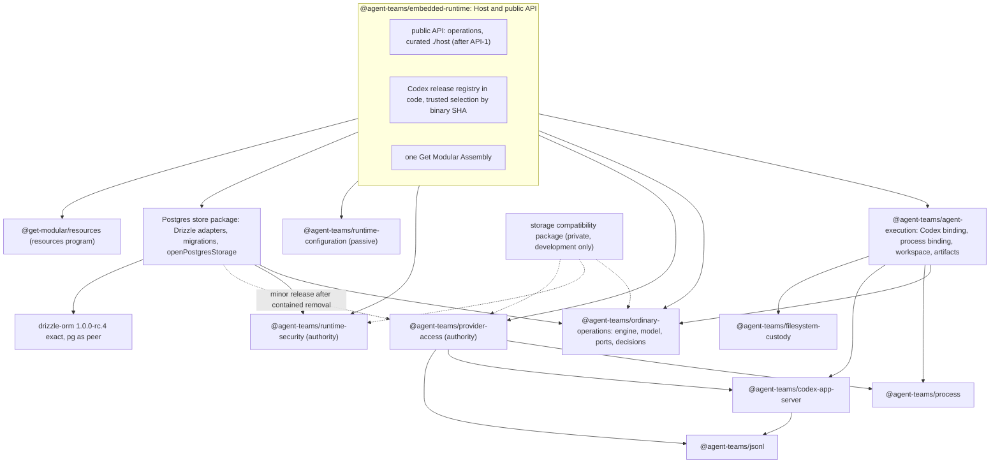

# Agent Runtime Architecture Program Plan

Version of 2026-10-02. Planning document only. Nothing in this file by itself authorizes opening a pull request, publishing a package or running Codex. Every pull request listed here is merged only by the owner.

Source snapshot for sizes and paths: agent-runtime `b0bcb265`. Current main is `706d475f` (2026-10-02 19:53 UTC). The delta is CI, governance scripts, root `package.json` scripts and `docs/architecture/get-modular-adoption.md`: #186, #188, #187 (resources step AR-0) and #190 (resources step AR-S). No package source changed in between. Line numbers in `check-sdk-growth-profile.mjs` are at `706d475f`.

Authority: the owner decisions log of 2026-10-02 (`decisions-log-2026-10-02.md`, linked in section 10). Anything that is not in that log is marked "not decided" in this plan.

## Contents

1. Purpose and owner goals
2. Decisions
3. Target architecture
4. Lane index
5. Task cards
6. Parallel waves
7. What can be implemented right now
8. Scope exclusions and risks
9. Budget summary
10. Sources

---

## 1. Purpose and owner goals

The program makes the Codex ordinary path of agent-runtime a clean, modular reference architecture before any further feature growth, and turns the parts that other harnesses need into reusable libraries.

Owner goals (handoff section 1, decisions 1-4):

- Codex first. Ordinary is the only active execution path. Contained-turn is not developed further. Claude is not rewritten now.
- Library-first: extract what is likely to be reused, from the start. Breaking changes are allowed. Packages stay on 0.x and ship a break as a minor release with a changelog entry and a migration guide.
- Codex should always be fresh, read as "the latest verified stable release from a registry in Host code".
- Strict decomposition into modules and libraries: SOLID, Clean Architecture, DRY. Real ownership of resources, not cosmetic extraction.
- No new features during the program. Keep useful code: authority, idempotency, cleanup, parsers, validation and meaningful tests.
- One evolving v1 of our own pre-stable formats, without historical readers, but without silently dropping real records or cleanup obligations.
- Learn from OpenClaw by facts, without copying its weaker choices.

## 2. Decisions

The table mirrors the decisions log one to one. Report links point to the critique archive described in section 10.

| # | Decision | Rationale (one line) | Supporting report |
|---|---|---|---|
| 1 | Codex first. Ordinary is the only active path. Contained-turn is not developed. Claude is not rewritten. | One exemplary architecture before syncing a second provider; no second full runtime. | [handoff](../../research/architecture-critique-2026-10/handoff.md) section 1; [round 1 synthesis](../../research/architecture-critique-2026-10/round1/critique-synthesis.md) section 1 |
| 2 | Library-first under Engineering Quality Standard PR agent-teams-ai/.github#328. Breaking changes allowed. 0.x packages ship a break as a minor release with changelog and migration guide. | Extracting later costs more than adapting consumers to a deliberate break. | [governance](../../research/architecture-critique-2026-10/round2/governance-sdk-report.md) sections 5 and 7; [library decomposition](../../research/architecture-critique-2026-10/round2/library-decomposition-report.md) section 11 |
| 3 | Codex "always fresh" means the latest verified stable release from a registry in Host code. The current and the previous verified releases are accepted. Floor plus warning (OpenClaw style) is rejected. | Deny-listed features, experimental permission fields and a caller-chosen binary make "any installed release" a security regression. | [codex version](../../research/architecture-critique-2026-10/round2/codex-version-report.md) sections 3.3-3.5 and 7; [skeptic](../../research/architecture-critique-2026-10/round2/skeptic-integration-report.md) section 4 |
| 4 | Strict decomposition into modules and libraries; strict SOLID, Clean Architecture, DRY. | Owner goal; the seams around the ordinary core are where the violations are. | [core lifecycle](../../research/architecture-critique-2026-10/round1/core-lifecycle-report.md) section 5; [library decomposition](../../research/architecture-critique-2026-10/round2/library-decomposition-report.md) section 10 |
| 5 | Only agent-runtime for now. Any other agent-teams-ai repository only after owner agreement. Subscription Runtime is out of scope. | Not every repository has the same strict architecture. | [round 2 update](../../research/architecture-critique-2026-10/round2/round2-update-2026-10-02.md) section 3 |
| 6 | Gate code is not deleted. A blocking gate is removed from triggers or from `check` with a comment: why, when to return, owner, review date. | Keeps history and the return path visible; the pattern already used by PR #187. | Resources plan section 10.1; PR #187 |
| 7 | Rework SDK-growth for our needs instead of only switching it off. Reuse the safe archive reader, the packed package checks and the idea of comparing exports with a reviewed record; use a publication marker instead of hard `private` and `0.0.0`. Disable with comment: equality with the frozen C0 list, the Engineering Foundation 1.6.0 pin, historical archive hashes, statuses of the cancelled approval route. Replace them with a generated public surface report: committed file, readable diff and a `surface:update` command on failure, budgets per tier, offline and fast. The Engineering Foundation API v1 check for published packages comes later, only after Engineering Foundation replaces "an ADR per break" with "a changeset with a migration note". | The useful parts protect packed artifacts; the rest is history of a cancelled route or blocks upgrades. | [governance](../../research/architecture-critique-2026-10/round2/governance-sdk-report.md) sections 2.2, 3, 5 and 8 |
| 8 | Engineering Foundation in agent-runtime goes straight to 1.7.1. This is the first pull request, together with the SDK-growth rework, because an assert pins 1.6.0. | The pin blocks every Engineering Foundation upgrade. | [governance](../../research/architecture-critique-2026-10/round2/governance-sdk-report.md) sections 2.1 and 2.2 |
| 9 | Cheap boundaries: one source for module identity (`package.json` -> `agentTeamsArchitecture`) and for the Consumer Module Standard pin. Mechanical inventories are generated and verified with `--check`. Decisions are written by hand in one place. | A new package costs 400-750 lines of hand-written governance today; target is 40-90. | [governance](../../research/architecture-critique-2026-10/round2/governance-sdk-report.md) sections 2.3, 2.5, 3 and 4 |
| 10 | Libraries `@agent-teams/process`, `@agent-teams/jsonl`, `@agent-teams/codex-app-server`. Process is mechanism only; supervision policy stays in the Host. | Three copies of the process group invariant and two diverged Codex validators inside agent-runtime; Codex ships independently. | [library decomposition](../../research/architecture-critique-2026-10/round2/library-decomposition-report.md) sections 2 and 5; [skeptic](../../research/architecture-critique-2026-10/round2/skeptic-integration-report.md) sections 2.1-2.3 |
| 11 | Provider Access auth capture moves to the shared libraries in a separate reviewed pull request. Buffer zeroing stays in Provider Access. Migration from deprecated `getAuthStatus` to `account/read` is separate. | Provider Access is the second real consumer; the secret path needs its own review. | [library decomposition](../../research/architecture-critique-2026-10/round2/library-decomposition-report.md) section 7; [codex version](../../research/architecture-critique-2026-10/round2/codex-version-report.md) section 3.4 |
| 12 | Engine and store are packages too: `ordinary-operations` and a Postgres store package. They ship in the last phase of the core; breaking changes allowed. | Owner preference for modularity; critics listed the prerequisites (guards in domain, decoupling from contained, neutral identity). | [core lifecycle](../../research/architecture-critique-2026-10/round1/core-lifecycle-report.md) section 6; [library decomposition](../../research/architecture-critique-2026-10/round2/library-decomposition-report.md) section 6; [skeptic](../../research/architecture-critique-2026-10/round2/skeptic-integration-report.md) sections 2.4, 2.5 and 8.1 |
| 13 | npm publication right away for the new libraries (`process`, `jsonl`, `codex-app-server`, `ordinary-operations`, the store package) and `filesystem-custody`. Host, Agent Execution, Provider Access and Runtime Security after the rename to `operations`. The first publication of each package needs the owner's interactive confirmation. | Libraries without a published unit cannot be consumed elsewhere. | [governance](../../research/architecture-critique-2026-10/round2/governance-sdk-report.md) section 5 |
| 14 | Storage: correct abstractions not bound to PostgreSQL; no second backend. Port per owner in domain language; decisions in domain; the adapter reports the commit phase; the uncertain-commit policy is written in each method contract; the Host gets storage by composition (`openPostgresStorage(pool)` with `verify` and `close()`). Provider Access storage moves after contained removal because its materialization tables are shared with contained code. | Verified against the code and a Drizzle probe. | [storage verification](../../research/architecture-critique-2026-10/storage-verification/storage-report.md) sections 0, 6, 7 and 12 |
| 15 | Drizzle `1.0.0-rc.4`, exact pin (owner exception to the no-RC rule). Six mandatory adaptations: manual transactions on one `PoolClient`; migrator wrapper with advisory lock, journal per owner and `(name, hash)` check; `DrizzleQueryError` sanitized to SQLSTATE; fix the Agent Execution client wrapper that drops `values`; package-local `skipLibCheck`; `state` stays `text`. No `rc.5-<hash>` builds; watch for a clean rc.5 or GA and update agent-runtime and agent-teams-orchestrator together. | Each adaptation was reproduced by the probe. | [storage verification](../../research/architecture-critique-2026-10/storage-verification/storage-report.md) sections 1, 3, 7 (item 6) and 13 (choice 1) |
| 16 | Storage compatibility checks live in a private workspace package (not published). The uncertain-commit test lives in the Postgres package tests. The same mechanism is the general answer to the "test entry point" of issue #189. | Does not break the rejecting `./testing` test or production artifacts. | [storage verification](../../research/architecture-critique-2026-10/storage-verification/storage-report.md) sections 6.6 and 13 (choice 3) |
| 17 | On schema mismatch the Host is not created: `verify` and a typed error. Migrations are a separate command. | Fail closed; the runtime account needs no DDL rights. | [storage verification](../../research/architecture-critique-2026-10/storage-verification/storage-report.md) sections 7 (item 4) and 13 (choice 4) |
| 18 | The Postgres store package is published when the Host moves to it, with the Agent Execution and Runtime Security adapters. Provider Access is added in a minor release after contained removal. | Avoids a dependency cycle or two owners of the same tables. | [storage verification](../../research/architecture-critique-2026-10/storage-verification/storage-report.md) sections 7 (item 7) and 13 (choice 2) |
| 19 | Library standard by levels: Engineering Foundation provides neutral configurable mechanisms (surface report, isolated package install, export tiers, library template as a scaffold composition); Agent Teams conventions are text in the Engineering Quality Standard (`agent-teams-ai/.github`); each repository connects them with a small data preset. Separate task: the Engineering Foundation README calls it "for Agent Teams repositories"; changing that needs owner consent (other repository). | Mechanism in one owner, policy in text, consumers configure. | [governance](../../research/architecture-critique-2026-10/round2/governance-sdk-report.md) sections 3 and 9 |
| 20 | Feature Module Standard: now an explicit owned deviation in the agent-runtime profile for the engine and store packages. After #328 merges, a Feature Module Standard v2 amendment with a `LIBRARY_FIRST` row, accepted together with the Consumer Module Standard revision for 0.3.0. | Feature Module Standard v1 forbids extraction for a hypothetical consumer; a local profile may record an owned deviation, not reinterpret silently. | [governance](../../research/architecture-critique-2026-10/round2/governance-sdk-report.md) section 7; [skeptic](../../research/architecture-critique-2026-10/round2/skeptic-integration-report.md) section 7.2 |
| 21 | Merge PR #328 if it passes review (direct owner command). Done: merged on 2026-10-02 as `5a66a8eb` after an independent review. | Removes the blocker for decision 20. | [governance](../../research/architecture-critique-2026-10/round2/governance-sdk-report.md) section 7 |
| 22 | The plan lives in agent-runtime through docs-protocol: lane index with status, pull request cards, parallel waves, archive of both critique rounds in `research/`. A separate pull request on behalf of the owner, without merge. | This document. | - |
| 23 | Issue #189 (test debt after the Get Modular train) is synced with the plan: test entry point mechanism = decision 16; ordering after resources AR-1 and AR-1b; the rejecting `./testing` test in Agent Execution is taken into account. | One mechanism for test-only entry points. | [storage verification](../../research/architecture-critique-2026-10/storage-verification/storage-report.md) section 7 (item 5); issue #189 |

Accepted defaults (no objection from the owner):

| # | Default | Rationale | Supporting report |
|---|---|---|---|
| D1 | The absence of real rows in the three ordinary tables is not proven. The first migration refuses if an old table is not empty. | Dropping a table loses `commandId` idempotency and cleanup obligations. | [skeptic](../../research/architecture-critique-2026-10/round2/skeptic-integration-report.md) sections 3.3-3.6; [storage verification](../../research/architecture-critique-2026-10/storage-verification/storage-report.md) section 5 (item 5) |
| D2 | Pull requests that touch the Host and the Assembly come after resources AR-1. The `LaunchRecipe` type change in the Assembly happens in AR-1b. | Same files as the resources program; one integrator, sequential merges. | [round 2 update](../../research/architecture-critique-2026-10/round2/round2-update-2026-10-02.md) section 2; resources plan sections 10.2 and 10.5 |
| D3 | `operations` replaces `containedTurn` after the Codex version split and before any Host publication. | Avoids two public breaks; the first published baseline is clean. | [round 2 synthesis](../../research/architecture-critique-2026-10/round2/round2-synthesis.md) sections 3 and 5 |
| D4 | The first Codex bump to 0.159.3 happens only after the version split and with the owner's permission for a test run. | A bump before the split makes old grants impossible to retire or settle. | [codex version](../../research/architecture-critique-2026-10/round2/codex-version-report.md) section 9 |
| D5 | Resources in the Host: the journal closes after the owners. The second scope is per-grant in Provider Access (already in the resources plan). | A closed journal would make Provider Access cleanup debt permanent. | Resources plan sections 10.4 and 10.6; [skeptic](../../research/architecture-critique-2026-10/round2/skeptic-integration-report.md) section 5.6 |

### 2.1 Contradictions found between inputs

The plan follows the decisions log in every case. The items below are recorded so that nobody re-reads an older report as current.

1. **State moved after the round 2 update.** PR #187 (AR-0) merged on 2026-10-02 as `a196056f`, and PR #190 (AR-S) merged as `706d475f`. #190 already disabled the SDK-growth package inventory and export freeze (`SDK_SCOPE_DRIFT`, `SDK_EXPORT_MATRIX_DRIFT`). Still enforced on main: the Engineering Foundation 1.6.0 pin (`check-sdk-growth-profile.mjs:149-150`, `SDK_EF_VERSION_DRIFT`) and `SDK_PUBLIC_IMPORT_QUALIFICATION_DRIFT` (`:45`), which rejects any new subpath such as `./host` or `./testing` on the six existing packages. `runtime-macos` is now a required check. The round 2 update describes #187 as open and both freezes as active; that is outdated.
2. **Store package publication.** Decision 13 lists the store package under "publish right away"; decision 18 says it is published when the Host moves to it; the storage report recommended `private: true` until a second consumer. Decision 18 governs. In addition, the store package imports Runtime Security (port, decisions, codecs), and decision 13 publishes Runtime Security only after the `operations` rename. So the store package can be published only after API-1, whatever the reading of decision 13.
3. **Tombstones.** The coordinator lane "format v1 with guard and `commandId` tombstone" comes from the skeptic proposal (refuse on non-terminal rows, carry terminal `commandId` values as tombstones). Default D1 is stricter: refuse when the old table is not empty. Under D1 no rows are ever carried, so tombstone code would be dead code. The plan builds the guard only. Tombstones return only if the owner later prefers migrating terminal rows over refusing.
4. **Where the guard lives.** Round 2 placed "format v1 plus guard" before storage work. The storage verification creates new schema-qualified tables through Drizzle baseline migrations with a legacy guard. Doing both would mean two data cutovers. The plan has one cutover: the guard lives in the store package baselines (Agent Execution, Runtime Security) and in the existing Provider Access migration path, and the switch happens with STORE-3.
5. **Surface report location.** Decision 7 builds a generated surface report in agent-runtime now (first pull request), and decision 5 keeps work inside agent-runtime. Decision 19 and the library-first rule say neutral mechanisms belong in Engineering Foundation from the start. Open question Q-SURFACE (section 4.2).
6. **Provider Access storage during the transition.** Decision 14 gives the Host storage by composition through `openPostgresStorage(pool)`; decision 18 adds Provider Access to the store package only after contained removal. Until then the Host still needs a pool-backed Provider Access store. Open question Q-ACCESS-INTERIM.
7. **Issue #189 timing.** #189 says it starts after `@get-modular/conformance` 0.1.0 as well. In the resources plan that package (get-modular step GM-5) is optional for train 1. Decision 23 orders #189 after AR-1 and AR-1b; the conformance dependency may push it later.
8. **`pg` in Agent Execution.** The storage report says `pg` cannot leave the Agent Execution boundary while contained is alive (`source-dependencies.yaml:583-586`). At `b0bcb265` no file under `packages/contexts/agent-execution/src` imports `pg` or `zod` (re-checked with `grep`). Tests may still need them. To reconcile when the manifest is next touched; not a card.
9. **Registry location.** Round 2 library decomposition put the Codex release descriptor in the Agent Execution Codex binding; decision 3 puts the registry in Host code. Decision 3 governs, which makes the whole trusted selection a Host change (blocked by AR-1).
10. **`filesystem-custody` publication.** Decision 13 publishes it right away, but the package builds a native helper (`native/rename-no-replace.c`, `scripts/build-native-helper.mjs` with a closed qualified recipe). No report covers how a native helper is distributed through npm. Open question Q-NATIVE.
11. **Library publication timing.** Decision 13 says "right away" for `process`, `jsonl` and `codex-app-server`. The plan publishes them after ACCESS-LIB, when Provider Access is the second real consumer (the Feature Module Standard v1 REUSE basis of these extractions), plus isolated install and the release route. If the owner wants publication as soon as each library merges with Agent Execution as its only consumer, PUBLISH-2 moves to wave 2.

---

## 3. Target architecture

### 3.1 Package map and dependency direction

Arrows point from the depending package to the dependency. Dashed arrows are planned later steps.

Rules of the graph:

- `process` and `jsonl` depend on nothing. `codex-app-server` depends only on `jsonl`. None of the libraries imports Agent Execution, Provider Access, Runtime Security, the Host, the Assembly or `@get-modular/*`.
- `ordinary-operations` has no runtime dependencies (domain and application only).
- The store package depends on the owners whose ports it implements. Owners never depend on the store package, so there is no cycle.
- Libraries are fixed library dependencies, not Consumer Module Standard graph nodes. The eight Assembly owners stay; capability ids stay; only capability types change where a card says so.
- Inside Agent Execution, only outer adapters import the libraries. Domain and application keep importing nothing external (already enforced by Foundation source dependencies).

### 3.2 Resource owners

| Resource | Single owner | What the owner does not do |
|---|---|---|
| Child process, pipes, process group | a handle from `@agent-teams/process`, held by the Agent Execution process binding or by Provider Access auth capture | does not decide when to start or stop (binding policy); never signals a group after the leader exit has been observed |
| Framing buffer | the `@agent-teams/jsonl` reader | keeps no copies after yielding a message; zeroes consumed bytes when asked |
| Request correlation | a `@agent-teams/codex-app-server` session over a borrowed byte channel | never closes the channel, never signals the process |
| Operation flight and settlement order | the engine (`ordinary-operations`) | the authority order (process close, snapshot, publish, credential retire, Provider Access settle, Runtime Security settle, workspace removal only without uncertainty) is domain order, not LIFO, and is not replaced by a resources scope |
| Grants and credentials | Provider Access and Runtime Security | not merged: Provider Access consume is one-shot, Runtime Security consume is idempotent within TTL |
| Journal, owner scopes, storage `close()` | the Host, through `@get-modular/resources` after AR-1 | the journal closes only after the owner scope reports complete |
| `pg` Pool | the caller (borrowed) | the Host and the store package never end it |
| Codex release selection | the Host registry (code) | a caller can never pass a binary digest or a release string |
| Schema migrations | an explicit operator command (`migratePostgresStorage`) | the Host never migrates during construction; it only verifies |

### 3.3 Module, library or authority boundary

- **Libraries (packages):** `process`, `jsonl`, `codex-app-server`, `filesystem-custody` (existing), `ordinary-operations`, the Postgres store package. The storage compatibility package is a private workspace package.
- **Modules inside Agent Execution:** Codex binding (release application, strictness table, effect admission, config writer and verifier, single `turn/start`), process binding (claim gate, darwin and non-root policy, receipts, journal), workspace and artifacts adapters.
- **Module inside the Host:** Codex release registry and trusted selection.
- **Authority boundaries:** Provider Access (credential capture, broker, retire and settle), Runtime Security (admission and settlement), the claim gate in the Agent Execution process binding, the Host trusted selection.
- **Not built:** a shared contracts package, a runtime kernel, a dependency injection container, a universal authority port, a public SPI for the seven roles.

### 3.4 What is published when

| Unit | When | Conditions |
|---|---|---|
| `@agent-teams/process`, `@agent-teams/jsonl`, `@agent-teams/codex-app-server` | after ACCESS-LIB (two real consumers in the same delivery) | isolated install (GOV-4), surface report public tier, release route (PUBLISH-1), owner interactive confirmation per package (PUBLISH-2) |
| `@agent-teams/filesystem-custody` | decision 13: right away | open: native helper distribution (Q-NATIVE) |
| `@agent-teams/ordinary-operations` | after ENGINE-1 (last core phase) | same conditions as the libraries |
| Postgres store package | when the Host moves to it (STORE-3), with Agent Execution and Runtime Security adapters | Runtime Security published first, which means after API-1 (contradiction 2) |
| Host, Agent Execution, Provider Access, Runtime Security | after API-1 | owner confirmation; `runtime-configuration` is not mentioned in decision 13 (not decided) |
| Storage compatibility package | never | decision 16 |
| Provider Access adapter in the store package | minor release after contained removal | decision 18 |

### 3.5 Storage design (as corrected by the storage verification)

1. **Ports per owner, in domain language, no generic `Repository<T>`.**
   - Agent Execution `OrdinaryOperationStore`: `insertIfAbsent` instead of `accept`; `prepare(ref, expectedRevision, preparation)` and `claim(ref, expectedRevision)`; `cancel(ref)`; `append`, `finish`, `reconcile` with `ref + attemptId`.
   - Provider Access: new `OrdinaryPaGrantStore` including the broker request journal; while contained is alive, a separate `OrdinaryPaMaterializationStores` port for per-operation credential rendering.
   - Runtime Security: `OrdinarySecurityGrantStore`; the owner (guards, TTL, readback) moves to application.
   - `migrate` leaves the ports. `CommitUnknown` and `Unavailable` error classes exist separately in each owner (no shared error package).
2. **Decisions in domain.** Pure `decide*` functions and candidate factories (`newOrdinaryOperation`, `newOrdinaryPaGrant`) with explicit `now` and `newId`; the adapter reads `now` after taking the lock. Three adapter templates: insert-if-absent plus comparison; one-shot insert; lock, decide, write (CAS by revision only for Agent Execution). G1: `assertOrdinaryRowIdentity` in the row decoder.
3. **Commit phase.** The adapter classifies "not committed" against "outcome unknown". It never retries and never reads back on its own. The readback policy is part of each port method contract. Seven different semantics:

   | Method | Outcome on unknown commit |
   |---|---|
   | Agent Execution `insertIfAbsent` (accept) | application reads back: found -> `duplicate` (never `accepted`), not found -> `unknown` |
   | Agent Execution `claim` | `unknown` without readback; the process is not started |
   | Agent Execution `prepare`, `cancel`, `append`, `finish`, `reconcile` | typed exception; the engine moves the operation to reconcile |
   | Provider Access `insertGrant` (consume) | refusal without readback; no second grant ever |
   | Provider Access `retire`, `settle` | owner reads back and accepts if the target state is reached |
   | Runtime Security `insertIfAbsent` (resolve and consume) | owner reads back and accepts the existing grant |
   | Runtime Security `settle` | owner reads back and accepts if the disposition matches |

4. **Host composition.** The Host receives a storage object (structural type declared in embedded-runtime): operations, Provider Access grants and materialization, security, `close()`. The store package provides `openPostgresStorage({pool, clock?})` (read-only verify, never ends the pool, `pg` as peer), `migratePostgresStorage({pool, owners?})` and `verifyPostgresStorage({pool})`.
5. **Migrations.** Per owner: session advisory lock on one `PoolClient`, Drizzle `migrate` with journal `<owner_schema>.__migrations`, exact ordered `(name, hash)` comparison (`not_migrated`, `newer_schema`, `hash_mismatch`). Host creation only verifies and fails with a typed `ordinary_storage_unavailable` error and a reason. The journal head is checked on every transaction inside the existing `set_config` query. Baselines do not use `IF NOT EXISTS` for owner tables and carry the legacy guard (refuse when the legacy table is not empty, drop it when empty; never touch the `pa-m1` registry row or materialization tables).
6. **Compatibility checks** in a private workspace package owned by the port owners. Uncertain-commit fault injection, triggers, catalog checks and parallel migrations live in the store package tests.
7. **Drizzle `1.0.0-rc.4` exact pin** with the six adaptations (decision 15). Released migrations are never regenerated; a move to GA is its own pull request with the compatibility suites.
8. **Schemas and test isolation:** owner schemas `agent_execution`, `provider_access`, `runtime_security`; one database per test (`createdb`) instead of `search_path` isolation, because the Drizzle journal breaks `search_path` isolation.

---

## 4. Lane index

Status meanings: `ready` = decided and clear how to implement; `needs-decision` = an exact owner question is open; `blocked` = waits for another card or event; `external` = owned by another program, only sync points listed.

### 4.1 Lanes

| Lane | Cards | Status | Notes |
|---|---|---|---|
| Governance: Engineering Foundation 1.7.1 and SDK-growth rework | GOV-1 | ready | first pull request (decision 8) |
| Governance: cheap boundaries, agent-runtime side | GOV-2 | ready | includes the Feature Module Standard owned deviation (decision 20) |
| Governance: Consumer Module Standard census generation | GOV-3 | blocked | needs a Consumer Module Standard sentence that a generated inventory with committed diff is review, not "automatic legacy inventory expansion" (get-modular step GM-6); same files as AR-1 and AR-1b |
| Governance: isolated single-root install | GOV-4 | ready (after GOV-1) | prerequisite of every packed proof and publication |
| Surface report | part of GOV-1 | ready | Q-SURFACE does not block GOV-1: decisions 7 and 8 put the first version in agent-runtime |
| Seams in place | SEAM-1 | ready | open note Q-LAUNCH-CONFIG does not block |
| Codex version split, domains and format v1 | VERSION-1 | ready (wave 3) | data format change; not for "right now" |
| Codex release registry and trusted selection | VERSION-2 | blocked | Host change, waits for AR-1 |
| Protocol revisions as data | LIB-CODEX-2 | ready (after LIB-CODEX-1) | strictness tolerance is Q-STRICTNESS |
| Format v1 with guard (tombstone not built, contradiction 3) | VERSION-1, STORE-2-execution, STORE-2-security, STORE-3 | ready (wave 3) / blocked (STORE-3) | one data cutover at STORE-3 |
| Library `jsonl` | LIB-JSONL | ready (after GOV-1, SEAM-1, GOV-4) | |
| Library `process` | LIB-PROCESS | ready (after GOV-1, SEAM-1, GOV-4) | |
| Library `codex-app-server` | LIB-CODEX-1, LIB-CODEX-2 | ready (after LIB-JSONL) | |
| Provider Access migration to libraries | ACCESS-LIB | ready (after LIB-PROCESS, LIB-CODEX-2) | secret path, separate review |
| Provider Access `getAuthStatus` -> `account/read` | ACCESS-ACCOUNT | needs-decision | Q-ACCOUNT-READ |
| Storage S1a, S1b, S1c (ports and domain decisions, no Drizzle) | STORE-1a, STORE-1b, STORE-1c | ready | |
| Storage S0 (package, Drizzle catalog, compatibility package skeleton) | STORE-0 | ready (after GOV-1, GOV-2) | |
| Storage S2 (runtime, adapters) | STORE-2-core, STORE-2-execution, STORE-2-security | ready (after dependencies) | |
| Storage S3 (Host composition, migration command, verify) | STORE-3 | blocked | AR-1; Q-ACCESS-INTERIM |
| Provider Access storage in the store package | STORE-2-access | blocked | contained removal (decision 14) |
| Engine package `ordinary-operations` | ENGINE-0, ENGINE-1 | blocked | STORE-1a, VERSION-1; Q-RESTART recommended before ENGINE-1 |
| Public API `operations` and curated `./host` | API-1 | blocked | VERSION-1, VERSION-2, GOV-1, GOV-2, AR-1 (and AR-1b for Assembly types) |
| Library standard (Engineering Foundation mechanisms, Engineering Quality Standard conventions, data presets) | STANDARD-1 | needs-decision | Q-SURFACE, Q-STANDARD-REPO |
| Feature Module Standard deviation | inside GOV-2 | ready | decision 20 |
| Feature Module Standard v2 (`LIBRARY_FIRST`) | FEATURE-STANDARD-2 | external | `.github`; unblocked since #328 merged (`5a66a8eb`); lands together with the Consumer Module Standard 0.3.0 revision |
| Release route | PUBLISH-1 | ready (after GOV-4) | building the route has no external effect |
| First publications | PUBLISH-2, PUBLISH-3 | needs-decision | owner confirmation per package; Q-NATIVE |
| Bump tool | BUMP-1 | blocked | LIB-CODEX-2, VERSION-2; Q-FEATURES; scope not in the decisions log |
| First bump to 0.159.3 | BUMP-2 | needs-decision | owner permission for the TEST canary (D4) |
| G1 (row identity) | inside STORE-1a | ready | |
| G2 (failed workspace preparation without cleanup-only handle) | GAP-G2 | needs-decision | Q-G2 |
| Owner-loss of `running` operations | OWNER-LOSS | needs-decision (design) | Q-RESTART |
| Orphan process group after Host SIGKILL | ORPHAN-GROUP | known limitation | `process` exposes start identity so a future reaper stays possible; no work now |
| Contained removal | CONTAINED-REMOVAL | needs-decision | separate reachability and obligations review (Q-CONTAINED) |
| Issue #189 test debt | ISSUE-189 | external | sync points in section 6.4; briefs in [test-debt-189-plan](test-debt-189-plan.md) |
| Resources AR-0 | - | external (done) | PR #187 merged `a196056f`; AR-S PR #190 merged `706d475f` |
| Resources AR-1 | - | external | waits for get-modular step R-1b (publication of Core and Assembly 0.3.0 and resources 0.1.0) |
| Resources AR-1b | - | external | after AR-1; carries the Assembly `LaunchRecipe` type switch (D2) |
| Resources AR-2 | - | external | per-grant scope in the Provider Access owner; same file as STORE-1c and ACCESS-LIB |

### 4.2 Open questions

Options are listed best first. Scores: confidence / reliability, out of 10. None of these is decided.

- **Q-SURFACE. Where does the surface report mechanism live?** (decision 7 against decision 19 and library-first)
  - (a) Recommended: build it in agent-runtime in GOV-1 as a small repository-neutral script configured by data, with a recorded owner and a removal step "moves to Engineering Foundation when STANDARD-1 is approved". 7 / 8.
  - (b) Build it in Engineering Foundation first, agent-runtime consumes a release. Needs owner consent for that repository now (decision 5) and delays decision 8. 6 / 8.
  - (c) GOV-1 only disables asserts; no surface report until Engineering Foundation has it. Leaves new subpaths unreviewed by any check. 5 / 6.
- **Q-STANDARD-REPO. When may work start in Engineering Foundation and `.github` for decision 19?** Options: (a) after GOV-1 shows the mechanism in agent-runtime, one consent for the three mechanisms, 7 / 8; (b) per mechanism consent, 6 / 8; (c) not in this program, 5 / 7. The README wording fix needs separate consent in all cases.
- **Q-LAUNCH-CONFIG. ADR-0090:91 says Runtime Configuration owns immutable launch configuration; the code keeps the recipe and config verification in Agent Execution.** (a) Recommended: keep the recipe next to the config verification and record a successor note to ADR-0090 (round 1 core section 3.2), 7 / 8; (b) move recipe and writer to Runtime Configuration, 5 / 7; (c) leave the discrepancy undocumented, 3 / 5.
- **Q-STRICTNESS. Should informational Codex shapes (rate limits, token usage, thread metadata, error info) become tolerant of added fields within a verified release?** (a) Recommended: yes, per-shape table, security and effect shapes stay closed, decided per bump in review, 7 / 8; (b) all closed (today), every additive field is a code change, 7 / 7; (c) tolerant by default, 3 / 4.
- **Q-FEATURES. How is the disabled-feature deny-list closed before a bump?** (a) Recommended: compute the disable set at bump time from the exact upstream tag and store it in the release record; the canary compares effective config, 7 / 8; (b) runtime "every feature false except an allowlist", but `config/read` shows only 16 of 145 features, 4 / 5; (c) keep the deny-list and rely on the exact SHA only, 6 / 6.
- **Q-BROKER-HEADER. The Provider Access broker check `headers.version !== '0.153.4'` echoes our own config.** (a) Recommended: take the expected value from the release record, 7 / 8; (b) drop the header and its check since the capability token carries authority, 6 / 7; (c) keep the literal, 3 / 5.
- **Q-SECURITY-POLICY-DECODE. Runtime Security compares the stored policy with the current one by `JSON.stringify`, so any Host policy change (TTL, limits) makes unsettled grants undecodable.** (a) Recommended: compare identity fields and use the recorded limits for settlement, decided in VERSION-1 review, 6 / 7; (b) keep full comparison and require drain before any policy change, 7 / 7; (c) accept any stored policy, 3 / 4.
- **Q-ACCESS-INTERIM. How does the Host get Provider Access storage between STORE-3 and contained removal?** (a) Recommended: `storage` from the store package for Agent Execution and Runtime Security, plus the existing pool-backed Provider Access owner, with recorded owner and removal step, 7 / 7; (b) the store package wraps the Provider Access raw store as a facade, 5 / 6 (pulls Provider Access into the package early); (c) delay STORE-3 until contained removal, 6 / 8 (long delay).
- **Q-ACCOUNT-READ. Does `account/read` give Provider Access the same token material as `getAuthStatus({includeToken: true})`?** Unknown. (a) Recommended: verify against the retained 0.153.4 schema and decide before the first bump, 7 / 8; (b) migrate together with BUMP-2, 5 / 7; (c) wait until upstream removes the method, 3 / 4.
- **Q-G2.** (a) Recommended: cleanup-only workspace handle owned by the engine flight, plus a durable `workspace_retained` receipt added in VERSION-1 (format change done once), 6 / 8; (b) handle only, journal stays the only durable trace, 6 / 6; (c) document as limitation, 5 / 5.
- **Q-RESTART (owner-loss).** (a) Recommended: record now that orphaned non-terminal operations are projected as `reconcile_required` after the durable authority expiry upper bound; implement as an honest-status fix before ENGINE-1, 6 / 7; (b) durable lease with takeover, a new feature, 4 / 7; (c) document only, 6 / 5.
- **Q-PUBLISH.** For each first publication: owner confirmation, and where the disposable TEST consumer lives. (a) Recommended: the GOV-4 temporary consumer is the TEST project; a TEST repository only with owner agreement (decision 5), 6 / 7; (b) `modularity-host-TEST`, needs agreement, 6 / 8; (c) no TEST project, 3 / 5.
- **Q-NATIVE. `filesystem-custody` native helper on npm.** (a) Recommended: decide before publication between prebuilt per-platform artifacts and a pure JavaScript fallback; needs its own short design, 5 / 7; (b) publish without the helper path, 4 / 5; (c) postpone `filesystem-custody` publication, 6 / 8.
- **Q-CONTAINED. Start the contained removal review now or after the libraries?** (a) Recommended: start the read-only reachability and obligations review in parallel; removal pull requests after ACCESS-LIB, 6 / 8; (b) after API-1, 6 / 8; (c) not in this program, 5 / 7.
- **Q-NAMES. Working names** `@agent-teams/runtime-store-postgres` and `@agent-teams/runtime-storage-conformance`, and subpath names `./protocol` and `./turn` of `codex-app-server`, are not decided. Recommended: settle them in STORE-0 and LIB-CODEX-1 review.

---

## 5. Task cards

### 5.0 Rules that apply to every card

- **Acceptance baseline:** rejecting tests for every invariant the card touches; `pnpm check:changed` during work, then `pnpm check:fast`, then the full `pnpm check` on the exact head before review. Required checks green on the head: `commit-author-identity`, `check`, `docs-protocol / docs-protocol-check`, `postgres-durability`, `runtime-macos`.
- **Review:** one independent reviewer per pull request; a new review after fixes; merge only by the owner. Every card below uses this rule; cards that need an extra reviewer (Provider Access owner) say so.
- **Commits:** author and committer from the repository's local git config (the owner's identity); conventional commits with issue references; no `codex/` branches.
- **Gates:** never delete gate code. Disable with a comment stating why, when to return, owner and review date (decision 6). Each governance pull request lists in its body what stays enforcing.
- **Consumer Module Standard:** before any change to a capability contract or boundary, compare the pin with upstream. Today the pin `9c722ce` still matches: `docs/architecture/common-assembly.md` in get-modular last changed in `461bff0c` (2026-09-28). Capability ids do not change in any card before AR-1b.
- **Breaking changes:** allowed; 0.x packages ship a break as minor with changelog and migration guide. Persisted formats still need a safe migration (D1).
- **No live provider runs.** `pnpm check` stays synthetic. Any Codex canary needs explicit owner permission.
- **Size:** at most about 2000 changed lines per pull request; moves are counted separately.

### 5.1 Governance

#### GOV-1. Engineering Foundation 1.7.1 and SDK-growth rework

- **Lane:** governance. **Status:** ready. **Owner:** integrator. **First pull request** (decision 8).
- **Goal:**
  - Bump `@agent-teams/engineering-foundation` from 1.6.0 to 1.7.1 (root `package.json` devDependencies, line 99 at `b0bcb265`) and adapt to its changes (1.7.0 allows Node 24 and 26 strict engines; 1.7.1 widens quality coverage to declared source under generated-output directories).
  - Disable with comment the remaining history asserts in `scripts/architecture/check-sdk-growth-profile.mjs`: the Engineering Foundation 1.6.0 version, source, archive and registry identity asserts (`:59-67`, `:149-156`), historical archive and pack evidence hashes (`:20-56`), cancelled approval and typed-audit statuses (`:178-212`), plus their tests. Keep the C0 contract hash check (history guard).
  - Replace `SDK_PUBLIC_IMPORT_QUALIFICATION_DRIFT` (`:45`) with a generated public surface report: committed file, `pnpm surface:update` to regenerate, a check in `check` and `check:fast` that fails with a readable diff and the update command, budgets per export tier (OpenClaw style counters), offline and fast. Names for public and host tiers, counts for workspace-internal tiers.
  - Add the publication marker in `package.json` -> `agentTeamsArchitecture` (for example `publish` and an export tier), read by the report. It replaces the hard `private` and `0.0.0` asserts that #190 already disabled.
- **Non-goals:** no new package or subpath; no edit of `architecture/c0/**` or `architecture/sdk-growth/*` historical bytes; no gate code deletion; no Engineering Foundation API v1 activation; no isolated install (GOV-4); no re-enabling of C0 or L0; no Host change.
- **Files:** root `package.json`, `pnpm-lock.yaml`, `scripts/architecture/check-sdk-growth-profile.mjs` and its test, new `scripts/architecture/public-surface/*` with tests, the committed report, `agentTeamsArchitecture` blocks of the workspace packages, `docs/architecture/get-modular-adoption.md`.
- **Invariants:** Foundation source-dependency boundaries unchanged and enforcing; `check-cms-pin.mjs` unchanged; every export key of every workspace package appears in the report; a new subpath fails until the report is updated and committed; budgets fail closed; generation deterministic; no network in `check`.
- **Acceptance:** rejecting tests: an added subpath without report update fails with diff and command; a tier over budget fails; two generations are byte-identical. `foundation:check` passes on 1.7.1. Pull request body lists what stays enforcing.
- **Depends on:** nothing.
- **Budget:** 700-1400 changed, 0 moves. If the Engineering Foundation bump brings coverage fallout, split into GOV-1a (bump and disables, keeps `SDK_PUBLIC_IMPORT_QUALIFICATION_DRIFT`) and GOV-1b (surface report replacing it).
- **Open:** Q-SURFACE.

#### GOV-2. Cheap boundaries in agent-runtime

- **Lane:** governance. **Status:** ready. **Owner:** integrator.
- **Goal:**
  - `package.json` -> `agentTeamsArchitecture` (role, owner document, tier, publication marker) becomes the single source read by the Feature Module Standard checker and the scaffold configuration. Remove the checker-held copies `REVIEWED_PRODUCTION_MODULES` and `CURATED_EXPORT_SET` (`scripts/architecture/feature-module-profile.mjs:59-73`) and the remaining duplicate fields of `EXPECTED_PROFILE` in `check-consumer-module-standard.mjs`.
  - Generate with `--check` (write mode as a separate command) the mechanical fields of `architecture/feature-module-standard/candidate-profile.json` (production modules, roots, module roots, abstract layout) and `compositionDependencies` of `ordinary-scope.json`.
  - Replace file-name selection in `check-ordinary-feature-scope.mjs:13,54` with explicit roots, so a rename or move cannot silently narrow enforcement.
  - One source for the Consumer Module Standard pin (today both profiles carry it and a check compares them).
  - Record the Feature Module Standard owned deviation for the engine and store packages in the agent-runtime profile: scope (named packages), rationale (decision 12), owner, review trigger (adoption of Feature Module Standard v2).
  - Successor ADR (through `pnpm docs:new`) to the ADR-0017 clauses on the export set (`:64-66`) and on the reviewed registry and per-module activation ADRs (`:85-89`): one decision record per extraction program instead of two ADRs per module. The owner confirms this wording at review.
- **Non-goals:** no `consumer-profile.json` relationship generation (GOV-3); no Foundation allow groups (Engineering Foundation change); no new package; no Host change; no Foundation boundary change.
- **Files:** `scripts/architecture/feature-module-profile.mjs`, `feature-module-workspace.mjs`, `check-ordinary-feature-scope.mjs`, new generators, `architecture/feature-module-standard/*.json`, `architecture/consumer-module-standard/*profile.json`, `check-consumer-module-standard.mjs`, `agentTeamsArchitecture` blocks, `architecture/foundation/scaffold*.yaml`, new ADR and `architecture/decisions/accepted-decisions.json`.
- **Invariants:** decisions are hand-written in one place; generated inventories are committed and visible in diffs; drift fails `--check`; accepted ADR bytes untouched (successor only); one Assembly authority and typed rejection checks unchanged; ordinary scope never shrinks.
- **Acceptance:** rejecting tests: drift in a generated field fails; a package without `agentTeamsArchitecture` fails; a renamed ordinary file stays governed; the deviation record passes schema validation.
- **Depends on:** GOV-1 (merge order; both edit `package.json` scripts).
- **Budget:** 500-1100 changed, 0 moves.

#### GOV-3. Consumer Module Standard census generation (stub)

- **Status:** blocked by (1) a Consumer Module Standard sentence allowing generated inventories with committed diffs (planned in get-modular step GM-6, the revision for 0.3.0) and (2) AR-1 and AR-1b, which edit `consumer-profile.json` and `check-get-modular-adoption.mjs`.
- **Goal:** `get-modular-source-census.mjs --write/--check` generates relationships, `sourceCensus` and boundary mirrors of `consumer-profile.json` (939 edges today, 82% contained-only).
- **Budget:** 300-600 changed. Owner: integrator.

#### GOV-4. Isolated single-root install

- **Lane:** governance. **Status:** ready after GOV-1. **Owner:** worker D for the scripts, integrator for `package.json` wiring.
- **Goal:** for every package with the publication marker: pack it, install the tarball alone into a temporary consumer outside the repository (no workspace links, no hoisting from the checkout, offline from the existing pnpm store), then assert: export targets exist in the archive, no `src/` leak, private deep paths rejected in runtime and in types, declared dependency closure sufficient including declarations and resources. Reuse `assertPackedSdkArchive`, `assertPublicImports`, `assertPrivateDeepPathsRejected` (`scripts/architecture/qualify-sdk-packages.mjs:30-67`) and the safe archive reader `scripts/sdk-growth-source/archive.mjs`. The temporary consumer is the disposable test consumer for publication.
- **Non-goals:** no publication; no release workflow; no Engineering Foundation capability.
- **Files:** `scripts/architecture/isolated-install/*`, tests; `package.json` script entry.
- **Invariants:** the temporary root is outside the repository (a temp directory inside the repository hides missing dependencies, as the resources plan found); nothing is resolved from checkout `node_modules`; deterministic.
- **Acceptance:** rejecting tests: an undeclared dependency fails; a deep private import fails in runtime and in types; a missing declaration file fails. First real target: `filesystem-custody` if its native helper allows it, otherwise the first new library.
- **Depends on:** GOV-1.
- **Budget:** 250-500 changed, 50-100 moves.

### 5.2 Seams in place

#### SEAM-1. Opaque byte channel, single framing pass, Agent Execution-owned launch recipe

- **Lane:** seams. **Status:** ready (decision 10 needs one framing owner and a byte channel before extraction; D2 implies the Agent Execution-owned `LaunchRecipe` type).
- **Owner:** integrator for `application/ordinary-ports.ts` and `application/ordinary-engine.ts`; worker A for the adapters and tests.
- **Goal:**
  1. Replace `OrdinaryTransport {lines: AsyncIterable<string>}` (`ordinary-ports.ts:41-45`) with an opaque channel handle. The engine passes it from `reservation.start` to `provider.execute` without reading it.
  2. Move line framing from the process adapter (`node-ordinary-process.ts:105-119`) to the Codex side inside Agent Execution: one pass over bytes, removing the bytes-text-bytes round trip (`ordinary-codex-protocol.ts:17-19`). The 256-line queue becomes an equivalent byte bound.
  3. `OrdinaryLaunchSpecification` and `OrdinaryLaunchRecipe` become Agent Execution application port types. `NodeOrdinaryProcessOptions["prepareLaunch"]` becomes an alias, so the embedded-runtime Assembly (`ordinary-runtime-assembly.ts:18`) is unchanged until AR-1b. Codex config stops importing from the Node process adapter (`ordinary-codex-config.ts:6`).
  4. Remove the `prepared` Map (`ordinary-codex-provider.ts:40-54, 141`). `provider.execute` receives the non-confidential credential facts (broker endpoint, materialization id, generation) explicitly. No credential material survives a failed or unknown claim.
  5. `output_drain` is assembled in the Agent Execution process binding from three facts: process EOF on both streams with zero unread bytes, clean framing EOF without a tail, and the engine final sequence.
- **Non-goals:** no new package; no limit value change; no protocol validator change; no Host or Assembly source change; no persisted format change; no contained code change; no new backpressure capability beyond the byte bound.
- **Files:** Agent Execution `application/ordinary-ports.ts`, `application/ordinary-engine.ts` (integrator); `adapters/outbound/ordinary-process/node-ordinary-process.ts`, `adapters/outbound/ordinary-codex/ordinary-codex-protocol.ts`, `ordinary-codex-provider.ts`, `ordinary-codex-config.ts`, a new ordinary framing module, tests `ordinary-node-process.test.ts`, `ordinary-codex.test.ts`, `ordinary-core.test.ts` (worker A). embedded-runtime test fixtures (`ordinary-host-ownership.fixture.ts:53`, `ordinary-runtime-assembly.test.ts`) only if unavoidable; no embedded-runtime source.
- **Invariants:** claim before start; start at most once; synchronous pre-spawn observation hook (a Promise or a throw is a refusal before spawn); no second `turn/start` after a possibly written request; shared 1 MiB stdout+stderr budget; 262144-byte line limit; fatal UTF-8 on stdout and on stderr, stderr zeroed and discarded; refusing an unterminated tail on EOF; unread data at close makes the drain invalid; CR stripped, empty lines skipped; duplicate decoded keys refused; 2048 messages and 1 MiB JSON limits; no signal to the group after the leader exit has been observed; unknown claim never starts a process.
- **Acceptance:** a parity matrix with one rejecting case per invariant; existing tests pass (`ordinary-node-process.test.ts:11, 34, 45, 55, 67, 77, 126, 192`; `ordinary-codex.test.ts:84, 94`; `ordinary-core.test.ts:92, 97, 104, 112, 170, 181`; `ordinary-runtime-assembly.test.ts:13, 76`); new test: a failed claim leaves no provider-held credential state.
- **Depends on:** nothing (merge after GOV-1).
- **Budget:** 350-800 changed, 0-60 moves.
- **Open:** Q-LAUNCH-CONFIG (documentation only, does not block).

### 5.3 Codex version split

#### VERSION-1. Profile and release split in the domains, ordinary format v1

- **Lane:** Codex version split and format v1. **Status:** ready, wave 3 (decision 3, default D1). Data format change: not part of "right now". **Owner:** integrator.
- **Goal:**
  - Split `capabilityManifestRevision` (`ordinary-codex-macos-arm64-0.153.4-v1`) into a stable profile revision (for example `ordinary-codex-macos-arm64-v1`, a branded string, not a literal type in the domain) stored by Agent Execution, Provider Access and Runtime Security, and a Codex release fact attached to the attempt at `prepare` and pinned by the dispatch claim preparation digest. Until VERSION-2 the release comes from the current constant in the Agent Execution Codex binding.
  - New ordinary format identity (for example `ordinary.operation/1`), distinct from the historical contained "V1" of ADR-0090:42-46 and the table `agent_execution.contained_turn_operation_v1`.
  - Provider-neutral provider terminal references (no `threadId`/`turnId` names in the neutral model; basis: decision 12 and one evolving v1; naming checked at review).
  - Engine view built from the stored operation, not from the constant (`ordinary-engine.ts:9`).
  - Golden vectors for command fingerprint and state digest.
  - Provider Access and Runtime Security compare with the profile revision instead of their own literals (`ordinary-provider-access.ts:25-26`, `ordinary-security-policy.ts:39`).
  - Public view literal in embedded-runtime (`runtime-access.ts:233`, mapper `contained-turn-runtime-validation.ts:196-199, 257`) changes to the profile literal. Ordinary and contained are still told apart by the presence of the profile fields; the explicit discriminator comes with API-1.
  - Provider Access guard (D1 for the table that does not move): the existing Provider Access migration refuses with a typed error when `provider_access.ordinary_grant` holds a row whose binding carries another profile revision. DDL text and digest unchanged.
- **Non-goals:** no Host composition change (the Host keeps passing `{...ORDINARY_PROFILE, ...}`); no release registry; no Drizzle; no `operations` rename; no change of the Runtime Security policy comparison unless Q-SECURITY-POLICY-DECODE is decided.
- **Files:** Agent Execution `domain/ordinary-model.ts`, `domain/ordinary-validation.ts`, `application/ordinary-ports.ts`, `application/ordinary-engine.ts`, `composition/ordinary-feature-factory.ts`, `adapters/outbound/postgres/ordinary-state-codec.ts`, `ordinary-postgres-store.ts`, the Codex binding release fact; Provider Access `contracts/ordinary-provider-access.ts`, `domain/ordinary-provider-access.ts`, owner migration guard; Runtime Security `domain/ordinary-security-policy.ts`; embedded-runtime `runtime-access.ts` and the mapper; ordinary tests and fixtures with the literal (contained keeps 0.153.4).
- **Invariants:** claim refuses when the prepared release differs from the binding release; an old-profile row is never accepted silently; digest is computed over the exact `state` text; Provider Access consume stays one-shot; Runtime Security consume stays idempotent within TTL; unknown commit never grants a retry.
- **Acceptance:** rejecting tests: claim with another release -> `not_claimed`; Provider Access migration refuses an old-profile row; codecs refuse the old literal; golden vectors; the view shows the stored profile.
- **Depends on:** STORE-1a, STORE-1b, STORE-1c (same files), SEAM-1.
- **Budget:** 500-1000 changed, 0-60 moves.

#### VERSION-2. Release registry in Host code and trusted selection (stub)

- **Status:** blocked by AR-1 (Host composition).
- **Goal:** release records in Host code (CLI version, platform, binary SHA-256, npm integrity, provenance, protocol revision, disabled feature set, expected startup warnings, model, user agent pattern, broker header value); the Host hashes `executablePath` once at creation and selects a record; the current and the previous verified records are accepted; an unknown binary is refused with a clear error; the per-launch byte recheck stays (TOCTOU). The record is passed to the Agent Execution Codex binding, Provider Access auth capture and the broker. Release literals leave Agent Execution and Provider Access (binary SHA in three places, model in three, two deny-lists, header version, CLI version, user agent). Successor ADR to ADR-0090 records the release policy (it also answers the Engineering Quality Standard clause "freshness alone does not authorize an unrelated upgrade of a pinned protocol").
- **Invariants:** the SHA allowlist is code, never a Host option; a caller cannot pass a digest or a release id string; security validators (sandbox, permissions, approval policy, config layers, server requests, effect items, broker egress) stay exact per record.
- **Open:** Q-BROKER-HEADER, Q-FEATURES.
- **Budget:** 350-700 changed, 0-40 moves. Owner: integrator.

### 5.4 Libraries

#### LIB-JSONL. `@agent-teams/jsonl`

- **Lane:** libraries. **Status:** ready after GOV-1 (decision 10). **Owner:** worker A for `packages/platform/jsonl/**` and the Agent Execution call sites; integrator for root manifests, lock, Foundation boundary, Feature Module Standard entry, surface report update and the extraction decision record.
- **Goal:** strict bounded NDJSON framing over `Uint8Array` with `TextDecoder` only (no `node:*`): fatal UTF-8; duplicate decoded keys refused with a depth limit (take 32 from Provider Access); line, message and total limits; CR stripping; empty-line skipping; unterminated tail on EOF refused; clean-EOF fact; JSON-object-only option; encoder; pull model without an internal queue; optional zeroing of consumed bytes (for the Provider Access secret path). The ordinary Codex side of Agent Execution uses it (the SEAM-1 framing module becomes a call into the library). Contained keeps its own `codex-app-server-jsonl.ts` copy with a recorded owner and removal step (CONTAINED-REMOVAL).
- **Non-goals:** no tolerant recovery (do not take OpenClaw decoder behavior); no protocol semantics; no Provider Access switch; no publication.
- **Invariants:** fatal UTF-8; duplicate keys refused; unterminated tail refused; limits enforced; no copies retained after a message is yielded (no `Buffer.concat` copy left unzeroed when zeroing is on).
- **Acceptance:** parity with `codex-app-server-jsonl.ts` behavior and the cases of `codex-app-server-linear-framing.test.ts`; Provider Access `ordinary-codex-auth-json.ts` cases (depth); isolated install (GOV-4); surface report entry.
- **Extraction basis (record in the decision record):** Feature Module Standard v1 REUSE, Agent Execution and Provider Access (ACCESS-LIB).
- **Depends on:** GOV-1, SEAM-1, GOV-4.
- **Budget:** 450-800 changed, 150-250 moves.

#### LIB-PROCESS. `@agent-teams/process`

- **Lane:** libraries. **Status:** ready after GOV-1 and SEAM-1. **Owner:** worker B for `packages/platform/process/**` and `adapters/outbound/ordinary-process/**`; integrator for root and governance files.
- **Goal:** mechanism only:
  - spawn without a shell, explicit environment and working directory, own process group;
  - two phases, prepare then start, start exactly once;
  - synchronous observation hook that must return `undefined` (a Promise or a throw is a refusal before spawn);
  - pull-based `readable: AsyncIterable<Uint8Array>` with backpressure;
  - limits per stream, a shared total budget as a parameter (Agent Execution 1 MiB, Provider Access 262144), a write limit;
  - stderr policy (`discard-zeroize`, `validate-utf8-and-discard`, bounded capture), strict by default;
  - escalation close input, then TERM, then KILL within caller budgets, only while the leader exit has not been observed;
  - idempotent `close(options?: {escalate?: AbortSignal})` with memoized success and retry after failure, returning separate facts (`exitObserved`, `stdoutEof`, `stderrEof`, `groupEmptyObserved`, `unreadBytes`, overflow or invalid input) or uncertainty; no `Symbol.asyncDispose`;
  - start identity `{pid, pgid}` exposed.
  The Agent Execution process binding keeps the claim gate (`node-ordinary-process.ts:143-149`), darwin and non-root policy (`:58`), receipt translation, journal and environment cleaning.
- **Non-goals:** no supervision policy, no claim, no receipts, no PID recovery or reaper, no Windows, no PTY, no framing, no Provider Access switch. Claude spawn hook (`claude-agent-sdk-query-contracts.ts:15-28`) only as a written compatibility note in the pull request.
- **Invariants:** claim before start (binding); start at most once; synchronous pre-spawn hook; shared byte budget across both streams; fatal UTF-8 on stderr with zeroing; no signal after the leader exit has been observed; close idempotent; facts are separate, never one `done: true`.
- **Acceptance:** handle guard plus `--test-force-exit` from the first test (decision Q2 of [test-debt-189-plan](test-debt-189-plan.md)); existing `ordinary-node-process.test.ts` cases split across library and binding; rejecting tests: async hook refused before spawn; no group signal after observed leader exit; budget shared across streams; invalid stderr UTF-8 fails and zeroes; repeated close returns the same facts; isolated install; `runtime-macos` green.
- **Extraction basis:** REUSE (Agent Execution and Provider Access); the invariant lives in three copies inside agent-runtime.
- **Depends on:** GOV-1, SEAM-1, GOV-4.
- **Budget:** 800-1400 changed, 150-300 moves.

#### LIB-CODEX-1. `@agent-teams/codex-app-server`: session

- **Lane:** libraries. **Status:** ready after LIB-JSONL and SEAM-1. **Owner:** worker A for the package and `adapters/outbound/ordinary-codex/**`; integrator for root and governance files.
- **Goal:** root entry with a session over a borrowed byte channel: request and response correlation with id `string | number`; notification buffering in arrival order; explicit send disposition (`not_written`, `possibly_written`, `answered`); server-to-client requests refused by default; `detach()` never closes the channel or signals the process; no retry; envelope without `jsonrpc`; `initialize` and `initialized` helpers. The Agent Execution Codex binding switches to it (`ordinary-codex-protocol.ts:8-47`).
- **Non-goals:** no protocol revisions (LIB-CODEX-2); no effect admission, config or sandbox checks (stay in Agent Execution); no process ownership; no approvals, resume or WebSocket; no Provider Access switch.
- **Invariants:** no second `turn/start` after a possibly written request; closing the connection ends correlation, not the possibly written native operation; the client never owns the process; abort writes zero commands.
- **Acceptance:** handle guard plus `--test-force-exit` from the first test (decision Q2 of [test-debt-189-plan](test-debt-189-plan.md)); `ordinary-codex.test.ts:84, 94` parity; rejecting tests: no retry possible after `possibly_written`; server request refused; `detach()` leaves the channel open; isolated install.
- **Extraction basis:** Feature Module Standard v1 DEPENDENCY_LIFECYCLE (12 stable Codex releases in 26 days after 0.153.4) and REUSE (Agent Execution and Provider Access).
- **Depends on:** LIB-JSONL, SEAM-1.
- **Budget:** 600-1100 changed, 250-400 moves.

#### LIB-CODEX-2. Protocol revisions as data and the turn reducer

- **Lane:** protocol revisions as data. **Status:** ready after LIB-CODEX-1 (basis: decisions 3 and 10; tolerance is Q-STRICTNESS). **Owner:** worker A; integrator for governance.
- **Goal:**
  - Protocol revisions as data (working subpath `./protocol`): projection of the consumed shapes generated from the retained 0.153.4 schema (byte-identical to the upstream precomputed export, codex version report section 3.2) with a digest; validators derived from the projection for the selected messages (initialize, thread/start, turn/start, item notifications, turn/completed, config/read, account/read, account/rateLimits/read, model/list, remoteControl/status/changed).
  - A strictness table per shape with every shape `closed` (today's behavior).
  - API that allows two revisions side by side, chosen by the caller per session (decision 3 accepts the current and the previous verified release).
  - Turn reducer (working subpath `./turn`) for thread, turn, item and terminal semantics with policy hooks implemented by Agent Execution.
  - Split `ordinary-codex-items.ts`: structural validation in the library; effect admission (paths inside cwd, item type allowlist, unknown item type refused) stays exact in Agent Execution.
  - Generator and check scripts are repository development scripts, not shipped. Contained keeps its own frozen generated schema copy with owner and removal step.
- **Non-goals:** no tolerance change unless Q-STRICTNESS is decided; no new Codex release; no network fetch; no bump tool; no Provider Access switch; no change of effect admission rules.
- **Invariants:** security validators exact (sandbox, permissions, approval policy, config layers, server requests, effect items); closed method list (`ordinary-codex-protocol.ts:216-221`); the projection is an independent oracle (closed keys equal projection properties).
- **Acceptance:** oracle test; rejecting tests: extra field in a closed shape refused; unknown item type refused; contained tests unchanged; regeneration deterministic.
- **Depends on:** LIB-CODEX-1.
- **Budget:** 700-1250 changed, 300-500 moves.

### 5.5 Provider Access on the libraries

#### ACCESS-LIB. Provider Access auth capture on the shared libraries

- **Lane:** Provider Access migration. **Status:** ready after LIB-PROCESS and LIB-CODEX-2 (decision 11). **Owner:** worker B; Provider Access owner review in addition to the independent review.
- **Goal:** auth capture (`ordinary-codex-auth-capture.ts`, `-ipc.ts`, `-json.ts`, `-protocol.ts`) uses `process` (sandbox-exec spawn and group ownership through the mechanism), `jsonl` (with consumed-byte zeroing) and `codex-app-server` (session with numeric ids, shared strict validators). The strict exact-key `remoteControl/status/changed` validator from Provider Access becomes the shared one, and Agent Execution gets it too. Frame zeroing stays in Provider Access (fixed 64 KiB buffer policy through a hook). Real-process tests in `ordinary-codex-auth.test.ts` stay.
- **Non-goals:** no `getAuthStatus` migration; no broker change; no storage change; no change to auth file custody (`ordinary-codex-auth-files.ts`); no release record.
- **Invariants:** synchronous record hook (async refused, `ordinary-codex-auth-capture.ts:18`); no signal after the leader exit has been observed; total budget 262144 across both streams; secret bytes zeroed (`frame.fill(0)`, `chunk.fill(0)` in `finally`) and no internal chunk queue retaining secrets (strings created by `JSON.parse` remain a documented JavaScript limit); one-shot capture within 15 s; binary SHA check unchanged.
- **Acceptance:** parity with the existing auth tests; rejecting test that the library path keeps no references to consumed secret buffers; separate pull request.
- **Depends on:** LIB-PROCESS, LIB-CODEX-2; ordering with resources AR-2 decided by the integrator (same package).
- **Budget:** 350-700 changed, 0-50 moves.

#### ACCESS-ACCOUNT. `getAuthStatus` to `account/read` (stub)

- **Status:** needs-decision (Q-ACCOUNT-READ). Upstream marks `getAuthStatus` deprecated in favor of `GetAccount` (codex version report section 3.4). Secret path, separate pull request.
- **Budget:** 100-300 changed (depends on the answer).

### 5.6 Storage

#### STORE-1a. Agent Execution store port and domain decisions (includes G1)

- **Lane:** storage S1. **Status:** ready (decision 14). **Owner:** integrator (Agent Execution ports, model, store). Mitigation for load: a worker may write the decision functions and their table tests in new files under integrator review.
- **Goal:** pure domain decisions (`newOrdinaryOperation`, `decideOrdinaryAcceptExisting`, `decideOrdinaryPrepare`, `decideOrdinaryClaim`, `decideOrdinaryCancel`, `decideOrdinaryAppend`, `decideOrdinaryTerminal`) with explicit `now` and `newId`; `assertOrdinaryRowIdentity` (G1: tenant, project, operation id, command id and the revision column against the payload) called by the row decoder; narrowed port (section 3.5); `OrdinaryStoreCommitUnknown` and `OrdinaryStoreUnavailable` exported from the port; the readback policy for an unknown accept moves to the engine; the existing raw-SQL adapter becomes lock, decide, CAS and reads `now` after the lock; uncertain-commit contract per method in port JSDoc.
- **Non-goals:** no Drizzle; no schema or format change; no new table; Host construction unchanged (`applyOrdinaryPostgresSchema` and `new PostgresOrdinaryOperationStore({pool})` keep their signatures); no G2; no new statuses.
- **Files:** Agent Execution `application/ordinary-ports.ts`, `application/ordinary-engine.ts`, new `domain/ordinary-decisions.ts`, `domain/ordinary-validation.ts`, `adapters/outbound/postgres/ordinary-postgres-store.ts`, tests `ordinary-core.test.ts`, `ordinary-core-postgres.test.ts`, a new table test; embedded-runtime test fixtures that fake the store (no source).
- **Invariants:** claim before start; unknown claim returns `unknown` without readback and never starts; an unacknowledged accept never grants dispatch ownership; revision asymmetry (prepare and claim check the caller revision; cancel, append, finish and reconcile act on the current locked record); CAS by revision under `FOR UPDATE`; atomic named methods; the adapter never retries and never reads back by itself; 10 s claim margin unchanged; receipt merge immutability.
- **Acceptance:** table test of expected outcomes, independent from the production reducer; rejecting tests: stale-revision prepare rejected; parallel claims give exactly one `claimed`; cancel during append keeps both facts; a row whose payload identity differs from its key is refused; unknown commit on each method gives the documented outcome; `postgres-durability` green.
- **Depends on:** SEAM-1 (same ports file; merge after it).
- **Budget:** 500-800 changed, 0-60 moves.

#### STORE-1b. Runtime Security owner and grant store port

- **Lane:** storage S1. **Status:** ready (decision 14). **Owner:** worker B.
- **Goal:** split the Postgres owner (`adapters/outbound/postgres/ordinary-security-owner.ts:37-94`) into an application owner (in-memory guards, TTL policy, readback acceptance) and an `OrdinarySecurityGrantStore` port (`insertIfAbsent`, `observe`, `settle`); the Postgres adapter implements the port; the owner catches only commit-unknown and unavailable errors instead of `catch {}`; `decideOrdinarySecurityConsume(record, now)` in domain. The composition facade `createOrdinarySecurityOwner({pool, allowedScope, policy})` keeps `migrate()`, so the Host is unchanged until STORE-3.
- **Non-goals:** no Drizzle; no schema change; no new `lock_timeout` (STORE-2-core unifies the runners); no policy shape change; no Host change; no barrel changes.
- **Files:** Runtime Security `application/ordinary-security-owner.ts`, a new port file under `application/ports/`, `domain/ordinary-security-policy.ts`, `adapters/outbound/postgres/ordinary-security-owner.ts`, `composition/ordinary-security-factory.ts`, tests.
- **Invariants:** Runtime Security consume is idempotent within TTL (a repeat returns the same grant); settle idempotent for the same disposition, conflict otherwise; readback only after commit-unknown or unavailable; no secrets in the stored record; `close()` aborts in-flight transactions; digest over the exact `state` text.
- **Acceptance:** rejecting tests: a decoder failure is not masked as readback; observe with another input or policy refused; parallel `insertIfAbsent` gives one record; settle conflict; `postgres-durability` green.
- **Depends on:** nothing.
- **Budget:** 300-450 changed, 50-100 moves.

#### STORE-1c. Provider Access grant store port

- **Lane:** storage S1. **Status:** ready (decision 14). **Owner:** worker C; Provider Access owner review.
- **Goal:** `OrdinaryPaGrantStore` port (one-shot `insertGrant`, `observe`, `retire`, `settle`, `beginRequest`, `endRequest`) replacing `ReturnType<typeof createOrdinaryPaStore>` (`ordinary-pa-store.ts:125`); `newOrdinaryPaGrant` and decisions for retire, settle and request begin/end in domain; the broker depends on `Pick<OrdinaryPaGrantStore, "beginRequest" | "endRequest">` (`ordinary-pa-broker.ts:17`); the owner takes the grant port and an `OrdinaryPaMaterializationStores` port while contained is alive; readback acceptance for retire and settle stays in the owner. The facade `createPostgresOrdinaryProviderAccessOwner({pool, registerSecrets})` keeps `migrate()`.
- **Non-goals:** no move to the store package (STORE-2-access); no DDL change (digest-protected; any DDL text change disables Provider Access); no change to materialization tables or the `pa-m1` registry row; no auth capture change; no Host change; no per-grant scope (resources AR-2).
- **Files:** Provider Access `adapters/outbound/postgres/ordinary-pa-store.ts`, new port files, `domain/ordinary-provider-access.ts`, `adapters/outbound/ordinary-pa-broker.ts`, `composition/ordinary-provider-access-owner.ts`, tests.
- **Invariants:** Provider Access consume is one-shot (exactly one successful insert per binding forever; commit-unknown refuses; no second grant); the time window is checked by the database clock; retire only after all requests ended; settle requires retired; the same disposition is idempotent; request sequence monotonic, at most 64; immutability triggers and the per-transaction schema digest check unchanged.
- **Acceptance:** the Provider Access list of the storage report section 6.6 (items 1-7) as rejecting tests; existing `ordinary-pa-postgres.test.ts`, race and disposal tests pass.
- **Depends on:** nothing. Merge before resources AR-2 (same owner file), or the integrator rebases.
- **Budget:** 300-500 changed, 0-60 moves.

#### STORE-0. Store package and compatibility package skeletons, Drizzle catalog

- **Lane:** storage S0. **Status:** ready after GOV-1 and GOV-2 (decisions 12, 14, 15, 16, 20). **Owner:** integrator.
- **Goal:** create the Postgres store package (working name `@agent-teams/runtime-store-postgres`) and the private compatibility package (working name `@agent-teams/runtime-storage-conformance`, never published); catalog `drizzle-orm` exactly `1.0.0-rc.4`; `pg` as peer `^8.23.0` with a catalog development copy; choose between `drizzle-kit` `1.0.0-rc.4` as a development dependency (pulls esbuild native binaries, needs pnpm build approval) and hand-written SQL in the Drizzle 1.0 folder format; package-local `tsconfig` with `skipLibCheck: true` and a recorded deviation (why: 47 declaration errors in rc.4; return when a clean rc.5 or GA passes); Foundation `packageRoots` and boundaries that allow `drizzle-orm` and `pg` only in the store package; ADR "Storage on Drizzle with six mandatory adaptations".
- **Non-goals:** no adapters, migrations or Host changes; no publication; no `rc.5-<hash>` builds; no `db.transaction()`.
- **Invariants:** Drizzle is never imported outside the store package; root `tsconfig.json` keeps `skipLibCheck: false`; exact pins only; one `pg` instance through the peer.
- **Acceptance:** Foundation check rejects a `drizzle-orm` import from Agent Execution (boundary fixture); typecheck with the project compiler and with `tsc7`.
- **Budget:** 400-700 changed, 0 moves.

#### STORE-2-core. Store package runtime and compatibility suites

- **Lane:** storage S2. **Status:** ready after STORE-0 and STORE-1a, STORE-1b, STORE-1c. **Owner:** worker C; integrator for root files.
- **Goal:** transaction runner on one `PoolClient` (`BEGIN`, `SET LOCAL` statement, lock and idle timeouts, `COMMIT` as strings through our client wrapper; commit phase classified; unknown outcome releases with discard); client wrapper passes `(config, values)`; `DrizzleQueryError` sanitized to a typed error carrying only SQLSTATE; migration runner per owner (section 3.5 item 5); journal head check folded into the existing `set_config` query; `openPostgresStorage`, `migratePostgresStorage`, `verifyPostgresStorage`; three compatibility suites (storage report section 6.6) owned by the port owners through CODEOWNERS; package tests for parallel migrations and catalog checks.
- **Non-goals:** no owner adapters; no Host; no `db.transaction()`; no Drizzle relations, relational queries or cache.
- **Invariants:** the adapter never retries and never reads back by itself; unknown commit never grants a retry; a borrowed pool is never ended; error messages never contain query parameters (prompts, output, snapshots); concurrent migrations are safe; an edited released migration is detected; a database newer than the code is refused.
- **Acceptance:** handle guard plus `--test-force-exit` from the first test (decision Q2 of [test-debt-189-plan](test-debt-189-plan.md)); rejecting tests: lost `COMMIT` acknowledgement gives outcome unknown and a discarded client; four parallel migrations give one journal row per migration and all verify; edited migration gives `hash_mismatch`; extra journal row gives `newer_schema`; sanitized errors contain no parameters; `close()` semantics. `postgres-durability` uses one database per test.
- **Moves from #189:** `packages/apps/embedded-runtime/tests/features/ordinary-session-runtime/support/ordinary-store-cases.ts` (brief 07 of [test-debt-189-plan](test-debt-189-plan.md)) moves unchanged into the private storage compatibility package (STORE-0 mechanism), runs against its adapters, and Embedded Runtime imports it from there; the file is never copied.
- **Budget:** 600-900 changed, 0 moves.

#### STORE-2-execution and STORE-2-security. Owner adapters with legacy guards

- **Lane:** storage S2 and format v1. **Status:** ready after their dependencies, wave 3. **Owner:** worker C; integrator adds the owner exports the adapters need.
- **Goal (each):** Drizzle schema and adapter in the owner schema (`agent_execution`, `runtime_security`); baseline migration without `IF NOT EXISTS` for owner tables; legacy guard through `to_regclass` and `EXECUTE` (refuse when `ordinary_turn_operations_v3` or `runtime_security_ordinary_grants_v1` is not empty, drop it when empty); `state` stays `text`; the v1 format from VERSION-1; compatibility suite passes; uncertain-commit fault injection on every method (hooks matching `typeof q === "string" ? q : q.text`); catalog test for constraints and triggers. The adapters are not wired into the Host until STORE-3; the old raw adapters stay until then with a recorded removal step.
- **Non-goals:** no Host change; no Provider Access adapter; no data copy from legacy tables (D1 refuses instead).
- **Invariants:** as STORE-1a and STORE-1b, plus: the guard never drops a non-empty table; nothing touches retained workspaces, artifacts, evidence roots or journals.
- **Depends on:** execution: STORE-1a, STORE-2-core, VERSION-1 and, recommended, ENGINE-1 (so the store package depends on `ordinary-operations` instead of Agent Execution); security: STORE-1b, STORE-2-core, VERSION-1.
- **Budget:** execution 300-500 changed, 180-250 moves; security 250-400 changed, 140-200 moves.

#### STORE-3. Host storage composition (stub)

- **Status:** blocked by AR-1. Open: Q-ACCESS-INTERIM.
- **Goal:** Host option `storage` (structural type in embedded-runtime) instead of `storage.pool` derived from the Postgres class (`ordinary-agent-runtime-host.ts:26`); Host creation calls only `verify` and fails with a typed `ordinary_storage_unavailable` error and reason (decision 17); migrations as a separate command; remove the old Agent Execution and Runtime Security raw adapters and the in-factory migrations (`:74, :77`); CI `postgres-durability` on one database per test. This is the single data cutover.
- **Budget:** 500-900 changed. Owner: integrator.

#### STORE-2-access. Provider Access adapter in the store package (stub)

- **Status:** blocked by contained removal (decision 14): the ordinary path shares `createPostgresMaterializationRepository` and the `materialization_schema` registry with contained code. Ships as a minor release of the store package (decision 18).
- **Budget:** 450-700 changed, 190-260 moves.

### 5.7 Engine package

#### ENGINE-0. Decouple the ordinary domain from contained primitives (stub)

- **Status:** blocked by VERSION-1 (same files). Basis: decision 12 prerequisites.
- **Goal:** the ordinary domain stops importing contained types and primitives (`ordinary-model.ts:1-2`, `ordinary-validation.ts:1-4`); codecs, exact record, limits and fingerprint used by ordinary are owned by the ordinary domain; contained imports from ordinary or keeps its own copy with a removal step; golden vectors guard durable hash bytes (no "breaking OK" for hashes).
- **Budget:** 150-300 changed, 250-400 moves. Owner: integrator.

#### ENGINE-1. `@agent-teams/ordinary-operations` (stub)

- **Status:** blocked by ENGINE-0, STORE-1a, VERSION-1 and the GOV-2 deviation. Q-RESTART recommended before.
- **Goal:** engine, model, ports and decisions move into the package (mostly moves); Agent Execution bindings and the store package depend on it; no new hooks, no retry or resume hooks for foreign harnesses; zero runtime dependencies.
- **Budget:** 400-900 changed, 700-1100 moves. Owner: integrator.

### 5.8 Public API

#### API-1. `operations` and curated `./host` (stub)

- **Status:** blocked by VERSION-1, VERSION-2, GOV-1 (surface report), GOV-2 (export set and the ADR-0017 successor), AR-1, and AR-1b for Assembly types. Must land before any Host, Agent Execution, Provider Access or Runtime Security publication (D3).
- **Goal:** `operations` replaces `containedTurn` in the public API; curated `./host` entry on embedded-runtime; explicit name of the passive factory; no Codex literal in the public view; an explicit ordinary/contained discriminator in the same pull request that removes the profile fields (`contained-turn-runtime-validation.ts:192-206`, skeptic finding S9); type-level parity of old and new outcome unions (`potential_acceptance` stays "evidence, not retry permission").
- **Budget:** 700-1400 changed. Owner: integrator, a worker may take the mechanical rename.

### 5.9 Publication

#### PUBLISH-1. Release route

- **Status:** ready after GOV-4 (wave 3). **Owner:** integrator.
- **Goal:** `.changeset/config.json` with independent versions (`fixed: []`); changeset policy (a break-minor changeset carries "Breaking: what and why the new form is better" and "Migration"); a release workflow for later releases; first publication of each package stays manual with the owner's interactive confirmation (workspace rule). Engineering Foundation API v1 stays off (decision 7).
- **Non-goals:** no publication in this pull request.
- **Budget:** 300-700 changed.

#### PUBLISH-2 and PUBLISH-3 (stubs)

- **PUBLISH-2** (libraries, later `ordinary-operations`): needs-decision per package (owner confirmation, Q-PUBLISH). Preconditions: ACCESS-LIB merged, GOV-4 green, surface report public tier, PUBLISH-1.
- **PUBLISH-3** (`filesystem-custody`): needs-decision (Q-NATIVE).

### 5.10 Codex bump

#### BUMP-1. Bump tool (stub)

- **Status:** blocked by LIB-CODEX-2 (projection format) and VERSION-2 (record format). The tool is a round 2 recommendation, not an owner decision: confirm scope when it unblocks.
- **Goal:** development-only tool: tag to peeled commit, npm integrity and provenance check (`npm audit signatures`), binary SHA without running it, projection diff, default-enabled feature diff, deprecated or removed method check, classification `data-only`, `protocol-change` or `refused`; offline tests on synthetic schemas; not part of `pnpm check`.
- **Budget:** 400-800 changed, 0-50 moves.

#### BUMP-2. First bump to 0.159.3 (stub)

- **Status:** needs-decision (owner permission for the TEST canary, D4); blocked by VERSION-2 and LIB-CODEX-2.
- **Known breaks from the offline diff (codex version report section 3.4):** `RateLimitSnapshot` gains `normalModelSlug`, which the exact nine-key check (`ordinary-codex-protocol.ts:191`) rejects; new default-on features `daemon_auto_start`, `worktrees`, `system_proxy_fallback`, `unified_exec_tty` are absent from the deny-list; security fields stay on experimental API; Provider Access still calls deprecated `getAuthStatus`.
- **Budget:** 150-600 changed.

### 5.11 Gaps and limitations

- **GAP-G2 (needs-decision, Q-G2):** a failed workspace preparation throws `OrdinaryWorkspacePreparationRetained`, the engine drops the error object (`ordinary-engine.ts:118`) and nothing durable keeps root and workspace id. Related: the workspace adapter keeps up to 64 MiB of source bytes per uncertain operation in its `owned` map until restart. Budget 150-400 changed.
- **OWNER-LOSS (needs-decision, Q-RESTART):** after a Host crash an operation stays `running` or `accepted` forever; cancel only sets a flag. Budget: an ADR now (50-150); implementation not estimated.
- **ORPHAN-GROUP (known limitation):** after Host SIGKILL the detached process group can survive (ADR-0090 trade-off). No work now. `process` exposes start identity; if a reaper ever comes, PID and start time are not enough on macOS (OpenClaw #132745), a command fingerprint is also needed.
- **CONTAINED-REMOVAL (needs-decision, Q-CONTAINED):** separate review of reachability, authority and cleanup obligations and contained tables before any removal. Unblocks STORE-2-access and removes the temporary contained copies of the JSONL reader and the generated schema.

---

## 6. Parallel waves

### 6.1 Files only the single integrator touches

- Root `package.json`, `pnpm-workspace.yaml` (catalog), `pnpm-lock.yaml`, `.github/workflows/*`.
- `architecture/foundation/*`, `architecture/get-modular/*`, `architecture/feature-module-standard/*`, `architecture/consumer-module-standard/*`, `architecture/decisions/accepted-decisions.json`, `docs/decisions/*` (ADRs), governance checkers under `scripts/architecture/` (except the isolated install scripts of GOV-4).
- embedded-runtime source: Host, Assembly, public contracts, `index.ts`, `composition.ts`.
- Agent Execution `application/ordinary-ports.ts`, `application/ordinary-engine.ts`, `domain/ordinary-*.ts`, `adapters/outbound/postgres/ordinary-*.ts`.
- Public barrels of every package (`src/index.ts`, `src/composition.ts`) and the curated export census tests.
- Every new package's root wiring (manifest registration, lock, Foundation boundary, Feature Module Standard entry, surface report update). Workers own the package directory; the integrator adds a separate commit with the root files to the same branch before review.

### 6.2 Waves

**Wave 0 (done).** Resources AR-0 (#187, `a196056f`) and AR-S (#190, `706d475f`).

**Wave 1 (now; no new packages, no Host source, no data format change).**

| Who | Cards | Owned files |
|---|---|---|
| Integrator | GOV-1, then GOV-2, then STORE-1a; the ports and engine commit of SEAM-1 | section 6.1 |
| Worker A | SEAM-1 adapters and tests | Agent Execution `adapters/outbound/ordinary-process/**`, `adapters/outbound/ordinary-codex/**`, new ordinary framing module, their tests |
| Worker B | STORE-1b | Runtime Security `contained-turn-dispatch-authority/**` ordinary files and new port file, tests (no barrels) |
| Worker C | STORE-1c | Provider Access ordinary store, broker, owner, domain files and new port files, tests (no barrels) |

Merge order: GOV-1 first. Then SEAM-1, STORE-1b, STORE-1c and GOV-2 in any order. STORE-1a after SEAM-1 (same ports file). STORE-1c before resources AR-2.

**Wave 2 (after GOV-1 merges; new packages allowed; still no Host source, no data).**

| Who | Cards | Owned files |
|---|---|---|
| Integrator | STORE-0; root commits for each new package | section 6.1 |
| Worker A | LIB-JSONL, then LIB-CODEX-1, then LIB-CODEX-2 | `packages/platform/jsonl/**`, `packages/platform/codex-app-server/**`, Agent Execution `adapters/outbound/ordinary-codex/**`, protocol fixtures |
| Worker B | LIB-PROCESS | `packages/platform/process/**`, Agent Execution `adapters/outbound/ordinary-process/**` |
| Worker C | STORE-2-core | store package runtime directory, compatibility package |
| Worker D | GOV-4 | `scripts/architecture/isolated-install/**` |

Merge order: GOV-4 before the first library; LIB-JSONL before LIB-CODEX-1 before LIB-CODEX-2; STORE-0 before STORE-2-core; STORE-1a, STORE-1b, STORE-1c before STORE-2-core.

**Wave 3 (libraries in place; data format work; still no Host composition).**

| Who | Cards |
|---|---|
| Integrator | VERSION-1, then ENGINE-0, then ENGINE-1; PUBLISH-1 |
| Worker B | ACCESS-LIB |
| Worker C | STORE-2-security (after VERSION-1), STORE-2-execution (after ENGINE-1) |

Owner actions possible in this wave: PUBLISH-2 for the three libraries after ACCESS-LIB.

**Wave 4 (after resources AR-1 merges).** Integrator, strictly sequential with the resources pull requests: STORE-3, VERSION-2, then (after AR-1b) API-1, then GOV-3 (after the Consumer Module Standard revision of get-modular step GM-6). Workers may take the mechanical part of API-1.

**Wave 5 (owner-gated).** BUMP-1, BUMP-2 (owner permission), store package publication with the Host (decision 18), `ordinary-operations` publication, Host and context packages publication after API-1, FEATURE-STANDARD-2 (unblocked: #328 merged), CONTAINED-REMOVAL and STORE-2-access.

### 6.3 Sync points with the resources program

- **AR-1** (blocked by get-modular step R-1b: Core and Assembly 0.3.0 and resources 0.1.0 published, with Node 26.10 and owner review; on 2026-10-02 get-modular has merged steps GM-1 (#131), GM-2 (#134) and GM-3a (#136)). Until it merges, no card in this plan touches embedded-runtime source. When it merges, the integrator merges it ahead of open pull requests, and branches that edited embedded-runtime test fixtures rebase.
- **AR-1b.** Switches the Assembly `ordinary/prepare-launch` type to the Agent Execution `OrdinaryLaunchRecipe` introduced by SEAM-1 (D2). SEAM-1 should merge before AR-1b; if it is late, AR-1b moves the type itself and SEAM-1 drops that part.
- **AR-2.** Per-grant scope in `ordinary-provider-access-owner.ts`. STORE-1c merges first; ACCESS-LIB order with AR-2 is decided by the integrator at the time.
- **Journal ordering (D5).** STORE-3 and VERSION-2 keep the AR-1 shape: owners in an inner scope, journal in an outer scope closed only after the owners report complete.
- **Consumer Module Standard pin.** AR-1 migrates the pin together with the revision of get-modular step GM-6. GOV-3 waits for the same revision.

### 6.4 Sync with issue #189

- Starts after AR-1 and AR-1b (decision 23); may also wait for `@get-modular/conformance` 0.1.0 (contradiction 7).
- Test entry points are private workspace packages, the mechanism created by STORE-0 and STORE-2-core (decision 16). No `./testing` subpath: the rejecting test `packages/contexts/agent-execution/tests/package/testing-subpath-packed-consumer.test.ts` stays, and `SDK_PUBLIC_IMPORT_QUALIFICATION_DRIFT` or its surface report replacement would flag the subpath anyway.
- The 35 copied fixtures under `packages/apps/embedded-runtime/tests/package/support/external/**` serve contained-turn tests only. #189 does not replace them (decision Q1 of [test-debt-189-plan](test-debt-189-plan.md)): they are deleted with contained-turn, or migrated through the owners' private test packages if contained-turn stays. The contained-turn `as never` casts follow the same path (CONTAINED-REMOVAL).
- Required checks named in #189 match the current ruleset.

---

## 7. What can be implemented right now

Criteria: decided, internal to agent-runtime, no external effect, no new package until GOV-1 merges, no Host source change before AR-1, no persisted format change, no publication, no live Codex.

1. **GOV-1** (integrator). The first pull request.
2. **SEAM-1** (worker A, integrator commit for ports and engine). May need small edits in embedded-runtime test fixtures, never in embedded-runtime source. Merge after GOV-1.
3. **STORE-1b** (worker B). Runtime Security files only.
4. **STORE-1c** (worker C). Provider Access files only; must merge before resources AR-2.
5. **GOV-2** (integrator), after GOV-1 merges. The ADR wording for "one decision record per extraction program" is confirmed by the owner at review.
6. **STORE-1a** (integrator), after SEAM-1 merges.

Not on this list, and why:

- LIB-JSONL, LIB-PROCESS, LIB-CODEX-1, LIB-CODEX-2, GOV-4, STORE-0, STORE-2-core: new packages; none starts before GOV-1 merges, and each then waits for its own dependencies (section 5).
- VERSION-1, STORE-2-execution, STORE-2-security: persisted format change.
- ACCESS-LIB: needs the libraries first.
- STORE-3, VERSION-2, API-1, GOV-3: Host or Assembly, after AR-1 or later.
- ACCESS-ACCOUNT, STANDARD-1, GAP-G2, OWNER-LOSS, CONTAINED-REMOVAL, PUBLISH-2, PUBLISH-3, BUMP-2: open owner questions.
- FEATURE-STANDARD-2: another repository; #328 is merged, so it waits only for the Consumer Module Standard 0.3.0 revision.

---

## 8. Scope exclusions and risks

### 8.1 Out of scope

Streaming or progress, timeout extensions, new providers, operating systems or transports, session reuse or resume, remote or shared-server execution, dynamic loading or hot reload, marketplace or scheduler, a second dependency injection framework, Claude rewrite, contained-turn Assembly, owner-loss recovery as behavior, orphan reaper, approvals and server requests, a managed npm Codex binary, Linux tuple, several protocol revisions in one connection, a candidate release channel, runtime sigstore checks, automatic updates, migration of the passive `codex-0.134` configuration dialect, moving discovery to Runtime Configuration, migrating other repositories (desktop, Subscription Runtime, review-router, social-monitor), Windows support in `process`, a public SPI for the seven roles, a second storage backend, Drizzle relations, relational queries and cache.

### 8.2 Risks

**Durable data**

- Real rows in `ordinary_turn_operations_v3`, `provider_access.ordinary_grant` and `runtime_security_ordinary_grants_v1` are not proven absent (D1). Every guard refuses when a legacy table is not empty and never drops data. If a guard refuses, the owner inspects the database; the plan has no reader and no automatic drain.
- `commandId` idempotency is a durable contract with callers: a dropped table would let a retry after `potential_acceptance` start a second effect. The guard prevents this; tombstones are not built (contradiction 3).
- Provider Access DDL is digest-checked on every transaction and protected by triggers; any DDL text change disables Provider Access until an explicit migration. No card changes it before STORE-2-access.
- Cleanup obligations (retire, settle, retained workspaces, journals) are never dropped by a cutover. Evidence and workspace roots are not cleaned.
- Two adapters exist side by side for Agent Execution and Runtime Security between STORE-2 and STORE-3, plus contained copies of the JSONL reader and the generated schema. Each has an owner and a removal step (STORE-3, CONTAINED-REMOVAL).

**Security**

- The Codex binary SHA allowlist stays code in the Host registry and is never a Host option; Provider Access runs that binary against the user's real `auth.json`.
- The disabled-feature list is a deny-list, safe only with an exact SHA. Closing it at bump time is open (Q-FEATURES). Nothing in this plan accepts an unverified binary.
- Security validators stay exact per release: sandbox, permissions, approval policy, config layers, server requests, effect items, broker egress. Security fields sit on experimental Codex API, so only a canary can catch a semantic change.
- Moving Provider Access onto the libraries must keep secret zeroing; a library queue that retains chunks would weaken it.
- A bump before VERSION-1 and VERSION-2 makes Provider Access and Runtime Security grants impossible to retire or settle. BUMP-2 is ordered after both.

**Drizzle release candidate**

- The `rc5` branch keeps moving and API changes between candidates are documented; the plan uses a narrow surface (tables, columns, select, insert, update, `sql`, `migrate`, `readMigrationFiles`).
- `db.transaction()` hides a committed row behind an ordinary error and releases without discard; the bare migrator has no lock and no hash check; `DrizzleQueryError` carries query parameters (prompts, output). The six adaptations are mandatory, not optional.
- `skipLibCheck: true` in one package hides type errors in its dependencies.
- `search_path` test isolation breaks on the Drizzle journal; tests move to one database per test.
- `drizzle-kit` can silently drop invalid extra config (#6140); catalog tests cover it. It also pulls esbuild native binaries.
- Decision 15 asks to update agent-runtime and agent-teams-orchestrator together; the orchestrator is another repository (decision 5), and today it has Drizzle only in documents, not code.

**Governance removal**

- Disabling asserts can remove a live protection by accident. Every governance pull request lists what stays enforcing, and `SDK_PUBLIC_IMPORT_QUALIFICATION_DRIFT` is replaced only together with the surface report.
- Commented-out tests rot. Every disabled block carries a review date; at that date it either returns or is deleted in a separate pull request that cites the history.
- Less friction means more drift with parallel workers. Today every merge is reviewed by the owner; if auto-merge ever appears, the cheap boundary decision needs another look (governance report section 12).
- Engineering Foundation 1.7.1 widens quality coverage; GOV-1 may surface new coverage findings.

**Integrator bottleneck**

The integrator carries GOV-1, GOV-2, STORE-1a, the SEAM-1 ports commit, STORE-0, VERSION-1, ENGINE-0, ENGINE-1, PUBLISH-1, STORE-3, VERSION-2, API-1, GOV-3, the root commit of every new package, and the merges of resources AR-1, AR-1b and AR-2. Mitigation: workers deliver everything outside section 6.1; root commits stay small; GOV-2 lowers the governance cost of each later package; decision functions and table tests of STORE-1a may be drafted by a worker.

**Timing and qualification**

- AR-1 depends on the get-modular release train; Host-touching lanes may wait days or weeks, and long-lived branches drift.
- Ordinary has never run live (ADR-0090:197, "P0 is closed FAIL with zero provider attempts"). Source reading, static gates and synthetic tests are not production qualification.
- npm publication is external and hard to reverse; each first publication needs the owner.

---

## 9. Budget summary

Changed lines are additions plus deletions of code, tests, docs, gates and ADRs. Moves are unchanged logical lines, counted separately. Generated files and `pnpm-lock.yaml` churn are not counted. Resources program steps (AR-0, AR-S, AR-1, AR-1b, AR-2) and issue #189 are in their own budgets. Each card is counted once.

| Lane | Cards | Changed | Moves | Confidence (of 10) |
|---|---|---:|---:|---:|
| Governance | GOV-1, GOV-2, GOV-4 | 1450-3000 | 50-100 | 4 |
| Governance (blocked) | GOV-3 | 300-600 | 0 | 4 |
| Seams | SEAM-1 | 350-800 | 0-60 | 5 |
| Storage S1 | STORE-1a, STORE-1b, STORE-1c | 1100-1750 | 50-220 | 4 |
| Storage S0 and S2 | STORE-0, STORE-2-core, STORE-2-execution, STORE-2-security | 1550-2500 | 320-450 | 4 |
| Storage S3 (blocked) | STORE-3 | 500-900 | 0 | 3 |
| Libraries | LIB-JSONL, LIB-PROCESS, LIB-CODEX-1, LIB-CODEX-2 | 2550-4550 | 850-1450 | 4 |
| Provider Access on libraries | ACCESS-LIB | 350-700 | 0-50 | 4 |
| Codex version | VERSION-1, VERSION-2 | 850-1700 | 0-100 | 3 |
| Engine package | ENGINE-0, ENGINE-1 | 550-1200 | 950-1500 | 3 |
| Public API | API-1 | 700-1400 | 0 | 4 |
| Release route | PUBLISH-1 | 300-700 | 0 | 3 |
| **Program, waves 1-4** | | **10550-19800** | **2220-3930** | **3** |
| Conditional: bump | BUMP-1, BUMP-2 | 550-1400 | 0-50 | 3 |
| Conditional: open questions | ACCESS-ACCOUNT, GAP-G2, OWNER-LOSS ADR | 300-850 | 0 | 2 |
| Blocked by contained removal | STORE-2-access | 450-700 | 190-260 | 4 |
| Not estimated | CONTAINED-REMOVAL (tens of thousands of deletions), OWNER-LOSS implementation, PUBLISH-2, PUBLISH-3 (owner actions) | - | - | - |

Notes:

- Wave 1 alone (the "right now" list): 2650-5050 changed, 50-280 moves.
- The earlier round 2 estimate for its recommended option was 5300-10800 changed and 800-1660 moves without engine and store packages, storage and API. Adding the storage verification estimate (3500-5600 and 560-930), the engine package and the API lane gives the same order as the program total above.
- Line-count confidence is 3 of 10 overall. The largest uncertainty is in GOV-1 (Engineering Foundation fallout), VERSION-1 (test literal churn) and LIB-CODEX-2.

---

## 10. Sources

Archive root: [`research/architecture-critique-2026-10/`](../../research/architecture-critique-2026-10/README.md). All reports are in Russian.

- Owner decisions log, 2026-10-02: [`round2/decisions-log-2026-10-02.md`](../../research/architecture-critique-2026-10/round2/decisions-log-2026-10-02.md).
- Original handoff: `handoff.md` (from `agent-runtime-architecture-critic-handoff.md`).
- Round 1 (2026-10-01): `round1/critique-synthesis.md`, `round1/core-lifecycle-report.md`, `round1/libraries-consumer-report.md`, `round1/sdk-foundation-report.md`, `round1/skeptic-openclaw-report.md`, `round1/prompt-common.md`, `round1/launch-receipt.md`, `round1/input-sha256.txt`.
- Round 2 (2026-10-01): `round2/round2-synthesis.md`, `round2/round2-update-2026-10-02.md`, `round2/library-decomposition-report.md`, `round2/codex-version-report.md`, `round2/governance-sdk-report.md`, `round2/skeptic-integration-report.md`, `round2/prompt-common-round2.md`, `round2/launch-receipt.md`. The PR #328 diff the critics read (head `255fa3b2`) is not archived; see agent-teams-ai/.github#328.
- Storage verification (2026-10-02): `storage-verification/storage-report.md`.
- Resources program plan (authoritative copy): get-modular `research/module-resources-2026-10/`, section 10 (AR-0, AR-1, AR-1b, AR-2) and section 12 (sequence).
- agent-runtime PR #187 (AR-0, merged `a196056f`), PR #190 (AR-S, merged `706d475f`), issue #189.
- agent-teams-ai/.github PR #328 (library-first), merged on 2026-10-02 as `5a66a8eb`.
- Engineering Foundation releases 1.7.0 and 1.7.1 (release notes on GitHub).
