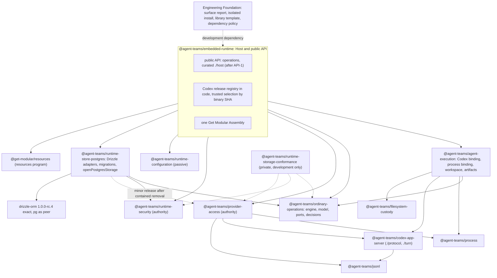

# Agent Runtime Architecture Program Plan

Version 2 of 2026-10-08, updated 2026-10-10. It replaces version 1 (2026-10-02, merged in #192). Planning document only. Nothing in this file by itself authorizes opening a pull request, publishing a package or running Codex. Every pull request listed here is merged only by the owner. Execution details, preconditions and review checklists are in the [execution brief](agent-runtime-architecture-program-execution-brief.md).

Paths and line numbers are at agent-runtime main `44846323` (2026-10-07) unless a card says otherwise. Wave 1 is merged: #192 plan (`0c432387`), #193 SEAM-1 (`8ac7d733`), #191 STORE-1b (`aa262b65`), #194 STORE-1c (`b81ef94a`). Since then main received the Node 26 compatibility lane (#184), CI lane work (#196 to #199, `0ace1cce`) and runtime test fixes; Engineering Foundation 1.7.2 was adopted in `399ffc22`. Between `0ace1cce` and `44846323` main received 48 CI commits (#201 to #211): the Consumer Module Standard pin migration to `81063add` (#201), `CI Nightly`, sharded Foundation and product fanout on Linux and Darwin, managed runner routing, pull request regression sampling and the `@agent-teams/ci-input-proof@0.1.0-rc.0` development dependency. Product source is unchanged in that range except one line in embedded-runtime `scripts/run-package-tests.mjs` (`7dca3afc`) and two lines in one contained test, so product `file:line` references from `0ace1cce` still hold. Rechecked on 2026-10-10 at main `aca6cbe7`: since `44846323` only documents landed (#214, #217, #218 and #219, the [Get Modular train 1 migration](get-modular-train-1-migration.md) briefs AR-1a, AR-1b, AR-1c, AR-2 and their handoff inputs; #215, the [issue #189 test debt briefs](test-debt-189-plan.md), which also edited version 1 of this plan; those edits are folded into this version). get-modular published the 0.3.0 train on 2026-10-09 (release pull request get-modular #150): Core and Assembly 0.3.0 under the npm dist-tag `candidate-0-3-0` (`latest` is still 0.2.0), resources and conformance 0.1.0. Cards that say "as version 1" refer to version 1 of this file at main `47a79675`.

Authority: the owner decisions log, decisions 1-45 and defaults D1-D9 (`decisions-log-2026-10-02.md`, linked in section 10). Anything that is not in that log is marked "not decided".

## Contents

1. Purpose and owner goals
2. Decisions
3. Target architecture
4. Lane index
5. Task cards
6. Parallel waves
7. Ready to implement now
8. Scope exclusions and risks
9. Budget summary
10. Sources

---

## 1. Purpose and owner goals

The program makes the Codex ordinary path of agent-runtime a clean, modular reference architecture before any further feature growth, and turns the parts that other harnesses need into reusable libraries.

Owner goals (handoff section 1, decisions 1-4):

- Codex first. Ordinary is the only active execution path. Contained-turn is frozen (decision 32). Claude is not rewritten now.
- Library-first: extract what is likely to be reused, from the start. Breaking changes are allowed. Packages stay on 0.x and ship a break as a minor release with a changelog entry and a migration guide.
- Codex should always be fresh, read as "the latest verified stable release from a registry in Host code".
- Strict decomposition into modules and libraries: SOLID, Clean Architecture, DRY. Real ownership of resources, not cosmetic extraction.
- No new features during the program. Keep useful code: authority, idempotency, cleanup, parsers, validation and meaningful tests.
- One evolving v1 of our own pre-stable formats, without historical readers, but without silently dropping real records or cleanup obligations.
- Shared mechanisms live with one owner: Engineering Foundation for repository tooling, the Engineering Quality Standard for conventions (decisions 19, 24, 38, 39).

## 2. Decisions

The tables mirror the decisions log. Report links point to the critique archive (section 10). The archived copy of the log carries decisions 24-45 and defaults D6-D9 after the docs pull request that files this version.

### 2.1 Decisions 1-23 (2026-10-01 and 2026-10-02)

| # | Decision | Status now | Supporting report |
|---|---|---|---|
| 1 | Codex first. Ordinary is the only active path. Contained-turn is not developed. Claude is not rewritten. | in force; contained frozen by 32 | [handoff](../../research/architecture-critique-2026-10/handoff.md) section 1 |
| 2 | Library-first under the Engineering Quality Standard (#328). Breaking changes allowed. 0.x break ships as minor with changelog and migration guide. | in force; #328 merged | [governance](../../research/architecture-critique-2026-10/round2/governance-sdk-report.md) sections 5 and 7 |
| 3 | Codex "always fresh" = latest verified stable release from a registry in Host code. Current and previous verified releases accepted. Floor plus warning rejected. | in force | [codex version](../../research/architecture-critique-2026-10/round2/codex-version-report.md) sections 3.3-3.5 and 7 |
| 4 | Strict decomposition; strict SOLID, Clean Architecture, DRY. | in force | [core lifecycle](../../research/architecture-critique-2026-10/round1/core-lifecycle-report.md) section 5 |
| 5 | Only agent-runtime for now; any other repository only after owner agreement. Subscription Runtime out of scope. | in force; decisions 42 and 44 give standing consent for Engineering Foundation, `agent-teams-ai/.github`, modularity-host-TEST and get-modular | [round 2 update](../../research/architecture-critique-2026-10/round2/round2-update-2026-10-02.md) section 3 |
| 6 | Gate code is not deleted. A blocking gate is removed from triggers or from `check` with a comment: why, when to return, owner, review date. | in force | resources plan section 10.1; PR #187 |
| 7 | Rework SDK-growth: reuse the safe archive reader, packed package checks, exports-vs-record idea, publication marker. Disable with comment the C0 list equality, the Engineering Foundation version pin, historical archive hashes, cancelled approval statuses. Replace with a generated public surface report. Engineering Foundation API v1 for published packages only after "changeset with migration note" replaces "ADR per break". | in force; refined by 24 and 38 | [governance](../../research/architecture-critique-2026-10/round2/governance-sdk-report.md) sections 2.2, 3, 5 and 8 |
| 8 | Engineering Foundation goes to 1.7.1 in the first pull request. | superseded by fact 28 (1.7.2 adopted in `399ffc22`) | - |
| 9 | Cheap boundaries: one source for module identity (`package.json` -> `agentTeamsArchitecture`) and for the Consumer Module Standard pin; mechanical inventories generated with `--check`; decisions written by hand in one place. | in force | [governance](../../research/architecture-critique-2026-10/round2/governance-sdk-report.md) sections 2.3, 2.5, 3 and 4 |
| 10 | Libraries `@agent-teams/process`, `@agent-teams/jsonl`, `@agent-teams/codex-app-server`; process is mechanism only. | in force; names fixed by 40 | [library decomposition](../../research/architecture-critique-2026-10/round2/library-decomposition-report.md) sections 2 and 5 |
| 11 | Provider Access auth capture moves to the shared libraries in a separate reviewed pull request; zeroing stays in Provider Access; leaving `getAuthStatus` is separate. | in force; 36 decides how `getAuthStatus` goes | [library decomposition](../../research/architecture-critique-2026-10/round2/library-decomposition-report.md) section 7 |
| 12 | Engine and store are packages: `ordinary-operations` and a Postgres store package, last phase of the core; breaking changes allowed. | in force; names fixed by 40 | [core lifecycle](../../research/architecture-critique-2026-10/round1/core-lifecycle-report.md) section 6 |
| 13 | npm publication right away for the new libraries, `ordinary-operations`, the store package and `filesystem-custody`; Host, Agent Execution, Provider Access, Runtime Security after the `operations` rename; first publication of each package with owner interactive confirmation. | in force; see contradiction 6 | [governance](../../research/architecture-critique-2026-10/round2/governance-sdk-report.md) section 5 |
| 14 | Storage: abstractions not bound to PostgreSQL, no second backend; port per owner in domain language; decisions in domain; adapter reports commit phase; uncertain-commit policy per method; Host gets storage by composition (`openPostgresStorage(pool)` with `verify` and `close()`); Provider Access storage moves after contained removal. | in force; 25 details the interim | [storage verification](../../research/architecture-critique-2026-10/storage-verification/storage-report.md) sections 0, 6, 7 and 12 |
| 15 | Drizzle `1.0.0-rc.4` exact pin with six mandatory adaptations; no `rc.5-<hash>` builds; watch for a clean rc.5 or GA and update agent-runtime and agent-teams-orchestrator together. | in force | [storage verification](../../research/architecture-critique-2026-10/storage-verification/storage-report.md) sections 1, 3, 7 and 13 |
| 16 | Storage compatibility checks in a private workspace package; uncertain-commit test in the Postgres package tests; same mechanism answers the test entry point of #189. | in force; package name fixed by 40 | [storage verification](../../research/architecture-critique-2026-10/storage-verification/storage-report.md) sections 6.6 and 13 |
| 17 | On schema mismatch the Host is not created: `verify` plus a typed error; migrations are a separate command. | in force | [storage verification](../../research/architecture-critique-2026-10/storage-verification/storage-report.md) sections 7 and 13 |
| 18 | The store package is published when the Host moves to it, with Agent Execution and Runtime Security adapters; Provider Access in a minor release after contained removal. | in force | [storage verification](../../research/architecture-critique-2026-10/storage-verification/storage-report.md) sections 7 and 13 |
| 19 | Library standard by levels: Engineering Foundation mechanisms, Engineering Quality Standard conventions, per-repository data preset; Engineering Foundation README wording needs owner consent. | in force; refined by 39; README wording covered by 42, card EF-README | [governance](../../research/architecture-critique-2026-10/round2/governance-sdk-report.md) sections 3 and 9 |
| 20 | Feature Module Standard: owned deviation now in the agent-runtime profile for engine and store packages; after #328, a v2 amendment with `LIBRARY_FIRST`, accepted together with the Consumer Module Standard revision for 0.3.0. | in force; the revision merged without it (contradiction 5); decision 44 adds the reference through CMS-REF | [governance](../../research/architecture-critique-2026-10/round2/governance-sdk-report.md) section 7 |
| 21 | Merge PR #328 if it passes review. | done (`5a66a8eb`) | - |
| 22 | The plan lives in agent-runtime through docs-protocol, with lanes, cards, waves and the critique archive. | done (#192); this is version 2 | - |
| 23 | Issue #189 is synced: test entry point = decision 16; after resources AR-1 and AR-1b; the rejecting `./testing` test stays. | in force; card ISSUE-189-SYNC (the issue body is not synced yet) | issue #189 |

Accepted defaults (2026-10-02, no objection): D1 the first migration refuses if an old ordinary table is not empty; D2 Host and Assembly pull requests come after resources AR-1, the Assembly `LaunchRecipe` type change happens in AR-1b; D3 `operations` replaces `containedTurn` after the Codex version split and before any Host publication; D4 the first Codex bump to 0.159.3 only after the version split and with owner permission for a test run; D5 the Host journal closes after the owners, the second resources scope is per-grant in Provider Access.

### 2.2 Decisions 24-45 (2026-10-03 to 2026-10-10)

| # | Decision | Where it lands |
|---|---|---|
| 24 | Surface report (Q-SURFACE, option b): built directly in Engineering Foundation as a neutral configurable capability; agent-runtime consumes it from an Engineering Foundation release. This is also consent for that Engineering Foundation work. Until then the SDK-growth freeze in agent-runtime stays off with a comment (decision 6). | EF-SURFACE, GOV-1 |
| 25 | Provider Access interim (Q-ACCESS-INTERIM, option a): at STORE-3 the Host gets Agent Execution and Runtime Security storage from the store package; Provider Access stays on its old owner over `pool`. The Host code must carry a detailed TODO: what is temporary, why (materialization tables shared with contained), owner, removal condition and steps (move the Provider Access adapter into the store package, add its port to `storage`, drop `pool` from Host options, delete the temporary construction branch, update registries and tests), links to STORE-2-access and CONTAINED-REMOVAL. | STORE-3 |
| 26 | Native helper (Q-NATIVE, option a): before the first `filesystem-custody` publication, a short design of `rename-no-replace.node`: prebuilt platform artifacts (optional per-platform packages) or a JavaScript fallback; the choice and the CI build are fixed before that publication. | PUBLISH-NATIVE |
| 27 | Local tooling change with no repository effect. | - |
| 28 | Fact: Engineering Foundation 1.7.2 already adopted in agent-runtime (`399ffc22`). The bump part of GOV-1 is closed; the SDK-growth rework remains (with decision 24). | GOV-1 |
| 29 | Runtime Security policy decode (option a): reading a grant compares only identity fields (profile, provider, mode, scope); settlement uses the limits recorded in the grant. A Host policy change no longer makes open grants unreadable. Done in VERSION-1. | VERSION-1 |
| 30 | G2 (option a): a cleanup-only handle owned by the engine flight, plus a durable `workspace_retained` record in the operation. The format change happens once, with format v1 (VERSION-1). | VERSION-1, GAP-G2 |
| 31 | Restart (option a): honest status. An operation without a live owner after the upper bound of its authority deadline is shown as `reconcile_required`, without a relaunch. Implemented before the engine package (before ENGINE-1). | OWNER-LOSS |
| 32 | Contained frozen and disabled: rule in `AGENTS.md`, README markers in contained-only directories, mark in the plan. Contained tests are disabled in CI with a comment (why, when to return, owner); test code is not deleted. Caveats: (1) tests of shared modules used by ordinary stay enabled or move to ordinary first; (2) typecheck and build keep compiling contained code; (3) `ordinary-*` files inside `features/contained-agent-turn/` are active; (4) only mechanical import edits forced by extracting shared parts; (5) removal is a later separate decision. | CONTAINED-FREEZE |
| 33 | Features (option a): the bump tool computes the Codex disabled-feature set from the exact tag source and stores it in the release record; a new default-enabled feature is a mandatory review item; the test run compares the effective config. | BUMP-1, VERSION-2 |
| 34 | Strictness (option a): per-message strictness table. Methods, item types, sandbox, permissions, config and effects are closed; informational messages (limits, token usage, thread metadata, error codes) tolerate new fields. Reviewed at every bump. | LIB-CODEX-2 |
| 35 | Broker header (option a): the Provider Access broker takes the expected version header from the release record. | VERSION-2 |
| 36 | Token reading (Q-ACCOUNT-READ, option b): `account/read` does not return the token; Provider Access already requires `cli_auth_credentials_store = "file"` and holds `auth.json` under custody; `getAuthStatus` is called with `refreshToken: false`. Replace the deprecated `getAuthStatus` calls by reading `tokens` from the custodied `auth.json` with a strict parser for the verified release. The helper Codex stays for `config/read`, `account/read`, `account/rateLimits/read`, `model/list` and the identity drift check (file read before and after). A short check first (ACCESS-AUTH-FILE): `TokenData` fields and equality with the `getAuthStatus` token. `getAuthStatus` stays only as a fallback if direct reading is not enough. The premise "`refreshToken: false`, so no refresh" is wrong (contradiction 12); the owner is asked to reconfirm (Q-AUTH-FILE-CONFIRM). | DOCS-1 part (c), ACCESS-AUTH-FILE, ACCESS-REFRESH-GUARD |
| 37 | Launch config (default, option a): the launch recipe stays next to the config verification in Agent Execution; a successor note to ADR-0090 is written. | DOCS-1 |
| 38 | Surface report form: generated list of export names and kinds per package and entrypoint (`surface/<package>.json`), `surface:update` and `surface:check` with a readable diff and a hint, budgets per tier; tiers from `package.json` -> `agentTeamsArchitecture`. Signatures are checked later by Engineering Foundation API v1 for published packages. | EF-SURFACE |
| 39 | Library standard: conventions as text in the Engineering Quality Standard; the new-library template in Engineering Foundation; automatic checks only for the mechanical part (export tiers, dependency policy zero or peer, isolated install, changeset with migration note). Style conventions (`code` plus `is()`, `signal` last, discriminated outcomes, `close()` with facts) are checked by review. | STANDARD-1a to STANDARD-1d |
| 40 | Names: `@agent-teams/process`, `@agent-teams/jsonl`, `@agent-teams/codex-app-server` (subpaths `./protocol`, `./turn`), `@agent-teams/ordinary-operations`, `@agent-teams/runtime-store-postgres`, private `@agent-teams/runtime-storage-conformance`. | all package cards |
| 41 | TEST project: modularity-host-TEST (repository `agent-teams-ai/modularity-host-test`), plus the automatic isolated install check as a mechanical gate. The first npm publication of each package needs owner interactive confirmation. | PUBLISH-2, STANDARD-1c |
| 42 | Standing consent: changes in Engineering Foundation, `agent-teams-ai/.github` and modularity-host-TEST whenever the program needs them; each change a separate pull request with independent review; merge only on explicit owner command. | waves 2-6 |
| 43 | CI contract (Q-CI-CONTRACT, option a): under decision 6, disable with comment the three comparisons with the frozen baseline (source policy, root `package.json` engines and dependencies, exact command list) and replace them by a forward check: the required lanes together run exactly the leaf commands of the current `check`, each in exactly one required lane. First card in agent-runtime, before STORE-1a and the libraries. | CI-CONTRACT-1 |
| 44 | get-modular joins the standing consent of decision 42. A separate get-modular pull request adds to the Consumer Module Standard the reference "Feature Module Standard v1 or the successor pinned by the consumer profile" and the sentence that a generated inventory with a committed diff is review, not automatic expansion (needed by GOV-3). | CMS-REF, FEATURE-STANDARD-2, GOV-3 |
| 45 | Surface shape (Q-SURFACE-SHAPE, option a), decided on 2026-10-10 by the coordinator under the owner's delegation of technical choices of 2026-10-09: one package-level `tier` under the configured key (agent-runtime: `agentTeamsArchitecture.tier`); a budget is the maximum number of export names per entrypoint for that tier, set in the consumer preset; the publication marker is the npm signal (`private` absent plus `publishConfig.access`). Cheap to reverse while agent-runtime and modularity-host-TEST are the only adopters: agent-runtime packages are private 0.x, but the capability ships in Engineering Foundation 1.x, where a later shape change is a breaking change. The owner can override this decision. | EF-SURFACE, STANDARD-1b, STANDARD-1c |

Defaults announced to the owner on 2026-10-04, taken without objection (the owner asked to finish the plan on 2026-10-08); on 2026-10-10 the coordinator confirmed D6 and D8 under the owner's delegation of technical choices (2026-10-09); D7 (publication timing) and D9 (bump target) stay with the owner; the owner can override any of them: D6 Feature Module Standard v2 is written as a complete document, not a delta (the registry admits only complete published versions, see FEATURE-STANDARD-2); D7 decision 13 is read literally: each library is published as soon as it merges and its publication conditions hold, without waiting for a second consumer; D8 STANDARD-1a keeps "no global singletons" (an OpenClaw lesson from round 1, not part of decision 39); D9 the Codex bump target is the latest stable release at bump time and the owner confirms it then (decision 3, D4).

### 2.3 Contradictions and new facts found while writing version 2

The plan follows the decisions log. Where a verified fact forces a different timing or form (items 11 and 12), the plan says so and the owner confirms. These items need the coordinator's attention.

1. **CI contracts freeze the files every remaining card touches.** Verified at `44846323`. (i) `scripts/ci/conformance.ts:263` keeps the frozen baseline `df9260b0` (`scripts/ci/full-contract.json:2`): root `engines`, `packageManager` and `dependencies` equal the baseline (`:288`); `devDependencies` equal the baseline plus exactly `@agent-teams/ci-input-proof@0.1.0-rc.0` (`:289`); the full and fast leaf inventory equals the baseline (`scripts/ci/policy.ts:70-78`); `.node-version` is `24.21.0` (`:257`); every platform digest that existed at `73c771f2`, including `postgres-durability`, is unchanged (`:305-306`); the pull request regression obligations of the `foundation` and `docs` lanes are hard-coded (`:194-203` with `scripts/ci/pr-regression-command.ts:128-139`). (ii) `scripts/docs/consumer-migration.test.mjs:136-210` authenticates the current source policy by reversing a hand-written list of finite additions back to reviewed predecessor digests (first check `:149`), then compares the part before `tooling.ci-full-gate` with the baseline (`:210`). (iii) New after decision 43: the product fanout accepts exactly six workspace packages with exact `test` scripts (`scripts/ci/package-execution.ts:23-30, 114-128`, rejecting test `scripts/ci/package-execution.test.ts:236`; `scripts/ci/product-fanout-contract.ts:15-30, 119, 329`; `scripts/ci/product-workflow-contract.ts:4, 44, 172`; the eight-shard matrices in `.github/workflows/ci-product.yml:20-29` and the digest-pinned `.github/workflows/ci-darwin-packages.yml:20-21`). A new source-policy root or entrypoint, a new workspace package, a changed package `test` script, a root development dependency or a new leaf command fails required checks unless the pull request adds its own finite exception in these files. The CI workstream did exactly that in seven pull requests; there is still no generic advance procedure (`docs/architecture/foundation-adoption.md`: "current conformance permits only the exact comparator dependency in addition to that baseline"). Local `pnpm check` does not run the real-repository product inventory check; only the CI `product` shards and `runtime-macos` do. Decision 43 (2026-10-04) covers the `df9260b0` comparisons in (i) (root `engines`, `packageManager`, `dependencies`, `devDependencies`; full and fast leaf inventory) and the source-policy chain (ii). Three freezes were added on 2026-10-05, after it, and are question Q-CI-SCOPE: the `73c771f2` platform digest freeze (`conformance.ts:305-306`, `c37a338a`), the hard-coded `foundation` and `docs` pull request obligations (`pr-regression-command.ts:128-139`, `95a3cc25`) and the six-package product inventory (iii, `7e46caad`). The `.node-version` assert predates decision 43 and stays.
2. **Node version.** The repository requires Node 24.21.0: `.node-version` is `24.21.0`, `engines` is `>=24.21.0 <25 || >=26.10.0 <27` with `engineStrict: true`, `AGENTS.md` says "Tooling uses the pinned Node 24.21.0+ patch", and `conformance.ts` asserts `.node-version`. An earlier draft assumed Node 24.18. A Node 24.18 toolchain fails `pnpm install`. `agent-teams-ai/.github` `66d6d3d` (2026-10-08) only stages a Node 26 portable authority successor: Node 24 stays the default and Node 26 needs explicit consumer adoption later, so nothing changes for this program now.
3. **Pins moved and multiplied.** There is no single full-file digest of the source policy any more: `scripts/docs/consumer-migration.test.mjs:136-202` reverses each reviewed addition, and a card that adds a root or an entrypoint adds its own reversal step at the top of that chain (before `:149`; pattern: the `comparatorAdmission` and `namespaceAdditions` steps). Job definitions of `postgres-durability`, `runtime-macos` and `macos-product` and the bytes of `ci-darwin-packages.yml`, `ci-darwin-reference.yml` and `platform-contract.predecessor.json` are digest-pinned in `scripts/ci/platform-contract.json`; `postgres-durability` is also pinned to its `73c771f2` value by `conformance.ts:305-306`; `scripts/ci/nightly-contract.ts:34-37` requires the reused jobs to match the current `platform-contract.json`. An Engineering Foundation bump also updates `scripts/foundation/check-quality-adoption.mjs:22` (literal `1.7.2`), `architecture/sdk-growth/activation.json` `installedTooling` (checked by `check-sdk-growth-profile.mjs:158-170` against the lock) and `scripts/ci/conformance.ts:289`. `399ffc22` shows the size: 31 files, +408/-120. Node and pnpm versions are now also literals in the CI scripts (`package-execution.ts:385, 389, 392, 475, 478`, `product-fanout-contract.ts:103, 280, 283, 386`, `pr-regression-inputs.ts:52`, `conformance.ts:163`).
4. **SDK-growth today.** At `44846323` the inventory and exports freeze is off (#190). `SDK_PUBLIC_IMPORT_QUALIFICATION_DRIFT` (`check-sdk-growth-profile.mjs:46`) still rejects a new subpath of the six existing packages (for example `./host`). New separate packages are not blocked by SDK-growth, but are blocked by item 1.
5. **Decision 20 timing.** agent-runtime already pins the Consumer Module Standard at get-modular `81063add` (#201, `architecture/get-modular/consumer-profile.json:11-12`), equal to upstream on 2026-10-08; the successor review is `architecture/get-modular/evidence/smart-ci-cms-pin-review.json` with `consumerBehaviorChanged: false`, `containedTurn: pending` and an `outstandingWork` list. That revision still says "Feature Module Standard v1 ... remains the sole authority" (`common-assembly.md:44-45`) and "No wildcard, blanket directory exemption or automatic legacy inventory expansion" (`:526-527`). Decision 44 adds the reference through CMS-REF; agent-runtime then needs one more reviewed pin migration (CMS-PIN-2, or train 2 AR-3 when T2-5 carries CMS-REF, contradiction 16), because train 1 does not move the pin (AR-1a only verifies it) (#201 was 20 files, mostly evidence for a large delta; a small amendment needs much less).
6. **Store package publication** (carried from version 1): decision 13 says right away, decision 18 says when the Host moves to it; the package imports Runtime Security, which decision 13 publishes only after the `operations` rename. In practice: after API-1.
7. **TEST repository name.** Decision 41 says modularity-host-TEST; the repository is `agent-teams-ai/modularity-host-test`. It holds the admission and lifecycle stand for Get Modular Core and Assembly and, since modularity-host-test #16 (2026-10-09), the 0.3.0 train adoption (TEST-1). Program tests get their own directory so the two programs do not collide.
8. **Token export is narrower than "read `tokens`".** Verified in upstream source at `rust-v0.153.4` and `rust-v0.159.3`: `getAuthStatus` exports `auth.get_token()`, which for ChatGPT auth is `tokens.access_token`, and only when `last_refresh` is present and there is no permanent refresh failure; agent identity, header, personal access token and workload identity credentials are never exported. `AuthDotJson` also has optional `agent_identity`, `personal_access_token`, `bedrock_api_key` and `bedrock_access_keys` (`codex-rs/login/src/auth/storage.rs:64`). The mode is the explicit `auth_mode` (`manager.rs:1754` `resolved_mode`). `OPENAI_API_KEY` is always serialized (no `skip_serializing_if`, `storage.rs:45-46`), and after a normal ChatGPT browser login it usually holds a key obtained by token exchange (`codex-rs/login/src/server.rs:428`, `:911-912`), so its presence does not mean API key mode. The strict parser must follow these facts (card ACCESS-AUTH-FILE).
9. **Wave 1 overran its budgets** mostly through registry churn: STORE-1b 575 changed lines (budget 300-450), STORE-1c 633 (300-500), SEAM-1 773 (350-800). Storage and library budgets are raised by about 20%.
10. **Issue #189 and the train.** The 0.3.0 train is published (2026-10-09, see the header); the [Get Modular train 1 migration](get-modular-train-1-migration.md) runs AR-1a, AR-1b, AR-1c and AR-2 one pull request at a time, and its index says "after AR-2: AR architecture program lanes rebase; issue #189 (test debt) starts". The [issue #189 test debt briefs](test-debt-189-plan.md) (#215) decided, under the owner's delegation of technical choices: #189 covers the Get Modular modules only (contained-turn copies and casts follow CONTAINED-REMOVAL); handle guards plus `--test-force-exit` now for a dedicated guarded process in embedded-runtime's launcher and for filesystem-custody (brief 04), and for new process, socket and pool code from its first test (LIB-PROCESS, LIB-CODEX-1, STORE-2-core); one contract suite for `agent-runtime/ordinary/store` whose cases STORE-2-core later moves unchanged into the private storage compatibility package. The issue body itself is unchanged since 2026-10-02 and does not mention decision 16 (ISSUE-189-SYNC).
11. **Feature Module Standard deviation "now".** The profile's governed-record schema requires a stable id, exact checker diagnostics, an accepted ADR, owner, rationale and review trigger (`scripts/architecture/feature-module-profile.mjs:178-182`). Before the packages exist there is no diagnostic to reference. The plan records the deviation now as an accepted decision record (DOCS-1) and adds the profile record with STORE-0 and ENGINE-1.
12. **Correction of the decision 36 premise: `refreshToken: false` does not disable refresh.** Verified at `rust-v0.153.4`, `rust-v0.159.3` and `rust-v0.160.0` (line numbers at `rust-v0.153.4`): `getAuthStatus` without refresh calls `AuthManager::auth()` (`account_processor.rs:1059`), and so does `account/rateLimits/read` (`:1134`); `auth()` refreshes proactively when the access token `exp` (parsed from the token) is at most 5 minutes away, or, when `exp` cannot be parsed, when `last_refresh` is older than 8 days (`manager.rs` `should_refresh_proactively`, constants `CHATGPT_ACCESS_TOKEN_REFRESH_WINDOW_MINUTES = 5` and `TOKEN_REFRESH_INTERVAL = 8`). A reused refresh token is classified as exhausted (`manager.rs:1644` `refresh_token_reused`). The helper cannot write into the custodied source (`ordinary-codex-auth-files.ts:89`, `deny file-write*`). Assumption, not proven by a run: such a refresh can spend the single-use refresh token of the user's login while the new tokens are never persisted, so the user's own Codex later fails to refresh and needs a new login. The risk exists today; ACCESS-AUTH-FILE alone does not remove it because `account/rateLimits/read` stays. Proactive refresh is not the only path. `UnauthorizedRecovery::next()` (`codex-rs/login/src/auth/manager.rs`, steps `Reload` then `RefreshToken`) calls `refresh_token_from_authority()` after a 401 regardless of `exp`, and ChatGPT auth supports it. Since `rust-v0.159.3`, `account/read` runs a network workspace-routing discovery (`account_processor/workspace_routing.rs`, `get_accounts_check`) under that recovery; the cloud-config bundle load does the same for business, education and enterprise plans (`codex-rs/cloud-config/src/service.rs`). An `exp` window check closes only the proactive path. Every refresh goes to `refresh_token_endpoint()`, which reads `CODEX_REFRESH_TOKEN_URL_OVERRIDE` (`manager.rs:199` at `rust-v0.153.4`, `:1727` at `rust-v0.161.0`). Questions Q-AUTH-FILE-CONFIRM and Q-AUTH-REFRESH-WINDOW, card ACCESS-REFRESH-GUARD.
13. **ADR-0090 forbids what decision 36 asks.** `docs/decisions/0090-ordinary-user-session-codex-execution-profile.md:104-111` says Provider Access "neither copies source credentials nor reads the parent token directly" and admits only the sequence `initialize`, `config/read`, `account/read`, `getAuthStatus`, `account/rateLimits/read`, `model/list`. The Engineering Quality Standard (`docs/engineering-quality-standard.md:102-103`) changes accepted decisions only through their successor process. ACCESS-AUTH-FILE therefore depends on a successor record (DOCS-1 part c).
14. **Engineering Foundation extraction admission.** Engineering Foundation `docs/architecture/executable-capabilities.md:82-86` admits a consumer-owned implementation into Foundation only after two real consumers and requires deleting the superseded consumer implementations. EF-SURFACE and STANDARD-1b to STANDARD-1d are therefore new Foundation-owned mechanisms decided by the owner (decisions 24, 39, 42), written fresh against the Foundation capability model, not extractions of agent-runtime code; the agent-runtime checks stay and are disabled with comment in GOV-1 (decision 6). If the Engineering Foundation review applies the admission invariant anyway, the card stops and asks.
15. **Breaking-change approval in Engineering Foundation.** `public-api-compatibility` (`application/rules.ts:47`) requires "Approve the reported fingerprint in an ADR-backed breaking-change entry". Decision 7 requires a changeset with a migration note instead of an ADR per break before Engineering Foundation API v1 is enabled for published packages. STANDARD-1d changes that rule for 0.x packages rather than adding a parallel check.
16. **Consumer Module Standard changes against train 1 and issue #189.** Every train 1 brief stops if the standard on get-modular `main` differs from the pin ("if it changed, stop, the owner decides on a pin step first", [Get Modular train 1 migration](get-modular-train-1-migration.md), rules); issue #189 briefs 01, 03, 04 and 07 stop the same way. get-modular plans three standard changes: CMS-REF (decision 44), train 2 T2-5 (0.4.0, `research/contract-evolution-2026-10/briefs/T2-5-standard-and-docs.md` in get-modular) and OBS-3 (open get-modular #153); the train 2 follow-up AR-3 moves the agent-runtime pin from `81063add` to the T2-5 commit. CMS-REF is drafted now and merged after train 1 AR-2 and before T2-5, so that T2-5 carries it; the pin then moves once, in train 2 AR-3 (to the T2-5 commit, or to the OBS-3 merge commit if OBS-3 lands first, as its brief asks) or in CMS-PIN-2 (the owner decides). From the CMS-REF merge, and in any case from the T2-5 merge, until that pin step, issue #189 briefs 01, 03, 04 and 07 cannot start; the owner orders CMS-REF against them (after their start checks passed, or with an early CMS-PIN-2). A merge before AR-2 needs the owner's explicit pin-step decision. If T2-5 merges first, CMS-REF merges before REL-2 opens and AR-3 is pointed at the CMS-REF merge commit.

---

## 3. Target architecture

### 3.1 Package map and dependency direction

Arrows point from the depending package to the dependency. Dashed arrows are planned later steps.



Rules of the graph:

- `process` and `jsonl` depend on nothing. `codex-app-server` depends only on `jsonl`. No library imports Agent Execution, Provider Access, Runtime Security, the Host, the Assembly or `@get-modular/*` in production code.
- `ordinary-operations` has no runtime dependencies.
- The store package depends on the owners whose ports it implements; owners never depend on it.
- Libraries are fixed library dependencies, not Consumer Module Standard graph nodes. Capability ids change only in train 1 AR-1b.
- Inside Agent Execution only outer adapters import the libraries.
- Contained code stays compiled and frozen (decision 32); it is not migrated to the libraries and keeps its own copies until CONTAINED-REMOVAL.

### 3.2 Resource owners

| Resource | Single owner | What the owner does not do |
|---|---|---|
| Child process, pipes, process group | a `@agent-teams/process` handle held by the Agent Execution process binding or by Provider Access auth capture | does not decide when to start or stop; never signals a group after the leader exit has been observed |
| Framing buffer | the `@agent-teams/jsonl` reader | keeps no copies after yielding a message; zeroes consumed bytes when asked |
| Request correlation | a `@agent-teams/codex-app-server` session over a borrowed byte channel | never closes the channel, never signals the process |
| Operation flight, settlement order, cleanup-only workspace handle | the engine (`ordinary-operations`) | the authority order is domain order, not LIFO, and is not replaced by a resources scope |
| Grants and credentials | Provider Access and Runtime Security | not merged: Provider Access consume is one-shot, Runtime Security consume is idempotent within TTL |
| Custodied `auth.json` and the token read from it | Provider Access auth capture | never refreshes the token; never lets the helper reach the refresh endpoint (ACCESS-REFRESH-GUARD, if decided); never decodes `refresh_token`, `id_token`, `OPENAI_API_KEY` or any other credential member into JavaScript strings; the access token stays a zeroable `Buffer` until the existing decode points (`conservativeTokenExpiry`, `ordinary-codex-auth-json.ts:29`; `withCredentialOutputTokens`, `ordinary-codex-auth-capture.ts:130`), which this program does not change; never logs it; zeroes buffers |
| Journal, owner scopes, storage `close()` | the Host, through `@get-modular/resources` after train 1 AR-1c | the journal closes only after the owner scope reports complete |
| `pg` Pool | the caller (borrowed) | the Host and the store package never end it |
| Codex release selection | the Host registry (code) | a caller can never pass a binary digest or a release string |
| Schema migrations | an explicit operator command | the Host only verifies |

### 3.3 Module, library or authority boundary

- **Libraries:** `process`, `jsonl`, `codex-app-server`, `filesystem-custody` (existing), `ordinary-operations`, `runtime-store-postgres`. `runtime-storage-conformance` is a private workspace package.
- **Modules inside Agent Execution:** Codex binding (release application, strictness table use, effect admission, config writer and verifier, single `turn/start`), process binding (claim gate, darwin and non-root policy, receipts, journal), workspace and artifacts adapters.
- **Module inside the Host:** Codex release registry and trusted selection.
- **Authority boundaries:** Provider Access, Runtime Security, the claim gate, the Host trusted selection.
- **Shared tooling (not runtime):** Engineering Foundation capabilities and the Engineering Quality Standard text.
- **Not built:** a shared contracts package, a runtime kernel, a dependency injection container, a universal authority port, a public SPI for the seven roles.

### 3.4 What is published when

| Unit | When | Conditions |
|---|---|---|
| `process`, `jsonl`, `codex-app-server` | right away (decision 13, D7): each as soon as it merges and the conditions hold; no wait for a second consumer | isolated install (STANDARD-1c adopted in GOV-1), surface report public tier, release route (PUBLISH-1), a TEST consumer in modularity-host-TEST, owner interactive confirmation per package |
| `filesystem-custody` | after PUBLISH-NATIVE | same conditions plus the native helper design (decision 26) |
| `ordinary-operations` | right away after ENGINE-1 | same conditions |
| `runtime-store-postgres` | with STORE-3, after API-1 (contradiction 6) | Runtime Security published first |
| Host, Agent Execution, Provider Access, Runtime Security | after API-1 | owner confirmation; `runtime-configuration` is not named in decision 13 (not decided) |
| `runtime-storage-conformance` | never | decision 16 |

### 3.5 Storage design

Unchanged from version 1, as corrected by the storage verification:

1. Port per owner in domain language, no generic repository. Agent Execution `OrdinaryOperationStore` with `insertIfAbsent`, `prepare(ref, expectedRevision, ...)`, `claim(ref, expectedRevision)`, `cancel(ref)`, `append`/`finish`/`reconcile(ref, attemptId, ...)`. Provider Access `OrdinaryPaGrantStore` and, while contained lives, `OrdinaryPaMaterializationStores` (done in STORE-1c). Runtime Security `OrdinarySecurityGrantStore` with the owner in application (done in STORE-1b).
2. Decisions in domain with explicit `now` and `newId`; three adapter templates (insert-if-absent plus comparison, one-shot insert, lock-decide-write with CAS by revision only for Agent Execution); G1 identity check in the row decoder.
3. The adapter classifies "not committed" against "outcome unknown", never retries and never reads back by itself; the readback policy is part of each port method contract (seven semantics, version 1 section 3.5).
4. The Host receives a storage object; `runtime-store-postgres` provides `openPostgresStorage({pool, clock?})` (read-only verify, never ends the pool), `migratePostgresStorage` and `verifyPostgresStorage`. Until contained removal the Host also keeps the Provider Access owner over `pool` (decision 25).
5. Per-owner migrations: session advisory lock on one `PoolClient`, Drizzle `migrate` with journal `<owner_schema>.__migrations`, exact ordered `(name, hash)` comparison, typed `ordinary_storage_unavailable` on mismatch, journal head checked inside the existing `set_config` query, baselines without `IF NOT EXISTS` and with the legacy guard (refuse when the legacy table is not empty).
6. Compatibility suites in `runtime-storage-conformance`; fault injection, triggers, catalog and parallel migration tests in the store package.
7. Drizzle `1.0.0-rc.4` exact pin with the six adaptations.
8. Owner schemas `agent_execution`, `provider_access`, `runtime_security`; one database per test.

---

## 4. Lane index

Status: `done`, `ready`, `needs-decision`, `blocked`, `external`.

### 4.1 Lanes

| Lane | Cards | Status | Notes |
|---|---|---|---|
| Plan | #192 | done | this version is filed by a separate docs pull request |
| Seams in place | SEAM-1 | done (#193 `8ac7d733`) | follow-ups folded into LIB-PROCESS and ISSUE-189 |
| Storage S1 Runtime Security | STORE-1b | done (#191 `aa262b65`) | follow-up folded into STORE-2-core |
| Storage S1 Provider Access | STORE-1c | done (#194 `b81ef94a`) | follow-ups folded into VERSION-1 and STORE-2-core |
| Engineering Foundation bump | part of old GOV-1 | done (`399ffc22`, 1.7.2) | decision 28 |
| Library-first in the Engineering Quality Standard | .github #328 | done (`5a66a8eb`) | decision 21 |
| CI contract freeze | CI-CONTRACT-1 | needs-decision | decision 43 covers the baseline equalities and the source policy chain; the fixed six-package product inventory appeared after it (contradiction 1 iii): Q-CI-SCOPE. Blocks every card that adds a package, a source-policy root or entrypoint, a package `test` script change, a root dependency or a `check` command |
| Contained freeze | CONTAINED-FREEZE | blocked | decision 32; changes package `test` scripts, which are literals in `scripts/ci/*` (contradiction 1 iii): after CI-CONTRACT-1, or earlier with integrator commits under the per-change pattern if Q-CI-SCOPE (c) |
| Decision records | DOCS-1 | ready for parts (a) and (b); part (c) after Q-AUTH-FILE-CONFIRM and Q-AUTH-REFRESH-WINDOW | decisions 20, 36, 37; contradiction 13 |
| Provider Access token from `auth.json` | ACCESS-AUTH-FILE | needs-decision | Q-AUTH-FILE-CONFIRM (decision 36 premise corrected, contradiction 12); then after DOCS-1 part (c) |
| Refresh window guard | ACCESS-REFRESH-GUARD | needs-decision | Q-AUTH-REFRESH-WINDOW; then after DOCS-1 part (c) |
| Surface report capability | EF-SURFACE | ready (Engineering Foundation) | decisions 24, 38, 45; a new Foundation mechanism, not an extraction (contradiction 14) |
| Library standard: conventions text | STANDARD-1a | ready (`.github`) | decision 39 |
| Library standard: template and dependency policy | STANDARD-1b | ready to draft (Engineering Foundation), merge after LIB-JSONL proves the shape | decisions 39, 45 |
| Library standard: isolated install | STANDARD-1c | ready (Engineering Foundation) | decisions 39, 41, 45; replaces version 1 GOV-4 |
| Library standard: changeset with migration note | STANDARD-1d | ready (Engineering Foundation) | decisions 7, 39; changes `public-api-compatibility` (contradiction 15) |
| Engineering Foundation README wording | EF-README | ready (Engineering Foundation) | decisions 19, 42 |
| Consumer Module Standard successor reference | CMS-REF | ready to draft (get-modular); merge after train 1 AR-2 and before train 2 T2-5 | decision 44; contradiction 16 |
| Consumer Module Standard pin migration after CMS-REF | CMS-PIN-2 | blocked | CMS-REF merged; coordinated with train 2 AR-3 and the Feature Module Standard v2 adoption so the pin moves once (contradiction 16) |
| Feature Module Standard v2 text | FEATURE-STANDARD-2 | ready (`.github`); merge after CMS-REF | decisions 20, 44, D6 |
| Adopt Engineering Foundation release in agent-runtime | GOV-1 | blocked | EF-SURFACE and STANDARD-1c/1d released; CI-CONTRACT-1 |
| Cheap boundaries in agent-runtime | GOV-2 | blocked | CI-CONTRACT-1 |
| Consumer Module Standard census generation | GOV-3 | blocked | CMS-REF (census sentence) and CMS-PIN-2; train 1 (AR-2) |
| Storage S1 Agent Execution | STORE-1a | blocked | CI-CONTRACT-1 by decision 43 order; a new domain file imported by the outer adapter needs a source-policy entrypoint (reversal step) unless reached through an existing entrypoint |
| Storage S0 and S2 | STORE-0, STORE-2-core, STORE-2-execution, STORE-2-security | blocked | CI-CONTRACT-1, STORE-1a, VERSION-1 |
| Storage S3 | STORE-3 | blocked | train 1 (AR-2) |
| Provider Access storage in the store package | STORE-2-access | blocked | contained removal |
| Libraries | LIB-JSONL, LIB-PROCESS, LIB-CODEX-1, LIB-CODEX-2 | blocked | CI-CONTRACT-1 |
| Provider Access on libraries | ACCESS-LIB | blocked | LIB-PROCESS, LIB-CODEX-2, ACCESS-AUTH-FILE |
| Codex version split and format v1 | VERSION-1 | blocked | STORE-1a; train 1 (AR-2) for the embedded-runtime public view literal, or a coordinator exemption for those two files after checking the train 1 diffs |
| Cleanup-only workspace handle | GAP-G2 | blocked | VERSION-1 |
| Honest status after owner loss | OWNER-LOSS | blocked | VERSION-1; before ENGINE-1 |
| Codex release registry | VERSION-2 | blocked | train 1 (AR-2) |
| Engine package | ENGINE-0, ENGINE-1 | blocked | VERSION-1, OWNER-LOSS |
| Public API | API-1 | blocked | VERSION-1, VERSION-2, GOV-1, GOV-2, train 1 (AR-2) |
| Release route | PUBLISH-1 | blocked | GOV-1 (isolated install adopted) |
| Native helper design | PUBLISH-NATIVE | ready (design only) | decision 26 |
| First publications | PUBLISH-2, PUBLISH-3 | blocked | GOV-1 and PUBLISH-1; then right away per package (decision 13, D7) with owner interactive confirmation (decision 41) |
| Bump tool | BUMP-1 | blocked | LIB-CODEX-2, VERSION-2 |
| First Codex bump | BUMP-2 | needs-decision | owner permission for the test run (D4); target confirmed at bump time (D9) |
| Drizzle GA or clean rc.5 | BUMP-DRIZZLE | blocked | upstream release |
| Contained removal | CONTAINED-REMOVAL | needs-decision | decision 32 (5): later separate decision |
| Orphan process group | ORPHAN-GROUP | known limitation | `process` exposes start identity |
| Issue #189 body sync | ISSUE-189-SYNC | needs-decision | decision 23; posting on GitHub needs explicit owner permission (Q-ISSUE-189-COMMENT) |
| Issue #189 test debt | ISSUE-189 | external | briefs in [test-debt-189-plan](test-debt-189-plan.md); starts after train 1 (AR-2); section 6.4 |
| Resources AR-0, AR-S | - | done | #187, #190 |
| Train 1 AR-1a | - | external, can start | the train is published (2026-10-09); Core and Assembly 0.3.0, verifies the Consumer Module Standard pin `81063add`; #218 filled its handoff inputs; [Get Modular train 1 migration](get-modular-train-1-migration.md) |
| Train 1 AR-1b | - | external | after AR-1a; module identities, root as a function of Assembly, the `prepare-launch` type switch to `OrdinaryLaunchRecipe` (D2) |
| Train 1 AR-1c | - | external | after AR-1b; ADR-0024, resources and conformance 0.1.0, scoped ordinary owners, smoke; adds dependencies to embedded-runtime with an exact reversal step written into its brief (section 6.3) |
| Train 1 AR-2 | - | external | after AR-1c; per-grant Provider Access scope in `ordinary-provider-access-owner.ts`; adds `@get-modular/resources` to Provider Access with its own reversal step; the STORE and ACCESS lanes rebase after it |

### 4.2 Open questions

Options best first; scores are confidence / reliability out of 10. Nothing here is decided. Q-CI-CONTRACT and Q-CONSUMER-STANDARD-REF were decided on 2026-10-04 (decisions 43 and 44); Q-PUBLISH-TIMING is closed by decision 13 read literally (D7); Q-SURFACE-SHAPE is decided (decision 45).

- **Q-CI-SCOPE. Three CI freezes appeared after decision 43 (contradiction 1). How are they handled, and who implements CI-CONTRACT-1?**
  - (a) Recommended: extend CI-CONTRACT-1 by the principle of decision 43: replace the fixed six-package inventory and the literal `test` scripts by forward checks (packages discovered from `pnpm-workspace.yaml`; every package has exactly one product shard on Linux and on Darwin; its test command is read from its own manifest; every test process still reports tests > 0 and passed > 0; Agent Execution sharding is computed over the expanded list); derive the `foundation` and `docs` pull request obligations instead of hard-coding them; replace the `73c771f2` platform freeze by the per-job digests already in `scripts/ci/platform-contract.json` (an edited trust-pinned job still fails until its digest is recomputed in the same pull request). The CI workstream that authored #196 to #211 implements it from the requirements in the card, coordinated by the owner, because it changes the same files almost daily and knows their invariants. 7 / 8.
  - (b) Same scope, implemented by the program integrator in a quiet window agreed with the CI workstream. 6 / 7, collision and rebase risk with a very active workstream.
  - (c) Per-change pattern: decision 43 only for the baseline equalities; every card adds its own finite exceptions (package and shard literals, matrices, reversal steps, workflow digests, the `73c771f2` pin). 5 / 7, works today without new design, but each new package costs about eight CI files and a CI review, against decision 4 (DRY).
- **Q-AUTH-FILE-CONFIRM. Keep decision 36 after the premise correction (contradiction 12)?**
  - (a) Recommended: keep it, only together with a refresh guard that also covers the 401 path (Q-AUTH-REFRESH-WINDOW a). Read `tokens.access_token` from the custodied `auth.json` with the strict parser of contradiction 8, the bounded byte scanner and the drift check, after the ADR-0090 successor (DOCS-1 part c). For parity with `getAuthStatus` the parser also accepts a file without `auth_mode` when Codex `resolved_mode` would resolve ChatGPT (see ACCESS-AUTH-FILE). Why the guard is a condition: today a refresh inside the helper makes the second `getAuthStatus` refuse; a read of the write-denied file before and after cannot observe a refresh, so without the guard the loss of the user's refresh token becomes silent. 7 / 8.
  - (b) Stay on `getAuthStatus` until upstream removes it, then switch. Less change now, but the program keeps a deprecated call and the switch lands under time pressure during a bump; ACCESS-LIB then migrates `getAuthStatus` too. 6 / 6.
  - (c) Keep `getAuthStatus` permanently and rely only on the refresh guard. 4 / 5, the deprecated method will go away.
- **Q-AUTH-REFRESH-WINDOW. Prevent the helper from spending the user's refresh token (contradiction 12)?**
  - (a) Recommended: make every refresh attempt of the helper fail before the refresh token leaves the process: set `CODEX_REFRESH_TOKEN_URL_OVERRIDE` in the closed helper environment to a syntactically valid loopback URL whose port the helper sandbox profile denies, and keep the `exp` window check of (b) as an early refusal with a clear reason. Covers the proactive and the 401 paths. Needs a synthetic proof with the pinned binary, an ADR-0090 successor line (DOCS-1 part c) and re-verification at every bump, because the variable is an upstream test hook. 6 / 8.
  - (b) `exp` window check only: refuse before spawning the helper when the access token is inside the Codex proactive window plus the helper deadline. Closes the proactive path; the 401 path stays open from `rust-v0.159.3` on. 7 / 6.
  - (c) Keep the behavior and document the risk in the Provider Access README. 5 / 4.
- **Q-ISSUE-189-COMMENT. How is issue #189 synced with decision 23?** Any GitHub write needs explicit owner permission.
  - (a) Recommended: the integrator posts one comment with the points of card ISSUE-189-SYNC and links to this plan and the issue #189 briefs, from the owner's account. Keeps the original text and notifies watchers. 8 / 9.
  - (b) The integrator edits the issue body (adds a "Synced with the architecture plan" section). One self-contained text, but rewrites the owner's issue. 7 / 8.
  - (c) The owner posts it from a draft the integrator prepares. 8 / 9, one more manual step.
- **Q-RUNTIME-CONFIG. Is `@agent-teams/runtime-configuration` published after API-1?** Not covered by decision 13.
  - (a) Recommended: decide at API-1, when the published Host surface shows whether consumers need it directly. 6 / 7.
  - (b) Publish it with the Host and context packages after API-1. 5 / 6, may publish a package nobody imports.
  - (c) Keep it private and re-export what consumers need from the Host. 5 / 6, couples configuration releases to the Host.
- **CONTAINED-REMOVAL** stays a later separate decision (decision 32). Recommended: start a read-only reachability and obligations review after ACCESS-LIB. 6 / 8.

---

## 5. Task cards

### 5.0 Rules for every card

- **Re-verify before start:** main moves fast (48 CI commits between 2026-10-04 and 2026-10-07). Before a card starts, compare its cited files and line numbers, the CI contracts of section 2.3 item 1 and the toolchain with the current main; if a precondition changed, stop and ask the coordinator.
- **Acceptance baseline:** rejecting tests for every invariant the card touches. Before review: `pnpm check:changed`, then `pnpm check:fast` (it also runs `pnpm docs:qualification`), then `pnpm product:build && pnpm lint:typed`, then the full `pnpm check`. `lint:typed` runs only in the full `check`; wave 1 missed it locally. Local `pnpm check` does not run the real-repository product inventory check: a new package or a changed package `test` script fails only in the CI `product` shards and `runtime-macos`, so read those results before asking for review. Required checks green on the exact head: `commit-author-identity`, `check`, `docs-protocol / docs-protocol-check`, `postgres-durability`, `runtime-macos` (rulesets 19979781 and 24363207, strict; `runtime-macos` is now an evidence aggregator over the eight `macos-product` runners). `codex-review` is not required. `test:sdk-growth:source` fails on macOS for a `/proc` reason; CI is the authority for it.
- **Toolchain:** agent-runtime: Node 24.21.0 (`.node-version`), pnpm 11.18.0 (`packageManager`). Engineering Foundation, modularity-host-TEST and get-modular use pnpm 11.20.0; `agent-teams-ai/.github` uses pnpm 11.18.0. Clones need full history (no `--depth`): `test:ci` reads `df9260b0` and `ccf6d6f8`.
- **Registries and pins:** a card that adds or moves a governed source file updates `architecture/foundation/source-dependencies.yaml` (roots are directories, entrypoints are per file), adds its reversal step at the top of the chain in `scripts/docs/consumer-migration.test.mjs:136-150` (pattern: the `comparatorAdmission` and `namespaceAdditions` steps), updates the census edges in `architecture/get-modular/consumer-profile.json` and `architecture/feature-module-standard/ordinary-scope.json`, and handles the CI contracts as decided in CI-CONTRACT-1. Editing `candidate-profile.json` also updates `fms.sha256` in `consumer-profile.json`. A new package also needs `packageRoots`, a boundary, an entry in `architecture/foundation/quality-source-coverage.yaml` `compilerProjects`, the Feature Module Standard profile and, until CI-CONTRACT-1 lands, the product fanout literals of section 2.3 item 1 (iii). Editing a digest-pinned workflow job recomputes its digest in `scripts/ci/platform-contract.json`; `postgres-durability` is also frozen by `scripts/ci/conformance.ts:305-306`.
- **Merge order:** the repository requires branches to be up to date. Pull requests that touch shared registries merge one by one; each is rebased on the new main, its reversal step and pins rechecked and the full `check` rerun.
- **Review:** one independent reviewer per pull request; a new review after fixes; every review thread resolved (`required_review_thread_resolution: true`); merge only by the owner, through the owner merge guard.
- **Commits:** author and committer from the repository's git config (the owner's identity); conventional commits with issue references; no `codex/` branches.
- **Gates:** never delete gate code; disable with a comment stating why, when to return, owner and review date.
- **Consumer Module Standard:** the agent-runtime pin is get-modular `81063add` (#201), equal to upstream on 2026-10-08; successor outstanding work is listed in `architecture/get-modular/evidence/smart-ci-cms-pin-review.json` `outstandingWork` (contained-turn adoption stays pending under the freeze). Cards before train 1 AR-2 do not change capability ids; train 1 records its conformance progress in `docs/architecture/get-modular-adoption.md` (section "Train 0.3.0 conformance status", created by AR-1a) and never edits the existing pin evidence.
- **No live provider runs.** `pnpm check` stays synthetic.
- **Size:** at most about 2000 changed lines per pull request; moves counted separately.

### 5.1 Done in wave 1

- **SEAM-1** (#193, `8ac7d733`, +652/-121): opaque byte channel, single framing pass (`ordinary-framing.ts`, `ordinary-byte-channel.ts`), Agent Execution-owned `OrdinaryLaunchRecipe` with the Node alias, `prepared` Map removed. Follow-ups: `Buffer.alloc(1_048_576)` can move from `reserve` to `start` (into LIB-PROCESS); `packages/apps/embedded-runtime/tests/package/ordinary-host-ownership.fixture.ts:53` still returns the old transport shape (into ISSUE-189).
- **STORE-1b** (#191, `aa262b65`, +484/-91): Runtime Security owner in application plus `OrdinarySecurityGrantStore`. Follow-up: `ordinarySecurityDigest` and `newOrdinarySecurityId` stay in Runtime Security when the adapter moves (into STORE-2-core).
- **STORE-1c** (#194, `b81ef94a`, +534/-99): `OrdinaryPaGrantStore` and `OrdinaryPaMaterializationStores`. Follow-ups: mirrored `OrdinaryPaAuthority`/`OrdinaryPaSnapshot` types in Provider Access domain (into VERSION-1); a race test retire against `beginRequest` on one grant, since no test covers `FOR UPDATE` yet (into STORE-2-core).

### 5.2 Governance and standards

#### CI-CONTRACT-1. Keep the CI lane proof without freezing growth

- **Status:** needs-decision on scope and implementer (Q-CI-SCOPE); the baseline part is decided (decision 43). **Owner:** the CI workstream if Q-CI-SCOPE (a), otherwise the integrator; the owner coordinates either way.
- **Goal, decided part (decision 43):** disable with comment (why, when to return, owner, review date) the comparisons of the current tree with the frozen baseline `df9260b0`: root `package.json` `engines`/`packageManager`/`dependencies`/`devDependencies` equality (`scripts/ci/conformance.ts:288-289`), exact full and fast leaf inventory equality (`scripts/ci/policy.ts:70-78`), and the source-policy comparison before the `tooling.ci-full-gate` block together with the reversal chain (`scripts/docs/consumer-migration.test.mjs:136-210`). Add forward checks: every leaf of `check` runs in exactly one required lane; every baseline leaf command is still present or listed in a committed disabled-gates record with why, when to return, owner and review date (decision 6); the source policy keeps every reviewed root unless the removal is in the same record.
- **Goal, Q-CI-SCOPE (a) part:** replace the fixed six-package inventory and the literal `test` scripts (`scripts/ci/package-execution.ts:23-30, 114-128`, `scripts/ci/product-fanout-contract.ts:15-30, 119, 329`, `scripts/ci/product-workflow-contract.ts:4, 44, 172`, matrices in `.github/workflows/ci-product.yml` and `.github/workflows/ci-darwin-packages.yml`) by forward checks: packages discovered from `pnpm-workspace.yaml`; every package has exactly one product shard on Linux and on Darwin; its test command is read from its own manifest; every test process still reports tests > 0 and passed > 0; Agent Execution sharding is computed over the expanded list; the `foundation` and `docs` pull request regression obligations (`conformance.ts:194-203`, `scripts/ci/pr-regression-command.ts:128-139`) are derived, not hard-coded; the `73c771f2` platform freeze (`conformance.ts:305-306`) is replaced by the per-job digests already in `scripts/ci/platform-contract.json` (an edited trust-pinned job still fails until its digest is recomputed in the same pull request).
- **Non-goals:** no change to lane routing semantics, the aggregate job, trust digests other than the recomputed ones of edited workflows, the `.node-version` assert, historical Docs baseline asserts that read Git history, or the `@agent-teams/ci-input-proof` sampling.
- **Files:** `scripts/ci/conformance.ts`, `scripts/ci/policy.ts`, `scripts/ci/contracts.test.ts`, `scripts/ci/full-contract.json` if needed, `scripts/docs/consumer-migration.test.mjs`; with (a) also `scripts/ci/package-execution.ts`, `scripts/ci/product-fanout-contract.ts`, `scripts/ci/product-workflow-contract.ts`, `scripts/ci/pr-regression-command.ts`, their tests, `.github/workflows/ci-product.yml`, `.github/workflows/ci-darwin-packages.yml`, `scripts/ci/platform-contract.json`.
- **Invariants:** no leaf check command disappears silently; every leaf runs in exactly one required lane; every package test runs on Linux and Darwin; trust-pinned workflows still fail on unreviewed change.
- **Acceptance:** rejecting tests: removing a baseline leaf without a disabled-gates record fails; adding an unrouted leaf fails; adding a routed leaf passes; changing a trust-pinned job without recomputing its digest fails. A simulated source-policy root addition passes. With (a): a simulated new workspace package passes Linux and Darwin product evidence; a package without a shard fails; a test process with zero tests fails.
- **Depends on:** Q-CI-SCOPE; a quiet window agreed with the CI workstream; the train 1 window of section 6.3 (merge before AR-1c starts or after AR-2 merges).
- **Budget:** 150-400 changed for the decided part; 600-1200 with (a) (estimate, not measured).

#### CONTAINED-FREEZE. Freeze contained-turn and stop running its tests

- **Status:** blocked by CI-CONTRACT-1 (the package `test` scripts it changes are literals in `scripts/ci/*`), or earlier with integrator commits in `scripts/ci/*` if the owner chooses Q-CI-SCOPE (c) (decision 32). **Owner:** worker A; the integrator commits `scripts/ci/*`, the workflow, `AGENTS.md` and `platform-contract.json` parts.
- **Goal:**
  1. `AGENTS.md`: a rule that contained-turn is frozen, not supported and not developed; only mechanical import edits forced by extracting shared parts are allowed; `ordinary-*` files inside `features/contained-agent-turn/` are active; removal needs a separate decision. The Consumer Module Standard successor work for contained-turn (`containedTurn: pending` in `architecture/get-modular/evidence/smart-ci-cms-pin-review.json`) stays pending and is recorded as frozen.
  2. Classify every feature directory by reachability from the ordinary Host composition, not by name. For example `contained-turn-runtime-access` and `contained-turn-runtime-validation` in embedded-runtime carry the current public API and stay active. Add a short frozen-notice paragraph to the existing `README.md` of each contained-only feature directory (every feature already has one with front matter; do not change front matter values).
  3. Disable contained tests in CI without deleting them. Package `test` scripts in Agent Execution, Provider Access and Runtime Security switch from globs to explicit lists of active tests, kept as a literal `node --test ...` command in `package.json` (`scripts/architecture/ar2-test-execution-inventory.mjs:24-25`); in embedded-runtime only contained entries leave `testProcesses` in `scripts/run-package-tests.mjs` (it is already an explicit list). The active set is every `ordinary-*` test plus every test of a shared module that ordinary code imports (codecs, exact record, limits, authority fingerprint, kernel output kinds, the contained JSONL reader and item schema used by the ordinary Codex adapter, and similar), computed from the import closure of the ordinary sources and attached to the pull request; every test referenced by AR2 contract coverage stays (`validate-ar2-contract-artifacts.mjs:120-126`). Rationale, return condition, owner and review date go into the package README next to the list (package manifests cannot carry comments).
  4. Known pins to update in the same pull request: the glob assertion at `packages/contexts/agent-execution/tests/package/postgres-qualification-command.test.ts:458` (keep the fail-closed wrapper asserts); the embedded-runtime argv assertion in `scripts/architecture/runtime-setup-l0-evidence-v2.test.mjs:152-226` (expects 62 today); unless CI-CONTRACT-1 (a) has landed, the test script literals in `scripts/ci/package-execution.ts:24-29`, `scripts/ci/product-fanout-contract.ts:27-30` and the fixtures in `scripts/ci/package-execution.test.ts:17-24` and `scripts/ci/product-fanout-contract.test.ts:43-74`. Hard limits stay: embedded-runtime keeps exactly 2 processes, every process reports tests > 0 and passed > 0, the Agent Execution universe stays at least 3 files. Check whether `architecture/foundation/quality-source-coverage-bridge-admissions.json` (12 contained tests listed) affects `lint:typed`.
  5. In `.github/workflows/ci.yml` `postgres-durability`, comment out the contained-only steps with the same note. Keep shared ones: the Provider Access materialization durability test covers tables the ordinary owner uses. Recompute the `postgres-durability` digest in `scripts/ci/platform-contract.json`. The `73c771f2` freeze in `scripts/ci/conformance.ts:305-306` must be relaxed with comment: by CI-CONTRACT-1 under Q-CI-SCOPE (a), otherwise by an integrator commit the owner approves. `scripts/ci/nightly-contract.ts:34-37` compares with the current `platform-contract.json` and needs no change. Alternative without a workflow edit (not decided, unverified whether the scripts are pinned elsewhere): disable the contained-only `test:postgres:*` package scripts with comment and keep the workflow steps.
  6. Mark the freeze in this plan (done by this version).
- **Non-goals:** no deletion of tests or code; no typecheck or build change; no change to `quality:native` (host custody native checks stay); no move of shared modules (later, ENGINE-0); no new source files.
- **Invariants:** every ordinary test and every shared-module test still runs in `check`, `product`, `runtime-macos` and `postgres-durability`; contained code still compiles; disabled tests are listed, not lost.
- **Acceptance:** the pull request lists disabled test files (count per package) and every kept shared test with the ordinary import that justifies it; `architecture:consumer-modules` and `architecture:feature-modules:active` stay green (they map tests to boundaries); full `check` green locally and the CI `product` and `runtime-macos` evidence green; CI time before and after is reported as information only.
- **Alternative if the owner prefers fewer CI edits (not decided):** move contained-only Agent Execution and Provider Access tests one directory deeper (`.../contained-agent-turn/frozen/`), so the non-recursive globs stop matching them and the script literals and `:458` stay; costs moves, import paths, census edges and paths in `run-postgres-qualification.mjs`. 5 / 6.
- **Depends on:** CI-CONTRACT-1, or owner consent for integrator edits in `scripts/ci/*` under Q-CI-SCOPE (c).
- **Budget:** 400-1000 changed (long file lists), 0 moves.

#### DOCS-1. Decision records

- **Status:** parts (a) and (b) ready (decisions 20 and 37); part (c) after the owner answers Q-AUTH-FILE-CONFIRM and Q-AUTH-REFRESH-WINDOW (decision 36). **Owner:** integrator.
- **Goal:** through `pnpm docs:new`:
  - (a) an accepted decision record of the Feature Module Standard owned deviation for `@agent-teams/ordinary-operations` and `@agent-teams/runtime-store-postgres`: scope, rationale (decision 12, Engineering Quality Standard library-first), owner, review trigger "agent-runtime adopts Feature Module Standard v2"; the governed profile record follows with STORE-0 and ENGINE-1 (contradiction 11);
  - (b) a successor record to ADR-0090 line 91: the launch recipe type lives in Agent Execution application and the recipe stays next to the config verification;
  - (c) a successor record to ADR-0090 section "Provider Access and Runtime Security" (lines 104-111): under decision 36 Provider Access reads `tokens.access_token` from the custodied source `auth.json` with the strict parser and the drift check; the admitted helper sequence becomes `initialize`, `config/read`, `account/read`, `account/rateLimits/read`, `model/list`; the record states the refresh facts of contradiction 12 and admits what ACCESS-REFRESH-GUARD does under the chosen option (reading `exp` before the helper starts; with option a also the refresh endpoint override and the loopback deny rule).
- **Registration:** add each accepted record to the `Accepted` section of `docs/decisions/README.md` and to `architecture/decisions/accepted-decisions.json` with its immutable digest; the Feature Module Standard profile resolves `acceptedAdr` only through that registry (`scripts/architecture/feature-module-profile.mjs:147, 164`). Index files are not byte-frozen: `scripts/docs/verify-frozen-document-bytes.mjs:18-21` freezes `docs/decisions/000[1-5]-*.md`, `docs/spikes/*-results.md` and `docs/spikes/runtime-profile-behavior.md` only.
- **Numbering:** ADR-0024 is reserved for train 1 AR-1c (cited by the AR-1c and AR-2 briefs and issue #189 brief 04); DOCS-1 records take the next free numbers after ADR-0024.
- **Non-goals:** no edits of accepted ADR bytes; no profile edit.
- **Delivery:** (a) and (b) in one pull request now; (c) in a second small pull request as soon as Q-AUTH-FILE-CONFIRM and Q-AUTH-REFRESH-WINDOW are answered, merged before ACCESS-AUTH-FILE.
- **Budget:** 120-280 changed in total.

#### EF-SURFACE. Surface report capability in Engineering Foundation

- **Status:** ready (decisions 24, 38, 42, 45). **Repository:** Engineering Foundation. **Owner:** worker C.
- **Admission:** a new Foundation-owned mechanism decided by the owner, not an extraction (contradiction 14). Write it fresh against the Engineering Foundation capability model, cite decisions 24, 38 and 45 in the pull request, do not copy agent-runtime code. If the Engineering Foundation review applies the extraction admission invariant, stop and ask.
- **Goal:** a neutral configurable capability (next to the existing ones under `packages/engineering-foundation/src/capabilities/`) that writes `surface/<package>.json` with the names and kinds of exports per package and entrypoint, derived from the package `exports` and source entry files with `oxc-parser` (already an Engineering Foundation dependency), following re-exports, without a build and without network; commands `surface:update` and `surface:check` (readable diff plus the update hint); budgets per tier in the shape of decision 45; the tier comes from a configurable `package.json` key (the agent-runtime preset sets `agentTeamsArchitecture`, decision 38), so the capability stays neutral; a schema for the configuration; changeset (minor).
- **Boundary with `public-api-compatibility`:** the surface report records names and kinds only and runs without a build; signatures and the breaking-change fingerprint stay in `public-api-compatibility` (API v1 later, decision 7). The documentation of both capabilities states this split.
- **Non-goals:** no signature comparison; no agent-runtime change in this pull request.
- **Acceptance:** rejecting tests: a new export without update fails with diff and hint; an over-budget tier fails; output deterministic; a re-export chain is followed; the tier key is read from configuration. Before the release, validated on modularity-host-TEST and on a draft agent-runtime branch through Engineering Foundation local mode (the Engineering Quality Standard requires a real consumer in the same delivery; Engineering Foundation's own packages do not count as that consumer). The draft agent-runtime branch is not merged; GOV-1 adopts the release.
- **Budget:** 700-1300 changed in Engineering Foundation.

#### STANDARD-1a to STANDARD-1d. Library standard (decision 39)

STANDARD-1b to STANDARD-1d carry the same admission note as EF-SURFACE (contradiction 14): new Foundation-owned mechanisms written fresh; the agent-runtime scripts named below only show which checks exist, their code is not copied.

- **STANDARD-1a, ready, `.github`:** library conventions as text in the Engineering Quality Standard: error `code` plus static `is()`; `signal` as the last parameter; discriminated outcomes; `close()` returning facts; zero or peer dependencies; no global singletons (D8). The 0.x rule (break as minor with changelog and migration guide) already exists in `docs/engineering-quality-standard.md:90-96`: link it, do not repeat it. Budget 80-200.
- **STANDARD-1b, ready to draft, Engineering Foundation (decision 45):** new-library template as a scaffold composition (package manifest with the configured tier key and publication marker, tsconfig, README skeleton, packed test, changeset) plus a mechanical dependency-policy check (zero runtime dependencies or peer only, unless declared). Merge after LIB-JSONL shows the real shape, so the template is validated by a real consumer. Budget 400-800.
- **STANDARD-1c, ready, Engineering Foundation (replaces version 1 GOV-4):** isolated single-root install check: pack each package with the publication marker (decision 45), install the tarball alone into a temporary consumer outside the repository, assert export targets exist, no `src/` leak, private deep paths refused in runtime and types, dependency closure sufficient. agent-runtime `scripts/architecture/qualify-sdk-packages.mjs:30-67` and `scripts/sdk-growth-source/archive.mjs` show which checks exist. Validated like EF-SURFACE (modularity-host-TEST plus a draft agent-runtime branch). Budget 300-600.
- **STANDARD-1d, ready, Engineering Foundation:** in `public-api-compatibility`, allow an approved breaking change of a 0.x package to be backed by a changeset with "Breaking" and "Migration" paragraphs instead of an accepted ADR (`application/rules.ts:47` today requires "an ADR-backed breaking-change entry"); the API fingerprint stays the break signal; check that the changeset bumps minor; the changeset directory is configurable (default `.changeset/`). Packages at 1.0 or later are out of scope of this card and keep today's rule. This is the precondition decision 7 sets for enabling Engineering Foundation API v1 on published packages. Budget 250-500.

#### EF-README. Engineering Foundation README wording (decision 19)

- **Status:** ready (decisions 19, 42). **Repository:** Engineering Foundation. **Owner:** worker E.
- **Goal:** the README today presents Engineering Foundation as "for Agent Teams repositories"; reword it as neutral configurable mechanisms that any repository adopts through a small data preset, with Agent Teams conventions living in the Engineering Quality Standard (decision 19 levels). Text only; no capability change.
- **Budget:** 20-80 changed.

#### CMS-REF. Consumer Module Standard successor reference (decision 44)

- **Status:** ready to draft (decision 44); merge after train 1 AR-2 and before train 2 T2-5 (contradiction 16). **Repository:** get-modular. **Owner:** worker D.
- **Goal:** one get-modular pull request amending the Consumer Module Standard (`docs/architecture/common-assembly.md#consumer-module-standard`) through the get-modular successor process: (1) replace "Feature Module Standard v1 remains the sole authority" by "Feature Module Standard v1 or the successor pinned by the consumer profile"; (2) add that a generated inventory whose diff is committed and reviewed is review, not automatic legacy inventory expansion (needed by GOV-3), without weakening "No wildcard, blanket directory exemption". Follow get-modular `AGENTS.md` and its Consumer Module Standard maintenance rule: update current guidance, affected examples and rejecting tests in the same pull request.
- **Timing (contradiction 16):** open the get-modular pull request as a draft now; merge it only after train 1 AR-2 merges in agent-runtime and before train 2 T2-5 merges in get-modular (so T2-5 carries it), or earlier only with the owner's explicit pin-step decision, and never while a get-modular release pull request is open.
- **Non-goals:** no change to capability ids, the train or any consumer pin; agent-runtime pins the amended revision once, in CMS-PIN-2 or train 2 AR-3 (contradiction 16).
- **Budget:** 20-80 changed in get-modular.

#### CMS-PIN-2. Consumer Module Standard pin migration after CMS-REF (stub)

- **Status:** blocked by CMS-REF. **Owner:** integrator. **Repository:** agent-runtime.
- **Goal:** migrate the pin from `81063add` to the CMS-REF revision with the reviewed delta evidence in the format of `architecture/get-modular/evidence/smart-ci-cms-pin-review.json` and `scripts/architecture/check-cms-pin.mjs`; when FEATURE-STANDARD-2 has merged, adopt Feature Module Standard v2 in the same pull request so both pins move once; coordinate with the train 2 follow-up AR-3, which moves the pin to the T2-5 commit: if T2-5 carries CMS-REF, AR-3 is the single pin step and this card only adds the Feature Module Standard v2 adoption (the owner decides); carry the existing `outstandingWork` forward unchanged.
- **Budget:** 200-500 changed (estimate; #201 was 20 files and +1887/-86 for a much larger delta).

#### ISSUE-189-SYNC. Sync issue #189 with the plan (decision 23)

- **Status:** needs-decision (Q-ISSUE-189-COMMENT); no repository change. **Owner:** integrator or the owner.
- **Goal:** one comment on agent-runtime issue #189: test entry points are private workspace packages (decision 16, first instance `runtime-storage-conformance`); the work follows the [issue #189 test debt briefs](test-debt-189-plan.md) and starts after train 1 AR-2 (decision 23 named resources AR-1 and AR-1b, which train 1 split into AR-1a to AR-2); the rejecting `./testing` test in Agent Execution stays; the contained-turn fixture copies and casts follow CONTAINED-REMOVAL (decision Q1 of the briefs); links to this plan and the issue #189 briefs.
- **Budget:** none.

#### FEATURE-STANDARD-2. Feature Module Standard v2

- **Status:** text ready (decision 20, consent 42); merge after CMS-REF (decision 44), because merging publishes an immutable version (ADR-0004) that consumers can adopt only after the Consumer Module Standard admits a successor. **Owner:** worker D.
- **Goal:** `docs/architecture/feature-module-standard/v2.md` as a complete document (D6; the registry admits only `status: "published"` versions with the six required markers, `tools/feature-module-standard/check.mjs:60, 79-88`), derived from v1 (blob `d0bfff20`, SHA-256 `851653f9...`) plus the `LIBRARY_FIRST` evidence row (accepted repository decision, one owner, one contract, a real consumer and a disposable test project in the same delivery), the extraction formula change (`EXTRACT = READY AND (BOUNDARY OR REUSE OR PUBLIC_PROVIDER_SURFACE OR DEPENDENCY_LIFECYCLE)`, v1 line 462, gains `OR LIBRARY_FIRST`) and the adjusted "hypothetical future consumer" sentence (a hypothetical consumer alone is still not evidence); registry entry. Adoption in agent-runtime happens in CMS-PIN-2.
- **Budget:** 100-180 changed in `.github` beyond the copied v1 text.

#### GOV-1. Adopt the Engineering Foundation release (stub)

- **Status:** blocked by the Engineering Foundation release that contains EF-SURFACE, STANDARD-1c and STANDARD-1d, and by CI-CONTRACT-1. **Owner:** integrator.
- **Goal:** bump Engineering Foundation; update the pins the bump touches (`check-quality-adoption.mjs:22`, `architecture/sdk-growth/activation.json` `installedTooling`, docs managed target, consumer migration test, the root `devDependencies` exception in `scripts/ci/conformance.ts:289` unless CI-CONTRACT-1 removed it); disable with comment the literal tooling pins in `check-sdk-growth-profile.mjs:155` (the 1.6.0 pin of decision 8) and `:158-170` (decision 7); adopt `surface:update`/`surface:check` and commit `surface/*.json`; replace `SDK_PUBLIC_IMPORT_QUALIFICATION_DRIFT` (`:46`) by the surface check; adopt the isolated install check for packages with the publication marker; set tiers in `agentTeamsArchitecture`.
- **Note:** if a card needs a new subpath on an existing package before GOV-1, that card disables `SDK_PUBLIC_IMPORT_QUALIFICATION_DRIFT` with comment (decision 24 allows it).
- **Budget:** 500-1100 changed (the `399ffc22` bump alone was +408/-120).

#### GOV-2. Cheap boundaries in agent-runtime (stub)

- **Status:** blocked by CI-CONTRACT-1 (adds `--check` commands and scripts). **Owner:** integrator.
- **Goal:** as version 1: `agentTeamsArchitecture` as the single source read by the Feature Module Standard checker and scaffold; remove `REVIEWED_PRODUCTION_MODULES` and `CURATED_EXPORT_SET` copies in `scripts/architecture/feature-module-profile.mjs`; generate the mechanical fields of `candidate-profile.json` and `ordinary-scope.json` with `--check`; explicit roots instead of file-name selection in `check-ordinary-feature-scope.mjs`; one source for the Consumer Module Standard pin; successor ADR to the ADR-0017 export-set and per-module activation clauses.
- **Budget:** 450-1000 changed.

#### GOV-3. Consumer Module Standard census generation (stub)

- **Status:** blocked by the census sentence (CMS-REF, decision 44, pinned by CMS-PIN-2 or train 2 AR-3) and by train 1 (AR-2). Budget 300-600.

### 5.3 Provider Access token from the custodied `auth.json`

#### ACCESS-AUTH-FILE

- **Status:** needs-decision (Q-AUTH-FILE-CONFIRM, contradiction 12); then after DOCS-1 part (c) (contradiction 13). **Owner:** worker B; Provider Access owner review in addition to the independent review.
- **Goal:**
  1. Verification, recorded in the pull request, from upstream source at `rust-v0.153.4` (and the bump target, D9): `codex-rs/app-server/src/request_processors/account_processor.rs` `get_auth_status_response` exports `auth.get_token()`; `codex-rs/login/src/auth/manager.rs` `get_token` returns `tokens.access_token` for ChatGPT auth through `get_token_data`, which requires `last_refresh`; agent identity, header, personal access token and workload identity credentials are never exported, nor is the token after a permanent refresh failure; `codex-rs/login/src/auth/storage.rs` `AuthDotJson` and `codex-rs/login/src/token_data.rs` `TokenData` (`id_token`, `access_token`, `refresh_token`, `account_id`) are identical at both tags.
  2. Replace both `getAuthStatus` calls (`ordinary-codex-auth-protocol.ts:76, 81`) with a strict reader of the custodied `auth.json` (held through `stableAuthPath`, `ordinary-codex-auth-files.ts:37`). Parser rules (contradiction 8):
     - exact top-level field set of the verified release; unknown members refused;
     - `auth_mode` equal to `"chatgpt"`, or absent with `OPENAI_API_KEY` null and no `personal_access_token`, `bedrock_api_key` or `bedrock_access_keys` member (Codex `resolved_mode` then resolves ChatGPT, `manager.rs:1763-1780` at `rust-v0.160.0`, and `persist_tokens` keeps an absent `auth_mode`); this keeps parity with `getAuthStatus` (decision 36) and is confirmed with Q-AUTH-FILE-CONFIRM;
     - `OPENAI_API_KEY` is always serialized and after a ChatGPT browser login usually holds the token-exchanged key: accept `null` or a string, and never read, copy or compare its value;
     - refuse a non-null `agent_identity`, `personal_access_token`, `bedrock_api_key` or `bedrock_access_keys`;
     - refuse missing `tokens` or a missing `last_refresh`; `tokens` has exactly `id_token`, `access_token`, `refresh_token` (strings) and `account_id` (string or null);
     - `tokens.access_token` ASCII without escapes, within the existing 4096 limit (`copyAscii`).
  3. **Bounded byte scanner (secret path):** parse the bytes with a small bounded JSON scanner over the `Buffer` that copies only `tokens.access_token` into a new `Buffer`; `refresh_token`, `id_token` and `OPENAI_API_KEY` are validated as JSON strings without decoding and never become JavaScript strings; non-secret members (`auth_mode`, `last_refresh`, member names) may be decoded. `JSON.parse` and the current `parseAuthFrame` text path (`ordinary-codex-auth-json.ts:8`) are not used on the file. Closed grammar: accept only objects, strings and `null` (plus the integer `exp` inside the token payload for ACCESS-REFRESH-GUARD); inside strings refuse any byte outside 0x20-0x7E and any backslash, so no UTF-8 decoding is needed. The access token is decoded later only where the existing code already does (section 3.2). Stop and ask if this is not feasible within the budget.
  4. Read the file before and after the helper calls and compare with `timingSafeEqual` (identity drift); zero every buffer in `finally`.
  5. The helper Codex keeps `config/read` (still verifies `cli_auth_credentials_store = "file"`), `account/read` before and after, `account/rateLimits/read`, `model/list`.
  6. Place the reader in the existing auth files (for example `ordinary-codex-auth-json.ts` or `ordinary-codex-auth-files.ts`) unless CI-CONTRACT-1 has merged; a new source file needs a source policy root.
- **Non-goals:** no token refresh; no broker change; no library switch (ACCESS-LIB); no release record (VERSION-2). `getAuthStatus` stays only as a documented fallback in the decision record, not as a second active path.
- **Invariants:** token never logged or journaled; `refresh_token`, `id_token` and `OPENAI_API_KEY` never decoded into JavaScript strings; buffers zeroed; refusal codes unchanged; binary SHA check unchanged; drift between the two reads refuses.
- **Acceptance:** synthetic `auth.json` fixtures with the existing fake helper: ChatGPT file accepted, including one with a non-null `OPENAI_API_KEY`; a file without `auth_mode` accepted only under the parity condition and refused with a non-null `OPENAI_API_KEY`; `auth_mode` other than `"chatgpt"`, a non-ASCII byte or a backslash in any string, an extra `tokens` member, non-null `agent_identity`, `personal_access_token`, `bedrock_api_key`, `bedrock_access_keys`, missing `last_refresh`, unknown member, oversize token, escaped token and drift between reads refused; the method sequence no longer contains `getAuthStatus`; a test that the scanner never calls `toString` on secret ranges (for example a `Buffer` subclass or spy fixture).
- **Depends on:** Q-AUTH-FILE-CONFIRM; DOCS-1 part (c). Ordering with train 1 AR-2 (same package, section 6.3) by the integrator. Stale draft pull request #180 (2026-09-22, contained composition contracts) also edits `ordinary-codex-auth-contracts.ts`; do not touch #180, rebase over it only if the owner merges it first.
- **Upstream drift:** `AuthDotJson`, `TokenData` and `get_auth_status_response` are unchanged from `rust-v0.159.3` to `rust-v0.161.0`. `account/read` is not: since `rust-v0.159.3` it performs a network discovery with 401 recovery and returns a `workspace_routing` member; BUMP-2 reviews it and ACCESS-REFRESH-GUARD covers it.
- **Budget:** 300-650 changed.

#### ACCESS-REFRESH-GUARD

- **Status:** needs-decision (Q-AUTH-REFRESH-WINDOW, option a recommended). **Owner:** worker B.
- **Goal (option a):**
  1. **Block the refresh endpoint.** Put `CODEX_REFRESH_TOKEN_URL_OVERRIDE` into the closed helper environment (`ordinary-codex-auth-capture.ts:54`, today `HOME`, `CODEX_HOME`, `TMPDIR`, `PATH`) with a syntactically valid loopback URL whose port the helper sandbox profile denies (add `(deny network-outbound (remote ip "localhost:<port>"))` to the profile in `authHelperArguments`, `ordinary-codex-auth-files.ts:87-91`, today `(allow default)(deny file-write* (subpath <source>))`). Every refresh attempt (proactive or after a 401) then fails inside the helper before the refresh token leaves the process, and the capture refuses through the existing error path. Prove it with a synthetic test using the pinned binary and no real credentials (a fixture `auth.json` whose access token is inside the refresh window and a loopback listener that must receive nothing), and record the upstream source location of the variable (`manager.rs` `refresh_token_endpoint`) in a comment; re-verify at every bump (BUMP-1 checklist), since it is an upstream test hook.
  2. **Early refusal by `exp`.** Evaluate immediately before `spawn`, after the helper deadline is computed (`ordinary-codex-auth-capture.ts:51`): refuse with an existing refusal code unless the payload `exp` is a JSON integer literal and `exp * 1000 > Date.now() + (deadline - performance.now()) + 300_000 + 5_000`; also refuse when `last_refresh` is older than 8 days minus 1 hour, so a payload that Provider Access accepts but Codex `parse_jwt_expiration` rejects cannot reach the 8-day fallback. Read `exp` through the scanner of ACCESS-AUTH-FILE (or, if the owner chose Q-AUTH-FILE-CONFIRM b, through a minimal bounded read of the same file).
- **Option (b) only:** step 2 alone.
- **Non-goals:** no refresh; no change to `conservativeTokenExpiry` after capture.
- **Acceptance:** rejecting tests: with step 1, a fixture that makes the helper attempt a refresh never reaches the listener and the capture refuses; token with `exp` inside the window refused before the fake helper is spawned; non-integer or missing `exp` refused; old `last_refresh` refused; token outside the window proceeds.
- **Depends on:** Q-AUTH-REFRESH-WINDOW; DOCS-1 part (c), because reading the file before the helper and the environment override change what ADR-0090 admits (part c covers both cards). If ACCESS-AUTH-FILE is also decided, both go into one pull request.
- **Budget:** 150-350 changed.

### 5.4 Storage

#### STORE-1a. Agent Execution store port and domain decisions (includes G1)

- **Status:** blocked by CI-CONTRACT-1 (decision 43 orders it first). Roots of `core.agent-execution.contained-turn` are directories, but entrypoints are per file (`architecture/foundation/source-dependencies.yaml:41-63`): the outer Postgres adapter that calls the decisions needs `domain/ordinary-decisions.ts` as an entrypoint (a policy edit plus a reversal step) unless it reaches the decisions through an existing entrypoint. If a `pnpm check:fast` dry run and CI show no contract failure, the integrator may ask the owner to start it before CI-CONTRACT-1. Content unchanged from version 1. **Owner:** integrator.
- **Goal:** pure decisions with explicit `now` and `newId` (`newOrdinaryOperation`, `decideOrdinaryAcceptExisting`, `decideOrdinaryPrepare`, `decideOrdinaryClaim`, `decideOrdinaryCancel`, `decideOrdinaryAppend`, `decideOrdinaryTerminal`); `assertOrdinaryRowIdentity` in the row decoder (G1); narrowed port (section 3.5); `OrdinaryStoreCommitUnknown` and `OrdinaryStoreUnavailable` exported from the port; unknown-accept readback in the engine; raw-SQL adapter becomes lock, decide, CAS, reading `now` after the lock (`ordinary-postgres-store.ts`, 152 lines, unchanged since wave 1).
- **Non-goals:** no Drizzle, no schema or format change; Host construction unchanged (`ordinary-agent-runtime-host.ts:74`).
- **Invariants:** claim before start; unknown claim returns `unknown` without readback and never starts; an unacknowledged accept never grants dispatch ownership; revision asymmetry; CAS under `FOR UPDATE`; adapter never retries or reads back.
- **Acceptance:** independent table test of expected outcomes; rejecting tests from version 1; `postgres-durability` green.
- **Budget:** 600-1000 changed, 0-60 moves.

#### STORE-0, STORE-2-core, STORE-2-execution, STORE-2-security (stubs, blocked)

- **STORE-0:** create `@agent-teams/runtime-store-postgres` and private `@agent-teams/runtime-storage-conformance`; catalog `drizzle-orm` exactly `1.0.0-rc.4`, `pg` as peer; package-local `skipLibCheck` with recorded deviation; Foundation boundaries allowing Drizzle only there; the Feature Module Standard governed profile record for the store package (DOCS-1); decision record "Storage on Drizzle with six mandatory adaptations". After CI-CONTRACT-1 and DOCS-1. Budget 450-800.
- **STORE-2-core:** transaction runner, migration runner, error sanitization, `(config, values)` client wrapper, `openPostgresStorage`/`migratePostgresStorage`/`verifyPostgresStorage`, three compatibility suites. Folded follow-ups: `ordinarySecurityDigest` and `newOrdinarySecurityId` stay in Runtime Security; the Provider Access suite adds a race test retire against `beginRequest` on one grant ("never retired while started > ended"). Acceptance adds a handle guard plus `--test-force-exit` from the first test (decision Q2 of [test-debt-189-plan](test-debt-189-plan.md)); the guard source is decided at card start as in LIB-PROCESS. Moves from #189: `packages/apps/embedded-runtime/tests/features/ordinary-session-runtime/support/ordinary-store-cases.ts` (brief 07) moves unchanged into the private storage compatibility package (STORE-0 mechanism), runs against its adapters, and Embedded Runtime imports it from there; the file is never copied. The move needs issue #189 brief 07 merged; if STORE-2-core starts first, stop and ask whether brief 07 lands first or writes its cases directly into the private storage compatibility package. After STORE-0 and STORE-1a. Budget 650-1000.
- **STORE-2-execution / STORE-2-security:** owner schemas, baselines with the legacy guard, v1 format from VERSION-1, adapters not wired into the Host until STORE-3. After VERSION-1 (execution also after ENGINE-1). Budgets 350-600 / 180-250 moves and 300-500 / 140-200 moves.

#### STORE-3. Host storage composition (stub, blocked by train 1 AR-2)

- **Goal:** Host option `storage` instead of `storage.pool` derived from the Postgres class (`ordinary-agent-runtime-host.ts:26`); Agent Execution and Runtime Security stores from `runtime-store-postgres`; Host creation only verifies and fails with typed `ordinary_storage_unavailable`; migrations as a separate command; remove the in-factory migrations (`:74`, `:77`); `postgres-durability` on one database per test (recompute its digest). The single data cutover.
- **Mandatory TODO (decision 25)** next to the temporary branch in `ordinary-agent-runtime-host.ts`, with at least this content:

  ```ts
  // TODO(agent-runtime, Provider Access storage): temporary branch.
  // What: Provider Access still uses its old owner over `pool`
  //   (createPostgresOrdinaryProviderAccessOwner), and Host options still accept `pool` for it.
  // Why: the ordinary Provider Access owner shares the materialization tables and the
  //   provider_access.materialization_schema registry with frozen contained code.
  // Owner: agent-runtime integrator together with the Provider Access owner.
  // Remove when: CONTAINED-REMOVAL is merged.
  // Steps: move the Provider Access adapter into @agent-teams/runtime-store-postgres (STORE-2-access),
  //   add its port to `storage`, remove `pool` from Host options, delete this branch,
  //   update source policy, consumer profile, ordinary scope, surface report and tests.
  // See docs/architecture/agent-runtime-architecture-program-plan.md, cards STORE-2-access and CONTAINED-REMOVAL.
  ```
- **Budget:** 550-1000 changed. Owner: integrator.

#### STORE-2-access (stub, blocked by contained removal)

Provider Access adapter into the store package, minor release (decision 18). Budget 450-700, 190-260 moves.

### 5.5 Libraries (blocked by CI-CONTRACT-1)

Content as version 1 unless noted; names per decision 40. Each library is created from the STANDARD-1b template when it exists; LIB-JSONL validates the template. Isolated install comes from GOV-1; a library may merge with its own packed test before GOV-1, but is not published before isolated install passes.

- **LIB-JSONL** `@agent-teams/jsonl`: strict bounded NDJSON over `Uint8Array` (fatal UTF-8, duplicate keys with depth limit 32, limits, unterminated tail refused, clean-EOF fact, optional zeroing); ordinary Codex side switches from `ordinary-framing.ts`; contained keeps its copy (frozen). Budget 500-900, 150-250 moves.
- **LIB-PROCESS** `@agent-teams/process`: mechanism only, as version 1. Folded follow-up: allocate the 1 MiB buffer in `start`, not in `reserve` (`node-ordinary-process.ts:51`). Acceptance adds a handle guard plus `--test-force-exit` from the first test (decision Q2 of [test-debt-189-plan](test-debt-189-plan.md)); the guard source is decided at card start: a local test helper, or `@get-modular/conformance` as a development-only dependency with an ADR-0024 successor (ask). Budget 900-1500, 150-300 moves.
- **LIB-CODEX-1** `@agent-teams/codex-app-server` session: borrowed byte channel, correlation with `string | number` ids, send disposition, server requests refused, `detach()` never closes. Acceptance adds a handle guard plus `--test-force-exit` from the first test (decision Q2 of [test-debt-189-plan](test-debt-189-plan.md)); the guard source is decided at card start as in LIB-PROCESS. Budget 650-1200, 250-400 moves.
- **LIB-CODEX-2** `./protocol` and `./turn`: protocol revisions as data from the retained 0.153.4 schema; strictness table per decision 34: methods, item types, sandbox, permissions, config and effects closed; informational messages (rate limits, token usage, thread metadata, error codes) tolerate added fields; the projection is an independent oracle; API allows two revisions side by side (decision 3); effect admission stays exact in Agent Execution. This resolves the `normalModelSlug` break found for 0.159.3 (`ordinary-codex-protocol.ts:198` exact nine-key check). Budget 800-1400, 300-500 moves.

#### ACCESS-LIB (stub, blocked)

Provider Access auth capture on `process`, `jsonl`, `codex-app-server` as version 1, after ACCESS-AUTH-FILE (no `getAuthStatus` left to migrate). If the owner chooses Q-AUTH-FILE-CONFIRM (b), ACCESS-LIB migrates the `getAuthStatus` calls as they are. Budget 350-700, 0-50 moves.

### 5.6 Codex version split and core behavior

#### VERSION-1. Profile and release split, format v1 (blocked by STORE-1a)

- **Owner:** integrator. Data format change.
- **Goal (version 1 content plus decisions 29 and 30 and the format needs of 31):**
  - stable profile revision (branded string) in Agent Execution, Provider Access and Runtime Security; Codex release attached at `prepare` and pinned by the claim preparation digest;
  - new format identity `ordinary.operation/1`; provider-neutral terminal references; engine view from the stored operation (`ordinary-engine.ts:9`); golden vectors for fingerprint and digest;
  - Runtime Security decode compares only identity fields (profile, provider, mode, scope) and settles by the limits recorded in the grant (decision 29; today the full policy is compared by `JSON.stringify`, `domain/ordinary-security-policy.ts:104`);
  - durable `workspace_retained` receipt kind (decision 30);
  - durable acceptance time (or acceptance deadline) on the operation so OWNER-LOSS can bound operations that never reached `prepare` (the model has no timestamp today);
  - Provider Access compares the profile revision instead of its literal (`domain/ordinary-provider-access.ts:50`, `contracts/ordinary-provider-access.ts:8`) and drops the mirrored domain types or adds an explicit type-equality check (STORE-1c follow-up);
  - public view literal (`runtime-access.ts:233`, mapper `contained-turn-runtime-validation.ts:199, 257`) moves to the profile literal;
  - Provider Access migration refuses when `provider_access.ordinary_grant` holds a row with another profile revision (D1), without DDL change.
- **Invariants:** claim refuses a prepared release that differs from the binding release; old-profile rows never accepted silently; digest over exact `state` text; consume semantics unchanged; unknown commit never grants a retry.
- **Budget:** 650-1250 changed, 0-60 moves.

#### GAP-G2. Cleanup-only workspace handle (blocked by VERSION-1)

Decision 30: the engine flight owns a cleanup-only handle for a failed workspace preparation (`OrdinaryWorkspacePreparationRetained`, `node-ordinary-workspace.ts:47`; the engine drops the error today, `ordinary-engine.ts:118`) and writes `workspace_retained`; the workspace adapter stops holding source bytes for uncertain operations in its `owned` map (`node-ordinary-workspace.ts:15, 27`). Budget 150-400.

#### OWNER-LOSS. Honest status after owner loss (blocked by VERSION-1, before ENGINE-1)

Decision 31: a non-terminal operation whose durable authority upper bound has passed (preparation `expiresAt`, or the acceptance time plus the profile acceptance window for operations without preparation) is reported as `reconcile_required` with reason `owner_lost`. Read-time projection in the view; no relaunch, no new write path. Rejecting tests: a live operation within its bound is unchanged; an expired one shows `reconcile_required`; no process starts. Budget 200-450.

#### VERSION-2. Release registry in Host code (blocked by train 1 AR-2)

As version 1, plus: disabled-feature set and expected effective config live in the release record (decision 33); the Provider Access broker takes the expected version header from the record (decision 35; today `ordinary-pa-broker.ts:61`); a successor ADR to ADR-0090 records the release policy. The SHA allowlist is code, never a Host option. Budget 400-800, 0-40 moves.

#### ENGINE-0, ENGINE-1 (blocked)

ENGINE-0 decouples the ordinary domain from contained types and primitives (`ordinary-model.ts:1-2`) with golden vectors; contained gets only mechanical import edits (decision 32 caveat 4). ENGINE-1 creates `@agent-teams/ordinary-operations` (mostly moves) with the governed Feature Module Standard profile record. After VERSION-1, OWNER-LOSS. Budgets 150-300 / 250-400 moves and 400-900 / 700-1100 moves.

### 5.7 Public API, publication, bumps

- **API-1** (blocked by VERSION-1, VERSION-2, GOV-1, GOV-2, train 1 AR-2): `operations`, curated `./host`, passive factory name, explicit ordinary/contained discriminator in the same pull request that removes the profile fields, type-level parity of outcome unions. Budget 700-1400.
- **PUBLISH-1** (blocked by GOV-1): release route for agent-runtime (changesets with independent versions, migration-note policy, release workflow; first publication of each package stays manual with owner confirmation). Budget 300-700.
- **PUBLISH-NATIVE** (ready, design only): decision 26 design for `rename-no-replace.node` (prebuilt optional per-platform packages or a JavaScript fallback), plus the CI build plan, recorded before the first `filesystem-custody` publication. Budget 150-500 including the CI build when chosen.
- **PUBLISH-2 / PUBLISH-3** (blocked by GOV-1 and PUBLISH-1; then right away per package, decision 13 and D7): TEST consumers in `agent-teams-ai/modularity-host-test` (own directory, apart from the train TEST-1 suite), isolated install green, owner interactive confirmation (decision 41).
- **BUMP-1** (blocked by LIB-CODEX-2, VERSION-2): development-only bump tool (tag to peeled commit, npm integrity and provenance, binary SHA without running, projection diff, default-enabled feature diff and disabled set computed from the exact tag source per decision 33, deprecated or removed method check, classification `data-only`, `protocol-change` or `refused`). Budget 400-800.
- **BUMP-2** (needs-decision, D4, D9): first bump to the latest stable release at bump time, confirmed by the owner then (D4 named 0.159.3; since then `rust-v0.160.0` (2026-10-01, only two default-off features over 0.159.3), 0.160.1 and `rust-v0.161.0` (2026-10-07, npm `latest` 0.161.0) were released), with a TEST run and effective-config comparison. With decision 34 the `normalModelSlug` addition no longer breaks; new default-enabled features (for 0.159.3: `daemon_auto_start`, `worktrees`, `system_proxy_fallback`, `unified_exec_tty`) are review items recomputed by BUMP-1 for the actual target; `getAuthStatus` is already gone after ACCESS-AUTH-FILE; the ACCESS-REFRESH-GUARD constants are re-verified. Budget 150-500.
- **BUMP-DRIZZLE** (blocked by upstream): when a clean `1.0.0-rc.5` or GA appears, move agent-runtime and agent-teams-orchestrator together (decision 15) after the compatibility suites pass; no hash builds; released migrations never regenerated. Budget 50-200 in agent-runtime.

### 5.8 Limitations and later decisions

- **ORPHAN-GROUP** (known limitation): a detached process group can survive a Host SIGKILL; `process` exposes start identity for a future reaper.
- **CONTAINED-REMOVAL** (needs-decision later): reachability, authority and cleanup obligations review before any removal; unblocks STORE-2-access and the contained copies.

---

## 6. Parallel waves

### 6.1 Files only the integrator touches in agent-runtime

Root `package.json`, `pnpm-workspace.yaml`, `pnpm-lock.yaml`, `.node-version`, `.github/workflows/*`, `AGENTS.md`; `architecture/**` (source policy, consumer profile, Feature Module Standard profiles, Consumer Module Standard profiles, quality coverage, decisions registry); `docs/decisions/*`; `scripts/architecture/*`, `scripts/ci/*`, `scripts/docs/*`, `scripts/foundation/*`; embedded-runtime source (Host, Assembly, public contracts, barrels); Agent Execution `application/ordinary-ports.ts`, `application/ordinary-engine.ts`, `domain/ordinary-*.ts`, `adapters/outbound/postgres/ordinary-*.ts`; public barrels and curated export census tests of every package. Workers own their package directories and adapters; the integrator adds the registry commit to the worker branch before review.

In Engineering Foundation, `.github`, modularity-host-TEST and get-modular, each worker owns its pull request; the same merge rules apply (owner command only).

### 6.2 Waves from now

**Wave 2a (now, nothing open).**

| Who | Card | Repository and owned files |
|---|---|---|
| Integrator | DOCS-1 parts (a) and (b); PUBLISH-NATIVE design (optional, low priority) | agent-runtime, section 6.1 |
| Worker C | EF-SURFACE, then STANDARD-1c | Engineering Foundation capability directories |
| Worker D | CMS-REF (draft; merge after train 1 AR-2 and before train 2 T2-5), then STANDARD-1a and FEATURE-STANDARD-2 (merge after CMS-REF) | get-modular; `agent-teams-ai/.github` |
| Worker E | STANDARD-1d, then EF-README | Engineering Foundation |

**Wave 2b (each item starts when the owner answers its question).**

| Question | Then | Who |
|---|---|---|
| Q-CI-SCOPE | CI-CONTRACT-1 | the CI workstream (a) or the integrator (b); with (c) only the decided part |
| Q-AUTH-FILE-CONFIRM, Q-AUTH-REFRESH-WINDOW | DOCS-1 part (c), then ACCESS-AUTH-FILE and ACCESS-REFRESH-GUARD in one pull request | integrator, then worker B (Provider Access `adapters/outbound/ordinary-codex-auth-*.ts` and their tests) |
| Q-ISSUE-189-COMMENT | ISSUE-189-SYNC | integrator or the owner |

agent-runtime merge order: DOCS-1 (a, b) any time; CI-CONTRACT-1 before any card that edits the source policy, package `test` scripts, root dependencies or `check` commands; DOCS-1 (c) before ACCESS-AUTH-FILE. One agent-runtime pull request merges at a time.

**Wave 3 (after CI-CONTRACT-1).**

| Who | Card |
|---|---|
| Integrator | CONTAINED-FREEZE commits in `scripts/ci/*`, workflow, `AGENTS.md`; STORE-1a; registry commits for new packages; STORE-0 (after DOCS-1); GOV-2; CMS-PIN-2 after CMS-REF; GOV-1 when the Engineering Foundation release exists (owner releases Engineering Foundation) |
| Worker A | CONTAINED-FREEZE |
| Worker F | LIB-JSONL, then LIB-CODEX-1, then LIB-CODEX-2 |
| Worker B | LIB-PROCESS (independent of the auth questions; after ACCESS-AUTH-FILE only if both are assigned to worker B) |
| Worker C | STORE-2-core (after STORE-0 and STORE-1a) |
| Worker E | STANDARD-1b validated against LIB-JSONL |

Merge order: CONTAINED-FREEZE and STORE-1a first (STORE-1a unblocks VERSION-1); LIB-JSONL before LIB-CODEX-1 before LIB-CODEX-2; STORE-0 before STORE-2-core; GOV-1 before any publication.

**Wave 4 (data and core, still no Host composition).** Integrator: VERSION-1, then GAP-G2 and OWNER-LOSS, then ENGINE-0, ENGINE-1, PUBLISH-1. Worker B: ACCESS-LIB. Worker C: STORE-2-security (after VERSION-1), STORE-2-execution (after ENGINE-1). Owner actions: PUBLISH-2 for each library right after GOV-1 and PUBLISH-1 (decision 13, D7).

**Wave 5 (after train 1 AR-2).** Integrator: STORE-3 (with the TODO), VERSION-2, then API-1, then GOV-3 after CMS-PIN-2. The issue #189 briefs run in parallel (section 6.4).

**Wave 6 (owner-gated).** BUMP-1, BUMP-2, store and engine package publication, Host and context packages after API-1, CONTAINED-REMOVAL decision, STORE-2-access, BUMP-DRIZZLE when upstream allows.

### 6.3 Sync points with the resources program

- **Train state (2026-10-10):** the 0.3.0 train is published (2026-10-09, get-modular #150); the [Get Modular train 1 migration](get-modular-train-1-migration.md) runs AR-1a, AR-1b, AR-1c, AR-2 one pull request at a time, each with its own brief and review, on the published versions; #219 retired the draft branch gate (owner decision 2026-10-09).
- **Consumer Module Standard pin:** already moved to `81063add` in #201; AR-1a verifies it; train 1 records conformance progress in `docs/architecture/get-modular-adoption.md` and does not move the pin. CMS-PIN-2, or train 2 AR-3 when T2-5 carries CMS-REF, moves it after AR-2 (contradiction 16). Until AR-2, no card of this plan touches embedded-runtime Host and Assembly source (composition) or `ordinary-provider-access-owner.ts`; branches that touched embedded-runtime test fixtures rebase after it.
- **AR-1b** switches the Assembly `ordinary/prepare-launch` type to the Agent Execution `OrdinaryLaunchRecipe` (D2; SEAM-1 delivered the type; `ordinary-runtime-assembly.ts:18` still uses the Node alias).
- **AR-1c and AR-2** add `@get-modular/resources` and `@get-modular/conformance` to embedded-runtime (AR-1c, which also creates ADR-0024) and `@get-modular/resources` to Provider Access (AR-2), each with an exact reversal step in `scripts/docs/consumer-migration.test.mjs` written into its brief. CI-CONTRACT-1 replaces that chain, so it merges before AR-1c starts or after AR-2 merges; otherwise a separate docs pull request updates the AR-1c or AR-2 brief first.
- **AR-2** (per-grant Provider Access scope) touches `ordinary-provider-access-owner.ts`; ACCESS-AUTH-FILE edits the auth adapters, not that file, so it may merge before AR-2; ACCESS-LIB and STORE-2-access rebase after AR-2.
- **D5:** STORE-3 and VERSION-2 keep the AR-1c shape (owners inner scope, journal outer scope).

### 6.4 Sync with issue #189

The [issue #189 test debt briefs](test-debt-189-plan.md) are the execution plan for #189; they start after train 1 AR-2 and the publication (done 2026-10-09). Test entry points are private workspace packages (decision 16), first instance `runtime-storage-conformance` from STORE-0; no `./testing` subpath (the rejecting test `packages/contexts/agent-execution/tests/package/testing-subpath-packed-consumer.test.ts` stays). The 35 copied fixtures under `packages/apps/embedded-runtime/tests/package/support/external/**` serve contained-turn tests only: #189 does not replace them (decision Q1 of the briefs); they are deleted with contained-turn or migrated through the owners' private test packages if contained-turn stays, and the contained-turn `as never` casts follow the same path (CONTAINED-REMOVAL). Brief 07 adds the `agent-runtime/ordinary/store` contract suite; an open STORE-1a port change goes first or brief 07 waits. Folds the SEAM-1 fixture follow-up. Required checks named in #189 match the current ruleset.

---

## 7. Ready to implement now

Criteria: decided; no owner question open; no external effect beyond a pull request; does not edit the source policy, package `test` scripts, root dependencies or `check` commands while CI-CONTRACT-1 is open; no embedded-runtime Host and Assembly source (composition) or `ordinary-provider-access-owner.ts` before train 1 AR-2; no persisted format change; no publication; no live Codex.

agent-runtime:

1. **DOCS-1** parts (a) and (b) (integrator).
2. **PUBLISH-NATIVE** design note (integrator, low priority).

Other repositories (standing consent, decisions 42 and 44):

3. **EF-SURFACE**, then **STANDARD-1c** (Engineering Foundation).
4. **STANDARD-1d** (Engineering Foundation).
5. **EF-README** (Engineering Foundation).
6. **CMS-REF** (get-modular; draft now, merge after train 1 AR-2 and before train 2 T2-5).
7. **STANDARD-1a** (`.github`).
8. **FEATURE-STANDARD-2** text (`.github`; merge after CMS-REF).

Ready as soon as the owner answers: **CI-CONTRACT-1** (Q-CI-SCOPE); **DOCS-1 part (c)**, **ACCESS-AUTH-FILE** and **ACCESS-REFRESH-GUARD** (Q-AUTH-FILE-CONFIRM, Q-AUTH-REFRESH-WINDOW); **ISSUE-189-SYNC** (Q-ISSUE-189-COMMENT). After CI-CONTRACT-1: **CONTAINED-FREEZE**, **STORE-1a**, then the libraries.

Not on the list: STANDARD-1b (merge waits for LIB-JSONL), GOV-1, GOV-2, GOV-3, CMS-PIN-2, all library and storage cards except those above, VERSION-1 and later, publications and bumps.

---

## 8. Scope exclusions and risks

### 8.1 Out of scope

Streaming or progress, timeout extensions, new providers, operating systems or transports, session reuse or resume, remote execution, dynamic loading, marketplace or scheduler, a second dependency injection framework, Claude rewrite, contained-turn Assembly and any contained development (decision 32), owner-loss recovery beyond the honest status, orphan reaper, approvals and server requests, a managed npm Codex binary, Linux tuple, several protocol revisions in one connection, automatic updates, migration of the passive `codex-0.134` dialect, migrating other repositories (desktop, Subscription Runtime, review-router, social-monitor), Windows in `process`, a public SPI for the seven roles, a second storage backend, Drizzle relations and cache, token refresh in Provider Access.

### 8.2 Risks

- **CI contracts (highest):** until CI-CONTRACT-1 lands, every card that adds a package, a source-policy root or entrypoint, a package `test` script change, a root dependency or a `check` command fails required checks (contradiction 1). The CI workstream changed these files in 48 commits within three days; editing them in parallel guarantees conflicts and can undo its measurement work. Mitigation: Q-CI-SCOPE (a), a quiet window agreed by the owner, and rejecting tests for every replaced assert. Local `pnpm check` does not catch product inventory failures; only CI does, so each such card needs at least one CI round before review.
- **Durable data:** real rows are not proven absent (D1); guards refuse non-empty legacy tables; tombstones not built; Provider Access DDL stays digest-protected; cleanup obligations are never dropped.
- **Contained freeze:** a shared module test disabled by mistake removes coverage of ordinary code. Mitigation: import-closure list in the pull request, independent review, `architecture:*` gates. Frozen code still compiles, so a breaking shared change is visible.
- **Secret path:** ACCESS-AUTH-FILE must not widen what is exported (contradiction 8). `refreshToken: false` does not disable refresh: `AuthManager::auth()` (used by `getAuthStatus` without refresh and by `account/rateLimits/read`) refreshes proactively when the access token expires within 5 minutes (`codex-rs/login/src/auth/manager.rs` `should_refresh_proactively`). The helper cannot persist into the write-denied source, so such a refresh can spend the custodied refresh token (contradiction 12). This exists today. ACCESS-AUTH-FILE does not remove it; the `exp` window check removes only the proactive path; only blocking the refresh endpoint (Q-AUTH-REFRESH-WINDOW a) also covers the 401 recovery path, which `account/read` reaches from `rust-v0.159.3` on. Reading the file directly also skips the helper's permanent-refresh-failure logic, so a stale token after a failed refresh would be read; `conservativeTokenExpiry` still refuses an expired token. Mitigation: `last_refresh` required, account identity and drift checks kept, secret members never decoded, review by the Provider Access owner.
- **Codex drift:** the only verified release 0.153.4 (2026-09-04) is 16 stable releases behind `rust-v0.161.0`; BUMP-2 sits in wave 6 behind VERSION-2 and train 1; upstream already changed `account/read` in `rust-v0.159.3`. Decision 3 (always fresh) is not met during the program; the owner may want BUMP-2 earlier, which would need its own question.
- **CI freeze recurrence:** three new frozen inventories appeared within a day after decision 43. Proposal (not decided): an `AGENTS.md` rule that new CI contracts check forward, kept by the CI-CONTRACT-1 rejecting tests.
- **Engineering Foundation release coupling:** GOV-1 needs EF-SURFACE, STANDARD-1c and STANDARD-1d in one release while Engineering Foundation main carries the CI input proof release candidate (`598c248b`); every library publication (D7) waits for that release.
- **Security:** SHA allowlist in code; disabled-feature set computed at bump time (decision 33); exact security validators per record; informational tolerance only for listed shapes (decision 34).
- **Drizzle release candidate:** as version 1 (moving rc branch, parameter leak in errors, migrator without lock and hash, `db.transaction()` unusable, package-local `skipLibCheck`, test isolation).
- **Cross-repository coordination:** Engineering Foundation releases gate GOV-1 (the owner releases them); get-modular is now in the standing consent (decision 44) but its resources train is another program, so CMS-REF stays a single small amendment; modularity-host-TEST also hosts the train TEST-1 suite (#16); `@agent-teams/ci-input-proof` sits on npm `latest` as `0.1.0-rc.0` and its GA will touch `conformance.ts:289`.
- **Integrator bottleneck:** CI-CONTRACT-1 (unless the CI workstream takes it), DOCS-1, CMS-PIN-2, STORE-1a, STORE-0, GOV-1, GOV-2, VERSION-1, GAP-G2, OWNER-LOSS, ENGINE-0, ENGINE-1, PUBLISH-1, STORE-3, VERSION-2, API-1, GOV-3 and every registry commit. Mitigation: workers deliver everything outside section 6.1; after CI-CONTRACT-1 and GOV-2 the per-package cost drops.
- **Timing:** wave 5 waits for train 1 (four pull requests in sequence, each reviewed); ordinary has never run live (ADR-0090:197).

---

## 9. Budget summary

Changed lines are additions plus deletions; moves separate; generated files and lock churn not counted; resources program and #189 excluded.

Delivered in wave 1: SEAM-1 773, STORE-1b 575, STORE-1c 633, total 1981 changed lines (planned 950-1750). The plan document (#192) is not counted.

| Lane | Cards | Changed | Moves | Confidence |
|---|---|---:|---:|---:|
| Governance in agent-runtime | CI-CONTRACT-1 (with Q-CI-SCOPE a), GOV-1, GOV-2, GOV-3, DOCS-1, CONTAINED-FREEZE, CMS-PIN-2 | 2570-5680 | 0 | 3 |
| Shared tooling and standards (other repositories) | EF-SURFACE, STANDARD-1a to 1d, EF-README, FEATURE-STANDARD-2, CMS-REF | 1870-3740 | 0 | 3 |
| Storage | STORE-1a, STORE-0, STORE-2-core, STORE-2-execution, STORE-2-security, STORE-3 | 2900-4900 | 320-510 | 4 |
| Libraries | LIB-JSONL, LIB-PROCESS, LIB-CODEX-1, LIB-CODEX-2 | 2850-5000 | 850-1450 | 4 |
| Provider Access | ACCESS-AUTH-FILE, ACCESS-REFRESH-GUARD, ACCESS-LIB | 800-1700 | 0-50 | 4 |
| Codex version and core behavior | VERSION-1, GAP-G2, OWNER-LOSS, VERSION-2 | 1400-2900 | 0-100 | 3 |
| Engine package | ENGINE-0, ENGINE-1 | 550-1200 | 950-1500 | 3 |
| Public API | API-1 | 700-1400 | 0 | 4 |
| Publication | PUBLISH-1, PUBLISH-NATIVE | 450-1200 | 0 | 3 |
| **Remaining in agent-runtime** | | **12220-23980** | **2120-3610** | **3** |
| **Remaining in other repositories** | | **1870-3740** | **0** | **3** |
| Conditional | BUMP-1, BUMP-2, BUMP-DRIZZLE | 600-1500 | 0-50 | 3 |
| Blocked by contained removal | STORE-2-access | 450-700 | 190-260 | 4 |

Why the remainder is not smaller than version 1 minus wave 1: Engineering Foundation work moved into its own repository (decisions 24, 39), GOV-1 needs a second Engineering Foundation bump, the CI contracts of 2026-10-04 to 2026-10-07 added CI-CONTRACT-1 and CI edits to CONTAINED-FREEZE, decision 44 added CMS-REF and CMS-PIN-2, and new cards appeared (CONTAINED-FREEZE, ACCESS-AUTH-FILE, ACCESS-REFRESH-GUARD, OWNER-LOSS, GAP-G2, EF-README). Storage and library budgets were raised by about 20% after wave 1 overruns. Line-count confidence stays 3 of 10.

---

## 10. Sources

Archive root: [`research/architecture-critique-2026-10/`](../../research/architecture-critique-2026-10/README.md). All reports are in Russian.

- Owner decisions log: [`round2/decisions-log-2026-10-02.md`](../../research/architecture-critique-2026-10/round2/decisions-log-2026-10-02.md) (updated with decisions 24-45 and defaults D6-D9 in the docs pull request that files this version).
- Original handoff: `handoff.md`.
- Round 1: `round1/critique-synthesis.md`, `round1/core-lifecycle-report.md`, `round1/libraries-consumer-report.md`, `round1/sdk-foundation-report.md`, `round1/skeptic-openclaw-report.md`.
- Round 2: `round2/round2-synthesis.md`, `round2/round2-update-2026-10-02.md`, `round2/library-decomposition-report.md`, `round2/codex-version-report.md`, `round2/governance-sdk-report.md`, `round2/skeptic-integration-report.md`.
- Storage verification: `storage-verification/storage-report.md`.
- Resources program plan: get-modular `research/module-resources-2026-10/`, section 10.
- agent-runtime pull requests #187, #190, #191, #192, #193, #194, #199, #201 to #211, #214, #215, #217, #218, #219; commits `399ffc22`, `0ace1cce`, `44846323`; issue #189; draft #180.
- get-modular pull requests #136 to #142, #150, #151, #153 and `common-assembly.md` at `81063add`; modularity-host-test #16; `agent-teams-ai/.github` #328 and `66d6d3d`; Engineering Foundation `docs/architecture/executable-capabilities.md`, `public-api-compatibility`.
- Upstream Codex source at `rust-v0.153.4`, `rust-v0.159.3` and `rust-v0.160.0`: `codex-rs/app-server/src/request_processors/account_processor.rs`, `codex-rs/login/src/auth/manager.rs`, `codex-rs/login/src/auth/storage.rs`, `codex-rs/login/src/token_data.rs`, `codex-rs/login/src/server.rs`.
- Independent review of the version 2 draft (2026-10-04): [`plan-reviews/plan-v2-review-2026-10-04.md`](../../research/architecture-critique-2026-10/plan-reviews/plan-v2-review-2026-10-04.md); its findings are folded into this version (contradictions 12-15 and the cards).
