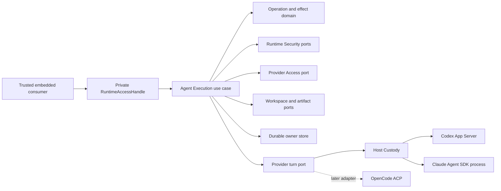
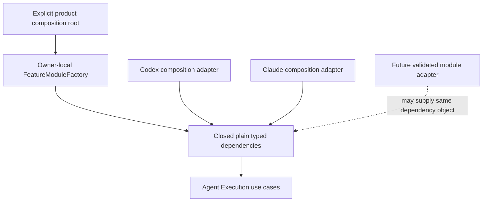

# Contained Agent Turn V1 delivery plan

## Purpose

This plan delivers the first real Agent Execution vertical slice without
turning the MVP into a general agent platform. A caller submits one contained
turn, Agent Runtime durably owns its identity and authority, one provider is
attempted at most once, output is streamed into an isolated workspace, and the
caller receives a content-addressed result or an honest nonterminal
`reconcile_required` outcome.

The first live canary is Codex App Server on hosted Linux. Claude Agent SDK is
characterized and implemented in parallel behind the same product-owned ports,
then receives its own canary after the Codex contract is stable. OpenCode is a
contract-validation provider in this delivery and does not receive a production
adapter yet.

This is an implementation plan, not a replacement for accepted ADRs. Before
production code, Phase 0 must preserve proposed ADR-0006 byte-for-byte, accept
successor ADR-0010 for its V1 subset, and accept companion ADR-0009 for the
contained-turn entrypoint, trusted scope, durable cancellation, and
Host-shutdown semantics.
Accepted ADR-0001 through ADR-0004 and the existing passive portion of ADR-0008
remain authoritative.

## Current delivery evidence

The implementation through product revision `735f2422` now contains the
provider-neutral operation kernel, PostgreSQL store, disposable workspace and
artifact custody, process custody, Codex App Server adapter, Claude Agent SDK
adapter, and private scope-bound `RuntimeAccessHandle.containedTurn` surface.
The handle returns an operation reference only after durable acceptance;
observe and cancellation remain bound to the trusted tenant/project scope.
Caller abort only detaches its waiter. Host disposal submits durable
cancellation and cannot manufacture containment or terminal truth.

Historical focused evidence at `735f2422` was green: 58 Agent Execution tests,
63 Embedded Runtime tests, and five PostgreSQL restart/concurrency/corruption
tests. The exact Codex `0.150.1` hosted Linux x64 canary harness and static tuple
are retained historical candidate implementation evidence; no content-addressed
successful live-turn receipt bound to the current source SHA is committed.
As of candidate `32c639e396a6c1f886545c33d45bfead865d42da`, the current static
Codex candidate supersedes `0.150.1` with `@openai/codex@0.153.4` to match
the source-pinned platform tuples and protocol fixtures; this revision sync
does not transfer historical evidence or promote live qualification.
Its bounded credential inventory is only a pre-spawn observation: it does not
prove the exact bytes later opened by Codex and does not close same-UID file
mutation. That proof remains part of route and deployment qualification.
Darwin arm64 has immutable package/binary/initialize candidate authority and
synthetic cooperative composition evidence, but its exact-SHA local macOS
canary and qualification-registry promotion remain open. The hosted Claude `0.3.251` path
passed adapter and custody conformance and reached the provider authentication
boundary, but live success remains blocked by the test account's expired OAuth
session. That external failure is retained as a qualification blocker rather
than relabeled as provider success.

The current direct composition remains the authority. Extension Foundation PR
#22 and Draft PR #27 still do not authorize a production Module Kit runtime.
Future admission remains limited to one outer composition adapter and parity
tests; domain, use cases, provider adapters, persistence, the private handle,
and consumer calls must remain unchanged.

## Ownership boundary



Agent Execution owns operation identity, state transitions, effect continuity,
dispatch authority, canonical output admission, terminal truth, and
reconciliation debt. Runtime Security owns authorization decisions and the
final pre-dispatch revalidation. Runtime Configuration and Runtime Inventory own
their existing profile and runtime facts. Host Custody owns process identity,
bounded stop, output drain, and platform containment evidence. Provider
adapters translate protocols and never persist domain state directly.

Provider Access owns account, access, provider-route, credential-binding, and
credential-generation facts. Agent Execution owns adapter, binary, and adapter
capability-manifest revisions. Provider Access facts enter Agent Execution
through one Agent Execution-owned narrow consumer port and an outer-composition
anti-corruption layer; they are never hidden inside a provider adapter,
dependency bag, environment scan, or module declaration. Phase 2 materializes
the first minimal Provider Access feature rather than assigning its policy to
Agent Execution.

| Symbol or responsibility | Owner |
| --- | --- |
| operation, coarse effect, output closure, terminal barrier | Agent Execution |
| account, access, provider route, credential binding and generation | Provider Access |
| adapter, binary, and adapter capability-manifest revisions | Agent Execution |
| resource and invocation authorization | Runtime Security |
| process/session custody and containment evidence | Agent Execution Host Custody |
| App Server or SDK translation | outer provider adapter |
| trusted scope, private handle, composition-resource disposal | Embedded Runtime / `AgentRuntimeHost` |
| any future declaration or module adapter | product-local outer composition only |

The canonical user project is never a provider workspace in V1. The provider
runs only inside a new disposable workspace. Its authoritative deliverable is a
deterministic result manifest plus content-addressed artifacts. A patch is a
derived view, not the source of truth and not an automatic write into the real
project.

## Invariants

- `CommandId`, `OperationId`, one coarse `EffectId`, and every attempt identity
  are allocated before provider dispatch.
- Durable command acceptance and durable dispatch claim are separate atomic
  owner-store transactions. Both complete before the provider can start.
- The dispatch claim is the final product-owned linearization point and checks
  the current authority revision, security decision, operation fence,
  cancellation state, workspace binding, and ADR-0004 negative guard.
- One V1 operation permits at most one provider attempt. Transport ambiguity is
  never converted into retry permission.
- Every attempted operation receives a fresh provider process tree and fresh
  provider turn/session identity. Cross-operation process or session reuse and
  resume are deferred, so empty custody can be proved before terminal commit.
- Timeout, disconnect, missing history, or `not_found` after dispatch becomes
  nonterminal `reconcile_required`; it is not `failed`, `cancelled`, or a new
  terminal result.
- Cancellation before dispatch can finish only with exact proof that execution
  did not start. Cancellation after dispatch requests containment and does not
  assert that provider effects stopped.
- Terminal commit requires provider execution closure, complete output drain,
  custody evidence, workspace and artifact closure, effect resolution, and the
  sealed terminal requirement manifest.
- Canonical output is accepted only while the operation, execution generation,
  output fence, cursor, workspace, and provider binding are current.
- No production provider fallback exists. A failed or ambiguous Codex path does
  not start Claude, CLI Codex, or another transport.
- Provider output, paths, terminal controls, tool requests, and artifacts are
  untrusted data until normalized and admitted.
- No real user project, ambient credential directory, existing agent session,
  or production runtime is used by automated tests.

## Approved V1 scope

Included:

- one contained analysis turn with optional writes only inside the disposable
  workspace;
- durable PostgreSQL-backed operation, command, effect, output, and receipt
  records for the hosted path;
- streaming observations with bounded backpressure and cursor continuity,
  except the Codex App Server admission path, which accepts each turn as a
  whole-turn buffered unit rather than incremental per-item streaming with
  backpressure; Claude Agent SDK admission remains incremental. This is an
  accepted provider-specific admission design, not an unmet streaming
  requirement;
- cancellation request, process-tree stop, complete drain, and honest ambiguous
  state;
- deterministic result manifest and content-addressed artifact capture;
- a minimal Provider Access collaboration slice if credentials, account
  generations, routes, or provider capability facts are required by the live
  adapters;
- Codex App Server adapter and hosted Linux canary;
- Claude Agent SDK adapter developed in parallel and canaried second;
- provider-neutral capability discovery with typed `unsupported` results;
- private embedded TypeScript access through the ADR-0008 composition boundary.

Deferred:

- resume after Agent Runtime restart;
- provider session load, fork, list, and deletion as product capabilities;
- automatic retry, provider fallback, and multi-provider racing;
- child-agent accounting and delegation budgets;
- direct writes into canonical projects;
- multi-host takeover and active-active controllers;
- installer and updater work;
- a generalized multi-effect framework;
- public SDK, IPC, Protobuf, HTTP API, plugin API, or dynamic module graph;
- production OpenCode adapter and native reconciliation plane.

## Provider decisions

### Codex

Use the stable Codex App Server JSONL protocol over stdio under AR Host Custody.
The ordinary CLI is diagnostics only. The first slice has no automatic CLI or
SDK fallback. The adapter maps negotiated App Server capabilities into the
provider-neutral turn port and reports unsupported functionality explicitly.
Do not copy subscription-runtime App Server spawn, systemd launcher, slot
pool, resume, or CLI fallback
([SR-AP-2](subscription-runtime-port-candidates.md#sr-ap-2-silent-second-attempt),
[SR-AP-4](subscription-runtime-port-candidates.md#sr-ap-4-process-reuse-across-operations)).
See
[subscription-runtime-port-candidates.md](subscription-runtime-port-candidates.md#codex).

### Claude Code

Use the official Claude Agent SDK, but replace its default process spawn with a
Host Custody callback. AR, not the SDK default launcher, owns the process group,
environment allowlist, workspace, stop deadline, and termination evidence. The
adapter consumes the SDK iterator until complete drain and keeps SDK session
objects outside domain and public contracts.
`persistSession` is false; resume/fork are not V1. This spawn split is the
intended design, not a temporary hack. Do not copy subscription-runtime
default SDK spawn, CLI print, or Claude BG
([SR-AP-1](subscription-runtime-port-candidates.md#sr-ap-1-provider-owns-the-process),
[SR-AP-3](subscription-runtime-port-candidates.md#sr-ap-3-provider-session-as-continuation)).
See
[subscription-runtime-port-candidates.md](subscription-runtime-port-candidates.md#claude-code).

### OpenCode

For the first future OpenCode execution slice, ACP v1 is the only command writer.
AR launches and owns the single `opencode acp` process and communicates with it
over stdio. This is not a second process layered on top of native OpenCode: the
ACP command boots OpenCode's embedded server inside that same process.

The reasons for ACP-only execution are:

1. It provides one command authority for prompt, cancel, permission, and session
   configuration, preventing duplicate effects after an ambiguous timeout.
2. It gives a reusable provider-neutral transport without leaking OpenCode HTTP
   models into Agent Execution.
3. Fresh turn, streaming, cancellation, and capability negotiation cover the
   first slice; broader native management does not need to block it.
4. The current native observer path has not yet qualified a stable endpoint,
   read-only authorization boundary, gap-free event history, or safe exclusion
   of destructive endpoints.
5. A hybrid writer would add a second ambiguity and reconciliation surface
   before there is evidence that V1 needs it.

ACP-only is not a permanent ban on native OpenCode APIs. Native code remains the
planned owner for installation, health, authentication, catalog, profiles,
history, child-session observation, and exact reconciliation. A later accepted
decision may introduce a native read-only observer after its endpoint identity,
authorization, event-gap recovery, and destructive-route isolation are
qualified. Native and ACP paths must never both mutate the same capability.

## Module and composition strategy

The current product baseline is ADR-0008 L0 Pure DI:



The execution feature is organized as one product vertical slice with narrow
owner-local factories. Domain and application code import no container,
registry, resolver, module graph, lifecycle coordinator, Foundation module type,
or provider SDK type. Provider adapters and Host Custody are outer adapters;
their process lifecycle is product behavior, not a generic module lifecycle.

The migration-safe private composition contract is fixed before implementation:

```ts
type ContainedTurnFeatureDependencies = Readonly<{
  operationStore: ContainedTurnOperationStore;
  security: ContainedTurnSecurityPort;
  providerAccess: ContainedTurnProviderAccessPort;
  workspace: ContainedTurnWorkspacePort;
  artifacts: ContainedTurnArtifactPort;
  custody: ProviderProcessCustodyPort;
  provider: ContainedTurnProviderPort;
}>;

type ContainedTurnFeatureApi = Readonly<{
  submit: SubmitContainedTurn;
  observe: ObserveContainedTurn;
  cancel: CancelContainedTurn;
}>;

function createContainedTurnFeature(
  dependencies: ContainedTurnFeatureDependencies,
): ContainedTurnFeatureApi;
```

The names are planning-level and may be refined during Phase 0, but the shape is
an invariant: one closed dependency input, one framework-neutral capability
output, and no ambient lookup. This API is private composition output. Ordinary
consumers receive only a trusted, scope-bound `RuntimeAccessHandle`; they cannot
obtain this API directly and bypass trusted scope. "Detached" does not mean
lifetime-independent: calls remain bound to their owning `AgentRuntimeHost` and
reject after disposal. Direct composition calls this factory now. A future
module adapter may resolve a validated product profile and call the same
factory. It must not replace the factory, wrap the domain in module objects, or
add a second execution lifecycle.

The factory is synchronous, effect-free, and resource-free. It snapshots the
exact closed dependency object once and creates no process, stream, queue,
worker, timer, listener, socket, lease, or background task. Such resources are
created by Agent Execution or Host Custody and registered with
`AgentRuntimeHost` before capability publication.

Module and product lifecycle terms are explicitly non-equivalent:

| Module state | Maximum permitted meaning | Must not establish |
| --- | --- | --- |
| `prepare/start/ready` | composition dependencies are usable | provider acceptance, process readiness, or dispatch authority |
| `published` | one composition binding is selected | Agent Runtime dispatch or mutation authority |
| `drain` | reject new adapter calls and settle local invocation leases | provider output drain or operation completion |
| `stop/dispose` | release registered composition resources | process death, provider containment, or durable cancellation |
| `failed/aborted/retired` | module candidate outcome | operation failure, cancellation, or reconciliation outcome |

To keep that future change local:

- core, ports, factory, provider adapters, and a future module adapter stay
  colocated in the Agent Execution feature slice;
- product capability identities are stable serializable strings owned beside
  the feature, never paths, package names, runtime symbols, or a central enum;
- provider choice is explicit input at the target composition root and is not
  inferred from installed binaries, registration order, or discovery order;
- the target root resolves one closed provider discriminant to exactly one
  adapter and immutable provider/binary revision before factory invocation,
  handle publication, or provider activity; missing, unknown, duplicate, and
  ambiguous selection fail closed;
- any future inert declaration is metadata only and is kept separate from the
  executable factory;
- any future generated index or nominal handle is a disposable projection and
  never a runtime registry or domain authority;
- any future deferred provider loader is target-local and uses literal imports;
  filesystem scanning and interpolated dynamic imports remain forbidden;
- `RuntimeAccessHandle` exposes detached product capabilities, not module IDs,
  resolvers, contexts, lifecycle objects, or provider SDK sessions;
- `AgentRuntimeHost` remains the owner of resource lifetime and disposal. Module
  activation never substitutes for provider process custody or operation
  terminal truth;
- caller abort detaches a waiter or submits an idempotent cancellation request;
  promise rejection is never evidence of durable cancellation. Host disposal
  seals new access, closes local subscriptions, and waits for or hands active
  operations to owner reconciliation. A timeout yields `disposal_incomplete` or
  `termination_unproven`, never `cancelled`;
- module identities, plan digests, candidate generations, and active-head
  revisions never alias `OperationId`, `CommandId`, `EffectId`,
  `ExecutionGenerationId`, `ProviderHostInstanceId`, authority revisions, or
  execution fences;
- one composition-conformance test kit exercises the direct factory today and
  can later exercise a module adapter against the same dependency fixture and
  capability outcomes.

Extension Foundation PR #22 currently records L0 source custody only and keeps
static authoring, selection graph, lifecycle coordinator, process host, shared
Foundation API, and public SPI at `NO_GO`. Draft PR #27 defines only a future
dogfooding boundary and grants no production authority. Therefore this delivery:

- does not depend on either PR becoming a production Module Kit;
- does not wait for a module runtime;
- keeps one stable composition seam: a feature-local factory accepting plain
  product-owned ports;
- permits a future qualified Module Kit adapter to supply the same dependencies
  only in composition;
- requires no domain, use-case, provider-port, or consumer API rewrite when that
  adapter is introduced;
- stops if more than 30 percent of production changes become generic framework
  glue or ordinary feature work repeatedly requires Foundation changes.

The accepted decision preserves its historical Draft snapshot. During the
implementation slice, the non-authoritative evidence was refreshed again to
Extension Foundation PR #22
`97662d634b5eebd9865099830c0d7f124c7dc133` and Draft PR #27
`83090ff230c53913961c3770605d2f7d533f57df`. PR #22 is now ready for review but
still admits only exact source custody; PR #27 remains Draft. Their exact-head
documents confirm the baseline as product-owned ports, literal imports, pure
factories, closed dependency objects, and explicit composition roots. A future
treatment is a private outer adapter implementing the same product-owned port;
it must be removable without changing the use case, port, or domain model.
Both PRs retain the relevant `NO_GO` boundary for production module runtime,
lifecycle coordinator, shared Foundation API, and public SPI. Refresh these
heads again before admitting a Module Kit adapter because open evidence can
change. Only merged accepted ADRs and owning-product decisions are authority.

V1 does not create a `ModuleId`, inert module declaration, generated module
index, loader table, module adapter, or Module Kit dependency merely to reserve
the future. It preserves only the product-owned factory seam and conformance
fixture. Those module artifacts are introduced later only after the owning
product accepts the applicable L1/L2 trigger.

If a Module Kit is later admitted, the expected migration is one colocated
composition adapter plus parity tests, approximately 150-350 production lines
and 200-450 test lines. The migration budget is zero changes to domain,
application use cases, provider ports, provider adapters, persistence schema,
operation state, `RuntimeAccessHandle`, and existing consumer calls. Exceeding
that boundary means the original seam or the candidate Module Kit is wrong and
requires a new product decision rather than a broad compatibility refactor.

The later adapter is an alternative outer construction path, not a runtime
fallback. Switching back to direct composition is allowed only before handle
publication and before any operation begins, after complete cleanup. After
publication or execution, replacement requires bounded drain and a new Host or
generation. Unknown cleanup is quarantined; direct and module construction are
never active concurrently for the same authority.

When a Module Kit is separately admitted, its normal change surface is limited
to dependency policy, `packages/apps/embedded-runtime/src/composition/**`, a
target-local literal loader only if deferred loading is admitted, and parity,
selection, cleanup, and boundary tests. Contained-turn domain, use cases,
factory contracts, provider ports and adapters, persistence schema,
`RuntimeAccessHandle`, public exports, and existing consumer calls remain
unchanged. A static import-boundary check enforces that Module Kit types cannot
appear below composition.

## Delivery phases

### Phase 0: decision and oracle packet

1. Leave proposed ADR-0006 byte-for-byte unchanged and accept ADR-0010 as the
   narrow `Contained Agent Turn V1` successor. Never accept and mutate an
   existing ADR in one change.
2. Accept companion ADR-0009 without changing ADR-0008; it authorizes the private
   contained-turn `RuntimeAccessHandle` capability, trusted scope binding,
   durable cancellation meaning, and Host-shutdown behavior. Host disposal must
   never imply provider containment or operation terminal truth.
3. Map each V1 choice to ADR-0001 through ADR-0004, ADR-0008, the readiness
   report, provider evidence, and the module boundary above.
4. Add a V1 disposition table to the existing operation oracle: every one of
   its 28 scenarios, 242 examples, and 48,000 explored states is `required`,
   `deferred with reason`, or `not applicable with proof`.
5. Implement the ADR-0004 pre-materialization negative guard in the model before
   any provider adapter exists.
6. Record provider version and capability fixtures at exact revisions. The
   current static candidates are Codex `@openai/codex@0.153.4` and Claude SDK
   `@anthropic-ai/claude-agent-sdk@0.3.251`; static characterization must not be
   described as behavior qualification. Do not use floating versions or mutable evidence.
7. Freeze an identity matrix proving module/generation identities are disjoint
   from operation, effect, attempt, provider-host, authority, and fence
   identities.
8. Freeze the composition compatibility fixture: direct Pure DI must construct
   the feature from the exact closed seven-member dependency object, including
   Provider Access, expose only detached product capabilities, and pass without
   any module-framework package installed.
9. Record the exact reviewed heads of Extension Foundation PR #22 and #27 as
   non-authoritative inputs and map every applicable guardrail to the
   compatibility fixture. Refresh the map if either Draft head changes.
10. Freeze a versioned adapter capability manifest, exact
   `contained_unmediated_effect` classification, worst-case granted resource
   scope, immutable terminal `RequiredReceiptSet`, and
   `ContainmentExecutionReceipt` binding to scope, binary revision, containment
   policy, host custody, provider observation, and output drain.

Exit: accepted narrow decision, no unresolved P0/P1 contradiction, existing
oracle green, and no second TCK.

### Phase 1: synthetic operation kernel

Implement provider-free domain and application behavior first:

- command acceptance and idempotent command receipt;
- separate dispatch claim CAS;
- negative guard and cancellation races;
- one coarse effect and one allowed provider attempt;
- orthogonal dispatch, execution, containment, output, reconciliation, and
  terminal axes;
- sealed terminal requirements;
- stable typed errors and capability discovery;
- in-memory adapters only for unit, property, and oracle tests.

Use a deterministic fake provider and fake custody adapter. Inject a crash or
race at every authoritative transition. The kernel must not import Node.js,
PostgreSQL, provider SDKs, filesystem adapters, or module-framework types.

Exit: all oracle, property, mutation, race, cancellation, and model-checking
tests pass; no provider or host process has been launched.

### Phase 2: durable store, workspace, and artifacts

Add the hosted production adapters:

- PostgreSQL transactions and uniqueness constraints for command acceptance,
  dispatch claim, operation revisions, effect continuity, output cursors, and
  terminal receipts;
- lease and generation fencing without treating a lease as process authority;
- disposable workspace creation with path, symlink, hardlink, case, Unicode,
  permission, quota, and cleanup guards;
- content-addressed blobs and a deterministic result manifest;
- bounded streaming projection with backpressure, reconnect cursor, and stale
  output rejection;
- quarantine rather than cleanup whenever provider termination is uncertain.

Exit: restart and fault-injection tests prove durable recovery boundaries. The
in-memory store remains test-only and is not presented as hosted durability.

Phase 2 also materializes the smallest Provider Access feature and package
allowed by ADR-0005. Agent Execution receives only opaque account, access,
route, credential-binding, and credential-generation facts through its narrow
consumer port; adapter, binary, and capability-manifest revisions remain Agent
Execution-owned. Raw credentials, provider account selection, refresh policy,
and route policy remain outside Agent Execution, Host Custody, Embedded
Runtime, and module composition.

### Phase 3: production Host Custody

Owner ruling 2026-09-12: Host Custody is an **optional contained-turn
profile**, product default **off**. Ordinary user-session runtime does not
require it. Current delivery leaves that profile unfinished; see
[Host Custody optional default](host-custody-optional-default.md). The
checklist below remains the Host Custody contract when the profile is selected
later. It is not a PR #69 merge gate.

Build a product-owned custody adapter rather than promoting the existing Rust
Guardian evidence spike to production by assumption. It must prove:

- exact executable and launch revision;
- allowlisted environment and synthetic home where supported;
- canonical disposable workspace binding;
- POSIX process-group custody on Linux and macOS;
- bounded signal escalation, descendant handling, and output drain;
- stable process identity independent of PID reuse;
- terminal or quarantined receipt after every stop path;
- secret-safe diagnostics and no ambient credential copying in tests.

POSIX process groups qualify only a declared cooperative profile. The hosted
Linux live canary requires a dedicated non-root cgroup/container boundary with
pre-exec placement and exact residue evidence; otherwise it remains a
cooperative process test and cannot qualify hostile containment. A successful
root exit or empty process group alone is never descendant containment proof.

Windows production execution remains typed `unsupported` until a Job Object or
equivalent adapter passes its own qualification. Windows check and contract
tests may still run.

Local macOS canaries qualify protocol mapping, desktop process management, and
disposable-workspace behavior only. They do not claim hostile containment: a
process group alone cannot prevent a descendant from escaping with a new
session. Any stronger macOS claim needs a separately qualified containment
adapter and exact registry tuple.

### Phase 4: provider adapters in parallel

Codex and Claude lanes share only the accepted provider-neutral ports and frozen
fixtures. They do not edit each other's provider code.

Codex lane:

- generate stable JSON Schema and TypeScript bindings from the exact selected
  App Server binary in a disposable directory, then bind package version,
  platform, binary digest, schema-tree digest, generated-binding digest,
  capability manifest, and codec limits into one immutable revision fixture;
- App Server capability negotiation and exact-version fixture;
- request and event codec with unknown-field policy;
- streaming, cancellation, final response, protocol-error, process-exit, and
  ambiguous-disconnect mappings;
- no CLI fallback.

Claude lane:

- official SDK capability characterization;
- exact SDK/package/bundled-CLI revision fixture and mandatory
  `spawnClaudeCodeProcess` custody callback, with the default launcher forbidden;
- iterator drain, cancellation, terminal result, process-exit, and SDK-error
  mappings;
- no SDK type in domain or embedded consumer contracts.

Both lanes must feed proposed contract changes back to the kernel owner before
implementation. Provider-specific needs may add a capability or adapter seam;
they may not weaken operation, effect, custody, or terminal invariants.

OpenCode lane is documentation and contract validation only: replay exact ACP
fixtures against the neutral port, record unsupported gaps, and create no
production adapter in this delivery.

### Phase 5: disposable E2E qualification

Run E2E only in newly created sandbox/test repositories and isolated homes.

Codex canary first:

1. Exact hosted Linux binary and protocol revision.
2. Dedicated non-user credential generation, synthetic home, non-root
   cgroup/container boundary, and no ambient configuration.
3. Read-only analysis turn in a disposable repository.
4. Workspace-write turn that produces an artifact without touching the source
   repository.
5. Cancellation before dispatch, during stream, and during shutdown.
6. Provider crash, AR crash, disconnect after dispatch, partial output, late
   output, malformed event, output flood, and process descendant cases.
7. Verify store, custody, effect, artifact, credential release, residue, and
   terminal receipts.

Claude canary begins only after the neutral contract used by the Codex canary is
stable. It repeats the same product scenarios through the SDK adapter and adds
SDK-specific iterator, callback, and child-process failure cases.

No test may launch a provider in an existing user project, inspect an ambient
real session, assign a real task, or use a real project terminal. Hosted and
local macOS canaries use only newly created test repositories and explicit test
credentials.

### Phase 6: integration and final qualification

- Compose the capability behind a private ADR-0008 handle without a public
  transport contract.
- Run architecture-boundary, dependency, type, lint, unit, property, oracle,
  package, security, and disposable E2E checks.
- Verify exact-head Linux and macOS evidence and expected Windows refusal.
- Review every ADR requirement and every deferred item against the final diff.
- Keep ReviewRouter infrastructure failures separate from code evidence, but do
  not call the technical gate green when a required project-owned check failed.

## Hosted worker execution model

All heavy research, implementation, fault injection, and E2E work should run on
subscription-runtime hosted workers in isolated worktrees. For the current
PR #69 delivery, the owner's accepted setting is `gpt-6-astra`, `xhigh`
reasoning, and normal service (`--service-tier default`) for both writers and
independent reviewers. The owner's 2026-09-06 instruction to disable fast mode
supersedes the earlier fast-service setting. Apply it to all subsequent launches
and continuations; completed fast runs retain their historical evidence.

Parallel ownership:

| Lane | Owns | Must not change |
| --- | --- | --- |
| Decision/oracle | ADR-0006 packet and oracle disposition | production adapters |
| Kernel | domain and application operation semantics | provider SDK code |
| Persistence | PostgreSQL adapters and recovery tests | domain policy |
| Workspace/artifacts | sandbox and artifact adapters | provider transport |
| Custody | process ownership and platform adapters | operation truth |
| Codex | Codex codec and adapter | Claude/OpenCode adapters |
| Claude | Claude SDK adapter | Codex/OpenCode adapters |
| OpenCode validation | ACP fixtures and gap report | production adapter |
| Qualification | E2E harness and evidence | product semantics |

Every lane receives the exact accepted decisions, this plan, immutable provider
evidence, scope exclusions, and test safety rules. Contract changes are proposed
to the kernel owner rather than silently edited across lanes. Integration happens
in dependency-ordered checkpoints. The accepted PR #69 exception below keeps
this existing delivery in one PR; future deliveries retain the normal PR budget.

Independent reviews occur after Phase 0, after the kernel, after each provider
adapter, and on the final exact head. Reviewers classify findings as product
correctness, architecture, security, provider compatibility, test-evidence gap,
or optional improvement. P0-P2 findings are fixed and re-reviewed; speculative
platform work is recorded but does not block the MVP.

Track the model-split experiment per lane: time to first working patch, first-run
test pass rate, tests added, review defects, and iterations to stable head.

## Required tests

- duplicate command with same and different fingerprint;
- prevention before acceptance, between acceptance and claim, and after claim;
- cancellation at every transition boundary;
- two concurrent dispatch claimers;
- stale authority, security, profile, workspace, and provider binding revision;
- crash before and after each durable commit and provider write;
- timeout or disconnect before write, during write, and after provider acceptance;
- no blind retry from missing or ambiguous provider evidence;
- stale, duplicate, reordered, malformed, oversized, and late output;
- output drain racing process exit and cancellation;
- descendant escaping normal process shutdown;
- PID reuse and mismatched executable identity;
- path escape, ancestor symlink, hardlink, case/Unicode collision, and filesystem
  permission or quota failure;
- content digest collision simulation and corrupt artifact manifest;
- PostgreSQL restart, lease expiry, split-brain claimant, and projection rebuild;
- adapter reports each unsupported capability without emulation;
- packed package has no forbidden dependency or private DTO export;
- Codex and Claude conformance fixtures produce the same product-level outcomes,
  except cancellation-during-stream on Claude, which closes as
  `reconcile_required` instead of `cancelled`, because the Claude Agent SDK
  does not expose a cancelled/aborted terminal state distinct from failed;
- OpenCode ACP fixture validates the neutral contract without production launch.
- direct composition rejects missing, unknown, duplicate, or ambiguous provider
  selection before factory invocation, handle publication, or effects;
- the composition fixture proves the exact seven dependency keys including
  Provider Access, snapshot-once behavior, one selected provider call, zero
  unselected provider calls, Host-bound API
  lifetime, partial-construction cleanup, and no module imports below composition;
- future direct/module differential tests use synthetic providers and never run
  two composition paths against the same real effectful operation.
- conformance covers abort before and after dispatch, Host disposal during an
  active operation, selected-provider startup failure, provider success with
  uncertain output drain, custody/provider death asymmetry, non-cooperative
  cleanup, late adapter callbacks after stop, ambiguous provider acceptance,
  and proof that the composition adapter invokes no use case or provider
  directly.

Do not duplicate scenarios already proved by the operation oracle. Add a new
oracle case only when a minimized counterexample demonstrates a missing state or
transition. Adapter conformance and E2E suites may reuse oracle scenario IDs.

## Pull request sequence

### PR #69 delivery scope amendment (owner accepted 2026-09-08)

The owner explicitly selected one real Linux Codex E2E as the delivery boundary
for this existing PR. Claude Linux, Codex macOS and Claude macOS live acceptance
and production qualification move to the next delivery stage. This supersedes
the four-combination merge prerequisite in the earlier completion sequence;
it does not declare the original V1 program complete or weaken its invariants.

Keep already implemented deferred-provider code and regression coverage.
Unqualified paths must remain fail-closed and must not acquire production claims
from this merge. Review and required CI still cover all retained PR code.
Do not add new Claude/macOS implementation lanes before this checkpoint ships.

Current acceptance requires a real disposable Linux Codex turn through the
existing seven ports, real PA/RS and PostgreSQL ownership, committed claim,
pre-spawn route enforcement, provider output/exit and cleanup evidence. Finish
exact-head independent review, required checks, qualified Linux-only registry
and L0 evidence, then normal push/merge under the owner's current authorization.
Do not bypass checks or substitute synthetic evidence. Reuse unchanged evidence;
run the final full gate once on the stable candidate and rerun affected checks
only after subsequent changes.

Report current-PR completion separately from original-program completion. The
three deferred live combinations remain outstanding in the original program;
changing the delivery denominator is a scope change, not implementation progress.

### PR #69 completion simplification (owner accepted 2026-09-06)

This execution update preserves the approved V1 scope, ADR invariants, required
tests, and complete Definition of Done. It overrides the replacement-stack
sequence for the existing PR #69 only. Preserve its branch and review history;
do not create a late replacement stack or install dependencies to continue.

Deliver three concrete results in order, running independent owners in parallel:

1. Complete one disposable Linux Codex turn through the existing seven ports:
   committed claim, Host/Provider Access/Runtime Security assembly, enforced
   provider route, actual output and exit, and cleanup receipts. Connect the
   existing owners; do not add another lifecycle or application port.
2. Complete Claude and the existing cooperative macOS path through that same
   contract. Qualify all four original provider/platform combinations and the
   required PostgreSQL boundaries using explicitly test-owned credentials and
   disposable projects. Hosted worker accounts alone are not canary bindings.
3. Seal the stable code SHA, qualification registry, and L0 evidence; finish
   independent review, one final full check/required CI cycle, the final push,
   and normal merge. Verify the merge SHA in main without bypassing checks.

Use focused compiled tests before review. Review related changes that share an
invariant as one bounded cumulative diff after the producer's focused checks;
do not queue separate reviews of nearly identical intermediate snapshots. Each
review records its exact base/head, complete owned paths, dependencies, and
actual validation limits. An unreviewed dependency cannot become approved by
being omitted from the diff. Fix concrete P0-P2 findings and re-review the
remediation; optional generalization does not block delivery.

Reuse passing evidence only when the tested inputs, relevant dependency and
tool versions, and environment assumptions are unchanged and identifiable by
SHA or digest. If they change, rerun the affected check. Reconcile the final
canaries and required CI with the final code SHA. An ordinary infrastructure
timeout permits a bounded retry of only the unproved phase; an ambiguous
provider execution must first be reconciled, never blindly repeated.

Docker/V4 journals and helpers are implementation choices, not additional
product goals. Add code only for a missing accepted invariant or a reproduced
defect. Do not expand into a general HTTP gateway, resource platform, public
SDK, Desktop, Module Kit/ADR-0011, Windows production, or production OpenCode.
The three results above group delivery work; they do not remove acceptance
gates or change the fixed progress-report denominator.

### Delivery ratchet

The default human-review budget is about 2,000 changed LOC per PR. Generated
oracle output, frozen fixtures, lockfiles, and other mechanically verified bytes
are reported separately from handwritten production and test LOC. The budget is
a delivery target, not permission to split one active safety invariant: any
larger PR must state the indivisible invariant and prove why a dormant or
dependency-ordered split is unsafe.

Every PR:

- starts from current `main` or names one exact upstream stacked PR;
- owns one bounded context or one explicit composition/activation event;
- is independently buildable, focused-testable, normally mergeable, and
  reversible by one merge revert;
- leaves unfinished downstream behavior dormant or typed `unsupported` rather
  than publishing a partially safe execution path;
- records handwritten, test, generated/fixture, and total changed LOC
  separately;
- receives one review per exact SHA. A failed review requires a remediation SHA
  before another review; unchanged PASS evidence is reused;
- runs focused owner checks during development, `check:fast` on a stable PR
  checkpoint, and one full `check` on the exact mergeable head.

Hosted delivery uses at most two writers, one reviewer, and one reserved
integrator/gate lane per worker host under normal capacity. A writer checkpoints
every 20 minutes or 500 changed LOC, whichever comes first. A PASS is integrated
or turned into the next mergeable PR within 45 minutes. If the accepted frontier
does not advance for 60 minutes, stop adding writer lanes and clear integration
before expanding scope.

Preflight each hosted lane with the exact Node/pnpm tuple, fresh resource and
account capacity, and Git write capability. If safe execution exposes read-only
Git metadata, the worker produces one deterministic patch or bundle; the
orchestration shell performs the mechanical commit/cherry-pick and a read-only
worker reviews that exact SHA. Do not spend repeated turns retrying `index.lock`,
quota, or account-capacity failures.

An existing mega-PR is closed as superseded only after every valuable hunk,
review finding, and exact evidence artifact maps to a replacement PR or an
explicit exclusion. Its branch and discussion remain immutable evidence; no
force-push repurposes it.

1. `docs(architecture): narrow contained agent turn v1 decision`
2. `feat(agent-execution): add contained turn operation kernel`
3. `feat(agent-execution): add durable operation persistence`
4. `feat(agent-execution): add disposable result workspaces`
5. `feat(runtime-security): add provider process custody`
6. `feat(codex): add app server contained turn adapter`
7. `test(codex): qualify hosted contained turn canary`
8. `feat(claude): add sdk contained turn adapter`
9. `test(claude): qualify hosted contained turn canary`
10. `feat(embedded-runtime): expose private contained turn capability`

The sequence may use stacked review branches, but no downstream merge happens
before its upstream authority and tests are accepted. Exact-head evidence is
reused by SHA; unchanged heavy phases are not rerun ceremonially.

## Estimates and stop rules

The synthetic kernel is expected to require about 1,500-2,500 production lines
and 2,500-4,000 test lines. A production hosted slice including PostgreSQL,
workspace/artifact custody, process custody, two providers, fixtures, fault
injection, and E2E is more honestly about 7,000-11,000 production lines and
10,000-15,000 test/fixture lines. Re-estimate after Phase 0 and after the first
Codex characterization spike.

Stop and request a new decision when:

- a provider cannot expose evidence needed for honest closure or
  `reconcile_required`;
- a production adapter needs to weaken an accepted invariant;
- provider-neutral APIs begin carrying SDK, ACP, App Server, module-framework,
  filesystem, or PostgreSQL types;
- direct composition cannot supply the required dependencies without dynamic
  selection or independent lifecycle;
- canonical project writes become necessary;
- more than 30 percent of production changes are generic framework glue;
- a second TCK or competing state machine appears;
- hosted E2E would require a real user project or ambient live session.

## Deferred Rust custody discussion

TODO after this delivery: discuss the [Rust custody migration follow-up](rust-custody-migration-follow-up.md).
The owner explicitly deferred that transfer to separate work on 2026-09-06.
Keep PR #69's existing implementation scope and acceptance criteria unchanged;
the future migration estimate is not part of this plan's progress denominator.

## Definition of Done

- Phase 0 decision and oracle packet is accepted.
- The private contained-turn handle, trusted scope, durable cancellation, and
  Host-shutdown semantics are accepted product authority rather than inferred
  from the passive setup-inspection entrypoint.
- One operation has stable identity, separate durable acceptance and dispatch
  claim, one effect, and at most one provider attempt.
- Ambiguity remains visible and nonterminal until exact reconciliation evidence
  exists.
- Canonical projects are never provider-writable; results are reproducible from
  the manifest and content-addressed artifacts.
- PostgreSQL, workspace, streaming, custody, cancellation, drain, and terminal
  paths pass focused crash and race tests.
- Codex hosted Linux canary and disposable local macOS protocol/process canary
  pass at exact revisions, without inflating the macOS result into hostile
  containment qualification.
- Claude passes the same provider-neutral conformance suite and its own hosted
  and macOS disposable canaries under the same platform-claim boundary.
- OpenCode ACP fixtures validate the neutral contract and its production adapter
  remains explicitly deferred.
- Product code remains L0 Pure DI with no module runtime dependency or framework
  type leak.
- A future module adapter can be added beside the feature and pass the same
  composition fixture without changing domain, use cases, provider ports,
  provider adapters, `RuntimeAccessHandle`, or existing consumer calls.
- All applicable accepted ADR requirements are traced to code and executable
  evidence; deferred requirements remain explicit.
- No P0-P2 review finding is open, no test transaction or live process remains,
  and no real user project was touched.
