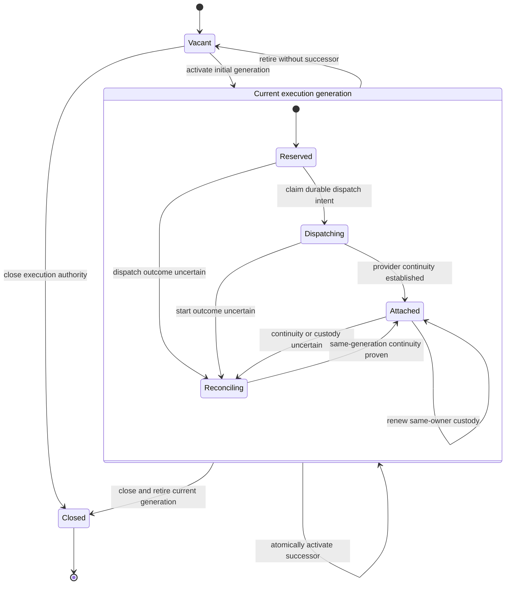

# Execution Generation Model

Status: accepted domain model as amended by ADR-0001, ADR-0002, ADR-0003, and
ADR-0004; wire schemas remain open ADRs.

## Purpose

Agent Runtime needs to distinguish:

- a durable logical runtime session;
- a continuous period of execution authority for that session;
- the provider process, daemon, or remote runtime serving it;
- a caller-visible unit of provider work;
- a technical attempt to dispatch an external side effect.

Collapsing these identities into `ExecutionAttempt` or `RuntimeOperation` would
lose process continuity, fencing, and recovery semantics.

## Domain boundaries

```text
RuntimeSession aggregate
  logical lifecycle
  configuration references
  provider session binding reference

SessionExecutionAuthority aggregate
  runtimeSessionId
  authorityRevision
  ExecutionSlot
    currentGenerationId
    executionEpoch
    authorityState
    custody
    private SessionExecutionFence

ExecutionGeneration
  internal identity
  canonical predecessor
  providerRuntimeInstanceId
  providerRuntimeBootIdentity
  providerSessionBindingRevision
  lifecycle
  outputFeedId

RuntimeOperation aggregate
  durable unit of provider work
  acceptance and outcome
  optional providerInvocationRef

OperationDispatchRecord
  internal dispatch and reconciliation state
```

`SessionExecutionAuthority` is a separate aggregate from `RuntimeSession`.
Execution output and custody use its revision and fence. Independent session
metadata, configuration, and other control-plane changes use the
`RuntimeSession` revision and are not blocked by the execution fence.

`ExecutionGeneration` is an internal domain entity and immutable historical
record owned by the session execution-authority boundary. Historical rows may
be normalized and queried separately, but only `SessionExecutionAuthority`
may activate or retire the current generation.

`ProviderHostInstance` has its own lifecycle and process fence. It may be
shared only if a future provider-, binary-, platform-, and
containment-specific policy is separately qualified. V1 does not reuse one
provider host instance across tenants, runtime sessions, or credential
generations. A provider host instance is never identified only by PID:

```text
ProviderHostInstanceId
ProviderRuntimeBootIdentity
optional diagnostic PID
```

## Authority state diagram



The `Current --> Current` transition creates a new generation. It atomically
retires the prior generation, advances the epoch, rotates the fence, and
installs the successor in the slot.

Provider calls never execute inside these transitions. A successor begins in
`Reserved`; a durable dispatch intent invokes or attaches to the provider only
after commit.

## Generation activation transaction

Initial activation or successor activation is one semantic transaction:

```text
validate expected authority revision and current authority
validate provider binding and runtime-instance preconditions
retire previous generation when present
create canonical successor generation
increment executionEpoch
rotate SessionExecutionFence
update ExecutionSlot
append durable control event and dispatch intent
commit
```

The transaction does not start a process, call a provider, publish to a broker,
or write to an external filesystem.

Storage must enforce:

- at most one current non-terminal generation per runtime session;
- unique internal generation identity;
- unique `(runtimeSessionId, executionEpoch)`;
- at most one canonical successor for a predecessor;
- compare-and-swap on `authorityRevision`;
- atomic state, control-feed append, and dispatch-intent persistence.

Recovery and takeover may construct candidate proposals outside the canonical
lineage. Only the proposal that wins the authority transaction becomes the
canonical successor. Losing proposals return a stale or rejected outcome and
cannot append provider output.

## Reattach and successor rules

Reattach remains in the same generation only when continuous authority is
proven:

```text
same authority owner
same SessionExecutionFence
same ProviderSessionBinding revision
same ProviderHostInstanceId
same ProviderRuntimeBootIdentity
no successful competing takeover
```

Renewing custody by the same proven owner does not create a generation.

A successor is mandatory when any of these change or cannot be proven:

- authority owner;
- session execution fence;
- provider session binding revision;
- provider runtime instance identity;
- provider runtime boot identity;
- canonical process continuity;
- successful takeover winner.

Network reconnect alone does not require a successor if the same authority,
runtime boot, binding, and fence remain provable. An expired custody lease moves
the generation to reconciliation. It does not authorize output until
continuity is proven or a successor wins.

## Transition table

| Command or fact | Current state | Preconditions | Atomic result | External action |
| --- | --- | --- | --- | --- |
| Activate initial generation | Vacant | expected authority revision, valid binding and instance | create generation, epoch + 1, rotate fence, install slot, append control event and intent | dispatch after commit |
| Claim dispatch intent | Reserved | active generation and fence, unclaimed durable intent | mark dispatching with dispatcher ownership | provider start or attach after commit |
| Confirm provider attached | Dispatching or Reconciling | matching generation, boot identity, binding revision, and fence | mark attached, append control event | none |
| Renew custody | Attached | same owner, generation, boot identity, binding, and fence | extend typed custody without epoch change | none |
| Begin reconciliation | Reserved, Dispatching, or Attached | matching current generation | mark reconciling and append reason | provider observation after commit |
| Confirm same-generation reattach | Reconciling | complete continuity proof and no takeover winner | mark attached without epoch or fence change | resume observation |
| Activate successor | Any current non-terminal generation | expected authority revision; continuity lost or takeover/recovery decision | retire old, create successor, epoch + 1, rotate fence, replace slot, append control event and intent | dispatch after commit |
| Retire without successor | Any current non-terminal generation | close, release, or explicit relinquish authority | retire current, invalidate slot and fence, append control event | cleanup after commit |
| Close authority | Vacant or current generation | session closure authority | retire current if present, invalidate fence, mark closed | cleanup after commit |
| Append output | Current generation | valid custody, generation, binding revision, and fence | allocate feed sequence and append canonical output | none |
| Reject stale output | Any | generation, custody, binding, or fence mismatch | no canonical append; write bounded redacted operational evidence | optional security signal |

## Runtime operation semantics

`RuntimeOperation` is one durable provider-visible unit of work, normally an
accepted input or turn. It is not a process, execution generation, transport
command, or generic query.

An operation may move through:

```text
accepted
dispatching
provider_accepted | acceptance_uncertain
active | waiting_for_interaction
reconcile_required
succeeded | failed | cancelled | outcome_indeterminate
```

The exact representation may use orthogonal state dimensions instead of one
enum. `reconcile_required` is durable and nonterminal.

An operation may span multiple execution generations when provider work can be
reattached or resumed without repeating the input. A long-lived generation may
execute several operations sequentially.

Generation replacement never automatically re-dispatches an operation:

- `not_dispatched` may be dispatched when its durable intent is still valid;
- `provider_accepted` must reconcile or reattach without repeating input;
- `acceptance_uncertain` must reconcile before a recovery decision;
- inability to prove a safe continuation remains `reconcile_required` until
  the effect is resolved or the strict ADR-0002 containment, cutoff, output,
  receipt, and no-retry requirements permit `outcome_indeterminate`;
- a new caller request creates a new operation.

`outcome_indeterminate` never asserts that an effect failed or did not occur.
It permanently blocks retry and authority resurrection. If containment remains
uncertain, the operation cannot use this terminal state.

`OperationDispatchRecord` is visible only to AR application and infrastructure
code. It supports outbox dispatch, dispatcher ownership, idempotency,
ambiguous-outcome tracking, and recovery. It is not included in public DTOs,
SDKs, integration events, or consumer-owned ports.

## Output and control feeds

Feed scopes are separate:

```text
control feed    RuntimeSession
output feed     ExecutionGeneration output namespace + channel
process logs    ProviderHostInstance
artifact feed   Artifact identity with session/operation correlation
```

Output entries include public `executionEpoch`, opaque `outputFeedId`, channel,
and optional `RuntimeOperationId`. They never include internal generation IDs,
boot identities, or fences.

Internally, generation activation appends an event containing internal lineage.
The Published Language projection exposes only:

```text
runtimeSessionId
previousExecutionEpoch
executionEpoch
changeReason
previousOutputFeedId
outputFeedId
optional RuntimeOperationId correlation
occurredAt
```

The pair `previousExecutionEpoch -> executionEpoch` provides the public linear
predecessor/successor relationship. Opaque feed IDs identify replay scopes
without exposing the internal aggregate identity. Exact field names remain a
Published Language ADR.

Each output feed has independent sequence and retention. A successor starts a
new output feed namespace. There is no cross-generation output ordering beyond
the session control event that advances the epoch.

## Stale output

Every provider observation ingress is bound to:

```text
internal ExecutionGenerationId
private SessionExecutionFence
ProviderSessionBinding revision
typed custody identity and expiry
```

Before allocating a sequence, the append transaction verifies all four against
the current `SessionExecutionAuthority`. Failure returns a stale execution
outcome and performs no canonical append.

Rejected late output produces bounded operational evidence containing only
redacted metadata:

- runtime session reference;
- observed and current public epoch;
- source runtime-instance reference;
- rejection classification;
- event type, size, and timestamps;
- correlation hash where policy permits.

Payloads, secrets, fences, credentials, and raw provider content are excluded.
Repeated stale writes may emit a security signal. Operational evidence is not
part of the canonical output feed.

## Concurrency and crash tests

The execution-authority conformance suite must cover:

- two concurrent takeovers where exactly one successor becomes canonical;
- reattach continuity proof racing successor activation;
- custody expiry during output append;
- custody renewal by the same owner without epoch change;
- provider binding revision change during recovery;
- provider boot identity change with a reused PID;
- late output from a retired generation;
- old listener retrying after takeover;
- crash after generation activation but before provider dispatch;
- crash after provider acceptance but before durable acceptance recording;
- `provider_accepted` recovery without duplicate input;
- `acceptance_uncertain` reconciliation before any retry;
- duplicate provider observations in the same generation;
- shared runtime-instance restart affecting several session generations;
- independent RuntimeSession control-plane mutation concurrent with output
  append;
- closure racing dispatch, reattach, and output append.

Tests must assert canonical feed contents, operational evidence, epoch and fence
rotation, linear predecessor history, command outcomes, and absence of duplicate
provider side effects.

No conformance test may use a real user project.
