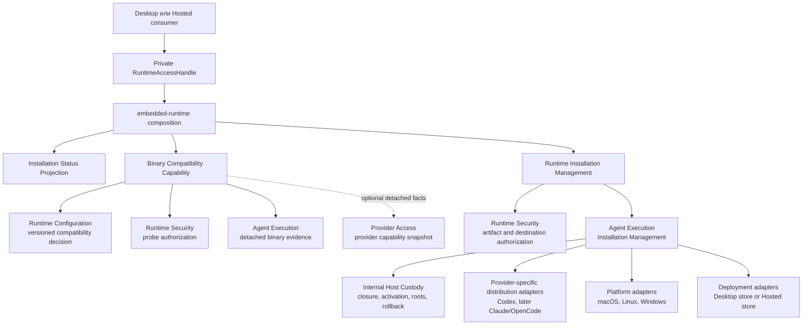
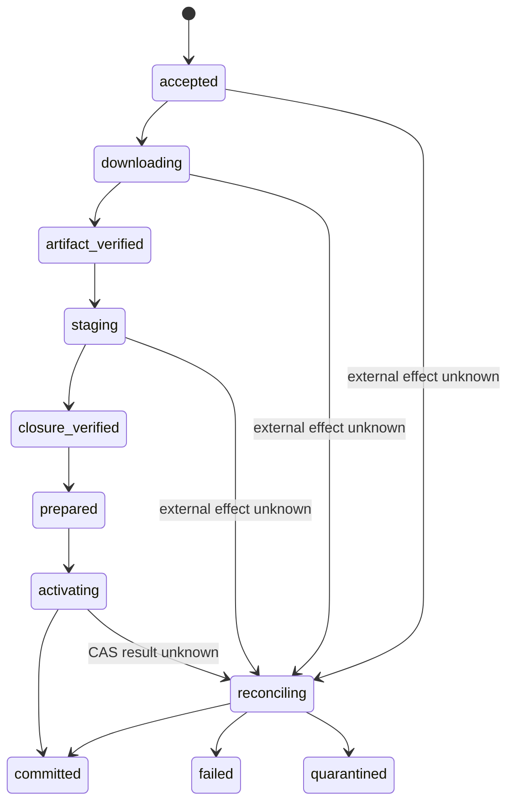
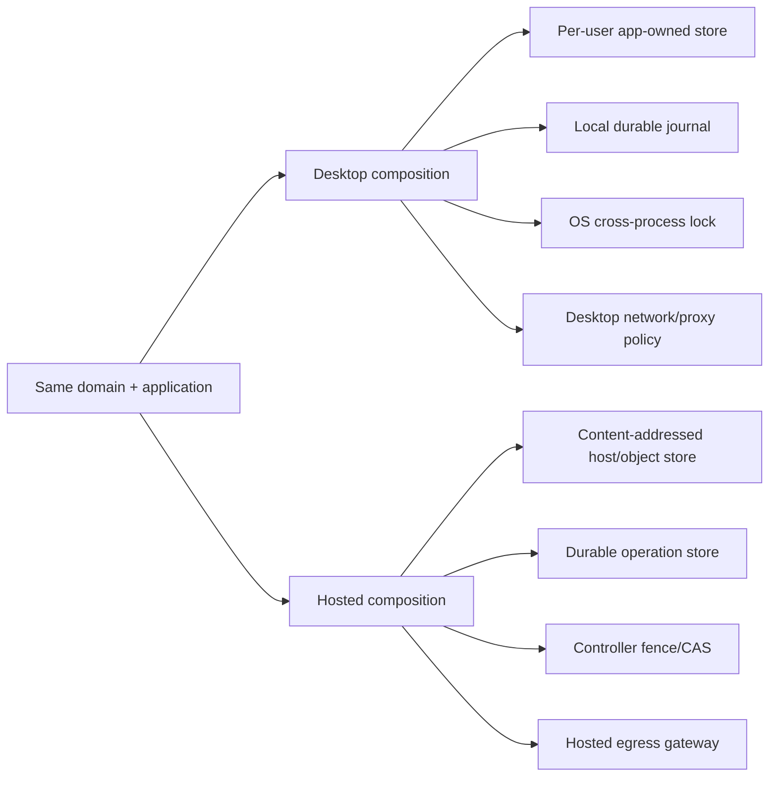

# План: Managed Agent Runtime Installation

Статус: `reviewed / deferred from MVP / implementation-ready только после
повторной product-priority проверки и Phase 0 ADR gate`.

Установка и обновление runtimes не являются текущим MVP-приоритетом: продукт
может быть полезным с user-owned installations. План сохраняет готовое
направление и ограничения, но не разрешает начинать implementation раньше
более важных user journeys или только ради технической полноты.

Evidence baseline:

- Agent Runtime `main`: `e7077a696635a07b921caf85a2445fff6a820195`
  ([merged PR #52](https://github.com/agent-teams-ai/agent-runtime/pull/52));
- legacy frontend: `f6afac73cced62d943a0e891ad08d7b8f88f802f`;
- official distribution references:
  [Codex CLI](https://developers.openai.com/codex/cli),
  [Claude Code setup](https://code.claude.com/docs/en/setup),
  [OpenCode installation](https://opencode.ai/docs/);
- три независимых hosted review на `gpt-5.6-sol xhigh`: architecture,
  reliability/security и MVP/legacy parity;
- общий verdict reviewers: `GO_WITH_CHANGES`, подтверждённых P0 нет.

## 1. Цель

Спроектировать и затем реализовать в `agent-runtime` безопасную, headless и
кроссплатформенную установку coding-agent runtimes. Первый production vertical
slice - Codex. Claude Code подключается вторым реальным provider, OpenCode и
другие runtimes - после подтверждения общей семантики двумя implementations.

Архитектура должна допускать без изменения domain/application contracts:

- локальный Desktop consumer на macOS, Windows и Linux;
- non-root hosted worker на Linux;
- будущий multi-host hosting без изменения domain и application contracts;
- обнаруженные пользовательские установки без их скрытой мутации;
- Agent Runtime-managed immutable installations с безопасным update/rollback.

Поддержка квалифицируется не названием OS, а отдельными exact tuples. Первый
production increment не ждёт все платформы: рекомендуемый canary - hosted Linux
x64/glibc/non-root/local persistent store; следующий независимый increment -
macOS arm64 Desktop. Windows, WSL, Linux arm64/musl и остальные tuples остаются
typed unsupported до собственной qualification campaign.

Это план архитектуры и реализации. Он не разрешает запуск agent sessions,
аутентификацию, изменение пользовательских проектов или перенос Electron-кода
в Agent Runtime.

## 2. Accepted constraints и proposed installation decisions

Уже приняты архитектурой и не переоткрываются этим планом:

- ownership `BinaryRevision` и внутренней Host Custody в Agent Execution;
- private embedded TypeScript entrypoint из ADR-0008;
- complete executable closure semantics из Stage N;
- L0 Pure DI, literal composition и closed capability bundles;
- tenant-first identity, monotonic authority и fail-closed recovery;
- Engineering Foundation только как dev-tooling: production runtime не
  импортирует Foundation и не создаёт второй общий mutation engine.

Остальное ниже - proposed installation decisions. Они становятся accepted
только после Phase 0 ADR с exact Codex source/target/store tuple. Spikes и этот
план сами по себе не объявляют production readiness.

1. `Agent Execution` остаётся bounded context и единственным владельцем
   `BinaryRevision`, installation operation, rollout head, activation,
   rollback, retention и garbage collection.

2. `Host Custody` остаётся внутренней ownership boundary `Agent Execution`, а
   не новым bounded context или npm-пакетом.

3. Installation реализуется отдельной feature-capability
   `runtime-installation-management`. Она не входит в passive
   `codexSetup.inspect` или `claudeCodeSetup.inspect`.

4. Binary compatibility является отдельной sibling product capability и
   cross-context projection. Политика принадлежит `Runtime Configuration`,
   executable evidence - `Agent Execution`, разрешение probe -
   `Runtime Security`; Embedded Runtime собирает detached result. Это не новый
   aggregate внутри Agent Execution.

5. Используется только текущий L0 module baseline:

   - owner-local feature code;
   - Pure DI;
   - отдельный feature factory;
   - полный closed capability bundle;
   - отдельный trusted scope;
   - literal composition в product root.

   Module registry, service locator, private graph, lifecycle framework и
   Foundation runtime не вводятся.

6. Desktop остаётся отдельным repository и consumer. Agent Runtime не импортирует
   Electron, renderer, IPC, React или Desktop DTO.

7. Существуют два принципиально разных вида installation:

   - `ambient` - пользовательская PATH/Homebrew/npm/WinGet/native installation;
     Agent Runtime только наблюдает её и никогда не обновляет автоматически;
   - `managed` - immutable closure в Agent Runtime-owned store; Agent Runtime
     владеет download, verification, activation, rollback и retention.

8. Provider self-update не является authority для managed runtime. Managed
   session всегда закреплена за exact `BinaryRevision`. Provider-specific
   auto-update должен быть отключён или физически предотвращён и отдельно
   квалифицирован.

9. Нельзя использовать floating `latest` как install/apply authority. Channel
   может предложить target, но план закрепляет exact version, artifact identity,
   digest, platform и compatibility-policy revision.

10. Не создаётся provider-generic framework раньше второго production installer.
    Codex V1 получает provider-specific adapters. Общий код извлекается после
    второго provider только при доказанной семантической идентичности.

11. Profile не хранит CLI path, mutable installed version или activation head.
    Он позднее может выражать переносимое требование совместимости или channel
    preference. Execution выбирает и pin-ит exact `BinaryRevision`; installer
    не меняет profiles, auth, routes или workspace trust.

12. Online catalog используется только для discovery. Activation требует
    независимый `ArtifactAuthorization`: official verifiable
    signature/provenance либо exact repository-owned qualification record,
    включённый в Agent Runtime release. Digest из того же live catalog без
    независимой authorization недостаточен.

## 3. Текущий контекст и legacy evidence

Новый Agent Runtime уже реализует passive Codex/Claude setup inspection и
возвращает `found_unverified`. Он не запускает provider и не устанавливает его.

Legacy frontend содержит три крупных donor-файла. Их длина не означает
эквивалентный installer scope: Claude service смешивает auth/catalog/UI, а
OpenCode - discovery/NVM/shims/compatibility.

- Codex: около 771 production LOC;
- Claude Code: около 1690 production LOC;
- OpenCode: около 1045 production LOC.

Legacy полезен как behavioral donor и fixture corpus:

- platform/architecture mapping;
- GUI PATH против interactive-shell PATH;
- Windows `.cmd`/`.bat` shims и native executable;
- NVM layouts;
- redirects, timeout и partial download;
- SHA-256/SHA-512 mismatch;
- compressed/unpacked size limits;
- archive traversal и malformed archive;
- executable permissions;
- failed update при сохранении рабочего runtime;
- progress states, EBUSY, cancellation и cleanup.

Legacy production architecture не переносится:

- renderer/`BrowserWindow` coupling;
- один service для discovery, latest lookup, auth, download, extraction,
  activation и UI progress;
- in-process Promise как единственная serialization;
- удаление существующей version directory до commit;
- mutable/non-atomic `current.json`;
- floating `latest`;
- неограниченная или целиком memory-buffered загрузка;
- отсутствие durable journal, reconciliation и rollback receipt.

Reuse измеряется не процентом строк, а ledger для каждого поведения:

| Legacy behavior | Target disposition |
| --- | --- |
| platform/arch mapping и package fixtures | rewrite as governed fixture |
| checksum, archive bounds, traversal corpus | reuse test intent; переписать implementation |
| progress, EBUSY, cancellation vocabulary | characterize; доказать новую durable semantics |
| failed-update preservation и same-version reuse | обязательный acceptance test |
| BrowserWindow/facade/global state | reject |
| floating latest, delete-before-commit, mutable current.json | reject |

Текущий Legacy Feature Inventory всё ещё указывает Agent Runtime `493c6c3`,
поэтому его `currentCommit` и positive acceptance evidence обновляются один раз
в финальном integration PR. `CLF-06` разделяется на status/update availability,
artifact safety и transaction/recovery; cancellation помечается как новое
требование, а не legacy parity.

## 4. Общая архитектура



`RuntimeAccessHandle` может содержать sibling namespaces, но их authority
разделена:

```text
RuntimeAccessHandle
├── codexSetup.inspect                 passive/offline
├── claudeCodeSetup.inspect            passive/offline
├── codexCompatibility.inspect         authorized bounded probe
└── codexInstallation
    ├── inspectStatus
    ├── plan
    ├── start
    ├── getOperation
    ├── findOperation
    ├── listOperationEvents
    ├── watchOperation                  local convenience wrapper
    └── requestCancellation
```

Добавление capability в handle требует полного closed dependency bundle.
Отсутствующий trusted scope возвращает typed unavailable/denied до любых
downstream calls. Setup grant не даёт installation grant.

## 5. Feature placement

```text
packages/contexts/agent-execution/
  src/features/
    runtime-installation-discovery/        # уже существует
    runtime-binary-evidence/               # detached evidence, не compatibility policy
    runtime-installation-management/       # отдельная durable mutation feature
      domain/
      application/
      adapters/
        node/
        providers/codex/
      composition/
    host-custody/                          # internal owner-local module
      domain/
      application/
      adapters/
      composition/

packages/contexts/runtime-configuration/
  src/features/runtime-compatibility-decision/

packages/contexts/runtime-security/
  src/features/runtime-binary-probe-authorization/
  src/features/runtime-installation-authorization/

packages/apps/embedded-runtime/
  src/application/build-codex-compatibility-view.ts
  src/application/build-codex-installation-view.ts
  src/composition/codex-*-capability-bundle.ts
```

Новые top-level packages не создаются. Внутренние folders появляются только
когда в них есть реальный код.

Host Custody - не outbound adapter и не public feature. Installation Management
вызывает её узкие owner-local capabilities: register verified closure, inspect
revision, activate by expected generation, establish/release roots и activate
retained revision for rollback. Физическое хранилище реализует
`HostCustodyStore`; оно не принимает domain lifecycle decisions.

Provider Access не участвует в download. Если compatibility когда-либо требует
account/model/route capability facts, Embedded Runtime принимает только
detached Provider Access snapshot. `CodexDistributionReleaseSource` содержит
только технические artifact coordinates, bounds, digests и provenance.

## 6. Domain language и ownership

### 6.1 Наблюдаемая installation

Existing Setup/Discovery остаётся владельцем поиска user-owned candidates и не
дублируется installer-ом. Embedded status projection объединяет его detached
observation с managed head и compatibility fact. Это не launch authority и не
portable profile data.

Состояние не сворачивается в один двусмысленный enum:

```text
ObservedInstallation {
  custodyMode: "user_owned" | "agent_runtime_managed";
  presence: "present" | "missing";
  attestation: "not_applicable" | "unverified" | "verified" | "failed";
  compatibility: "unknown" | "compatible" | "incompatible" | "unsupported";
  sourceKind: provider-specific observation;
}
```

`ambient` остаётся удобной UI-меткой для `user_owned`, но не lifecycle state.

User-visible selection contract:

| Situation | Result |
| --- | --- |
| только user-owned runtime | показывается и может быть выбран отдельной execution policy; installer его не мутирует |
| только managed runtime | activation head выбирает exact `BinaryRevision` |
| оба существуют | показываются оба; скрытого precedence или fallback нет |
| новая managed installation | plan явно сообщает publication + activation; одно consent может разрешить обе стадии |
| managed closure corrupt, user-owned healthy | оба facts показываются; fallback только по явной policy/choice |
| update failed before head CAS | прежний managed head остаётся current |
| exact closure уже есть | durable no-op receipt без изменения head/mtime |
| catalog offline | installed fact сохраняется, availability=`unknown`; новый unresolved plan=`unavailable` |

### 6.2 Release target

`CodexReleaseTarget` содержит provider-specific exact release coordinate,
channel observation, platform tuple и immutable artifact descriptors. Channel
и latest status - наблюдение, а не identity.

`ArtifactAuthorization` отдельно от live catalog связывает provider, exact
coordinate, platform tuple, archive digest/size, closure expectations, schema,
authorization revision, issuance/expiry по monotonic authority, revocation
generation и trust source. V1 предпочитает official verifiable provenance;
fallback - reviewed exact record, включённый в Agent Runtime package. Если ни
одного независимого trust path нет, результат `distribution_unqualified`.

Authorization registry поддерживает versioned key IDs, overlap при rotation,
minimum accepted release generation и rollback protection. Revocation запрещает
новые plan/activation, но не удаляет closure, пока она rooted running session или
нужна для evidence/reconciliation.

### 6.3 Installation plan

`InstallationPlan` является immutable, stored и hash-bound:

- `TenantId`, `RuntimeScopeId`, `DeploymentIncarnationId`;
- `TrustedInstallationScopeId` и authorization cutoff/decision revision;
- provider и distribution adapter revision;
- exact target version/release coordinate;
- OS, architecture, libc/ABI;
- artifact URLs/identities и exact digests;
- expected compressed/unpacked bounds;
- expected closure components;
- compatibility-policy revision;
- current activation-head revision;
- destination/custody policy revision;
- canonical fingerprint version;
- monotonic time-authority identity и validity bounds;
- activation consent scope;
- общий plan digest.

Consumer не присылает исполняемый plan обратно. `start` принимает opaque
`planRef` и `commandId`; Agent Runtime заново читает сохранённый план и атомарно
проверяет записанную expected head generation. IDs имеют смысл только внутри
bound tenant/runtime/deployment scope; store никогда не выводит scope из пути.

### 6.4 Installation operation

`InstallationOperation` - durable process manager, а не один долгий Promise и
не один mega-enum. Persisted facts ортогональны:

- `phase`;
- `cancellationRequested`;
- `reconciliation: none | required | running`;
- `terminalOutcome: absent | committed | cancelled | failed | quarantined`.

Иллюстративная happy-path projection:



`failed_safe` - derived view только после durable cleanup/disposition receipt.
Unknown publication, registration, cleanup или activation outcome остаётся
nonterminal и reconciles; отсутствие ответа не означает failure/cancelled.

Каждая операция имеет:

- `operationId`;
- idempotent `commandId` и semantic fingerprint;
- monotonic event revision;
- current state и terminal receipt;
- exact plan, artifact и closure identities;
- cancellation state;
- failure classification без secret/absolute-path leakage.

Повтор того же `commandId` с тем же fingerprint возвращает существующую
operation/receipt. Тот же ID с другим fingerprint fail-closed.

Cancellation request - durable intent. Head-generation CAS является единственной
activation linearization point. До неё подтверждённая cleanup/disposition даёт
`cancelled`; после неё canonical result `committed` может содержать
`cancellation_lost_to_commit=true`. Timeout без доказанного process-tree drain
переходит в reconciliation, а не в cancelled.

### 6.5 BinaryRevision и activation head

`BinaryRevision` - digest полной executable closure, а не версия или путь. В
closure входят provider binary, bundled helpers, normalized path/type/mode/bytes
manifest, layout и только execution-affecting adapters/classifiers/codecs.
Presentation DTOs, interface names и прочий не влияющий на execution churn в
identity не входят.

Immutable closure хранится content-addressed. Mutable `ActivationHead` содержит
только текущую revision и monotonic generation. Activation - короткий CAS.
Running session остаётся pinned на старую revision.

Rollback - новая activation transaction на retained previous revision, а не
перезапись старого receipt.

## 7. Application API

API остаётся private TypeScript и detached от persistence/Node/Electron types.

```ts
// Иллюстративная форма, точные DTO фиксируются отдельным contract review.
interface CodexRuntimeInstallationCapability {
  inspectStatus(request: InspectCodexInstallationStatus):
    Promise<CodexInstallationStatus>;

  plan(request: PlanCodexInstallation):
    Promise<CodexInstallationPlanView>;

  start(request: StartCodexInstallation):
    Promise<InstallationOperationRef>;

  getOperation(request: GetInstallationOperation):
    Promise<InstallationOperationView>;

  findOperation(request: FindInstallationOperationByCommandId):
    Promise<InstallationOperationView | null>;

  listOperationEvents(request: ListInstallationOperationEvents):
    Promise<InstallationOperationEventPage>;

  requestCancellation(request: RequestInstallationCancellation):
    Promise<CancellationRequestResult>;
}
```

`watchOperation(operationRef, afterRevision, signal)` может быть локальным
`AsyncIterable` convenience wrapper над paged query, но не durable protocol.
Он имеет bounded queue, typed overflow/resync, monotonic cursor и определённый
`iterator.return()`. Package root экспортирует только detached DTO/capability
types; Host, scopes, factories, stores и reconcilers остаются private
composition.

Правила API:

- status, compatibility и update availability - разные facts;
- offline catalog означает `update_availability: unknown`, не `false`;
- `start` быстро возвращает durable reference;
- durable acceptance и первый replayable event фиксируются до возврата `start`;
- restart находит operation по `commandId` либо active refs из status;
- refs durable scope-bound или MACed versioned refs с durable rotatable key ID;
- replay at-least-once использует stable event IDs, monotonic revision,
  `afterRevision` и bounded `limit`;
- typed outcomes включают `cursor_expired`, `cursor_ahead`, `wrong_scope`,
  `invalid_reference` и `slow_consumer`;
- event retention имеет versioned epoch/byte budget; после cursor expiry клиент
  получает current snapshot + новый cursor, а не unbounded replay;
- Host disposal закрывает handle/subscription, но не объявляет durable operation
  cancelled;
- recovery запускается внутренним reconciler на startup, а не UI-кнопкой;
- explicit rollback создаётся через отдельный rollback plan;
- cancellation принимает свой `commandId` и expected operation revision;
  acknowledgement означает persisted request, а не доказанный cancel;
- cancellation после commit barrier может законно проиграть committed result.
- core commands/DTO semantics рассчитаны на future transport, но IPC/Connect,
  streaming framing и public SDK требуют отдельного решения по ADR-0008 и
  `communication-boundaries.md`; обещания “transport без изменений” нет.

## 8. Outbound ports

Порты принадлежат application layer и остаются узкими:

- `CodexDistributionReleaseSource` - exact technical artifact metadata, без
  account/model/route facts;
- `ArtifactAuthorizationSource` - independently trusted exact authorization;
- `RuntimeArtifactSource` - bounded streaming fetch по уже разрешённому
  descriptor;
- `CodexClosureMaterializer` - provider-specific package layout;
- `RuntimeBinaryProbe` - bounded contained version/capability probe;
- `HostCustodyStore` - physical atomic persistence semantics для internal Host
  Custody module; lifecycle decisions остаются внутри Agent Execution;
- `InstallationOperationStore` - durable operation/events/receipts;
- `InstallationAuthorization` - source, destination, artifact и action policy;
- `StorageAdmission` - budget/reserve preflight и health evidence;
- `MonotonicTimeView`, diagnostic-only `WallClock`, `IdGenerator`, `Digest`.

Lock, metadata transaction, immutable publication и activation-head CAS могут
оставаться одним `HostCustodyStore` consistency boundary. Adapter гарантирует
physical atomicity, но не решает, когда регистрировать, активировать, rollback
или GC. Не создавать интерфейс на каждую filesystem функцию и не переносить
domain transitions в infrastructure.

V1 выбирает один transactional local metadata implementation для plans,
operations, events, head generations, roots, executor claims и receipts. Phase 0
сравнивает qualified SQLite/local transactional adapter с минимальным framed
WAL; нельзя начинать production adapter с набора независимо заменяемых JSON.
Closure bytes публикуются и durable-flush-ятся до metadata registration; head
CAS, rollback root, operation commit и terminal event фиксируются одной metadata
transaction.

## 9. Provider adapters

### 9.1 Codex V1

Актуальная официальная документация предлагает standalone installers для
macOS/Linux/Windows, npm и Homebrew. V1 не должен выполнять `curl | sh`,
PowerShell remote script или менять global npm/Homebrew.

Рекомендуемый managed strategy:

1. Provider adapter получает exact release metadata из discovery source.
2. Сопоставляет target с independent `ArtifactAuthorization`.
3. Выбирает exact platform artifact/package.
4. Скачивает bytes самостоятельно через bounded artifact port.
5. Проверяет registry/vendor digest и provenance/signature/qualification facts,
   если они доступны.
6. Materializes package без lifecycle scripts и без global package-manager
   mutation.
7. Строит полный closure manifest и запускает только bounded probe.

Если current vendor distribution не предоставляет достаточную immutable
metadata, adapter возвращает typed `distribution_unqualified`; нельзя молча
переходить на floating installer script.

### 9.2 Second provider gate: Claude Code или OpenCode

Product preference остаётся Claude Code вторым, но merge order не фиксируется
заранее. Phase 0 второго provider параллельно готовит fresh Claude и OpenCode
distribution packets. Claude идёт вторым только если доказаны exact AR-owned
materialization, independent artifact authorization и enforceable/detectable
self-update prevention. Иначе OpenCode становится вторым доказательным consumer,
а Claude возвращает `distribution_unqualified` до закрытия этих gates.

Это не продуктовый отказ от Claude: это запрет копировать legacy
`claude install`, который отдаёт mutation provider-controlled code.

### 9.3 Claude Code target

Official native installer поддерживает macOS/Linux/WSL и Windows, exact version
и channels. Native installations могут auto-update. Поэтому:

- ambient native/Homebrew/WinGet/package-manager installation только
  наблюдается;
- managed Claude closure должна устанавливаться в AR-owned store;
- self-update для managed execution запрещается provider policy и проверяется
  closure immutability;
- stable/latest/minimum/required range остаются compatibility/update policy,
  но session всё равно pins exact `BinaryRevision`;
- Git Bash/PowerShell, WSL, Alpine/musl и bundled ripgrep входят в platform and
  closure qualification.

Перед реализацией Claude adapter нужен отдельный official-distribution evidence
packet: manifest/artifact format, integrity, redirects, exact-version behavior,
auto-update controls и package layout.

### 9.4 OpenCode target

OpenCode имеет install script, Node package managers, Homebrew, Windows package
managers, Docker и release binaries. Distribution adapter выбирается только
после свежей official qualification. Legacy npm optional-dependency layout не
считается стабильным contract.

OpenCode имеет более сильный existing closure/fixture evidence, но сначала
нужна passive setup/status capability, чтобы consumer UX не начинался с mutation.

## 10. Desktop и Hosted deployment



### Desktop

- managed store находится только в app-owned per-user data root;
- никакой записи в `/usr/local`, Program Files, Homebrew или global npm;
- user confirmation принадлежит Desktop;
- Desktop получает opaque refs, safe display paths и progress events;
- Electron main/preload/renderer adapters остаются в Desktop repository.

Первый Desktop qualification increment - native macOS arm64 на local default
filesystem. Он не блокирует hosted canary и не делает claim за Intel/Rosetta,
Windows или Linux Desktop.

### Hosted single-host V1

- non-root installation;
- persistent host-owned content-addressed store;
- local durable journal + cross-process writer lock;
- отдельный activation head на deployment/tenant scope;
- V1 single-tenant на exact deployment incarnation;
- cross-tenant physical dedup выключен;
- recommended first canary: Linux x64/glibc/non-root/local persistent ext4,
  exec-capable mount.

### Hosted multi-host future

- object/artifact store для immutable closures;
- PostgreSQL или другой qualified CAS store для operations/head/fences;
- host-local verified cache;
- placement проверяет наличие exact closure до assignment;
- node loss, partition и stale controller имеют отдельные qualification gates.

При переходе с single-host на multi-host сохраняются domain ownership и core
command/query semantics. Transport, leases, streaming и deployment adapter
требуют отдельного ADR/qualification и могут расширить transport contract;
заранее обещать byte-identical private API нельзя.

## 11. Cross-platform contract

Platform tuple минимум включает:

- OS: macOS, Linux, Windows;
- CPU: x64, arm64;
- Linux ABI/libc: glibc, musl или typed unknown;
- execution environment: native, WSL, container;
- filesystem capabilities: atomic rename/CAS strategy, case sensitivity,
  Unicode normalization, hardlink/symlink/reparse behavior, durability support;
- executable naming/mode and path constraints.

Fail-closed `unsupported_platform` лучше частичной установки.

Initial qualification matrix:

| Exact tuple | Initial status |
| --- | --- |
| hosted Linux x64/glibc/non-root/local persistent ext4 | recommended first canary after evidence |
| native macOS arm64 Desktop/local default APFS | next independent canary |
| macOS x64/Rosetta | typed unsupported до отдельного evidence row |
| native Windows x64/arm64 | typed unsupported до NTFS/Job Object/AV/durability campaign |
| WSL1/WSL2 и любой store под `/mnt/*` | typed unsupported; не наследует Linux result |
| Linux arm64, musl/Alpine, Desktop Linux | typed unsupported до exact tuple campaign |
| NFS/SMB/FUSE/overlay/network/unknown FS | typed `unsupported_filesystem` |

Каждый tuple может быть released независимо; второй не задерживает первый.
Cross-platform здесь означает одинаковые domain/application contracts и
явные platform adapters, а не ложный blanket claim.

### macOS

- arm64/x64 и Rosetta различаются;
- APFS case/Unicode behavior;
- executable mode, quarantine, code-signing/notarization evidence, если
  применимо к vendor artifact;
- launch-time identity и power-loss/full-sync qualification для выбранного
  store adapter.

### Linux/hosting

- glibc/musl и architecture matrix;
- non-root, noexec mount, read-only root, disk quota/ENOSPC;
- executable bits, ownership, umask;
- process-group/cgroup-style descendant custody, verified drain и kill timeout;
- container restart и host loss;
- bounded RAM/disk during extraction.

### Windows

- native Windows и WSL - разные targets;
- `.exe` против npm `.cmd/.bat` shim;
- junction/reparse point, hardlink, case folding, reserved names, trailing
  dots/spaces и long paths;
- antivirus/indexer locks и EBUSY-style retry;
- atomic replacement semantics и durability должны быть доказаны отдельно;
- Zone.Identifier/SmartScreen, Authenticode where provided и Job Object custody;
- unsupported arm/platform combination возвращается typed unsupported.

## 12. Download, verification и materialization pipeline

```mermaid
flowchart LR
    Plan[Stored exact plan] --> Auth[Reauthorize source + destination]
    Auth --> ReleaseAuth[Verify independent ArtifactAuthorization]
    ReleaseAuth --> Fetch[Bounded streaming download]
    Fetch --> Verify[Digest/signature/provenance]
    Verify --> Stage[Private staging directory]
    Stage --> Extract[Safe provider materializer]
    Extract --> Probe[Contained bounded probe]
    Probe --> Seal[Seal immutable closure]
    Seal --> Register[Register BinaryRevision]
    Register --> CAS[Activation-head CAS]
    CAS --> Receipt[Terminal receipt]
```



Инварианты:

- URLs никогда не приходят напрямую от UI;
- каждый redirect target разрешается до connect, а actual peer reauthorizes
  непосредственно перед первым response byte;
- policy связывает scheme/host/port, resolved addresses, SNI/certificate,
  redirect count, policy generation и monotonic time;
- HTTP downgrade, userinfo, ambiguous IP literals, metadata/link-local/private/
  loopback targets, mixed public/private DNS и unauthorized address change
  denied; sensitive headers удаляются при смене origin;
- proxy/TLS interception поддерживается только exact qualified policy;
- bounded content length и actual streamed bytes;
- bounded entry count, path length и unpacked bytes;
- запрещены traversal, absolute paths, duplicate/case-colliding paths,
  symlink/hardlink/device/FIFO entries, если adapter их явно не квалифицировал;
- descriptor-relative no-follow exclusive-create materialization; запрещены
  sparse/ADS/reparse/socket и неизвестные GNU/PAX forms без qualification;
- package lifecycle scripts не запускаются;
- extraction не пишет за пределы transaction staging root;
- probe имеет disposable cwd/HOME, minimal explicit env, denied network,
  отсутствующие project paths, bounded output/time и process-tree custody;
- staged complete closure identity проверяется до и после probe и перед launch;
- self-mutation даёт `self_update_uncontained` либо quarantine, а не новую
  неявную revision;
- version directory никогда не перезаписывается;
- существующий active head не меняется до полной проверки closure;
- temp cleanup не может удалить unrelated/user content.

## 13. Concurrency, crash recovery и cancellation

- every authority identity rooted in tenant/runtime/deployment incarnation;
- один writer на activation scope через kernel-released platform lock и
  generation CAS; lock никогда не steal-ится по wall-clock age;
- network/download выполняются вне database/command transaction;
- acceptance + first event фиксируются одной transaction до возврата `start`;
- journal transition фиксируется до перехода к следующему external effect;
- closure files и parent directories durable-flush-ятся до registration;
- head CAS, previous-root, operation commit и terminal event атомарны в одном
  metadata transaction;
- crash injection после каждого journal write, file write, fsync, rename,
  register и head-CAS boundary;
- bounded reconciler работает during operation и на startup после любого
  external mutation boundary;
- decision table использует activation intent, expected old/new generations,
  observed head, registered closure, cleanup disposition и receipt;
- неизвестный result не запускается повторно автоматически;
- старый runtime остаётся usable при любом pre-activation failure;
- rollback retention создаётся до publication нового head;
- cancellation до commit barrier останавливает работу и чистит только
  operation-owned staging;
- cancellation во время/после CAS reconciles actual head и возвращает честный
  terminal result;
- progress имеет monotonic revision и восстанавливается после reconnect;
- повторные поздние events не могут воскресить terminal operation.

Partial journal tails допустимы только при versioned framing/checksum rule.
Unreadable head или mid-log corruption возвращают `head_indeterminate` /
`journal_corrupt` и fail closed.

До operation acceptance `StorageAdmission` резервирует archive bytes, maximum
expansion, staging, metadata growth, current + previous closure и отдельный
recovery reserve. Обычная работа не расходует recovery reserve; недостаток
места до download возвращает `insufficient_storage_reserve`.

## 14. Security и supply chain

- exact digest обязателен; версия и TLS сами по себе недостаточны;
- live catalog discovery не авторизует execution;
- official signature/provenance либо repository-owned exact authorization
  обязателен; отсутствие даёт `distribution_unqualified`;
- mutable tag/channel никогда не активируется без exact resolved artifact;
- revocation/suspension policy проверяется при plan и перед activation;
- proxy credentials, registry auth и headers не попадают в plan, logs или DTO;
- archive parser и materializer работают с жёсткими limits;
- probe запускается с timeout, bounded output, минимальной env и без проекта;
- никакие provider commands не запускаются на пользовательском project;
- managed runtime не получает право мутировать собственную closure;
- unverified, quarantined, revoked или self-mutable closure никогда не
  selectable/executable;
- ambient path никогда не становится managed лишь из-за совпадения версии;
- destination roots и ancestors защищаются от symlink/reparse/hardlink races;
- все user-visible ошибки используют stable issue codes и redacted refs.

## 15. Observability

Нужны два разных представления:

1. `InstallationOperationView` для пользователя:
   phase, approximate progress, actionable issue, safe target/version.
2. Internal audit/diagnostic evidence:
   operation/plan/revision IDs, event sequence, adapter/policy revisions,
   redacted source identity и terminal receipt.

Не логировать secrets, arbitrary URLs с query, raw HOME paths, auth headers или
unbounded provider output.

Метрики:

- plan latency и catalog unknown rate;
- download bytes/time и retry classification;
- verification/materialization failures;
- activation CAS conflicts;
- recovery/reconciliation outcomes;
- rollback frequency;
- stale/abandoned staging count;
- active/retained/collectable closure bytes.

Product metrics отдельно:

- install completion rate и median time-to-ready;
- cancellation requested/effective rates;
- recoverable failure и reconciliation rates;
- update acceptance;
- доля failures, при которых прежний working runtime доказанно preserved.

## 16. Реализационные фазы

### Phase 0 - Authority и characterization

1. Добавить один ADR, который:
   - классифицирует принятые constraints и proposed decisions;
   - фиксирует tenant/runtime/deployment identities;
   - выбирает exact Codex distribution + independent authorization;
   - выбирает первый exact tuple: hosted Linux x64/glibc/non-root/local ext4;
   - выбирает transactional metadata store и durability contract;
   - фиксирует install/activate consent и selection table.
2. Заморозить только Codex legacy behavior/fixture ledger. Claude/OpenCode
   fixtures конвертируются, когда их adapter входит в active slice.
3. Зафиксировать unsupported tuples и stable issue codes.
4. Выполнить disposable spike metadata store, flush/rename/CAS, monotonic time,
   storage reserve и process-tree containment для выбранного tuple.
5. Создать governed architecture doc через общий Docs Protocol.

Результат: Codex single-tuple implementation authorized. До этого допустимы
read-only evidence и synthetic spikes, но не frozen production contracts.

### Phase 1 - Codex read vertical: status, compatibility и plan

1. `inspectStatus` объединяет detached user-owned observation, managed head,
   exact compatibility fact и tri-state update availability.
2. Owner-local evidence/security/configuration features и Embedded projection.
3. Отдельный authorized probe scope только для selected candidate/closure.
4. `plan` ничего не скачивает и не мутирует filesystem closure; metadata plan
   сохраняется durably, scope/hash/revision/time-bound.
5. Online source выбирает candidate, independent authorization разрешает target.
6. Offline unresolved install/update plan возвращает unavailable; existing
   status остаётся полезным.

Результат: consumer видит, что будет установлено/активировано, до mutation.

### Phase 2 - Synthetic Host Custody + operation kernel

1. Internal Host Custody module и `HostCustodyStore` port.
2. InstallationOperation store, paged event replay и command lookup.
3. Immutable closure publication, exact complete manifest.
4. Platform lock + activation-head generation CAS.
5. Atomic previous root + operation terminal transaction.
6. Current + one verified previous retention; automatic GC disabled.
7. Reconciler decision tables после каждого external effect.
8. Fault injection без provider package.

Результат: synthetic internal candidate с fault-model evidence. Он не
production-qualified до exact persistence/deployment campaign.

### Phase 3 - Codex managed installation

1. Bounded artifact fetch.
2. Independent authorization + integrity/provenance verification.
3. Safe Codex materializer.
4. Complete closure manifest.
5. Contained probe.
6. Register, activate, paged replay/watch, cancel и reconcile.
7. Explicit rollback plan.
8. No-op/reuse exact existing closure.

Результат: первый end-to-end Codex vertical в disposable selected-tuple harness.

### Phase 4 - First hosted consumer canary

1. Linux x64/glibc/non-root/local ext4 composition.
2. Restart -> operation rediscovery -> paged progress replay.
3. Real exact Codex artifact только в disposable test root.
4. Preserve old head, no user project, no auth/agent/session launch.
5. Packed Agent Runtime + exact-head evidence registry row.

Результат: первый independently releasable production tuple.

### Phase 5 - macOS arm64 Desktop increment

1. Qualified local transactional store/lock/durability adapter.
2. Private TypeScript API; Electron/IPC/UI остаются в Desktop repo.
3. Explicit confirmation bound to publication + activation plan.
4. Restart rediscovery, actionable diagnostics и previous-runtime preservation.
5. APFS/quarantine/signing/full-sync campaign.

Результат: второй independently releasable tuple; hosted release его не ждёт.

### Phase 6 - Second provider

1. Параллельно собрать fresh Claude/OpenCode distribution packets.
2. Product priority Claude, но только если exact AR-owned closure и self-update
   containment проходят; иначе OpenCode становится вторым.
3. Добавить provider-specific source/materializer/probe/factory.
4. Повторить selected-tuple fault/platform campaign.
5. Сравнить implementations и извлечь только одинаковые distribution
   algorithms/fixtures.

Host Custody не извлекается заново и не дублируется: он provider-neutral с
первого implementation благодаря уже принятому Stage N ownership.

### Phase 7 - Platform expansion

1. Один exact tuple за campaign: macOS x64/Rosetta, Linux arm64/musl, Windows,
   WSL и Desktop Linux не объединяются.
2. Windows требует NTFS/reparse/ADS/long-path/AV, FlushFileBuffers/rename и Job
   Object evidence.
3. Общий provider registry вводится только при измеренной необходимости runtime
   selection без rebuild.
4. Multi-host, public SDK/transport, plugin SPI и Foundation extraction -
   отдельные решения.

## 17. Test matrix

### Contract/domain

- stable serialization and exact-key rejection;
- wrong tenant/runtime/deployment incarnation/scope;
- monotonic time unavailable/high-water rollback;
- same command replay и conflicting fingerprint;
- plan digest/revision/expiry;
- orthogonal phase/cancellation/reconciliation/terminal property tests;
- cancellation/commit race;
- rollback as new activation;
- immutable detached reads.

### Artifact security

- digest/signature mismatch;
- catalog digest without independent authorization;
- redirect loop/hop laundering, HTTPS downgrade, cross-origin header stripping;
- DNS mixed private/public, rebinding, peer/source change, proxy interception;
- missing/lying content length;
- compressed/unpacked bomb;
- traversal, absolute path, duplicate path, case/Unicode collision;
- symlink, hardlink, device, FIFO, socket, sparse, ADS, reparse, GNU/PAX;
- unexpected/missing helpers;
- wrong executable mode/architecture/libc;
- package lifecycle script never executes.
- canary probe пытается менять closure/HOME/project, ходить в network, fork
  descendants и игнорировать termination; каждый эффект denied/quarantined.

### Filesystem/recovery

- crash after every transition;
- process kill и VM/power-cut campaign для заявленной durability;
- disk full and permission failure;
- storage reserve сохраняется при ENOSPC;
- read-only/noexec filesystem;
- concurrent processes/controllers;
- paused writer lock, restart, generation conflict; lock не steal по time;
- antivirus/file lock;
- valid partial tail, mid-log checksum corruption, unsupported store schema;
- N -> N+1 migration crash at every commit boundary, compatible read-only
  downgrade и rejected old-writer attempt;
- manifest/head corruption;
- restart during download/staging/activation;
- cleanup deletes only operation-owned files;
- no-op does not alter existing closure bytes/mtime.
- GC/tombstone race с session/operation/rollback roots; deletion failure только
  deferred cleanup.

### Product behavior

- user-owned runtime is never mutated;
- both user-owned/managed observations visible without hidden precedence;
- install + activation consent bound to reviewed plan;
- broken managed runtime falls back only according to explicit policy;
- failed update preserves current runtime;
- offline status reports unknown availability;
- running session remains pinned during update;
- reconnect resumes progress without duplicate events;
- restart rediscovers operation by commandId/active ref;
- cursor expired/ahead/wrong scope, slow consumer и key rotation;
- Host disposal does not falsify cancellation;
- installation does not authenticate, trust workspace or create profile.

### Platforms

- first positive: hosted Linux x64/glibc/non-root/local ext4;
- next positive: native macOS arm64/APFS Desktop;
- all other tuples have negative typed evidence until their own campaign;
- Windows requires NTFS/reparse/ADS/long-path/AV/flush/Job Object evidence;
- WSL and `/mnt/*` never inherit Linux support;
- unsupported target fails before download.

## 18. E2E safety

- Никаких agent sessions, task assignment, runtime launch или real user
  projects.
- Все live package tests используют новый disposable temp root/project.
- Provider execution ограничивается qualified `--version`/capability probe.
- Desktop UI E2E выполняется в отдельном Desktop repository после headless API.
- Hosted E2E выполняется non-root в изолированном workspace/store.
- Каждый реальный install имеет exact target, один planned execution и cleanup.
- Unknown effect/result не повторяется автоматически.

## 19. Rollback и kill switches

- Capability отсутствует без trusted installation scope.
- Provider adapter можно отключить policy/config без изменения core.
- Ambient discovery продолжает работать при отключённом managed installer.
- До activation failure оставляет старый head.
- После activation rollback - отдельный plan на retained revision.
- Suspended/revoked release запрещает новые activations, но не удаляет closure,
  пока существуют session/rollback roots.
- V1 сохраняет active + one verified previous, operation и session/assignment
  roots; aggressive GC и cross-tenant dedup выключены.
- delete сначала создаёт durable tombstone под тем же fence, затем повторно
  проверяет все roots; delete failure - deferred cleanup, не install failure.
- Consumer может вернуться к предыдущей Agent Runtime package version; durable
  store хранит schema/writer/min-reader/min-writer versions. Older binary пишет
  только если явно compatible, иначе `store_schema_unsupported`; unknown
  identity-affecting fields fail closed.

## 20. Не входит в V1

- автоматическое обновление без explicit product policy/consent;
- mutation чужой global npm/Homebrew/WinGet/apt installation;
- authentication, logout, credentials или Provider Access;
- workspace trust mutation;
- saved profiles;
- agent launch/session operations;
- fleet-wide auto-rollout;
- public SDK/Connect/IPC contract;
- dynamic module graph или lifecycle runtime;
- универсальный provider plugin SPI;
- aggressive GC до измеренного retention/rollback window;
- cross-tenant physical closure dedup;
- Windows/WSL/musl/multi-host blanket support без exact evidence.

## 21. Оценка объёма

Legacy file lengths не используются как multiplier. Реалистичные planning
ranges включают production code, tests, fixtures и governed docs:

| Scope | Changed LOC | Risk |
| --- | ---: | --- |
| Codex first exact tuple, consumer-ready durable vertical | 9,000-15,000 | high: distribution, crash recovery, custody |
| macOS arm64 Desktop increment | 600-1,500 external consumer LOC + 1,000-2,500 AR/platform evidence | medium-high |
| hosted Linux x64/glibc increment, если не первый | 2,500-5,000 | high: noexec/ENOSPC/restart/store |
| Windows native qualification later | 3,000-6,000 | high: NTFS/AV/Job Object/durability |
| second provider OpenCode after kernel | 3,000-6,000 | medium-high |
| second provider Claude after kernel | 5,000-9,000 | very high до closure/self-update evidence |
| полный multi-platform Codex roadmap | 15,000-27,000 | very high; не один PR и не один release gate |

Это диапазоны риска, не квота строк. Функция не расширяется ради попадания в
нижнюю границу и не строит framework ради верхней. Если первый slice требует
больше 30% production LOC на generic module/registry/lifecycle glue, работу
остановить и вернуться к L0 Pure DI.

PR slicing примерно по 500-2,500 changed LOC: ADR/evidence, read vertical,
synthetic custody, Codex materializer, selected-tuple E2E, consumer adoption.
Ни один PR не должен объединять новую domain semantics, второй platform adapter
и второго provider одновременно.

## 22. Definition of Done для первого Codex tuple

- Phase 0 ADR принят и exact source/authorization/tuple/store записаны;
- Compatibility и Installation - sibling capabilities, не расширение Setup;
- один Agent Execution package, без нового bounded context;
- Host Custody - internal owner-local module, не mega-port;
- full closed bundles и отдельные trusted scopes;
- user-owned runtime никогда не мутируется;
- managed closure content-addressed и полностью attested;
- plan/operation/head/root/receipt scope включает tenant/runtime/deployment;
- exact stored plan и idempotent durable operation;
- durable lookup/event replay работает после restart;
- crash recovery после каждого mutation boundary;
- activation через head-generation CAS;
- старый runtime сохраняется для rollback и pinned sessions;
- independent artifact authorization, bounded fetch и contained probe;
- monotonic authority, storage/recovery reserve и store-schema gates;
- active + one previous retention, GC и cross-tenant dedup выключены;
- hosted Linux x64/glibc/non-root/local ext4 positive evidence;
- все остальные tuples имеют typed negative evidence, а не blanket support;
- все tests используют synthetic/disposable roots;
- packaged Agent Runtime и exact artifact E2E зелёные;
- Desktop/hosting рассчитаны на одни core semantics, но квалифицируются отдельно;
- module-system остаётся L0 Pure DI;
- Engineering Foundation остаётся dev-only;
- legacy fixtures сохранены, legacy services не импортированы;
- документация и Legacy Feature Inventory обновлены на exact final SHA.

## 23. Phase 0 choices и recommended defaults

### 23.1 Codex distribution authority

1. Official exact artifact + independently verifiable vendor
   signature/provenance, если реально доступно: **🎯 8/10 🛡️ 9/10 🧠 6/10**,
   примерно 1,000-1,800 LOC adapter/evidence.
2. Exact npm closure + registry integrity + reviewed repository-owned
   `ArtifactAuthorization`: **🎯 9/10 🛡️ 8/10 🧠 6/10**, примерно
   1,200-2,200 LOC. Рекомендуемый fallback, близкий к полезным legacy fixtures.
3. Vendor install script или global package manager: **🎯 2/10 🛡️ 3/10
   🧠 3/10**, примерно 400-900 LOC. Rejected для managed mode.

Phase 0 выбирает первый вариант, который проходит immutable-source gates; не
угадывает его до свежего evidence packet.

### 23.2 Первый deployment tuple

1. Hosted Linux x64/glibc/non-root/local ext4: **🎯 9/10 🛡️ 8/10 🧠 6/10**,
   входит в 9,000-15,000 LOC первого vertical. Рекомендуется: hosting уже
   является важной средой, tuple легко автоматизировать и воспроизводить.
2. macOS arm64 Desktop/APFS: **🎯 8/10 🛡️ 8/10 🧠 6/10**, дополнительные
   1,600-4,000 LOC AR + consumer/evidence. Следующий независимый increment.
3. Все Desktop OS + hosting одновременно: **🎯 3/10 🛡️ 6/10 🧠 10/10**,
   15,000-27,000+ LOC. Rejected как all-or-nothing MVP gate.

### 23.3 Local transactional metadata store

1. Qualified SQLite/local transactional adapter на pinned Node/runtime stack:
   **🎯 8/10 🛡️ 9/10 🧠 6/10**, примерно 1,500-3,000 LOC с crash tests.
   Предпочтительно, если Phase 0 докажет packaging, sync и migration semantics.
2. Собственный versioned framed WAL + atomic head store: **🎯 6/10 🛡️ 8/10
   🧠 9/10**, примерно 2,500-5,000 LOC. Только если SQLite не квалифицируется.
3. Набор JSON-файлов/current.json: **🎯 2/10 🛡️ 3/10 🧠 4/10**, примерно
   700-1,500 LOC. Rejected из-за multi-record commit/recovery ambiguity.

### 23.4 Defaults без дополнительного product decision

- retention V1: active + one verified previous + all live operation/session/
  assignment roots; no automatic GC;
- rollback: core command через new plan обязателен, UI affordance может быть
  later;
- install plan может одним consent разрешить publication + activation, но обе
  стадии видимы и head не меняется до CAS;
- no implicit fallback managed -> user-owned;
- Claude является product-priority second provider, OpenCode - evidence-based
  fallback, если Claude distribution остаётся unqualified;
- public transport/SDK, multi-host и dynamic module system не блокируют первый
  vertical.

До Phase 0 gate разрешены characterization, official evidence и disposable
spikes. После accepted ADR можно фиксировать domain/application contracts и
реализовывать selected tuple; production adapter нельзя публиковать раньше его
qualification row.

## 24. Critic consensus

Все три независимых reviewers подтвердили:

- managed installation - правильная следующая capability;
- Codex - правильный первый provider;
- L0 Pure DI, separate setup/compatibility/installation и exact closure верны;
- legacy нужно использовать как behavioral donor, не переносить architecture;
- первый release должен квалифицировать один exact tuple, а не “все OS”;
- implementation допустим после Phase 0 ADR, не до него.

Разногласия:

- reliability reviewer допустил два начальных candidate tuples, architecture и
  product reviewers потребовали выпускать по одному. Итог: оба в roadmap, но
  каждый released независимо; Linux hosted первый, macOS Desktop следующий.
- product reviewer предпочёл OpenCode вторым, исходный product intent - Claude.
  Итог: Claude priority сохраняется, но evidence gate может автоматически
  переставить OpenCode вперёд без ослабления safety.
