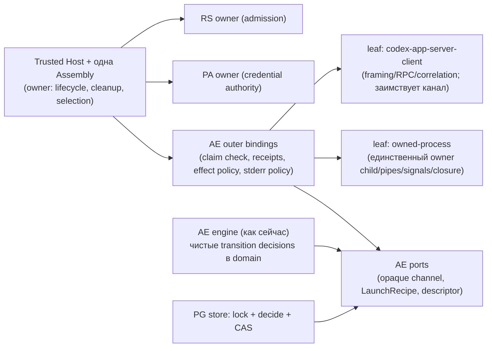
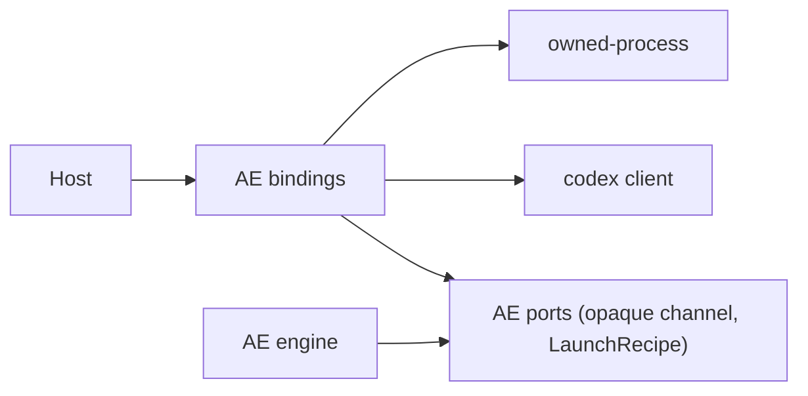
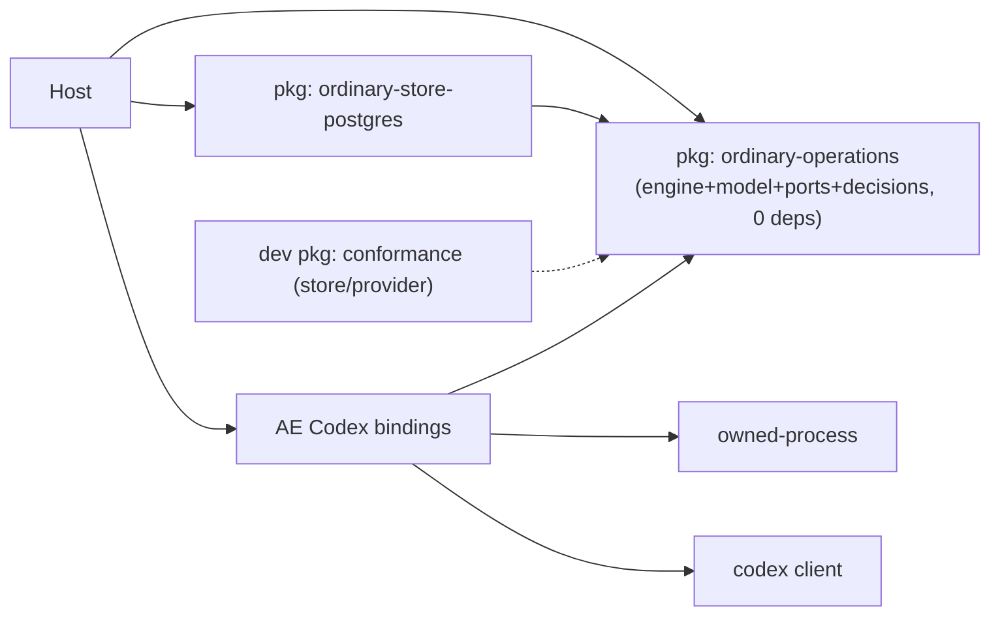

# Критик 2: Core / DDD / SOLID / lifecycle (role `core-lifecycle`)

**Исполнитель:** независимый критик (локальный запуск по решению владельца). **Дата:** 2026-10-01. **Статус:** DRAFT / DECISION PENDING. Только чтение и анализ; исходники, manifests, CI, SQL, ADR не менялись, builds/tests/agents не запускались.

**Изученные snapshots (read-only, exact SHA):**

| Репозиторий | SHA | Примечание |
|---|---|---|
| `agent-runtime` | `b0bcb265d1466da3272078f9dfdb7c6784624283` | лично перепроверено через `gh api repos/agent-teams-ai/agent-runtime/commits/main` = этот SHA (commit date 2026-09-30T20:30:40Z) |
| `get-modular` | `9c722ceff4ede307d06d7a4b63fdebe615f54c53` | current main = consumer pin (проверял координатор) |
| org `.github` | `3fe0f135ffc446b3bb174397c6b5783f72a008a2` | FMS v1, Engineering Quality Standard |
| `engineering-foundation` | `b8ec0f17d1b8d6f9b7a45798931715d59a126888` | `public-api-compatibility.md` |
| `openclaw` | `510beb8d52bd6be9fea27513b9008a50c92a1d2d` | commit date 2026-10-01T16:33:44Z (`gh api`) |

**Реально полученные внешние источники (всё через `gh`, без web/curl/npm):**

1. `gh api repos/agent-teams-ai/agent-runtime/commits/main` -> `b0bcb265…` (2026-10-01).
2. `gh api repos/openclaw/openclaw/commits/510beb8d…` -> дата коммита.
3. `gh search issues --repo openclaw/openclaw "codex app-server orphan"` (10 результатов).
4. `gh issue view 146265 --repo openclaw/openclaw` — https://github.com/openclaw/openclaw/issues/146265 (closed 2026-09-16).
5. `gh issue view 158383 --repo openclaw/openclaw` — https://github.com/openclaw/openclaw/issues/158383 (closed 2026-09-25).

Всё остальное — анализ локальных snapshots. Online research в широком смысле не проводился.

Обозначения: **VERIFIED** — прочитал в коде/доке по указанной строке; **ASSUMPTION** — мой вывод. Severity: P0 блокирует/жёсткое противоречие, P1 серьёзно, P2 следует исправить, P3 мелочь. Уверенность — по 10.

---

## 1. Короткий вывод

Ordinary-ядро Codex в целом спроектировано правильно: claim перед start, запрет повторного запуска после неопределённого claim/send, раздельные факты закрытия, genuine PA/RS. Отдельный engine package **сейчас не оправдан**: по правилу FMS для extraction не выполнено ни одно условие (BOUNDARY, REUSE, PUBLIC_PROVIDER_SURFACE, DEPENDENCY_LIFECYCLE). Кроме того, сейчас у engine не определена семантика restart, а value-closure его ядра тянет примерно 1135 строк contained-turn domain.

Я рекомендую **B′**: это B, у которого изменено содержание R1 и исправлен порядок шагов. Перед extraction двух leaves сделать четыре вещи.

1. Убрать line framing из AE application port и сделать channel непрозрачным для engine.
2. Перенести LaunchRecipe в consumer-owned port и удалить скрытую per-operation Map в Codex adapter.
3. Свести Codex tuple к одному trusted descriptor. Причина не в «нейтральности»: сейчас bump версии Codex одновременно ломает все сохранённые записи и публичный тип.
4. Вынести guards переходов store в чистую domain policy.

После этого process leaf и Codex client leaf можно делать параллельно. Engine остаётся в AE. Явный trigger для extraction: Claude ordinary binding переиспользует тот же engine либо появляется названный внешний consumer полного workflow.

---

## 2. Разделение: цели владельца / прошлые гипотезы / факты / мой выбор

**(a) Цели владельца** (handoff §1, без пересказа целиком):

- очень модульная архитектура и самостоятельные библиотеки;
- сначала Codex;
- ordinary как единственный активный путь;
- понятный `operations` вместо `containedTurn`;
- SOLID/Clean/DDD/DRY/FMS по существу;
- без новых фич;
- одна evolving v1 без лишнего legacy;
- сохранить полезный код;
- регулярно сверяться с OpenClaw;
- минимальные гейты (EF `public-api-compatibility.md:51-63`, VERIFIED: v1 gate активен, S3/v3 dormant по решению 2026-09-25).

**(b) Прошлые гипотезы:**

- B (две leaves + profile/LaunchRecipe; engine в AE как «кандидат»);
- A (только leaves);
- C (B + AE model/SPI/Postgres/conformance);
- отдельный engine (UX-критик);
- тезис прошлого Codex-критика: «SQL adapter применяет AE-owned pure policy внутри транзакции» (`codex-boundaries-report.md:34`).

**(c) Текущие факты** — разделы 3–4 с `file:line`.

**(d) Мой выбор** — разделы 7–9.

---

## 3. Проверка handoff §4.1–4.6 и §4.10 по current source

Пути ниже даны относительно `packages/contexts/agent-execution/src/features/contained-agent-turn/` (AE), `packages/apps/embedded-runtime/src/` (ER), `packages/contexts/provider-access/src/features/contained-turn-access/` (PA), `packages/contexts/runtime-security/src/features/contained-turn-dispatch-authority/` (RS).

### 3.1 §4.1 Codex profile в ordinary contracts — **реальный дефект границы (P1, 🎯8)**

VERIFIED: tuple записан литералом в доменной модели:

> `AE domain/ordinary-model.ts:7` `export const ORDINARY_PROFILE = Object.freeze({executionProfile: "user-session-v1", effectClass: "ordinary_user_session_effect", capabilityManifestRevision: "ordinary-codex-macos-arm64-0.153.4-v1"} as const);`

Тот же литерал повторяется как тип или проверка ещё в следующих местах:

- AE ports: `application/ordinary-ports.ts:56` `capabilityManifestRevision: "ordinary-codex-macos-arm64-0.153.4-v1"`;
- AE validation: `domain/ordinary-validation.ts:61` (`value.capabilityManifestRevision === ORDINARY_PROFILE.capabilityManifestRevision`);
- AE codec: `adapters/outbound/postgres/ordinary-state-codec.ts:23` (бросает `"ordinary envelope profile invalid"`);
- AE public contract: `contracts/contained-agent-turn.ts:111`;
- ER public contract: `features/contained-turn-runtime-access/contracts/runtime-access.ts:233`, экспортируется из корня пакета `ER index.ts:29` (`RuntimeContainedTurnView`);
- PA contracts: `contracts/ordinary-provider-access.ts:6-8`;
- PA domain: `domain/ordinary-provider-access.ts:25-26`;
- RS policy: `domain/ordinary-security-policy.ts:5-6, 13-15, 39`;
- Host: `ER features/ordinary-session-runtime/composition/ordinary-agent-runtime-host.ts:76` (`policy: {...ORDINARY_PROFILE, provider: "codex", ...}`).

Версия бинаря дополнительно зашита в Codex adapter (`ordinary-codex-provider.ts:31` `cliVersion !== "0.153.4"`, `:147` user-agent regex, `ordinary-codex-config.ts:13` SHA бинаря, `:38` `http_headers: {version: "0.153.4"}`) и в PA broker (`PA adapters/outbound/ordinary-pa-broker.ts:61` `headers.version !== '0.153.4'`).

**Моя оценка.** Аргумент «нейтральный profile для одного tuple преждевременен» отвечает не на ту проблему. Главная проблема — версия единственного tuple не может эволюционировать.

ASSUMPTION с высокой уверенностью, следует из кода decode: при смене константы каждая сохранённая ordinary-строка перестаёт декодироваться (`ordinary-state-codec.ts:23`, `ordinary-validation.ts:61`). После этого `observe`, `cancel` и duplicate-`accept` (`ordinary-postgres-store.ts:88-91` декодирует prior) бросают `TypeError` для старых операций. Тот же commandId невозможно ни увидеть, ни переиспользовать, потому что ключ `UNIQUE (tenant_id, project_id, command_id)` (`ordinary-postgres-store.ts:19`).

Одновременно меняется литерал в публичном типе `RuntimeContainedTurnView`. Это изменение публичного API, которое проходит через активный v1 gate (EF `public-api-compatibility.md:53-56` «rejects breaking changes»). Классифицирует ли gate расширение литерала до `string` как breaking — ASSUMPTION, не проверял.

В том же репозитории уже есть прецедент правильной формы, VERIFIED:

> `AE contracts/contained-agent-turn.ts:1` `/** Opaque provider identity. Concrete support is selected by the outer adapter. */`
>
> `:11-18` `ContainedTurnProviderBinding { adapterRevision: string; binaryRevision: string; capabilityManifestRevision: string; … }`

Значит, речь не о новой абстракции, а о выравнивании ordinary с уже принятым в репозитории подходом.

### 3.2 §4.2 LaunchRecipe — **реальный, но дешёвый дефект (P2, 🎯8)**

VERIFIED: `ER …/ordinary-runtime-assembly.ts:18` `"ordinary/prepare-launch": Contract<NodeOrdinaryProcessOptions["prepareLaunch"]>`. Тип рецепта объявлен в concrete Node adapter: `AE adapters/outbound/ordinary-process/node-ordinary-process.ts:6-11, 17-22`. Codex adapter импортирует его из Node process adapter, то есть зависимость идёт adapter -> adapter:

> `AE adapters/outbound/ordinary-codex/ordinary-codex-config.ts:6` `import type {OrdinaryLaunchSpecification} from "../ordinary-process/node-ordinary-process.js";`

**Нюанс CMS.** По букве CMS (`get-modular common-assembly.md:60-66`) порт «consumer-owned», и consumer здесь — process module. Но этим consumer оказался concrete Node adapter, а не AE application. Любая альтернативная реализация process вынуждена импортировать тип Node-адаптера. Исправление — перенести `OrdinaryLaunchSpecification` и `OrdinaryLaunchRecipe` в `application/ordinary-ports.ts`.

**Расхождение с accepted ADR (P2, 🎯7).** `docs/decisions/0090-ordinary-user-session-codex-execution-profile.md:91` прямо говорит «Runtime Configuration owns immutable launch configuration». В коде рецепт, TOML writer и проверка effective config лежат в AE adapter (`ordinary-codex-config.ts:27-88, 95-125`), а в `runtime-configuration` нет ни одного ordinary-файла (VERIFIED по листингу). AGENTS.md требует считать accepted ADR нормативными. Нужно явное решение в R0.

Моя рекомендация — оставить рецепт рядом с проверкой effective config. Оба используют один `ordinaryCodexUserConfig` и должны меняться вместе. ADR-0090 при этом уточнить successor-записью, не меняя его байты.

### 3.3 §4.3 Двойное framing — **подтверждено; исправление начинается с AE port, а не с leaf (P1 для порядка работ, 🎯8)**

VERIFIED, двойной проход bytes -> text -> bytes:

- Process декодирует fatal UTF-8 и режет строки: `node-ordinary-process.ts:105-119`. Лимиты: 1 MiB stdout+stderr суммарно, 262 144 байт на строку, не больше 256 строк в очереди.
- Protocol кодирует строки обратно в bytes для второго reader: `ordinary-codex-protocol.ts:17-19` `for await (const line of transport.lines) {yield Buffer.from(\`${line}\n\`, "utf8");}`.
- Второй reader: `codex-app-server/codex-app-server-jsonl.ts:129-240`. Убирает `\r`, пропускает пустые строки, проверяет duplicate keys, требует JSON object.

Новое наблюдение. Line framing зашит не только в адаптере, но и в **AE application port**:

> `application/ordinary-ports.ts:41-45` `export interface OrdinaryTransport {readonly lines: AsyncIterable<string>; …}`

Engine этот канал не читает: он передаёт его из `reservation.start` в `provider.execute` (`ordinary-engine.ts:99, 112`). Поэтому до параллельных R2/R3 integrator должен сделать channel **непрозрачным для application**: generic-параметр или branded handle. Тогда структура канала станет контрактом между двумя outer bindings, а не частью ядра.

Поведение, которое нужно сохранить при переносе:

- fatal UTF-8 на stdout **и** stderr; stderr затирается и отбрасывается (`:163`);
- общий байтовый бюджет;
- лимит строки;
- незавершённый fragment на EOF — ошибка (`:162`; reader `:227`);
- «непрочитанные строки при close делают drain невалидным» (`:186-188`);
- пропуск пустых строк и `\r` (reader `:204-205`);
- duplicate keys;
- 2048 сообщений и 1 MiB JSON (`ordinary-codex-protocol.ts:26-27`).

### 3.4 §4.4 Порядок lifecycle AE — **в основном уже правильно; restart недоопределён**

VERIFIED, порядок соответствует инварианту (`ordinary-engine.ts:59-99`):

1. `security.resolveAndConsume` (`:59`);
2. `providerAccess.resolveAndConsume` (`:62`);
3. `validateAuthorityDeadline` (`:64`);
4. `workspace.prepare` (`:68`);
5. `provider.materialize` (`:73`);
6. `process.reserve` (`:79`);
7. `operationStore.prepare` (`:81`);
8. `operationStore.claim` (`:83`);
9. `reservation.start` только после `claim.kind === "claimed"` (`:84-99`).

Unknown claim не запускает процесс, даже если readback показывает claim (`:84-94`). Тест: `tests/.../ordinary-core.test.ts:92-96`. Единственный `turn/start` отправляется без повторного входа (`ordinary-codex-provider.ts:101-106`).

Факты закрытия раздельные: девять receipt kinds (`ordinary-model.ts:14-24`), обязательность всех девяти для claimed terminal (`ordinary-validation.ts:114-120`). Settlement идёт в правильном порядке: process close -> snapshot/publish -> credential retire -> PA settle -> RS settle -> удаление workspace только без uncertainty (`ordinary-engine.ts:133-179`). Заявленный инвариант не нарушен.

Restart наблюдает факты только в узком смысле: не делает replay. Факты при этом могут остаться неполными навсегда; подробно в F5.

### 3.5 §4.5 Store atomicity — **частично правильно; тезис прошлого критика верен лишь для terminal (P2, 🎯8)**

VERIFIED, что правильно:

- named atomic methods;
- `SELECT … FOR UPDATE` (`ordinary-postgres-store.ts:72`);
- CAS по revision (`:77-78`);
- unknown COMMIT превращается в readback/uncertainty (`:63-66, 92-100, 119`);
- terminal status считает **чистая domain-функция** внутри транзакции (`:147` -> `ordinary-validation.ts:124-129`);
- borrowed structural Pool без импорта `pg` (`:2-7`).

При этом manifest AE всё равно ставит `pg` и Claude SDK (`AE package.json:22-25`).

VERIFIED, где политика переходов живёт inline в SQL-адаптере, а не в domain:

> `:108` `if (current === undefined || current.revision !== operation.revision || current.status !== "accepted" || current.cancellationRequested || current.preparation !== null) {throw …}` (prepare)
>
> `:115` (claim: status/cancel/preparation/expiry-margin `<= Date.now() + 10000`)
>
> `:124` (cancel), `:131` (append)

**Вывод.** Направление «adapter -> pure domain policy внутри транзакции» верно, и выносить read-compute-write наружу нельзя. Но сейчас pure policy покрывает только terminal и валидацию. Guards переходов accepted -> prepared -> running, cancel и append обязана заново и правильно реализовать любая другая реализация store. Это LSP-риск для заменяемого store и обязательная предпосылка любого store SPI или engine extraction.

Сохранить асимметрию:

- prepare/claim сверяют caller revision;
- cancel/append/terminal работают с current locked record, чтобы не терять параллельные факты.

### 3.6 §4.6 PA/RS — **семантика раздельная и это правильно; одинаковые имена скрывают разное (P3, 🎯7)**

VERIFIED: PA сначала делает materialize, затем retire, затем settle. Settle требует `retiredAt` (`PA adapters/outbound/postgres/ordinary-pa-store.ts:94`). RS выполняет admitOutput/admitArtifact/settle (`RS application/ordinary-security-owner.ts:2-7`).

Порты в AE называются одинаково (`resolveAndConsume`, `ordinary-ports.ts:32-33`), но семантика разная.

- PA consume **одноразовый**: `ON CONFLICT DO NOTHING`, затем `rowCount !== 1` -> fail (`ordinary-pa-store.ts:72-75`).
- RS consume **идемпотентен** в пределах TTL: возвращает существующий неsettled grant (`RS adapters/outbound/postgres/ordinary-security-owner.ts:75-81`).
- `dispose` тоже различается. PA retire-ит креды (`PA composition/ordinary-provider-access-owner.ts:178-187`). RS только сбрасывает in-memory guards без settlement (`ordinary-security-owner.ts:92`), и durable долг остаётся.

Общий `AuthorityPort` или базовый `dispose()` скрыли бы эти различия. Это прямое подтверждение handoff §4.6: объединять нельзя, нужно задокументировать различия в JSDoc портов.

### 3.7 §4.10 Два потенциальных gap — классификация

**G1. SQL read/duplicate accept не сопоставляет payload с ключом строки — подтверждён по коду (P2, 🎯8).**

VERIFIED: `#read` выбирает строку по `tenant_id/project_id/operation_id` и только декодирует `state` (`ordinary-postgres-store.ts:71-74`). Duplicate path сравнивает только fingerprint (`:88-91`). Fingerprint включает scope, intent и provider, но не commandId и operationId (`domain/contained-turn-authority.ts:188-195`).

Новое следствие. `#write` строит `WHERE` по identity **декодированного** состояния (`:77` `refValues(refFor(previous))`). При строке, где лежит payload другой операции, адаптер заблокирует строку X, а запишет в строку Y, которая не заблокирована. Это нарушает инвариант «current locked record».

Сёстры делают нужную проверку. PA: `ordinary-pa-store.ts:28-29` `if (!sameOrdinaryPaBinding(binding, observedBinding)) { return fail(); }`. RS: `ordinary-security-owner.ts:21`.

Триггер требует повреждённой или ошибочно привязанной строки, инцидент не воспроизведён. Исправление дешёвое, но в extraction scope его не включаю.

**G2. Failed workspace preparation без cleanup-only handle — подтверждён по коду, с отягчающим обстоятельством (P2, 🎯8).**

VERIFIED:

- adapter бросает `OrdinaryWorkspacePreparationRetained(root, workspaceId)` (`adapters/outbound/ordinary-filesystem/node-ordinary-workspace.ts:45-48`);
- engine ставит `uncertainty = true` (`ordinary-engine.ts:68-69`), а внешний `catch {…}` **отбрасывает объект ошибки** (`:118`);
- root и workspaceId не попадают ни в receipts, ни в flight;
- `close` отказывает для uncertain-состояния (`node-ordinary-workspace.ts:68`);
- единственный durable след — опциональная запись `workspace_retained` в журнал Host (`:46`).

Отягчающее обстоятельство — F3.

---

## 4. Новые находки (не дублируют закрытое)

**F3 (P2, 🎯8). Per-operation состояние живёт в долгоживущих adapter singletons и не освобождается на non-happy путях.**

- Codex adapter. `ordinary-codex-provider.ts:40-48` хранит **весь** reserve input в `Map`, по ключу workspaceId, включая `credential.environment` с capability-секретом. Удаление происходит только в `execute` (`:53-54`) и в `dispose` (`:141`). При unknown или неудачном claim (`ordinary-engine.ts:84-94`) execute не вызывается, и запись живёт до dispose Host. Это противоречит собственному комментарию (`:38` «Recipe and provider share only immutable operation-scoped launch observations»).
- Workspace adapter. `node-ordinary-workspace.ts:15, 27` держит в `owned` объект `source: Inventory`, где лежат **байты всех файлов source** (`ordinary-files.ts:34-59`, до 64 MiB). Освобождение — только при успешном `close` (`:76`). Engine не вызывает close при любой uncertainty (`ordinary-engine.ts:179`). Каждая операция в `reconcile_required` удерживает копию source в памяти Host до рестарта. После preparation нужны только digests.

Вывод для границ: per-operation ресурсы должны принадлежать flight engine через handle-объекты с собственным состоянием и cleanup-only путём. Map внутри singleton-адаптера для этого не подходит. Это же исправляет G2.

**F5 (P2, 🎯7). Нет сходимости осиротевших non-terminal операций после падения Host.**

VERIFIED:

- нет ни sweep, ни list-метода: все SQL по таблице перечислены в `ordinary-postgres-store.ts:16-147`;
- process запускается `detached: true` (`node-ordinary-process.ts:154`) и «never recovers a persisted PID» (`:55`);
- журнал — новый файл на каждый экземпляр Host без reader (`ER …/ordinary-observation-journal.ts:51`);
- ADR-0090 запрещает сигнализировать по stale PID (`0090…md:97-98`);
- cancel не-владеемой `accepted`-операции только ставит флаг (`ordinary-postgres-store.ts:121-126`); терминального `cancelled` не будет никогда;
- тест «restart observation remains read-only» (`ordinary-core.test.ts:97-103`) проверяет только отсутствие replay.

Итог: `observe` бесконечно показывает `running` или `accepted`. Это противоречит org-стандарту «honest progress and failure reporting» (`dotgithub docs/engineering-quality-standard.md:47-50`).

Не предлагаю чинить в рамках extraction (это поведение, а не граница). Но это предпосылка любого engine package, а в R0 нужно задокументировать как известное ограничение.

**F6 (P2 для дизайна R2/R3, 🎯7). `output_drain` — составной факт.**

VERIFIED: process adapter выпускает receipt `output_drain` с `finalSequence`, который ему передал engine (`node-ordinary-process.ts:194-195`; `ordinary-engine.ts:136` `owned.close(operation.output.length)`). Признак «нет непрочитанных строк» — факт line framing (`:186-188`).

После разделения bytes и framing сертификат drain должен собираться в AE binding из трёх частей:

- факты process: EOF обоих потоков и 0 неотданных bytes;
- факт client: чистый EOF без хвостового fragment;
- sequence от engine.

Иначе гарантия незаметно ослабнет.

**F7 (P3, 🎯5, ASSUMPTION). Нет backpressure.**

VERIFIED: `child.stdout.on("data", onData)` без `pause` (`node-ordinary-process.ts:161`), лимит очереди 256 строк (`:114`).

ASSUMPTION: если в одном чанке пришло больше 256 мелких notification (например, delta-уведомления примерно по 200 B), здоровый turn упадёт fail-closed. OpenClaw ставит input на паузу на время обработки (`openclaw extensions/codex/src/app-server/client-message-frames.ts:24, 37`).

Для leaf нужен байтовый буфер с pause/resume. Общий бюджет 1 MiB при этом остаётся политикой binding.

**F8 (P3, 🎯6). API engine устроен как run-to-completion плюс `onAccepted`.**

VERIFIED: `ordinary-engine.ts:190-219` ждёт исполнение целиком, acceptance отдаётся колбэком. Host превращает это в публичный acceptance через общий с contained coordinator (`ER features/contained-turn-runtime-access/composition/contained-turn-runtime-access.ts:296-303`, файл 474 строки).

Это не новая фича и не дефект корректности. Это кандидат на упрощение в публичном checkpoint `operations`: `accept()` возвращает ref, исполнение идёт отдельно. Насколько сократится coordinator — ASSUMPTION.

**F9 (P3, 🎯7). Тайминговая политика размазана магическими числами.**

10 s margin, 60 s TTL, 45 s turn, 15 s materialize встречаются в:

- `ordinary-engine.ts:28, 71, 77`;
- `ordinary-postgres-store.ts:105, 115`;
- `RS ordinary-security-policy.ts:39`;
- `PA ordinary-pa-store.ts:68, 73`;
- `ER …host.ts:76`.

ADR-0090 называет их «trusted profile constants» (`0090…md:114-117`). Место им в том же trusted descriptor, а не в пяти файлах.

---

## 5. DDD / Clean / SOLID / DRY / CMS / FMS по существу

| Принцип | Реальное нарушение | Кажущееся (не нарушение) |
|---|---|---|
| **DDD / bounded contexts** | Vendor tuple Codex сидит в доменной модели AE как тип (§3.1). PA и RS держат свои копии того же литерала вместо значения от trusted Host | Раздельные AE, PA, RS и ACL в Host (`ER …/ordinary-owner-acl.ts`) правильны. Единая «runtime domain model» размыла бы authority |
| **Aggregate** | — | `OrdinaryOperation` — один aggregate с revision; store — его репозиторий. Передавать aggregate в store правильно |
| **Где policy** | Lifecycle policy разнесена на три места: engine (deadline, disposition, `canSnapshot`), domain (receipts, terminal) и SQL-адаптер (guards переходов). Это F4 / §3.5 | Orchestration в engine (порядок вызовов owners) — законная application-ответственность по FMS (`v1.md:275-296`) |
| **SRP** | `ordinary-codex-provider.ts` смешивает handshake, проверку effective config, версионные проверки vendor, correlation, effect admission и journaling стадий. `node-ordinary-process.ts` смешивает процесс и framing | Engine на 271 строку когезивен по ответственности, хотя плохо читается: плотный однострочный стиль. Это P3 качества, не граница |
| **OCP** | Bump Codex = правки в ~10 файлах трёх контекстов, data cutover и смена публичного типа | Отсутствие плагинов для новых провайдеров/ОС — не дефект (вне scope) |
| **LSP** | Заменяемый store обязан заново воспроизвести неформализованные guards (§3.5). Порты PA и RS с одинаковым именем ведут себя по-разному (§3.6) | — |
| **ISP** | Адаптеры получают полный aggregate. `security/providerAccess.resolveAndConsume(operation)` (`ordinary-ports.ts:32-33`) реально используют binding, scope, effectClass, provider/mode (`ER ordinary-owner-acl.ts:9-10, 21-22`). `workspace.prepare/snapshot`, `artifacts.publish` и `provider.execute` берут ids и prompt | Семь портов как набор — это нормальная гранулярность, не service bag |
| **DIP / Clean** | Тип Assembly ссылается на concrete Node options. Codex adapter импортирует тип из Node adapter (§3.2) | Domain и application ordinary не импортируют Node, SQL, vendor и Assembly. Это закреплено Foundation |
| **DRY** | Литерал tuple повторяется ~10 раз. Тайминги повторяются в пяти файлах. Framing выполняется дважды | Схожие функции `binding(...)` в нескольких файлах — тривиально. PA auth IPC и execution JSONL объединять нельзя: разный lifetime и zeroization (согласен с прошлым критиком) |
| **CMS** | — (одна Assembly, нет fallback и registry) | Пары provider+prepare-launch и RS+register-secrets от одного owner — корректная форма (`get-modular-adoption.md:25-29`) |
| **FMS extraction** | — | Для двух leaves выполняется DEPENDENCY_LIFECYCLE: AE тянет claude-sdk, pg и zod, Codex обновляется независимо. Для engine не выполняется ничего (§6). Правило: `dotgithub …/feature-module-standard/v1.md:447-472` |

---

## 6. Отдельный engine package: за и против

**Самые сильные аргументы «за».**

1. Чужой harness получает durable ordinary workflow (accept -> claim -> start -> closure -> settle) без нашего Host, Assembly, Claude SDK и `pg`.
2. Граница пакета вынудит формализовать store contract и семантику restart. Сейчас они неявные (F4, F5).
3. Ясный lifecycle: engine не знает Codex.

**Против (VERIFIED, где возможно).**

1. **FMS.** `EXTRACT = READY AND (BOUNDARY OR REUSE OR PUBLIC_PROVIDER_SURFACE OR DEPENDENCY_LIFECYCLE)` и «MUST NOT be extracted merely for … a hypothetical future consumer» (`v1.md:459-470`). Consumer один. У engine нет собственных внешних зависимостей, поэтому DEPENDENCY_LIFECYCLE к нему не применим. Двух реализаций, проходящих один conformance, нет.
2. **Engine бесполезен без семантики authority.** Чужому harness придётся реализовать семь портов с тонкой семантикой: guards claim, одноразовый PA, идемпотентный RS, retire перед settle. Фактически это публичный SPI семи ролей, а его владелец не утверждал (handoff §2).
3. **Атомарность размажется.** Пока guards сидят в SQL-адаптере (§3.5), каждая реализация store переписывает их сама.
4. **Restart не определён** (F5).
5. **Стоимость.** Value-closure ядра (engine, ports, model, validation, factory, store, codec) — 1314 строк, из них 1135 без store. Type-closure — 3928 строк в 24 файлах: через `ContainedTurnFeatureApi`, `ContainedTurnKernelOutputKind` и `ContainedTurnAuthorityScope` подтягивается contained-turn domain. Посчитано статическим обходом импортов; это ASSUMPTION-точность ±10%.
6. Тестируемость extraction не улучшает: engine уже тестируется фейками (`ordinary-core.test.ts`).

**Вывод.** Не выделять сейчас. Engine станет оправдан при выполнении (1) **или** (2), и при выполнении всех условий (3)–(5).

1. Ordinary binding для Claude, следующий шаг владельца «синхронизировать Claude», использует тот же engine с другим provider и process без правок ядра. Это и есть shared-first условие «один production consumer, существенно разные scopes».
2. Появился названный внешний consumer, принимающий нашу 9-receipt closure.
3. Guards переходов уже в pure domain, и есть таблица ожидаемых исходов, независимая от production reducer.
4. Restart-семантика записана: хотя бы «orphaned non-terminal -> проекция `reconcile_required` по durable верхней границе authority expiry».
5. Общие примитивы (`contained-turn-codecs`, `-record`, `-limits`, fingerprint) отделены от contained-turn domain.

---

## 7. Profile и LaunchRecipe: что делать сейчас и что преждевременно

**Контраргумент против B** («нейтральный profile для одного tuple преждевременен»). Частично верен: реестр профилей, выбор профиля caller-ом, параметрический набор receipts и абстракция ОС действительно преждевременны.

Неверен в главном: сводить tuple к одному значению нужно ради **эволюции версии единственного tuple** (§3.1). Это почти неизбежное изменение. Нынешняя форма превращает его в data cutover и публичный break, а в репозитории уже есть прецедент opaque binding (contained). Org-стандарт разрешает абстракции «only for a demonstrated risk» (`engineering-quality-standard.md:59-61`), и здесь риск продемонстрирован кодом.

**Контраргумент против A** («переносит существующую связанность»). Верен.

- Leaf процесса, вынесенный как есть, остаётся связан с `OrdinaryReceiptOf` (`node-ordinary-process.ts:4`).
- Leaf клиента получает `lines: string` (`ordinary-ports.ts:42`).
- Скрытая Map (F3) переезжает в binding.

Поэтому минимум R1a обязателен даже для A.

**Минимальная форма — моё предложение.**

```
Host (trusted, закрытый option execution.provider: "codex", ER …host.ts:15-16)
  └─ выбирает CodexOrdinaryBinding (один объект, один owner):
       release: {binarySha256, cliVersion, model, manifestRevision}   ← ОДИН файл, внутри Codex binding
       descriptor = {provider:"codex", mode:"workspace-write",
                     executionProfile:"user-session-v1",               ← AE-owned семантика, остаётся литералом AE
                     effectClass:"ordinary_user_session_effect",       ← AE-owned
                     capabilityManifestRevision: ManifestRevision}     ← branded string, значение из release
       prepareLaunch: OrdinaryLaunchRecipe   (тип из AE application ports)
       execute: OrdinaryProviderPort["execute"]
  ├─ Assembly: ordinary/provider + ordinary/prepare-launch от одного instance (как сейчас)
  ├─ feature factory: замораживает descriptor из provider (сейчас сверяет с константой, ordinary-feature-factory.ts:10)
  ├─ store: штампует descriptor при accept; claim/prepare ОТКАЗЫВАЮТ при revision != текущий;
  │         decode принимает любую well-formed revision (старые записи наблюдаемы, но не исполняемы)
  ├─ process reservation: binding+claim сверка уже есть (node-ordinary-process.ts:146-149)
  ├─ PA/RS: получают descriptor через owner options от Host и сравнивают с ним (не со своими литералами);
  │         owner-local проверки сохраняются, общая строка grant не выдаёт
  └─ публичный View: литерал остаётся до API checkpoint; mapping в Host проверяет равенство (честное сужение, не cast)
```

LaunchRecipe:

- `OrdinaryLaunchSpecification` и `OrdinaryLaunchRecipe` переносятся в `application/ordinary-ports.ts`;
- `prepared` Map удаляется: `provider.execute` получает от engine неконфиденциальные факты credential (`brokerEndpoint`, `materializationId`, `generation`), а binding, workspace и deadline у него уже есть;
- Codex vendor-проверки остаются в Codex binding.

**Преждевременно:**

- реестр профилей;
- несколько descriptors;
- profile в fingerprint (решить отдельно);
- версионирование схемы descriptor;
- общий shared-kernel пакет profile (FMS требует ADR и даёт мало пользы);
- вынос vendor-проверок из Codex binding.

---

## 8. Три варианта

LOC — это additions + deletions изменённого кода, тестов, docs и gates. Moves (неизменённые логические строки) считаются отдельно, без удвоения. Опорные размеры (`wc -l`):

- ядро и модель: `ordinary-engine.ts` 271, `ordinary-ports.ts` 68, `ordinary-model.ts` 71, `ordinary-validation.ts` 144, `ordinary-state-codec.ts` 27;
- адаптеры: `ordinary-postgres-store.ts` 152, `node-ordinary-process.ts` 208, `ordinary-codex-provider.ts` 155, `-protocol.ts` 222, `-items.ts` 170, `-config.ts` 125, `codex-app-server-jsonl.ts` 240 (14 production-импортёров, включая contained), `codex-app-server-item-schema.ts` 106;
- тесты: `ordinary-core.test.ts` 357, `ordinary-node-process.test.ts` 223, `ordinary-codex.test.ts` 192;
- профили: `ordinary-scope.json` 126.

Время hosted workers в трудоёмкость не входит.

### Вариант 1 — **B′ (Recommended)**

R1 исправляет core-границы, затем идут две leaves, engine остаётся в AE с явным trigger.



Владельцы ресурсов:

- child и группа процессов — только process leaf;
- correlation — client; client не убивает процесс;
- grant/credential — PA/RS;
- flight и per-operation handles — engine;
- журнал и cleanup ledger — Host.

🎯 8/10 · 🛡️ 8/10 · 🧠 5/10. **Changed 2710–4260, moves 650–1050**, LOC confidence 5/10. Разбивка — в разделе 10.

### Вариант 2 — A+

Только leaves плюс обязательная гигиена: R1a, R2, R3, R4. Profile-литералы и guards в адаптере остаются.



🎯 7/10 · 🛡️ 7/10 · 🧠 4/10. **Changed 1800–2900, moves 650–1000**, LOC confidence 5/10.

Долг: bump Codex по-прежнему означает data cutover и публичный break. Store не заменяем без копирования guards.

### Вариант 3 — C′

B′ плюс самостоятельный ordinary operations module (engine, model, ports, decisions), отдельный PG adapter package, store/provider conformance kit, restart-проекция и отделение общих примитивов от contained domain.



🎯 5/10 · 🛡️ 7/10 · 🧠 7/10. **Changed 3960–6460, moves 1450–2250**, LOC confidence 4/10.

Обоснование станет достаточным только при выполнении trigger из §6.

---

## 9. Пакеты рекомендованного варианта

Имена условные, решаются в R0. Обе leaves живут в `packages/platform/*`, как `filesystem-custody`.

**`owned-process` (leaf).**

- **Почему самостоятельный.** FMS DEPENDENCY_LIFECYCLE: внутри AE consumer получил бы claude-agent-sdk, pg и zod (`AE package.json:22-25`). Любой harness, запускающий CLI-агент, нуждается в одном и том же: один spawn, своя process group, без shell, явные env/cwd, bounded bytes, deadline/abort с эскалацией TERM -> KILL на группу и правдивые факты закрытия.
- **Owner:** agent-runtime platform. Семантику ordinary-receipts по-прежнему держит AE.
- **Обещает:** один spawn на reservation; никаких сигналов группе после выхода лидера (`node-ordinary-process.ts:101-103`); синхронный pre-spawn intent hook (`:151`); факты {exit, stdout/stderr EOF, неотданные bytes, пустота группы}; uncertainty вместо ложного PASS.
- **Не обещает:** защиту от выхода потомка через setsid (ADR-0090:99-100); orphan recovery после рестарта; Windows; UTF-8/JSON; повторы.
- **Зависимости:** только node builtins.
- **Сценарий:** чужой harness запускает Codex, Claude или любой CLI с проверяемым закрытием.

**`codex-app-server-client` (leaf).**

- **Почему самостоятельный.** Vendor-протокол обновляется независимо (DEPENDENCY_LIFECYCLE). Сама логика — строгий JSONL поверх заимствованного byte-канала.
- **Обещает:** fatal UTF-8; duplicate keys; лимиты строки, сообщений и байт; одну запись на request без retry (`ordinary-codex-protocol.ts:32-46`); закрытие correlation не равно исходу нативной операции; буферизацию ранних notification; структурный lifecycle item для закреплённой схемы; факт чистого EOF.
- **Не обещает:** запись конфигурации, auth, effect policy (пути, команды), pinning модели и провайдера, resume, websocket; никогда не завершает процесс.
- **Зависимости:** нет. Ordinary effect admission и проверка config остаются в AE binding, тем самым `ordinary-codex-items.ts` разделяется на две части.
- **Сценарий:** harness делает один turn через app-server.

**Engine:** не пакет (§6). **Descriptor:** не пакет; значение передаётся через Host.

**Consumer walkthroughs** (форма API — предложение, не реализация).

Прямое использование библиотек:

1. `spawnOwned({executable, args, cwd, env, deadline, onIntent})` -> `proc`.
2. `createCodexClient(proc.channel, limits)`, затем `initialize`, `thread/start` и один `turn/start`, затем чтение событий до terminal.
3. `client.endInput()` и `client.drainToEof()`.
4. `proc.close()` -> `{exited, streamsClosed, unconsumedBytes, groupEmpty}` или uncertain.

Durable policy, auth и artifacts остаются задачей harness.

Наш SDK: `createAgentRuntimeHost(options)` -> `bindAccess(scope)` -> `containedTurn.submit/observe/cancel` (в будущем `operations.*`) -> awaited `dispose()`. При ошибке создания с `cleanupRecovery` recovery-owner сохраняется.

---

## 10. Порядок PR, параллельные дорожки и integrator

Это предложение, не разрешение. Один integrator владеет:

- корнем workspace, lock и manifests;
- профилями Foundation/FMS/CMS (`ordinary-scope.json`, `consumer-profile.json`, `source-dependencies.yaml`);
- Host, Assembly и ACL;
- AE ports, model, engine, store и codec;
- переносом общего `codex-app-server-jsonl.ts`, у которого есть contained-импортёры;
- публичными barrels.

| PR | Содержимое | Зависит от | Changed | Moves |
|---|---|---|---:|---:|
| R0 | Решение: API/ownership; channel contract; составной drain (F6); descriptor; LaunchRecipe owner (закрыть расхождение с ADR-0090:91); явная запись «нет cross-restart recovery» (F5); trigger engine | — | 150–250 | 0 |
| R1a | Opaque channel в ports; LaunchRecipe port; удаление `prepared` Map; узкий вход provider | R0 | 230–380 | 0–30 |
| R1b | Descriptor: Codex release record, branded revision, store stamp + claim-strict + decode-tolerant, PA/RS через options, Host | R1a | 460–680 | 0–40 |
| R1c | Pure transition decisions в domain; store = lock + decide + CAS; табличный тест ожидаемых исходов | R1b | 320–450 | 30–60 |
| R2 | owned-process leaf + AE process binding (receipts, stderr policy, backpressure); packed consumer одной библиотеки | R1a | 600–950 | 200–300 |
| R3 | codex-client leaf + AE Codex binding (split items); перенос jsonl и импорты contained; packed consumer | R1b | 650–1000 | 420–570 |
| R4 | Совместная регрессия, docs, archive/declaration closure | R2, R3 | 300–550 | 0–50 |
| **Итого** | | | **2710–4260** | **650–1050** |

Порядок:

- R1a -> R1b последовательно: общие файлы ports, model, store.
- После R1b параллельно три дорожки: **R1c ‖ R2 ‖ R3**. Файлы не пересекаются: R1c — store/domain, R2 — process, R3 — codex/jsonl.
- R2 можно начать уже после R1a.

Каждый PR сразу интегрирует изменения в production composition вместе со своими rejecting-проверками. Новых типов гейтов нет: используются существующие packed consumer и профили, по предпочтению владельца.

**Инварианты и тесты, которые сохраняются на каждом шаге** (VERIFIED по именам тестов).

- `ordinary-core.test.ts`:
  - codec roundtrip, `:30`; в R1b добавить «другая revision наблюдаема, но не claim-ится»;
  - 9 receipts и смешение binding, `:37`;
  - duplicate -> один provider, `:84`;
  - unknown claim без запуска, `:92`;
  - restart read-only, `:97`;
  - cancel до claim, `:104`;
  - межхостовый cancel, `:112`;
  - dispose, `:126`, `:160`;
  - foreign tenant, `:147`;
  - lost output ack, `:170`;
  - signal cancel, `:181`;
  - retained reservation и late closure, `:222-325`.
- `ordinary-node-process.test.ts` (переезжает в leaf и binding):
  - drain + однократный close, `:11`;
  - claim mismatch до spawn, `:34`;
  - unstarted fence, `:45`;
  - malformed UTF-8, `:55`;
  - journal fence и async ack, `:67`, `:77`;
  - отбрасывание fragment, `:126`;
  - overflow, `:192`.
- `ordinary-codex.test.ts`: duplicate keys и отсутствие retry, `:84`; abort пишет 0 команд, `:94`.
- `ordinary-runtime-assembly.test.ts`: паритет семи портов, `:13`; провайдер инжектирует launch, `:76`.
- Host disposal fixtures, тесты PA/RS.

**Отдельно от B′ (не в бюджете):**

- **D1 (one evolving v1).** ~150–300 changed. Сразу после R1b, если инвентаризация баз владельца не покажет ordinary-записей, требующих reader. Фикстуры v3 сейчас есть только в трёх файлах (`ordinary-core.test.ts`, `ordinary-filesystem.test.ts`, ER `ordinary-host-ownership.fixture.ts`) и будут множиться с каждым PR. Ordinary не квалифицирован (ADR-0090:197 «P0 is closed FAIL with zero provider attempts»), поэтому отсутствие внешних записей — ASSUMPTION, которую нужно проверить.
- **P1 (публичный API).** `operations` вместо `containedTurn` (~286 упоминаний в 40 файлах), расширение View, упрощение acceptance (F8), решение по default factory. ~600–1200 changed, confidence 4/10. Делать после R4 одним публичным break; не раньше R1b, иначе выйдет два break.
- **Удаление contained legacy:** после P1, отдельный review достижимости.

---

## 11. OpenClaw @ `510beb8d` — lifecycle (только факты из исходников)

| Механизм | Факт | Урок для нас |
|---|---|---|
| Durable регистрация процесса и reaper | `extensions/codex/src/app-server/transport-process-registration.ts:20-35` хранит identity `{pid, pgid, startedAt}` + `commandFingerprint` (sha256 команды) и identity родителя. `:68-134`: sweep при boot и перед spawn реапит child, если родитель мёртв или startedAt отличается. `:120-124`: на macOS `lstart` секундной гранулярности, поэтому другая команда отзывает право на kill | Ответ на «stale PID недостаточен» (ADR-0090:97-98): identity = pid + startedAt + fingerprint команды. Будущая опция для F5, **не** для этого scope |
| Порядок durable -> effect | `:214-216`: регистрация коммитится после spawn, но до `initialize` («no native turn can start before this commit»). Наш `launch_requested` пишется **до** spawn (`node-ordinary-process.ts:151`), но без reader | У нас граница intent строже; у них есть восстановление. Ни одна система не закрывает обе части |
| Не блокировать readiness | `:144-146`: «Boot cleanup is best-effort promptness. The before-spawn check remains authoritative … without delaying Gateway startup» | Возможная recovery не должна становиться startup gate. Подтверждено инцидентом: issue #158383 (миграция «codex-app-server-orphaned-session-bindings» отказала в readiness, Gateway лежал ~20 минут) |
| Скрытое глобальное состояние | `:39-42` `resolveGlobalSingleton(Symbol.for("openclaw.codexAppServerProcessReaper"), …)`. Класс проблемы показан в issue #146265: после рестарта общий `AsyncWorkScope` остался закрытым на весь процесс при health OK | Host-local экземпляры, а не `Symbol.for`-синглтоны. Наши F3-Map — менее острый, но родственный класс |
| Содержание потомков | `transport-process-containment.ts:21-80, 82-140`: SIGSTOP корня, обход потомков по дереву ppid, SIGKILL снизу вверх с перепроверкой identity, затем SIGCONT при неудаче | Наш `process_group_closed` честно говорит только о группе. Выход через setsid — принятое ограничение ADR-0090:99-100, не новый дефект |
| Выход ≠ очистка | `transport.ts:139` «Reports physical settlement separately from confirmed process cleanup»; результат `{exited, cleanup: "closed" \| "uncertain"}` | Совпадает с нашим разделением receipts; сохранить в API leaf |
| Correlation ≠ нативная операция | `request-attempt.ts:226-229` «Connection closure ends correlation, not the possibly written native operation» | Обещание client leaf |
| Framing | `client-message-frames.ts:7-37`: bytes -> line Buffer, pause input на время обработки. `src/process/bounded-line-framer.ts:1` «Frames LF-delimited bytes without decoding» | Одно framing на bytes с backpressure (F7) |
| Владение | `client.ts:742-752`: `closeAndWait` клиента закрывает transport, то есть убивает процесс | У них client — второй владелец процесса. Наше правило «client заимствует канал» строже. Это осознанный выбор, не заимствование |
| Retry/fallback | `run-attempt-lifecycle.ts:26-29`: «Failed attempts can still enter runner retries or model fallback» | Другая продуктовая политика; у нас запрещено (SR-AP). Не копировать |

---

## 12. Самый сильный контраргумент и что изменит рекомендацию

**Контраргумент.** R1b и R1c добавляют ~780–1130 changed строк до того, как появятся leaves, которых владелец хочет в первую очередь. Bump Codex пока гипотетический. Decode-tolerant/claim-strict меняет семантику чтения данных, и это можно счесть «новым поведением» в период «без новых фич».

**Мой ответ.** R1b меняет не возможности, а место выбора; вторую версию Codex он не добавляет. R1c — чистый refactor. Обе части дешевле сейчас, пока v3-фикстур три, а не после R2/R3. Если владелец решит иначе, Вариант 2 остаётся честным выбором с явным долгом.

**Что изменит рекомендацию:**

- Владелец подтверждает, что версия Codex заморожена надолго, а leaves срочны: перейти на **Вариант 2**, сохранив обязательную часть R1a.
- Названный внешний consumer полного ordinary workflow или успешное переиспользование engine для Claude: **Вариант 3**.
- Инвентаризация покажет реальные ordinary-записи: D1 превращается в осторожный cutover с reader, и его место в очереди сдвигается.
- Measurement покажет, что v1 gate не считает расширение литерала breaking: P1 можно не связывать с R1b.

---

## 13. Расхождения с B и прошлыми критиками

1. **Store policy.** Прошлый Codex-критик: «SQL adapter применяет AE-owned pure policy» (`codex-boundaries-report.md:34`). Это верно только для terminal; guards переходов живут inline (§3.5). Отсюда R1c, который B не содержал.
2. **Обоснование profile.** Не «нейтральный», а «эволюционирующий единственный tuple» плюс прецедент contained opaque binding. Конкретная форма: decode-tolerant / claim-strict.
3. **Framing.** Оно зашито в AE port (`ordinary-ports.ts:42`). Поэтому до параллельных R2/R3 нужен R1a integrator-а, а drain — составной факт (F6).
4. **Новые риски:** F3 (секрет и 64 MiB source в Map), F5 (бесконечный `running`/`accepted`), F7 (backpressure).
5. **Расхождение кода с ADR-0090:91** (Runtime Configuration owns launch config).
6. **Engine.** Вместо «кандидата» — конкретный trigger (Claude reuse) и измеренная стоимость closure.
7. **Очерёдность D1.** Раньше, чем в B (там v3 сохраняется, cutover отдельно и позже), потому что фикстуры множатся.
8. С UX-критиком (отдельный engine) не согласен по FMS-основаниям (§6).

---

## 14. Scope exclusions и риски корректности

**Вне scope:**

- streaming/progress;
- timeouts как новая возможность;
- новые провайдеры, ОС и transports;
- resume и session reuse;
- remote execution;
- dynamic loading;
- scheduler;
- второй DI;
- переписывание Claude;
- contained Assembly;
- реализация F5-recovery и orphan reaper;
- исправления G1/G2 (классифицированы, не включены);
- публикация пакетов.

**Топ рисков корректности при реализации B′:**

1. Ослабить сертификат drain при разделении process и client (F6).
2. Потерять stderr fatal-UTF-8 и общий байтовый бюджет при переходе на bytes-only leaf.
3. Сломать асимметрию revision при выносе guards (R1c): cancel/append обязаны остаться на current record.
4. Decode-tolerant без claim-strict позволит исполнить запись старой revision новым бинарём.
5. Две копии jsonl reader во время R3; contained-импортёры должны перейти атомарно.
6. Leaf-клиент получит право закрывать процесс, как в OpenClaw, — запретить в API.
7. При удалении `prepared` Map потерять сверку binding/workspace/deadline/endpoint: перенести её в явный вход.

Чтение исходников и static gates — не production qualification. Ordinary tuple остаётся неквалифицированным (ADR-0090:133-140).
