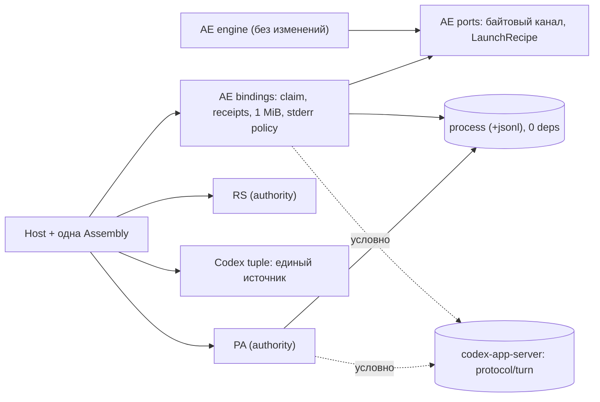

# Agent Runtime: сводка четырёх независимых критиков

1 октября 2026. **DRAFT / DECISION PENDING. Только исследование и планирование.** Код, manifests, CI, SQL, pins и ADR не менялись. Builds, tests и provider execution не запускались. Решение по реализации не принято.

## 0. Как получен результат

- Четыре независимых критика, по явной просьбе владельца вместо hosted workers. Работали параллельно, отчётов друг друга не видели. Запуск локальный, read-only.
- Роли: `libraries-consumer`, `core-lifecycle`, `sdk-foundation`, `skeptic-openclaw`. Полные отчёты лежат рядом: `*-report.md`. Общий контракт: `prompt-common.md`, receipt: `launch-receipt.md`, хэши входов: `input-sha256.txt`.
- Snapshots на exact SHA, read-only:
  - agent-runtime `b0bcb265` = current main, delta с прошлым изученным SHA нет;
  - get-modular `9c722cef` = pin, delta нет;
  - `.github` `3fe0f135`;
  - EF `b8ec0f17`;
  - OpenClaw `510beb8d` (upstream main на 2026-10-01T16:33Z; к концу прохода main ушёл на `c4f5599a`, эту дельту не изучали).
- Внешние источники критики получали только через `gh`, `curl` и `npm view`. Веб-поиска не было, так что это source critique с точечной проверкой фактов, а не широкое online research.
- Координатор сам перепроверил по коду утверждения, от которых зависит выбор (§2, отмечены ✔).

## 1. Главное в одном абзаце

Ядро ordinary Codex спроектировано в целом правильно: claim перед start, запрет повтора после неопределённого claim/send, раздельные факты закрытия, честные PA/RS. Отдельный engine, общий runtime kernel, DI/Effect и публичный SPI семи ролей сейчас не нужны: так считают все четыре критика. Плохо устроены швы вокруг ядра:

- framing сделан дважды и зашит в порт AE;
- тип LaunchRecipe берётся из concrete Node adapter;
- Codex tuple `0.153.4` размазан по 13 ordinary-файлам в четырёх пакетах, включая публичный тип;
- спящий SDK-growth гейт физически не пропустит ни одного нового пакета или subpath.

Самостоятельную библиотеку сегодня честно обосновывает не гипотетический чужой harness, а **второй реальный потребитель внутри продукта**: Provider Access auth capture дублирует владение процессом, JSONL и RPC, и его валидаторы уже разошлись с AE. Отсюда рекомендация: сначала швы на месте, затем библиотека процесса (и JSONL) с PA вторым потребителем. Codex protocol package выделять, только если владелец разрешит перевод PA на неё или решит публиковать.

## 2. Новые факты, которых не было в прошлых отчётах

| # | Факт | Кто нашёл | Проверка координатора |
|---|---|---|---|
| N1 | **Спящий SDK-growth enrollment блокирует любой новый пакет и subpath.** `pnpm check` и `check:fast` запускают `check-sdk-growth-profile.mjs`. Он требует совпадения workspace manifests с замороженным inventory (`SDK_SCOPE_DRIFT`, `:99-104`) и exports с прежними (`SDK_EXPORT_MATRIX_DRIFT`, `:157`). EF фиксирует: «The Get Modular and Agent Runtime SDK growth profiles stay unactivated… The frozen C0 contract is not edited» (`public-api-compatibility.md:66-70`). Значит, нужен явный ADR о замене гейта | sdk-foundation | ✔ проверено по скрипту, `package.json` scripts и EF |
| N2 | **В AR нет активного v1 API-гейта.** В `foundation.config.yaml` нет `package.public-api-compatibility`, каталога `architecture/public-api/` нет, хотя `profile.yaml:18` на него ссылается. Тезис «активна только v1-проверка» верен для EF и GM, но не для AR | sdk-foundation, skeptic | ✔ |
| N3 | **PA auth capture — второй потребитель механизмов процесса, JSONL и RPC.** `spawn('/usr/bin/sandbox-exec', …, detached: true)`, то же правило «Never signal a numeric group after its leader exit has been observed», numeric RPC ids (`const id = ++sequence`). Валидатор `remoteControl/status/changed` в AE проверяет только `status` и `environmentId`, в PA — точный набор ключей | libraries, skeptic | ✔ |
| N4 | **Codex tuple размазан.** `0.153.4` встречается в 22 production-файлах (13 ordinary, остальные contained), включая публичный `RuntimeContainedTurnView` (`runtime-access.ts:233`). Codex выпустил 13 версий от 0.153.4 (04.09) до 0.159.3 (30.09). Codec и validation сравнивают литерал строго: ASSUMPTION с высокой уверенностью, что bump сделает старые строки недекодируемыми | core, skeptic, sdk | ✔ число файлов; следствие для decode — ASSUMPTION критика |
| N5 | **Framing зашит в AE application port**: `OrdinaryTransport { lines: AsyncIterable<string> }` (`ordinary-ports.ts:41-45`). До параллельной работы над process и client канал нужно сделать байтовым и непрозрачным для ядра | core | не перепроверял, согласуется с другими отчётами |
| N6 | AE объявляет runtime `pg` и `zod`, но `src` их не импортирует. AE тянет Claude Agent SDK (darwin-arm64 ≈197 MB), поэтому subpath внутри AE не может быть библиотекой | libraries | ✔ `pg`/`zod`; размер по `npm view` критика |
| N7 | `./composition` у AE — wiring barrel на 172 values и 760 types; Host использует 38. FMS запрещает «Broad service-provider barrels» | sdk-foundation | не перепроверял |
| N8 | Codex adapter держит полный reserve input (с credential material) в `prepared` Map до `execute` или `dispose`. При неудачном claim `execute` не вызывается, и запись живёт до закрытия Host | core | ✔ `ordinary-codex-provider.ts:40-54,141`, `ordinary-engine.ts:84-94` |
| N9 | Guards переходов prepare/claim/cancel/append написаны inline в SQL adapter (`ordinary-postgres-store.ts:108,115,124,131`). Тезис «adapter применяет pure domain policy» верен только для terminal | core | не перепроверял |
| N10 | ADR-0090:91 «Runtime Configuration owns immutable launch configuration», а код держит recipe и config writer в AE | core, libraries, skeptic | не перепроверял |
| N11 | FMS: «Protocol clients used only by one adapter SHOULD remain inside that adapter»; REUSE = «At least two real independent consumers»; «MUST NOT be extracted merely for … one adapter, or a hypothetical future consumer» | skeptic | ✔ `v1.md:147-149, 452-469` |

## 3. Согласие и разногласия

**Все четыре согласны:**

- Без runtime kernel, base class, Effect и DI-контейнера. Get Modular достаточно, а единообразие API дают dev tooling и curated entrypoints.
- Engine остаётся в AE. Условия FMS для extraction не выполнены; триггеры названы: Claude ordinary переиспользует engine или появляется названный внешний consumer, плюс guards в domain и записанная семантика restart.
- Публичного SPI семи ролей нет. Store SPI возможен только после закрытия G1 и при названном авторе.
- Framing переносится из process на сторону протокола через байтовый канал. При переносе сохранить общий бюджет 1 MiB stdout+stderr, fatal UTF-8 и обнуление stderr, отказ от незавершённого хвоста, «непрочитанное при close = невалидный drain», синхронный pre-spawn hook и отсутствие повтора `turn/start`.
- LaunchRecipe становится контрактом AE, Assembly не ссылается на `NodeOrdinaryProcessOptions`.
- Client заимствует канал и никогда не владеет процессом. Это строже OpenClaw.
- G2 подтверждён по коду.

**Разногласия:**

| Вопрос | Позиции | Оценка координатора |
|---|---|---|
| Сколько пакетов | libraries, core, sdk: два (`process` и `codex-app-server`). skeptic: один `stdio-process` (process + jsonl), Codex wire остаётся в AE | По FMS решает PA. Если PA переходит на общие механизмы, REUSE выполнен и для process/jsonl, и для протокольного слоя Codex (envelope, handshake, общие валидаторы). Reducer turn остаётся с одним потребителем. Без PA честный выбор по FMS — швы без пакетов |
| Объединять ли PA с AE | libraries и skeptic: да, для process group и duplicate-key; буфер PA с обнулением не трогать. core: IPC и JSONL не объединять из-за разного lifetime и zeroization | Объединять механизм процесса и строгий парсер; zeroization оставить в PA через hook или вовсе не трогать. Решает владелец, путь секретный |
| Profile | core: единый descriptor до leaves; decode принимает любую revision, claim только текущую. skeptic: единый источник tuple вместе с v1. libraries: не prerequisite, отдельная lane. sdk: убрать литералы и из публичного view | Нужен **единый источник tuple**, а не реестр profiles. Делать до или вместе с переименованием публичного API, чтобы не ломать API дважды |
| Публичный API `operations` | libraries, sdk, skeptic: рано, до любого baseline или публикации. core: после leaves одним break, но не раньше descriptor | После PR с tuple, параллельной lane, до любой публикации |
| Формат v1 | core, skeptic: вместе с descriptor или сразу после, если реальных данных нет. sdk, libraries: позже, после инвентаризации | Сначала инвентаризация БД. Если данных нет — вместе с descriptor. Нужна отдельная format identity, потому что ADR-0090:42-46 уже называет «V1» исторический contained-формат (skeptic) |
| Store guards в domain (R1c) | только core | Не prerequisite для leaves; prerequisite для store SPI или engine. Отдельная lane |
| G1 | core: подтверждён, update может уйти в чужую незаблокированную строку. skeptic, sdk: частично | ✔ `#read` не сверяет payload с ключом; `#write` строит WHERE по identity payload, но с CAS по revision. Ошибочная запись возможна только при порче строки **и** совпадении revision. P3 для внутреннего adapter, блокер перед store SPI |
| Смета B | skeptic: moves завышены (физически ≤1150–1400), governance занижена. libraries: пакет стоит 250–450 строк governance. sdk: B не учёл F0 | Все три замечания обоснованы. B недооценил главное — обязательную замену гейта и налог governance |

## 4. Три варианта (синтез координатора)

LOC = additions + deletions кода, tests, docs и gates. Moves — неизменённые логические строки, считаются отдельно. Диапазоны собраны из оценок критиков по компонентам, а не изобретены заново. Отдельные lanes из §5 сюда не входят.

### Вариант 1 (Recommended): швы на месте → пакет процесса с PA → Codex-пакет по условию

| PR | Содержание | Changed | Moves |
|---|---|---:|---:|
| 0 | Решения: ADR extraction (FMS REUSE: AE + PA), API и ownership records, owner LaunchRecipe против ADR-0090:91, бумажная проверка API процесса против Claude spawn hook, составной drain, записанные известные ограничения (owner-loss, orphan) | 150–350 | 0 |
| 1 | F0: заменить спящую заморозку лёгкой активной проверкой для новых пакетов отдельным ADR; цепочку CMS pin сохранить; историческое evidence пометить | 400–700 | 0 |
| 2 | Швы на месте: байтовый непрозрачный канал, LaunchRecipe в AE ports, framing на стороне Codex внутри AE с parity-тестами, удалить `prepared` Map, гигиена manifest AE | 300–700 | 0–60 |
| 3 | Единый источник Codex tuple: PA и RS сверяют с identity, которую выдаёт Host (+120–300, если вместе с ним v1) | 300–700 | 0–60 |
| 4 | Пакет `process` (+ `jsonl`) + AE binding + packed proof одного root с declared closure | 700–1300 | 450–800 |
| 5 | Перевод PA на общий механизм процесса и строгий парсер; zeroization остаётся в PA | 200–450 | 0 |
| 6 | Docs и guidance | 150–350 | 0–50 |
| **Итого** | | **2200–4550** | **450–950** |
| +7 (условно) | Пакет `codex-app-server` (protocol/turn), AE binding, общие валидаторы handshake/notification для AE и PA | +650–1400 | +400–700 |

🎯 7/10 · 🛡️ 8/10 · 🧠 5/10. Уверенность в LOC 4/10.

- **Даёт:** правильные швы Codex, один владелец framing, единый tuple, устанавливаемую библиотеку, честно обоснованную двумя потребителями, и меньше дублирования security-инвариантов.
- **Не даёт:** замены компонентов через Host (options закрыты по ADR-0090) и публикации. Это надо прямо принять как цель этапа.
- **Порядок:** 0 → 1 и 2 (можно параллельно) → 3 → 4 → 5 → 7 → 6. Единственный integrator владеет root manifests, lock, Host/Assembly, AE ports/model, census-профилями и ADR.

### Вариант 2: только швы на месте, без новых пакетов

Шаги 0, 2, 3, а технические модули остаются в AE как library-shaped (без импортов AE-типов). Позиция skeptic V2 и libraries III.

🎯 7/10 · 🛡️ 8/10 · 🧠 3/10. **730–2400 changed + 40–600 moves.**

Полностью соответствует FMS, F0 не нужен, легко откатить. Цель «самостоятельные библиотеки» откладывается; поздний вынос — в основном moves плюс один раунд governance.

### Вариант 3: максимальная модульность сейчас

Вариант 1 плюс безусловный Codex-пакет, `ordinary-operations`, `ordinary-store-postgres`, conformance kit, закрытый typed slot в Host, release route (EF v1, Changesets). Позиции libraries II, sdk V3, core C′.

🎯 4/10 · 🛡️ 7/10 · 🧠 8/10. **6000–11800 changed + 1500–4400 moves.** Уверенность в LOC 3/10.

Оправдан только при решении публиковать и при названном внешнем потребителе. Сегодня FMS прямо запрещает extraction ради гипотетического consumer.

**Где здесь B:** 2800–4400 + 900–1650. По сравнению с вариантом 1 в B нет F0 (без него новые пакеты не пройдут CI), нет PA (без него REUSE по FMS не выполнен), governance недооценён, а moves завышены.

## 5. Отдельные lanes (не входят в сметы выше)

| Lane | Объём | Когда |
|---|---:|---|
| Публичный API: `operations`, явное имя passive factory, убрать Codex-литералы из view, curated `./host` вместо широкого `./composition` | 700–1300 | После PR 3, параллельно, до любой публикации или baseline |
| Формат ordinary v1 (отдельная format identity) | 120–300 | Вместе с PR 3, если инвентаризация не нашла реальных записей |
| Guards переходов store в domain (R1c) | 320–450 | Перед любым store SPI или engine package |
| Удаление legacy contained | отдельная оценка | Позже, после review достижимости |
| Owner-loss/orphan (нет сходимости после падения Host) | поведение, не граница | Отдельное решение; сейчас только записать как ограничение |

## 6. OpenClaw @510beb8d: что важно

- Client владеет процессом (`client.ts:290-322`). У нас канал заимствован, и это правильнее.
- Durable registration `{pid, pgid, startedAt, commandFingerprint}` и reaper; регистрация коммитится до `initialize`. История: #132621 → #132745 и #133111. SIGKILL gateway оставлял сиротский app-server, который продолжал turn. У нас тот же класс риска: группа detached, PID не восстанавливается. API процесса должен отдавать start identity, чтобы не закрыть эту будущую опцию.
- Байтовый framer с backpressure без очереди, но без лимита длины строки, и толерантный decoder до 8 MiB. Перенять backpressure; лимиты и fail-closed оставить свои.
- Correlation: «possibly written» отмечается до `stdin.write`, retry только при `-32001` до enqueue. Совпадает с нами.
- Глобальные singletons (`Symbol.for`, `globalThis`) — класс проблем #146265. Избегать.
- Codex-клиент OpenClaw не самостоятелен (импортирует plugin SDK). Вынесены в отдельные библиотеки generic механизмы `@openclaw/fs-safe` и `proxyline`. Это аргумент скорее за пакет процесса, чем за vendor-клиент.
- Политика версий: floor 0.149.0 + warn на более новые, pin поднят до 0.158.0 (#160487). У нас exact 0.153.4.
- Официальный `@openai/codex-sdk` 0.159.3 существует. По словам skeptic, он оборачивает `codex exec --experimental-json`, а не App Server. Это альтернатива для чужих harness, но не замена нашего клиента.

## 7. Риски корректности (вне extraction scope)

1. Bump Codex может сделать сохранённые ordinary-строки недекодируемыми и меняет публичный тип (ASSUMPTION с высокой уверенностью).
2. После падения Host операция навсегда остаётся `running` или `accepted`; cancel только ставит флаг.
3. После SIGKILL Host остаётся сиротская process group (компромисс ADR-0090).
4. Credential material в `prepared` Map после неудачного claim (✔); байты source workspace до 64 MiB на каждую операцию с uncertainty (core, не перепроверял).
5. G2 подтверждён. G1 — отсутствующая сверка, срабатывает только при порче строки.
6. Нет backpressure: очередь на 256 строк может упасть на всплеске (ASSUMPTION).
7. Toolchain skew: API Extractor на TS 5.9.3 против сборки на TS 7.0.2.
8. Открытый PR #180 развивает отменённый маршрут A3. sdk судил по описанию; пересмотреть до merge.

## 8. Пересечение с параллельной программой ресурсов

Это знает только координатор, критики не знали: решение владельца сегодня, `plans/module-resource-scopes-design-2026-10-01.md`. Пакет `@get-modular/resources` (scope tree, «кто создал, тот и закрывает») планируется прямо в GM, первым реальным потребителем назначен AR ordinary host. Следствия:

- Та же зона файлов (Host, cleanup, Assembly) и обновление CMS pin. Нужен один integrator и последовательный merge.
- `close()` пакета процесса стоит проектировать так, чтобы его можно было зарегистрировать как ресурс scope: идемпотентный, с отчётом о долге.
- *Моё предположение, не проверено:* per-operation child scope естественно закрывает N8 (Map в singleton-адаптерах) и G2.

## 9. Вопросы владельцу (первый вариант рекомендуемый)

1. **Заменить спящую заморозку SDK-growth?** Без этого не пройдёт ни новый пакет, ни subpath.
   - (a) Заменить лёгкой активной проверкой отдельным ADR (🎯8 🛡️8).
   - (b) Оставить и ограничиться вариантом 2 (🎯7 🛡️8).
   - (c) Вернуть S3/v3 authority (🎯3 🛡️7; противоречит решению 25.09).
2. **Разрешить перевод PA auth capture на общий механизм процесса и парсер?**
   - (a) Да, отдельным PR после пакета (🎯7 🛡️8).
   - (b) Нет → вариант 2 (🎯7 🛡️8).
   - (c) После Claude sync (🎯6 🛡️8).
3. **Публикация или внешний harness в ближайшие 1–2 месяца?**
   - (a) Нет: пакеты остаются private workspace с packed proof одного root (🎯7 🛡️8).
   - (b) Да: Codex-пакет безусловно, плюс EF v1 и Changesets (🎯5 🛡️7).
   - (c) Не уверен → вариант 2 (🎯7 🛡️8).
4. **Есть ли реальные ordinary-записи в какой-либо БД?**
   - (a) Нет → v1 вместе с tuple PR (🎯8 🛡️8).
   - (b) Только тестовые → то же (🎯7 🛡️8).
   - (c) Есть → оставить v3, cutover позже (🎯7 🛡️9).
5. **Когда переименовывать в `operations`?**
   - (a) После tuple PR, параллельно, до публикации (🎯7 🛡️8).
   - (b) В конце одним break (🎯6 🛡️8).
   - (c) После удаления legacy (🎯4 🛡️7).

## 10. Что изменит рекомендацию

- Владелец запрещает трогать PA → вариант 2.
- Решение публиковать + названный внешний потребитель app-server-клиента → вариант 1 с безусловным PR 7, или вариант 3.
- Найдены реальные ordinary-записи → v1 позже, с учётом этих записей.
- Нужна замена одной роли в Host (например, store) → узкий SPI этой роли после R1c и G1.
- Бумажная проверка покажет, что Claude spawn hook несовместим с общим API процесса → процесс остаётся в AE до Claude sync.
