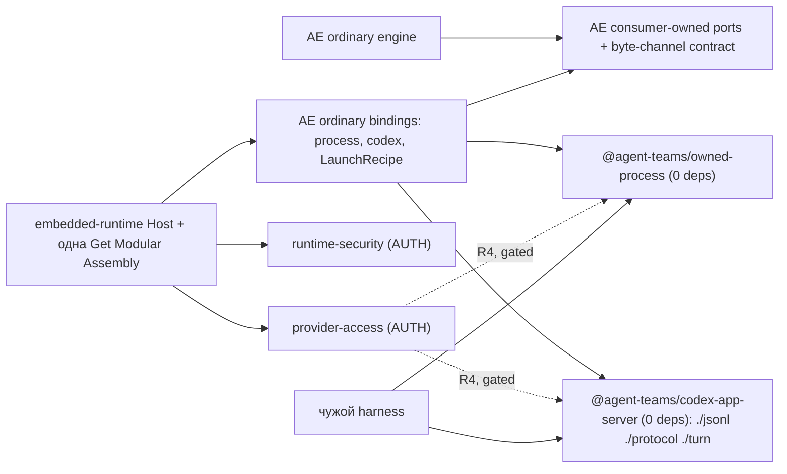
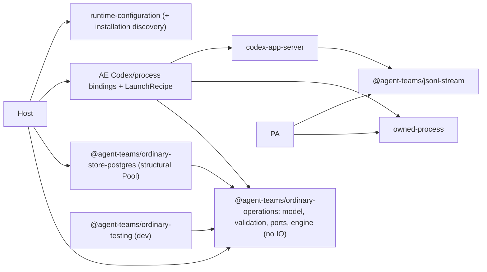

# Критик 1: библиотеки и внешний consumer (`libraries-consumer`)

- Исполнитель: независимый критик (выбор владельца для этого прохода). Роль: критик 1 из 4, ракурс handoff §6.1.
- Дата: 2026-10-01. Только анализ: исходники, manifests, CI, SQL, pins, ADR не менялись; build/test/install/provider не запускались; git-состояние snapshots не трогал.
- Изученные snapshots (read-only, exact SHA проверены `git rev-parse HEAD`):
  - `agent-runtime` `b0bcb265d1466da3272078f9dfdb7c6784624283` (через `gh` подтверждено: current main, коммит 2026-09-30T20:30:40Z);
  - `get-modular` `9c722ceff4ede307d06d7a4b63fdebe615f54c53`;
  - `.github` (dotgithub) `3fe0f135ffc446b3bb174397c6b5783f72a008a2`;
  - `engineering-foundation` `b8ec0f17d1b8d6f9b7a45798931715d59a126888`;
  - `openclaw` `510beb8d52bd6be9fea27513b9008a50c92a1d2d` (через `gh` upstream main уже `c4f5599a…` от 2026-10-01T16:45Z; delta я **не** изучал, все выводы об OpenClaw относятся к 510beb8d).
- Реально полученные внешние источники (кроме локальных snapshots):
  1. `gh api repos/agent-teams-ai/agent-runtime/commits/main` → `b0bcb265…` (2026-10-01).
  2. `gh api repos/openclaw/openclaw/commits/main` → `c4f5599a74a857013af36a8538bb6b8668779c8b` (2026-10-01).
  3. npm registry через `npm view` (2026-10-01): `@anthropic-ai/claude-agent-sdk@0.3.251` (`dist.unpackedSize` 4 858 659, 8 optional platform packages); `@anthropic-ai/claude-agent-sdk-darwin-arm64@0.3.251` (`dist.unpackedSize` 197 172 264); `pg@8.23.0` (100 044, 6 dependencies); `@openclaw/fs-safe@0.22.0` (repository `github.com/openclaw/fs-safe`, 7 native optional platform packages); `@openclaw/proxyline` latest `0.4.0` (repository `github.com/openclaw/proxyline`); `@openclaw/codex@2026.9.7` (published `peerDependencies: {"openclaw": ">=2026.9.7"}`).
  - Веб-поиска не было; официальную документацию не скачивал. Это source critique + registry metadata, а не независимое online research.

Обозначения: **VERIFIED** — прочитал в source/manifest/registry; **ASSUMPTION** — мой вывод. Severity P0–P3, уверенность 1–10.

---

## 0. Короткий ответ

Исходная задача владельца — правильная архитектура Codex и компоненты, которые чужой harness может реально взять. По current source **сейчас доказуемо самостоятельны две технические библиотеки**: владелец физического процесса и строгий Codex App Server protocol client (с subpaths `jsonl`/`protocol`/`turn` внутри одного пакета). «Две» здесь не потолок по принципу, а то, что сегодня подтверждает evidence; модель/engine/PostgreSQL/inspection/testing kit остаются реальными кандидатами с конкретными триггерами.

Главное новое по сравнению с B и прошлыми критиками:

1. **Второй реальный consumer уже есть внутри продукта.** Provider Access auth capture сам порождает Codex App Server (через `/usr/bin/sandbox-exec`), сам владеет process group, сам режет JSONL, сам отвергает дублирующиеся JSON keys и сам ведёт RPC correlation. Это вторая, независимая реализация тех же механизмов в другом bounded context с другим lifecycle. Валидаторы одного и того же vendor notification **уже разошлись по строгости**. Это даёт FMS-основание `REUSE` и делает extraction не «ради гипотетического harness», а устранением дублирования security-relevant инвариантов.
2. **Subpath в Agent Execution не может быть библиотекой.** AE manifest тянет `@anthropic-ai/claude-agent-sdk` (darwin-arm64 platform package ≈197 MB по registry), плюс объявляет runtime `pg` и `zod`, которые `src` не импортирует. Любой «library subpath» внутри AE наследует этот closure. Поэтому leaves — только отдельные пакеты.
3. **Codex client сегодня — не общий клиент, а строгий клиент одной pinned ревизии** (exact-key validators, `cliVersion !== "0.153.4"`, один in-flight request, любые server requests → отказ, profile policy вперемешку с протоколом). Честное обещание пакета: «strict client для Codex App Server 0.153.4 по заимствованному byte channel». Поддержка новых ревизий Codex — отдельная (исключённая сейчас) возможность.
4. **Profile descriptor не является prerequisite для leaves.** Literal tuple в core ports не попадает в библиотеки, если bindings написаны правильно. Его стоит делать отдельным core checkpoint (параллельная lane), а не внутри extraction. Зато LaunchRecipe contract и перенос framing **на месте** (до выноса) — prerequisite.
5. **Цена каждой границы в этом репозитории выше, чем закладывал B.** Governance footprint одного пакета (Foundation source-dependencies, CMS consumer profile, FMS profile, SDK growth profile, ADR, scaffolding, single-root packed proof) — порядка 250–450 changed LOC на пакет. Поэтому дополнительные пакеты без consumer — заметное раздувание.

Рекомендация: **Вариант I (Recommended)** — две leaves + доказанный второй consumer (PA, отдельным gated PR) + AE-owned LaunchRecipe/byte-channel contracts + AE manifest hygiene + single-root packed proof. 🎯 7/10 · 🛡️ 8/10 · 🧠 5/10; **2600–4600 changed LOC** (+450–800 за опциональный PA PR) и **700–980 moved logical lines** отдельно; LOC confidence 5/10.

---

## 1. (a) Цели владельца, которые я проверял

По handoff §1 (`agent-runtime-architecture-critic-handoff.md:11-22`): очень модульная архитектура с заменой содержательных компонентов без deep imports; переиспользуемые самостоятельные библиотеки для чужих harness, с ценой каждой границы; Codex сначала; ordinary — единственный активный путь; понятный public API (`operations`); SOLID/Clean/DDD/DRY/FMS/CMS по существу; без новых фич; без ненужного legacy; сохранить полезный код; учиться у OpenClaw по фактам. Дополнительно из общего контракта: владелец 2026-09-25 отменил trusted SDK growth authority как оверинжиниринг; активна только v1-проверка поломок API (VERIFIED: `engineering-foundation/docs/architecture/public-api-compatibility.md:51-66` — «The owner decided not to build the host»). Отсюда напряжение: модульность vs «гейты только при пользе больше затрат». Я учитываю обе цели и считаю governance-стоимость каждой границы явно.

## 2. (b) Прошлые гипотезы, которые я не принимаю на веру

- **B** (последняя рекомендация): две leaves + core profile/LaunchRecipe + интеграция; 2800–4400 + 900–1650 moves; R2/R3 параллельно (`hosted-sdk-architecture-20261001/sdk-architecture-synthesis.md:82-105`).
- **Packages critic** (30.09): шесть production library surfaces (node-process, codex-app-server, AE operation SPI, filesystem custody, node-runtime-inspection, runtime configuration) + отдельный conformance package (`hosted-critique-20260930/packages-report.md:15-28`).
- **Codex boundaries critic** и **necessity/UX critic**: две leaves, AE engine остаётся; PA auth helper «не подключать механически» (`codex-boundaries-report.md:78`).
- Все прошлые оценки LOC — confidence 4–5/10; не обязательство.

## 3. (c) Текущие факты (VERIFIED, `b0bcb265`)

Пути ниже относительно `packages/contexts/agent-execution/src/features/contained-agent-turn/` (далее `CT/`), если не указано иное.

| # | Факт | Где и цитата |
|---|---|---|
| F1 | Все шесть workspace packages `private`, `0.0.0`; SDK growth профиль помечает их `initial-unreleased`; SDK admission `blocked-current-typed-observation`, `releaseEligible: false` | `packages/contexts/agent-execution/package.json:4` `"private": true`; `architecture/sdk-growth/profile.yaml:87-102` `kind: initial-unreleased`; `architecture/sdk-growth/activation.json:62-63` |
| F2 | AE runtime deps включают Claude SDK, `pg`, `zod`; `grep` по `src/` не находит импорта `pg` и `zod`, Claude SDK импортируют только Claude adapter files; `pg` используется только в `tests/` | `packages/contexts/agent-execution/package.json:21-25`; Claude: `CT/adapters/outbound/claude-agent-sdk/claude-agent-sdk-contained-turn-provider.ts`, `…-official-contract-qualification.ts` |
| F3 | Claude SDK platform package для darwin-arm64 ≈197 MB unpacked | npm registry `@anthropic-ai/claude-agent-sdk-darwin-arm64@0.3.251` `dist.unpackedSize: 197172264` |
| F4 | Ordinary process adapter сам делает fatal UTF-8 decode, split по `\n`, очередь строк, line/queue/total limits, stderr UTF-8 validation с обнулением, общий 1 MiB бюджет stdout+stderr; Codex protocol затем снова превращает строки в bytes для второго reader | `CT/adapters/outbound/ordinary-process/node-ordinary-process.ts:93-119` (`partial += decoder.decode(bytes, {stream: true})`, `Buffer.byteLength(line) > 262_144 \|\| queue.length >= 256`), `:163` stderr `bytes.fill(0)`; `CT/adapters/outbound/ordinary-codex/ordinary-codex-protocol.ts:17-19` `yield Buffer.from(\`${line}\n\`, "utf8")` |
| F5 | Process adapter связан с AE типами и policy: `reserve` получает credential material, `start` проверяет `dispatch_claim`, платформа зашита как darwin + non-root | `CT/application/ordinary-ports.ts:52-54`; `node-ordinary-process.ts:145-149`; `:58` `process.platform !== "darwin" \|\| … process.getuid() === 0` |
| F6 | Assembly capability типизирована concrete adapter option | `packages/apps/embedded-runtime/src/features/ordinary-session-runtime/composition/ordinary-runtime-assembly.ts:18` `"ordinary/prepare-launch": Contract<NodeOrdinaryProcessOptions["prepareLaunch"]>`; `:59-60` |
| F7 | Codex «client» = последовательный request с фиксированными string id, exact-key validators одной ревизии и profile policy | `ordinary-codex-provider.ts:31` `result.thread.cliVersion !== "0.153.4"`; `ordinary-codex-protocol.ts:32-45` (один request, прочие сообщения в `pending`); `:84` точная строка warning про `gpt-5.3-codex-spark`; `:103` «No RPC request or unrecognized tool notification is treated as passive.» |
| F8 | Shared reader принимает только string id | `CT/adapters/outbound/codex-app-server/codex-app-server-jsonl.ts:94` `if (typeof message.id !== "string" …` |
| F9 | PA auth capture — вторая реализация: detached spawn, process-group TERM/KILL, `groupGone` через `kill(-pid, 0)`/`ESRCH`, «не сигналить после exit», byte-level framing с zeroization, numeric RPC ids, `initialize`/`initialized`/`config/read` | `packages/contexts/provider-access/src/features/contained-turn-access/adapters/outbound/ordinary-codex-auth-capture.ts:53-55` (`spawn('/usr/bin/sandbox-exec', …, detached: true`); `ordinary-codex-auth-ipc.ts:21-25`, `:79-99`, `:114-119` (`const id = ++sequence`), `:127-131`, `:134-139`; `ordinary-codex-auth-protocol.ts:72-74` |
| F10 | Два независимых парсера с отказом от duplicate JSON keys | AE: `codex-app-server-jsonl.ts:42-80` (`assertNoDuplicateDecodedPropertyNames`); PA: `ordinary-codex-auth-json.ts:8-24` (`parseAuthFrame`, дополнительно глубина `> 32`) |
| F11 | Валидаторы одного vendor notification `remoteControl/status/changed` разной строгости | AE: `ordinary-codex-protocol.ts:80` проверяет только `params.status === "disabled" && params.environmentId === null`; PA: `ordinary-codex-auth-ipc.ts:28-40` требует exact keys `environmentId,installationId,serverName,status` и типы/длины |
| F12 | Ordinary домен/приложение: 554 собственных строк, runtime closure 1369 строк (11 файлов), type closure 3718 (22 файла) из-за `import type` contained-turn моделей | расчёт по import graph: `CT/domain/ordinary-model.ts:1-2` импортирует `ContainedTurnAuthorityScope`, `ContainedTurnKernelOutputKind` |
| F13 | Type closure process adapter = 3511 строк (21 файл) только из-за `import type {OrdinaryBinding, OrdinaryReceiptOf}`; runtime closure — `node:child_process`, `node:crypto` | `node-ordinary-process.ts:3-4` |
| F14 | Store adapter не импортирует `pg` (structural Pool), но в той же транзакции применяет AE pure policy; PA и RS имеют свои PostgreSQL stores | `CT/adapters/outbound/postgres/ordinary-postgres-store.ts:2-7`, `:135-148`; PA `…/postgres/ordinary-pa-store.ts` (125); RS `…/postgres/ordinary-security-owner.ts` (94) |
| F15 | ADR-0090 отдаёт launch configuration Runtime Configuration, а код держит Codex config writer/verifier в AE | `docs/decisions/0090-ordinary-user-session-codex-execution-profile.md:90-91` «Runtime Configuration owns immutable launch configuration»; код: `CT/adapters/outbound/ordinary-codex/ordinary-codex-config.ts:27-88`; в `packages/contexts/runtime-configuration/src` слова `ordinary` нет |
| F16 | Packed proofs не доказывают независимую установку одного root | `scripts/architecture/qualify-sdk-packages.mjs:136-138` (`?? realpathSync(join(repository, pkg.packageRoot, "node_modules", name))`); `packages/apps/embedded-runtime/tests/package/assembly-packed-consumer.test.ts:96` (`--config.node-linker=hoisted`, все archives) |
| F17 | Passive installation discovery (851 строк) живёт в AE, closure = `@agent-teams/filesystem-custody/composition` + `node:crypto`/`node:fs/promises`, без Claude SDK/pg | `packages/contexts/agent-execution/src/features/runtime-installation-discovery/**`; `adapters/outbound/node-executable-file-observer.ts:5` |
| F18 | Governance footprint одного пакета велик: `architecture/foundation/source-dependencies.yaml` 3013 строк (boundary-блок пакета ≈20 строк + packageRoots/governedRoots), `architecture/get-modular/consumer-profile.json` 6302 строки (48 boundary-ссылок на filesystem-custody), FMS `candidate-profile.json` 828, ADR активации FS custody 93 строки | `source-dependencies.yaml:776-793`; ADR-0019 |
| F19 | Public entry уже ordinary, submit возвращает acceptance | `packages/apps/embedded-runtime/src/features/contained-turn-runtime-access/contracts/runtime-access.ts:253-265` (`{ readonly operationId: string; readonly status: "accepted" }`); ADR-0090:74-81 |

Размеры, использованные для LOC (VERIFIED `wc -l`): `node-ordinary-process.ts` 208; `ordinary-codex-provider.ts` 155, `-protocol.ts` 222, `-items.ts` 170, `-config.ts` 125; `codex-app-server-jsonl.ts` 240; `codex-app-server-item-schema.ts` 106; `generated-codex-item-schema.ts` 3 строки / 22 129 bytes; PA `ordinary-codex-auth-capture.ts` 169, `-ipc.ts` 169, `-json.ts` 37, `-protocol.ts` 105; `ordinary-engine.ts` 271, `ordinary-ports.ts` 68, `ordinary-model.ts` 71, `ordinary-validation.ts` 144; store 152 + codec 27; workspace 79, artifacts 80, files 68; Host `ordinary-runtime-assembly.ts` 75, `ordinary-agent-runtime-host.ts` 132, `ordinary-owner-acl.ts` 30. Tests: `ordinary-node-process.test.ts` 223, `ordinary-codex.test.ts` 192, `codex-app-server-linear-framing.test.ts` 92, `ordinary-core.test.ts` 357, `ordinary-filesystem.test.ts` 177; PA ordinary tests 757; Host ordinary tests 683. Shared JSONL reader импортируют 10 contained `codex-app-server/*` source files, barrel `internal.ts`, 4 ordinary-codex files и 4 test files.

---

## 4. Инвентаризация кандидатов по реальному коду

Вердикты: **PKG** — отдельный устанавливаемый package; **SUB** — subpath существующего/нового пакета; **PORT** — внутренний consumer-owned порт; **KEEP** — оставить как есть; **AUTH** — security/authority boundary (не библиотека).

| Кандидат | Где сейчас (LOC) | Реальные imports / manifest closure | Самостоятельный сценарий вне нашего Host | Owner ресурса | Что сломается при выносе | Вердикт |
|---|---|---|---|---|---|---|
| Physical process (child, pipes, signals, bounded bytes, closure) | `node-ordinary-process.ts` 208; второй экземпляр в PA `ordinary-codex-auth-capture.ts`/`-ipc.ts` (spawn + `finishSession` ≈100) | runtime: `node:child_process`, `node:crypto`; type: AE `OrdinaryBinding`/`OrdinaryReceiptOf` → 3511 строк contained-turn типов (F13) | Да: любой harness, запускающий CLI-агента (Codex, Claude CLI, opencode) без shell, с process group, deadline, TERM→KILL и фактами закрытия. Внутри продукта — AE и PA (F9) | Handle процесса владеет child/pipes/group; единственный путь физической очистки — его `close()` | Platform policy (darwin, non-root), claim gate, credential env scrubbing и journal mapping уходят в AE binding; общий 1 MiB stdout+stderr бюджет и stderr «validate-UTF-8-and-discard» должны стать опциями | **PKG** |
| JSONL/UTF-8 framing | `codex-app-server-jsonl.ts` 240 (reader + duplicate-key check + envelope); строковая разбивка в process (F4); PA frame reader (F9) | только JS/Node builtins | Частично: строгий JSONL нужен и для Claude CLI `stream-json`, но такого consumer в репозитории нет | Reader владеет только буфером фрагментов | Пустые строки (process их пропускает в очередь, reader пропускает), CR-strip, отказ от незавершённого хвоста — зафиксировать одну политику | **SUB** `codex-app-server/jsonl`; отдельный PKG только при non-Codex consumer |
| Codex App Server RPC client (correlation, vendor events, terminal semantics) | `ordinary-codex-protocol.ts` 222, structural часть `ordinary-codex-items.ts` (~90 из 170), `codex-app-server-item-schema.ts` 106 + generated 22 KB; PA RPC (`ordinary-codex-auth-ipc.ts` 169) | builtins; `ordinary-codex-protocol.ts:3` тянет config-модуль с `node:fs` (F7) | Да, но узко: «один non-interactive turn против pinned Codex 0.153.4». Внутри продукта — AE execution и PA auth (разный lifecycle) | Client владеет только reader loop и pending correlation над заимствованным каналом; не закрывает stdin, не убивает | Profile policy (model, provider, permission, warning string, cliVersion) и ordinary effect admission (paths, questions/memory) уходят в binding через hooks; string+numeric ids; send disposition | **PKG** с subpaths `jsonl`, `protocol`, `turn` |
| Codex profile/descriptor + LaunchRecipe | `ORDINARY_PROFILE` (`ordinary-model.ts:7`), `ordinary-ports.ts:56`, `ordinary-codex-config.ts` 125, Host ACL `ordinary-owner-acl.ts:25` (`AR_ORDINARY_BROKER_CAPABILITY`) | `node:fs`, `node:crypto` | Нет: конкретный broker-profile продукта (локальный `ordinary_broker`, Spark, pinned binary SHA) | Host выбирает trusted descriptor; recipe и provider — одна пара | Нельзя разрывать пару recipe/provider; persisted tuple/codec 3 bytes неизменны | **PORT** (AE-owned `LaunchRecipe`) + отдельный core checkpoint для descriptor |
| Ordinary operation model / state / policy | 554 своих строк; runtime closure 1369, type closure 3718 (F12) | без IO; но типы contained-turn | Только для того, кто принимает именно нашу durable semantics; такого consumer нет | AE domain | Нужно сначала отвязать от contained-turn типов и literal profile; иначе declarations тянут 3.5K строк | **PORT** сейчас; кандидат PKG по триггеру |
| Ordinary engine (claim/start/cancel/recovery) | `ordinary-engine.ts` 271 | только AE ports | Тот же, что выше | AE application | Hardcoded бюджеты (45 s, 60 s, 10 s) — продуктовая policy ADR-0090 | **KEEP** в AE |
| PostgreSQL operation store | `ordinary-postgres-store.ts` 152 + codec 27 | structural Pool, `node:crypto`; без `pg` (F14) | Только вместе с нашей моделью; PA/RS всё равно требуют PostgreSQL | Store освобождает acquired client, borrowed Pool не закрывает | Gap 1 (§11) надо закрыть до внешнего SPI; atomic named methods + CAS нельзя заменить внешним read–compute–write | **KEEP**; кандидат PKG только вместе с моделью |
| Workspace preparation | `node-ordinary-workspace.ts` 79 + `ordinary-files.ts` 68 | `node:fs`, `node:crypto` | Нет: `TASK.md`, обязательный `result.txt`, копирование source — продуктовый контракт | Adapter (in-memory `owned`) | Gap 2 (§11) | **KEEP** (PORT уже есть) |
| Artifacts | `node-ordinary-artifacts.ts` 80 | `node:fs`, `node:crypto` | Нет: manifest привязан к ordinary receipts | Adapter (staging → rename) | — | **KEEP** |
| Credentials / PA (capture, broker, materialization) | PA: файлы, упоминающие `ordinary`, ≈2020 строк (включая barrels), broker `ordinary-pa-broker.ts` 186 | `node:http`, PostgreSQL | Loopback credential broker теоретически полезен чужим harness, но это authority | PA | Нельзя открывать authority ради симметрии | **AUTH** (PA становится consumer leaves, см. R4) |
| RS (admission, secret inventory, settlement) | RS: файлы, упоминающие `ordinary`, ≈866 строк | PostgreSQL | Нет | RS | — | **AUTH** |
| Passive installation discovery | AE `runtime-installation-discovery` 851 (F17) | filesystem-custody + builtins | Да: installer/doctor/UI без execution; сейчас обязан ставить AE с Claude SDK | Нет долгоживущих ресурсов | Composition imports в Host; FMS feature activation | **SUB** существующего `@agent-teams/runtime-configuration` (вариант II/отдельная lane), не новый PKG |
| Filesystem custody | `packages/platform/filesystem-custody` 957 + native helper | builtins + native | Да (аналог `@openclaw/fs-safe`) | — | — | **KEEP** (уже PKG) |
| Consumer SDK facade | `embedded-runtime` `./composition` (`createAgentRuntimeHost`), `.` type-only | весь Host graph | Это вход продукта, а не библиотека для чужого harness | Host | Переименование `containedTurn` → `operations` — отдельный API checkpoint | **KEEP** (продуктовый SDK) |

### Цена каждой границы (VERIFIED по governance footprint F18; оценка — ASSUMPTION)

Новый пакет в этом репозитории требует: `package.json`/`tsconfig`/`README`/barrel (≈120–180 строк), блок boundary + packageRoots/governedRoots в Foundation source-dependencies и ссылки allow в consumers, CMS classification (fixed library dependency, не graph node), FMS profile, SDK growth profile entry и baseline, ADR-решение об extraction (одно на программу), single-root packed proof. Итого **≈250–450 changed LOC на пакет** сверх собственного кода и тестов, плюс постоянная цена: SemVer, declarations, API review через активный v1 gate, release obligations. Subpath существующего пакета дешевле (≈60–150 строк), но **не уменьшает manifest closure** — это именно проблема AE (F2/F3).

Польза отдельного пакета реальна только когда (а) consumer не должен получать чужой closure, (б) есть независимая причина изменения (vendor protocol vs OS process), (в) есть второй consumer или внешний API lifecycle. Для двух leaves выполнены (а), (б), (в); для model/engine/store/inspection/testing — сегодня максимум одно из трёх.

### Четыре понятия, разнесённые по кандидатам

| Понятие | Что попадает | Что не попадает |
|---|---|---|
| Внутренний consumer-owned порт | Семь ordinary ports, новый AE `LaunchRecipe`, AE byte-channel contract | — |
| Поддерживаемый внешний SPI | **Ничего в варианте I.** FMS v1.md:420-423: consumer-owned ports остаются private, пока отдельный packaged adapter не обязан их реализовать | Store/process/provider SPI — только вариант II |
| Самостоятельно устанавливаемая библиотека | process, codex-app-server (provider-owned API, а не AE SPI); существующая filesystem-custody | AE subpaths |
| Security/authority boundary | PA, RS, Host trusted selection descriptor | Leaves (не выдают grants, не видят credentials как authority) |

---

## 5. Предлагаемые пакеты: обещания и не-обещания

Имена — предложения для R0, не решение. Оба пакета: ESM, declarations, **ноль runtime dependencies** (только Node builtins), без imports AE/Host/PA/RS/Assembly/Claude/`pg`. Начальный статус — workspace `private` с single-root packed proof; npm-публикация — отдельное решение владельца (AGENTS.md npm workflow).

### 5.1 `@agent-teams/owned-process`

- **Почему самостоятельный:** механизм владения процессом нужен двум bounded contexts с разным lifecycle (AE turn ≈45 s с drain; PA one-shot helper ≤15 s под `sandbox-exec`, F9) и любому harness CLI-агента; причина изменения — OS/Node process semantics, не Codex и не наша operation policy.
- **Owner:** platform (как `filesystem-custody`, `agentTeamsArchitecture.role: platform`). Resource owner — возвращаемый handle; Host/binding владеют handle.
- **Обещает:** spawn без shell, явное окружение без наследования, detached process group; reserve → start (start ровно один раз); одноразовый reader stdout как `AsyncIterable<Uint8Array>`; ограничения stdout/stderr/total/write; stderr policy (`discard` | `validate-utf8-and-discard` | bounded capture); deadline/abort → SIGTERM группе только пока leader exit не наблюдался; идемпотентный `close()` с эскалацией closeInput → TERM → KILL и **раздельными фактами** (`exitObserved`, `stdoutClosed`, `stderrClosed`, `groupEmptyObserved`, `unreadBytes`, overflow/invalid); синхронный observation hook с write-ahead `launch_requested` до spawn и fail-closed при ошибке hook.
- **Не обещает:** hostile containment, обнаружение потомков, сбежавших из группы, восстановление по PID после restart, Windows, PTY, retry/pool/resume (SR-AP-1…11), UTF-8/JSONL framing stdout, квалификацию Linux (сейчас квалифицирован только darwin, F5; Linux — новая ОС, вне scope).
- **Эскиз API (не реализация):**

```ts
export function reserveOwnedProcess(o: {
  launch: { executable: string; args: readonly string[]; cwd: string; env: Readonly<Record<string, string>> };
  limits: { maxStdoutBytes: number; maxStderrBytes: number; maxTotalBytes?: number; maxWriteBytes: number;
            stderr: "discard" | "validate-utf8-and-discard" | { captureBytes: number } };
  onObservation?: (o: OwnedProcessObservation) => void; // must return undefined synchronously
}): OwnedProcessReservation;
interface OwnedProcessReservation {
  readonly reservationId: string;
  start(o: { signal: AbortSignal; deadline: number /* performance.now() */ }): OwnedProcess; // once
  close(policy?: ClosePolicy): Promise<OwnedProcessClosure | { kind: "not_started" }>;
}
interface OwnedProcess {
  readonly pid: number; readonly processGroupId: number; readonly ownershipToken: string;
  readonly channel: ByteDuplex; // { readable: AsyncIterable<Uint8Array>; write(b): Promise<void>; closeInput(): Promise<void> }
}
```

### 5.2 `@agent-teams/codex-app-server`

- **Почему самостоятельный:** vendor protocol обновляется по своему графику (OpenClaw @510beb8d уже на `@openai/codex` 0.158.0, `extensions/codex/package.json:11`; у нас pinned 0.153.4); два consumer в продукте (AE execution, PA auth) уже дублируют framing/envelope/startup validation, и валидаторы разошлись (F10, F11).
- **Owner:** Codex vendor-protocol owner (сегодня команда AE). Resource owner: client владеет reader loop и correlation на **заимствованном** канале.
- **Subpaths:** `./jsonl` (строгий bounded reader/encoder: fatal UTF-8, duplicate decoded keys, line/total/message limits, отказ от незавершённого хвоста, опциональный hook обнуления consumed frame для PA), `./protocol` (envelopes с id `string | number`, notification decoders, generated item schema для одной ревизии, единый строгий decoder `remoteControl/status/changed`), `./turn` (reducer thread/turn: ранние notifications, структурный item lifecycle, terminal semantics), `.` (client).
- **Обещает:** одна pinned protocol revision (`0.153.4`), fail-closed decoding; один in-flight request с сохранением порядка промежуточных notifications (как сейчас, `ordinary-codex-protocol.ts:32-45`); явная send disposition (`not_written` | `possibly_written` | `answered`) — timeout/abort после возможной записи не разрешает повтор; `detach()` прекращает admission и никогда не закрывает канал и не трогает процесс; hooks для policy binding (`admitItem`, `admitStartup`, допустимые model/permission в validate-функциях снаружи).
- **Не обещает:** process lifecycle и cleanup, `closeInput` (это решает binding, как сейчас `ordinary-codex-provider.ts:121`), credentials/config.toml/binary pin, approvals и любые server→client requests (отказ, как `ordinary-codex-protocol.ts:103`), streaming для UI (текущий provider отдаёт assistant после drain, `ordinary-codex-provider.ts:131`), WebSocket/remote transport, session resume, совместимость с другими ревизиями Codex.
- **Эскиз API:**

```ts
export const CODEX_APP_SERVER_PROTOCOL_REVISION = "0.153.4";
export function createCodexAppServerClient(channel: ByteDuplex, o: {
  limits: { maxLineBytes: number; maxMessages: number; maxTotalBytes: number };
  deadline: number; signal: AbortSignal; ids?: "string" | "number";
}): {
  request(method: string, params: JsonRecord): Promise<unknown>; // throws CodexRequestError { disposition }
  notify(method: string, params?: JsonRecord): Promise<void>;
  next(): Promise<JsonRecord | undefined>;   // buffered + live notifications, in order
  detach(): void;
};
// ./turn
export function createCodexTurnReducer(o: { threadId: string; turnId: string;
  admitItem?: (item: CodexThreadItem) => void; admitStartup?: (n: CodexNotification) => void }): {
  admit(message: JsonRecord): void; readonly terminal?: CodexTurn; readonly assistantText: string; readonly rule: string };
```

Между пакетами нет package dependency: `ByteDuplex` — структурный тип в обоих; TypeScript structural typing соединяет их в binding без общего «channel» пакета (согласен с прошлыми критиками).

### 5.3 Что остаётся в AE после выноса

AE process binding: проверка `dispatch_claim` до `start`, darwin/non-root policy ADR-0090, перевод closure facts в `output_drain`/`process_group_closed` receipts, journal mapping, очистка credential env. AE Codex binding: handshake ordinary profile (`validateInitialize`, `validateThread`, `validateOrdinaryCodexConfig`), единственный `turn/start`, ordinary item policy, `closeInput` после terminal, drain, вывод receipts. AE-owned `LaunchRecipe` (сейчас `createOrdinaryCodexLaunchRecipe`) остаётся в паре с provider (`ordinary-codex-provider.ts:38-48`).

---

## 6. Walkthroughs чужого harness

### W1. Свой process supervisor + только наш Codex client

- **Ставит:** `@agent-teams/codex-app-server`. **Получает dependencies:** ноль транзитивных.
- **Вызывает:** собирает `ByteDuplex` из stdio своего child; `createCodexAppServerClient(channel, {limits, deadline, signal, ids: "string"})`; `request("initialize", …)`, `notify("initialized")`, `request("thread/start", …)`, `request("turn/start", …)`; `createCodexTurnReducer({threadId, turnId})`; цикл `reducer.admit(await client.next())` до `reducer.terminal`; `client.detach()`.
- **Ресурсы:** процесс, stdin close и kill — у harness; client после `detach()` не держит ничего, кроме того, что harness сам дочитает.
- **API не обещает:** что turn завершился физически (terminal ≠ exit ≠ drain); что `possibly_written` можно повторить; работу с Codex ≠ 0.153.4.

### W2. Наш process + наш Codex client (свой durable слой, свои credentials)

- **Ставит:** оба пакета; транзитивных dependencies ноль.
- **Вызывает:** `const r = reserveOwnedProcess({launch, limits, onObservation: journal.appendSync})`; сохраняет `r.reservationId` в своей БД; `const p = r.start({signal, deadline})`; `createCodexAppServerClient(p.channel, …)` → turn как в W1; после terminal сам вызывает `p.channel.closeInput()`, дочитывает `client.next()` до `undefined`; `client.detach()`; `const facts = await r.close()`; при `groupEmptyObserved !== true` удерживает запись для reconciliation.
- **Ресурсы:** process handle — единственный physical cleanup owner; harness владеет порядком «client detach → close» и своей durable truth.
- **API не обещает:** recovery после restart процесса harness (PID не восстанавливается), hostile isolation, config.toml/credential broker (это делает harness или наш PA только внутри нашего Host).

### W3. Только bounded process для другого CLI-агента (например, Claude CLI `stream-json`)

- **Ставит:** `@agent-teams/owned-process`. Для строгого JSONL сегодня пришлось бы ставить `codex-app-server` ради subpath `./jsonl` — семантически странно. **Это и есть триггер** выделить `jsonl` в отдельный пакет; до появления такого consumer — не выделять.
- **Не обещает:** что stdout — JSON; квалификацию Linux.

### W4. Наш durable ordinary engine со своим store/workspace — **не предлагается в варианте I**

Сегодня это невозможно без deep coupling: `createOrdinaryTurnFeature` доступен только через `@agent-teams/agent-execution/composition` (одна строка export с ≈911 именами, ASSUMPTION по подсчёту запятых), AE `private`, манифест тянет Claude SDK ≈197 MB (F3); ports получают целый `OrdinaryOperation`, типы которого тянут 3.7K строк contained-turn (F12); provider/process ports несут literal `"ordinary-codex-macos-arm64-0.153.4-v1"` (`ordinary-ports.ts:56`); harness обязан реализовать `OrdinaryProviderGrant.materialize/retire/settle` и `OrdinarySecurityGrant.admitOutput/admitArtifact/settle` — то есть authority semantics. В варианте II это становится `@agent-teams/ordinary-operations` + `@agent-teams/ordinary-store-postgres` + testing kit (§7); цена и prerequisites там.

### W5. Встроить весь наш runtime (существующий SDK facade)

`createAgentRuntimeHost({execution, storage: {pool}, scope})` → `bindAccess(scope).containedTurn.submit/observe/cancel` → awaited `dispose()`. Требует macOS arm64, Codex 0.153.4 с exact SHA, borrowed PostgreSQL Pool (store + PA + RS), auth source directory. Это уже реализовано (F19); переименование `containedTurn` → `operations` — отдельный API checkpoint (§11).

---

## 7. Три варианта

LOC = additions + deletions изменённого кода, тестов, документации, manifests, profiles и gates. Moves = логические строки, перенесённые без изменения, считаются отдельно и не входят в changed. Оценки основаны на размерах из §3 и governance footprint F18. Время hosted/локальных агентов не является трудоёмкостью.

### Вариант I (Recommended): две leaves + доказанный второй consumer + узкие AE contracts



Resource owners: process handle — child/pipes/group и единственный physical cleanup; codex client — reader loop/correlation на заимствованном канале; AE binding — claim gate, receipts, `closeInput` после terminal; Host — journal, PA/RS owners, borrowed Pool и порядок disposal; PA — secret buffers и auth helper session. Assembly не получает новых nodes: leaves — fixed library dependencies bindings (CMS `common-assembly.md:69-71`), меняется только тип capability `ordinary/prepare-launch` на AE-owned `LaunchRecipe`.

- Состав: R0 решение/API records; R1 contracts + перенос framing **на месте** + AE manifest hygiene + single-root packed harness; R2 process; R3 codex; R4 (gated) PA; R5 guidance/docs.
- Не входит: profile descriptor (отдельный core checkpoint, параллельная lane), model/engine/store packages, inspection move, testing kit, публикация в npm.
- 🎯 7/10 · 🛡️ 8/10 · 🧠 5/10.
- **Changed LOC 2600–4600** (без R4) / **3050–5400** (с R4); **moves 700–980**; LOC confidence 5/10.
- Состав оценки: R0 200–350; R1 480–910; R2 850–1420 (+100–180 moves); R3 940–1600 (+600–800 moves); R5 150–300; R4 450–800 (+0–50 moves).

### Вариант II: максимальная оправданная модульность



- Пакеты: owned-process, codex-app-server, jsonl-stream, ordinary-operations, ordinary-store-postgres, ordinary-testing (dev) + discovery внутрь существующего runtime-configuration. Prerequisites: neutral trusted profile descriptor (без него публичный operations package несёт literal Codex tuple), отвязка ordinary от contained-turn типов, закрытие обоих gaps §11, independent oracle для `ordinaryTerminalStatus` (сейчас fake store вызывает production policy, см. `codex-boundaries-report.md:247`), SQL/codec cutover до публикации store.
- Польза: W4 становится возможным; passive consumer не ставит Claude SDK; store заменяем без deep imports.
- Цена: шесть новых/изменённых package boundaries (≈1500–2700 строк одной governance/packaging), публичный store SPI с асимметрией revision/unknown COMMIT, обязательства SemVer по operation model, который сам ещё меняется (one-v1 cutover, `operations` rename).
- FMS-проверка: для operations/store нет второго consumer и нет второй реализации, проходящей тот же conformance (`v1.md:455-456`) — extraction сегодня противоречит `v1.md:468-469` («MUST NOT be extracted … for … a hypothetical future consumer»).
- 🎯 4/10 · 🛡️ 7/10 · 🧠 8/10. **Changed LOC 6700–11800; moves 3000–4400**; LOC confidence 3/10. (I + R4 3050–5400; jsonl-stream 250–450 / 150 moves; descriptor 620–1000 / 250–500 moves по оценке B; operations 1200–2000 / 900–1200; store 500–900 / 180–260; discovery 250–500 / 850–1100; testing kit 600–1100 / 100–200.)

### Вариант III: library-shaped модули внутри AE, без новых пакетов

- R1 из варианта I (contracts, framing на месте, hygiene) + process mechanism и Codex protocol как AE-internal модули без единого import AE-типов; PA не трогается; packaging откладывается до named consumer.
- Польза: ≈70% архитектурной пользы I (один владелец framing, LaunchRecipe, AE-free механизмы) за ≈40–50% цены; последующий вынос — почти чистые moves.
- Цена: чужой harness по-прежнему не может взять механизмы без AE closure (Claude SDK ≈197 MB, F3); дублирование AE/PA остаётся; цель владельца «самостоятельные библиотеки» откладывается.
- 🎯 6/10 · 🛡️ 8/10 · 🧠 3/10. **Changed LOC 1300–2400; moves 300–600**; LOC confidence 6/10.

### Сравнение с B

B ≈ (мой I) + profile descriptor − PA consumer − manifest hygiene − single-root harness на существующем пакете. Мой I без descriptor дороже B-без-descriptor примерно на 600–1200 строк: B заложил 400–500 строк docs/manifests/gates на всю программу (`codex-boundaries-report.md:253`), а измеренный footprint одного пакета (F18) даёт 250–450 строк на пакет плюс ADR и packed harness.

---

## 8. «Две» — потолок или раздувание?

- **Не потолок.** Я рассмотрел 14 кандидатов (§4). Отдельно выделяемы ещё: `jsonl-stream` (триггер — non-Codex consumer, W3), `ordinary-operations` + `ordinary-store-postgres` + testing kit (триггер — внешний consumer нашей durable semantics или вторая реализация store), discovery как subpath `runtime-configuration` (триггер — passive consumer без execution; дешёвый, можно делать отдельной lane в любой момент).
- **Больше сегодня — раздувание.** Для каждого дополнительного пакета нет хотя бы двух из трёх условий (§4 «Цена»), а каждый стоит 250–450 строк governance и постоянный SemVer. Engineering quality standard прямо требует «add abstractions or gates only for a demonstrated risk» (`dotgithub/docs/engineering-quality-standard.md:59-61`).
- **Одна библиотека вместо двух** (`@agent-teams/codex-runtime-kit` с `./process` и `./app-server`) — честная дешёвая альтернатива: экономит ≈300–500 строк governance, closure тот же (ноль deps). Минус: SemVer major при каждой смене vendor protocol затронет и non-Codex пользователей process. Я предпочитаю два пакета, но разница невелика (🎯 6/10 в пользу двух).

---

## 9. SOLID / Clean / DDD / DRY / CMS / FMS по существу

| Принцип | Конкретное место | Вывод |
|---|---|---|
| SRP | `node-ordinary-process.ts`: владение процессом + UTF-8/line framing (`:93-119`) + claim policy (`:145-149`) + platform policy (`:58`) + journal. `ordinary-codex-protocol.ts`: RPC + profile policy (`:84`) + import config-модуля с FS (`:3`) | Четыре причины изменения в одном файле; разрезать на library mechanism + AE binding policy |
| OCP | `ordinary-ports.ts:56` literal manifest в `OrdinaryProviderPort.supported` | Новый tuple требует правки core; не мешает leaves, но мешает любому будущему public SPI (вариант II) |
| LSP | AE и PA эскалация: AE closeInput→1500 ms→TERM→1000 ms→KILL (`node-ordinary-process.ts:178-184`), PA TERM→≤300 ms→KILL до deadline (`ordinary-codex-auth-ipc.ts:136-139`) | Одна семантика фактов, разные тайминги → параметры библиотеки; замена допустима только если факты закрытия те же |
| ISP | `OrdinaryProcessPort.reserve` получает credential material (`ordinary-ports.ts:53`), process механизму нужен только готовый env | Credential→env остаётся в LaunchRecipe; библиотека видит только env |
| DIP / Clean | Assembly → `NodeOrdinaryProcessOptions["prepareLaunch"]` (F6) | Заменить AE-owned `LaunchRecipe`; AE application продолжает не импортировать ни Node, ни библиотеки (byte-channel contract структурный) |
| DDD | AE, PA, RS — разные контексты; leaves — технический механизм, не shared domain | Соответствует FMS `v1.md:435-437` (stable technical contract primitives); не нарушает запрет shared kernel (`v1.md:429-433`) |
| DRY | F10 (два duplicate-key парсера), F11 (два разных validator одного notification), F9 (две реализации group closure) | Дублирование **security-relevant** инвариантов, которое уже разошлось; это сильнее «похожего кода» |
| CMS | `common-assembly.md:69-71`: «Fixed library dependencies and private helpers inside a cohesive feature remain static imports and typed factories» | Leaves не становятся graph nodes; восемь ordinary owners сохраняются |
| FMS extraction | `v1.md:462` `EXTRACT = READY AND (BOUNDARY OR REUSE OR PUBLIC_PROVIDER_SURFACE OR DEPENDENCY_LIFECYCLE)` | process: REUSE (AE+PA) + внешний API lifecycle; codex: REUSE + DEPENDENCY_LIFECYCLE (vendor revision). READY (`v1.md:465-466`) — curated surface, compatibility policy, tests, migration plan — обязан дать R0. Owner/ADR должны явно признать AE и PA «двумя реальными consumer» (это интерпретация, ASSUMPTION) |
| FMS surfaces | `v1.md:420-423` consumer-owned ports private | Leaves публикуют свой provider-owned API, AE ports не становятся SPI |

---

## 10. OpenClaw @ `510beb8d52bd6be9fea27513b9008a50c92a1d2d` (только факты из source/registry)

| Факт | Где | Что это значит для нас |
|---|---|---|
| Корневой пакет `openclaw` 2026.9.7 экспортирует 349 subpaths, из них 347 `./plugin-sdk/*`; у него 65 runtime dependencies (playwright-core, grammy, openai, @google/genai, …) | `package.json:2-3`, `:452` (`exports`), `:2244` (`dependencies`); подсчёт мой | Плагины импортируют узкие subpaths, но установка тянет весь closure хоста. Подтверждает handoff §4.7: subpath не уменьшает package-level dependencies |
| Из 23 пакетов в `packages/` публичны только 3: `@openclaw/ai`, `@openclaw/gateway-client`, `@openclaw/gateway-protocol`; остальные 20 — `"private": true`, `0.0.0-private` | `packages/ai/package.json:135`, `packages/gateway-client/package.json:78`, `packages/gateway-protocol/package.json:104` (`publishConfig`) | Монорепо с многими внутренними пакетами, но внешне поддерживаются единицы; protocol отделён от client (`gateway-protocol` зависит только от `typebox`, client — от protocol + `ws` + `ipaddr.js`) |
| Generic технические механизмы вынесены в **отдельные репозитории** и npm-пакеты: `@openclaw/fs-safe` (native optional platform packages) и `@openclaw/proxyline` | npm registry (см. шапку); root `package.json` deps `@openclaw/fs-safe: 0.22.0`, `@openclaw/proxyline: 0.3.12` | Самостоятельными у них стали именно технические механизмы без продуктовой policy — аналог нашего process leaf и уже существующего filesystem-custody |
| Codex интеграция — плагин `@openclaw/codex` (публикуется в npm), но его client не самостоятелен: `client.ts` импортирует `openclaw/plugin-sdk/agent-harness-runtime`, `error-runtime`, `runtime-env`; опубликованный manifest объявляет `peerDependencies: {openclaw: ">=2026.9.7"}` | `extensions/codex/package.json:10-21, 49-55`; `extensions/codex/src/app-server/client.ts:2-4`; npm `@openclaw/codex@2026.9.7` | OpenClaw **не** выделял Codex client и process supervisor как библиотеки для чужих harness. Наш вариант I делает больше, чем OpenClaw; это осознанный выбор под цель владельца, а не повторение их практики |
| Transport client'а — «Child-process-like transport shape» с `pid` и `kill` | `extensions/codex/src/app-server/transport.ts:27, 46, 50` | У них client может физически управлять процессом; наш «заимствованный канал без kill» строже. Не утверждаю, что у них ошибка — это другое распределение ответственности |
| Framing делает один byte reader client'а с backpressure на async decode | `extensions/codex/src/app-server/client-message-frames.ts:6` «One byte reader owns framing and stops at an asynchronous page decode.» | Поддерживает перенос framing из process в codex client (а не двойной framing, F4) |
| Закрытие соединения завершает correlation, но не «possibly written» операцию | `extensions/codex/src/app-server/request-attempt.ts:228` | Наш send disposition в client API (§5.2) — та же идея |
| Process helpers доступны плагинам только как subpath хоста; совместимость приходится удерживать для выпущенных плагинов | `src/plugin-sdk/process-runtime.ts:1` «Public process helpers for plugins…», `:23` «Released official plugins retain these exports until their supported hosts…»; `src/process` ≈18.4K строк non-test (подсчёт мой) | Цена широкой SDK surface — долгоживущие exports. Аргумент за узкие leaves с явным SemVer вместо растущего SDK barrel |
| Governance SDK surface: 12 скриптов (`check-plugin-sdk-exports`, `plugin-sdk-api-diff`, `check-extension-plugin-sdk-boundary`, …) ≈2771 строк | `scripts/*plugin-sdk*`, `scripts/check-sdk-package-extension-import-boundary.mts` | Широкий SDK требует серьёзного tooling; у нас EF v1 gate уже есть, повторять масштаб OpenClaw не нужно |
| Packed proof SDK: собирает workspace closure только от entry package, пакует, поднимает локальный registry для `@openclaw/*` и делает `npm install` одного tarball в пустом каталоге; typecheck с `skipLibCheck: true` | `packages/sdk/src/package.e2e.test-support.ts:213-243, 334-385, 409` | Хороший образец «один root + declared closure» для handoff §4.8. Слабое место, которое не стоит копировать: `skipLibCheck` не проверяет собственные `.d.ts` пакета |
| Workspace использует `nodeLinker: isolated` | `pnpm-workspace.yaml:26` | Isolated linker ловит undeclared dependencies; наш packed consumer использует `hoisted` (F16) |

---

## 11. Data / default / public API, gaps §4.10 и correctness risks

### 11.1 Очерёдность решений владельца (моя оценка, не решение)

1. **`containedTurn` → `operations`** — делать рано, но отдельным PR интегратора, параллельно с leaves: все пакеты `private`/`initial-unreleased` (F1), внешних consumer нет, цена переименования сейчас минимальна и растёт после любой публикации. Не зависит от leaves (меняет embedded-runtime contracts/barrels, не AE bindings). 🎯 7/10.
2. **Удаление legacy contained paths** — не блокировать им leaves. Shared JSONL reader используют 10 contained `codex-app-server/*` files, но в `contained-agent-turn` живут и Claude adapter, и runtime helpers ordinary (815 строк runtime closure, F12) — быстрым удалением это не является. Если reachability review всё же закончится до R3, R3 упростится (меньше mechanical import updates). 🎯 6/10.
3. **Один evolving v1 + SQL cutover** (`ordinary_turn_operations_v3`, codec 3) — для варианта I независим; для варианта II обязателен **до** выноса store/operations, иначе в публичный пакет попадёт v3 naming. Нужна инвентаризация реальных строк в dev/campaign БД. ASSUMPTION: production пользовательских записей нет, так как ADR-0090 держит qualification pending до авторизованной кампании (`0090-…md:136-140`), но это надо проверить по данным, а не по документу. 🎯 5/10.
4. **Default host factory** — поведенческое решение; логично после rename, чтобы default сразу отдавал новое имя. С leaves не связано. 🎯 6/10.

### 11.2 Два потенциальных gap из handoff §4.10

- **Gap 1 — SQL read/duplicate accept без сверки payload и ключа строки: подтверждён по коду (условный).** `#read` выбирает по `tenant_id, project_id, operation_id` и только декодирует `state` (`ordinary-postgres-store.ts:71-74`); duplicate accept сравнивает лишь fingerprint (`:88-91`), который покрывает scope/intent/provider, но не `commandId`/`operationId` (`contained-turn-authority.ts:190-195`); digest codec покрывает только payload (`ordinary-state-codec.ts:15`). Дополнительно: `#write` строит WHERE из идентичности **декодированного** payload (`:77`), так что строка с чужим payload направит update на другой ключ. Триггер — порча/ручная правка/ошибочная запись строки, не обычный поток. P2 до любого внешнего store SPI, P3 для текущего internal adapter; уверенность 8/10. В extraction scope не добавляю.
- **Gap 2 — failed workspace preparation без cleanup-only handle: подтверждён по коду.** Adapter бросает `OrdinaryWorkspacePreparationRetained(root, workspaceId)` (`node-ordinary-workspace.ts:47`), но engine теряет этот объект: `catch (error) {uncertainty = true; throw error;}` (`ordinary-engine.ts:68`), затем внешний `} catch {uncertainty = …}` (`:118`) отбрасывает ошибку; `workspace` остаётся `undefined`, `close()` отказывает для uncertain (`node-ordinary-workspace.ts:68`). Retained root остаётся только в journal observation и в in-memory `owned` (теряется при restart). P2, уверенность 8/10. В extraction scope не добавляю.

### 11.3 Correctness risks самой экстракции (топ)

1. **Потеря fail-closed поведения при переносе framing** (P1, 8/10): общий 1 MiB бюджет stdout+stderr, stderr UTF-8 validation + обнуление, unread-at-close → invalid (`node-ordinary-process.ts:186-188`), отказ от незавершённого хвоста (`:162`), различие пустых строк и CR между process и reader. Нужна parity-матрица до переноса — поэтому framing переносится **на месте** в R1, а не одновременно с extraction.
2. **Повтор `turn/start` после возможной записи** (P1, 8/10): сейчас write-callback error → refusal и единственный `turn/start` (`ordinary-codex-provider.ts:101`). Client должен вернуть disposition, binding — сохранить запрет повтора.
3. **Путаница владения** (P1, 7/10): client не должен вызывать `closeInput`/kill; physical close — только process handle через AE binding; повтор `close()` после `unconfirmed` не должен сигналить группу после наблюдённого exit (`node-ordinary-process.ts:102-103`, PA `:128-131`).
4. **Синхронный journal hook** (P2, 7/10): `record` обязан вернуть `undefined`, Promise → refusal (`node-ordinary-process.ts:76-78`). Если библиотека ослабит это до async «best effort», пропадёт write-ahead intent до spawn.
5. **Declarations closure** (P2, 8/10): любой `import type` AE в leaves притянет ≈3.5K строк contained-turn типов (F13) — отвергать в packed proof без `skipLibCheck`.
6. **PA migration** (P2, 6/10): унификация validator `remoteControl/status/changed` должна брать строгую версию PA; ужесточение AE безопасно только если реальные emissions 0.153.4 всегда имеют ровно `environmentId, installationId, serverName, status` (PA validator это предполагает); zeroization frames — best effort, т.к. `JSON.parse` создаёт неуправляемые строки (ASSUMPTION о пределах zeroization).
7. **Ложноположительный packed proof** (P2, 8/10): F16 — нужен install одного tarball isolated linker'ом, без checkout links и без всех archives.

---

## 12. Расхождения с B и прошлыми критиками

1. **Второй consumer уже существует (PA)** — прошлые отчёты видели PA auth IPC только как предостережение («не подключать механически», `codex-boundaries-report.md:78`; `packages-report.md:68`). Я согласен, что механически нельзя, но считаю PA главным доказательством `REUSE` и источником требований к API (numeric ids, zeroization hook, строгий validator). Расхождение validators (F11) в прошлых отчётах не отмечено.
2. **Profile descriptor вынесен из extraction-программы** в отдельный core checkpoint: он не gate для leaves; gate — LaunchRecipe contract и framing на месте.
3. **AE manifest hygiene** (`pg`/`zod` не используются `src`, F2) и масштаб Claude SDK closure (F3) — прошлые отчёты упоминали `pg`/Claude в manifest, но не то, что `pg`/`zod` вообще не импортируются, и не размер native closure.
4. **Codex client честно описан как pinned-revision strict client**, а не «Codex App Server client» вообще (F7). Это ограничивает ценность для внешних harness до появления политики обновления vendor revision.
5. **Budget**: governance footprint пакета (F18) выше закладки B; мой I без descriptor дороже соответствующей части B на ≈600–1200 строк.
6. С packages critic: не согласен выпускать AE operation SPI и testing kit сейчас (нет второй реализации/consumer, FMS `v1.md:455-456, 468-469`); согласен, что discovery не должен требовать AE — но предлагаю subpath существующего `runtime-configuration`, а не новый пакет.
7. С OpenClaw-практикой: мы выделяем больше (Codex client), чем OpenClaw; это допустимо под цель владельца, но не подтверждается их опытом как «проверенная» практика.

## 13. Сильнейший контраргумент и что изменит рекомендацию

**Контраргумент против I:** внешняя ценность leaves сейчас мала. Process квалифицирован только на darwin/non-root (F5), Codex client откажет на любой ревизии ≠ 0.153.4 (F7), публикации нет, named внешнего consumer нет. Значит 2600–4600 строк тратятся в основном на governance и packaging, а вариант III даёт большую часть архитектурной пользы за 1300–2400 строк, оставляя вынос на потом (≈1000–1500 строк почти чистых moves).

Что изменит мой выбор:
- **на III**: владелец подтверждает, что внешних harness/публикации в обозримом горизонте нет, **и** PA owner отвергает миграцию на общие механизмы (тогда `REUSE` остаётся намерением);
- **на II (частично)**: появляется consumer нашей durable semantics со своим store, вторая реализация store, или non-Codex JSONL consumer (тогда сначала `jsonl-stream`);
- **на «один пакет с двумя subpaths»**: если governance-цена второго пакета окажется заметно выше 450 строк, а process-пользователей вне Codex не будет.

---

## 14. Порядок bounded PR (предложение, не разрешение)

| PR | Содержание | Зависит от | Changed LOC | Moves | Исполнитель |
|---|---|---|---:|---:|---|
| R0 | ADR об extraction (FMS EXTRACT: REUSE AE+PA, DEPENDENCY_LIFECYCLE), API/ownership records обоих leaves (§5), CMS classification «fixed library dependency», решение по F15 (ADR-0090 vs код), список не-обещаний | — | 200–350 | 0 | Integrator |
| R1 | AE `LaunchRecipe` вместо `NodeOrdinaryProcessOptions["prepareLaunch"]`; byte-channel `OrdinaryTransport`; перенос framing из process в Codex reader **внутри AE** с parity-тестами; `pg` → devDependencies, удалить `zod`; single-root isolated packed harness, проверенный на существующем `@agent-teams/filesystem-custody` | R0 | 480–910 | 0–50 | Integrator |
| R2 | `owned-process` + AE process binding + library tests + packed consumer + governance | R1 | 850–1420 | 100–180 | Process worker |
| R3 | `codex-app-server` (`jsonl`/`protocol`/`turn`/client) + AE Codex binding + mechanical import updates 10 contained files + barrel + перенос protocol fixtures/regeneration scripts + governance | R1 | 940–1600 | 600–800 | Codex worker |
| R4 (gated) | PA auth capture на `owned-process` + `codex-app-server/jsonl` + `/protocol`; единый строгий validator; zeroization hook; parity tests | R2, R3 | 450–800 | 0–50 | PA owner под контролем integrator |
| R5 | Guidance/profiles/readiness/get-modular-adoption, финальная declarations closure обоих архивов | R2, R3 (R4) | 150–300 | 0 | Integrator |

- **Parallel lanes:** после R1 — R2 и R3 параллельно (непересекающиеся файлы: `packages/platform/owned-process/**` + `CT/adapters/outbound/ordinary-process/**` против `packages/platform/codex-app-server/**` + `CT/adapters/outbound/ordinary-codex/**` + `codex-app-server/*`). Отдельные lanes вне этой программы: `operations` rename (embedded-runtime contracts) и core profile descriptor (AE model/ports/codec — конфликтует с R1 по `ordinary-ports.ts`, поэтому только после R1).
- **Единственный integrator:** root manifests, `pnpm-lock.yaml`, Foundation/FMS/CMS/SDK profiles и gates, public barrels, Host/Assembly/ACL, AE ports/model, shared `codex-app-server-jsonl.ts` и его compatibility imports.
- **Риски плана:** R1 — самая чувствительная к поведению часть (framing parity); R3 — moves через границу пакета с 10 contained consumers; R4 — secret path. Каждый PR приносит свои rejecting checks; перед PR — `check:changed`, `check:fast`, затем `check` на exact head. Synthetic/packed proof не квалифицирует macOS/Codex/Spark execution.

## 15. Scope exclusions

Не входят: profile descriptor (отдельный checkpoint), новые ревизии Codex, Linux/Windows квалификация process, approvals/server requests, streaming/progress, session reuse/resume, WebSocket/remote transport, retry/pools (SR-AP-1…11), contained-turn Assembly, Claude rewrite, публичные store/process/provider SPI, testing kit, npm-публикация, discovery move (опциональная отдельная lane), исправления gaps §11.2, `operations`/default/v1 cutover (отдельные checkpoints §11.1).

## 16. Сводка находок

| # | Severity | Уверенность | Находка | Где |
|---|---|---:|---|---|
| N1 | P1 | 8 | Codex «client» — строгий клиент одной ревизии с примешанной profile policy; обещание пакета должно быть «pinned-revision», policy — hooks binding | `ordinary-codex-provider.ts:31`; `ordinary-codex-protocol.ts:84, 103` |
| N2 | P1 | 8 | PA auth capture — второй consumer process/JSONL/RPC; duplicate-key парсеры и validator `remoteControl/status/changed` уже разошлись | F9–F11 |
| N3 | P1 | 9 | AE subpath не может быть библиотекой: Claude SDK native closure ≈197 MB; `pg`/`zod` объявлены, но не импортируются `src` | `agent-execution/package.json:21-25`; npm registry |
| N4 | P2 | 8 | Leaves не должны импортировать AE типы: даже `import type` тянет ≈3.5K строк contained-turn в declarations | F12, F13 |
| N5 | P2 | 7 | ADR-0090 отдаёт launch configuration Runtime Configuration, код — AE Codex adapter; решить в R0 (я за поправку ADR и сохранение пары recipe/provider в AE) | `0090-…md:90-91`; `ordinary-codex-config.ts:27-88` |
| N6 | P2 | 8 | Packed proofs не доказывают single-root closure; нужен isolated install одного tarball без `skipLibCheck` | F16; OpenClaw `package.e2e.test-support.ts:409` |
| N7 | P2 | 7 | Governance-цена пакета ≈250–450 строк; B её занижает | F18 |
| N8 | P3 | 7 | Process library честно квалифицирована только на darwin/non-root; Linux — новая ОС | `node-ordinary-process.ts:58` |
| N9 | P2 | 8 | Оба gap §4.10 подтверждены по коду (gap 1 условный) | §11.2 |

Файлы и окружение не изменялись, кроме создания этого отчёта.
