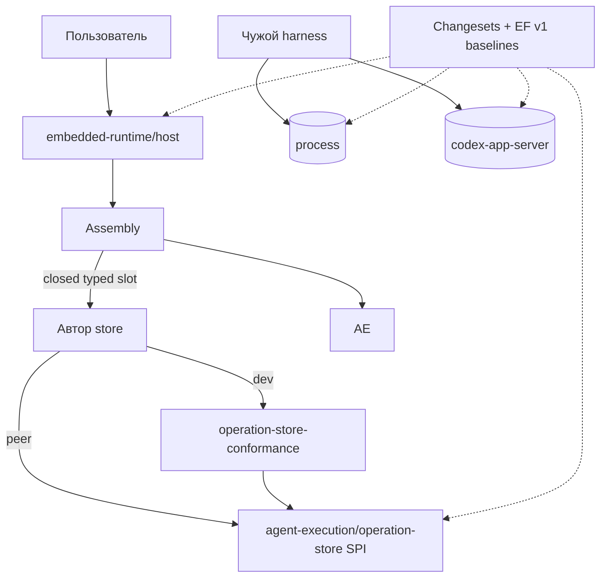

# Критик 3: SDK / foundation / OSS и сопровождение

- Исполнитель: независимый критик (выбор владельца для этого прохода).
- Роль: `sdk-foundation`. Дата: 2026-10-01. Только анализ: исходники, manifests, CI, pins и ADR не менялись; install/build/test/typecheck не запускались.
- Изученные snapshots (read-only, exact SHA):
  - `agent-runtime` `b0bcb265d1466da3272078f9dfdb7c6784624283` (через `gh api repos/agent-teams-ai/agent-runtime/commits/main` подтверждено, что это current main; открытые PR #184, #180, #72 не считаются частью main).
  - `get-modular` `9c722ceff4ede307d06d7a4b63fdebe615f54c53`.
  - `dotgithub` (org `.github`) `3fe0f135ffc446b3bb174397c6b5783f72a008a2`.
  - `engineering-foundation` `b8ec0f17d1b8d6f9b7a45798931715d59a126888`.
  - `openclaw` `510beb8d52bd6be9fea27513b9008a50c92a1d2d`.
- Отчёты соседних критиков этого прохода я не читал, чтобы сохранить независимость.

## Реально полученные внешние источники (отдельно от анализа snapshots)

Это точечная проверка фактов, а не широкий online research (веб-поиск недоступен).

| Источник | Способ | Что получено |
|---|---|---|
| npm registry | `npm view`, 2026-10-01 | `@microsoft/api-extractor` 7.59.3 (2026-09-28, MIT), зависимость `typescript: 5.9.3` и в 7.58.12, и в 7.59.3; `@changesets/cli` 3.0.3 (2026-09-14, MIT); `publint` 0.3.24 (2026-08-19, MIT); `@arethetypeswrong/cli` 0.18.5 (2026-07-09, MIT), его core зависит от `typescript: 5.6.1-rc`; `knip` 6.39.0 (2026-09-30, ISC); `dependency-cruiser` 18.5.0 (2026-09-30, MIT); `syncpack` 15.3.3 (2026-08-09, MIT); `nx` 23.2.1 (2026-09-09, MIT); `turbo` 2.11.6 (2026-10-01, MIT); `effect` 4.0.0 (2026-10-01, MIT, без dependencies, unpacked 49 529 639 bytes); `awilix` 13.0.5 (2026-06-15, MIT); `inversify` 8.2.3 (2026-07-23, MIT); `tsyringe` 4.10.0 (2025-04-16, MIT); `@opentelemetry/api` 1.9.1 (2026-03-25, Apache-2.0); `@opentelemetry/sdk-node` 0.222.0; `@opentelemetry/instrumentation-http` 0.222.0 с `peerDependencies: {"@opentelemetry/api": "^1.3.0"}`; `@get-modular/core`/`assembly` 0.2.0 (2026-09-29); `@agent-teams/engineering-foundation` 1.7.0 (2026-09-29); `typescript` 7.0.2 |
| https://effect.website/docs/requirements-management/layers/ | `curl` | «Effect 4.0 is here. One ecosystem. Zero dependencies.»; «A Layer represents a blueprint for constructing a RequirementsOut (the service). It requires a RequirementsIn (dependencies) as input and may result in an error of type Error during the construction process.» |
| https://effect.website/docs/resource-management/scope/ | `curl` | «A scope represents the lifetime of one or more resources. When the scope is closed, all the resources within it are released…» |
| https://opentelemetry.io/docs/concepts/instrumentation/libraries/ | `curl` | «Libraries should only use the OpenTelemetry API»; «OpenTelemetry API is no-op and very performant when there is no SDK in the application.» |
| https://pnpm.io/catalogs | `curl` | `catalogMode`: «strict - only allows dependency versions from the catalog» |
| https://publint.dev/docs/ | `curl` | «Publint is a linter that checks npm packages to ensure the widest compatibility across environments…» |
| https://api-extractor.com/pages/overview/intro/ | `curl` | Навигация: API report, .d.ts rollup, API documentation (подтверждает назначение) |
| `changesets/changesets` `docs/config-file-options.md` @ `c73949ba7b3160a4aa5729223335c190de1528f8` | `gh api` | `fixed`: «packages should be version-bumped and published together»; `linked`: «packages should 'share' a version» |
| `jeffijoe/awilix` README @ `1daf3df5f935dadfb6c6b8de699b379c5b465053` | `gh api` | `createContainer()`, строковое `container.resolve('userController')` |
| `microsoft/tsyringe` README @ `78222334f49265ea2874fac2c73284345c1124d9` | `gh api` | `"experimentalDecorators": true`, «Add a polyfill for the Reflect API … reflect-metadata» |
| `Effect-TS/effect` releases | `gh api` | latest release `@effect/openapi-generator@4.0.0`, 2026-10-01T01:48:43Z |
| `agent-teams-ai/agent-runtime` PR #180 | `gh pr view` | +675/−57, 23 файла, head `0ad9087a…`; описание: «Provider Access exposes composition-only public types needed for strict SDK admission… independent package slice for the pending A3 SDK adoption» |

InversifyJS, Nx и Turborepo документацию я не загружал; их оценки ниже опираются на npm-метаданные и на отсутствие соответствующей потребности в коде, а не на чтение их docs.

---

## 0. Короткий ответ владельцу

**Центральный SDK как runtime-основа не сделает API единообразнее и не упростит поддержку. Единообразие в основном уже обеспечивает существующий development toolchain; не хватает трёх дешёвых вещей и одного решения о dormant-гейте.**

1. Runtime kernel/base class/Effect/DI container: не нужно (🎯 9/10). Lifecycle process, client, store, PA и RS различаются по смыслу; Get Modular уже даёт точную статическую композицию.
2. Consumer SDK уже существует по сути: `RuntimeAccessHandle` с typed `submit/observe/cancel` и различимыми outcomes. Ему не нужен новый пакет; ему нужны **отдельный curated entrypoint для Host**, переименование `containedTurn` → `operations` и удаление Codex-литералов из публичного view.
3. Adapter SPI сейчас не нужен и даже запрещён принятым ADR-0090 («not an arbitrary dependency bag»); открывать его стоит только для выбранной роли с реальным внешним автором и после закрытия двух correctness gaps.
4. Dev tooling (foundation) — главный рычаг. Но фактическое состояние хуже, чем считали прошлые критики: **в Agent Runtime нет активного v1-гейта совместимости API**, а SDK-growth enrollment заморожен в состоянии, которое не разблокируется, пока действует решение владельца от 2026-09-25, и при этом блокирует любое добавление пакетов и exports. Первый шаг любой реализации B — явно заменить этот dormant-гейт лёгким активным (tier-реестр entrypoints + census), а не «доделать typed observation».

Моя рекомендация: **вариант 1 «surface-first B»** (детали в §10): F0 замена dormant-гейта и классификация entrypoints → API-1 `operations` → R1 profile/LaunchRecipe → R2 process ∥ R3 Codex client → R4 изолированная установка. Новых OSS-зависимостей сейчас не ставить.

---

## 1. (a) Цели владельца, относящиеся к этому ракурсу

Из handoff §1 (VERIFIED, прочитано полностью): заменяемость содержательных компонентов без deep imports; самостоятельные библиотеки для чужих harness; понятный публичный интерфейс `operations` с submit/observe/cancel без знания owners/receipts; один evolving v1 собственных форматов; без новых фич; вопрос «поможет ли центральный SDK/foundation единообразию API и поддержке», без требования базового класса, container или registry. Дополнительно (prompt-common, проверено по EF): 2026-09-25 владелец отменил доверенное внешнее одобрение роста SDK, оставив «v1-проверку поломок API в CI» и обычное ревью PR; общее предпочтение — гейты только при пользе больше затрат, сверка с OpenClaw.

Напряжение, которое нельзя скрывать: «очень модульная архитектура» против «минимальные гейты». Я решаю его так: модульность обеспечивается **классификацией и curated surfaces** (дёшево и проверяемо), а не новыми пакетами-фасадами и не тяжёлыми authority-гейтами.

## 2. (b) Прошлые гипотезы, которые я проверял

- B (handoff §5): две технические библиотеки + profile/LaunchRecipe, «SDK как удобный внешний вход, общие правила через существующий development toolchain». 2800–4400 changed LOC + 900–1650 moves.
- Прошлый SDK-критик (`hosted-sdk-architecture-20261001/sdk-report.md`): «B как направление, A как первый результат», где его B = A + узкий SPI + лёгкий consumer facade package; утверждение «Экспортируемые функции уже находятся под существенным контролем» (строка 9) и «закончить доказательства выбранных публичных поверхностей, сохраняя действующие guards» (строка 26).
- Necessity/UX критик (строка 172): «Отключение guard или расширение исключений ради зелёного результата неприемлемо».
- Handoff §4.7 и §4.9: «Curated exports, types, runtime validation, API review и rejecting checks уже контролируют функции»; «нужно актуальное typed observation/strict extraction/authority route».

Ниже показано, что часть этих посылок не совпадает с current main.

---

## 3. (c) Текущие факты по коду

### 3.1. Пакеты и публикация

- VERIFIED. Все шесть пакетов `private: true`, `version: "0.0.0"`: например `packages/contexts/agent-execution/package.json:4` `"private": true`. Внутренние зависимости — `workspace:*`. Ничего не опубликовано, значит **внешних потребителей текущих entrypoints нет** (ASSUMPTION только в том смысле, что я не проверял чужие приватные checkout'ы владельца).
- VERIFIED. AE устанавливает тяжёлый граф: `packages/contexts/agent-execution/package.json:21-26` — `@anthropic-ai/claude-agent-sdk`, `@agent-teams/filesystem-custody`, `pg`, `zod`.
- VERIFIED. Гейт проверяет приватность и версию: `scripts/architecture/check-sdk-growth-profile.mjs:152-153` `assert.equal(actual.private, true); assert.equal(actual.version, "0.0.0");`.

### 3.2. Entrypoints: что на самом деле «публично»

| Пакет | `.` (root) | `./composition` |
|---|---|---|
| embedded-runtime | 0 values / 30 types (`src/index.ts:1-32`, только `export type`) | 28 values / 88 types (`src/composition.ts:1-154`) |
| agent-execution | 0 runtime values (`tests/package/testing-subpath-packed-consumer.test.ts:220` `assert.deepEqual(resolved.contractKeys, []);`) | **172 values / 760 types**, из них 170/741 в одной строке длиной 31 332 байт (`src/composition.ts:5`) |
| provider-access | — | 28 / 125 |
| runtime-security | — | 21 / 197 |
| runtime-configuration | — | 12 / 61 |
| filesystem-custody | — | 24 / 12 |

(Подсчёт моим скриптом по `export {…}`; VERIFIED по исходникам, точность ±несколько имён.)

- VERIFIED. Единственный production-потребитель AE `./composition` — embedded-runtime — импортирует из него **38 из 172 runtime values** (21 import-выражение в `packages/apps/embedded-runtime/src`). 134 values (~78%) Host не использует: Docker custody, HTTP egress V4, Darwin custody, digest helpers и т.п. (список в `src/composition.ts:5`).
- VERIFIED. Чтобы получить `createAgentRuntimeHost`, потребитель импортирует `@agent-teams/embedded-runtime/composition` (`src/composition.ts:109`), где рядом лежат `bindDarwinNativeAttemptAuthority` (`:96`), `createContainedTurnHttpUpstreamTransport` (`:91`) и ещё ~100 contained-turn символов.
- VERIFIED. При этом принятые ADR называют эту поверхность curated/private: `docs/decisions/0090-ordinary-user-session-codex-execution-profile.md:74-75` «Expose async `createAgentRuntimeHost(options)` through the curated `@agent-teams/embedded-runtime/composition` export»; `docs/decisions/0008-private-embedded-runtime-access-entrypoint.md:53` «The package's private `./composition` export exposes `createAgentRuntimeHost` to the trusted application composition root».
- VERIFIED. FMS требует обратного: `dotgithub/docs/architecture/feature-module-standard/v1.md:409` «Each production module MUST expose deliberately separate public surfaces», `:421-423` «…the module MAY expose one narrow service-provider surface for the exact capability. Broad service-provider barrels are prohibited.»

Вывод (мой): `./composition` — это не публичный SDK, а **внутренний monorepo wiring seam**, ошибочно объявленный и замороженный как public API.

### 3.3. SDK-growth enrollment и v1-гейт

- VERIFIED. `architecture/sdk-growth/activation.json:39-44` всё ещё ждёт `"protocol": "reviewrouter:sdk-growth-authority:3"`, `"status": "not-invoked-current-typed-observation-pending"`; `:47` «After strict extraction passes, generate trusted histories, owner decisions, grant, completion, receipt and admitted report through the external authority.»; `:61-64` `"blocked-current-typed-observation", "releaseEligible": false`.
- VERIFIED. EF фиксирует решение владельца: `engineering-foundation/docs/architecture/public-api-compatibility.md:51` «Current status: implemented, dormant (2026-09-25)»; `:60-63` «SDK growth qualification (v2) and the trusted authority entrypoint (S3, protocol v3) are implemented and tested but intentionally not used»; `:67-70` «The Get Modular and Agent Runtime SDK growth profiles stay unactivated. While this decision stands, G1/A3 activation … remain blocked.»
- Вывод (ASSUMPTION, следует из двух VERIFIED фактов выше): пока решение владельца в силе, статус `blocked-current-typed-observation` в AR **не может смениться**, это не «осталось доделать». Pending-шаг `activation.json:47` противоречит решению владельца.
- VERIFIED. При этом enrollment-check работает в каждом `pnpm check`/`check:fast` (`package.json` scripts `check`, `check:fast`; проверка `check-sdk-growth-profile.mjs:230-235`) и **замораживает топологию и exports текущего workspace**:
  - `:95` sha256 замороженного C0 контракта (`SDK_C0_BASE_MUTATION`);
  - `:99-104` набор найденных workspace manifests должен совпасть с замороженным inventory (`SDK_SCOPE_DRIFT`) — любой новый пакет (process, codex-client) ломает `pnpm check`;
  - `:157` `JSON.stringify(actual.exports) === JSON.stringify(prior.exports)` (`SDK_EXPORT_MATRIX_DRIFT`) — любой новый subpath (`./host`, `./operations`) ломает `pnpm check`;
  - `:20-27` захардкожены sha256 и число членов шести архивов.
- VERIFIED. Сам замороженный контракт запрещает изменения: `architecture/c0/ar-owned-lifetime/contract.json` поле `status: "frozen-c0-only"`, `prohibitions` включает «public exports/dependency/lock/workflow changes», «new ownership package or lifecycle state machine».
- VERIFIED. Отдельный workflow `ar-c0.yml` (`scripts/architecture/validate-ar-c0.mjs:437-439`) сравнивает с исторической ревизией, а не с текущим workspace: «Frozen facts are authenticated from their exact historical revision; current production evolution is governed by its owning architecture gates.» — он **не** блокер; блокер — именно `check-sdk-growth-profile.mjs`.
- VERIFIED. **Активного v1-гейта в AR нет.** `foundation.config.yaml:4-22` не содержит `package.public-api-compatibility`; каталога `architecture/public-api/` нет, хотя `architecture/sdk-growth/profile.yaml:18` указывает `releasedBaselinePath: architecture/public-api/embedded-runtime.json`. Профиль — `schemaVersion: 2` (`profile.yaml:1`), то есть именно dormant v2.
- VERIFIED. Для сравнения v1 активен у Get Modular (`get-modular/foundation.config.yaml` содержит `package.public-api-compatibility`, `architecture/foundation/public-api-compatibility.yaml` `schemaVersion: 1`, baselines `architecture/public-api/core.json`, `assembly.json`) и у EF (`engineering-foundation/foundation.config.yaml:13-14`).

### 3.4. Что реально контролирует API сегодня

- VERIFIED. AE: immutable census 172 runtime-имён `./composition` + отказ `./production`/`./testing` + положительный и отрицательный TS consumer (`testing-subpath-packed-consumer.test.ts:11-…`, `:213-221`). Это сильная проверка, но она **консервирует** широкий barrel.
- VERIFIED. embedded-runtime: regex по тексту `.d.ts` (`tests/package/public-api.test.ts:47-58` `assert.match(publicSurface, /containedTurn/u)` и `doesNotMatch(... /AgentRuntimeHost|TrustedRuntimeAccessScope|.../u)`).
- VERIFIED. API Extractor используется только в двух тестах в памяти, без API report: provider-access (`tests/features/contained-turn-access/curated-composition-surface.test.ts:7`, `:75` `"ae-forgotten-export": { logLevel: "error" }`, `apiReport: { enabled: false }`) и runtime-security (`tests/package/curated-assembly-surface.test.ts:22`).
- VERIFIED. Packed qualification связывает сторонние зависимости из checkout: `scripts/architecture/qualify-sdk-packages.mjs:136-139` `?? realpathSync(join(repository, pkg.packageRoot, "node_modules", name))`. Это не доказательство самостоятельной установки (совпадает с прошлыми критиками).
- VERIFIED. Зависимости уже унифицированы EF-capability `workspace.dependency-declarations`: `architecture/foundation/dependency-declarations.yaml` `externalDependencies: catalog`, `catalogVersions: exact`, `internalDependencies: workspace-protocol`; `pnpm-workspace.yaml` `catalogMode: strict`. Шаблон пакета уже есть: `architecture/foundation/scaffolding.yaml` использует `foundation.node-typescript-library-boundary@1` (EF `docs/reference/node-typescript-library-boundary.md:20-22`).

Вывод (мой): контроль есть, но он **неоднородный** (census в одном пакете, regex в другом, in-memory Extractor в третьем) и защищает в основном внутренние barrels. Утверждение handoff §4.7 «API review … уже контролируют функции» для AR неверно в части API review: API reports/v1 baseline не ведутся.

### 3.5. Toolchain skew

- VERIFIED. AR компилирует TypeScript 7.0.2 (`pnpm-workspace.yaml` catalog `typescript: "7.0.2"`), а API Extractor 7.58.12 (catalog) и последний 7.59.3 зависят от `typescript: 5.9.3` (npm view). EF это учитывает: `public-api-compatibility.md:379-381` «The observer still validates Extractor 7.58.12, model 7.33.10 and the actual Extractor-owned TypeScript 5.9.3». Исторический audit AR тоже записан под 5.9.3 (`architecture/sdk-growth/qualification.json`, `richEntrypointAuditTypeScriptVersion`).
- VERIFIED. OpenClaw сделал иначе: `scripts/plugin-sdk-surface-report.mts:8-14` импортирует `typescript/unstable/ast` и `typescript/unstable/async`; `package.json:2371` `"typescript": "7.1.0-dev.20260920.1"`.
- ASSUMPTION. Двойной компилятор работает, пока declarations TS7 читаются TS 5.9; это риск ложных провалов/пропусков при активации v1, а не текущий дефект.

### 3.6. Публичный consumer API (то, что пользователь видит)

- VERIFIED. `packages/apps/embedded-runtime/src/features/contained-turn-runtime-access/contracts/runtime-access.ts:274-292`: `RuntimeContainedTurnAccess { cancel; observe; submit }`, `RuntimeAccessHandle { containedTurn; codexSetup; claudeCodeSetup }`. Outcomes уже различают `accepted` и `potential_acceptance` (`:253-265`), `observed | not_found | unsupported` (`:267-270`); `cancel` возвращает тот же тип, что `observe` (`:272`). Scope не принимается в `submit` (`:244-251`) — правильно.
- VERIFIED. В публичный view протекают profile-литералы конкретного tuple: `:231-233` `executionProfile?: "user-session-v1"`, `effectClass?: "ordinary_user_session_effect"`, `capabilityManifestRevision?: "ordinary-codex-macos-arm64-0.153.4-v1"`.
- VERIFIED. Тип options Host выведен из конкретного адаптера: `features/ordinary-session-runtime/composition/ordinary-agent-runtime-host.ts:26` `ConstructorParameters<typeof PostgresOrdinaryOperationStore>[0]["pool"]`.
- VERIFIED. Scope задаётся дважды: `options.scope` (`:27`) и `bindAccess({containedTurn})` с проверкой совпадения (`:107-112`, `ordinary_host_scope_mismatch`).
- VERIFIED. Публичный `RuntimeContainedTurnMode = "analysis" | "workspace-write"` (`runtime-access.ts:212`), но ordinary Host поддерживает только `workspace-write` (`ordinary-agent-runtime-host.ts:76`, `agent-execution/.../application/ordinary-ports.ts:56`).
- VERIFIED. Host options закрыты: `ordinary-agent-runtime-host.ts:30-43` (`exact()` отвергает лишние ключи), фабрики компонентов внутренние (`ordinary-runtime-assembly.ts:53-61`). ADR-0090 прямо фиксирует это: `0090-…md:76-78` «The public facade accepts closed Host configuration, not an arbitrary dependency bag, raw tokens or a service locator.» Поддержанного пути заменить компонент через Host сегодня нет.
- VERIFIED. ADR-0008 ставит условие для отдельного SDK: `0008-…md:72-75` «A public SDK, local IPC, or network transport requires a new decision after a real external consumer establishes process placement, trust, streaming, compatibility, and cancellation requirements.»

### 3.7. Версии в организации

- VERIFIED. AR закрепляет `@get-modular/core`/`assembly` `0.1.0` (`pnpm-workspace.yaml` catalog), на npm уже 0.2.0 (2026-09-29; в changelog 0.2.0 есть поведенческие правки Assembly: «Preserve factory receivers, observe cancellation after final fulfillment…» — `get-modular/packages/assembly/CHANGELOG.md`). AR закрепляет EF `1.6.0` (`package.json` devDependencies), на npm 1.7.0. Это нормальное осознанное закрепление, не дефект; но `check-sdk-growth-profile.mjs:137-144` жёстко привязывает enrollment к EF 1.6.0, то есть обновление EF тоже упирается в dormant-гейт.
- VERIFIED. Release tooling в организации уже Changesets: EF `.changeset/config.json` (`fixed: []`), GM `.changeset/config.json` (`fixed: []`, `linked: []`). Версии CLI расходятся: EF `@changesets/cli` 2.31.1, GM 3.0.2 (их `pnpm-workspace.yaml`). В AR есть только `.changeset/.gitkeep`, на который ссылается `profile.yaml:3`.

---

## 4. Четыре разные вещи под словом «SDK»

| Что | Что даёт | Цена | Нужно сейчас? | Минимальная форма |
|---|---|---|---|---|
| **Consumer SDK** (вход пользователя runtime) | Одна понятная точка: создать Host, связать scope, `operations.submit/observe/cancel`, dispose. Скрывает owners, receipts, grants | Публичное обещание на имена/outcomes; каждое изменение — ломка для пользователей | Да, но **не новый пакет**. Суть уже есть в `RuntimeAccessHandle` (§3.6) | Root `.` (types) с `RuntimeOperations` + новый curated subpath `./host` (~10 символов: `createAgentRuntimeHost`, `AgentRuntimeHost`, ошибки создания/утилизации, options type). `./composition` переклассифицировать во внутренний wiring. Отдельный пакет — только по триггеру ADR-0008:72-75 (out-of-process transport или опубликованный сторонний потребитель, которому нельзя ставить Host graph) |
| **Adapter SPI** (для авторов замен) | Автор store/provider реализует точное обещание без private imports | Самое дорогое обещание: семантика атомарности, unknown outcome, совместимость, conformance kit, документация. Противоречит текущему ADR-0090:76-78 | Нет. Нет названного внешнего автора; два correctness gap в store/workspace (§15) сначала надо закрыть | Ничего. Внутренние порты остаются приватными (FMS v1.md:420-422). Когда появится автор — одна роль, один narrow subpath + отдельный dev-пакет conformance (вариант 3) |
| **Runtime kernel / foundation** (общий lifecycle/base) | Единая реализация start/stop/dispose | Связывает разные смыслы: process владеет child/pipes, client — correlation, store — заимствует Pool, PA — materialization/retirement, RS — admission/settlement. FMS v1.md:429 «A repository-wide shared kernel MUST NOT be created by default» | Нет | Ничего. Get Modular уже даёт compile→bind→prepare→run и identity-authenticated handles (`get-modular/docs/architecture/common-assembly.md:202-232`), Host владеет cleanup |
| **Dev tooling** (exports, declarations, API review, packing, rejecting checks) | Одинаковые пакеты, одинаковая классификация entrypoints, видимые изменения API, честная установка | Десятки–сотни строк проверок; поддержка версий инструментов | **Да — это и есть полезный «central foundation»** | Существующее: EF library recipe, `workspace.dependency-declarations`, catalogs strict, Changesets (org), EF v1 public-api gate (активировать при первой публикации). Добавить: (1) tier-реестр entrypoints + census/budget вместо dormant enrollment; (2) изолированная установка одного root tarball; (3) короткие API-конвенции (см. ниже) |

**API-конвенции, которые уже соблюдаются и стоит просто записать** (VERIFIED по `runtime-access.ts`): последний параметр `options?: { signal?: AbortSignal }` (`:275-286`); ожидаемые исходы — discriminated union по `status`, а не исключения (`:253-270`); неопределённость — отдельный статус (`potential_acceptance`, `:256`); явный `dispose`/`Symbol.asyncDispose` у владельцев ресурсов (`ordinary-agent-runtime-host.ts:113`); ограниченные входы. Это и есть «одинаковый управляемый API» для будущих библиотек; общий runtime для этого не нужен. Где записать: локально в AR docs со ссылкой на org EQS, без копирования org-правил.

**Shared-first оценка** (AGENTS.md, обязательна). Кандидат на общий узкий контракт — изолированная проверка установки одного tarball и классификация entrypoints. Owner: Engineering Foundation (`package.public-api-compatibility` уже владеет closed-over-exports логикой, `public-api-compatibility.md:37-42`; в v1 schema сейчас нет tier для внутренних typed exports: `nonTypeExportKind` enum только `data`, `runtime`, `wildcard`). Направление: AR/GM → EF как devDependency. Граница: EF даёт схему и детерминированную проверку; решение, какой export consumer, а какой workspace-internal, остаётся в AR. Примерно 300–500 LOC в EF с тестами плюс релиз EF. Компромисс: релизный цикл EF удлиняет первый шаг. Моё предложение: tier-реестр сделать в AR в F0 (быстро, одна семантика), а isolated-install проверку предложить EF сразу, потому что она нужна GM, EF и AR одинаково (все трое пакуют пакеты). 🎯 6/10 · 🛡️ 7/10.

---

## 5. Готовые OSS-решения: применимость

Не рекомендую ставить ни одну новую зависимость сейчас. Таблица отвечает на вопрос «что взять при первой публикации».

| Инструмент | Факты (npm view 2026-10-01) | Что даёт нам | Вердикт |
|---|---|---|---|
| **API Extractor** | 7.59.3, MIT, rushstack; уже в catalog 7.58.12; зависит от TS 5.9.3 | API report в diff PR, rollup .d.ts, forgotten-export контроль. EF v1 построен на нём | Оставить. Включать через EF v1 для **опубликованных** пакетов. На текущих `./composition` бесполезен: 446 исторических forgotten-export ошибок как раз от широких barrels. Риск TS 5.9 vs 7.0.2 (§3.5) |
| **Changesets** | 3.0.3, MIT; org уже использует (EF 2.31.1, GM 3.0.2) | Версии и changelog per package, `fixed`/`linked` группы | Взять при первой публикации; независимое версионирование (`fixed: []`), как в EF/GM. AR уже имеет `.changeset/` |
| **publint** | 0.3.24, MIT | Проверка `exports`/`files`/полей manifest упакованного пакета | Полезно, дёшево, но частично дублирует собственные packed-тесты AR. Опционально при публикации |
| **@arethetypeswrong/cli** | 0.18.5, MIT; core на TS 5.6.1-rc | Резолв types под разные moduleResolution | Низкая ценность: пакеты ESM-only с `types`+`import`. Не брать |
| **knip** | 6.39.0, ISC | Неиспользуемые exports/files/deps | Полезен разово для сокращения AE `./composition` (134 неиспользуемых Host values). OpenClaw гоняет его через `pnpm dlx knip@6.32.2` без devDependency (`openclaw/package.json:1758-1763`). Для нас: разовый аудит, не постоянный гейт |
| **dependency-cruiser** | 18.5.0, MIT | Правила импортов | Не брать: дублирует EF `architecture.source-dependencies` (schema v3, AR AGENTS.md) |
| **syncpack / pnpm catalogs** | syncpack 15.3.3 | Согласование версий | Не брать syncpack: catalogs strict + EF `dependency-declarations` уже дают exact catalog и workspace protocol (§3.4) |
| **Nx / Turborepo release** | nx 23.2.1, turbo 2.11.6 | Task graph, cache, release | Не нужно: 6–8 пакетов, `pnpm -r`/`--filter` достаточно. OpenClaw с 23 каталогами в `packages/` и 165 в `extensions/` не использует ни Nx, ни Turbo (в его `package.json` их нет) |

**pnpm достаточно** (🎯 8/10): workspace, catalogs strict, `pnpm pack`, filter-сборки. Недостающее — не менеджер пакетов, а проверка изолированной установки.

### Runtime-кандидаты

- **Effect** (4.0.0, вышел 2026-10-01). Layer — «blueprint for constructing a RequirementsOut … may result in an error», Scope — время жизни ресурсов с finalizers. Концептуально это второй механизм композиции и lifecycle поверх уже принятых Get Modular + Host cleanup; handoff §2 исключает «второй DI framework». Для самостоятельных process/client библиотек Effect вынудил бы чужой harness войти в экосистему Effect через типы API — прямо против цели «библиотека для любого harness». Плюс major-релиз сегодняшнего дня: churn-риск. Вердикт: не подходит (🎯 8/10). Изменило бы оценку: сравнительное evidence, что Effect устраняет повторяющийся класс дефектов acquisition/cleanup, которого Get Modular + owner-local механизмы не закрывают.
- **DI-контейнеры.** Awilix: `createContainer()` и строковое `container.resolve('userController')` (README @ `1daf3df`). tsyringe: `experimentalDecorators` и Reflect polyfill (README @ `78222334`), последний релиз 2025-04-16. Это противоречит CMS `common-assembly.md:25` «No service locator, global service registry, discovery, dynamic imports…» и `:86-87` «Do not retain a second direct production assembly, instance fallback, string lookup, mutable registry, global container…», а также FMS `v1.md:404-405`. InversifyJS не изучал, но container-модель та же категория. **Get Modular достаточно**: точный типизированный граф, привязка по implementation ID и capability ID, без registry. Чего GM сознательно не делает — discovery, disposal, readiness (`common-assembly.md:24-27`) — это обязанности Host, а не пробел. Для пользовательской замены компонента не хватает не framework, а продуктового решения AR о закрытом typed slot в options Host.
- **OpenTelemetry API/SDK** как образец: библиотеки зависят только от маленького API, приложение выбирает SDK; instrumentation объявляет `@opentelemetry/api` как `peerDependency ^1.3.0` (npm view `@opentelemetry/instrumentation-http`). Берём принцип «маленький стабильный контракт внизу, выбор реализации наверху, peer-зависимость для контракта с идентичностью». Не берём no-op по умолчанию: для authority, claim и cleanup «тихо ничего не делать» недопустимо.

### Минимальное собственное решение (сравнение)

| | OSS-набор (API Extractor reports + publint + knip + changesets сразу) | Минимальное собственное (рекомендую) |
|---|---|---|
| Что ставим сейчас | 2–3 новых devDependency | Ничего нового; переиспользуем pinned API Extractor только через EF v1 при публикации |
| Контроль поверхности | Подробный (signatures) | Census runtime-имён + tier-реестр + budget числа символов на consumer/host tier (как OpenClaw) |
| Стоимость | Высокая сразу на 1500 символах `./composition` | 300–500 LOC проверки, растёт только с опубликованными пакетами |
| Риск | Тратим силы на защиту внутренних barrels | Подписи типов не сравниваются до публикации (принимаю как цену; ревью PR видит diff) |

---

## 6. Versioning и version skew будущих библиотек

**Lockstep или independent.** Рекомендую independent SemVer (Changesets, `fixed: []`) — это уже org-практика (EF, GM). Process и Codex client меняются по разным причинам (механика ОС против vendor protocol), lockstep заставит выпускать одну из-за другой. `fixed` использовать только для пакетов, которые разделяют номинальную идентичность или всегда ставятся вместе. OpenClaw делает lockstep calendar version для немногих опубликованных пакетов (`packages/gateway-protocol/package.json` и `gateway-client` — `2026.9.7`, как root), но у него один продукт и один релизный поезд; для независимых библиотек под чужие harness это хуже. 🎯 7/10.

**Pre-1.0.** По EF-политике до 1.0.0 breaking = minor bump (`public-api-compatibility.md:116`). Это совместимо с «evolving» без обещания стабильности.

**Peer или regular dependency для общих контрактов.** Правило по типу контракта:

| Контракт | Механизм | Почему |
|---|---|---|
| Структурный (interfaces, plain data: byte channel, launch spec, outcomes) | **Без общего пакета.** Каждый потребитель владеет своим портом; поставщик структурно совместим | TS структурная типизация: две копии не конфликтуют. Нет version skew номинальных типов. FMS v1.md:420-422: consumer-owned ports по умолчанию приватны |
| С идентичностью (классы с `instanceof`, brands, module-local `WeakMap`, registries) | `peerDependency` у библиотек, regular dependency только у Host; не бандлить | Две копии ломают идентичность. Get Modular Assembly хранит метаданные handle в private `WeakMap` (`common-assembly.md:205-208`). OpenClaw явно исключает такие пакеты из бандла: `tsdown.config.ts:372-373` «LanceDB's serializer and plugin schemas must share Arrow's CJS type identity.», `:377-378` «Extensions and external tool validation must share Format and Settings registries.» |
| Authority handles (grants, owners) | Не в общем пакете; проверка происхождения у владельца | Форма DTO не даёт authority (handoff §4.6) |

**Где живут channel и LaunchRecipe.** Byte channel — consumer-owned порт Codex client (client его потребляет). Process library экспортирует свой `ProcessIo`, структурно ему удовлетворяющий, и не импортирует client. LaunchRecipe как вход процесса — тип process library (`LaunchSpecification`); как capability Assembly — AE-owned `OrdinaryLaunchRecipe` в application, а Node-binding переводит одно в другое. Тогда `ordinary-runtime-assembly.ts:18` перестаёт ссылаться на `NodeOrdinaryProcessOptions["prepareLaunch"]`. Отдельный «contracts»-пакет не нужен. 🎯 7/10.

**Как избежать двух копий типов.** (1) Структурные контракты в технических библиотеках, без публичных классов-носителей данных; (2) exact catalog + `workspace:*` (уже есть); (3) peer для пакетов с идентичностью; (4) изолированная установка одного root ловит дубликаты в closure.

**«Один evolving v1 собственных форматов» рядом с SemVer** — это разные оси идентичности, и CMS прямо это говорит: `common-assembly.md:55-57` «package SemVer, compatibility tokens, profile schema versions and document content pins are different identities.» У нас четыре оси:

| Ось | Сейчас | Владелец |
|---|---|---|
| Формат persisted данных | `ordinary_turn_operations_v3`, `codecVersion: 3` (`ordinary-postgres-store.ts:16-20`, `ordinary-state-codec.ts:11-15`) | AE store; цель — v1 через отдельный cutover |
| Capability compatibility token | `agent-runtime/ordinary-v1` (`ordinary-runtime-assembly.ts:7`) | Host Assembly |
| Package SemVer | `0.0.0` private | Changesets при публикации |
| Vendor protocol | Codex `0.153.4` | Codex client; проверяется на handshake, а не npm-зависимостью |

«Evolving v1» формата означает: метка формата остаётся v1, а несовместимое изменение формата делается через явный breaking cutover (пустое/терминальное хранилище), без исторических readers. В changelog пакета store это отражается minor-bump до 1.0. Ломать SemVer ради метки формата не нужно.

---

## 7. Публичный API `operations`

### Форма (эскиз, не реализация)

```ts
// @agent-teams/embedded-runtime  (root: только типы)
export interface RuntimeOperations {
  submit(input: SubmitOperationInput, options?: { readonly signal?: AbortSignal }): Promise<SubmitOperationOutcome>;
  observe(operationId: string, options?: { readonly signal?: AbortSignal }): Promise<ObserveOperationOutcome>;
  cancel(operationId: string, options?: { readonly signal?: AbortSignal }): Promise<CancelOperationOutcome>;
}
export interface RuntimeAccessHandle {
  readonly operations: RuntimeOperations;
  readonly codexSetup: CodexRuntimeSetupQueries;
  readonly claudeCodeSetup: ClaudeCodeRuntimeSetupQueries;
}
// SubmitOperationOutcome = существующий union без изменения семантики:
//   accepted | potential_acceptance | conflict | unsupported | denied
// ObserveOperationOutcome = observed | not_found | unsupported
// RuntimeOperationView = { operationId, commandId, effectId, provider, status, output[], resultRef?, artifactManifestRef? }
```

```ts
// @agent-teams/embedded-runtime/host  (новый curated subpath, ~10 символов)
export { createAgentRuntimeHost, type AgentRuntimeHostOptions, type AgentRuntimeHost,
         AgentRuntimeHostCreationError, AgentRuntimeHostDisposalIncompleteError, ... };
```

**Видно пользователю:** `commandId` как ключ идемпотентности внутри scope; различие `accepted` и `potential_acceptance` («evidence, not … retry permission», `runtime-access.ts:255`); статус и output с cursor; `resultRef`; ошибки создания с `cleanupRecovery`.

**Скрыто:** receipts, claims, preparation, revision, attemptId, PA/RS grants, owners, профиль исполнения. Литералы `executionProfile`, `effectClass`, `capabilityManifestRevision` (`runtime-access.ts:231-233`) убрать из публичного view; если нужен диагностический идентификатор — opaque `profileRef: string`. Иначе нейтрализация профиля в core (R1) оставит Codex-tuple в публичном API.

**Scope binding:** без изменения модели — trusted scope отдельно от пользовательского ввода. Переименовать поле `TrustedRuntimeAccessScope.containedTurn` → `operations`. Двойное указание scope (`options.scope` и `bindAccess`, §3.6) я бы **не** убирал в этом проходе: оно сохраняет место для multi-scope Host и проверяется fail-closed; достаточно описать это в документации. Режим `"analysis"` в публичном типе при ordinary-only Host — решение владельца: либо сузить тип, либо явно документировать `mode_unsupported`. Новых возможностей не добавлять.

**Делегирование без импорта backend:** handle — обычный объект функций, реализующий `RuntimeOperations`. Код, который получает его через DI, импортирует только `import type` из root (root уже types-only, `index.ts:1-32`). Runtime-граф Host не загружается. Остаток проблемы — manifest closure при установке; он решается отдельным types-only пакетом только по триггеру ADR-0008:72-75. Сейчас не нужен.

### Когда переименовывать (оценка очерёдности B)

B вынес имя, default и v1 в отдельные checkpoints после extraction. Я согласен для данных и не согласен для имени:

| Вопрос | Моя очерёдность | Почему |
|---|---|---|
| `containedTurn` → `operations` (только публичный уровень) | **Рано: сразу после F0, до R2/R3** | Внешних потребителей нет (всё private 0.0.0). Футпринт сейчас: 114 вхождений в 13 файлах src и 196 в 25 файлах tests embedded-runtime (мой grep). Каждый extraction-PR трогает тесты/доки Host — позже переименование дороже и конфликтнее. Данные не затрагиваются. Нужна successor-запись к ADR-0090 (`:80` «The public consumer uses `bindAccess(scope)` then `containedTurn.submit/observe`»), не правка его байтов |
| `createDefaultAgentRuntimeHost()` (passive) | В том же API-PR: переименовать в явное passive-имя или оставить с пометкой | `createAgentRuntimeHost` уже ordinary (`default-agent-runtime-host.ts:108-109`). Сбивает именно слово «Default». Исторические evidence-документы со старым именем не переписывать |
| Формат v3 → один v1 | Поздно, отдельно, после инвентаризации реальных БД | Таблица и codec сейчас v3 (§6). Cutover требует решения о существующих записях и cleanup obligations |
| Удаление legacy contained-turn | Отдельно, после extraction | Самый большой объём удалений, затрагивает authority/cleanup. Переклассификация AE `./composition` во внутренний wiring в F0 (без удаления кода) делает последующее удаление бесплатным с точки зрения API |

Внутренние имена AE (`ContainedTurn*`, каталог `contained-agent-turn`) в API-PR не трогать: это отдельный дорогой rename без пользы для пользователя.

---

## 8. Consumer walkthroughs (эскизы формы API, не реализация)

### (a) Потребитель нашего runtime через SDK

```ts
import { createAgentRuntimeHost } from "@agent-teams/embedded-runtime/host";   // предлагаемый curated subpath
import type { RuntimeOperations } from "@agent-teams/embedded-runtime";

const pool = new Pool(...);                                      // принадлежит вызывающему; Host его не закрывает
const host = await createAgentRuntimeHost({ execution: {...}, storage: { pool }, scope: { tenantId, projectId } });
try {
  const ops: RuntimeOperations = host.bindAccess({ operations: { tenantId, projectId } }).operations;
  const r = await ops.submit({ commandId, expectedProvider: "codex", intent: { mode: "workspace-write", prompt } });
  if (r.status === "potential_acceptance") {
    // Не повторять с новым commandId. Повтор с тем же commandId вернёт прежний operationId (duplicate) или conflict,
    // но не второй запуск: ordinary-engine.ts:235 «observer callback cannot acquire dispatch ownership».
  } else if (r.status === "accepted") {
    const seen = await ops.observe(r.operationId);               // status, output[cursor], resultRef
    await ops.cancel(r.operationId);                              // запрос отмены; итог смотреть через observe
  }
} finally {
  await host.dispose();   // AgentRuntimeHostDisposalIncompleteError сохраняет recovery
  await pool.end();
}
```

Обещается: идемпотентность по `commandId` в scope, отсутствие автоматического retry, различие принятия и неопределённости, cancel как запрос. **Не обещается:** streaming, продление таймаутов, другие providers/ОС, resume. Отличие от сегодня: только имя `operations`, новый subpath `./host`, отсутствие Codex-литералов в view. Семантика outcomes не меняется.

### (b) Чужой harness: process + Codex client напрямую, без SDK/Host/AE

```ts
import { reserveProcess } from "@agent-teams/process";                 // имена условные
import { connectCodexAppServer } from "@agent-teams/codex-app-server";

const proc = reserveProcess({ executable, args: ["app-server"], cwd, env }, { maxStdoutBytes, maxStderrBytes });
let client: CodexAppServerClient | undefined;
try {
  const io = await proc.start({ signal });          // { readable: AsyncIterable<Uint8Array>, write(bytes), closeInput() }
  client = connectCodexAppServer(io, { maxFrameBytes });   // заимствует канал; не убивает процесс
  await client.initialize({ clientInfo });
  const turn = await client.startTurn(request);     // корреляция; ошибка отправки → "possibly_sent", без auto-retry
  for await (const event of turn.events) render(event);
  const terminal = await turn.terminal;            // vendor terminal ≠ выход процесса
} finally {
  client?.stopAdmission();                          // больше не отправлять; продолжать читать до EOF (drain)
  const closure = await proc.close();               // exit / output EOF / группа процессов исчезла / uncertain — разные факты
  if (closure.kind === "uncertain") harness.retain(proc);
}
```

Process library обещает: единственный физический владелец child/pipes/signals; ограниченные bytes; раздельные наблюдения exit, EOF, исчезновения process group и uncertain; никогда не сообщает об успехе, который не наблюдала. Не обещает: authority, credentials, durable claim, recovery после рестарта, sandbox, Windows. Codex client обещает: UTF-8 (fatal) + JSONL framing, RPC correlation, decoding vendor events для закреплённого диапазона протокола, отдельный статус неизвестной отправки. Не обещает: процессную closure (при borrowed канале её нет), sessions/resume, fallback, retry `turn/start`. Обе — только `node:*` зависимости (VERIFIED для текущего кода: `node-ordinary-process.ts:1-4`, `ordinary-codex/*.ts` импортируют только `node:*` и локальные модули; `zod` в contained-agent-turn не используется).

Контраст с OpenClaw @510beb8d (VERIFIED): его client сам создаёт транспорт и импортирует plugin SDK — `extensions/codex/src/app-server/client.ts:2-4` (`openclaw/plugin-sdk/agent-harness-runtime`, `error-runtime`, `runtime-env`), `:54-55` (`createStdioTransport`, `createWebSocketTransport`); spawn в `transport-stdio.ts:5`. Чистыми leaf-механизмами там являются `client-message-frames.ts` и `request-attempt.ts` (импортируют только локальные типы, `:1`). Значит у OpenClaw нет самостоятельной Codex-библиотеки для чужого harness; наша borrowed-channel граница строже. Это критерий дизайна, а не доказанное превосходство.

### (c) Автор adapter для одной заменяемой роли (например, operation store)

**Сегодня (main b0bcb265):** поддержанного пути нет. Порт `OrdinaryOperationStore` (`ordinary-ports.ts:3-12`) можно реализовать, но подключить его в `createAgentRuntimeHost` нельзя: options закрыты (`ordinary-agent-runtime-host.ts:30-43`), фабрики внутренние (`ordinary-runtime-assembly.ts:53-61`), ADR-0090:76-78 запрещает dependency bag. Обходной путь через `createOrdinaryTurnFeature` из AE `./composition` минует наш Host и проводку PA/RS — это не поддерживается.

**Если владелец выберет вариант 3** (эскиз):

```ts
// пакет автора: SPI как peerDependency, conformance как devDependency
import type { OperationStoreV1 } from "@agent-teams/agent-execution/operation-store";   // один narrow subpath
export const createMyStore = (deps: MyDeps): OperationStoreV1 => ({ ... });
// тест автора
import { runOperationStoreConformance } from "@agent-teams/operation-store-conformance";
runOperationStoreConformance({ create: () => createMyStore(testDeps) });
// интеграция: закрытый typed slot (нужен successor к ADR-0090), не произвольный bag
await createAgentRuntimeHost({ ..., storage: { pool, operationStore: { create: createMyStore } } });
```

Обещается: семантика именованных атомарных методов над актуальной locked записью с CAS (`ordinary-postgres-store.ts:103-140`), идемпотентный accept по fingerprint, `unknown` при неизвестном commit без права dispatch (`:92-100`), сохранение гонок cancel/append. **Не обещается:** избавление от PostgreSQL — PA и RS продолжают использовать `options.storage.pool` (`ordinary-agent-runtime-host.ts:76`, `:81`); authority; стабильность до 1.0. Предусловия: закрыть gap (1) (сверка ключа при чтении, §15), иначе conformance kit закрепит дефект; убрать Codex-литерал из модели и порта (`ordinary-ports.ts:56`).

---

## 9. Как это решено в OpenClaw @ `510beb8d52bd6be9fea27513b9008a50c92a1d2d`

Только VERIFIED факты из исходников:

1. **Разделение consumer SDK и plugin SDK.** `packages/sdk/package.json`: `@openclaw/sdk`, `"private": true`, `0.0.0-private`, зависимости `@openclaw/gateway-client`, `@openclaw/gateway-protocol`, `normalization-core`, `retry` — consumer SDK ходит через транспорт, не импортирует сервер. Транспорт как порт: `packages/sdk/src/types.ts:49-57` `OpenClawTransport = { request…; events…; close? }`. Plugin SDK — отдельный набор subpaths: root `openclaw` `package.json` содержит 349 entries в `exports`, в основном `./plugin-sdk/*` (мой подсчёт).
2. **Consumer SDK OpenClaw слабо типизирован.** `packages/sdk/src/client.ts:566` `async cancel(runId: string, sessionKey?: string): Promise<unknown>`; многие методы namespaces возвращают `Promise<unknown>` (`:482-498`, `:507-531`). Наши typed outcomes здесь строже. Это не довод в пользу копирования его SDK-формы.
3. **Tiers entrypoints и бюджеты поверхности.** `scripts/lib/plugin-sdk-entries.mts:8` «All plugin SDK subpath entrypoints. The package root barrel has been removed.»; там же классы public / private-local-only / packaged-private-runtime / deprecated. `scripts/plugin-sdk-surface-report.mts:179-207` бюджеты: public entrypoints 154, exports 3758, function exports 2187, deprecated 269, wildcard re-exports 0; увеличение сопровождается комментарием `:188` «+1: createChannelSecretContract consolidates seven channel secret contracts (approved by Peter, 2026-10-01).»
4. **Что блокирует, а что только сообщает.** Бюджет блокирует: `.github/workflows/workflow-sanity.yml:267-268` `pnpm plugin-sdk:surface:check`; также `scripts/check-changed.mts:855-856` и `scripts/release-preflight.mts:104-110`. API diff — только отчёт: `.github/workflows/ci.yml:4331-4335` «Pure reporting: no caller passes --require-acknowledgement… Keep it off the push/PR critical path; dispatch (incl. release validation) still produces the report.» Это ровно модель «дешёвый блокирующий бюджет + видимый diff + ревью», которую владелец выбрал 2026-09-25.
5. **Dead exports:** `package.json:1758-1763` knip через `pnpm dlx --package knip@6.32.2`; `scripts/check-deadcode-exports.mts:2` «Enforces a hard-zero policy for Knip's unused exports.»
6. **Единица публикации ≠ workspace package.** Приватные пакеты бандлятся в опубликованный root: `tsdown.config.ts:400-418` `shouldAlwaysBundleDependency` (`@openclaw/normalization-core`, `@openclaw/retry`, `@openclaw/acp-core`, contracts). Пакеты с идентичностью не бандлятся: `:372-373`, `:377-378` (см. §6). Опубликованы отдельно немногие: `packages/gateway-protocol/package.json` и `packages/gateway-client/package.json` версии `2026.9.7` (lockstep с root `2026.9.7`), protocol зависит только от `typebox`.
7. **Совместимость plugin ↔ host — диапазоном в manifest, не peerDependency.** `extensions/codex/package.json:20` `"@openclaw/plugin-sdk": "workspace:*"` в devDependencies; `:30` `"minHostVersion": ">=2026.5.1-beta.1"`; `:40-41` `"compat": { "pluginApi": ">=2026.9.7" }`.
8. **Plugin entry — несвязанная декларация.** `src/plugin-sdk/plugin-entry.ts:243` `definePluginEntry({...})` возвращает объект с `register`; `:241` «@experimental Pin and test OpenClaw host versions». Даже OpenClaw держит свой plugin entry экспериментальным.
9. **Без Nx/Turbo/Changesets/API Extractor.** В `package.json` OpenClaw их нет; поверхность считает собственный скрипт на нативном TS7 API (§3.5).

Чему учиться: (а) классифицировать entrypoints в одном реестре и считать бюджеты по tier; (б) блокировать дёшево, сообщать подробно; (в) отделять единицу публикации от workspace package; (г) не бандлить пакеты с идентичностью. Чего не брать: слабую типизацию consumer SDK, огромную plugin-поверхность, plugin-sdk зависимость внутри технического Codex client, lockstep для независимых библиотек.

---

## 10. (d) Мой выбор: три варианта

### Базис размеров (wc -l, VERIFIED)

| Файл | Строк |
|---|---:|
| `scripts/architecture/check-sdk-growth-profile.mjs` + `.test.mjs` | 241 + 228 |
| `scripts/architecture/qualify-sdk-packages.mjs` + `.test.mjs` | 158 + 122 |
| `architecture/sdk-growth/activation.json` / `profile.yaml` / `qualification.json` | 65 / 105 / 229 |
| `packages/contexts/agent-execution/src/composition.ts` | 5 (31 KB в строке 5) |
| `.../tests/package/testing-subpath-packed-consumer.test.ts` | 332 |
| `packages/apps/embedded-runtime/src/composition.ts` / `index.ts` | 154 / 32 |
| `.../contracts/runtime-access.ts` | 292 |
| `.../composition/contained-turn-runtime-access.ts` | 474 |
| `.../tests/package/public-api.test.ts` / `runtime-access-boundaries.e2e.test.ts` | 237 / 389 |
| `.../ordinary-process/node-ordinary-process.ts` + `ordinary-node-process.test.ts` | 208 + 223 |
| `.../ordinary-codex/*.ts` (config 125, items 170, protocol 222, provider 155) + `ordinary-codex.test.ts` | 672 + 192 |
| `.../codex-app-server/codex-app-server-jsonl.ts` (14 importеров) + `codex-app-server-item-schema.ts` | 240 + 106 |
| `.../application/ordinary-ports.ts` | 68 |

Ориентир калибровки: открытый PR #180 закрывает **одну** composition-поверхность (provider-access, 37 исторических strict-ошибок) за +675/−57 (gh). Закрывать так AE `./composition` (311 ошибок) было бы на порядок дороже — поэтому я предлагаю классификацию вместо «закрытия».

### Вариант 1 (Recommended): surface-first B

Состав: F0 замена dormant-гейта + tier-реестр + `./host`; API-1 `operations`; R1 profile/LaunchRecipe; R2 process library; R3 Codex client library; R4 изолированная установка + документация. Без SPI, без conformance kit, без consumer SDK пакета, без kernel, без новых OSS-зависимостей.

```mermaid
flowchart TD
  U[Пользователь runtime] -->|import type| ROOT[embedded-runtime root: RuntimeOperations types]
  U --> HOST[embedded-runtime/host: createAgentRuntimeHost]
  HOST --> ASM[Одна Get Modular Assembly, Host владеет cleanup]
  ASM --> AE[AE: model, policy, engine, ports]
  ASM --> BIND[AE bindings: Node process binding, Codex provider binding]
  BIND --> P[(@agent-teams/process)]
  BIND --> C[(@agent-teams/codex-app-server)]
  ASM --> PA[PA owner] & RS[RS owner] & ST[Postgres store, workspace, artifacts]
  H[Чужой harness] --> P
  H --> C
  C -. структурный ByteChannel .- P
  COMP[./composition: workspace-internal wiring, не API] -.-> HOST
  TOOL[Dev tooling: tier-реестр, census, isolated install, EF v1 при публикации] -.проверяет.-> ROOT & HOST & P & C
```

Resource owners: process library — child/pipes/process group; Codex client — correlation/подписки, канал заимствован; AE engine — порядок prepare/claim/start/settle; Host — construction, PA/RS, journal, cleanup; caller — Pool.

| Этап | Changed LOC (add+del, вкл. tests/docs/gates) | Moves |
|---|---:|---:|
| F0 governance + tiers + `./host` | 800–1300 | 0 |
| API-1 `operations`, скрытие profile-литералов, имя passive factory, ADR-successor, README quickstart | 700–1100 | 0 |
| R1 profile/LaunchRecipe consumer-owned | 600–1000 | 250–500 |
| R2 process library + AE binding + её isolated consumer | 700–1100 | 200–350 |
| R3 Codex client + AE provider binding + перенаправление 14 importеров jsonl | 850–1350 | 450–700 |
| R4 isolated single-root install, walkthrough как type-tests, docs | 350–650 | 0–100 |
| **Итого** | **4000–6500** | **900–1650** |

Без API-1 (если владелец оставит имя на потом): 3300–5400 + те же moves. 🎯 7/10 · 🛡️ 8/10 · 🧠 6/10. LOC confidence 4/10 (F0 и API-1 ещё не спроектированы; разброс зависит от того, сохраняется ли часть enrollment-проверок CMS-цепочки).

Почему больше B (2800–4400): B не учитывал, что текущий `pnpm check` не пропустит новый пакет или subpath (§3.3), и не включал классификацию поверхностей и переименование. Это не «добавка ради добавки»: без F0 R2/R3 физически не мёрджатся, без tier-классификации «понятный публичный интерфейс» остаётся ~1500 символами `./composition` (285 values + 1243 types по шести пакетам).

### Вариант 2: минимальный (A + замена гейта)

F0-min (снять заморозку inventory для двух новых пакетов, census для них, ADR) + R2 + R3 + R4. Без profile/LaunchRecipe, без `./host`, без переименования.

```text
Чужой harness ──> @agent-teams/process        @agent-teams/codex-app-server <── Чужой harness
                         ^                                 ^
AE bindings (Node process / Codex provider, Codex-литералы остаются в AE model/ports)
                         ^
Host + Assembly (как сейчас; ./composition как сейчас)
```

| Changed LOC | Moves |
|---:|---:|
| 2250–3700 (F0-min 400–700, R2 700–1100, R3 850–1350, R4 300–550) | 650–1150 |

🎯 6/10 · 🛡️ 7/10 · 🧠 4/10. LOC confidence 5/10. Минус: Codex tuple остаётся в core и в публичном view; `containedTurn` и широкие barrels остаются; модульность для пользователя Host не улучшается.

### Вариант 3: опубликованный SDK-набор

Вариант 1 + активация EF v1 для публикуемых пакетов + Changesets release flow + узкий AE operation-store SPI subpath + отдельный dev-пакет conformance + closed typed slot в Host (successor ADR-0090) + предварительное исправление gap (1) отдельным PR.



| Changed LOC | Moves |
|---:|---:|
| 5950–10100 (вариант 1 + v1 300–600, release 150–350, SPI 500–900, kit 900–1500, gap(1) 100–250) | 1200–2300 |

🎯 4/10 · 🛡️ 8/10 · 🧠 8/10. LOC confidence 3/10. Обоснован только при названном внешнем авторе adapter и решении публиковать.

### Отвергнутый вариант (для полноты)

Общий runtime kernel / Effect / DI container: 🎯 2/10 — конфликт с CMS/FMS (§5), противоречит самостоятельности библиотек, нет evidence повторяющегося дефекта lifecycle, который он бы закрыл. Сметы не даю: без проекта миграции восьми owners она была бы выдумкой.

---

## 11. Пакеты: почему самостоятельные, owner, обещания

| Пакет | Почему самостоятельный | Owner | Обещает | Не обещает | Dependencies | Реальный сценарий в чужом harness |
|---|---|---|---|---|---|---|
| `@agent-teams/process` (условное имя) | FMS v1.md:457 «Dependency lifecycle: Native, platform…» + REUSE: механика процесса не зависит от нашей operation policy | Владелец process-механики (ADR-0090 уже выделяет «Process lifecycle is a separately composed capability», `0090-…md:86-87`) | Один физический владелец; ограниченные bytes; раздельные факты exit/EOF/группы/uncertain; signals | Authority, claim, recovery, sandbox, Windows, line framing | только `node:*` | Harness запускает любой stdio-агент с bounded IO и честным closure |
| `@agent-teams/codex-app-server` (условное имя) | Vendor protocol меняется по своей причине; client полезен без AE (handoff §4.3) | Владелец Codex-интеграции | JSONL/UTF-8 framing, RPC correlation, vendor events для закреплённого диапазона, unknown send | Процесс, closure, sessions/resume, retry `turn/start`, authority | только `node:*` (+ vendor schema как данные) | Harness говорит с Codex App Server через свой процесс или чужой канал |

**Не пакеты в этом варианте:** consumer SDK (это entrypoint существующего Host-пакета), runtime kernel, contracts-пакет для channel/LaunchRecipe (структурные типы), conformance kit (до SPI). Внутренний порт, поддерживаемый внешний SPI, самостоятельная библиотека и security boundary здесь разведены: process и client — библиотеки без authority; Host/PA/RS — security/authority boundary; семь ordinary портов остаются внутренними портами; поддерживаемого внешнего SPI нет.

---

## 12. SOLID / Clean / DDD / DRY / CMS / FMS по существу

- **ISP / FMS public surfaces.** AE `./composition` (172/760, Host использует 38 values) — классический «fat interface»; FMS v1.md:421-423 запрещает broad service-provider barrels. Исправление дешевле через классификацию (tier workspace-internal), чем через «закрытие» каждого forgotten export.
- **DIP.** Публичный options type выведен из конкретного адаптера (`ordinary-agent-runtime-host.ts:26`); Assembly ссылается на тип Node-адаптера (`ordinary-runtime-assembly.ts:18`); порт содержит литерал конкретного tuple (`ordinary-ports.ts:56`). Это три точки одной проблемы, R1 + API-1 их закрывают. Domain/application уже не импортируют Node/SQL/Assembly (handoff §3, не перепроверял полностью; соответствует импортам `ordinary-ports.ts:1`).
- **SRP.** Process делает framing (`node-ordinary-process.ts:93-117`), protocol повторно кодирует строки в bytes (`ordinary-codex-protocol.ts:18`) — обязанность framing размазана; R2/R3 исправляют. Заморозка C0 смешивает «историческое evidence» и «текущую политику поверхности» в одной проверке — F0 разделяет.
- **OCP / LSP.** Замена компонента через Host сейчас не предусмотрена (ADR-0090:76-78). Не открывать её ради симметрии: LSP для store требует гарантий атомарности и unknown, которые без conformance не проверить.
- **DRY.** `codex-app-server-jsonl.ts` уже один источник для 14 модулей — при выделении client перенести, а не копировать. Census-проверки сейчас в трёх разных стилях (census, regex, in-memory Extractor) — один tier-реестр убирает дублирование знания «что публично».
- **DDD.** Ordinary model/policy остаётся в AE (semantic owner). Технические библиотеки не получают domain-понятий (operation, receipt, grant).
- **CMS.** Новые библиотеки — fixed dependencies адаптеров, не узлы Assembly: `common-assembly.md:69-72` «Fixed library dependencies and private helpers inside a cohesive feature remain static imports and typed factories». Изменение типа capability `ordinary/prepare-launch` (R1) — изменение capability contract, требует обновления consumer profile и сравнения pin (сейчас pin = upstream `9c722ceff4ede307d06d7a4b63fdebe615f54c53`, sha256 `33b41d5b…`, delta нет — VERIFIED: `architecture/get-modular/consumer-profile.json` поле `standard`, snapshot get-modular на том же SHA; обратите внимание, что эту цепочку pin сейчас тоже проверяет `check-sdk-growth-profile.mjs:119-129`, её надо сохранить при F0).
- **FMS extraction.** `v1.md:465-466` «`READY` requires accepted semantic ownership, a curated public surface, compatibility policy, executable tests, and a migration plan.» Для process/client это значит: одна `.` поверхность, census, policy совместимости (pre-1.0 по EF) и ADR на extraction — входит в R2/R3.

---

## 13. Сильнейший контраргумент и что изменит рекомендацию

**Контраргумент.** «F0 снимает защиту, построенную ценой большой работы: замороженный inventory как раз не даёт неревьюенному дрейфу топологии и exports. Если владелец вернётся к trusted authority (внешние контрибьюторы, auto-merge агентов — EF сам называет это условием пересмотра, `public-api-compatibility.md:85-86`), цепочку evidence придётся строить заново. А F0 + API-1 откладывают то, ради чего всё затевалось, — переиспользуемые библиотеки — на 1500–2400 changed LOC.»

Ответ: защита сейчас не защищает ничего опубликованного (всё private 0.0.0) и не ведёт к admission (маршрут отменён). Замена делается явным ADR, видимым в diff, и в том же PR вводится активная лёгкая проверка; исторические файлы evidence не удаляются. Задержку R2/R3 можно сократить: F0 обязателен, API-1 может идти параллельно R1 через того же integrator.

**Evidence, которое изменило бы мой выбор:**

1. Владелец подтверждает возврат к S3/v3 authority в рамках этой программы → оставить enrollment, делать typed observation; тогда вариант B + strict extraction, а F0 сводится к successor-ревизии C0 для новых пакетов.
2. Найдутся реальные внешние импорты `./composition` (например, в другом репозитории владельца) → переклассификация становится breaking; нужен переходный период.
3. Есть конкретный внешний harness, которому библиотеки нужны немедленно → вариант 2 первым (F0-min → R2 ∥ R3), API-1 и R1 после.
4. EF v1 запускается зелёным на curated `./host` + root + новых библиотеках без дополнительных затрат → взять EF v1 сразу вместо локального tier-реестра.
5. Появляется названный внешний автор store/provider → вариант 3 для одной роли.

---

## 14. Порядок bounded PR (предложение, не разрешение)

Каждый PR ≤ ~2000 changed LOC, сразу интегрирован, с полным `pnpm check` перед открытием (AR AGENTS.md: `check:changed` → `check:fast` → `check`).

| # | PR | Changed / moves | Lane | Зависит от |
|---|---|---|---|---|
| 1 | **F0** ADR «retire dormant AR SDK-growth enrollment; entrypoint tiers»; перевести `check-sdk-growth-profile.mjs` с заморозки inventory/exports на tier-реестр + census (CMS-цепочку pin сохранить); `./host` subpath; `./composition` → workspace-internal; channel/LaunchRecipe contract как документ | 800–1300 / 0 | Integrator | Решение владельца |
| 2 | **API-1** `containedTurn` → `operations` (публичный уровень), скрытие profile-литералов, имя passive factory, successor к ADR-0090, README quickstart с walkthrough (a) | 700–1100 / 0 | Integrator | 1 |
| 3 | **R1** AE-owned `OrdinaryLaunchRecipe`, trusted immutable descriptor вместо литерала в порте, CMS profile/guidance | 600–1000 / 250–500 | Integrator | 1 (можно параллельно 2, мёрдж последовательно) |
| 4 | **R2** `@agent-teams/process` (bytes-level), AE Node-binding временно делает line framing, isolated consumer | 700–1100 / 200–350 | Worker A | 3 |
| 5 | **R3** `@agent-teams/codex-app-server` (framing/RPC/correlation), AE provider binding, перенос jsonl, удаление временного framing из binding | 850–1350 / 450–700 | Worker B | 3; ребейз на 4 только в binding |
| 6 | **R4** isolated single-root install (предложить EF), walkthrough (b) как type-test, docs | 350–650 / 0–100 | Integrator | 4, 5 |

Единственный integrator владеет: root manifests/lock, `pnpm-workspace.yaml`, Host/Assembly, AE model/ports, tier-реестром, CMS/FMS profiles, gates. Worker A и B не трогают файлы друг друга; общий шов — временный line-framing адаптер в AE binding, который R2 вводит, а R3 удаляет.

**Риски плана.** (1) Bottleneck integrator: PR 1–3 и 6 у одного владельца. (2) Хардкод hash'ей retained evidence (`check-sdk-growth-profile.mjs:20-32`) сверяет JSON-записи о старых архивах, а не текущие архивы (VERIFIED: проверка читает `qualification.json` и `evidence/ef160-pack-run-*.txt`, `:42-51`). После изменения пакетов проверка останется зелёной, хотя записи перестанут описывать текущие архивы — ложное ощущение квалификации. F0 должен явно перевести эти файлы в исторический статус. (3) Переименование параллельно с R1 — конфликты в embedded-runtime тестах; мёрджить строго последовательно. (4) Поведение stderr/EOF/UTF-8/overflow/drain при R2/R3 — сохранить существующие тесты `ordinary-node-process.test.ts`, `ordinary-codex.test.ts` как oracle, переносить, а не переписывать. (5) Внутренние имена AE не переименовывать попутно.

---

## 15. Scope, данные/default/API, correctness

### Scope exclusions

Не входят: runtime kernel/base class, Effect, DI container, отдельный consumer SDK пакет, adapter SPI и conformance (только вариант 3), публикация в npm, новые OSS devDependencies, streaming/progress, продление таймаутов, новые providers/ОС/transports, session reuse/resume, remote/shared server, dynamic loading, marketplace/scheduler, contained-turn Assembly, Claude rewrite, data cutover v3→v1, удаление legacy contained-turn, исправления gaps §4.10 внутри extraction.

### Вопросы данных, default и public API (очерёдность — моя оценка, не решение владельца)

1. `operations` вместо `containedTurn`: рано (PR 2). 🎯 7/10.
2. Default host factory: `createAgentRuntimeHost` уже ordinary; переименовать только passive `createDefaultAgentRuntimeHost` в том же PR 2. 🎯 6/10 (владелец может предпочесть оставить имя ради истории ADR-0015).
3. Один evolving v1 и cutover: поздно, отдельно. Сначала инвентаризация реальных БД (CI-базы эфемерны; локальные БД владельца — неизвестно). При отсутствии реальных данных — простой breaking cutover без readers. 🎯 7/10.
4. Удаление legacy: после extraction; F0 заранее снимает API-обязательства с contained-turn exports. 🎯 6/10.
5. Открытый PR #180 (+675/−57) направлен на strict admission dormant A3-маршрута и, судя по описанию, делает больше composition-типов публичными. При выборе варианта 1 его стоит пересмотреть до merge (ASSUMPTION: diff не читал, только описание).

### Два потенциальных gap из handoff §4.10 (классификация по current source)

**(1) SQL read / duplicate accept не сверяет payload с ключом строки — подтверждён по коду (как отсутствие проверки), частично смягчён, не воспроизведён.**
- `ordinary-postgres-store.ts:71-73`: `#read` выбирает строку по `(tenant_id, project_id, operation_id)` и возвращает `decodeOrdinaryState(row.state)` без сравнения `operationId`/`scope` payload с `ref`.
- `ordinary-state-codec.ts:17-26`: decode проверяет форму, профиль и digest payload, но digest не включает ключ строки и функция не принимает ожидаемый ключ.
- `ordinary-postgres-store.ts:89-91`: duplicate-путь сравнивает только `fingerprint`; fingerprint включает scope, intent и provider (`:83`), поэтому подмена scope даст `conflict`, а не misbinding; но `commandId`/`operationId` payload с ключом строки не сверяются.
- Смягчение: `#write` (`:75-77`) обновляет строку по ключу из payload с CAS по revision — подменённая запись скорее даст CAS conflict, чем тихую запись в чужую строку, но это не гарантия.
- Риск требует порчи/ручной записи в БД. Для варианта 3 (store SPI) — блокер: conformance kit должен требовать сверку ключа.

**(2) Failed workspace preparation без cleanup-only recovery handle — подтверждён по коду; это осознанное fail-closed удержание, без пути очистки.**
- `node-ordinary-workspace.ts:23-27`: root создаётся и регистрируется в `owned` с `uncertain: true`; `:45-47` при ошибке пишется `workspace_retained` и бросается `OrdinaryWorkspacePreparationRetained(root, workspaceId)`.
- `:68`: `close()` для `uncertain` отказывает (`ordinary_workspace_retained_for_reconciliation`); в порте нет метода восстановления (`ordinary-ports.ts:35-39`).
- `ordinary-engine.ts:67-69`: движок помечает uncertainty, `workspace` остаётся `undefined`, `:179` close не вызывается.
- grep по `src` AE и embedded-runtime: обработчика `OrdinaryWorkspacePreparationRetained` нет.
- Последствия: каталоги в `workspaceRoot` копятся до ручной очистки по journal; запись в `owned` живёт до конца жизни Host. Для workspace SPI — блокер; для extraction — вне scope.

### Correctness risks этого ракурса

1. Замена dormant-гейта без немедленной активной проверки → тихий дрейф поверхности. Только в одном PR.
2. Переименование меняет семантику outcomes (например, потеря `potential_acceptance`) → rename-only PR с type-level parity тестом старых и новых union.
3. R2/R3 меняют поведение stderr/EOF/fatal UTF-8/overflow/drain → переносить существующие тесты как oracle.
4. Будущая публикация с двумя копиями пакета с идентичностью (Get Modular Assembly `WeakMap`) → peer + isolated install.
5. Скрытие `capabilityManifestRevision` из view ломает диагностику, если кто-то на неё опирается → opaque `profileRef`.
6. Активация EF v1 при TS 5.9 (Extractor) против TS 7.0.2 (сборка) → ложные провалы/пропуски; проверять на curated поверхностях до блокировки.
7. Unknown commit/send не разрешает повторный запуск — сохраняется во всех вариантах; ни SDK, ни client не должны добавлять retry.

---

## 16. Находки (severity, уверенность)

| # | Sev | Увер. | Находка | Где (VERIFIED) |
|---|---|---|---|---|
| F1 | P1 | 9 | Dormant SDK-growth enrollment в каждом `pnpm check` замораживает набор пакетов и exports и блокирует любой extraction, хотя маршрут admission, которого он ждёт, отменён владельцем 2026-09-25 | `scripts/architecture/check-sdk-growth-profile.mjs:95`, `:99-104` (`SDK_SCOPE_DRIFT`), `:157` (`SDK_EXPORT_MATRIX_DRIFT`); `architecture/sdk-growth/activation.json:39-49`; EF `public-api-compatibility.md:60-70` |
| F2 | P1 | 9 | В AR нет активного v1-гейта совместимости API; посылка «активна только v1-проверка» верна для EF/GM, но не для AR | `foundation.config.yaml:4-22` (нет `package.public-api-compatibility`); `architecture/sdk-growth/profile.yaml:1` `schemaVersion: 2`, `:18` указывает на несуществующий `architecture/public-api/embedded-runtime.json`; у GM — `foundation.config.yaml` с `package.public-api-compatibility` |
| F3 | P1 | 8 | `./composition` — широкие wiring barrels, объявленные и замороженные как public API (AE 172 values / 760 types, Host использует 38); противоречит FMS и формулировке ADR «curated» | `agent-execution/src/composition.ts:5`; `testing-subpath-packed-consumer.test.ts:213-221`; FMS `v1.md:409`, `:421-423`; ADR-0090 `:74-75` |
| F4 | P2 | 8 | Публичный view содержит литералы одного Codex tuple; нейтрализация профиля в core без API-изменения оставит их в публичном контракте | `runtime-access.ts:231-233`; `ordinary-ports.ts:56` |
| F5 | P2 | 7 | Получить `createAgentRuntimeHost` можно только вместе с ~100 contained-turn символами; нет curated Host entrypoint | `embedded-runtime/src/composition.ts:91`, `:96`, `:109` |
| F6 | P2 | 7 | Public options type выведен из конкретного адаптера Postgres | `ordinary-agent-runtime-host.ts:26` |
| F7 | P2 | 7 | Toolchain skew: API Extractor (TS 5.9.3) против сборки TS 7.0.2; влияет на будущую активацию v1 | npm view `@microsoft/api-extractor@7.59.3`; `pnpm-workspace.yaml` catalog; EF `public-api-compatibility.md:379-381` |
| F8 | P2 | 8 | Packed qualification берёт сторонние зависимости из checkout; изолированной установки одной библиотеки нет (подтверждаю прошлых критиков) | `qualify-sdk-packages.mjs:136-139` |
| F9 | P2 | 6 | Открытый PR #180 развивает отменённый A3-маршрут; пересмотреть до merge | `gh pr view 180` (описание; diff не читал — ASSUMPTION о содержании) |
| F10 | P3 | 6 | UX-шероховатости API: `mode: "analysis"` в типе при ordinary-only Host; двойное указание scope | `runtime-access.ts:212` vs `ordinary-agent-runtime-host.ts:76`; `:27`, `:107-112` |
| F11 | P3 | 6 | Version skew dev tooling в организации: Changesets 2.31.1 (EF) против 3.0.2 (GM); enrollment AR жёстко привязан к EF 1.6.0 | `engineering-foundation/pnpm-workspace.yaml:16`, `get-modular/pnpm-workspace.yaml:10`; `check-sdk-growth-profile.mjs:137-144` |

---

## 17. Расхождения с B и прошлыми критиками

- **Согласен с B** (независимо проверил): две технические библиотеки, borrowed channel, без kernel, profile/LaunchRecipe как consumer-owned контракт, одна Assembly, ordinary-only.
- **Расхожусь с B:** (1) B молча опирается на «существующие guards»; на current main они блокируют новый пакет и subpath (F1), поэтому без F0 план не реализуем. (2) «SDK как удобный внешний вход» — у меня это не пакет-фасад, а curated `./host` + root types. (3) Имя `operations` — раньше extraction, а не после. (4) Смета B занижена на F0 и классификацию поверхностей.
- **Расхожусь с прошлым SDK-критиком:** он предлагал узкий SPI + лёгкий consumer facade package как целевую следующую границу; я против обоих сейчас — ADR-0008:72-75 требует реального внешнего потребителя для публичного SDK, ADR-0090:76-78 исключает dependency bag, а два gap (§15) делают store/workspace SPI преждевременным. Его тезис «экспортируемые функции уже под существенным контролем» верен для census AE, но не для API review (F2) и не для curated-поверхности (F3).
- **Расхожусь с necessity/UX критиком** в формулировке «отключение guard неприемлемо»: не отключать молча, а явно заменить dormant-гейт решением владельца и активной лёгкой проверкой в том же PR. Оставить его — значит заблокировать всю программу.
- **Расхожусь с handoff §4.9:** «нужно актуальное typed observation/strict extraction/authority route» — authority route отменён; typed observation для 446 ошибок широких barrels — работа по защите поверхностей, которые следует переклассифицировать.

## 18. Пределы этого анализа

Это чтение исходников и метаданных, а не qualification: builds, tests, typecheck, установки и запуски providers не выполнялись. Подсчёты exports сделаны скриптом по `export {…}` и могут отличаться на несколько имён. LOC — оценка по размерам файлов, confidence 3–5/10; worker wall time с трудоёмкостью не смешивался. OpenClaw-факты относятся только к `510beb8d`. Решение по реализации не принято.
