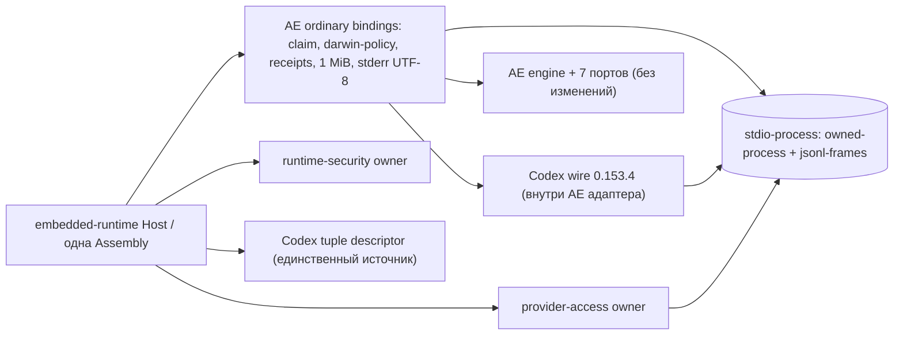

# Критик 4: скептик и OpenClaw — отчёт

- Исполнитель: независимый критик. Роль: `skeptic-openclaw`. Дата: 2026-10-01.
- Статус: только анализ. Исходники, manifests, CI, SQL, pins, ADR не менялись; builds/tests/install/provider execution не запускались.
- Изученные snapshots (read-only, проверены `git rev-parse HEAD`):
  - agent-runtime `b0bcb265d1466da3272078f9dfdb7c6784624283` (`gh api compare b0bcb265...main` = identical, ahead 0, проверено мной 2026-10-01);
  - openclaw `510beb8d52bd6be9fea27513b9008a50c92a1d2d` (upstream main ушёл на 9 коммитов вперёд к моменту проверки; анализ закреплён на 510beb8d);
  - get-modular `9c722ceff4ede307d06d7a4b63fdebe615f54c53`, `.github` `3fe0f135ffc446b3bb174397c6b5783f72a008a2`, engineering-foundation `b8ec0f17d1b8d6f9b7a45798931715d59a126888` (все три identical с main).
  - Для diff OpenClaw 71a55164 → 510beb8d: blobless shallow clone (`--shallow-since=2026-09-27`) в `$SCRATCH/critic-skeptic-openclaw/openclaw`.

## Реально полученные внешние источники

Веб-поиск не использовался; online research в широком смысле не проводился. Получено только следующее:

| Источник | Что получено |
|---|---|
| `gh api repos/openclaw/openclaw/compare/71a55164…510beb8d` | ahead 1744 коммита за ~3 дня, список файлов усечён на 300 |
| `git clone --filter=blob:none` openclaw в scratch | path-limited `git diff`/`git log` 71a55164..510beb8d по `extensions/codex/src/app-server` и `src/process` |
| `gh pr view` openclaw #132621, #132745, #133111, #160487, #161583 | тела PR (orphan reaper, Codex 0.158.0, host lifeline) |
| `gh issue view` openclaw #67886, #85251, #140479, #158383, #154419 | тела issues (EPIPE crash, wedge, restart drain, migrations) |
| `gh search issues/prs` openclaw | номера #95547, #86214, #133101 и др. (только заголовки) |
| `gh api compare` для agent-runtime, get-modular, .github, EF; `gh pr list` agent-runtime | актуальность snapshots; открытые PR #184, #180, #72 |
| `npm view` | `@agent-teams/agent-execution`, `embedded-runtime`, `filesystem-custody`: 404 (не опубликованы); `@openai/codex` versions/time (0.153.4 — 2026-09-04, 0.155.1 — 09-18, 0.158.0 — 09-28, 0.159.3 latest — 09-30); `@openai/codex-sdk` 0.159.3 |
| `npm pack @openai/codex-sdk@0.159.3` в scratch (без install) | README: SDK «spawns the CLI and exchanges JSONL events over stdin/stdout»; в dist `spawn(`, `"exec"`, `--experimental-json` |
| `gh search code createAgentRuntimeHost --owner agent-teams-ai` | пусто (не доказывает отсутствие приватных потребителей) |

Всё остальное ниже — чтение локальных snapshots.

---

## 0. Короткий вывод

**Рекомендую не B в нынешнем виде, а более узкий и лучше обоснованный вариант:** исправить швы Codex на месте, выделить **один** platform-пакет (физический процесс + строгий JSONL), обосновав его вторым реальным потребителем, который уже есть в репозитории (`provider-access` auth capture). Codex wire-логику (жёстко привязанную к 0.153.4) оставить внутри адаптера AE. Профиль заменить на **единый источник Codex tuple**, а не «нейтральный profile». `operations`, имя passive factory, публичный тип профиля и формат ordinary v1 сделать **до** первого API baseline/публикации, а не «отдельными checkpoints потом».

Главное, что я независимо нашёл и чего не было у прошлых критиков:

1. **B противоречит FMS v1 для Codex client.** Нормативно: «Protocol clients used only by one adapter SHOULD remain inside that adapter until reuse or lifecycle evidence justifies extraction» (`.github/docs/architecture/feature-module-standard/v1.md:147-149`) и «MUST NOT be extracted merely for … one adapter, or a hypothetical future consumer» (`v1.md:468-469`). Чужой harness — гипотетический потребитель. Официальный `@openai/codex-sdk` 0.159.3 уже даёт сторонним разработчикам Codex через JSONL stdio.
2. **У process-библиотеки есть второй реальный потребитель, но B его не использует.** PA auth capture дублирует ту же семантику владения process group (`ordinary-codex-auth-capture.ts:53-77` vs `node-ordinary-process.ts:30-33,100-104,171-185`) и тоже говорит с `codex app-server` по stdio (`ordinary-codex-auth-files.ts:90`). Без него extraction не проходит правило REUSE (`v1.md:455`).
3. **B не даёт ни замены компонентов внутри нашего Host, ни реального переиспользования чужими разработчиками.** Host options закрыты. Пакеты `private: true` и не опубликованы (npm 404), publish workflow и `.changeset` нет. SDK growth по решению владельца dormant (`EF docs/architecture/public-api-compatibility.md:51-70`), а `architecture/sdk-growth/activation.json:39-49` в AR по-прежнему перечисляет шаги внешней authority.
4. **Цена отложенного public API/data растёт.** Сейчас API baseline-файлов нет (`architecture/sdk-growth/profile.yaml:18` ссылается на отсутствующий `architecture/public-api/embedded-runtime.json`), ordinary-записей в qualification registry нет. Позже то же самое придётся делать при живых consumers и записях.
5. **Новые correctness risks (вне extraction scope):** после падения Host операция навсегда остаётся `running`/`accepted` (нет owner-loss detection). После SIGKILL Host detached-группа Codex остаётся orphan. OpenClaw закрывал именно этот класс проблем: #132621 → #132745/#133111.

---

## 1. (a) Цели владельца (из handoff §1, кратко)

Очень модульная архитектура с заменой компонентов без правок core и deep imports. Самостоятельные переиспользуемые библиотеки для чужих harness. Сначала Codex, потом Claude. Ordinary — единственный активный путь. Понятный API (`operations`). SOLID/Clean/DDD/DRY/CMS/FMS по существу. Никаких новых фич. Один evolving v1 без лишнего legacy, но без молчаливого удаления реальных данных. Регулярная сверка с OpenClaw. Гейты — только если польза больше затрат (решение 2026-09-25, `EF public-api-compatibility.md:51-70`).

## 2. (b) Прошлые гипотезы, которые критикую

B (handoff §5): R0 contracts → R1 profile/LaunchRecipe → R2 process lib ‖ R3 Codex client lib → R4 evidence/docs. Оценка: **2800–4400 changed + 900–1650 moves**, LOC confidence 5/10, 🎯8 🛡️8 🧠5. Состав по B: production 1300–2200, tests 1100–1700, docs/manifests/gates 400–500 (`codex-boundaries-report.md:253`).

---

## 3. (c) Текущие факты (VERIFIED, agent-runtime@b0bcb265, если не указано иное)

**F1. Ordinary-срез маленький.** 15 файлов `*ordinary*` в AE — 1859 строк. Ordinary Codex — 672 строки (`protocol` 222, `items` 170, `provider` 155, `config` 125), shared `codex-app-server-jsonl.ts` — 240, `node-ordinary-process.ts` — 208. Итого 1120 строк production-кода, который B собирается разделить. Тесты: `ordinary-node-process.test.ts` 223, `ordinary-codex.test.ts` 192, framing-тесты 92+249 (общие с contained). Код плотный: строки до 400–500 символов.

**F2. Двойная обработка framing есть.** `node-ordinary-process.ts:93` — `const decoder = new TextDecoder("utf-8", {fatal: true});`, строки 109–116 режут по `\n` и ограничивают `262_144`/`256`. Затем `ordinary-codex-protocol.ts:18`: `yield Buffer.from(\`${line}\n\`, "utf8");` подаёт строки во второй reader. Комбинированный лимит 1 MiB stdout+stderr живёт в process (`:106-107`, `:163`), fatal UTF-8 stderr — тоже там (`:163-164`).

**F3. Codex wire-код — строгий валидатор одной версии, а не клиент.** `ordinary-codex-provider.ts:31`: `result.thread.cliVersion !== "0.153.4"`; `:146-147`: regex `agent-runtime-ordinary\/0\.153\.4 …arm64`; `:92,104`: `approvalPolicy: "never"`. `ordinary-codex-protocol.ts:83-84` пинует точный текст warning про `gpt-5.3-codex-spark`. `request()` (`:32-46`) — одна in-flight заявка без карты correlation; server-initiated request отвергается exact-key проверками.

**F4. Codex tuple размазан по 4 пакетам, включая публичный API.** Executable/type pins есть в 13 production-файлах. AE: `ordinary-model.ts:7`, `ordinary-ports.ts:56`, `ordinary-codex-config.ts:9,13,38`, `ordinary-codex-provider.ts:31`, `ordinary-codex-protocol.ts:84`, `contracts/contained-agent-turn.ts:111`. PA: `domain/ordinary-provider-access.ts:25-28`, `contracts/ordinary-provider-access.ts:8`, `ordinary-pa-broker.ts:61` (`headers.version !== '0.153.4'`), `:66`, `ordinary-codex-auth-contracts.ts:4`. RS: `ordinary-security-policy.ts:6,15,39`. Embedded: `runtime-access.ts:233` (публичный тип: `capabilityManifestRevision?: "ordinary-codex-macos-arm64-0.153.4-v1"`), `contained-turn-runtime-validation.ts:199,257`. Engine интерпретирует профиль только как opaque identity (`ordinary-engine.ts:9,79`).

**F5. Codex выпускается очень часто.** npm: 0.153.4 вышел 2026-09-04, latest 0.159.3 — 2026-09-30, между ними 13 релизов. OpenClaw поднял pin 0.155.1 → 0.158.0 ради upstream-фикса потери вывода команд (PR #160487, merged 2026-09-28). Floor у OpenClaw 0.149.0, newer → только warn (`openclaw extensions/codex/src/app-server/version.ts:2-4`, `client-initialize.ts:61-80`@510beb8d).

**F6. Второй потребитель механики процесса и JSONL уже есть в PA.** `ordinary-codex-auth-capture.ts:53-56` делает `spawn('/usr/bin/sandbox-exec', …, {detached: true, …})` с `codex app-server --strict-config --listen stdio://` (`ordinary-codex-auth-files.ts:90`). Логика группы там та же: «Never signal a numeric group after its leader exit has been observed.» (`:73`) — ср. «An exited leader cannot justify signalling a possibly recycled process group.» (`node-ordinary-process.ts:102`). Duplicate-key проверка JSON реализована дважды и по-разному: AE `codex-app-server-jsonl.ts:59-80` без ограничения вложенности, PA `ordinary-codex-auth-json.ts:8-24` с `stack.length > 32`.

**F7. Claude sync (следующий шаг владельца) потребует ChildProcess-подобную поверхность.** `claude-agent-sdk-query-contracts.ts:15-28` требует `stdin: Writable`, `stdout: Readable`, `kill(signal)`, события `exit`/`error`. Provider передаёт `spawnClaudeCodeProcess` в Host-owned starter (`claude-agent-sdk-contained-turn-provider.ts:202`).

**F8. Каждый пакет облагается governance-налогом.** На `filesystem-custody` ссылается около 35 governance-файлов (~210 упоминаний без evidence; часть связана с native helper): `source-dependencies.yaml` (62), `consumer-profile.json` (53), FMS `candidate-profile.json` (23), `sdk-growth/profile.yaml` (9) и т.д. Активация требует отдельного ADR: «ADR-0017 requires every activation to carry its own accepted authority» (`docs/decisions/0019-…:31-32`). `consumer-profile.json` — 6302 строки, из них `boundaries` — 6102 с пофайловыми рёбрами. Проверка `live relationships drift` (`scripts/architecture/get-modular-source-census.mjs:85`) требует точного совпадения, а write-режима генерации я не нашёл. Исторический пример: фикс custody `b0bcb26` — ~100 строк production и 1315+/135− по 36 файлам, из них ~490 — копии CMS evidence.

**F9. Сейчас никакой публикации нет, и API ещё нигде не зафиксирован.** Все пакеты `private: true` и `0.0.0`. На npm их нет (404). В `.github/workflows` нет publish, `.changeset` отсутствует, хотя `profile.yaml` на него ссылается. `releasedBaselinePath: architecture/public-api/*.json` указаны (`profile.yaml:18,30,…`), но tracked-файлов `public-api/` — 0. EF: «The Get Modular and Agent Runtime SDK growth profiles stay unactivated» (`public-api-compatibility.md:66-68`). AR `activation.json` (последнее изменение 2026-09-24, до решения 09-25) в `pending` всё ещё требует «generate trusted histories, owner decisions, grant … through the external authority».

**F10. Host закрыт для замены компонентов.** `ordinary-agent-runtime-host.ts:13-29`: options только `execution/storage/scope/signal`, фабрики собраны внутри (`:73-89`). ADR-0090:76-78: «The public facade accepts closed Host configuration, not an arbitrary dependency bag».

**F11. Нет обнаружения потери владельца после рестарта.** `observe` читает только store (`ordinary-engine.ts:248`). `cancel` в store лишь ставит флаг (`ordinary-postgres-store.ts:121-126`). В engine/store/host нет lease, owner generation и startup reconcile — grep пуст.

**F12. Процесс detached и после рестарта не забирается.** `node-ordinary-process.ts:154` — `detached: true`; `:55` — «This adapter never recovers a persisted PID.» ADR-0090:97-98: «stale PID after restart is insufficient». Смягчение: broker работает внутри Host (`ordinary-pa-broker.ts:153,166`, `listen(0,'127.0.0.1')`), у каждой операции свой workspace/HOME.

**F13. ADR и код расходятся в том, кто владеет launch config.** ADR-0090:90-91: «Runtime Configuration owns immutable launch configuration». Фактически конфиг пишет `ordinary-codex-config.ts` в AE, а в `runtime-configuration/src` нет ordinary-кода.

---

## 4. Критика B и её сметы

| # | Находка | Sev | Conf |
|---|---|---|---|
| S1 | **R3 «Codex App Server client» как пакет противоречит FMS** (`v1.md:147-149`, `:468-469`). VERIFIED: wire-код — валидатор одной версии (F3); OpenClaw держит свой client внутри plugin — 253 из 339 non-test файлов `app-server` импортируют `openclaw/plugin-sdk`; есть официальный `@openai/codex-sdk`. ASSUMPTION: реальный клиент для чужих harness потребует approvals/server requests, параллельную correlation и терпимость к версиям, то есть новые фичи, исключённые handoff §2. | P1 | 8 |
| S2 | **R2 process lib в B имеет одного потребителя, хотя второй есть** (F6). Без адаптации PA правило REUSE (`v1.md:455`) не выполнено и «переиспользуемость» не проверена. С PA общий инвариант «не сигналить группу после выхода лидера» живёт в одном месте. | P1 | 8 |
| S3 | **B не закрывает цели №1 и №2 владельца в наблюдаемом виде** (F9, F10). После 2800–4400 строк пользователь Host по-прежнему не может заменить ни одну роль, а чужой разработчик не может установить библиотеку. Это нормально только если владелец явно принимает: «сейчас внутренняя чистка и publish-ready пакеты». Сейчас это не сказано. | P1 | 7 |
| S4 | **Очерёдность «extraction сначала, API/data потом» дороже, чем нужно** (F4, F9). R1 B трогает `ordinary-model.ts`/codec/validation, а v1 cutover — те же файлы. Публичный литерал профиля лежит в `runtime-access.ts:233`, в том же интерфейсе `RuntimeContainedTurnView` (`:230-241`), который переименуется в `operations`. Два прохода — два ревью публичной поверхности. Baseline ещё нет — дешевле не будет. | P1 | 7 |
| S5 | **Смета B распределена неверно.** Moves 900–1650: верхняя граница больше физически переносимого объёма — около 1150–1400 строк даже при максимальном переносе (process ~150 + тесты ~150 + jsonl 240 + protocol/turn-state ~190 + items ~80 + `ordinary-codex.test` ~190 + framing-тесты 341). Production 1300–2200 changed при всём срезе в 1120 строк выглядит завышенным; реалистично ~600–1200. Gates 400–500 занижены: по F8 один пакет ≈ 300–550 строк governance, два ≈ 600–1100 плюс перекрёстные рёбра AE/PA. Итог B в целом близок к правде, но governance-риск недооценён — ровно тот, который не любит владелец. | P2 | 6 |
| S6 | **«Нейтральный profile» — неверная мотивация; нужен единый источник Codex tuple** (F4, F5). Реальный драйвер изменений — частые релизы Codex, а не новые провайдеры. Сейчас bump затрагивает 13 файлов в 4 пакетах плюс binary SHA (`ordinary-codex-config.ts:13`) и fixtures. Это уже сегодняшняя стоимость сопровождения, не спекуляция. | P2 | 7 |
| S7 | **Пропущенное входное требование R0: Claude SDK spawn hook** (F7). Если API process-библиотеки спроектировать только под Codex (байтовый канал без `kill`), Claude sync сломает его. Проверить на бумаге в R0, не реализуя Claude. | P2 | 7 |
| S8 | **A (минимализм) действительно оставляет связанность:** без единого источника tuple каждый bump Codex продолжит идти по 4 пакетам, Assembly останется зависимой от concrete `NodeOrdinaryProcessOptions["prepareLaunch"]` (`ordinary-runtime-assembly.ts:3,18,59-60`). Но LaunchRecipe — фикс на ~20–40 строк, и отдельного этапа R1 он не требует. | P2 | 8 |
| S9 | **R4 «combined evidence/docs» лишний как отдельный этап.** B сама говорит, что тесты идут в каждом PR. Остаётся «declarations/archive closure» — достаточно одного packed single-package consumer на пакет, по образцу ~68 строк в `filesystem-custody/tests/package/curated-assembly-surface.test.ts`. | P3 | 6 |

---

## 5. OpenClaw @510beb8d: как устроено на самом деле

### 5.1 Механизмы (VERIFIED, пути относительно `extensions/codex/src/app-server/`)

| Область | Факт @510beb8d | Вывод для AR |
|---|---|---|
| Кто владеет процессом | `CodexAppServerClient.start` сам создаёт stdio-транспорт, то есть client и есть владелец процесса (`client.ts:290-322`). Spawn `detached: process.platform !== "win32" && !isHostedGateway` (`transport-stdio.ts:119,150-160`); env фильтруется от `LD_*`/`DYLD_*`/`NODE_PATH` (`:22-27,85-91`). | Не копировать: противоречит SR-AP-1 и принципу заимствованного канала. В AR канал уже заимствован (`ordinary-ports.ts:41-45`). |
| Durable registration и orphan reaping | До spawn — sweep сохранённых `{parent, child: pid, pgid, startedAt, commandFingerprint}`. Если parent мёртв, а child жив с тем же startedAt и fingerprint, child завершается (`transport-process-registration.ts:68-134`). Регистрация коммитится до `initialize`: «Codex rejects non-initialize requests; no native turn can start before this commit» (`:214-215`). Store `maxEntries: 512`, `overflowPolicy: "reject-new"` (`:61-63`). | Новое: прошлые отчёты этого не описали. Для AR — будущая опция, не scope; API process-библиотеки должен отдавать start identity, чтобы её не закрыть. |
| Framing | Байтовый framer; при асинхронном обработчике строки вход ставится на паузу, «Retain only this already-delivered transport chunk, never a page queue» (`client-message-frames.ts:6-102`). В самом framer нет лимита длины строки (`:12-14,73-76`); иного read-лимита в `client.ts` я не нашёл. Незавершённый хвост на EOF доставляется как строка (`:78-83`). Decoder восстанавливает «raw newlines observed inside native JSON string values», до 8 MiB и 1000 строк (`client-message-decoder.ts:1-2,11`). | Перенять backpressure без очереди (это помогает и зануливанию секретов в PA). Не перенимать толерантный decoder и отсутствие лимитов: в AR fail-closed с лимитами и отказ от незавершённого хвоста — осознанный и лучший для этого профиля выбор. Риск: если 0.153.4 выдаёт сырой `\n` в строках, AR откажет (ASSUMPTION, не проверено). |
| Correlation и timeouts | `pending: Map<number\|string, attempt>`, `nextId++` (`client.ts:224,234,640`). Для `thread/start`/`resume`/`fork` нужен timeout или signal (`:430-444`). «Possibly written» помечается до `stdin.write` (`:794-803`). «Connection closure ends correlation, not the possibly written native operation» (`request-attempt.ts:226-229`). | Совпадает с AR: одна запись `turn/start`, без replay (`ordinary-codex-provider.ts:101`). Сохранить. |
| Повтор при неопределённости | Retry только при `-32001` (ingress rejection до enqueue), не более 3 (`client.ts:575-582`). `turn/start` повторяется только после определённого отказа (active compact, overflow) (`run-attempt-turn-start.ts:68-84,89-130`). Indeterminate `thread/*` переводит client в retire (`client.ts:505-525`). | Утверждение «OpenClaw повторяет неопределённые эффекты» неверно; подтверждаю прошлых критиков. |
| Approvals | Server requests идут через `CodexServerRequests`; approval-методы — `item/commandExecution/requestApproval` и др. (`client.ts:846-870,972-982`). | В AR `approvalPolicy: "never"`, любой server request — отказ. Новую фичу не добавлять. |
| terminal / disconnect / exit | `CodexAppServerCloseResult = {exited: true, cleanup: "closed"\|"uncertain"} \| {exited: false, cleanup: "uncertain"}` (`transport.ts:9-11`). «EOF or a forced root exit alone cannot prove it» (`:94-96`). При наблюдённом исполнении native-команд: «Codex can discard terminal handles before OS cleanup…» → `cleanup: "uncertain"` (`client.ts:755-757`). | Важный нюанс для AR: `process_group_closed.groupEmptyObserved` означает «группа пуста», а не «все потомки исчезли». ADR-0090:99-100 это признаёт; библиотека не должна обещать больше. |
| Очистка потомков | SIGSTOP корня, снимок дерева через `ps`, kill потомков, SIGCONT (`transport-process-containment.ts:79-200`). В `src/process` добавлен Linux subreaper (`supervisor/linux-child-subreaper.ts`, +161). | Не копировать: это эскалация сложности под чужой профиль. |
| Hidden state | `WeakMap` CLOSES на уровне модуля (`transport.ts:18`), `resolveGlobalSingleton(Symbol.for("openclaw.codexAppServerProcessReaper"))` (`transport-process-registration.ts:38-41`), состояние в `globalThis` (`shared-client.ts:1369`). | Избегать; у AR экземпляры принадлежат Host. |
| Persisted state и legacy | Даже до релиза держат совместимость: `commandFingerprint … .optional()` «Unreleased dev/nightly rows stay reapable…» (`transport-process-registration.ts:27-33`). Ломающиеся миграции: #158383 (Gateway down ~20 мин после update из-за orphaned codex session bindings), #154419 (миграция codex plugin state не завершается и навсегда блокирует `doctor --fix`). | Это подтверждает цель владельца: не тащить readers/migrations без реальных данных. |
| SDK-поверхность | Корневой `openclaw` 2026.9.7: 349 exports, из них 347 — `plugin-sdk/*`. Внутренние `packages/*` (24 шт.) все `private: true`, `0.0.0-private`. | OpenClaw — продукт с широким plugin SDK и приватной внутренней модульностью, а не набор самостоятельных библиотек. Широкий SPI для одного владельца — не образец. |

### 5.2 Что изменилось 71a55164 → 510beb8d (1744 коммита за ~3 дня)

- Codex pin 0.155.1 → **0.158.0** (#160487); floor 0.149.0 не изменился.
- `client.ts` (+/−151): notifications вынесены в новый `client-notifications.ts` (91 строка), проверка версии переехала в `client-initialize.ts`. При сбое `initialize` теперь дренируется stdio и выдаётся startup failure (#161419 «preserve native launch failures after process exit»).
- `client-message-decoder.ts`: определение восстанавливаемого JSON больше не опирается на тексты ошибок V8 — ради Bun (#162559).
- `transport-stdio.ts`: detached теперь зависит от host lifeline (#161583), QA env удалён.
- `attempt-client-cleanup.ts`: deadline interrupt на монотонных часах (#155824).
- `src/process`: Linux subreaper, spawn-broker resource server (~+1700), windows command line.
- **Без изменений:** `request-attempt.ts`, `turn-router.ts`, `shared-client-lifecycle.ts`, `client-message-frames.ts`, `transport-process-registration.ts`, `transport-process-containment.ts`, `attempt-timeouts.ts`.

### 5.3 Известные failure cases OpenClaw (через `gh`)

- **#132413 (follow-up 3) → #132621** (closed, superseded) **→ #132610** (landed reaper) **→ #132745** (merged 2026-08-29: macOS `lstart` с точностью до секунды позволял убить процесс с переиспользованным pid, отсюда fingerprint команды; reaper запускался только перед следующим spawn) **→ #133111** (merged 2026-08-30, закрывает #133101: старт падал из-за чужих нечитаемых процессов). Суть из #132621: «a hard-killed (SIGKILLed) gateway orphans the detached Codex app-server child … The orphan keeps executing the in-flight native turn».
- **#67886** (closed 2026-04-17): необработанный EPIPE на stdin после выхода child ронял gateway. В AR есть `child.stdin.on("error", fail)` (`node-ordinary-process.ts:158`); в библиотеке это нужно сохранить.
- **#85251** (open): app-server после `turn/started` замолкает, run висит до 360 с. В AR есть deadline ≤45 с → SIGTERM группы (`node-ordinary-process.ts:166`, `ordinary-engine.ts:77`).
- **#140479 / #95547**: restart drain обрывает in-flight stdio turns.
- **#158383, #154419**: отказы миграций persisted state.

### 5.4 Что перенять, чего избегать

Перенять как проектные входы, без копирования кода: доставку байтов с backpressure без очереди; явное «possibly written»; результат close, разделяющий exit и cleanup с честным `uncertain`; обработчик ошибок stdin; ограниченный store с `reject-new` вместо вытеснения; монотонные deadlines (в AR уже есть: `ordinary-ports.ts:51`).

Избегать: владения транспортом внутри client; глобальных singleton/WeakMap; framer без лимитов; совместимости с pre-release форматами; широкого SDK из сотен subpath.

## 6. Сверка прошлых выводов об OpenClaw

| Прошлый вывод | Статус @510beb8d |
|---|---|
| Client связан с Host SDK и session catalog (`client.ts:2,5`@71a55164) | **Подтверждено:** `client.ts:2-9`; 253/339 файлов импортируют plugin-sdk |
| Codex pin 0.155.1 (research 09-28) / 0.154.0 (lessons, 7a1090af) | **Устарело:** 0.158.0 |
| `-32001` retry только до enqueue | **Подтверждено:** `client.ts:575-582` |
| Connection close ≠ конец возможно записанной операции (`request-attempt.ts:226`) | **Подтверждено:** файл не менялся, `:226-229` |
| Prebind buffer 256; риск роста `notificationTail` | **Подтверждено:** `turn-router.ts:19,110,672`; handlers по-прежнему fire-and-forget (`client-notifications.ts:81-89`) |
| Проверка версии после `initialize` | **Подтверждено, переехало:** `client-initialize.ts:61-80`. Политика — floor + warn для newer, а не exact pin |
| Child-like transport facade с `kill` | **Подтверждено:** `transport.ts:28-54` |
| Глобальное состояние / `Symbol.for` | **Подтверждено:** `transport-process-registration.ts:38-41`, `shared-client.ts:1369` |
| Размеры: shared-client 1559, client 1118 строк | **Устарело:** 1418 и 982 после «deslop»-проходов (#160912, #161234, #161966) |
| **Не было ни в одном отчёте** | Durable process registration и orphan reaper; восстановление raw-newline в decoder; `nativeExecutionObserved → cleanup uncertain`; host lifeline; Linux subreaper |

---

## 7. Мой выбор: три варианта

Обозначения: 🎯 уверенность / 🛡️ надёжность / 🧠 сложность сопровождения. LOC = additions+deletions, включая tests/docs/gates; moves — отдельно, логические строки без удвоения. Основа сметы: размеры из F1/F8 и governance-прецедент. Worker wall time здесь не учитывается.

### Вариант 1 (Recommended): швы на месте + один доказанный platform-пакет + ранний public API/data checkpoint

Владельцы ресурсов. Child process и process group — экземпляр `owned-process`, по одному на reservation; владеет им AE binding или PA capture, а не Codex wire. Канал Codex wire только заимствует. Pool одолжен Host. Workspace у AE workspace owner, credentials у PA, grants у PA и RS, journal у Host. Assembly и восемь владельцев не меняются: пакет — фиксированная библиотечная зависимость, а не graph node («Fixed library dependencies and private helpers … remain static imports», `get-modular docs/architecture/common-assembly.md:69-71`).

**Пакет `stdio-process` (рабочее имя; роль `platform`; две features):**
- **Почему самостоятелен:** у него два реальных независимых потребителя в разных контекстах — AE execution и PA auth capture (F6), что выполняет REUSE (`v1.md:455`). Runtime-зависимостей ноль (только Node builtins), поэтому делить на два пакета нечем, кроме лишнего governance.
- **Owner:** platform module по ADR-0017; семантику согласуют AE и PA, политика остаётся у них.
- **Обещает:** `owned-process` — spawn собственной process group, байтовые чанки с backpressure без внутренних копий (потребитель может их занулить), write/end stdin, эскалация сигналов только по команде вызывающего и с защитой «не сигналить после выхода лидера», наблюдения exit/close/EOF stdout и stderr/«группа пуста» плюс start identity (pid/pgid). `jsonl-frames` — ограниченный framer: fatal UTF-8, отказ при duplicate keys с настраиваемой глубиной, лимиты строки и объёма, срез CR, отказ от незавершённого хвоста, декодер JSON-RPC envelope.
- **Не обещает:** claim, receipts, retries, restart, reaping после рестарта, hostile containment, обнаружение сбежавших потомков, Windows, persistence, квалификацию вне darwin arm64 и Codex-семантику.
- **Реальный сценарий в чужом harness:** собственный harness для stdio JSONL agent server (Codex app-server, MCP stdio) получает честное владение процессом и строгий framing. Codex-протокол и политику он пишет сам или берёт `@openai/codex-sdk`.

**Остаётся в AE:** Codex wire (точные валидаторы 0.153.4), engine, store, workspace, artifacts, ordinary process binding.

**Оценки:** 🎯 7/10 · 🛡️ 8/10 · 🧠 4/10.

| Часть | Changed | Moves |
|---|---:|---:|
| PR-0 записи решения (API/lifecycle пакета, проверка против Claude hook, owner descriptor, данные, имена) | 150–300 | 0 |
| PR-1 швы на месте: LaunchRecipe в порты, process → байты, protocol читает байты, разрыв импорта protocol→config, parity-тесты | 300–600 | 20–60 |
| PR-2 единый источник Codex tuple: AE opaque identity, PA/RS сверяют с identity от Host | 250–500 | 20–60 |
| PR-4 вынос пакета: scaffold, ADR активации, профили, packed single-package consumer | 700–1300 | 450–800 |
| PR-5 адаптация PA auth capture (+ строгий decode) | 200–400 | 0 |
| **Сопоставимо с объёмом B** | **1600–3100** | **490–920** |
| + формат ordinary v1 в PR-2 (только если реальных записей нет) | +120–250 | — |
| + PR-3 public API: `operations`, имя passive factory, публичный тип identity | +650–1000 | — |
| **Полностью** | **2370–4350** | **490–920** |

LOC confidence: 5/10.

### Вариант 2: только швы на месте, без новых пакетов

Делаются PR-1 и PR-2. Технические модули остаются в AE, но изолируются Foundation-границами (`allow: builtins only`), то есть готовы к выносу. PA не трогается.

- 🎯 7/10 · 🛡️ 8/10 · 🧠 3/10.
- **730–1500 changed + 40–120 moves.** Опционально +650–1000 (public API) и +120–250 (v1).
- Полностью соответствует FMS и легко откатывается.
- **Не даёт** устанавливаемой библиотеки: цель владельца №2 откладывается. Последующий вынос — в основном moves плюс один раунд governance.

### Вариант 3: исправленный B, два пакета

Пакеты: process и generic «strict JSONL-RPC». Codex-валидаторы остаются в AE. PA — второй потребитель. API процесса проверен против Claude hook. Условие для Codex/RPC-пакета: владелец решает публиковать (hard boundary «external API lifecycle», `v1.md:454`) и нужен минимальный release route.

- 🎯 5/10 · 🛡️ 7/10 · 🧠 6/10.
- **2430–4400 changed + 550–1000 moves**, без public API и v1.
- Оправдан только при решении о публикации и названном внешнем потребителе.

Вариант C (B + store SPI + PostgreSQL + conformance) сейчас не рекомендую. Замена store не убирает PostgreSQL из PA/RS (`ordinary-agent-runtime-host.ts:76-83`). Gap 1 (ниже) нужно закрыть до публичного store SPI. Потребитель не назван.

## 8. SOLID / Clean / DDD / DRY / CMS / FMS по существу

- **SRP:** process смешивает физику и line protocol (F2) — исправляет PR-1. Protocol импортирует refusal/JSON-helper из файла с fs (`ordinary-codex-protocol.ts:3`) — вынести в маленький wire-модуль.
- **OCP:** bump Codex сейчас — правки в 4 пакетах (F4) — исправляет PR-2. Новый provider не нужен, обобщение под него не строить.
- **LSP:** канал AR без `kill` — правильно. Claude hook требует `kill` (F7), поэтому будущий фасад обязан направлять `kill` владельцу; зафиксировать это в PR-0.
- **ISP:** provider получает весь `OrdinaryOperation` (`ordinary-ports.ts:57`), хотя нужны prompt и binding. Сузить можно, но это необязательно; симметрично все порты не переписывать.
- **DIP:** Assembly зависит от concrete `NodeOrdinaryProcessOptions` (`ordinary-runtime-assembly.ts:18`) — PR-1. Вызов SQL adapter → domain policy внутри транзакции (`ordinary-postgres-store.ts:147`) корректен, не трогать.
- **DDD:** AE, PA и RS — разные владельцы. Тройная проверка профиля в доменах PA (`:25-28`) и RS (`:39`) — оправданная защита в глубину; сохранить, но сверять с identity, которую выдал Host.
- **DRY:** дубли реальных инвариантов — группа процессов и duplicate-key (F6); их стоит объединить. Буфер PA с зануливанием (`ordinary-codex-auth-ipc.ts:46-100`) не объединять.
- **CMS:** пакет не становится graph node; Assembly меняется только типом LaunchRecipe.
- **FMS:** правила extraction (`v1.md:452-469`) и protocol client (`v1.md:147-149`) — главный нормативный аргумент против R3 B.
- **Early product advantage:** «add abstractions or gates only for a demonstrated risk» (`.github/docs/engineering-quality-standard.md:59-61`).

## 9. Очерёдность: обоснована ли «extraction сначала, остальное потом»

- **`operations` + имя passive factory + публичный тип identity:** делать **до** первого API baseline и публикации. Сейчас baseline нет, пакеты не опубликованы (F9) — дешевле, чем сейчас, не будет. Масштаб: `.containedTurn`/`containedTurn:` — 213 вхождений в 34 файлах, `RuntimeContainedTurn*` — 101. Внутренние каталоги `contained-turn-*` не переименовывать: дорого (census) и мало пользы. От extraction это не зависит; можно вести параллельной полосой. Вердикт: «потом» допустимо, но не «после неопределённого checkpoint».
- **Ordinary v1:** **вместе с PR-2** (те же файлы: model, codec, validation, store), если владелец подтвердит отсутствие реальных записей. Ordinary-записи в qualification registry нет, campaign pending (ADR-0090:139-140). Использовать отдельную format identity, а не голое `schemaVersion: 1`: ADR-0090:42-46 называет «V1» исторический contained raw-формат («never replays them as V1»), так что голый номер создаёт коллизию.
- **Удаление legacy (contained, ~70 900 строк, codec 2 / raw V1, Claude adapter):** отдельно и позже, после ревью достижимости. Здесь согласен с B.
- **Default factory:** ordinary-фабрика требует options и не может быть zero-arg. Честное решение — переименовать passive factory в рамках PR-3.

## 10. Порядок PR (предложение, не разрешение)

| PR | Зависимость | Changed / moves | Полоса |
|---|---|---:|---|
| PR-0 записи решения; привести `activation.json` pending в соответствие с решением EF 09-25 (классификация) | — | 150–300 / 0 | integrator |
| PR-1 швы на месте + parity-тесты (split UTF-8, CRLF, хвост на EOF, общий 1 MiB, невалидный UTF-8 в stderr, backpressure) | PR-0 | 300–600 / 20–60 | A |
| PR-2 descriptor (+v1 при отсутствии данных) | PR-0; merge после PR-1 | 250–750 / 20–60 | B |
| PR-3 public API naming | PR-2 (тип identity) | 650–1000 / 0 | C |
| PR-4 вынос пакета | PR-1 | 700–1300 / 450–800 | A |
| PR-5 адаптация PA | PR-4 | 200–400 / 0 | A |

Каждый PR ≤ ~2000 changed. **Единственный integrator** владеет root manifests и lock, Host/Assembly, `consumer-profile.json`, `source-dependencies.yaml`, FMS/SDK-профилями и ADR: census-рёбра правятся вручную, при параллельной правке будут конфликты. Решающее правило: если владелец не разрешает PR-5 (PA), то по FMS не делать и PR-4 — остаться на варианте 2.

Риски:
- регресс секретного пути PA (смягчение: существующие real-process тесты в `ordinary-codex-auth.test.ts:80-161`);
- смена того, какой receipt отсутствует при EOF-аномалии: при переносе framing вместо `output_drain` будет отсутствовать `provider_terminal`, и семантика journal поменяется. Нужен parity-тест на исход и набор receipts.

## 11. Исключения, вопросы данных и API, correctness risks

**Вне scope:** streaming, approvals, новые версии и провайдеры Codex, orphan reaper, owner-loss detection, store SPI, публикация и release route, удаление contained-кода, переписывание Claude.

**Correctness risks:**
1. **Устаревший `running` после падения Host** (F11). Нарушает честный статус. P2, conf 8. Отдельное решение (owner generation/lease или startup reconcile) — это не resume и не новая фича исполнения, но в extraction его не включать.
2. **Orphan process group после SIGKILL Host** (F12). Осознанный компромисс ADR-0090, частично смягчённый broker внутри Host. P2, conf 6.
3. При переносе framing не потерять общий лимит 1 MiB stdout+stderr, fatal UTF-8 stderr и отказ от незавершённого хвоста (F2).
4. Отставание от Codex 0.153.4 → 0.159.3 (F5): upstream-фиксы (#160487) до нас не доходят. Это риск сопровождения, а не extraction.
5. Raw newline внутри JSON-строк: AR откажет. ASSUMPTION — для 0.153.4 не проверено.
6. Не переобещать `process_group_closed` (см. 5.1).

**Два gap из handoff §4.10:**
- **Gap 1 — SQL read/duplicate accept: подтверждён частично.** `#read` действительно не сверяет payload с ключом (`ordinary-postgres-store.ts:71-74`). В duplicate accept scope, intent и provider связаны неявно: fingerprint пересчитывается из payload (`ordinary-validation.ts:64-65`) и сравнивается (`store:91`), а `commandId` строки не сверяется. Собственными путями записи рассогласование не создаётся: insert берёт поля из того же input (`:86`), update идёт по ref payload и CAS (`:77`). Риск возникает при внешней порче или ручной правке БД либо при альтернативном writer. Закрыть до публичного store SPI.
- **Gap 2 — failed workspace preparation: подтверждён по коду.** Выбрасывается `OrdinaryWorkspacePreparationRetained(root, workspaceId)` (`node-ordinary-workspace.ts:45-47`). `close` требует handle, который не был возвращён, и отказывает при uncertain (`:66-68`). Engine глотает типизированную ошибку: `} catch {uncertainty = …}` (`ordinary-engine.ts:118`). Root остаётся только в journal (`workspace_retained`), а запись в `owned` живёт до конца жизни Host.

## 12. Сильнейший контраргумент и что изменит рекомендацию

**Контраргумент:** владелец прямо хочет переиспользуемые библиотеки, включая Codex, а я отказываюсь от Codex client и трогаю секретный путь PA ради DRY и формального соответствия FMS. Возможно, владелец ценит неприкосновенность PA выше.

**Что изменит выбор:**
1. Владелец решает публиковать и называет внешнего потребителя app-server-клиента → вариант 3.
2. Владелец запрещает правки PA → вариант 2.
3. Есть реальные ordinary-записи → v1 переносится позже, с учётом этих записей.
4. Нужна замена роли внутри Host (например, store) → узкий SPI одной роли с исправлением gap 1.
5. Проверка покажет, что Claude hook несовместим с общим API процесса → process остаётся внутри AE до Claude sync.

## 13. Ключевые вопросы владельцу (варианты: первый рекомендуемый)

1. **Есть ли реальные ordinary-записи в какой-либо БД?**
   - (a) Нет → v1 в PR-2 (Recommended; 🎯8 🛡️8).
   - (b) Только тестовые → то же (🎯7 🛡️8).
   - (c) Есть → оставить v3, cutover позже с учётом записей (🎯7 🛡️9).
2. **Нужна ли публикация библиотек в ближайшие 1–2 месяца?**
   - (a) Нет → вариант 1 без release route (Recommended; 🎯7 🛡️8).
   - (b) Да → минимальный route (v1 API gate + packed consumer + ревью владельца), тогда вариант 3 становится допустимым (🎯5 🛡️7).
   - (c) Не уверен → вариант 2 (🎯7 🛡️8).
3. **Нужна ли сейчас замена компонента внутри нашего Host?**
   - (a) Нет (Recommended; 🎯7 🛡️8).
   - (b) Да, одна названная роль → узкий SPI + conformance (🎯5 🛡️7).
   - (c) Все роли → отклонить как экстраполяцию (🎯8 🛡️6).
4. **Разрешить адаптацию PA auth capture к общему process-механизму?**
   - (a) Да, отдельным PR (Recommended; 🎯7 🛡️8).
   - (b) Нет → вариант 2 (🎯7 🛡️8).
   - (c) После Claude sync (🎯6 🛡️8).

**Моё предложение (вне scope, только идея):** генератор census для `consumer-profile.json` с режимом `--check`. Enforcement сохраняется, а цена каждого рефакторинга заметно падает. ASSUMPTION: сейчас эти рёбра поддерживаются вручную — write-режима я не нашёл.
