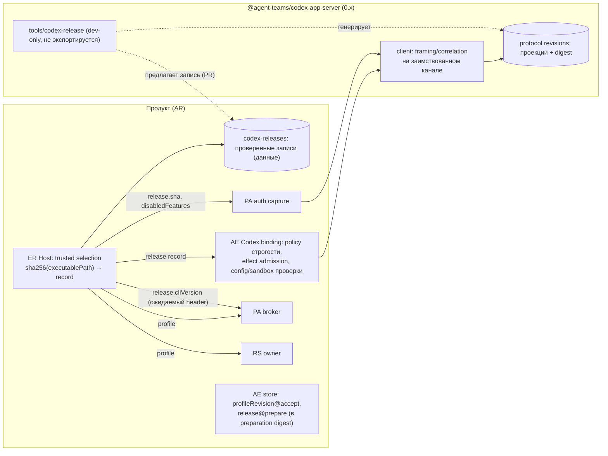
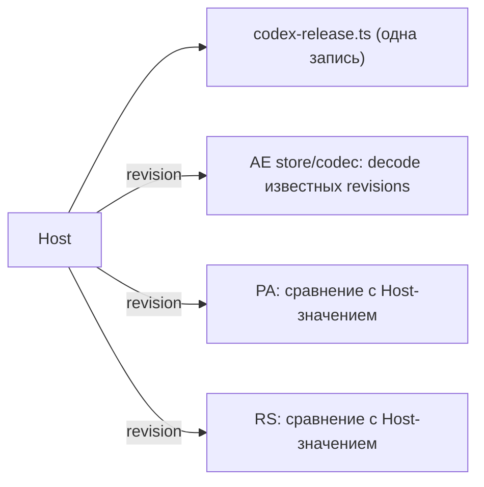

# Раунд 2, критик 2 из 4: «Codex: всегда свежая версия» (role `codex-version`)

- Исполнитель: независимый критик. Дата: 2026-10-01 (вечер).
- Статус: только анализ. Исходники, manifests, CI, SQL, pins и ADR не менялись. Builds, tests, install не запускались, Codex-бинарь не запускался. Единственный созданный файл — этот отчёт.
- Snapshots (read-only, `git rev-parse HEAD` проверен):
  - `agent-runtime` `b0bcb265d1466da3272078f9dfdb7c6784624283`
  - `get-modular` `9c722ceff4ede307d06d7a4b63fdebe615f54c53`
  - `.github` (dotgithub) `3fe0f135ffc446b3bb174397c6b5783f72a008a2`
  - `engineering-foundation` `b8ec0f17d1b8d6f9b7a45798931715d59a126888`
  - `openclaw` `510beb8d52bd6be9fea27513b9008a50c92a1d2d`; upstream main на момент проверки `6ac5e0f20511d5cdbcf54eb81aee2b8dc1d6fd3c` (2026-10-01T18:25Z, ahead 48).
- Scratch: `$SCRATCH/r2-codex-version/` (blobless clones `openai/codex` и `agent-teams-ai/agent-runtime`, извлечённые схемы, скрипт `drift.py`).

## Реально полученные внешние источники

Веб-поиска не было. Это source critique с точечной проверкой фактов через `gh`, `git`, `npm view`, `curl` к registry. Это не широкое online research.

| Источник | Что получено |
|---|---|
| `gh release list/view --repo openai/codex` | даты и release notes `rust-v0.149.0` … `rust-v0.159.3`. Latest stable `rust-v0.159.3` (2026-09-30T22:57Z), prerelease `0.160.0-alpha.*` |
| `git clone --filter=blob:none --depth 1` openai/codex, теги `rust-v0.153.4` → commit `3d2ee51ca2d5db578f328aa75e20aa22c0197c9a`, `rust-v0.158.0` → `064c6b8c737f5b41d171fdda80bd9ef10ad06eb3`, `rust-v0.159.3` → `01fc69f4026735edfdf6789820549727a4867b11` | `codex-rs/app-server-protocol/{src,schema,scripts}`, `codex-rs/app-server/README.md`, `codex-rs/features/src/lib.rs`, `codex-rs/core/config.schema.json`, `sdk/python`, `sdk/python-runtime`, `sdk/typescript` |
| `zstd -d` над `schema/precomputed/app-server-exports-experimental.json.zst` трёх тегов | экспериментальные экспорты JSON Schema и TS (416 / 440 / 440 схем) |
| `npm view @openai/codex` (time, dist-tags, optionalDependencies, dist.integrity, dist.attestations) | 12 stable-релизов после 0.153.4 за 26 дней; SLSA provenance v1 |
| `curl https://registry.npmjs.org/-/npm/v1/attestations/@openai%2fcodex@0.159.3-darwin-arm64` | provenance привязан к `openai/codex` `.github/workflows/rust-release.yml` @ `refs/tags/rust-v0.159.3` |
| `npm view @openai/codex-sdk@0.159.3 dependencies` | `{"@openai/codex": "0.159.3"}` |
| `curl https://pypi.org/pypi/openai-codex/json`, `.../openai-codex-cli-bin/json` | `openai-codex` 0.159.3 требует `openai-codex-cli-bin==0.159.3` |
| `gh api` openclaw: `commits/main`, `compare/510beb8d...main`, `contents` `version.ts` и `package.json` @ `6ac5e0f2`, `commits?path=…` | pin 0.158.0 и floor 0.149.0 не изменились в дельте |
| `gh pr view` openclaw #128370, #130685, #132908, #136184, #137009, #138725, #160487, #158298; `gh api commits` `2abecd703d`, `7dbfab8c2c` | размеры bump-PR и история pin |
| `gh` agent-teams-ai/agent-runtime: blobless clone, `git show --stat 5ccd986b`; `gh pr view 69`; `gh search code --owner agent-teams-ai "@openai/codex"` | историческая стоимость bump 0.150.1 → 0.153.4; других Codex-потребителей в org нет (только workflow orchestrator) |
| локальная `npm help audit` (npm 11.19.1) | `npm audit signatures` проверяет registry signatures и provenance attestations |

Обозначения: **VERIFIED** — прочитал в источнике по указанной строке. **ASSUMPTION** — мой вывод. Severity P0–P3, уверенность 1–10. 🎯 уверенность, 🛡️ надёжность, 🧠 сложность (всё по 10).

---

## 0. Короткий вывод

Владелец хочет всегда использовать свежий Codex. Текущая архитектура делает каждый bump одновременно:

- правкой кода в 13 ordinary production-файлах четырёх пакетов;
- data cutover в **трёх** durable stores, а не в одном, как считал раунд 1: AE operation, PA grant, RS grant;
- изменением публичного типа.

Цифры. Codex выпустил 12 stable-релизов за 26 дней после 0.153.4. Последний реальный bump в этом репозитории (0.150.1 → 0.153.4, коммит `5ccd986b`, тогда ещё только contained) стоил **+1798/−964 строк в 54 файлах**.

При этом «запускать любой новый Codex без review» (floor + warn, как у OpenClaw) для ordinary **нельзя сделать fail-closed**. Hardening конфигурации построен на deny-list фич. В 0.159.3 появились новые фичи, включённые по умолчанию (`daemon_auto_start`, `worktrees`, `system_proxy_fallback`, `unified_exec_tty`). `config/read` не показывает полный набор effective features, поэтому их нельзя ни увидеть, ни отклонить в runtime. Security-критичные поля (`thread/start.permissions`, `turn/start.permissions`, `runtimeWorkspaceRoots`, `allowProviderModelFallback`) относятся к experimental API Codex. Upstream удаляет API в minor-релизах (`thread/rollback` в 0.156.0, #44915).

**Моя рекомендация (Вариант A): «последняя проверенная версия» вместо «последней непроверенной».** Шесть частей:

1. **Разделить identity.** Стабильная *profile revision* (семантика ordinary: разрешённые эффекты, broker contract) живёт в AE/PA/RS и durable данных. Отдельная *Codex release* (cliVersion, SHA бинаря, protocol revision) привязывается к попытке при `prepare` и известна только AE Codex binding. Тогда bump Codex не трогает ни durable форматы, ни PA/RS, ни публичный API.
2. **Trusted selection по наблюдаемому бинарю.** Host один раз хэширует `executablePath` и выбирает запись из маленького реестра проверенных релизов. Это данные продукта, а не реестр профилей. Дальше Host раздаёт выбранный descriptor AE, PA auth capture и broker. Литералы версии и SHA исчезают из PA/RS.
3. **Protocol revision как данные.** Проекция потребляемых shapes генерируется из upstream precomputed export на точном теге. VERIFIED: этот export для 0.153.4 **байт-в-байт совпадает** с нашей схемой, сгенерированной запуском бинаря (SHA-256 `69aba3fe…`). Валидаторы получают явную политику строгости по shape:
   - закрыто для методов, item-типов, server requests, sandbox/permissions/config;
   - аддитивно-толерантно для информационных shapes (rate limits, token usage, metadata thread).
4. **Bump tool (dev-only)** рядом с генерируемыми данными. Он проверяет: тег → peeled commit, npm SRI и SLSA provenance, SHA бинаря без запуска, diff проекции, diff default-enabled фич. На выходе он классифицирует bump: «только данные» или «изменение протокола». Затем canary в TEST-окружении с отдельного разрешения владельца.
5. **Пакет `codex-app-server`** становится безусловным, а не «по условию», как в раунде 1. U3 делает Codex *independently updated dependency* с релизом раз в ~2 дня, а это прямое FMS-условие `DEPENDENCY_LIFECYCLE`. Плюс есть REUSE: AE и PA уже говорят на этом протоколе, и их валидаторы разошлись.
6. **Политика допустимых версий** остаётся у продукта (Host/AE Codex binding). Механика (framing, correlation, protocol revisions) — у библиотеки.

Оценка A: 🎯 7 · 🛡️ 8 · 🧠 5. Версионная подготовка (V0 + V1 + V2 + V4): **1620–3200 changed + 100–300 moves**. Вынос пакета (V3) добавляет **550–1250 / 450–800** и пересекается с PR 7 раунда 1. LOC confidence 4/10. После этого обычный bump при неизменной потребляемой проекции стоит **40–150 строк данных** против нынешних сотен–тысяч строк. Для сравнения, рутинные bump у OpenClaw: +65/−61, +65/−58, +61/−53.

---

## 1. Цели владельца, прошлые гипотезы, факты, мой выбор

**Цели (контракт раунда 2, приоритет U1–U5):**

- U3: в идеале всегда свежий Codex; эволюция версии — первоклассная задача; реализацию не предлагать, границы спроектировать.
- U2: library-first, breaking changes допустимы (0.x minor + migration guide), но «Persisted user data, durable recovery state and in-flight work still need a safe migration» (diff PR #328).
- U4: строгая модульность, SOLID/Clean/DRY, без universal managers.
- U1: заморозка SDK-growth заменяема.
- U5: соседняя программа `@get-modular/resources`, та же зона Host/cleanup.
- Прежние: без новых фич; ordinary — единственный путь; безопасность, authority и durable data не ослаблять.

**Прошлые гипотезы, которые пересматриваю:**

- Раунд 1, синтез: «Нужен единый источник tuple, а не реестр profiles»; Codex-пакет «по условию» (`critique-synthesis.md:63, 100`).
- core: «decode принимает любую well-formed revision, claim только текущую» (`core-lifecycle-report.md:371-372`).
- libraries: пакет обещает «одна pinned protocol revision (`0.153.4`)», «не обещает … совместимость с другими ревизиями Codex» (`libraries-consumer-report.md:151-152, 156`).
- skeptic: «Codex wire-логику (жёстко привязанную к 0.153.4) оставить внутри адаптера AE» (`skeptic-openclaw-report.md:33`).

**Текущие факты** — разделы 2–5. **Мой выбор** — разделы 7–9.

---

## 2. Инвентаризация: где и зачем зашита версия

Пути ниже даны относительно `packages/contexts/agent-execution/src/features/contained-agent-turn/` (AE), `packages/contexts/provider-access/src/features/contained-turn-access/` (PA), `packages/contexts/runtime-security/src/features/contained-turn-dispatch-authority/` (RS), `packages/apps/embedded-runtime/src/features/` (ER). Всё VERIFIED на `b0bcb265`.

Литерал `0.153.4` найден в 22 production-файлах под `packages/**/src/**`: 13 ordinary, 9 contained. Во всём дереве он встречается в 135 tracked-файлах, из них 78 — тесты AE. Но версионно-связанных ordinary-файлов больше: часть связи идёт через `ORDINARY_PROFILE`, SHA бинаря и тексты сообщений, а не через литерал.

### 2.1 Безопасность: якорь бинаря и hardening конфигурации

| Где | Цитата | Что защищает | Оценка |
|---|---|---|---|
| AE `adapters/outbound/ordinary-codex/ordinary-codex-config.ts:13` | `ORDINARY_CODEX_BINARY_SHA256 = "b973d440…"` | точные байты бинаря (supply chain) | **настоящая защита**, но значение принадлежит релизу, а не коду |
| PA `adapters/outbound/ordinary-codex-auth-contracts.ts:3` | `ORDINARY_CODEX_AUTH_BINARY_SHA256 = 'b973d440…'` | то же для auth capture (тот же `executablePath`, ER `ordinary-session-runtime/composition/ordinary-agent-runtime-host.ts:66, 83`) | дубль security-инварианта |
| AE `codex-app-server/codex-app-server-platform-tuple.ts:70` | `binarySha256: "b973d440…"` | contained tuple | третья копия |
| AE `ordinary-codex-config.ts:56-70` и PA `ordinary-codex-auth-files.ts:41-47` | две реализации «прочитать бинарь, сверить SHA, проверить стабильность inode/mtime» | TOCTOU-устойчивая проверка | **механизм** продублирован |
| AE `ordinary-codex-config.ts:14-17` | `ORDINARY_CODEX_DISABLED = ["apps", "hooks", … "memories"]` | отключение фич Codex | **deny-list, безопасен только при exact pin** (§3.5) |
| PA `ordinary-codex-auth-contracts.ts:65` | `AUTH_DISABLED_FEATURES = Object.freeze(['remote_control', 'apps', …` | то же для auth | второй deny-list |
| AE `ordinary-codex-config.ts:108-114` | `!containsExpected(config, expected) || … !ORDINARY_CODEX_DISABLED.every(key => features[key] === false)` | проверка effective config | subset-проверка: новые ключи проходят |
| AE `ordinary-codex-provider.ts:31-34` | `result.approvalPolicy !== "never" || … activePermissionProfile … sandbox` | проверка эффективной политики thread | настоящая защита; поля experimental (§3.3) |

### 2.2 Корректность протокола: shapes одной ревизии

| Где | Цитата | Тип |
|---|---|---|
| AE `ordinary-codex-protocol.ts:6` | ``const exact = (value, keys) => Object.keys(value).length === keys.length && …`` | общий exact-key helper |
| `:50` | `exact(value, ["id", "items", "itemsView", "status", "error", "startedAt", "completedAt", "durationMs"])` | Turn |
| `:83-84` | `params.message === "Model metadata for \`gpt-5.3-codex-spark\` not found. …"` | точный текст warning |
| `:191` | `exact(limits, ["limitId", "limitName", "primary", "secondary", "credits", "individualLimit", "spendControlReached", "planType", "rateLimitReachedType"])` | **ломается на 0.159.3** (§3.4) |
| `:216-221` | `admitPassive` → иначе `refuse()` | закрытый список методов (правильно) |
| AE `ordinary-codex-items.ts:16-23` | `itemKeys` для 6 типов item | закрытые item-shapes (правильно) |
| AE `codex-app-server/generated-codex-item-schema.ts:1` | `// Generated deterministically from the descriptor-bound retained Codex 0.153.4 schema` | **общая** для contained и ordinary (§3.6) |

### 2.3 Identity и attestation: сама строка версии

| Где | Цитата | Защищает ли |
|---|---|---|
| AE `ordinary-codex-provider.ts:31` | `result.thread.cliVersion !== "0.153.4"` | сверка, что ответил тот же бинарь. Полезно, но значение должно идти из descriptor |
| `:145-147` | `/^agent-runtime-ordinary\/0\.153\.4 \(Mac OS [^;]+; arm64\)/u` | то же |
| AE `ordinary-codex-config.ts:38` | `http_headers: {version: "0.153.4"}` | **это не идентичность Codex**: заголовок пишем мы сами в `config.toml` |
| PA `adapters/outbound/ordinary-pa-broker.ts:61` | `headers.version !== '0.153.4'` | эхо нашего же конфига. Authority broker — capability token (`:45-52`). Литерал ничего не добавляет к безопасности, кроме связи «запрос сформирован нашим рецептом» |

### 2.4 Durable data: версия внутри persisted identity

| Store | Где | Поведение после смены литерала |
|---|---|---|
| AE `ordinary_turn_operations_v3` | `domain/ordinary-model.ts:7` `capabilityManifestRevision: "ordinary-codex-macos-arm64-0.153.4-v1"`; `adapters/outbound/postgres/ordinary-state-codec.ts:23` `envelope.capabilityManifestRevision !== ORDINARY_PROFILE.capabilityManifestRevision` → `TypeError`; `domain/ordinary-validation.ts:61` | все старые строки недекодируемы: observe/cancel/duplicate-accept бросают ошибку (core раунда 1 это нашёл) |
| PA `provider_access.ordinary_grant` | `postgres/ordinary-pa-schema.ts:6` `binding jsonb NOT NULL`, `:29` триггер `NEW.binding IS DISTINCT FROM OLD.binding` → immutable; `domain/ordinary-provider-access.ts:25-26` `get('capabilityManifestRevision') !== 'ordinary-codex-macos-arm64-0.153.4-v1'` → throw; `postgres/ordinary-pa-store.ts:28` `snapshotOrdinaryPaBinding(row.binding)` | **новое:** незавершённые PA grants нельзя retire/settle, `snapshotOrdinaryPaBinding` вызывается на каждом пути (`ordinary-pa-store.ts:65, 67, 80, 91, 101, 114`). Cleanup obligation остаётся висеть |
| RS (таблица `ordinary-security-owner`) | `postgres/ordinary-security-owner.ts:19` `captureOrdinarySecurityPolicy(data.policy …)` и `:21` `JSON.stringify(capturedPolicy) !== JSON.stringify(policy)` → denied; `domain/ordinary-security-policy.ts:39` `value.capabilityManifestRevision !== "ordinary-codex-macos-arm64-0.153.4-v1"` | **новое:** незавершённые RS grants недекодируемы. Строка сломается и при любой смене policy в Host (ttl, лимиты), не только при смене версии |

### 2.5 Authority и Host

- ER `ordinary-session-runtime/composition/ordinary-agent-runtime-host.ts:76`: `policy: {...ORDINARY_PROFILE, provider: "codex", mode: "workspace-write", ttlMs: 60000, …}`. Host передаёт RS литерал AE-домена.
- AE `composition/ordinary-feature-factory.ts:10`: сравнение `supported.capabilityManifestRevision !== ORDINARY_PROFILE.capabilityManifestRevision`.
- AE `application/ordinary-ports.ts:56`: литерал в типе порта `supported`.

### 2.6 Публичный API

- ER `contained-turn-runtime-access/contracts/runtime-access.ts:233`: `readonly capabilityManifestRevision?: "ordinary-codex-macos-arm64-0.153.4-v1";`. Экспорт из корня пакета: `src/index.ts:29` (`RuntimeContainedTurnView`).
- ER `contained-turn-runtime-validation/composition/contained-turn-runtime-validation.ts:199, 257`: тот же литерал в сверке и построении view.
- AE `contracts/contained-agent-turn.ts:111`: то же.
- **Новое, отдельная ось версии:** ER `trusted-runtime-access-scope/contracts/trusted-runtime-access-scope.ts:20` `readonly configurationDialect: "codex-0.134";`, экспорт через `./composition` (`src/composition.ts:52`). Пассивный классификатор `runtime-configuration/.../codex-configuration-semantic-classifier-v1.ts:9` `const dialect = "codex-0.134"` проецирует `personality` (`docs/architecture/readiness.md:137-138`). Upstream в 0.156.0 удалил выбор personality (release notes 0.156.0, #44935, #45809; `codex-rs/features/src/lib.rs` @ `rust-v0.159.3`: `personality` → `Stage::Removed`).

### 2.7 Итог классификации

| Класс | Что | Должно жить |
|---|---|---|
| Безопасность (настоящая) | SHA бинаря, проверка его байтов, disable-set фич, проверка effective config и sandbox/permissions | данные **проверенного релиза** + один механизм проверки |
| Корректность протокола | exact-shapes, item schema, тексты startup/warning | **protocol revision** (сгенерированная проекция) + политика строгости в AE binding |
| Identity | `cliVersion`, user-agent | из descriptor релиза |
| Литерал без защиты | `http_headers.version` и его проверка в PA; литерал в `ordinary-ports.ts:56`; публичный view | убрать или брать из descriptor |
| Durable identity | `capabilityManifestRevision` в AE/PA/RS | **стабильная profile revision**; release — отдельный факт попытки |

---

## 3. Как эволюционирует сам Codex (факты)

### 3.1 Каденция

VERIFIED по `npm view @openai/codex time` и `gh release list`: после `0.153.4` (2026-09-04T23:25Z) вышли 0.154.0, 0.155.0, 0.155.1, 0.156.0, 0.156.1, 0.157.0, 0.157.1, 0.158.0, 0.159.0, 0.159.1, 0.159.2, 0.159.3. Это 12 stable-релизов за 26 дней, а также десятки `-alpha`, которые исключаем по правилу владельца «без alpha/beta/RC».

Патчи `.1/.2/.3` выходят пачками: 0.159.1 (29.09 20:32), 0.159.2 (29.09 23:57), 0.159.3 (30.09 22:57). Содержимое патчей небезобидно для нас: 0.159.1 «Added GPT-6.1 Sol as the default model in the bundled catalog» (release notes). От каталога моделей зависит наш точный текст warning (`ordinary-codex-protocol.ts:83-84`). ASSUMPTION: смена каталога может убрать или изменить это warning.

### 3.2 Схемы: генерация и версионирование upstream

- CLI-команды VERIFIED нашим manifest: `tests/fixtures/protocol/codex-app-server-0.153.4/manifest.json` `"generatorCommands": ["codex app-server generate-json-schema --out … --experimental", "codex app-server generate-ts --out … --experimental"]`. Наш `generate-offline.py.txt` запускал их под `sandbox-exec (deny network*)`.
- Upstream **хранит схемы в репозитории на каждом теге**: `codex-rs/app-server-protocol/schema/` (1012 файлов на `rust-v0.153.4`, 1050 на `rust-v0.159.3`). Состав: stable JSON (`schema/json`), TS (`schema/typescript`) и **сжатые экспорты** `schema/precomputed/app-server-exports-{stable,experimental}.json.zst`. Генератор: `codex-rs/app-server-protocol/scripts/write_schema_fixtures.py` (cargo test `schema_fixtures_tests::write_schema_fixtures_from_env`).
- **VERIFIED, ключевой факт.** В экспериментальном экспорте на `rust-v0.153.4` ровно 416 JSON-схем, столько же, сколько наш `schemaTreeFileCount: 416`. Запись `v2/ItemCompletedNotification.json` имеет SHA-256 `69aba3fe5f72f38bf5c541e7e2c09de40778abe65ff969d9fc73372037812091`, байт-в-байт как наш retained artifact (`manifest.json` `"artifactSha256": "69aba3fe…"`). Значит, проекцию для любой версии можно получить из upstream git на точном теге, не запуская бинарь. Запуск бинаря остаётся независимой сверкой (наш `verify-regeneration.mjs`, opt-in `AR_CODEX_SCHEMA_REGEN_VERIFY=1`), а не обязательным шагом bump.
- Upstream в основном не закрывает объекты. На `rust-v0.159.3` у `Turn` и `RateLimitSnapshot` нет `additionalProperties: false`; закрыт только `AsyncUserInputQuestion`. Схема upstream не обещает отсутствия новых полей. Наши `exact()` строже, чем схема источника.

### 3.3 Experimental API и где мы на нём стоим

- `codex-rs/app-server-protocol/src/experimental_api.rs` @ `rust-v0.159.3`: поля и методы помечаются `#[experimental("<method>.<field>")]`, сообщение `"{reason} requires experimentalApi capability"`.
- Наш ordinary включает `capabilities: {experimentalApi: true}` (AE `ordinary-codex-provider.ts:78`), PA тоже (`ordinary-codex-auth-protocol.ts:72`).
- **VERIFIED: security-критичные поля ordinary — experimental** (`rust-v0.159.3`):
  - `codex-rs/app-server-protocol/src/protocol/v2/thread.rs:69` `#[experimental("thread/start.allowProviderModelFallback")]`
  - `thread.rs:83` `#[experimental("thread/start.runtimeWorkspaceRoots")]`
  - `thread.rs:96` `#[experimental("thread/start.permissions")]`
  - `thread.rs:214` `#[experimental("thread/start.activePermissionProfile")]`
  - `v2/turn.rs:225` `#[experimental("turn/start.permissions")]`

  Мы их отправляем и проверяем: AE `ordinary-codex-provider.ts:90-94, 103-105, 31-34`. Формально upstream не обещает их стабильность, и их семантика может смениться без изменения схемы. Это ловит только canary.

### 3.4 Фактический drift 0.153.4 → 0.159.3 на потребляемых shapes

Сравнение экспериментальных экспортов (скрипт `$SCRATCH/r2-codex-version/drift.py`):

| Shape | Изменение | Последствие для текущего кода |
|---|---|---|
| `Turn`, `TurnError`, `ItemStarted/Completed` params, 8 delta-нотификаций, `thread/status/changed`, `turn/started`, `turn/completed`, `error`, `thread/tokenUsage/updated`, `turn/diff/updated`, `turn/plan/updated`, `remoteControl/status/changed`, `warning`, `InitializeResponse`, `ConfigReadResponse` (корень) | без изменений | — |
| item-типы `agentMessage`, `userMessage`, `reasoning`, `plan`, `commandExecution`, `fileChange` | без изменений (поменялся только `mcpToolCall`, его мы отвергаем) | — |
| `RateLimitSnapshot` | `+normalModelSlug`; `codex-rs/app-server-protocol/src/protocol/v2/account.rs:668` `pub normal_model_slug: Option<String>,` без `skip_serializing_if`, то есть сериализуется как `null` | **exact 9-key проверка `ordinary-codex-protocol.ts:191` отвергнет `account/rateLimits/updated`**. ASSUMPTION: эта нотификация приходит во время turn, поэтому turn упадёт |
| `Thread` | `+daybreakEnabled, environments, originator` | не ломает: `validateThread` проверяет поля выборочно |
| `ThreadStartResponse` | `+disabledPluginIds` | не ломает |
| `CodexErrorInfo` | `+flexUnavailable, tooManyDenials` | не проверяем enum |
| ClientRequest | `−thread/rollback`, `+13` методов | не используем `thread/rollback` |

Удаление API в minor VERIFIED: release notes `rust-v0.156.0` «#44915 Remove the deprecated `thread/rollback` API»; `codex-rs/app-server/README.md:336-338` @ `rust-v0.159.3` «`thread/rollback` has been removed from the API … Requests use the generic unknown-method rejection path».

**PA auth capture опирается на deprecated метод:** `ordinary-codex-auth-protocol.ts:76, 81` `rpc.request('getAuthStatus', { includeToken: true, … })`. Upstream `codex-rs/app-server-protocol/src/protocol/common.rs:1460-1461` @ `rust-v0.159.3` (и `:1385` @ `rust-v0.153.4`): `/// DEPRECATED in favor of GetAccount` / `GetAuthStatus => "getAuthStatus"`.

### 3.5 Drift фич и почему deny-list не годится для «latest»

- `codex-rs/core/config.schema.json`: ключей `features` 145 на `rust-v0.153.4`, 161 на `rust-v0.159.3`; `additionalProperties: false`, удалённых ключей нет.
- `codex-rs/features/src/lib.rs` @ `rust-v0.159.3`, новые фичи `Stage::Stable` с `default_enabled: true`:
  - `daemon_auto_start` (`:113` «Automatically start the shared local daemon for eligible interactive launches.»);
  - `worktrees` (`:200` «Enable managed worktree creation and repository-aware sessions.»);
  - `system_proxy_fallback` (`:204` «Retry eligible bootstrap requests through the system proxy after normal routing fails.»);
  - `unified_exec_tty` (`:135`).

  Включены по умолчанию в новой версии: `realtime_conversation`, `write_stdin_approval`, `guardian_reuse_parent_compaction`. Ни одной из них нет в `ORDINARY_CODEX_DISABLED`.
- `config/read` не перечисляет все effective features. VERIFIED: retained capture `tests/fixtures/codex-native-config-0.153.4/config-read.darwin-analysis.json` `config.features` содержит 16 ключей при 145 в схеме. ASSUMPTION с высокой уверенностью: ordinary-конфиг на том же механизме ведёт себя так же.
- **Вывод.** Для непроверенного релиза нет runtime-механизма, который fail-closed отклонил бы новую фичу, включённую по умолчанию. Набор `--disable` должен вычисляться **на этапе bump** из upstream-исходника точного тега и храниться в записи релиза. Это главный технический аргумент против варианта «floor + latest без review». Влияют ли перечисленные фичи на non-interactive app-server stdio, я не проверял (ASSUMPTION). Это кандидаты на review, а не доказанные уязвимости.

### 3.6 Как сам вендор связывает SDK и бинарь

- Python SDK говорит с app-server по stdio: `sdk/python/src/openai_codex/_message_router.py:72` «The app-server stdio transport is a single ordered stream». Его runtime-зависимость — точный pin: `sdk/python/RELEASING.md:9` «For CLI version X, the SDK version and its exact runtime dependency are both X.»; `sdk/python-runtime/README.md:5` «so the SDK can pin an exact Codex CLI version». PyPI: `openai-codex` 0.159.3 → `openai-codex-cli-bin==0.159.3`, это VERIFIED.
- TS `@openai/codex-sdk` 0.159.3 → `{"@openai/codex": "0.159.3"}` (npm), транспорт `exec --experimental-json` (`sdk/typescript/src/exec.ts:92` @ `rust-v0.159.3`), а не app-server.
- **Вывод.** Вендор сам выбирает «exact pin + автоматический lockstep bump», а не «floor + любой новый». Официального TS-клиента app-server нет. Это аргумент за внешнюю ценность нашего TS-клиента, хотя у OpenClaw есть собственный внутренний.

### 3.7 Supply chain: что можно проверять

- npm SLSA provenance v1 есть у `@openai/codex@0.159.3`, `@openai/codex@0.159.3-darwin-arm64` и `@openai/codex@0.153.4-darwin-arm64`. Bundle для `0.159.3-darwin-arm64` связывает tarball sha512 `688e1463…` с workflow `{"ref": "refs/tags/rust-v0.159.3", "repository": "https://github.com/openai/codex", "path": ".github/workflows/rust-release.yml"}`.
- SRI `0.153.4-darwin-arm64` `sha512-B1qhN3fa…` совпадает с нашим `manifest.json` `candidateTargets.darwin-arm64.npmSri` (VERIFIED).
- `npm audit signatures` (npm 11.19.1, `npm help audit`) «will also verify the provenance attestations of downloaded packages». Это даёт проверку без новых зависимостей.
- Release assets GitHub имеют `.sigstore` для linux-musl бинарей. Для darwin bundle в списке ассетов я не видел. Есть ли у darwin-бинаря Apple Developer ID/notarization, я **не проверял** (ASSUMPTION не делаю).

---

## 4. Как у нас сейчас устроены регенерация и bump

- Скрипты: AE `package.json:13-14` `"verify:codex-schema-regeneration": "node tests/fixtures/protocol/codex-app-server-0.153.4/verify-regeneration.mjs"`, `"verify:codex-schema-runtime": "… generate-runtime-item-schema.mjs --check"`.
- `generate-runtime-item-schema.mjs:4` пинует `EXPECTED_SOURCE_SHA256 = "69aba3fe…"` и превращает **один** файл схемы в TS-константу (`generated-codex-item-schema.ts`, 3 строки / 22 КБ).
- `verify-regeneration.mjs:161` запускает бинарь через `/proc/self/fd/3` (Linux, fd-bound), `:176-177` пропускает шаг без `AR_CODEX_SCHEMA_REGEN_VERIFY=1`.
- Contained прошивает digest дерева схем в свою identity: `codex-app-server-platform-tuple.ts:5-6, 14-15` `CODEX_CAPABILITY_MANIFEST_REVISION = \`contained-turn:v1:codex-app-server:0.153.4:schema-${CODEX_APP_SERVER_SCHEMA_SHA256}:…\``. Это **прецедент** идеи «protocol revision = digest схемы» в этом репозитории.
- Общая схема связывает два tuple: `codex-app-server-item-schema.ts:1` импортирует generated-схему. Её используют и contained (`codex-app-server-thread-item.ts`), и ordinary (`ordinary-codex-items.ts:3`). Bump ordinary без разделения тянет за собой contained-тесты (78 файлов тестов AE с литералом).
- **Историческая стоимость bump, VERIFIED:** `5ccd986b` (2026-09-05, iliya) «fix(agent-execution): align Codex adapter with 0.153.4»: **54 files changed, 1798 insertions(+), 964 deletions(−)**. Это только contained: ordinary тогда ещё не было. В том же коммите появился `codex-version-compatibility.test.ts` (48 строк). Он фиксирует, что выбор `0.153.4` отвергает `0.150.1` (`:43-47`), то есть exact-политику.

---

## 5. OpenClaw: факты и что перенять

**@510beb8d (VERIFIED):**

- `extensions/codex/src/app-server/version.ts:1-5`: `CODEX_APP_SERVER_VERSION = "0.158.0"` («Exact Codex app-server version shipped»), `MIN_SUPPORTED_CODEX_APP_SERVER_VERSION = "0.149.0"` («Inclusive runtime compatibility floor for external app-server binaries»), `MANAGED_CODEX_APP_SERVER_PACKAGE = "@openai/codex"`.
- `client-initialize.ts:61-80`: версия парсится из `userAgent`. Ниже floor → `CodexAppServerVersionError`. Выше pin → `embeddedAgentLog.warn("codex app-server is newer than OpenClaw's managed runtime; continuing with normal startup validation")`.
- `extensions/codex/package.json:11`: `"@openai/codex": "0.158.0"` (managed binary — npm-зависимость). `managed-binary.ts` резолвит бинарь из пакета. Проверки хэша бинаря в runtime я не нашёл. Используется глобальный singleton `resolveGlobalSingleton(Symbol.for("openclaw.codexManagedPluginRoot"))` (`managed-binary.ts:16`).
- Протокол: `scripts/lib/codex-app-server-protocol-source.ts:12-21` выбирает **подмножество** схем (`selectedCodexAppServerJsonSchemas`: 8 файлов). `:202` читает `precomputed/app-server-exports-experimental.json.zst`. `:250-280` требует exact pin в `package.json` («must pin @openai/codex to an exact version»), совпадения версии Cargo workspace и `HEAD == peeled rust-v<pin>` («does not match peeled … Check out the exact tag»). `scripts/check-codex-app-server-protocol.ts` проверяет ожидаемые фрагменты контракта в сгенерированных TS. `protocol-validators.ts` компилирует TypeBox-валидаторы из сгенерированных JSON. Схема без `additionalProperties: false`, поэтому валидаторы толерантны к новым полям.

**Дельта до current main `6ac5e0f2`:** `version.ts` и `package.json` не изменились: `0.158.0` / `0.149.0` (VERIFIED через `gh api contents`).

**История pin (VERIFIED `gh api commits?path=…` и `gh pr view`):**

| PR | Дата | Pin | Размер |
|---|---|---|---|
| #128370 | 08-25 | 0.149.1 | +6844/−1424, 175 файлов (переход main на app-server) |
| #130685 | 08-27 | 0.150.1 | +65/−61, 15 |
| #132908 | 08-30 | 0.151.0 | +498/−365, 25 |
| #136184 | 09-02 | 0.152.1 | +65/−58, 14 |
| #137009 | 09-03 | 0.153.0 | +203/−118, 21 |
| #138725 | 09-05 | 0.153.4 | +61/−53, 12 |
| `7dbfab8c2c` / `2abecd703d` | 09-23 / 09-25 | в `package.json` уже 0.155.1 | dependency refresh |
| #160487 | 09-28 | 0.158.0 | +280/−112, 23 («retain completed command output»; floor «stays 0.149.0») |

Политика обновлений: #158298 «Refreshes … dependencies using the fixed seven-day publication cutoff». Fix-bump #160487 смержен в день выхода 0.158.0, то есть cooldown обходится ради исправлений.

**Перенять:**

1. Генерацию проекции из точного тега с проверкой `HEAD == peeled tag` и версии Cargo (`codex-app-server-protocol-source.ts:250-280`).
2. Подмножество потребляемых схем, а не весь протокол.
3. Проверку фрагментов контракта (`check-codex-app-server-protocol.ts`).
4. Толерантность к аддитивным полям, но **только** для информационных shapes.
5. Ориентир стоимости рутинного bump: ~120 строк.

**Не перенимать:**

1. Floor + warn для более новых в ordinary-профиле: так запускается непроверенный бинарь с нашими credentials, при deny-list фич (§3.5).
2. Отсутствие runtime-хэша бинаря: наш TOCTOU-устойчивый SHA-check сильнее.
3. Глобальные singletons.
4. Клиент как владелец процесса (раунд 1).

---

## 6. Находки

| # | Sev | Conf | Находка | Evidence |
|---|---|---|---|---|
| CV1 | P1 | 9 | **Версия Codex входит в persisted identity трёх stores со строгим сравнением.** Bump делает AE-строки недекодируемыми, а незавершённые PA и RS grants несеттлимыми: cleanup obligations остаются висеть. Раунд 1 видел только AE | §2.4: `ordinary-state-codec.ts:23`, `ordinary-provider-access.ts:25-26` + `ordinary-pa-store.ts:28` + `ordinary-pa-schema.ts:29`, `ordinary-security-owner.ts:19-21` + `ordinary-security-policy.ts:39` |
| CV2 | P1 | 8 | **Deny-list фич безопасен только при exact pin.** В 0.159.3 появились новые фичи, включённые по умолчанию. `config/read` не перечисляет все effective features. Значит, «latest без review» не fail-closed | §3.5; `ordinary-codex-config.ts:14-17, 108-114`; `ordinary-codex-auth-contracts.ts:65` |
| CV3 | P1 | 8 | **Security-критичные поля ordinary — experimental API Codex**, без обещания стабильности | §3.3; `ordinary-codex-provider.ts:78, 90-94, 103-105` |
| CV4 | P2 | 9 | **Exact-key валидаторы превращают аддитивные информационные поля в code change.** Пример: `normalModelSlug` | `ordinary-codex-protocol.ts:191`; upstream `account.rs:668` |
| CV5 | P2 | 8 | **Upstream удаляет API в minor; PA auth стоит на deprecated `getAuthStatus`** | §3.4; `ordinary-codex-auth-protocol.ts:76, 81`; `common.rs:1460-1461` |
| CV6 | P2 | 9 | **Общая сгенерированная схема связывает legacy contained (pinned) и ordinary** | §4; `codex-app-server-item-schema.ts:1`, `ordinary-codex-items.ts:3` |
| CV7 | P2 | 9 | **DRY security-инвариантов нарушен:** SHA бинаря ×3, механизм проверки ×2, deny-list ×2, модель ×3 (`ordinary-codex-config.ts:9`, `ordinary-codex-auth-contracts.ts:4`, `ordinary-pa-broker.ts:66`) | §2.1 |
| CV8 | P2 | 7 | **Проверка `headers.version` в PA — эхо нашего конфига, а не идентичность Codex** | `ordinary-codex-config.ts:38`, `ordinary-pa-broker.ts:61` |
| CV9 | P2 | 8 | **Vendor-литерал в доменной модели AE как тип** (`typeof ORDINARY_PROFILE.capabilityManifestRevision`): Clean/DIP-нарушение для самого частого изменения | `ordinary-model.ts:7, 11-12, 69` |
| CV10 | P3 | 7 | **Пассивный `codex-0.134` dialect в публичном scope**; классификатор проецирует `personality`, которую upstream удалил в 0.156 | §2.6 |
| CV11 | P3 | 7 | **EQS прямо говорит «freshness alone does not authorize an unrelated upgrade of a pinned protocol»** (`engineering-quality-standard.md:157-158`); PR #328 эту строку не меняет. U3 нужно оформить продуктовой политикой (ADR AR), а не обходить | §12 |

Положительные факты, которые снижают цену решения:

- upstream export = наша схема (§3.2);
- npm provenance (§3.7);
- прецедент digest-identity в contained (§4);
- прецедент opaque binding `contracts/contained-agent-turn.ts:1, 11-18` («Opaque provider identity. Concrete support is selected by the outer adapter.»).

---

## 7. Стратегия версии: три варианта

Общие понятия:

- **Profile revision.** Семантика ordinary-профиля: какие эффекты разрешены, форма sandbox/permissions, broker contract, модель. Владеют ей AE (семантика), PA и RS (каждый — своя policy). Меняется редко и только отдельным ADR.
- **Codex release record.** Проверенная запись: `{cliVersion, platform, binarySha256, npmIntegrity, provenance: {repository, workflow, tag, commit}, protocolRevision, disabledFeatures, expectedStartupWarnings}`. Это данные продукта.
- **Protocol revision.** Сгенерированная проекция потребляемых shapes + её digest. Механизм/данные библиотеки.

### Вариант A (Recommended): «последняя проверенная версия»

**Владельцы ресурсов.** Новых ресурсов нет. Record и protocol revision — неизменяемые данные. Выбор делает Host при создании, и это decision композиции. Процессом по-прежнему владеет process binding, канал клиент только заимствует (раунд 1). По CMS (`get-modular/docs/architecture/common-assembly.md:69-72`) это static imports и typed factories, а не узлы Assembly.

**Поведение:**

1. **Выбор.** Host при создании хэширует `executablePath` (механизм уже есть: `ordinary-codex-config.ts:56-70`) и ищет запись по SHA. Нет записи → отказ с понятной ошибкой «Codex X не проверен, поддерживаются […]». Caller не выбирает версию строкой: это закрывает handoff §4.1. Recipe перепроверяет бинарь на каждом запуске, как сейчас (TOCTOU).
2. **Identity.** `capabilityManifestRevision` перестаёт содержать патч-версию Codex: например, `ordinary-codex-macos-arm64-v1` вместо `…-0.153.4-v1`, branded string, а не литерал в типах домена. Release попадает в `OrdinaryPreparation` из reservation (после проверки бинаря, `ordinary-engine.ts:79-81`) и закрепляется `dispatch_claim.preparationDigest`. PA и RS получают profile из Host и сравнивают с ним, а не со своими литералами. Release им не нужен, но см. вопрос Q5.
3. **Протокол.** Политика строгости задаётся таблицей по shape в AE binding:
   - **закрыто:** методы, item-типы, server requests, `sandbox`, `activePermissionProfile`, `config/read`, effect-bearing items (`commandExecution`, `fileChange`);
   - **открыто:** обязательные поля типизированы, новые поля игнорируются. Это `account/rateLimits/updated`, `thread/tokenUsage/updated`, метаданные `Thread`, `CodexErrorInfo`.

   Сгенерированная проекция работает как **независимый test oracle**. Закрытые ключи в нашей таблице должны совпадать со свойствами проекции, а для открытых shapes required-ключи должны быть подмножеством. Это соответствует правилу EQS о независимых oracle (`engineering-quality-standard.md:117-120`).
4. **Фичи.** `--disable` берётся из записи релиза. Bump tool вычисляет его из `codex-rs/features/src/lib.rs` и `codex-rs/core/config.schema.json` точного тега. Новая фича, включённая по умолчанию, становится явным пунктом review, а не тихим включением в runtime.
5. **Bump tool**, `tools/` пакета, dev-only, в `pnpm check` не входит. Шаги:
   1. тег → peeled commit; версия Cargo совпадает (как у OpenClaw);
   2. `npm pack` + SRI + `npm audit signatures` + проверка, что provenance workflow = `openai/codex/.github/workflows/rust-release.yml@refs/tags/rust-vX`;
   3. извлечь бинарь из tarball и посчитать SHA-256 **без запуска**;
   4. извлечь precomputed experimental export и построить проекцию;
   5. diff проекции и default-enabled фич, проверка, что используемые методы не deprecated и не удалены;
   6. классификация: `data-only` | `protocol-change` | `refused`.

   Затем canary в TEST-окружении: effectful, только с разрешения владельца, по правилам AGENTS.md. Его evidence прикладывается к PR.
6. **Публичный API.** Вместо литерала — opaque `string` или ничего, вместе с полосой `operations` раунда 1. Release наружу не отдаётся, диагностика идёт через journal.

**Durable data после bump (A):**

- Старые строки AE: profile не изменился, decode проходит, observe/cancel работают.
- `accepted` без preparation: при (будущем) исполнении получит release текущего Host. Resume сейчас нет (F5 раунда 1).
- Prepared с другим release: claim отказывает (`not_claimed`). Это возможно только через restart, потому что prepare и claim идут в одном flight.
- PA/RS grants старого Host: binding/policy не изменились, retire/settle по-прежнему возможны.
- Смена **profile** revision — редкое осознанное событие с drain/cutover. ADR-0090 уже описывает процедуру: «Rollback closes new admission and reconciles in-flight ordinary records before removing the reader» (`docs/decisions/0090-…md:45-46`).

**Безопасность.** Fail-closed для любого непроверенного бинаря. Цепочка доверия: workflow `openai/codex` @ тег → npm tarball (SRI + provenance) → SHA бинаря → проверенная запись → runtime-проверка байтов. Толерантность только к аддитивным полям информационных shapes **внутри проверенного релиза**. Её цель — дешёвый bump, а не совместимость с неизвестными версиями.

**Стоимость bump после A:**

- `data-only` (потребляемая проекция и набор фич не изменились, только SHA/версия/SRI): **40–150 строк** (запись + digest + ссылка на evidence canary).
- `protocol-change` (закрытый shape изменился, новая фича требует решения, удалён используемый метод): **150–600 строк**.

**Оценка A:** 🎯 7 · 🛡️ 8 · 🧠 5. Подготовка (PR V0, V1, V2, V4 из §9): **1620–3200 changed + 100–300 moves**. С выносом пакета (V3) ещё **+550–1250 / +450–800**. LOC confidence 4/10.

### Вариант B: exact pin + единый источник + быстрый ручной bump

Один модуль `codex-release` с текущей записью. Host отдаёт revision в AE/PA/RS вместо литералов. Exact-валидаторы остаются. Revision остаётся в persisted identity, AE decode принимает известные revisions, claim — только текущую (вариант core раунда 1).

- **Durable data.** PA и RS хранят revision в binding/policy (§2.4). Для grants старого Host им нужен либо список всех прошлых revisions (растущий legacy reader, против цели владельца), либо **drain перед каждым bump**: закрыть приём, дождаться settle, затем перезапуск.
- **Стоимость bump.** 200–700 строк. Каждое аддитивное поле требует ручной правки exact-ключей (как `normalModelSlug`), плюс regen фикстур и drain.
- 🎯 7 · 🛡️ 7 · 🧠 3. **530–1100 changed + 0–60 moves**. LOC confidence 5/10.
- Честно: B — подмножество A. Он годится, если владелец согласится на редкие bump (раз в месяц). Против «всегда свежего» он проигрывает на каждом релизе.

### Вариант C: tested floor + latest by default (как OpenClaw)

Принимать любой stable не ниже floor. Предупреждать о более новых. Декодеры толерантны везде. Доверие к бинарю — через provenance или managed npm install вместо per-release SHA.

- **Безопасность.** Неустранимые проблемы (§3.3–3.5):
  - новые фичи, включённые по умолчанию, не видны и не отключаемы в runtime;
  - experimental permission-поля могут сменить семантику;
  - API удаляются в minor;
  - PA-путь секретов идёт на непроверенном бинаре.

  Противоречит ADR-0090:133-136 (exact tuple) и EQS:157-158.
- **Стоимость bump** почти нулевая, до первой поломки, а ломаться будет у пользователя, а не в CI.
- 🎯 3 · 🛡️ 3 · 🧠 4. **800–1500 changed**. LOC confidence 4/10.
- Допустим только для **пассивной** инспекции, которая уже работает с `found_unverified` и не исполняет бинарь, или как TEST-канал. Это новая фича, не сейчас.

### Сводка

| | Свежесть | Fail-closed | Bump после | Data при bump | Публичный API при bump | Подготовка (changed / moves) |
|---|---|---|---|---|---|---|
| **A (Rec.)** | проверенный latest за ~1 день | да | 40–150 (data-only) / 150–600 | не трогается | не трогается | 1620–3200 / 100–300 (+V3 550–1250 / 450–800) |
| B | ручной, редкий | да | 200–700 + drain | drain или legacy readers PA/RS | literal или opaque | 530–1100 / 0–60 |
| C | любой latest | нет | ~0 до поломки | не трогается | не трогается | 800–1500 / 0 |

---

## 8. Границы библиотек и где живёт policy

### 8.1 Четыре понятия по компонентам

| Компонент | Внутренний порт | Поддерживаемый внешний SPI | Самостоятельная библиотека | Security/authority boundary | Единица публикации |
|---|---|---|---|---|---|
| `codex-app-server` (client + protocol revisions + dev-tool) | — | нет: provider-owned API библиотеки, а не SPI AE | **да** | нет: не выдаёт grants и не видит credentials как authority | да, когда владелец решит публиковать (0.x) |
| `codex-releases` (проверенные записи) + selection | нет | нет | **нет**: это policy продукта | **да**: trusted selection, вход Host | нет |
| Profile revision (AE/PA/RS) | значение идёт через owner options от Host | нет | нет | да: PA/RS сверяют своё | нет |
| Механизм «проверить байты исполняемого файла» | — | — | кандидат в пакет process раунда 1 (`verifyExecutableDigest`), потому что сейчас две реализации (CV7) | нет | вместе с process |

### 8.2 Пакет `@agent-teams/codex-app-server`

- **Почему самостоятельный.**
  - FMS `DEPENDENCY_LIFECYCLE` («Native, platform, post-install, incompatible, or independently updated dependencies require isolation», `dotgithub/docs/architecture/feature-module-standard/v1.md:457`). Протокол Codex обновляется независимо от AE, раз в ~2 дня (§3.1), и владелец хочет за ним следовать (U3).
  - `REUSE`: AE ordinary и PA auth capture говорят на одном протоколе (`initialize`, `config/read`, startup-нотификации). Их валидаторы уже разошлись (раунд 1, N3).
  - Внешняя ценность: официального TS-клиента app-server нет (§3.6).
- **Owner.** Владелец Codex-интеграции AR, platform-роль.
- **Обещает:**
  - framing и correlation поверх заимствованного byte-канала, без retry после возможной записи (как сейчас `ordinary-codex-protocol.ts:32-46`);
  - набор protocol revisions как данные, у каждой digest и сгенерированная проекция потребляемых shapes;
  - декодеры с явным режимом строгости на shape, выбранным вызывающим;
  - dev-tool генерации и классификации bump.
- **Не обещает:**
  - какие релизы допустимы;
  - проверку бинаря и provenance в runtime;
  - hardening конфигурации и effect admission;
  - владение процессом;
  - approvals и server requests;
  - одновременную работу нескольких revisions в одном соединении;
  - совместимость с релизами, ревизии которых в пакете нет.
- **Зависимости.** Runtime — только `node:*`. Dev-tool — `git`, `npm`, `tar`, `node:zlib` (zstd), новых npm-зависимостей нет.
- **Эволюция.** 0.x:
  - новая protocol revision — minor;
  - удаление старой revision — breaking → minor + changelog + migration guide (diff PR #328);
  - data-only релизы Codex **не трогают пакет**, потому что записи живут в продукте.
- **Связь с contained.** Contained остаётся на замороженной revision `0.153.4` (CV6) до удаления legacy. Пакет на переходный период держит две revisions — честная цена, а не обобщение.

### 8.3 Где policy, где механика

- **Policy «какая версия допустима»** — у продукта: записи `codex-releases` и selection в Host (ER), применение в AE Codex binding. Это outer composition decision (EQS `:68-70` «outer composition selects concrete implementations»).
- **Механика** — в библиотеке: client, revisions, генератор.
- **Политика строгости по shape** — в AE binding, потому что от неё зависит effect admission. Библиотека даёт только режимы.

### 8.4 Как PA и RS перестают держать литералы

- **PA:**
  - `OrdinaryPaBinding.capabilityManifestRevision` становится branded `string`, сверяется с Host-значением (сейчас `domain/ordinary-provider-access.ts:25-28`);
  - auth capture получает `binarySha256` и `disabledFeatures` из записи (сейчас `ordinary-codex-auth-contracts.ts:3, 65`);
  - broker получает ожидаемый `version`-header из записи (сейчас `ordinary-pa-broker.ts:61`). Альтернатива — убрать этот header из рецепта и проверки, раз authority даёт capability (CV8). Решает владелец.
- **RS:** `OrdinarySecurityPolicy.capabilityManifestRevision` становится branded `string` из Host-policy (сейчас `domain/ordinary-security-policy.ts:6, 15, 39`). Отдельная находка: RS сравнивает сохранённую policy целиком (`ordinary-security-owner.ts:21`), поэтому смена ttl или лимитов в Host тоже ломает decode незавершённых grants. Это не версия Codex, но тот же класс риска: записать в R0.

---

## 9. Что новая фича, что подготовка сейчас; PR, полосы, integrator

### 9.1 Классификация

| Работа | Класс | Почему |
|---|---|---|
| Разделение profile/release, trusted selection по SHA, удаление литералов из AE/PA/RS/ER, release в preparation | **подготовка сейчас** | меняет место знания, а не возможности; иначе каждый bump = data cutover + публичный break (CV1, CV9) |
| Protocol revision как данные, разделение схем contained/ordinary, таблица строгости | **подготовка сейчас** | дешевле сделать при выносе Codex-кода; без неё bump правит exact-ключи (CV4, CV6) |
| Формат ordinary v1 (отдельная format identity) | **подготовка**, вместе с V1, если инвентаризация не нашла реальных строк | те же файлы; раунд 1 пришёл к тому же |
| Bump tool + runbook | **подготовка сопровождения** (dev tooling, не продуктовая возможность) | делает «свежий Codex» дешёвым; можно чуть позже |
| Первый bump до latest stable + TEST canary | **отдельный продуктовый checkpoint** | меняет исполняемый tuple ADR-0090; требует разрешения владельца на effectful canary |
| Managed npm binary, несколько revisions в одном соединении, Host-опция «candidate channel», runtime-проверка sigstore, авто-обновление, Linux tuple, approvals, миграция пассивного dialect | **новые фичи, вне scope** | — |

### 9.2 PR (≤2000 changed каждый; предложение, не разрешение)

| PR | Содержание | Зависит | Changed | Moves |
|---|---|---|---:|---:|
| V0 | Successor ADR к ADR-0090: политика релизов Codex («проверенный latest stable», без alpha), разделение profile/release, политика строгости, место записей и selection; запись инвентаризации БД (AE/PA/RS) | — | 120–250 | 0 |
| V1 | Разделение identity + trusted selection (реестр из одной записи, структура на N) + удаление литералов (AE model/ports/validation/codec/store/factory/engine; PA contracts/domain/broker/auth; RS policy/owner; ER host/ACL/view-validation) + release в preparation + формат v1 (если данных нет). Тесты: неизвестный SHA → отказ; profile стабилен при смене release; claim отказывает при чужом release; старая строка наблюдаема; PA/RS получают profile от Host | V0; после PR 2 раунда 1 (тот же `ordinary-ports.ts`) или вместе с ним | 650–1300 | 0–60 |
| V2 | Protocol revision как данные: проекция из upstream export, digest, замороженная копия `0.153.4` для contained, таблица строгости, тест-oracle «наши ключи против проекции», тесты на отказ (лишнее поле в закрытом shape) и на приём (лишнее поле в открытом shape) | V0; параллельно V1, merge после V1 (общий `ordinary-codex-provider.ts`) | 450–850 | 100–300 |
| V3 | Вынос `codex-app-server` (PR 7 раунда 1) с данными V2; перевод PA на общие декодеры startup/`config/read` | F0 (замена SDK-growth, U1), V2 | 550–1250 | 450–800 |
| V4 | Bump tool + runbook + offline-тесты классификатора на синтетических схемах | V2 (формат проекции); переезжает с V3 | 400–800 | 0–50 |
| V5 | **Продуктовый**, по разрешению владельца: bump до текущего latest stable (сейчас 0.159.3) + evidence TEST canary | V1, V2, V4 | 150–600 | 0 |
| (API) | Литерал из публичного view → opaque, в полосе `operations` раунда 1 | V1 | ~30–80 внутри той полосы | 0 |

**Итого подготовка A без V3 и V5: 1620–3200 changed + 100–310 moves. С V3: 2170–4450 + 550–1110.**

**Без двойного счёта с раундом 1.** Синтез уже содержал PR 3 (единый tuple, 300–700, +120–300 за v1) и условный PR 7 (650–1400 / 400–700). Прирост A относительно варианта 1 с PR 7:

- V1 больше PR 3 на ~350–600 (записи, PA auth/broker, release в preparation);
- V2 даёт +450–850, из них ~150 пересекаются с PR 7;
- V4 даёт +400–800.

Итого **≈ +1050–2100 changed и +100–300 moves**.

**Полосы и integrator:**

- полоса A: V0 → V1;
- полоса B: V2 → V4;
- V3 после F0;
- V5 последним.

Единственный integrator владеет root manifests и lock, Host/Assembly (ER), AE ports/model/store/codec, owner options PA/RS, census-профилями (`consumer-profile.json`, `source-dependencies.yaml`, FMS/SDK профили) и ADR. Пересечение с U5 (`@get-modular/resources`): V1 трогает `ordinary-agent-runtime-host.ts`, который U5 переводит на scope. Изменение V1 в Host маленькое (передать descriptor), поэтому merge последовательный через того же integrator.

---

## 10. SOLID / Clean / DDD / DRY / CMS / FMS по существу

- **SRP/OCP.** Самое частое изменение (bump Codex) сейчас размазано по AE domain/ports/codec, PA domain/broker/auth, RS policy и ER публичному типу (§2). После A оно сосредоточено в записи релиза (данные) и, при изменении протокола, в protocol revision. Это и есть OCP по EQS: «Put a proven alternative behind a suitable contract and select it at the edge» (`engineering-quality-standard.md:92`).
- **DIP/Clean.** Домен AE знает патч-версию вендора как тип (`ordinary-model.ts:7, 11-12`) — vendor detail в домене (CV9). После A домен знает свою profile revision, а release — непрозрачный факт попытки.
- **DDD.** В `capabilityManifestRevision` смешаны два понятия: *profile* (policy, язык ordinary: что разрешено) и *release* (реализация вендора). PA и RS — отдельные bounded contexts со своей policy. Им нужен profile, а не патч Codex. Это не ослабляет authority: подлинность бинаря проверяет AE до запуска, а authority broker — capability token. Если владелец хочет привязки grant к release, см. Q5.
- **DRY.** Одно знание — один источник. Сейчас SHA ×3, механизм проверки ×2, deny-list ×2, модель ×3, литерал версии в 13 ordinary-файлах (CV7). Различающуюся семантику не объединяю: PA consume одноразовый, RS идемпотентный (раунд 1, core §3.6).
- **LSP.** Режим «открыто» нельзя применять к effect-bearing shapes, иначе декодер станет «слабее и успешнее» (EQS `:93`). Поэтому строгость задаётся таблицей по shape, а не глобальным флагом.
- **ISP.** PA и RS получают только profile (плюс PA auth — SHA и фичи). Библиотека не получает ничего о policy.
- **CMS.** Записи, revisions и client — fixed library dependencies и static data (`common-assembly.md:69-72`). Новых graph nodes нет, capability token `agent-runtime/ordinary-v1` при bump не меняется. Изменение типа `ordinary/provider` (descriptor) — изменение capability contract: обновить consumer profile и сравнить pin (AGENTS.md).
- **FMS.** Для Codex-пакета выполняются `DEPENDENCY_LIFECYCLE` и `REUSE` (§8.2). Правило «Protocol clients used only by one adapter SHOULD remain inside that adapter until reuse or lifecycle evidence justifies extraction» (`v1.md:147-149`) прямо допускает extraction при «lifecycle evidence». U3 его даёт.

---

## 11. Риски безопасности и durable data

1. **Переход v3 → v1 вместе с разделением identity** (V1) — breaking для **трёх** stores. Если в какой-либо БД есть незавершённые ordinary/PA/RS строки, их нельзя молча бросить: это cleanup obligations (retire, settle). Порядок такой:
   1. инвентаризация;
   2. если строк нет или они только тестовые — чистый cutover с отдельной format identity (ADR-0090:42-46 уже называет «V1» исторический contained-формат);
   3. если строки есть — drain по ADR-0090:45-46 до cutover или узкий reader **только** для найденных записей с шагом удаления.
2. **In-flight при bump (после A).** Bump не трогает данные. Но процесс Host с работающими turns должен корректно завершиться до замены бинаря. Detached-группа после SIGKILL остаётся сиротой (раунд 1, F5/F12). Runbook bump: остановить приём, дождаться terminal, dispose, заменить бинарь, старт.
3. **Ошибочная толерантность.** Если открыть effect-bearing shape (item или sandbox), новое поле с эффектом пройдёт незамеченным. Смягчение: таблица строгости + rejecting-тесты + review таблицы в каждом protocol-change bump.
4. **Drift фич** (CV2). Пропуск новой фичи, включённой по умолчанию, на review — главный риск A. Смягчение: tool выводит diff default-enabled фич как блокирующий пункт; canary сверяет effective `config/read` с записью.
5. **Семантика experimental API** (CV3). Схема может не измениться, а поведение изменится. Ловит только canary: sandbox, запись вне workspace, сеть. Без canary bump не мержить.
6. **PA на deprecated `getAuthStatus`** (CV5). Удаление в любом minor остановит auth capture: fail-closed, вопрос доступности. Миграцию на `account/read` нужно сделать **до** того, как tool классифицирует метод как удалённый. Это изменение секретного пути, отдельный PR с ревью.
7. **Supply chain bump tool.** Сеть и npm. Provenance проверяется до использования данных. Tool не входит в `pnpm check` и не исполняет бинарь. Ошибка tool даёт только неверное *предложение*, а финальная граница — review + canary.
8. **Contained.** Пока он жив, у него своя замороженная revision. Иначе bump ordinary ломает 78 тест-файлов contained.
9. **Governance tax** (U1). Новый пакет требует F0. V1, V2 и V4 от F0 не зависят, поэтому версионная подготовка не ждёт решения по гейту.

---

## 12. EQS #328, FMS и EQS:157-158

- **Для этого компонента конфликта EQS #328 с FMS нет.** Extraction `codex-app-server` обоснован буквой FMS (`DEPENDENCY_LIFECYCLE`, `REUSE`, оговорка «lifecycle evidence» в `v1.md:147-149`) без ссылки на «вероятное переиспользование». Аргумент library-first из #328 только усиливает вывод.
- **Общий конфликт** (FMS `v1.md:468-469` «MUST NOT be extracted merely for … a hypothetical future consumer» против #328 «Design a concern that is expected to serve several projects as a universal … library from the start») не снимается толкованием в AR. FMS v1 immutable, и #328 оставляет его без изменений. Моё предложение: successor FMS (v1.1 или v2), где «expected multi-project concern с названными вероятными потребителями и владельцем» — явное evidence для extraction, наравне с REUSE. До принятия в каждом ADR extraction ссылаться на конкретные условия v1. Детали — у критика библиотек.
- **EQS:157-158** «freshness alone does not authorize an unrelated upgrade of a pinned protocol» (#328 не меняет). Под U3 bump Codex — не «freshness alone», а продуктовая политика владельца. Её нужно записать в successor ADR к ADR-0090 (V0) вместе с процессом review/canary. Тогда противоречия нет. Тихо следовать latest без такой записи значило бы выбрать более слабое правило (EQS `:30-32`).

---

## 13. Сильнейший контраргумент и что изменит рекомендацию

**Контраргумент.** Ordinary ни разу не исполнялся вживую (ADR-0090:197 «The prior P0 is closed FAIL with zero provider attempts»). Строить разделение identity, реестр и bump tool для пути без единого реального запуска — преждевременно. Сначала квалифицировать один tuple, потом оптимизировать bump. Вдобавок PA и RS перестают знать конкретный бинарь — минус одна линия защиты в глубину.

**Мой ответ.**

- V1 — перенос знания, без новых возможностей. Он дешевле сейчас, пока фикстур мало и данных, вероятно, нет (это нужно проверить). При «всегда свежем» Codex первый же bump после квалификации без V1 повторит цену `5ccd986b` и сделает data cutover трёх stores.
- Линию защиты можно сохранить, передав PA и release (Q5), ценой churn в PA при каждом bump.
- Bump tool (V4) действительно можно отложить до первого реального bump. Минимальный вариант A — V0 + V1 + V2.

**Что изменит рекомендацию:**

1. Владелец согласен на редкие ручные bump (≤1 в месяц) → **B**.
2. Инвентаризация нашла реальные незавершённые ordinary/PA/RS строки → V1 делать через drain или узкий reader, сдвинуть позже, начать с V2.
3. Canary покажет, что потребляемые shapes меняются почти в каждом релизе → режим «открыто» мало помогает, вес смещается к tool и review. Если наоборот изменений почти нет → V2 можно упростить до проверки digest.
4. Upstream опубликует формальную политику совместимости stable v2 (semver на stable-поля) и вынесет permissions из experimental → для stable-полей возможен диапазон вместо exact (ближе к C, но с allow-list фич).
5. Вендор выпустит TS-клиент app-server с генерируемыми типами → использовать его типы вместо собственной проекции; пакет сжимается до policy-адаптера.
6. Владелец решит публиковать пакеты → V3 раньше и release route EF (вне этого отчёта).

---

## 14. Вне scope и вопросы владельцу

**Вне scope:**

- managed npm binary;
- несколько protocol revisions в одном соединении;
- Host-опция candidate/canary;
- runtime-проверка sigstore;
- автообновление;
- Linux и другие ОС;
- approvals и server requests;
- миграция пассивного `codex-0.134` dialect (отдельная полоса runtime-configuration);
- сам live canary (только по отдельному разрешению);
- bump contained (заморожен до удаления);
- исправления G1/G2 и F5 раунда 1.

**Вопросы (первый вариант рекомендуемый):**

1. **Что значит «всегда свежий» для ordinary?**
   - (a) Последний *проверенный* stable: предложение в течение ~1 дня, data-only bump при неизменной проекции, непроверенный бинарь отклоняется (Recommended; 🎯8 🛡️8).
   - (b) Exact pin, ручные bump раз в месяц (🎯7 🛡️8).
   - (c) Floor + любой более новый stable с предупреждением (🎯4 🛡️3).
2. **Soak для новых релизов?**
   - (a) Без soak: review + canary и есть soak (Recommended; 🎯6 🛡️7).
   - (b) 24–48 ч, чтобы пропускать пачки `.1/.2/.3` (🎯6 🛡️8).
   - (c) 7 дней, как dependency refresh OpenClaw (🎯6 🛡️8, противоречит «свежему»).
3. **Сколько проверенных релизов принимать одновременно?**
   - (a) Текущий + предыдущий: пользователь обновляет Codex не синхронно с AR (Recommended; 🎯7 🛡️8).
   - (b) Только текущий (🎯7 🛡️8, проще).
   - (c) Все проверенные в рамках profile revision (🎯5 🛡️6).
4. **Источник бинаря?**
   - (a) Оставить свой путь + набор проверенных SHA (Recommended сейчас; 🎯8 🛡️8).
   - (b) Опциональный managed `@openai/codex` exact (позже; 🎯6 🛡️8).
   - (c) Жёсткая зависимость: darwin-arm64 пакет 0.159.3 весит `dist.unpackedSize` 331 770 462 байт (🎯4 🛡️7).
5. **К чему привязывать grants PA/RS?**
   - (a) Только profile (Recommended; 🎯7 🛡️8).
   - (b) Profile + release, больше churn в PA/RS при bump (🎯6 🛡️8).
   - (c) Как сейчас, литерал (🎯5 🛡️7).

---

## 15. Что изменилось относительно раунда 1 и почему

1. **Codex-пакет из «по условию» стал безусловным.** Раунд 1 опирался на FMS-правило «one adapter / hypothetical consumer». U3 даёт `DEPENDENCY_LIFECYCLE` (релиз раз в ~2 дня), REUSE AE+PA уже есть.
2. **«Единый источник tuple» уточнён.** Нужен единый *profile* (стабильный) + маленький реестр *проверенных релизов* (данные). Это не реестр профилей. Без реестра нельзя ни принимать бинарь пользователя по SHA, ни делать bump данными.
3. **«Decode любую revision, claim только текущую» (core)** заменено разделением identity. Bump Codex вообще не трогает persisted identity, release привязывается при `prepare`.
4. **Новый data-факт:** версия сидит в persisted identity PA и RS (CV1), а не только в AE codec. Вариант B поэтому требует drain или legacy readers.
5. **«Пакет обещает одну pinned revision 0.153.4» (libraries)** заменено на «revisions как данные». Добавить revision — рутина, но несколько revisions одновременно в рантайме не обещаются.
6. **Новые внешние факты:**
   - upstream export = наша схема;
   - вендор держит SDK lockstep с exact pin;
   - SLSA provenance;
   - experimental permissions;
   - удаления API в minor;
   - drift фич и неполный `config/read`;
   - конкретная поломка `normalModelSlug`.
7. **Порядок.** Версионная подготовка (V0/V1/V2/V4) не ждёт F0. Пакет (V3) ждёт.

Чтение исходников и сравнение схем — не production qualification. Ни один вывод о поведении 0.159.3 в runtime не проверялся запуском. Где это важно, вывод помечен ASSUMPTION.
