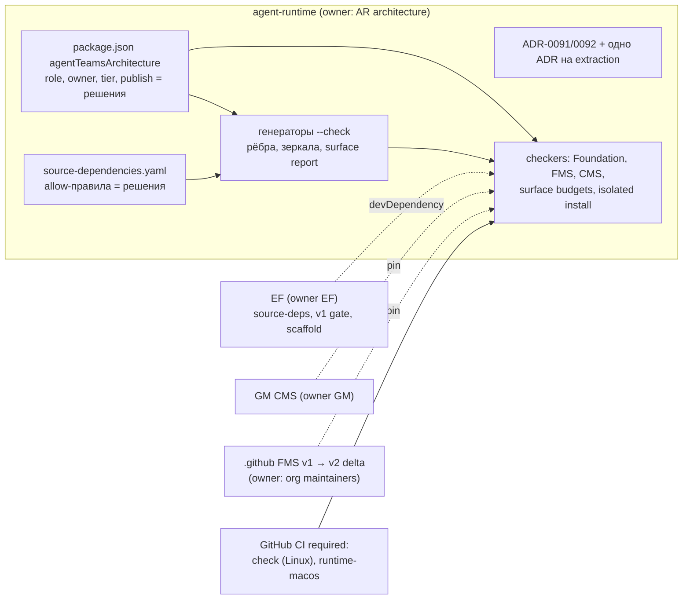
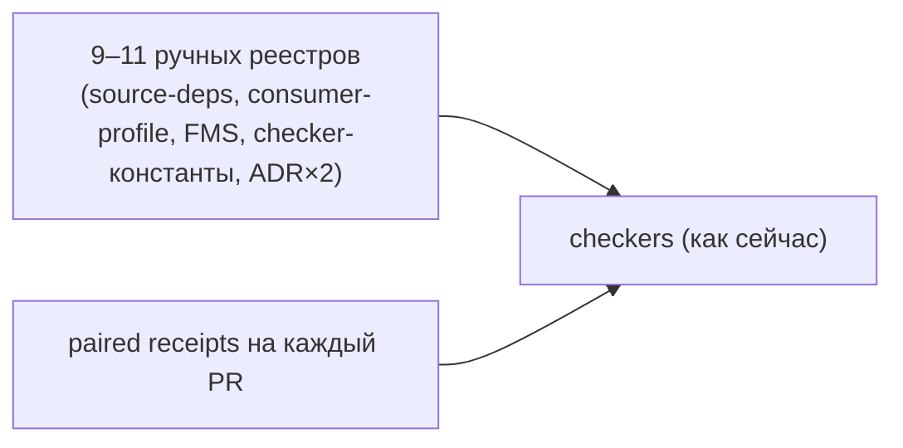
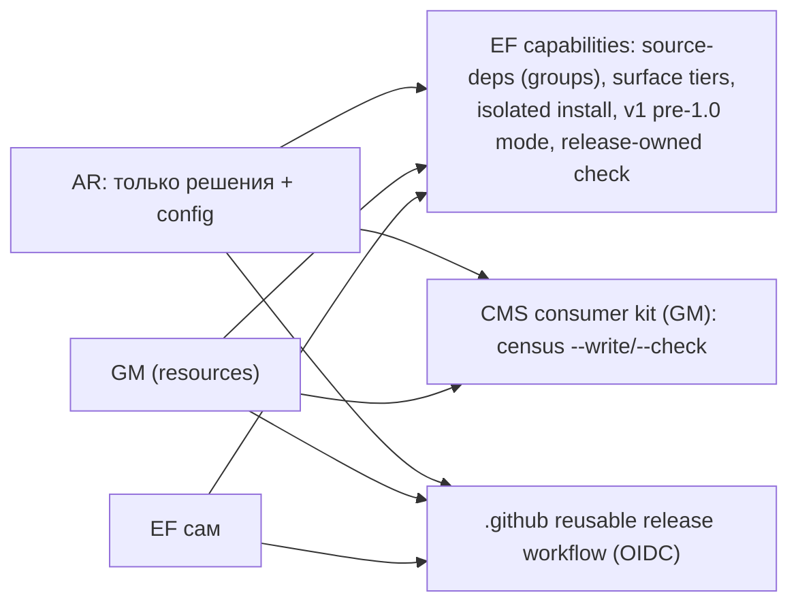

# Раунд 2, критик 3 из 4: governance, гейты, SDK-поверхность и выпуск

- Исполнитель: независимый критик. Роль: `governance-sdk`. Дата: 2026-10-01 (вечер).
- Только анализ. Исходники, manifests, CI, SQL, pins и ADR не менялись; install/build/test/typecheck и provider-запуски не выполнялись. Единственный созданный файл — этот отчёт.
- Snapshots (read-only, `git rev-parse HEAD` проверен мной):
  - `agent-runtime` `b0bcb265d1466da3272078f9dfdb7c6784624283` (через `gh api .../commits/main` подтверждено, что это current main, 2026-09-30T20:30:40Z);
  - `get-modular` `9c722ceff4ede307d06d7a4b63fdebe615f54c53` (current main, открытых PR нет);
  - `dotgithub` `3fe0f135ffc446b3bb174397c6b5783f72a008a2`; PR #328 head `255fa3b2c5cb6c70cba410d2c2d1e52216008772`, OPEN;
  - `engineering-foundation` `b8ec0f17d1b8d6f9b7a45798931715d59a126888`;
  - `openclaw` `510beb8d52bd6be9fea27513b9008a50c92a1d2d`.
- Для истории AR снапшот shallow (84 коммита), поэтому я сделал blobless clone `agent-teams-ai/agent-runtime` в `$SCRATCH/r2-governance-sdk/ar` (origin/main = `b0bcb265`, 493 коммита) и мерил по нему. Оригинальные checkouts пользователя не трогал.

## Реально полученные внешние источники

Веб-поиска не было, `curl` не использовал. Это source critique с точечной проверкой фактов, а не online research.

| Источник | Способ | Что получено |
|---|---|---|
| agent-teams-ai/.github PR #328 | `gh pr view` | head `255fa3b2`, OPEN, updated 2026-10-01T18:09:50Z; в теле: «Published architecture standards, adoption pins and ADRs are unchanged.» |
| agent-runtime ruleset main | `gh api repos/agent-teams-ai/agent-runtime/rules/branches/main` | required checks: `check`, `docs-protocol / docs-protocol-check`, `postgres-durability`. `ar-c0` и `runtime-macos` не required |
| agent-runtime / get-modular main | `gh api .../commits/main` | AR `b0bcb265` (2026-09-30T20:30:40Z), GM `9c722cef` (2026-09-30T08:19:54Z) |
| agent-runtime open PRs | `gh pr list`, `gh api pulls/184/files` | #184 (draft, +61752/−583, 73 файла, из них шесть evidence JSON по ~10k строк), #180 (draft), #72 |
| agent-runtime история | `gh repo clone --filter=blob:none` в scratch | numstat по коммитам, см. §2.3–2.5 |
| get-modular коммиты | `gh api .../commits/461bff0`, `/24d6557` | добавление `lifecycle-kernel`: +680/−19 (13 файлов) и +1292/−43 (32 файла) |
| openclaw коммиты | `gh api .../commits?path=packages/
/package.json&sha=510beb8d`, `.../commits/<sha>` | первые коммиты пакетов: `561cf56c` (workboard-contract), `3ea91155` (tool-call-repair), `cca5b147` (session-url-contract) |
| openclaw дельта | `gh api compare/510beb8d...main` | main = `ccbd3b58` (2026-10-01T18:31:35Z), ahead 55; цитируемые ниже скрипты (`plugin-sdk-surface-report.mts`, `sync-plugin-sdk-exports.mts`, `tsdown.config.ts`, `plugin-sdk-api-diff.mts`) в списке изменённых файлов отсутствуют |
| npm registry | `npm view` | `@agent-teams/agent-execution`, `@agent-teams/embedded-runtime`, `@get-modular/resources`: E404 (не опубликованы); `@get-modular/core` 0.2.0; `@agent-teams/engineering-foundation` 1.7.0; `@changesets/cli` 3.0.3 |

---

## 0. Короткий ответ

**Главная цена модульности в Agent Runtime сегодня не в коде библиотек, а в governance вокруг каждой границы.** Владелец хочет много хорошо декомпозированных библиотек (U2, U4) и гейты только с пользой больше затрат. Сейчас эти цели прямо противоречат друг другу, и причина не только в `check-sdk-growth-profile.mjs`:

1. **Заморозок две, а не одна (VERIFIED).** Кроме SDK-growth enrollment в `pnpm check`, workflow `ar-c0` на каждом PR сравнивает *текущие* байты FMS-профилей и consumer profile с исторической ревизией. Раунд 1 считал `ar-c0` не блокером; это неверно (§2.1). Тот же паттерн есть в GM, и он ударит по `@get-modular/resources` (U5).
2. **Полезная часть SDK-growth (цепочка CMS pin) уже дублируется** в `check-consumer-module-standard.mjs:405-419`. Остальное — история отменённого маршрута или прямой вред (пин EF 1.6.0 блокирует апгрейд EF, §2.2).
3. **Каждый PR, который трогает пакеты, профили, lockfile или ADR-0090, требует пересъёмки paired Linux+Darwin receipts** и замены файла на 4,9 МБ. С 2026-09-12 таких коммитов 100 из 277 (36%). Это крупнейший постоянный налог, и extraction-программа заплатит его на каждом PR (§2.4).
4. **Одна и та же идентичность пакета записана руками в 9–11 местах**, часть — намеренно двойной записью в коде checker-ов. 939 рёбер в `consumer-profile.json` — ручное зеркало живого census. В 10 dev-границах `source-dependencies.yaml` по 53 allow, и каждая из них перечисляет все 41 runtime-границу (§2.3, §2.5).

Моя оценка: новый пакет сегодня стоит **~400–750 строк ручного governance плюс пересъёмку receipts**, и без снятия заморозок его невозможно добавить вообще. У OpenClaw новый внутренний пакет стоит 11–46 строк wiring (§8).

**Рекомендация (вариант 1, «дешёвые границы»):** сначала сделать границу дешёвой, а потом декомпозировать по смыслу, а не по стоимости governance.

- Новый accepted ADR в AR выводит из эксплуатации SDK-growth enrollment и C0 current-state enforcement. Байты C0 и `architecture/sdk-growth/*` не редактируются и остаются историей.
- Один источник правды для идентичности модуля (`package.json` → `agentTeamsArchitecture`) и для пина CMS. Checker-ы читают его, а не держат копии.
- Механические инвентари (рёбра, зеркала границ, export census) генерируются с `--check`. Решения (роль, owner, allow-правила, tier, adopted composition, exceptions) пишутся руками в одном месте.
- Tier-реестр entrypoints, сгенерированный surface report и бюджеты, как у OpenClaw. EF v1 подключать только к опубликованным public-tier пакетам и только после режима «pre-1.0 break = minor + changeset с migration note, без ADR».
- Isolated single-root install для публикуемых пакетов.
- Отдельным решением владельца: снять обязательную пересъёмку receipts и заменить её required CI jobs на Linux и macOS.

После этого собственный governance нового пакета ~40–90 строк плюс сгенерированный diff. Ядро варианта: **3200–4700 changed LOC, из них ~2100–2450 удаления, moves 50–150**. 🎯 7/10 · 🛡️ 8/10 · 🧠 4/10, LOC confidence 4/10. Полная версия с add-ons — §4.

---

## 1. Цели владельца и прошлые гипотезы

**Цели (из контракта раунда 2 и handoff, применительно к моему ракурсу):**
- U1: заморозка SDK-growth заменяема; S3/v3 authority не строим (решение 2026-09-25 в силе).
- U2: library-first; breaking changes допустимы; 0.x → breaking как minor + changelog + migration guide. Но «does not relax minimalism, security or data safety» и «Accepted decisions and pinned standards still change through their successor process» (`eqs-pr328.diff`).
- U3: эволюция версии Codex — первоклассная задача; governance не должен делать bump дорогим.
- U4: строгая модульность — цель; у каждой границы механика, owner, контракт; без service bags.
- U5: `@get-modular/resources` 0.1.0 публикуется сразу; первый потребитель — AR ordinary host и Darwin deployment; та же зона Host/cleanup и обновление CMS pin.
- Общие: гейты только при пользе больше затрат (memory владельца, EQS `engineering-quality-standard.md:59-62` «add abstractions or gates only for a demonstrated risk… no automatic ADR migration, extra approval ritual»); сверка с OpenClaw по фактам.

**Прошлые гипотезы, которые я пересматриваю:**
- Синтез раунда 1, N1 и sdk-foundation §3.3: блокер только `check-sdk-growth-profile.mjs`, а `ar-c0` «**не** блокер». Пересматриваю (§2.1).
- Синтез, вопрос 1: «Заменить спящую заморозку SDK-growth?» как первый вопрос. После U1 это уже не вопрос, но объём шире: есть C0, receipts и двойная запись.
- Налог на пакет 250–450 (libraries) и 300–550 (skeptic). Мой замер выше (§2.3), в основном из-за ADR на активацию, allow-списков и receipts.
- Предложение skeptic «генератор census с `--check`» верно по механике, но упирается в текст CMS, который требует точный инвентарь и запрещает «automatic legacy inventory expansion» (§2.5). Нужна правка CMS, а не только скрипт.
- FMS «hypothetical future consumer» как блокер Codex-клиента. По U2 он не блокер. Кроме того, конфликт уже, чем казалось: существующие строки FMS `DEPENDENCY_LIFECYCLE` и `BOUNDARY` покрывают оба кандидата (§7).

---

## 2. Текущие факты

### 2.1. Заморозок две, а не одна; третья такая же — у GM

**(a) SDK-growth enrollment, в каждом `pnpm check` и `check:fast` (VERIFIED).** `package.json` scripts `check`/`check:fast` содержат `pnpm sdk-growth:profile && pnpm test:sdk-growth:profile && pnpm test:sdk-growth:packed && pnpm test:sdk-growth:source`. Проверка `scripts/architecture/check-sdk-growth-profile.mjs`:
- `:99-104` — набор workspace manifests должен совпасть с замороженным C0 inventory (`SDK_SCOPE_DRIFT`); любой новый пакет ломает check;
- `:152-153` — `assert.equal(actual.private, true); assert.equal(actual.version, "0.0.0");`;
- `:156` — точный `files` (`SDK_PACKAGE_FILES_DRIFT`); `:157` — точный JSON `exports` (`SDK_EXPORT_MATRIX_DRIFT`); `:158` — entrypoints ровно `[".", "./composition"]`;
- `:137-138` — EF ровно `1.6.0` (`SDK_EF_VERSION_DRIFT`). На npm уже 1.7.0, то есть апгрейд EF тоже заблокирован;
- `:20-32`, `:42-52` — захардкожены sha256 шести исторических архивов и двух логов; `:170-176`, `:198-212` — исторический статус «446 strict errors».

**(b) C0 current-state enforcement, workflow `.github/workflows/ar-c0.yml` на каждом PR и push в main (VERIFIED).** `validate-ar-c0.mjs:371-376` вызывает `validateProfileMigrations(...)` и `validateCmsProfileTransition(...)` с `readCurrentBytes`:
- `validate-ar-c0-profile-migrations.mjs:100-103` — любой профиль из C0 inventory, кроме двух делегированных и `ordinary-scope.json`, должен совпадать байт в байт с ретенированной ревизией: «`unrelated frozen profile changed`». В inventory (`contract.json`) это `architecture/feature-module-standard/candidate-profile.json`. Значит, **новый модуль в FMS-профиле ломает `ar-c0`**.
- `:85-98` — `ordinary-scope.json` заморожен, кроме одного вручную закодированного ребра. Его добавил `b0bcb265`: чтобы принять одно новое import-ребро, в validator вписали 20 строк splice-логики.
- `:158-162` — `consumer-profile.json` без `standard` и `relationships` должен совпадать с ревизией `712a3e38`: «`current active profile changed outside delegated CMS and source relationships`». Новая граница, пакет в `packages` (например `@get-modular/resources`), новая composition или смена `fms.sha256` ломают `ar-c0`.
- `validate-ar-c0.mjs:18-19`, `:217-221` фиксирует хэш самого `.github/workflows/ar-c0.yml`.
- **Смягчение (VERIFIED):** `ar-c0` не входит в required status checks (ruleset main: `check`, `docs-protocol / docs-protocol-check`, `postgres-durability`). Блок мягкий: красный workflow на PR и на main, merge технически возможен. Для владельца, который не мёрджит красное, это всё равно блок.
- Раунд 1 процитировал `validate-ar-c0.mjs:437-438` («current production evolution is governed by its owning architecture gates») и сделал вывод «не блокер». Этот комментарий относится к проверке evidence-файлов, а не к `validateContractBytes`, который вызывается раньше (`:234-261` → `:371`).

**(c) Тот же паттерн в GM (VERIFIED), критично для U5.**
- `get-modular/architecture/checks/sdk-growth.mjs:151` — `same(activeNames, PACKAGES…, "v1 package scope")`: набор пакетов под EF v1 ровно `[assembly, core]`. `@get-modular/resources` нельзя поставить под v1-гейт без правки этого файла.
- `:36` — EF ровно `1.5.1`; `:181` — baseline ровно `0.2.0`.
- `get-modular/tests/ownership-checkpoint.test.mjs:148-151` — `policy.packageRoots` ровно `assembly`, `core` и опционально `lifecycle-kernel`. Запускается как `precheck` (`package.json:18`). Дизайн ресурсов сам это признаёт (`plans/module-resource-scopes-design-2026-10-01.md`, §14 п.4).

### 2.2. Что в SDK-growth полезно, что история, что вред

| Проверка | Где | Классификация | Почему (evidence) |
|---|---|---|---|
| Цепочка CMS pin: review → delta → pin → байты evidence | `check-sdk-growth-profile.mjs:119-129` | **Полезна, но дублируется** | `check-consumer-module-standard.mjs:405-419`: pin пассивного профиля равен pending-профилю, `sha256` retained-байтов равен pin, `validateStandardMigration(...)`. Плюс `check-get-modular-adoption.mjs:59-60` |
| Исторические звенья (`sdk-growth-standard-review.json` → `a3-cms-pin-review.json`) | `:112-118`, `:122-125`, `:130-133` | История | Проверяют связность старых review-файлов, не текущий pin |
| `private: true`, `version: "0.0.0"` | `:152-153` | Частично полезна | Защищает от случайной публикации. Заменяется флагом `publish` в реестре модулей |
| Точный набор пакетов, `exports`, entrypoints, `files`, `bin` | `:99-104`, `:154-158` | **Вред** | Блокирует любой новый пакет или subpath; ценность «не дать неревьюенному дрейфу» дублирует ревью, которое владелец 2026-09-25 признал достаточной защитой |
| EF 1.6.0, tarball, integrity, commits | `:55-64`, `:137-144` | **Вред** | Блокирует апгрейд EF |
| sha256 архивов и логов `ef160-pack-run-*.txt` | `:17-52` | История; **вводит в заблуждение** | `sdk-growth:pack` не входит ни в `check`, ни в CI-workflows (VERIFIED по `package.json` и `.github/workflows`). Хэши описывают архивы `5a9eb460`, а не текущие: зелёная проверка не означает текущую квалификацию |
| Статусы typed observation, 446 ошибок, authority not-invoked | `:163-216` | История | Маршрут отменён: «The owner decided not to build the host» (EF `public-api-compatibility.md:63-64`) |
| Самопроверка wiring (`SDK_ENFORCEMENT_MISSING_OR_NOOP`) | `:227-235` | Низкая ценность | EF сам принимает: «replace the consumer command with a no-op. None of these fails automatically. Each one is visible in the diff, and review has to catch it» (`public-api-compatibility.md:72-77`) |
| Хелперы packed-проверки: `assertPackedSdkArchive`, `assertPublicImports`, `assertPrivateDeepPathsRejected` | `qualify-sdk-packages.mjs:30-67` | **Полезны, переиспользовать** | Проверяют, что цели exports есть в архиве, `src/` не утёк и deep private paths отвергаются в runtime и в types. Это основа isolated install (§5) |
| Подключение сторонних deps из checkout | `qualify-sdk-packages.mjs:136-139` | Вред для честности | Не доказывает самостоятельную установку (согласен с раундом 1) |
| Сборщик `scripts/sdk-growth-source/*` (1010 строк, 7 файлов) + FMS tooling profile + 3 границы | `package.json` `test:sdk-growth:source`; `architecture/feature-module-standard/sdk-growth-source.json` | История | Собирал source evidence для отменённого A3 |

**Как оформить замену, не нарушая «The frozen C0 contract is not edited» (EF `public-api-compatibility.md:69-70`).**
- VERIFIED: эта фраза относится к C0-контракту EF (`foundation:sdk-growth:c0:5/6`, `engineering-foundation/docs/reference/sdk-growth-c0.md`). AR C0 — отдельный артефакт `ar-c0-c0dc683e-r3`.
- VERIFIED: в `architecture/decisions/accepted-decisions.json` AR нет ни одного ADR об SDK-growth. Enrollment введён коммитом `712a3e38`, а `decisionId: "AR-SDK-ROOT-001"` в `metadata-root.json` — не ADR. Поэтому принятые байты ADR править не нужно.
- Моё предложение: новый ADR в AR, условно «ADR-0091 Retire SDK-growth enrollment and C0 current-state enforcement». Он:
  - ссылается на решение 2026-09-25 (EF `public-api-compatibility.md:51-70`) и на EQS #328;
  - фиксирует, что `architecture/c0/ar-owned-lifetime/*` (sha `4c88c378…`) и `architecture/sdk-growth/*` остаются неизменными историческими байтами. Их разрешённые потребители из `identity.json` («AR C0 validation and orchestrator review», «EF S1 surface-matrix input», «AR A3 SDK planning (activation pending)») закрыты решением 2026-09-25;
  - фиксирует, что `activation.json` pending-шаги отменены, а не выполнены;
  - удаляет validators и workflow, перечисляя по именам, что и где осталось в истории;
  - добавляет README-маркер в оба каталога.
- GM делает то же для своего C0 ownership/K1 в ADR ресурсов (Q7 дизайна). Паттерн одинаковый, это хорошо.

### 2.3. Полный налог на пакет: где одна и та же идентичность записана руками

| # | Реестр | Что дублирует | Evidence (VERIFIED) |
|---|---|---|---|
| 1 | `pnpm-workspace.yaml` globs | — (единственный автоматический) | `packages/apps/*`, `contexts/*`, `platform/*` |
| 2 | `architecture/foundation/source-dependencies.yaml` (3013 строк) | `packageRoots`, `governedRoots`, по 2–4 границы на пакет | 61 граница (41 runtime, 20 development); у `filesystem-custody` 4 границы, 62 упоминания |
| 3 | 10 dev-границ в том же файле | Список «можно всё»: по 53 allow, каждая перечисляет все 41 runtime-границу | 530 из 630 allow-строк (84%). Новая production-граница = +1 строка в каждый из 10 списков; новый пакет = ещё одна 53-строчная граница. В схеме EF v3 нет групп: `allow` = `boundaries/packages/builtins/runtimeReferences` (`architecture-source-dependencies/v3.schema.json`) |
| 4 | `architecture/get-modular/consumer-profile.json` (6302 строки) | `productionRoots`, `sourceCensus`, 41 граница (зеркало id/roots/entrypoints из #2), **939 рёбер** | `check-get-modular-adoption.mjs:76-91` требует равенства с #2; `get-modular-source-census.mjs:80-86` требует точного равенства рёбер живому census. Write-режима нет. ~4695 строк — рёбра; 10 уникальных rationale и 2 уникальных reviewTrigger на 41 границу |
| 5 | `architecture/feature-module-standard/candidate-profile.json` (828) | `productionModules`, `productionRoots`, `moduleRoots`, `abstractLayout`, `moduleEdges`, features | Заморожен `ar-c0` (§2.1); его sha продублирован в `consumer-profile.json` `fms.sha256` (`check-get-modular-adoption.mjs:72`) |
| 6 | `scripts/architecture/feature-module-profile.mjs:62-73` | Тот же список модулей **в коде checker-а** | Комментарий `:62-65`: «The JSON profile must match this reviewed registry, so widening the governed tree is a reviewed source change and never a silent profile edit.» `:59` `CURATED_EXPORT_SET = [".", "./composition"]`; `:369` |
| 7 | ADR на владельца и на активацию модуля | Для каждого модуля | ADR-0017:85-89 «Activating any pending module… carries its own accepted authority. Editing the profile alone cannot do it, because the reviewed registry in `scripts/architecture/feature-module-profile.mjs` must agree.» ADR-0019:31-33 |
| 8 | `architecture/foundation/scaffold-targets.yaml` + `scaffolding.yaml` | Каталог пакетов | Допущена только роль `bounded-context` (`scaffolding.yaml` `targetRoles`); для `platform` нужна новая composition |
| 9 | `package.json` → `agentTeamsArchitecture` | role, ownerDocument | FMS checker сверяет (`feature-module-workspace.mjs:60-62`) |
| 10 | SDK-growth `profile.yaml` + C0 inventory | Набор пакетов и exports | Заморожено (§2.1) |
| 11 | Packed-тест пакета | Свой стиль в каждом пакете | 68–332 строки, всего 1370 (`packages/*/*/tests/package/*packed*`, `curated*`). Тест `filesystem-custody` импортирует `../../dist/*`, а не установленный tarball |
| 12 | Paired L0 receipts | Цифровая сводка всех входов | §2.4 |

**Замеры по истории (VERIFIED, numstat по blobless clone; категоризация по путям моим скриптом, точность ±10%).**

- `b0bcb265` («retain cleanup custody after failed construction»), 36 файлов, +1315/−135:
  - production src 137 changed, тесты продукта 359;
  - governance (`architecture/**` и `scripts/architecture/**` с тестами) 713, из них ~489 — копии CMS (363 строки `consumer-module-standard-ac49bb33.md`, 32 delta текущей копии, 50 `.diff`, 44 review JSON);
  - docs 130 и receipts 108 строк, но **8,8 МБ diff-байтов** (`git diff … | grep '^[-+]' | wc -c` = 8 848 633).
  - Один bump CMS pin затронул 5 checker-ов и 4 теста: `consumer-module-standard-pin.mjs` (+16/−16), `check-sdk-growth-profile.mjs`, `validate-ar-c0*.mjs`, `check-consumer-module-standard.mjs`, `check-get-modular-adoption.test.mjs`.
  - Одно новое import-ребро потребовало +5 строк в `consumer-profile.json`, +5 в `ordinary-scope.json` и +20 строк splice-логики в C0 validator.
- Активации уже готовых пакетов, почти чистое governance:
  - `3193051f` runtime-configuration — 201 changed: ADR 80, профили 69, docs 43;
  - `ab9a942a` runtime-security — 347: ADR 88, профили 106, docs 136;
  - `e82eb508` host-app — 1991: профили 806, скрипты 193, ADR 109, docs 220, prod 540 (в основном переносы).
- С 2026-09-16 по first-parent diff (14 090 changed): prod src 4401, тесты продукта 1846, governance-скрипты 3304, профили 1101, evidence-копии 2233 строки (по байтам — много больше), docs 719. **Governance и evidence ≈ 47% changed-строк.**
- Размеры: `scripts/architecture` 13 453 строки, `architecture/**/*.json|yaml` без evidence 14 026, production src 99 402, тесты пакетов 129 238.
- Для сравнения GM (VERIFIED через `gh api`): `lifecycle-kernel` добавлялся двумя коммитами. `461bff0` (+680/−19) — всё governance: ADR 151, architecture 253, gov-тесты 260. `24d6557` (+1292/−43): src 204, тесты пакета 275, README/manifest 334, governance 489+. **Примерно 6 строк governance на строку исходника.**

**Моя смета налога на новый platform-пакет (например `process`) в AR сегодня** (ASSUMPTION по реестрам выше; LOC confidence 5/10):

| Статья | Строк |
|---|---:|
| `package.json`/`tsconfig`/README/`index.ts` | 120–180 |
| source-dependencies: production-граница ~20, test-граница ~60 (53 allow), +1 строка в 10 списков, roots | 90–130 |
| consumer-profile: roots, census, 1–2 границы, 10–30 рёбер по 5 строк | 60–170 |
| FMS candidate-profile + запись в `feature-module-profile.mjs` + scaffold-конфиг | 50–90 |
| ADR владельца (successor к ADR-0017) + ADR активации (как ADR-0019, 93 строки) | 140–210 |
| Packed-тест пакета | 70–150 |
| Пересъёмка receipts и ветка в capture-workflow | ~100 длинных строк, мегабайты |
| **Итого** (без кода и смысловых тестов) | **~400–750 + receipts** |

И это при условии, что SDK-growth и C0 уже сняты. Сегодня шаг невозможен.

### 2.4. Paired L0 receipts: налог на каждый PR

- VERIFIED: `pnpm check` → `architecture:runtime-setup-l0-evidence` → `runtime-setup-l0-evidence.mjs:461-513`. Профиль active, поэтому вызывается `checkV2` (`runtime-setup-l0-evidence-v2-capture.mjs:184-205`). Если identity receipt отличается от текущей, вызывается `validateRetainedReceiptCompatibility` (`:78-107`). Он требует совпадения sha256 **каждого** входа, кроме release-age полей `pnpm-workspace.yaml`: «`receipt input digest mismatch: ${before.path}`».
- Входы (`runtime-setup-l0-evidence-v2-inputs.mjs:9-75`): **корни всех шести пакетов целиком**, `architecture/get-modular`, `architecture/feature-module-standard`, `architecture/consumer-module-standard`, `package.json`, `pnpm-lock.yaml`, `source-dependencies.yaml`, `accepted-decisions.json`, ADR-0013/0015/0017/0090 и другие.
- Следствие (вывод из кода, VERIFIED): любое изменение в пакетах, профилях, lock или этих ADR валит required `check`, пока не сняты новые receipts на Linux x64 и Darwin arm64 и не закоммичен новый `docs/spikes/runtime-setup-assembly-adoption-v2-evidence.json` (4 877 224 байт).
- Capture-workflow `.github/workflows/adoption-receipt-linux.yml:1-6` — «Temporary workflow… Safe to delete once the receipt has been captured and merged». Срабатывает на push в 66 явно перечисленных веток.
- История: с 2026-09-12 **100 из 277** не-merge коммитов main трогали receipts или список веток (36%). Сообщения вида «refresh paired L0 evidence» (`c9b8efe4`, `8856c7d0`, `ffbaec9a`, `4ffb329d`). Открытый PR #184 добавляет ещё 58 562 строки evidence JSON.
- Что это доказывает: что у конкретного SHA прошёл `pnpm --filter @agent-teams/embedded-runtime check` на двух ОС (`runtime-setup-l0-evidence.mjs:284-303`). То же каждый PR даёт GitHub CI: `check` (Linux) и `runtime-macos` (`pnpm product:check` на macOS, `ci.yml:215-246`). Сейчас `runtime-macos` не required.
- ADR-0015 «Consequences» требует «authenticated current construction evidence». Формы committed-blob оно не требует. Required CI jobs на PR head аутентифицированы самим GitHub. Это моя интерпретация, решает владелец.
- Связь с U3: каждый bump Codex меняет корень AE и, значит, требует пересъёмки.

### 2.5. Двойная запись и что CMS требует сам

- **Pin CMS захардкожен минимум в пяти местах (VERIFIED):** `consumer-module-standard-pin.mjs:7-22`, `check-consumer-module-standard.mjs:35-36`, `validate-ar-c0-profile-migrations.mjs:27-42` (+ `validate-ar-c0.mjs:379-389`), `consumer-profile.json` `standard`, `contained-turn-profile.json`. Плюс текущий review JSON и retained-копия документа. По EQS DRY (`engineering-quality-standard.md:110-120`) нужен один авторитетный источник; остальные должны читать его.
- **`EXPECTED_PROFILE` в `check-consumer-module-standard.mjs:21-104`** — полная копия `contained-turn-profile.json`, сравнение `deepEqual` (`:405-406`).
- **CMS сам требует точный инвентарь рёбер (VERIFIED, `get-modular/docs/architecture/common-assembly.md:146-152`):** «Exact existing legacy boundaries and direct relationships, marked `not-adopted`… No wildcard, blanket directory exemption or automatic legacy inventory expansion.» И `:159-160`: «New cross-module or replaceable relationships inside a legacy boundary require current adoption or an exact accepted exception.» Генератор с `--write`, который молча принимает новые рёбра, можно прочитать как запрещённое «automatic legacy inventory expansion». Поэтому генерация требует одной фразы в CMS: «сгенерированный инвентарь с закоммиченным diff — это ревью, а не автоматическое расширение». CMS всё равно правится для ресурсов (U5), так что это можно сделать в той же ревизии.
- **82% рёбер — contained-turn (VERIFIED моим скриптом):** из 939 рёбер 770 касаются contained-путей и не касаются ordinary, 93 касаются ordinary, 76 прочих. После удаления legacy contained инвентарь естественно сожмётся в разы.

### 2.6. Публичная поверхность

- VERIFIED моим подсчётом: AE `./composition` = 172 values / 760 types (`packages/contexts/agent-execution/src/composition.ts:5`). Embedded-runtime импортирует его в 21 выражении. Цифра «Host использует 38 values» — раунд 1 (sdk-foundation), я её не перепроверял.
- VERIFIED: `runtime-access.ts:231-233`: `executionProfile?: "user-session-v1"`, `effectClass?: "ordinary_user_session_effect"`, `capabilityManifestRevision?: "ordinary-codex-macos-arm64-0.153.4-v1"`. `:290`: `readonly containedTurn: RuntimeContainedTurnAccess;`.
- VERIFIED: `./host` заблокирован не только SDK-growth (`:157`). Его не пропустит и FMS checker (`feature-module-profile.mjs:59`, `:369`), и текст ADR-0017:64-66: «drawn from the two recognized assembly entries `.` and `./composition`». Нужен successor к этому пункту ADR-0017.
- VERIFIED: AE census `testing-subpath-packed-consumer.test.ts:11-…` (`BASE_COMPOSITION_RUNTIME_EXPORTS`, «The immutable base census is an independent compatibility oracle») держит 172 имени, включая `CODEX_APP_SERVER_BINARY_SHA256` и другие Codex-константы.

### 2.7. Версии и выпуск

- VERIFIED EF v1 (`public-api-compatibility.md:112-121`): «before `1.0.0`, breaking changes require a minor bump»; «a breaking change also requires an exact SHA-256 fingerprint and an approval reference to a currently accepted ADR». И `:205-209`: «A consumer must therefore install an equivalent release-owned mutation check in required PR CI before enabling this capability… other consumers remain unqualified for activation». То есть при активном v1 **каждый break требует accepted ADR**. EQS:61-62 прямо говорит, что приоритет качества не вводит «extra approval ritual»; ADR на каждый break в 0.x — именно такой ритуал, и он противоречит духу EQS #328 («breaking change as a minor release… changelog entry and a migration guide»).
- VERIFIED: `.changeset/config.json` в GM и EF — `"fixed": []`, у GM ещё `"linked": []`. В AR только `.changeset/.gitkeep`.
- VERIFIED: GM публикует без release workflow (`.github/workflows`: `ci.yml`, `m3-runtime-matrix.yml`, reviewrouter), хотя у GM есть `release-owned-files.mjs` (362 строки), который разрешает менять baseline только на `changeset-release/main`. У EF полный конвейер: `release.yml` 993 строки + `npm-package-bootstrap.yml` 319 + скрипты. Это trusted publishing через OIDC (`id-token: write`, `vars.NPM_TRUSTED_PUBLISHING_ENABLED`). Копировать 2100 строк в каждый репозиторий — анти-DRY.
- VERIFIED: в changelog GM 0.2.0 единственное minor-изменение — «Establish a new versioned API evidence point for Core and Assembly while retaining the historical 0.1.0 baseline erratum» (`packages/core/CHANGELOG.md`). Мой вывод (ASSUMPTION): ведение v1 baseline уже потребовало у GM отдельной работы на уровне релиза.
- VERIFIED: workspace `AGENTS.md:43-53` (изменён 2026-10-01 21:04): «For placement, this direction takes precedence over consumer-first incubation; the second-consumer rule above limits claims of a stable SPI, not where the code lives.» Секция ограничена `@get-modular/*`, а AR пакеты — `@agent-teams/*`.

---

## 3. Что генерировать, объединять, удалять и оставлять

Принцип взят из EQS (`engineering-quality-standard.md:117-120`): «Generate mechanical representations from their one authority, but do not generate both a decision and its expected answer from the same implementation and call that independent evidence.»

- **Решения** (роль модуля, owner, allow-правила, tier entrypoint, adopted composition, exceptions) — руками, в одном месте.
- **Механика** (наблюдаемые рёбра, зеркала решений, export-списки) — генератор с `--check`; diff остаётся видимым в PR.

| Артефакт | Сейчас | Предложение | Обоснование |
|---|---|---|---|
| `check-sdk-growth-profile.mjs` + test (469) | Заморозка в `check` | **Удалить** (ADR-0091), байты `architecture/sdk-growth/*` оставить как историю с README | §2.2: полезная часть дублируется в CMS checker |
| `validate-ar-c0*.mjs` (1108) + `ar-c0.yml` (47) | Заморозка текущих профилей | **Удалить** (ADR-0091), `architecture/c0/**` не редактировать | §2.1 (b); git-история и так неизменяема |
| `scripts/sdk-growth-source/*` (1010) + FMS tooling profile + 3 границы | Тесты в `check` | **Удалить** отдельным PR | Инструмент отменённого A3 |
| `qualify-sdk-packages.mjs` | Хелперы + неизолированная установка | **Оставить хелперы `:30-67`, заменить установку** на isolated single-root | §5 |
| Паттерн «ещё одна retained-копия CMS при каждом bump» | +363 строки в `b0bcb265` | **Прекратить**: одна текущая копия по фиксированному пути + delta diff; старые копии не удалять | Требование вносил только C0 validator (`validate-ar-c0.mjs:385-389`) |
| Pin CMS в ≥5 местах | Hardcode | **Объединить**: источник — review JSON (или `consumer-profile.json` `standard`); `consumer-module-standard-pin.mjs` проверяет связность, а не держит константы | EQS DRY |
| `EXPECTED_PROFILE` (`check-consumer-module-standard.mjs:21-104`) | Полная копия профиля | **Удалить копию**; проверять схему, живой census и пины из единого источника | Защищает от «тихой правки JSON», но JSON-diff так же виден в ревью; решение 2026-09-25 принимает ревью как защиту |
| `REVIEWED_PRODUCTION_MODULES`, `CURATED_EXPORT_SET` (`feature-module-profile.mjs:59-73`) | Копия списка модулей и exports в коде | **Удалить**; источник — `package.json` → `agentTeamsArchitecture` + реальный `exports` | Тот же аргумент; плюс `./host` |
| `consumer-profile.json` `relationships` (939 рёбер), `sourceCensus`, зеркала id/roots/entrypoints | Ручное равенство живому census | **Генерировать** (`get-modular-source-census.mjs --write/--check`) | Нужна фраза в CMS (§2.5) |
| `consumer-profile.json` `owner/status/rationale/reviewTrigger` | 41 × повтор (10 уникальных rationale) | Оставить как решения; по желанию — ключ на общий текст | Решения, не механика |
| `ordinary-scope.json` `compositionDependencies` | Ручное равенство наблюдаемому (`check-ordinary-feature-scope.mjs:105-116`) | **Генерировать** | Механика |
| `candidate-profile.json` `productionModules/productionRoots/moduleRoots/abstractLayout` | Руками | **Генерировать** из `package.json` (`--check`); features/edges оставить решениями | Механика |
| `source-dependencies.yaml` allow-списки 10 dev-границ (530 строк) | Руками | **EF-1**: группы allow (например «все runtime-границы») в схеме EF; до этого — оставить | Shared-first, owner EF (§9) |
| `source-dependencies.yaml` границы production и entrypoints | Руками | **Оставить** | Это настоящая политика; именно она защищает core от `fs`/`network`/SDK (AR `AGENTS.md`) |
| AE census `BASE_COMPOSITION_RUNTIME_EXPORTS`, regex в `embedded-runtime/tests/package/public-api.test.ts`, in-memory Extractor в PA/RS | Три стиля | **Объединить** в один surface report: имена для public/host tier, только счётчики для workspace-internal | DRY знания «что публично» |
| Packed-тесты пакетов (1370 строк, 6 стилей) | Свои в каждом пакете | **Объединить** в один harness + 5–15 строк декларации на пакет | DRY |
| Paired L0 receipts как условие каждого PR | `checkV2` | **Отдельное решение владельца**: заменить required CI jobs `check` и `runtime-macos`; файл 4,9 МБ — история | §2.4 |
| ADR на владельца + ADR на активацию каждого модуля (ADR-0017:85-89) | По два ADR на модуль | **Одно ADR на программу extraction**, где перечислены модули и их роли | Решение остаётся явным, ритуал уходит |

---

## 4. Мой выбор: три варианта

Это варианты именно governance-программы. Они не заменяют выбор состава runtime-библиотек (этим заняты другие критики), но определяют, сколько стоит каждая граница. API-1 (`operations` / `./host` / Codex-литералы) я считаю отдельной lane из пакетной программы (700–1300 changed по раунду 1) и в мои суммы **не включаю**, чтобы не считать дважды.

LOC = additions + deletions, включая tests/docs/gates/ADR. Moves считаются отдельно. Сгенерированные файлы в changed не входят, но указываются.

### Вариант 1 (Recommended): «дешёвые границы»

Владельцы ресурсов здесь: AR владеет решениями и генераторами; EF — схемами и общими capability; GM — текстом CMS; `.github` — FMS. Ни один checker не держит копию чужого решения.

| PR | Содержание | Changed | из них del | Moves |
|---|---|---:|---:|---:|
| G0a | ADR-0091 + retire C0 current-state: удалить `validate-ar-c0*.mjs`, `ar-c0.yml`; README-маркеры | 1250–1400 | ~1155 | 0 |
| G0b | Retire SDK-growth enrollment: удалить check+test; убрать `sdkGrowth` из двух профилей, схемы, `EXPECTED_PROFILE` и пин-проверки; scripts; README-маркер; docs | 600–750 | ~480 | 0 |
| G1 | Единый источник: `agentTeamsArchitecture` (role/owner/tier/publish) читают FMS checker и scaffold; пин CMS — один источник; убрать `EXPECTED_PROFILE`/`REVIEWED_*`; ADR-0092 (successor к пунктам ADR-0017 об export set и reviewed registry) | 500–950 | 150–300 | 0 |
| G3 | Tiers + сгенерированный surface report + бюджеты; упростить AE census и regex-тест | 600–1100 | 200–300 | 0–50 |
| G4 | Isolated single-root install для пакетов с `publish` (хелперы `qualify-sdk-packages.mjs:30-67`) | 250–500 | 100–200 | 50–100 |
| **Ядро** | | **3200–4700** | **~2100–2450** | **50–150** |
| G0c (решение владельца) | Снять receipts как условие PR: удалить v2 capture/check (1180) + capture-workflow (227); ADR-0093 (successor к формулировке evidence ADR-0015, без правки байтов); владелец делает `runtime-macos` required (настройка, не код) | 1500–1700 | ~1400 | 0 |
| G2 | Генерация census и `compositionDependencies`; фраза в CMS идёт в ревизии CMS для ресурсов (GM +10–30) | 300–600 | 0–100 | 0 |
| G0d | Удалить `scripts/sdk-growth-source/*`, FMS tooling profile, 3 границы | 1100–1250 | ~1100 | 0 |
| EF-1 (EF) | Группы allow в source-deps (аддитивно) | EF 150–300; AR-адаптация 500–600 (−530) | | 0 |
| EF-2 (EF) | Режим v1 «pre-1.0 break = minor + changeset с migration note, без ADR» | EF 150–300 | | 0 |
| FMS-v2 (`.github`) | Delta-successor `LIBRARY_FIRST` (§7) | 100–180 (+ пины AR 40–80, GM 30–60 внутри CMS-PR) | | 0 |
| G5 (при первой публикации) | `.changeset/config.json`, политика changeset, лёгкий OIDC release workflow (переиспользовать org), publish-поля manifest, EF v1 для public tier | 300–700 | | 0 |

- **Весь вариант 1 без G5:** AR **6600–8850 changed, из них ~5100–5600 удаления**; EF/`.github`/GM — 410–810; moves 50–150.
- 🎯 7/10 (уверенность) · 🛡️ 8/10 (надёжность) · 🧠 4/10 (сложность сопровождения после реформы). LOC confidence 4/10.
- **Даёт:** новый пакет ~40–90 строк собственного governance (запись в catalog 10–15, граница 15–25, декларация install 5–10, ссылка в ADR программы) плюс сгенерированный diff. Bump CMS pin — одна правка источника и одна delta. PR без пересъёмки receipts (если принят G0c). Bump EF и Codex без побочных заморозок.
- **Не даёт:** проверку сигнатур типов до публикации (её даст EF v1 на public tier); защиту от неревьюенного merge (сознательно, как решено 2026-09-25).
- **Почему сначала это, а не пакеты:** пакетная программа раунда 1 — 5–7 PR и 2–3 новых пакета. Одни только пакеты сегодня стоят ~800–2250 строк налога (по 400–750), к этому — пересъёмка receipts на каждом из 5–7 PR и ~300–500 строк на каждый bump CMS pin (`b0bcb265`). После варианта 1 те же пакеты стоят ~80–270. Дальше каждая граница дешевле, и это прямо служит U2/U4.

### Вариант 2: минимальная разморозка

G0a + G0b, всё остальное как сейчас.

- **1850–2150 changed (~1635 удаления), moves 0.**
- 🎯 8/10 · 🛡️ 7/10 · 🧠 7/10. LOC confidence 6/10.
- Самое безопасное и быстрое: новые пакеты и subpath становятся *возможны*. Но каждый стоит 400–750 строк и пересъёмку. 2–3 пакета и API-1 — это ещё ~1000–2500 строк чистого governance плюс пересъёмка receipts на каждом PR. Противоречит предпочтению владельца «польза > затрат».

### Вариант 3: общая governance-платформа в EF

Вариант 1, плюс общие механизмы переезжают в общие capability:
- EF-3: isolated install как capability, 300–500;
- EF-4: экспорт release-owned mutation check как consumer command, 100–250. EF сам называет это условием активации v1 для других consumer-ов: «Until Foundation exposes that check as a reusable consumer command…» (`public-api-compatibility.md:207-209`);
- consumer-checker kit CMS с генерацией census, 400–800 (owner GM или EF);
- reusable release workflow в `.github`, 150–300.

- Сверх варианта 1: shared +950–1850; локальный код AR −200..−400.
- 🎯 5/10 · 🛡️ 8/10 · 🧠 5/10. LOC confidence 3/10.
- Оправдан, когда тот же налог реально мешает второму репозиторию. GM с `@get-modular/resources` — первый кандидат: его заморозки те же (§2.1 c). Риск — EF превращается в «universal manager» governance; держать каждую capability узкой и с двумя потребителями (AR + GM).

**Не входит ни в один вариант** (зависимость программы ресурсов): разморозка GM. Нужна при любом варианте, если resources ставится под v1 или в `packageRoots`. Примерно 900–1100 changed, в основном удаления: `sdk-growth.mjs` 295, `tests/sdk-growth.test.mjs` 145, три qualification-скрипта 427, правка `ownership-checkpoint.test.mjs:148-151`.

---

## 5. Политика версий и выпуска (EQS #328)

**Предлагаемое правило:**

1. **Версии.** 0.x до явного решения о стабильности; break — minor; patch — без изменения контракта. Ровно как EQS #328 и EF `public-api-compatibility.md:116`. Changesets независимые (`fixed: []`), как в EF и GM. `fixed`/`linked` — только для пакетов с общей номинальной идентичностью, которые всегда ставятся вместе.
2. **Содержание changeset.** У break-minor в changeset обязательны два абзаца: «Breaking» (что и **почему новая форма лучше**) и «Migration» (как перейти). Это текст EQS #328. Отдельный linter не нужен: проверка встраивается в EF-2 (гейт видит break и требует такой changeset).
3. **API break ≠ break persisted-формата.** EQS #328: «Persisted user data, durable recovery state and in-flight work still need a safe migration.» Изменение формата store, operation state или recovery receipts даже в 0.x требует плана cutover с инвентаризацией реальных записей. Migration guide этого не заменяет. Для ordinary v3 → v1 это отдельная lane (раунд 1, §5 синтеза).
4. **Когда публиковать.** Пакет публикуется (0.1.0), когда выполнено четыре условия:
   - isolated single-root install проходит;
   - есть public-tier surface report;
   - один реальный потребитель интегрирован в той же поставке (AE binding) и есть disposable TEST-проект (EQS #328);
   - есть changeset.
   Внешнего потребителя ждать не нужно: это последовательно с решением владельца о `@get-modular/resources` (Q6 дизайна). Authority-пакеты (PA, RS, Host) не публикуются; tier по умолчанию `private`.
5. **Механика выпуска.** Первая публикация пакета — интерактивное подтверждение владельца (workspace `AGENTS.md`, «npm interactive confirmation»). Дальше — trusted publishing через OIDC, как в EF (`release.yml`: `id-token: write`, `vars.NPM_TRUSTED_PUBLISHING_ENABLED`). Не копировать 2100 строк конвейера EF; вынести reusable workflow (вариант 3) или держать лёгкий Changesets + OIDC (~60–120 строк). Это ASSUMPTION: облегчённую версию на AR я не проектировал детально.
6. **Роль EF v1 при «breaking OK».**
   - Полезное: (a) закрытость над `exports`; (b) видимый baseline-diff; (c) проверка, что bump соответствует изменению. Это прямо реализует EQS #328.
   - Конфликтное: (d) accepted ADR и fingerprint на каждый break (`:119-121`) — ритуал; (e) release-owned baseline требует release-ветки Changesets и отдельного mutation check (`:205-209`).
   - Рекомендация. AR: v1 сейчас **не активировать**. Активировать для public-tier пакетов при первой публикации и только после EF-2. До этого — сгенерированный surface report и ревью, как api-diff у OpenClaw. GM: v1 оставить, при первом break в resources перейти на EF-2.
   - 🎯 7/10 · 🛡️ 7/10.
7. **Минимальный честный набор** (аналог OpenClaw):
   - isolated install одного root с объявленным closure и отказом private deep paths (runtime + types);
   - tier-реестр + surface report;
   - бюджеты по tier;
   - changeset с migration note.
   Больше ничего обязательного.

**Единицы публикации (если пакетная программа их создаст):**

| Единица | Почему самостоятельна | Owner | Обещает | Не обещает | Deps | Эволюция |
|---|---|---|---|---|---|---|
| `@agent-teams/process` (условно) | Механизм child/pipes/signals/bounded bytes нужен AE, PA auth capture и будущему Claude sync; library-first (U2) | AR platform | Один физический владелец; bounded bytes; раздельные факты exit/EOF/группы/uncertain | Authority, claim, recovery, sandbox, Windows, framing | только `node:*` | 0.x; break → minor + guide; публикация по п.4 |
| `@agent-teams/codex-app-server` (условно) | Протокол Codex обновляется независимо (U3: 13 релизов за 26 дней по раунду 1) — FMS `DEPENDENCY_LIFECYCLE` | AR Codex integration | Framing, RPC correlation, decode событий для **объявленного диапазона** версий Codex | Процесс, retry `turn/start`, sessions | `node:*` | Новый диапазон Codex: minor, если ломает API клиента, иначе patch. Версия Codex — данные диапазона, не SemVer пакета |
| `@agent-teams/embedded-runtime` | Host | AR Host | `./host` + root types (`operations`) | Замену компонентов (ADR-0090:76-78) | весь граф | Не публиковать, пока нет решения ADR-0008:72-75 |
| `@get-modular/resources` | Решение владельца (U5) | GM | Scope tree, LIFO, single-flight close, отчёт о долге | Policy (дедлайны, retry), изоляцию недоверенного кода | 0 | 0.1.0 сразу; EF v1 после EF-2 |

---

## 6. Публичная поверхность и порядок

1. **`containedTurn` → `operations`, curated `./host`, имя passive factory, удаление Codex-литералов из view** (`runtime-access.ts:231-233` → opaque `profileRef?: string` или удалить). Это breaking change при нуле внешних потребителей: все пакеты private 0.0.0, npm E404. По EQS #328 он допустим и дешевле всего сейчас. Codex-литерал в публичном типе — прямой конфликт с U3: каждый bump Codex ломал бы публичный API.
2. **`./composition`** не «закрывать» (311 strict-ошибок у AE в исторической квалификации). Классифицировать как `workspace-internal` с бюджетом-счётчиком (172/760). Разовым аудитом (knip через `pnpm dlx`, как у OpenClaw, без devDependency) выписать неиспользуемое; сокращать вместе с удалением legacy contained — на него приходится 82% census-рёбер.
3. **Порядок:** G0a → G0b → G1 → API-1, параллельно с G3 → extraction-PR. Почему так:
   - `./host` физически требует G0b (`check-sdk-growth-profile.mjs:157`), G1 (`feature-module-profile.mjs:59`, `:369`) и successor к ADR-0017:64-66;
   - extraction-PR трогают тесты и docs Host. Переименование после них — двойная churn и двойная пересъёмка receipts, если G0c не принят;
   - API-1 до публикации чего-либо, чтобы первый baseline был уже чистым.
   - 🎯 8/10 · 🛡️ 8/10.
4. Внутренние имена AE (`ContainedTurn*`) в API-1 не трогать (согласен с раундом 1).

---

## 7. Конфликт EQS #328 и FMS v1: как снять

**Факт (VERIFIED).** FMS v1 `:147-149` «Protocol clients used only by one adapter SHOULD remain inside that adapter until reuse or lifecycle evidence justifies extraction»; `:468-469` «MUST NOT be extracted merely for … one adapter, or a hypothetical future consumer». FMS byte-immutable (`:31-33`); successor публикуется новой версией, adopters переходят явно. CMS ссылается на FMS v1 как на «sole authority for … extraction» (`common-assembly.md:38-42`). PR #328: «Published architecture standards, adoption pins and ADRs are unchanged.»

**Что выяснилось (VERIFIED + мой вывод).** Конфликт уже, чем считалось. В таблице FMS (`v1.md:454-462`) уже есть:
- `Hard boundary | Independent … release … or external API lifecycle`: осознанно публикуемая библиотека с собственным выпуском;
- `Dependency lifecycle | … or independently updated dependencies require isolation`: протокол Codex обновляется независимо от AE (U3).

Значит:
- Codex-клиент проходит через `DEPENDENCY_LIFECYCLE` (а при публикации и через `BOUNDARY`), а не через запрещённого «hypothetical future consumer»;
- процесс проходит через `REUSE` (AE + PA), если PA переводится, или через `BOUNDARY` при публикации.

Записать это нужно в repository-owned extraction ADR (FMS `:469-470`: «Extraction requires a repository-owned architecture decision»). 🎯 7/10, что maintainers FMS (тот же владелец) примут такое чтение.

**Чего это чтение не покрывает:** концерн, у которого нет ни независимого выпуска, ни независимо обновляемой зависимости, ни второго потребителя, но который «скорее всего переиспользуется». Именно это требует EQS #328. Для таких случаев нужна правка стандарта.

**Варианты:**

1. **(Recommended) Delta-successor FMS v2 + существующие строки сейчас.**
   - В `.github` публикуется `docs/architecture/feature-module-standard/v2.md` в delta-форме: «v2 = v1 (blob `d0bfff20…`, sha256 `851653f9…`) со следующими заменами». Плюс запись в `governance/feature-module-standard.json`. Копировать 488 строк не нужно; это не «second authority», а версия-наследник.
   - Owner: «Agent Teams organization maintainers» (`v1.md:9`). Процесс: PR в `.github`, после merge PR #328.
   - Adopters переходят явно: AR — в PR пин-bump CMS (G2); GM — в ревизии CMS для ресурсов, вместе с исправлением фразы «FMS v1 remains the sole authority» на «FMS v1 or the successor pinned by the profile». Это одна ревизия CMS и один pin-bump у consumer-ов вместо двух.
   - 100–180 строк в `.github`, 40–80 в AR, 30–60 в GM.
   - 🎯 7/10 · 🛡️ 8/10.
2. **Явная deviation в локальном профиле** (FMS `:62-64`: «A local profile MAY deviate only by recording an explicit deviation»). В AR `candidate-profile.json` `deviations: []` (`:673`) запись со scope = названные библиотеки, rationale = EQS #328, owner, reviewTrigger = «adoption of FMS successor». Законно по v1, ~15 строк. Требует G0a: `candidate-profile.json` заморожен `ar-c0`. Минус: каждый репозиторий повторяет одну и ту же deviation (анти-DRY для org-правила). Годится как мост. 🎯 8/10 · 🛡️ 7/10.
3. **Правило интерпретации в EQS** («решение library-first считается BOUNDARY-evidence»). Не рекомендую: EQS сам говорит, что стандарты меняются через successor, а интерпретация из другого документа — вторая authority. 🎯 4/10 · 🛡️ 5/10.

**Предлагаемая формулировка для v2 (мой текст, для владельца):**

> Add evidence row: `| Library-first | An accepted repository decision designates the concern as an organization library under the Engineering Quality Standard library-first rule, names one owner and one contract, and the same delivery integrates at least one real consumer and a disposable test project |`.
> `EXTRACT = READY AND (BOUNDARY OR REUSE OR PUBLIC_PROVIDER_SURFACE OR DEPENDENCY_LIFECYCLE OR LIBRARY_FIRST)`.
> Replace "one adapter, or a hypothetical future consumer" with "or one adapter. A hypothetical future consumer alone is not evidence; LIBRARY_FIRST requires the accepted decision and the real consumer above."
> Replace "until reuse or lifecycle evidence justifies extraction" with "until reuse, lifecycle or library-first evidence justifies extraction".
> `READY` unchanged; a 0.x compatibility policy of "breaking change as minor release with changelog and migration guide" satisfies its compatibility-policy term.

Это сохраняет минимализм: LIBRARY_FIRST требует accepted decision, одного owner, контракта и реального потребителя в той же поставке. Ровно формула EQS #328, без отдельного стандарта и без «universal managers».

---

## 8. OpenClaw @510beb8d: что перенять для дешёвой поверхности и выпуска

Только факты (`file:line@510beb8d`); дельта до `ccbd3b58` эти файлы не трогает (§источники).

| Механизм OpenClaw | Факт | Перенять? |
|---|---|---|
| Бюджеты поверхности — одно число на категорию; рост = правка числа с комментарием | `scripts/plugin-sdk-surface-report.mts:179-207`, напр. `:188` «+1: createChannelSecretContract consolidates seven channel secret contracts (approved by Peter, 2026-10-01).» | **Да**: бюджеты-счётчики по tier вместо списка из 172 имён для internal tier |
| Блокирует бюджет, а не diff | `.github/workflows/workflow-sanity.yml:268` `pnpm plugin-sdk:surface:check`; `scripts/check-changed.mts:856`; `scripts/release-preflight.mts:110` | **Да** |
| API diff только как отчёт | `.github/workflows/ci.yml` (job `plugin-sdk-api-diff`): «Pure reporting: no caller passes --require-acknowledgement… Keep it off the push/PR critical path» | **Да**: surface report в PR — для глаз, EF v1 — только на public tier при публикации |
| Exports генерируются из одного списка, `--check` | `scripts/sync-plugin-sdk-exports.mts:1-4` «Regenerates package.json plugin-sdk exports…»; `package.json:1898`, `:1901`; `scripts/lib/plugin-sdk-entries.mts:1` «Derives plugin SDK entrypoint sets, package exports, and dist artifact paths.» | **Да**: принцип «одно решение → генерируемая механика» (G1/G3) |
| Границы — правилами по директориям, а не инвентарём рёбер | `scripts/check-sdk-package-extension-import-boundary.mts:7-11` `roots: ["src/plugin-sdk", "packages"]`, «Rule: … must not import bundled plugin files» | **Частично**: новые пакеты покрываются без правок. Но CMS требует точный легаси-инвентарь; генерация (G2) — компромисс |
| Стоимость нового внутреннего пакета | `3ea91155` (tool-call-repair): wiring = `package.json` 9 + lock 2 строки; `561cf56c` (workboard-contract): ~46 строк wiring (shrinkwrap, tsconfig paths, tsdown, vitest, lock) | **Ориентир**: целевой налог 40–90 строк при наших более строгих правилах |
| knip без devDependency | `package.json:1758-1763` `pnpm dlx --package knip@6.32.2` | **Разово** для аудита `./composition`, не гейт |
| Приватные пакеты бандлятся в опубликованный артефакт; identity-пакеты не бандлятся | `tsdown.config.ts:400-418` (`@openclaw/retry`, `acp-core`, `session-url-contract`, `workboard-contract`); `:372-373`, `:377-378` | **Позже**, как опция: единица публикации ≠ workspace package. Меньше опубликованных единиц — меньше подтверждений npm. Сейчас бандлер не вводить (новая зависимость) |
| Lockstep calendar version для немногих опубликованных | `package.json:3`, `packages/gateway-protocol/package.json:3`, `packages/gateway-client/package.json:3` — `2026.9.7`; внутренние `0.0.0-private` | **Нет** для независимых библиотек (разные причины изменений); допустимо для пары с общей идентичностью |
| Накопление deprecated (бюджет 269) и окна совместимости | `plugin-sdk-surface-report.mts:172` «+2: shipped Slack and Discord setup helpers retained through their package migration window», `:198-200` | **Не перенимать**: EQS #328 «Do not leave an old and a new variant side by side without an owner and a removal step» |

---

## 9. Shared-first оценка (обязательна по workspace `AGENTS.md`)

| Концерн | Узкий общий вариант | Owner | Направление зависимостей | Границы | Цена (≈LOC) | Мой вывод |
|---|---|---|---|---|---|---|
| Группы allow в source-deps | Аддитивное поле в схеме v3 (например «все runtime-границы») | EF | AR, GM → EF (devDependency) | EF даёт схему и проверку; какие группы разрешать — решение consumer | EF 150–300; AR −530 строк | **Делать (EF-1)**. Одна семантика у всех consumer-ов, реальный налог измерен |
| v1 pre-1.0 approval через changeset | Режим политики v1 | EF | AR, GM → EF | EF проверяет bump и наличие migration-абзаца; решение о break — у автора PR | EF 150–300 | **Делать (EF-2)** до первого break в resources или публикации AR |
| Isolated single-root install | Capability `package.isolated-install` | EF | AR, GM, EF → EF | EF проверяет archive, closure и private paths; consumer объявляет пакеты | EF 300–500 | Семантика у AR/GM/EF одна (все пакуют). В V1 — локально в AR (G4) с явным планом переноса; в V3 — сразу в EF. Решает только скорость релиза EF |
| Release-owned baseline mutation check | Consumer command | EF | AR, GM → EF | Есть донор: GM `release-owned-files.mjs` (362 строки) | EF 100–250 | **Делать до активации v1 в AR.** EF сам называет это недостающим (`public-api-compatibility.md:207-209`) |
| Census-генератор CMS consumer gate | Consumer kit | GM (owner CMS) | AR, `modularity-host-TEST` → GM | GM даёт генерацию и сравнение; решения adoption — consumer | 400–800 | V3. Сейчас в AR есть 86-строчный census; локальный `--write` дешевле |
| Reusable release workflow (Changesets + OIDC) | Reusable workflow | `.github` | AR, GM → `.github` | Без продуктовой политики | 150–300 | Делать при первой публикации второго репозитория (GM resources — уже сейчас) |
| FMS v2 delta | Стандарт | `.github` | adopters → FMS | §7 | 100–180 | **Делать** после merge PR #328 |

Не выносить: tier-решения AR, adoption-решения, ADR. Это продуктовая политика, а не механизм.

---

## 10. SOLID / Clean / DDD / DRY / CMS / FMS применительно к governance

- **DRY** (EQS `:110-120`). Идентичность пакета — в 9–11 местах; pin CMS — в ≥5; список «можно всё» — ×10. Это не «независимые oracles», а копии одного решения. Независимым oracle остаётся живой census, сравниваемый с решениями, и он сохраняется.
- **SRP.** `check-sdk-growth-profile.mjs` смешивает три причины изменения: текущий pin CMS, историю отменённого маршрута и заморозку топологии. `validate-ar-c0*.mjs` смешивает историческую аутентификацию и заморозку текущего состояния. Отсюда 20 строк splice-логики ради одного import-ребра в `b0bcb265`.
- **OCP.** Hardcoded списки (`feature-module-profile.mjs:66`, `check-get-modular-adoption.mjs:31` «exact package pair», GM `sdk-growth.mjs:151`) закрывают систему для расширения: новый пакет — правка checker-а. Правила по шаблонам (OpenClaw `check-sdk-package-extension-import-boundary.mts:7-11`) открыты для расширения.
- **ISP.** AE `./composition` (172/760) — «broad service-provider barrel», который FMS `v1.md:421-423` запрещает. Лечится tier-классификацией, а не закрытием 311 ошибок.
- **DIP.** Checker-ы зависят от конкретных значений, а не от объявленного источника решения.
- **Clean.** Генератор — адаптер, производящий механическое представление из политики (решений). Политика не зависит от генератора.
- **DDD.** Governance — tooling. EQS `:107-108`: «Do not invent… a universal shared domain for infrastructure and tooling». Не строить «governance framework»; каждая capability узкая.
- **CMS.** Сохранить то, что реально защищает: одну composition authority, typed rejection, пины. Изменить одну фразу про инвентарь (§2.5) в ревизии CMS для ресурсов.
- **FMS.** Silence is adoption (`v1.md:63-64`). Поэтому library-first без successor или deviation формально не действует для AR, пока PR #328 только в EQS (§7).

---

## 11. Что изменилось относительно раунда 1 и почему

1. **Две заморозки вместо одной.** Раунд 1 считал `ar-c0` не блокером; код показывает заморозку текущих байтов FMS и consumer profile (`validate-ar-c0-profile-migrations.mjs:100-103`, `:158-162`). Мягкость — только в том, что check не required.
2. **Новый крупнейший налог — receipts** (36% коммитов с 09-12). Раунд 1 его не упоминал.
3. **Цепочку CMS pin не нужно «сохранять при F0»** — она уже проверяется в `check-consumer-module-standard.mjs:405-419`. Удалять SDK-growth целиком безопасно.
4. **Налог на пакет выше** (400–750 против 250–550) и заложен намеренно двойной записью (`feature-module-profile.mjs:62-65`).
5. **Генератор census не только скрипт**: текст CMS `:146-152` запрещает «automatic legacy inventory expansion»; нужна правка CMS, и её естественно встроить в ревизию для ресурсов.
6. **Конфликт FMS уже**: `DEPENDENCY_LIFECYCLE` (U3) покрывает Codex-клиент, `BOUNDARY` — публикуемые библиотеки. Раунд 1 делал Codex-пакет условным из-за «hypothetical consumer»; по U2 и этой строке условие снимается.
7. **EF v1 при «breaking OK»** требует ADR на каждый break — конфликт с EQS #328. Нужен EF-2; раунд 1 предлагал «EF v1 при публикации» без этой оговорки.
8. **U5 упирается в те же заморозки** в AR (`check-get-modular-adoption.mjs:31`, C0 `:158-162`, receipts) и в GM (`sdk-growth.mjs:151`, `ownership-checkpoint.test.mjs:148`).
9. **Порядок.** Раунд 1: «F0 → швы → пакеты», API позже или параллельно. Мой: G0a → (G0c) → G0b → G1 → API-1 ∥ G3 → G4 → extraction. Governance — сначала, потому что каждая следующая граница иначе платит налог заново.
10. **Пакетная программа (моя позиция с этого ракурса).** Перевод PA больше не условие *легитимности* выноса процесса (U2), но остаётся ценным по DRY для security-инвариантов (раунд 1, N3). Codex-клиент легитимен через `DEPENDENCY_LIFECYCLE`. Сколько пакетов — решать по смыслу; после варианта 1 governance перестаёт быть аргументом «за меньше пакетов».

---

## 12. Сильнейший контраргумент и что изменит рекомендацию

**Контраргумент.** «Убираемое governance — то, что держит честной быстро меняющуюся кодовую базу, которую пишут параллельные агентные jobs (workspace `AGENTS.md`, hosted workers). Двойная запись и заморозки заставляют делать изменения осознанно. Receipts доказывают поведение на двух ОС у точного SHA. Без трения агенты начнут свободно добавлять пакеты и exports, поверхность и связность вырастут. EF сам называет условие пересмотра: «when pull requests merge without owner review, for example with external contributors or unattended agent auto-merge» (`public-api-compatibility.md:85-86`).»

**Ответ.**
- Решения остаются ручными, в одном месте, и видны в diff.
- Сгенерированные инвентари тоже видны в diff.
- Бюджеты по tier блокируют рост поверхности.
- Foundation-границы (настоящая защита core) не трогаются.
- Гарантию receipts воспроизводят required CI jobs на двух ОС у PR head.
- Владелец сам выбрал ревью как защиту 2026-09-25.

**Что изменит рекомендацию:**
1. Включается auto-merge агентных PR или появляются внешние контрибьюторы → двойную запись для *решений* оставить (каталог, allow-правила), бюджеты сделать required, вернуться к вопросу trusted authority (1500–2500 строк по оценке EF). Механические инвентари всё равно генерировать.
2. Владелец настаивает на committed receipts как аудит-артефакте → G0c отпадает. Тогда сузить входы receipts до Host-путей и собирать их один раз на пакет PR-ов.
3. GM отказывается от фразы о генерации в CMS → G2 отпадает; инвентарь остаётся ручным, но сократится примерно в 5 раз после удаления legacy contained (82% рёбер).
4. EF-2 отклонён → AR не активирует v1 до 1.0; только surface report и ревью.
5. После варианта 1 замер налога на реальном PR > 200 строк на пакет → вариант 3.
6. Решение не публиковать ничего из AR в ближайшие 1–2 месяца → G4 и G5 откладываются; ядро сокращается на 250–500.

---

## 13. Порядок bounded PR (предложение, не разрешение)

Единственный integrator AR владеет: `package.json` scripts, `pnpm-lock.yaml`, `consumer-profile.json`, `source-dependencies.yaml`, FMS-профилями, пином CMS, `accepted-decisions.json`, workflows. Каждый PR ≤ ~2000 changed, полный `pnpm check` перед открытием (AR `AGENTS.md`).

| # | PR | Changed / del | Lane | Зависит от | Пересъёмка receipts, если G0c не принят |
|---|---|---|---|---|---|
| 1 | G0a: ADR-0091 + retire C0 | 1250–1400 / ~1155 | Integrator | Решение владельца | Нет (входы не задеты) |
| 2 | G0c: retire receipts-as-gate + ADR-0093; владелец делает `runtime-macos` required **до** merge | 1500–1700 / ~1400 | Integrator | 1, решение владельца | — |
| 3 | G0b: retire SDK-growth enrollment | 600–750 / ~480 | Integrator | 1 | Да |
| 4 | G1: единый источник + ADR-0092 | 500–950 / 150–300 | Integrator | 3 | Да |
| 5 | API-1 (из пакетной программы): `operations`, `./host`, литералы, passive factory | 700–1300 (раунд 1) | Integrator или worker | 4 | Да |
| 6 | G3: tiers + surface report + бюджеты | 600–1100 / 200–300 | Worker A | 4; merge после 5 | Да |
| 7 | G0d: удалить sdk-growth collector | 1100–1250 / ~1100 | Worker B | 3 | Да (`source-dependencies.yaml` — вход) |
| 8 | G4: isolated install | 250–500 / 100–200 | Worker A | 4 | Да |
| E1 | EF-1, EF-2, (EF-4) | EF 300–850 | EF lane | — | — |
| E2 | AR: апгрейд EF + адаптация EF-1 | 500–600 / ~530 | Integrator | 3, E1 | Да |
| F1 | FMS v2 delta | 100–180 | `.github` lane | PR #328 merged | — |
| R1 | GM: разморозка GM + resources + ревизия CMS (resources + ссылка на FMS successor + фраза о census) | программа ресурсов | GM lane | F1 желательно | — |
| R2 | AR: pin-bump CMS + G2 (генерация census) + принятие FMS v2 + интеграция resources | 300–600 + интеграция | Integrator | 4, R1 | Да |
| 9+ | Extraction-PR пакетной программы | по их сметам, минус налог | Workers | 4, 8, 5 | Да |
| G5 | Release route при первой публикации | 300–700 | Integrator | 8, E1 (EF-2, EF-4) | Да |

**Параллельность:** EF, `.github` и GM — отдельные репозитории, могут идти параллельно с 1–4. Внутри AR — строго последовательный merge через integrator.

**Риски плана:**
- Большие deletion-PR могут случайно удалить живую проверку. В каждом PR перечислить, что остаётся enforcing, и прогнать полный check.
- Конфликт с интеграцией ресурсов в AR (те же файлы). 1/3/4 должны лечь до R2.
- Если G0c отклонён, каждый PR 3–9 платит пересъёмку. Группировать, чтобы снимать receipts раз на несколько PR.
- Bottleneck integrator.
- PR #180 развивает отменённый A3, PR #184 добавляет 58 562 строки receipts — оба стоит пересмотреть после ADR-0091/0093. Это наблюдение, не призыв закрывать.

---

## 14. Безопасность, durable data, конфликт EQS/FMS, scope exclusions

**Безопасность и authority.** Реформа не трогает runtime-код, SQL, authority PA/RS, claim, cleanup obligations. Обязательно сохранить:
- Foundation source-dependencies (core не импортирует fs/env/network/SDK; AR `AGENTS.md`);
- отказ private deep paths в runtime и types (`qualify-sdk-packages.mjs:49-67` → в G4);
- проверки CMS «одна composition authority» и typed rejection;
- закрытые Host options (ADR-0090:76-78).

Публикация: флаг `publish` по умолчанию `private`. Никогда не публиковать authority-пакеты (PA, RS, Host internals). Первая публикация — интерактивное подтверждение владельца; дальше OIDC с provenance.

**Durable data.**
- Политика выпуска различает API break и break persisted-формата (§5 п.3).
- Переход ordinary v3 → v1, in-flight операции и долги cleanup — отдельная lane с инвентаризацией реальных записей; migration guide его не заменяет.
- Удаление C0 и SDK-growth не трогает данные; исторические байты остаются.

**Риск G0c:** без required `runtime-macos` macOS-гарантия теряется. Поэтому сначала настройка ruleset владельцем, потом удаление.

**EQS #328 и FMS:** §7. Рекомендация: строки `DEPENDENCY_LIFECYCLE`/`BOUNDARY` в extraction-ADR сейчас; delta-successor FMS v2 после merge PR #328; принятие v2 бандлить с ревизией CMS для ресурсов. Мост до этого — явная deviation в профиле (после G0a).

**Scope exclusions:**
- никакой реализации; S3/v3 authority не возрождать;
- frozen C0 (AR и EF) и принятые ADR не редактировать — только successor;
- runtime, SQL, provider-код не трогать; новых OSS-зависимостей не вводить (knip — только разово через `pnpm dlx`; бандлер — нет);
- новых фич нет; contained-turn Assembly нет; Claude rewrite нет;
- G5 — только при решении публиковать.

---

## 15. Находки

| # | Sev | Увер. | Находка | Где (VERIFIED) |
|---|---|---|---|---|
| G1 | P1 | 9 | Вторая заморозка: `ar-c0` сравнивает текущие байты FMS candidate profile, `ordinary-scope.json` (кроме одного hardcoded ребра) и consumer profile (кроме `standard`/`relationships`) с исторической ревизией; раунд 1 ошибочно считал его не блокером. Не required, поэтому блок мягкий | `validate-ar-c0.mjs:371-376`; `validate-ar-c0-profile-migrations.mjs:85-104`, `:158-162`; ruleset main |
| G2 | P1 | 9 | Единственная полезная часть SDK-growth (цепочка CMS pin) дублируется CMS checker-ом; остальное — история или вред, включая пин EF 1.6.0 | `check-sdk-growth-profile.mjs:119-129`, `:137-138`; `check-consumer-module-standard.mjs:405-419` |
| G3 | P1 | 8 | Paired receipts — условие каждого PR, затрагивающего пакеты, профили, lock или ряд ADR; 100/277 коммитов с 09-12; 8,8 МБ diff в `b0bcb265` | `runtime-setup-l0-evidence-v2-capture.mjs:78-107`, `:184-205`; `…-v2-inputs.mjs:9-75`; `adoption-receipt-linux.yml:1-6` |
| G4 | P1 | 8 | Налог на пакет ~400–750 строк + receipts; идентичность пакета в 9–11 реестрах, двойная запись намеренная | §2.3; `feature-module-profile.mjs:62-73`; ADR-0017:85-89 |
| G5 | P2 | 8 | Pin CMS захардкожен в ≥5 местах; один bump затронул 5 checker-ов и 4 теста | `consumer-module-standard-pin.mjs:7-22`; `check-consumer-module-standard.mjs:35-36`; `validate-ar-c0-profile-migrations.mjs:27-42`; `b0bcb265` |
| G6 | P2 | 8 | 10 dev-границ × 53 allow (84% allow-строк); в схеме EF v3 нет групп | `source-dependencies.yaml` (напр. `:1315`, `:2528`); EF `v3.schema.json` |
| G7 | P2 | 8 | 939 рёбер `consumer-profile.json` — ручное зеркало живого census, 82% contained; CMS требует точный инвентарь и запрещает автоматическое расширение | `get-modular-source-census.mjs:80-86`; `common-assembly.md:146-152` |
| G8 | P2 | 8 | EF v1 требует accepted ADR на каждый break и release-owned mutation check — конфликт с EQS #328 при pre-1.0 | `public-api-compatibility.md:116-121`, `:205-209` |
| G9 | P2 | 8 | `./host` блокирует и FMS checker, и текст ADR-0017, не только SDK-growth | `feature-module-profile.mjs:59`, `:369`; ADR-0017:64-66 |
| G10 | P2 | 8 | GM имеет тот же паттерн заморозки; он ударит по `@get-modular/resources` | GM `architecture/checks/sdk-growth.mjs:36`, `:151`, `:181`; `tests/ownership-checkpoint.test.mjs:148-151` |
| G11 | P2 | 7 | Интеграция resources в AR упирается в «exact package pair», C0 и receipts | `check-get-modular-adoption.mjs:31`; `validate-ar-c0-profile-migrations.mjs:158-162` |
| G12 | P2 | 7 | Конфликт FMS уже, чем считалось: `DEPENDENCY_LIFECYCLE` покрывает Codex-клиент (U3), `BOUNDARY` — публикуемые библиотеки | FMS `v1.md:454-462`, `:468-470` |
| G13 | P3 | 8 | «Packed qualification» — хэши архивов `5a9eb460`; упаковка не входит ни в check, ни в CI; зелёный статус вводит в заблуждение | `check-sdk-growth-profile.mjs:20-32`; `package.json` (`sdk-growth:pack` вне цепочек) |
| G14 | P3 | 7 | Codex-литерал в публичном типе противоречит U3: каждый bump ломает публичный API | `runtime-access.ts:231-233` |

---

## 16. Пределы анализа

- Это чтение исходников, метаданных и истории, а не qualification. Builds, tests, typecheck и установки не запускались.
- Категоризация numstat по путям — моя эвристика (±10%).
- Сметы LOC — по размерам файлов (`wc -l`), confidence 3–6/10. Сгенерированные файлы в changed не входят.
- Утверждение о том, что `ar-c0` красный на любом новом модуле, выведено из кода, а не из прогона.
- Замкнутость импортов v2 receipts проверена `git grep`: `runtime-setup-l0-evidence.mjs:452`, `…-validation.test.mjs:198`, `validate-ar-c0.mjs:7`. Мелкие правки при удалении возможны (ASSUMPTION).
- Цифру «Host использует 38 values AE `./composition`» не перепроверял (раунд 1).
- OpenClaw-факты относятся к `510beb8d`; дельту до `ccbd3b58` проверил только по списку файлов compare.
- Решение по реализации не принято.
