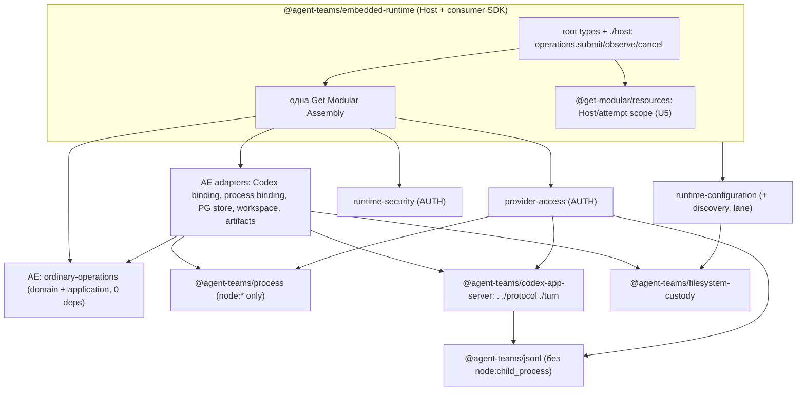

# Раунд 2, критик 1: library-first декомпозиция (`library-decomposition`)

- Исполнитель: независимый критик. Роль: критик раунда 2, 1 из 4. Дата: 2026-10-01.
- Только анализ. Исходники, manifests, CI, SQL, pins и ADR не менялись. install/build/test/typecheck, агенты, providers и бинарь Codex не запускались. Единственный созданный файл — этот отчёт (плюс read-only shallow clones в `$SCRATCH/r2-library-decomposition/` для evidence).
- Snapshots (read-only, `git rev-parse HEAD` проверен):
  - `agent-runtime` `b0bcb265d1466da3272078f9dfdb7c6784624283`;
  - `get-modular` `9c722ceff4ede307d06d7a4b63fdebe615f54c53`;
  - `dotgithub` `3fe0f135ffc446b3bb174397c6b5783f72a008a2` (PR #328 head `255fa3b2…`, OPEN, diff из `OUT/eqs-pr328.diff`);
  - `engineering-foundation` `b8ec0f17d1b8d6f9b7a45798931715d59a126888`;
  - `openclaw` `510beb8d52bd6be9fea27513b9008a50c92a1d2d`.
- Обозначения: **VERIFIED** — прочитал сам по указанной строке; **ASSUMPTION** — мой вывод. Severity P0–P3, уверенность 1–10.

## Реально полученные внешние источники

| Источник | Способ, дата | Что получено |
|---|---|---|
| Списки репозиториев `agent-teams-ai` и `777genius` | `gh repo list`, 2026-10-01 | 13 репозиториев org, ~130 у владельца (имена, описания, приватность) |
| Code search по `777genius` | `gh search code --owner 777genius`, 2026-10-01 | `"thread/start"`, `"turn/start"`, `"--experimental-json"`: попадания в `ar`, `social-monitor`, `review-router-ai`, `subscription-runtime-provider-codex`, `universal-agent-plugins` |
| Code search по org `agent-teams-ai` | `gh search code` | **Не завершён.** Первые запросы вернули пустые списки, затем HTTP 403 (secondary rate limit, общий с другими агентами). Вместо этого клонировал репозитории org (ниже). Отсутствие попаданий org-поиска ничего не доказывает |
| Shallow clones (depth 1) | `git clone`, 2026-10-01 | `777genius/ar` @`7086f891` (это Subscription Runtime, `@vioxen/subscription-runtime`); `social-monitor` @`5653746f`; `review-router-ai` @`99f5e97c`; `workload-funnel` @`42b11954`; `agent-teams-ai` (desktop) @`3dac78ef`; `subscription-runtime-provider-codex` @`955eb7b4`; `subscription-runtime-worker-codex` @`3a637aef`; `subscription-runtime-core` @`3f832b88`; org `agent-teams-orchestrator` @`d5c38e7a`; `extension-foundation` @`d375d2cb`; `agent-architecture-standard` @`58728526` |
| OpenClaw upstream | `gh api compare 510beb8d...c0c8fc9a`, `gh api commits/main` | 41 коммит, новых `packages/*/package.json` нет; main сейчас `0dd332fa` (2026-10-01T18:27:48Z). Дельту дальше `c0c8fc9a` не изучал |
| `openclaw/fs-safe`, `openclaw/proxyline` | `gh api repos/…` + README | fs-safe: «Race-resistant root-bounded filesystem primitives for Node.js», создан 2026-05-05; proxyline: «Process-global proxy routing for Node.js», создан 2026-05-08 |
| npm registry | `npm view`/`npm search`, 2026-10-01 | `@openclaw/fs-safe` 58 версий, latest `0.22.0` (первая 2026-05-06); `@openclaw/proxyline` 18 версий, `0.4.0`; `@openai/codex` latest `0.159.3`, alpha `0.161.0-alpha.13`; `@openai/codex-sdk` `0.159.3`; `@pwrdrvr/codex-app-server-protocol` `0.159.2` («The package version mirrors the Codex CLI version used to generate it»), 5 версий |

Веб-поиска не было. Это source critique с точечной проверкой фактов через `gh`/`npm`, а не широкое online research.

---

## 0. Короткий ответ

**Рекомендую карту из трёх технических библиотек и библиотечно оформленного ядра внутри AE:**

1. `@agent-teams/process` — владение группой процессов (механизм ОС, без политики супервизии).
2. `@agent-teams/jsonl` — строгий ограниченный NDJSON-фрейминг, нейтральный к протоколу и платформе.
3. `@agent-teams/codex-app-server` — протокол Codex App Server: `./protocol` (модуль ревизии Codex со сгенерированными схемами и валидаторами), клиентская сессия поверх заимствованного байтового канала, `./turn` (редьюсер turn).

Ordinary engine/model/policy остаются **модулем AE**, но становятся provider-neutral и отвязанными от contained-turn. Отдельным пакетом engine сейчас не делать: под library-first это не меняется, потому что нет evidence внешнего embedder. PA/RS — authority boundaries, не библиотеки. Store, workspace, artifacts — адаптеры AE. Пакет «contracts» не нужен: байтовый канал и LaunchRecipe — структурные порты потребителей.

Что изменилось относительно раунда 1 и почему:

- **Codex-пакет из «условного» стал рекомендованным.** Причины: U2, U3 и новое evidence. PA и desktop-приложение владельца вызывают одни и те же методы Codex App Server (`config/read`, `account/read`, `account/rateLimits/read`, `model/list`). В Subscription Runtime свой app-server стек на 6139 строк. Валидаторы AE и PA одного уведомления уже разошлись. По FMS проходит REUSE (AE + PA) и DEPENDENCY_LIFECYCLE (Codex выпускается раз в 1–3 дня). Конфликта с FMS для него нет.
- **JSONL выделен отдельно**, а не подпутём Codex- или process-пакета. JSONL нужен не только Codex (Claude `stream-json` в desktop, JSONL-журнал AR), а process-пакет POSIX-only.
- **Engine переоценён и по-прежнему остаётся модулем.** Новое наблюдение: удаление contained убирает единственных импортёров Claude Agent SDK из AE. Тезис раунда 1 «subpath AE никогда не станет библиотекой» верен только до этого удаления.

🎯 7/10 · 🛡️ 8/10 · 🧠 6/10. **4050–7400 changed + 700–1420 moves**, LOC confidence 4/10. Отдельные lanes (API, guards, contained, U5) в эту сумму не входят.

---

## 1. Цели владельца, прошлые гипотезы, факты, мой выбор

**Цели (приоритетны U1–U5):**

- U1: SDK-growth заморозку можно заменить;
- U2: library-first, breaking changes допустимы;
- U3: Codex всегда свежий, эволюция версии — первоклассная задача;
- U4: строгая модульность, SOLID/Clean/DDD/DRY без service bags;
- U5: `@get-modular/resources` как соседняя программа.

Из handoff: Codex сначала, ordinary — единственный путь, без новых фич, сохранять полезный код, учиться у OpenClaw по фактам.

**Прошлые гипотезы, которые я пересматриваю:**

- раунд 1, вариант 1: «швы → пакет процесса с PA → Codex-пакет по условию»;
- libraries-critic: `codex-app-server/jsonl` как подпуть;
- skeptic: `stdio-process` = process + jsonl, Codex wire остаётся в AE;
- все четыре критика: «engine остаётся в AE по FMS».

**Важное уточнение источников.** Workspace `AGENTS.md` уже содержит раздел «Library-first modularity at the early stage». Цитата (`AGENTS.md:53`): «For placement, this direction takes precedence over consumer-first incubation; the second-consumer rule above limits claims of a stable SPI, not where the code lives». Раздел адресован «Get Modular and our modularity libraries» (`:47`). Для AR основанием служат org EQS #328 (не merged) и глобальное правило владельца. В том же файле есть ограничение shared-first (`:41`): «Keep product policy, orchestration, storage, process supervision, UI and concrete adapters in the product Host». Отсюда для process-библиотеки жёсткое условие: **только механизм**, политика супервизии остаётся у binding/Host (§5.1).

---

## 2. Evidence переиспользования (главный новый материал)

Всё ниже VERIFIED по клонам на указанных SHA (§ источники), если не помечено иначе.

### 2.1 Владение группой процессов (`detached` + `process.kill(-pgid, …)`)

| Репозиторий | Где | Наблюдение |
|---|---|---|
| AR / AE ordinary | `node-ordinary-process.ts:30-33`, `:100-104`, `:178-185` | `groupExists` через `kill(-pid, 0)`/`ESRCH`; «An exited leader cannot justify signalling a possibly recycled process group.» |
| AR / PA auth | `ordinary-codex-auth-ipc.ts:21-25`, `:127-132`; `ordinary-codex-auth-capture.ts:53-56`, `:66-76` | Отдельная реализация: `spawn('/usr/bin/sandbox-exec', …, detached: true)`; «Never signal a numeric group after its leader exit has been observed.» |
| AR / contained | `host-custody/host-custody-posix-process-group.ts:16` | Третья реализация: `process.kill(-pgid, 0);` |
| Subscription Runtime (`777genius/ar`) | `src/provider-codex/app-server/adapters/node-app-server-process.ts:204-220` | `signalCodexAppServerChildGroup` → `process.kill(-child.pid, signal)`. В теле функции нет проверки наблюдённого exit. Проверяют ли вызывающие — ASSUMPTION, не проверял |
| social-monitor | `apps/agent-runtime/src/subscription-runtime-cli-support.ts:136-155` | `detached: process.platform !== "win32"`, `process.kill(-child.pid, signal)` |
| review-router-ai | `packages/features/codex-oauth-rotating/src/action/github-action.ts:4831`, `scripts/codex-rotating-migration89-process.mjs:527,545` | `process.kill(-processGroupId, signal)` |
| workload-funnel | `tooling/hosted-canary/node-process-runner.mjs:128` (tooling; prod-путь — `executor-systemd`) | SIGKILL группы |
| desktop `777genius/agent-teams-ai` | `src/main/utils/childProcess.ts` (959 строк), `processKill.ts`, `processStartTime.ts`, `windowsProcessTable.ts`; `RuntimeProviderCliCompanionService.ts:114` | Кроссплатформенный (вкл. Windows) набор, глобальный реестр `killTrackedCliProcesses` |

Вывод: механизм реализован не меньше 8 раз в 6 репозиториях, с разной строгостью. Это не «гипотетический consumer», а существующие дубли одного знания. **Честная оговорка:** миграция чужих репозиториев — решение владельца. Desktop требует Windows: для AR это новая ОС, вне scope. Поэтому desktop — потребитель в лучшем случае частично.

### 2.2 Codex App Server клиенты и протокол

| Репозиторий | Где | Методы и наблюдение |
|---|---|---|
| AR / AE ordinary | `ordinary-codex-protocol.ts` (222), `-provider.ts` (155), `-items.ts` (170), shared `codex-app-server-jsonl.ts` (240) | `initialize`, `thread/start`, `turn/start`; строгие exact-key валидаторы одной ревизии |
| AR / PA auth | `ordinary-codex-auth-protocol.ts:5,74-77,93`, `ordinary-codex-auth-ipc.ts:114-119` | `config/read`, `account/read`, `getAuthStatus`, `account/rateLimits/read`, `model/list`; numeric ids `const id = ++sequence` |
| AR / contained | `adapters/outbound/codex-app-server/*` (29 файлов, 5428 строк) | Отдельный стек на тот же протокол |
| desktop | `src/main/services/infrastructure/codexAppServer/JsonRpcStdioClient.ts` (358), `protocol.ts` (181) + три feature-клиента: `CodexAccountAppServerClient.ts` (152), `CodexModelCatalogAppServerClient.ts` (161), `recent-projects/…/CodexAppServerClient.ts` (237) | `initialize`(4), `account/read`(6), `account/rateLimits/read`(5), `config/read`(4), `model/list`(4), `thread/list`(2). Нестрогий: `readline`, timeouts |
| Subscription Runtime | `src/provider-codex/app-server/**` — 6139 строк non-test; `app-server-client.ts` 1103 | turn execution, approvals, reconnect, slot pool (часть этого AR запрещает по SR-AP) |
| review-router-ai | `spikes/codex-app-server/benchmark-app-server.mjs` (1002) | spike |
| social-monitor | зависимости `@openai/codex` + `@vioxen/subscription-runtime` (`package.json`) | потребитель через Subscription Runtime |

Вывод: **PA и desktop используют один и тот же набор account/config/model методов.** Это не похожий код, а одни и те же vendor-схемы. Валидатор `remoteControl/status/changed` уже разошёлся внутри AR:

- AE `ordinary-codex-protocol.ts:80` проверяет только `params.status === "disabled" && params.environmentId === null`;
- PA `ordinary-codex-auth-ipc.ts:36` требует `Object.keys(params).toSorted().join(',') !== 'environmentId,installationId,serverName,status'`.

### 2.3 JSONL вне Codex

- desktop: Claude `stream-json` в 41 файле, включая `src/renderer/utils/streamJsonParser.ts` (779 строк, renderer, то есть браузерная среда) и `TeamProvisioningStreamEvents.ts`.
- AR: журнал — JSONL (`ordinary-observation-journal.ts:51` `ordinary-${randomUUID()}.jsonl`, `:77`). Будущий reader для recovery (F5 раунда 1) нуждается в том же строгом парсере.

### 2.4 Durable agent operations

- workload-funnel: «owns durable workload lifecycle, admission, resource allocation, execution reconciliation… It does not own … provider authentication» (`README.md`). Это слой **над** runtime: он вызывает runtime через bridge (`packages/bridge-subscription-runtime/src/features/runtime-operation-dispatch`), а не встраивает чужой engine.
- Subscription Runtime: «durable run state», но с пулами, fallback и resume, которые AR отвергает (SR-AP-1…11).
- Внешнего embedder нашего engine (claim-before-start, 9 receipts, PA/RS grants) не нашёл. Будущий **потребитель операционного API** (submit/observe/cancel) вероятен: workload-funnel bridge, orchestrator. Это аргумент за дисциплину consumer SDK, а не за engine-пакет.

### 2.5 Обнаружение установок CLI

- desktop `src/main/services/infrastructure/codexAppServer/CodexBinaryResolver.ts` (337) против AR `runtime-installation-discovery` (851). Семантика разная: PATH/инсталлятор против custody-проверенной идентичности исполняемого файла. Evidence умеренное.

---

## 3. Карта кандидатов

Вердикты:

- **LIB** — самостоятельная библиотека (пакет, будущая единица публикации);
- **MOD** — модуль внутри существующего пакета;
- **PORT** — внутренний порт потребителя;
- **AUTH** — security/authority boundary;
- **NO** — не делать.

Вероятность переиспользования — моя оценка по evidence §2 (ASSUMPTION).

| Кандидат | Сейчас (VERIFIED) | Вердикт | Кто переиспользует (evidence) | Вероятность |
|---|---|---|---|---|
| Владение процессом | AE `node-ordinary-process.ts` 208; PA spawn/closure ≈100; contained host-custody | **LIB** `@agent-teams/process` | AE ordinary, PA auth (в той же поставке); будущий Claude ordinary через фасад; SR, social-monitor, review-router (POSIX) | высокая внутри AR; средняя вне AR |
| Строгий JSONL | `codex-app-server-jsonl.ts` 240 (15 src-импортёров AE); PA `ordinary-codex-auth-json.ts` 37 + frame-буфер; line-split в process | **LIB** `@agent-teams/jsonl` | AE Codex, PA, reader журнала; desktop Claude `stream-json` (renderer) | высокая внутри AR; средняя вне |
| Codex App Server: envelope, handshake, сессия/корреляция | `ordinary-codex-protocol.ts:8-47`; PA `ordinary-codex-auth-ipc.ts:114-119` | **LIB** `@agent-teams/codex-app-server` (`.`) | AE, PA; desktop, SR | высокая внутри AR; средняя вне |
| Модуль версии и схем Codex | `generated-codex-item-schema.ts` (22 KB), `codex-app-server-item-schema.ts` 106, fixtures `tests/fixtures/protocol/codex-app-server-0.153.4/*` (manifest, generate, verify-regeneration) | **LIB** подпуть `@agent-teams/codex-app-server/protocol`; генератор sync/check — dev-скрипт репозитория | AE, PA; прецедент рынка `@pwrdrvr/codex-app-server-protocol` | высокая |
| Редьюсер turn (thread/turn/item, terminal) | `ordinary-codex-protocol.ts:104-…`, структурная часть `-items.ts` | **LIB** подпуть `./turn` (один потребитель в AR; включён как знание vendor-протокола, без ordinary policy) | AE; SR и review-router держат свой turn state | средняя |
| Codex release/profile tuple (binary SHA, cliVersion, model, manifest revision) | 22 production-файла с `0.153.4` (15 AE, 4 PA, 2 ER, 1 RS) | **MOD** в Codex binding AE (один файл-дескриптор), передаётся Host в PA/RS | только AR (продуктовая policy) | — |
| LaunchRecipe | тип в `node-ordinary-process.ts:6-22`; Assembly `ordinary-runtime-assembly.ts:18` ссылается на `NodeOrdinaryProcessOptions["prepareLaunch"]` | **PORT** AE application (consumer-owned), реализация — Codex binding | AE | — |
| Ordinary operation model + policy + engine | domain/application 554 своих строк; type closure ≈3.7–3.9K из-за contained-типов (раунд 1) | **MOD** `features/ordinary-operations` в AE, provider-neutral; пакет — по триггеру (§6) | Codex binding, будущий Claude binding (внутри AR) | вне AR низкая |
| PostgreSQL operation store | `ordinary-postgres-store.ts` 152 + codec 27 | **MOD** (адаптер AE) | только AE; PA/RS держат свои stores | низкая |
| Workspace / artifacts | 79 + 80 + `ordinary-files.ts` 68 | **MOD** (адаптеры AE); проверить переход на `filesystem-custody` (§7) | только AE | низкая |
| PA (capture, broker, grants) | ≈1342 строк ordinary-файлов в PA | **AUTH**; становится потребителем трёх библиотек | — | — |
| RS (admission, settlement) | ≈238 строк ordinary + contained | **AUTH** | — | — |
| Passive installation discovery | AE `runtime-installation-discovery` 851 | **MOD**: перенос в существующий `runtime-configuration` (отдельная lane); LIB-кандидат после desktop (там нужна Windows) | desktop `CodexBinaryResolver.ts` | средняя, позже |
| Consumer SDK facade | ER root `.` (только типы) + широкий `./composition` | **MOD/API**: curated `./host`, `operations`, без Codex-литералов (API lane); дисциплина библиотеки: 0.x, changelog, migration guide | orchestrator, workload-funnel bridge, desktop (будущие) | высокая для **API**, не для отдельного пакета |
| filesystem-custody | `packages/platform/filesystem-custody` 908 src | уже **LIB** (аналог `@openclaw/fs-safe`) | AR; кандидат на публикацию | средняя |
| Общие примитивы contained (codecs 139, record 79, limits 54, fingerprint) | `ordinary-validation.ts:1-4`, `ordinary-model.ts:1-2` | **MOD**: перенести в ordinary domain. Не библиотека: байты digest/fingerprint durable, и общий пакет, меняющий канонизацию, сломал бы сохранённые идентичности | AE ordinary | — |
| Байтовый канал | `OrdinaryTransport { lines: AsyncIterable<string> }` (`ordinary-ports.ts:41-45`) | **PORT** структурный: у Codex-клиента — потребляемый канал, у process — `ProcessIo`; в AE application — непрозрачный handle | — | — |
| «contracts»/shared kernel | — | **NO** (FMS `v1.md:429-433`; EQS «Avoid unowned `shared` or `utils` dumping grounds») | — | — |
| Публичный SPI семи ролей / conformance kit | — | **NO** сейчас (ADR-0090:76-78; нет второй реализации) | — | — |

---

## 4. Целевая карта и граф зависимостей



**Правила графа (проверяемые Foundation `source-dependencies`):**

- `process` и `jsonl` ни от чего не зависят. `codex-app-server` зависит только от `jsonl`. Ни одна из трёх не импортирует AE/PA/RS/ER/Assembly/`@get-modular/*`. Циклов нет.
- В AE библиотеки импортируют только adapters (`ordinary-codex`, `ordinary-process`). Domain и application не импортируют ничего внешнего (правило уже соблюдается, раунд 1).
- PA импортирует библиотеки только из outbound adapter auth capture.
- Библиотеки — fixed library dependencies, **не** graph nodes CMS. Цитата (`get-modular docs/architecture/common-assembly.md:69-71`): «Fixed library dependencies and private helpers inside a cohesive feature remain static imports and typed factories». Восемь Assembly owners не меняются; меняется только тип capability `ordinary/prepare-launch`.

**Resource owners:**

| Ресурс | Единственный владелец | Чего владелец не делает |
|---|---|---|
| child, pipes, process group | handle `@agent-teams/process` (по одному на reservation или capture); handle держит AE process binding или PA capture | не решает, когда стартовать и закрывать: это политика binding |
| reader loop, корреляция запросов | сессия `codex-app-server` поверх **заимствованного** канала | никогда не закрывает stdin и не сигналит процессу (строже OpenClaw, `client.ts:742-752`) |
| буфер фрагментов JSONL | reader `jsonl` | не держит копий после выдачи сообщения; обнуляет consumed bytes по опции |
| flight операции, порядок settlement | AE engine | — |
| grants и credentials | PA / RS | — |
| journal, PA/RS owners, store, Codex adapter, attempt Assembly | Host, через scope `@get-modular/resources` (U5) | Host не владеет borrowed Pool |
| Pool | вызывающий | — |

**Где живут структурные контракты (без пакета «contracts»):**

- **Байтовый канал.** Codex-сессия объявляет потребляемый ею канал (`{readable: AsyncIterable<Uint8Array>; write(bytes): Promise<void>}`). Process экспортирует `ProcessIo`, структурно ему совместимый. AE application видит канал только как непрозрачный handle, передаваемый из `reservation.start` в `provider.execute` (`ordinary-engine.ts:99,112`).
- **LaunchRecipe.** `OrdinaryLaunchSpecification`/`OrdinaryLaunchRecipe` — порт AE application. У process свой `SpawnSpec`, binding переводит одно в другое.
- **Ошибки.** Discriminant `code` и статический `is()` вместо `instanceof`: две копии пакета в closure не должны ломать распознавание. Прецедент AR — `OrdinaryJournalInitializationError.is` (`ordinary-agent-runtime-host.ts:49`). Без `Symbol.for`/`globalThis` singletons: урок OpenClaw #146265 (раунд 1).

**Сочетание с `@get-modular/resources` (U5):**

1. Библиотеки **не зависят** от `@get-modular/resources`. Они дают семантику `close`, совместимую с cleanup scope. `close(options?: {escalate?: AbortSignal})` идемпотентен и повторяем (решение Q2 ресурсов). При неопределённости бросает ошибку с фактами (это `failed`-долг), после наблюдённого exit группе не сигналит. Host регистрирует handle одной парой: `resources.setup({setup: () => reservation, cleanup: (r, {signal}) => r.close({escalate: signal})})`.
2. **`[Symbol.asyncDispose]` в process не делать.** `use()` не передаёт сигнал эскалации, а сам дизайн ресурсов предупреждает: «`ChildProcess[Symbol.dispose]` только шлёт SIGTERM (процесс жив)» (`module-resource-scopes-design-2026-10-01.md`, правило 7).
3. **Порядок settlement в engine scope не заменять.** Последовательность process close → snapshot → publish → retire → PA settle → RS settle → удаление workspace только без uncertainty (`ordinary-engine.ts:133-179`) — это доменный порядок authority, а не LIFO. Дизайн ресурсов сам запрещает видеть `Resources` из application (`:228` «Domain/application-код не видит `Resources`»). Per-operation `child()` допустим только как физический backstop при dispose Host.
4. **Не допустить четвёртой копии логики группы процессов.** Решение Q10 ресурсов говорит: «эталонный адаптер процесса убивает **группу** процессов по escalate» (`:377`). В AR этот адаптер должен быть тремя строками поверх `@agent-teams/process`, а не своей реализацией. GM от AR-пакетов зависеть не может, поэтому пример в GM — документация, а не поддерживаемый механизм.

---

## 5. Пакеты рекомендованного варианта

Общее для всех трёх:

- ESM, declarations, **ноль runtime dependencies**;
- owner — платформенная команда AR (`agentTeamsArchitecture.role: platform`, как у `filesystem-custody`), репозиторий — монорепо AR (`packages/platform/*`);
- версия 0.x: breaking change выходит minor-релизом с changelog и migration guide (EQS #328);
- старт `private`, готовность к публикации подтверждается single-root packed proof. Публикация в npm — отдельное решение владельца;
- переезд в отдельный репозиторий (как `fs-safe`/`proxyline`) — только когда появится внешний потребитель и разойдётся релизный ритм.

### 5.1 `@agent-teams/process`

- **Почему самостоятельный.** Четыре причины:
  - FMS REUSE: AE и PA — разные bounded contexts с разным lifecycle (turn ≤45 s с drain против one-shot helper ≤15 s под `sandbox-exec`);
  - причина изменения — семантика ОС и Node, а не политика операций;
  - security-инвариант «не сигналить группе после exit лидера» сейчас живёт в трёх копиях внутри AR (§2.1);
  - дубли есть ещё в пяти репозиториях.
- **Обещает:**
  - spawn без shell, явное окружение, отдельная process group;
  - двухфазный `prepare` → `start` (start ровно один раз): это сохраняет «claim до spawn»;
  - синхронный observation hook с write-ahead `launch_requested` и fail-closed, если hook вернул не `undefined` (`node-ordinary-process.ts:74-79`);
  - pull-based `readable: AsyncIterable<Uint8Array>` с backpressure (закрывает риск очереди на 256 строк, F7 раунда 1);
  - лимиты stdout, stderr, общий бюджет и лимит записи;
  - stderr-политика: `discard-zeroize` | `validate-utf8-and-discard` | ограниченный capture;
  - эскалация closeInput → TERM → KILL с бюджетами вызывающего, `escalate` пропускает ожидания;
  - раздельные факты: `exitObserved`, `stdoutEof`, `stderrEof`, `groupEmptyObserved`, `unreadBytes`, overflow/invalid;
  - start identity `{pid, pgid}` (чтобы не закрыть будущий reaper по образцу OpenClaw, раунд 1).
- **Не обещает:** политику супервизии (когда стартовать и убивать, ретраи, platform/non-root, claim gate — всё это binding), hostile containment, потомков, ушедших из группы, recovery по PID после рестарта, Windows, PTY, UTF-8 и JSONL.
- **Эволюция.** Breaking-кандидаты: состав фактов закрытия и форма escalation. Для Claude sync понадобится подпуть-фасад ChildProcess-like для `spawnClaudeCodeProcess` (`claude-agent-sdk-query-contracts.ts:15-28` требует `stdin: Writable`, `stdout: Readable`, `kill(signal)`): добавить его минорным релизом при Claude sync, сейчас не делать. В R0 проверить совместимость на бумаге (skeptic S7).

### 5.2 `@agent-teams/jsonl`

- **Почему самостоятельный.** Строгий фрейминг уже дублируется в AE (`codex-app-server-jsonl.ts:59-80`, без лимита глубины) и PA (`ordinary-codex-auth-json.ts:8-24`, `stack.length > 32`), а line-split дополнительно сидит в process (`node-ordinary-process.ts:105-119`).
  - JSONL нужен не только Codex: Claude `stream-json`, журнал.
  - Отдельно от process: process-пакет POSIX-only, а JSONL нужен и в browser renderer desktop, и на Windows. Объявление `os`/`engines` у process заблокировало бы установку JSONL-подпути.
  - Отдельно от Codex: Claude-потребителю нелепо зависеть от Codex-пакета (это признал libraries-critic раунда 1, W3).
- **Обещает:**
  - fatal UTF-8, отказ от дублирующихся декодированных ключей с лимитом глубины;
  - лимиты строки, сообщений и общего объёма; срез CR, пропуск пустых строк;
  - отказ от незавершённого хвоста на EOF, факт «чистый EOF»;
  - только JSON object (опция), encoder;
  - pull-модель без внутренней очереди, опциональное обнуление consumed bytes для секретного пути PA;
  - только `Uint8Array`/`TextDecoder`, без `node:*`.
- **Не обещает:** толерантное восстановление (OpenClaw `client-message-decoder.ts` чинит сырые `\n`: не брать), семантику протоколов, LSP `Content-Length` фрейминг. Обнуление не покрывает строки, созданные `JSON.parse`: это предел JS (ASSUMPTION, совпадает с раундом 1).
- **Эволюция.** Изменение строгости — breaking (minor).

### 5.3 `@agent-teams/codex-app-server` (`.`, `./protocol`, `./turn`)

- **Почему самостоятельный:**
  - REUSE: AE и PA (общий envelope без `jsonrpc`, handshake `initialize`/`initialized`, `remoteControl/status/changed`, строгость ключей);
  - DEPENDENCY_LIFECYCLE: vendor-протокол, который выходит раз в 1–3 дня. Это код, меняющийся по чужому графику (Common Closure);
  - U3: здесь живут сгенерированные схемы ревизии и инструменты синхронизации;
  - вне AR: desktop и SR реализуют то же самое (§2.2).
- **`./protocol` (модуль версии Codex):**
  - `CODEX_PROTOCOL_REVISION`/`SUPPORTED_CODEX_REVISIONS`;
  - сгенерированные из `codex app-server generate-json-schema` схемы **выбранных** сообщений (initialize, thread/start, turn/start, item/*, turn/completed, config/read, account/read, account/rateLimits/read, model/list, remoteControl/status/changed);
  - валидаторы, построенные по схемам, а не рукописные exact-key списки;
  - decode envelope с id `string | number`.
  - Генератор и проверка (обобщение нынешних `generate-runtime-item-schema.mjs` и `verify-regeneration.mjs`; у OpenClaw тот же паттерн: `codex-app-server:protocol:sync|check`, `package.json:1744-1745`) — dev-скрипты репозитория, в пакет не входят.
- **`.` (сессия):** заимствует канал, корреляция request/response, буфер уведомлений в порядке поступления, явная send disposition (`not_written` | `possibly_written` | `answered`), server→client requests по умолчанию отвергаются, `detach()` никогда не закрывает канал.
- **`./turn`:** редьюсер thread/turn/item и terminal-семантика vendor-протокола. Policy-хуки (`admitItem`, `admitStartup`) — у binding.
- **Не обещает:** процесс и cleanup, config.toml, credentials, pin модели и провайдера, approvals, resume, WebSocket, retry `turn/start`, совместимость с ревизиями вне `SUPPORTED_CODEX_REVISIONS`. Политика принятия версии (exact у AR против floor+warn у OpenClaw, `version.ts:1-4`) остаётся у binding.
- **Эволюция.** Смена поддерживаемой ревизии Codex — minor-релиз, migration guide перечисляет протокольный diff. Номер Codex в версию пакета не зеркалить: EQS требует собственного 0.x. Прецедент `@pwrdrvr/codex-app-server-protocol` зеркалит, но это чужая политика.

### 5.4 Что остаётся в AE и Host

- **AE process binding:** claim gate (`node-ordinary-process.ts:145-149`), darwin/non-root (`:58`), перевод фактов в receipts `output_drain`/`process_group_closed`, очистка env.
  - `output_drain` собирается из трёх фактов: process — EOF и `unreadBytes = 0`, jsonl — чистый EOF, engine — `finalSequence` (F6 раунда 1).
- **AE Codex binding:** handshake ordinary-профиля, единственный `turn/start`, ordinary item policy, LaunchRecipe и config writer/verifier, дескриптор релиза Codex.
- **Host:** выбор дескриптора и передача его PA/RS/AE, scope ресурсов.

---

## 6. Engine / `ordinary-operations` под library-first

**Польза отдельной библиотеки (по существу):**

- концепция ценна: durable claim-before-start, «неопределённость не даёт права на повтор», раздельные факты закрытия;
- чужой harness получил бы её без нашего Host;
- граница пакета заставила бы формализовать restart и store contract.

**Против — VERIFIED, а не формальное FMS:**

1. **Внешнего embedder нет** (§2.4). workload-funnel и Subscription Runtime держат свой lifecycle на других слоях. SR конфликтует с SR-AP. Library-first требует concern, «expected to serve several projects». Для engine evidence показывает внутреннее переиспользование (Codex, затем Claude), а не межпроектное.
2. **Engine = SPI семи ролей с authority-семантикой.** Внешнему автору пришлось бы реализовать `OrdinaryProviderGrant.materialize/retire/settle` и `OrdinarySecurityGrant.admitOutput/admitArtifact/settle` (`ordinary-ports.ts:16-31`). Владелец такой SPI не утверждал (handoff §2).
3. **В домене есть Codex-словарь:**
   - `provider_terminal` содержит `threadId`/`turnId` (`ordinary-model.ts:16`);
   - `capabilityManifestRevision` — литерал `"ordinary-codex-macos-arm64-0.153.4-v1"` в типе (`ordinary-model.ts:7`, `:12`);
   - для Claude нужны нейтральные `providerSessionRef`/`providerTurnRef`. Это изменение формата, поэтому делать его при v1 cutover, а не отдельно.
4. **Guards переходов сидят inline в SQL-адаптере** (`ordinary-postgres-store.ts:108`, `:115`, `:124`, `:131`): любая другая реализация store обязана их повторить (LSP).
5. **Restart не определён:** после падения Host операция вечно `running`/`accepted` (раунд 1, F5/F11).
6. **Type closure ≈3.7–3.9K строк contained-типов** (`ordinary-model.ts:1-2`, `ordinary-validation.ts:1-4`; подсчёт раунда 1).

**Переиспользуемый контракт (если когда-нибудь выносить):**

- автомат `accepted → (prepared) → running → succeeded|failed|cancelled|reconcile_required`;
- правило «spawn только после подтверждённого claim»;
- receipts как факты, а не `done: true`;
- порядок settlement;
- именованные атомарные методы store над текущей заблокированной записью + CAS;
- асимметрия revision: prepare/claim сверяют revision вызывающего, cancel/append работают с текущей записью.

**Продуктовая policy, которая остаётся у Host:**

- бюджеты 10 s / 60 s / 45 s / 15 s (`ordinary-engine.ts:28,71,77`) и опрос 250 ms (`:110`);
- набор обязательных receipts;
- семантика PA (одноразовый consume) и RS (идемпотентный в TTL), которая различается при одинаковых именах портов (раунд 1);
- контракт workspace (`TASK.md`, `result.txt`) и artifacts.

**Вердикт.** Модуль `features/ordinary-operations` внутри AE, библиотечно оформленный:

- без импортов contained (примитивы переносятся в ordinary domain);
- без Codex-литералов (дескриптор);
- guards — в domain;
- непрозрачный канал.

Пакет сейчас не делать. 🎯 8/10.

**Триггеры для пакета:**

- (a) названный внешний embedder, принимающий 9-receipt closure;
- (b) provider binding с native-зависимостью (например, Claude через Agent SDK) должен жить в отдельном пакете (FMS DEPENDENCY_LIFECYCLE), и ему нужен engine вне AE.

**Prerequisites в любом случае:** guards в domain, записанная семантика restart (хотя бы проекция осиротевших non-terminal в `reconcile_required` по верхней границе authority expiry), отвязка от contained, нейтральный дескриптор, нейтральные receipts провайдера.

**Новое наблюдение, которое меняет вывод раунда 1 (N6).** `@anthropic-ai/claude-agent-sdk` импортируют только два contained-файла: `claude-agent-sdk-contained-turn-provider.ts` и `claude-agent-sdk-official-contract-qualification.ts` (VERIFIED `grep`). `pg`/`zod` в `src` AE не импортируются. После удаления contained и гигиены manifest runtime-closure AE сводится к `filesystem-custody` и новым библиотекам. Тогда подпуть `@agent-teams/agent-execution/operations` станет дешёвым способом открыть engine при срабатывании триггера (a), без нового пакета. Без удаления contained вывод раунда 1 остаётся верным.

---

## 7. DRY по репозиторию

| Знание | Копии (VERIFIED) | Решение |
|---|---|---|
| Владение группой процессов, «не сигналить после exit» | AE `node-ordinary-process.ts:30-33,100-104`; PA `ordinary-codex-auth-ipc.ts:21-25,127-132`, `ordinary-codex-auth-capture.ts:66-76`; contained `host-custody-posix-process-group.ts:16` | **Объединить** в `@agent-teams/process` (AE + PA). Contained не мигрировать — удалять |
| Отказ от дублирующихся ключей JSON | AE `codex-app-server-jsonl.ts:59-80`; PA `ordinary-codex-auth-json.ts:8-24` | **Объединить** в `@agent-teams/jsonl`, взять лимит глубины из PA |
| Валидатор `remoteControl/status/changed` | AE `ordinary-codex-protocol.ts:80` (слабый); PA `ordinary-codex-auth-ipc.ts:28-40` (exact keys) | **Объединить** в `./protocol`, взять строгую версию PA. ASSUMPTION: реальные emissions всегда имеют ровно 4 ключа; PA уже это требует |
| Корреляция RPC | AE single in-flight string id (`ordinary-codex-protocol.ts:32-46`); PA numeric `++sequence` (`ordinary-codex-auth-ipc.ts:117`) | **Объединить** в сессию с id `string \| number` |
| Codex tuple `0.153.4` | 22 production-файла | **Один источник**: дескриптор в Codex binding → Host → PA/RS/AE |
| Стеки cleanup | Host `ordinary-agent-runtime-host.ts:56-62`; engine `unfinished` + `flight.cleanup` (`ordinary-engine.ts:46,120-127`); contained — свои | **Host-уровень** → `@get-modular/resources` (U5). **Engine settlement — НЕ объединять**: это доменный порядок authority (§4) |
| Проверка стабильных путей | `ordinary-files.ts:9-33` (`directory()`, `readStable()` с `O_NOFOLLOW`, сравнением metadata); `filesystem-custody` `openStablePath` (`stable-path-custody.ts:226`) | **Оценить** перевод ordinary на `filesystem-custody`. ASSUMPTION: семантика пересекается частично; P3 |
| Буфер с обнулением кадров PA | `ordinary-codex-auth-ipc.ts:46,85-88,100` | **Намеренно раздельно** как политика PA; механизм обнуления — хук `jsonl` |
| PA vs RS authority | одноимённые `resolveAndConsume` с разной семантикой (раунд 1) | **Намеренно раздельно**. Общий `AuthorityPort` скрыл бы различия |
| Канонический digest/fingerprint | AR `contained-turn-codecs.ts`; workload-funnel `packages/kernel/src/canonical-digest.ts` (свой SHA-256 на чистом JS) | **Не объединять между проектами**: независимые контексты, durable байты (EQS: «Do not couple independent contexts…») |

**Contained против ordinary.** Ordinary — единственный активный путь. Contained (десятки тысяч строк: AE `host-custody` 32 668, `codex-app-server` 5 428, Claude adapter 1 783 и т. д.) на новые библиотеки **не переводить**: это двойная работа по коду, который удаляется.

Порядок такой:

1. Отвязать ordinary от contained-примитивов и типов (S4).
2. Ordinary переходит на библиотеки, а contained временно оставляет свою копию JSONL-reader. Это осознанный временный дубль: у него есть owner и записанный шаг удаления, как требует EQS #328 («Do not leave an old and a new variant side by side without an owner and a removal step»).
3. Lane удаления contained после review достижимости.

**Конфликт с U5 (P1 для планирования, 🎯 8).** Дизайн ресурсов называет первым потребителем «ordinary host и Darwin deployment» (`module-resource-scopes-design-2026-10-01.md:445`). В AR это `darwin-contained-turn-deployment` (`README.md`: «# Darwin contained-turn deployment»), то есть legacy contained. Принятие ресурсов там — работа по удаляемому коду. Второй «материально другой scope» для ресурсов лучше взять на ordinary-пути: например, Host-scope и per-operation backstop scope или жизненный цикл PA broker. Решение за владельцем.

---

## 8. Эволюция версии Codex (U3) — границы

Цель: bump Codex = регенерация плюс один дескриптор плюс прогон conformance, а не правки 22 файлов в четырёх пакетах.

1. **`@agent-teams/codex-app-server/protocol`** владеет ревизией протокола. Сгенерированные схемы выбранных сообщений и валидаторы из них, команды `sync` (сгенерировать из закреплённого бинаря) и `check` (детерминированная сверка). Рукописные exact-key списки (`ordinary-codex-protocol.ts:50`, `validateThread` в `ordinary-codex-provider.ts:28-34`) заменяются сгенерированными.
2. **Дескриптор релиза Codex** (Codex binding AE, один файл): `cliVersion`, `protocolRevision` (из `./protocol`), `binarySha256` по платформам (сейчас `ordinary-codex-config.ts:13`), шаблон user-agent (сейчас `ordinary-codex-provider.ts:147`), model/provider pin, `manifestRevision`. Host передаёт его в PA (broker сейчас сверяет `headers.version !== '0.153.4'`, `ordinary-pa-broker.ts:61`) и RS.
3. **Store:** штамп ревизии при accept; decode принимает любую корректную ревизию, claim — только текущую (core-critic раунда 1). Принятые, но не заклейменные операции старой ревизии после апгрейда получают явный terminal/`reconcile_required` с причиной, а не висят молча.
4. **Публичный API** без Codex-литерала: сейчас `runtime-access.ts:233` `capabilityManifestRevision?: "ordinary-codex-macos-arm64-0.153.4-v1"`. Вместо него opaque `profileRef: string` или ничего (API lane).
5. **Conformance:** санитизированные записанные transcripts на каждую ревизию для сессии и `./turn`. Live canary на disposable TEST-проекте остаётся отдельной квалификацией: тесты библиотеки её не заменяют.
6. **Политика ритма** (решение владельца). «Всегда latest» при выходе Codex раз в 1–3 дня (`0.153.4` от 04.09 → `0.159.3` от 30.09) означает частые minor-релизы и canary. Реалистично: bump по расписанию (например, раз в неделю) или по security/fix-триггеру. Exact-валидаторы не ослаблять ради скорости.

---

## 9. Цена границ

**Footprint.** Per-file census CMS (`consumer-profile.json` 6 302 строки, 41 boundary, проверка `live relationships drift`, `get-modular-source-census.mjs:85`) плюс Foundation `source-dependencies.yaml` 3 013 строк (62 упоминания `filesystem-custody`), FMS-профили и ordinary scope (126) (VERIFIED).

**После замены SDK-growth гейта (U1):**

- одноразово: F0 400–800 строк; общий single-root isolated packed harness 150–300 (проверить сначала на `filesystem-custody`); ADR 100–200;
- **на пакет ≈200–400 changed LOC:** manifest/tsconfig/README/index 120–180, boundary и allow в source-dependencies 30–60, классификация и census CMS 30–80, FMS 20–50, packed-тест 40–80, запись в лёгком census экспортов 5–20;
- постоянно: changeset, changelog, migration guide на каждый break;
- до U1 к этому добавлялась невозможность смержить вообще: `SDK_SCOPE_DRIFT`, `SDK_EXPORT_MATRIX_DRIFT` (`check-sdk-growth-profile.mjs:103,157`).

**Скрытый налог перемещений.** Слово `ordinary` встречается в 226 строках `source-dependencies.yaml` и 250 строках `consumer-profile.json` (VERIFIED `grep -c`). Любой перенос ordinary-файлов (выход из `contained-agent-turn/`) означает сотни механических правок путей. Генератор census с `--check` (идея skeptic раунда 1) окупится до переезда ordinary.

| Граница | Польза | Налог | Итог |
|---|---|---|---|
| `process` | высокая: security-инвариант в 3 копиях AR + 5 репозиториев | ~200–400 | **польза > налога** |
| `jsonl` | средне-высокая: 2 копии AR + нейтральность | ~200–400 на ~300 строк кода | **польза ≥ налога**; если владелец хочет меньше пакетов — вариант 2 |
| `codex-app-server` | высокая под U3: изоляция ритма Codex, расхождение валидаторов AE/PA | ~250–450 + релизы по ритму Codex | **польза > налога** |
| engine-пакет | сейчас нет внешнего потребителя | ~500–900 + обязательства SPI | **налог** |
| store-пакет | нет | ~400–800 | **налог** |
| `codex-provider` binding-пакет | появится с Claude (native deps) | ~500–900 | **налог сейчас**, триггер — Claude |
| conformance kit | только при SPI | ~800–1400 | **налог сейчас** |
| «contracts» | отрицательная | — | **не делать** |

---

## 10. SOLID / Clean / DDD / DRY / CMS / FMS по существу

| Принцип | Конкретное место (VERIFIED) | Что делаем |
|---|---|---|
| SRP | `node-ordinary-process.ts`: процесс + UTF-8/line framing (`:105-119`) + claim gate (`:145-149`) + platform policy (`:58`) + journal; `ordinary-codex-protocol.ts:3` импортирует refusal из модуля с `node:fs` (`ordinary-codex-config.ts:1-4`) | Механизм → библиотеки; policy → binding |
| OCP | Bump Codex = 22 файла в 4 пакетах | Дескриптор + `./protocol` |
| LSP | Guards переходов inline в SQL (`ordinary-postgres-store.ts:108,115,124,131`) | Guards в domain (lane S3) до любого store SPI или engine-пакета |
| ISP | `OrdinaryProcessPort.reserve` получает credential material (`ordinary-ports.ts:53`); provider получает весь aggregate (`:57`) | Библиотека process видит только готовый env; credential→env остаётся в LaunchRecipe |
| DIP | Assembly → `NodeOrdinaryProcessOptions["prepareLaunch"]` (`ordinary-runtime-assembly.ts:18`); тип options Host выведен из concrete store (`ordinary-agent-runtime-host.ts:26`) | LaunchRecipe — порт AE; Host options — собственный тип |
| Clean | Ordinary domain/application не импортируют Node, SQL и vendor (раунд 1, подтверждено импортами `ordinary-engine.ts:1-3`, `ordinary-ports.ts:1`) | Сохранить; библиотеки импортируют только adapters |
| DDD | Codex-словарь в домене (`ordinary-model.ts:7,16`); домен ordinary импортирует contained-домен (`ordinary-model.ts:1-2`) | Нейтральный дескриптор и receipts; примитивы — в ordinary domain |
| DRY | §7 | Объединять одинаковое знание, authority не объединять |
| CMS | Библиотеки — fixed library deps (`common-assembly.md:69-71`). Смена типа `ordinary/prepare-launch` — смена capability contract: обновить consumer profile и сравнить pin | Pin мигрировать **один раз** вместе с ADR/CMS-разделом ресурсов (U5) |
| FMS | §11 | REUSE + DEPENDENCY_LIFECYCLE для трёх библиотек |

---

## 11. EQS #328 против FMS: конфликт и как его снять

**Конфликт (VERIFIED):**

- FMS v1 неизменяем: «Protocol clients used only by one adapter SHOULD remain inside that adapter until reuse or lifecycle evidence justifies extraction» (`v1.md:147-149`), «MUST NOT be extracted merely for … one adapter, or a hypothetical future consumer» (`v1.md:468-469`).
- EQS #328 добавляет: «Design a concern that is expected to serve several projects as a universal, well-structured library from the start». При этом сохраняет: «Accepted decisions and pinned standards still change through their successor process».
- `GOVERNANCE.md:44-47`: «A local profile may strengthen the standard or record an explicit owned deviation, but it cannot silently reinterpret the central version».

**Предложение в три слоя:**

1. **Для рекомендованных библиотек конфликта нет.** REUSE выполнен внутри AR: AE и PA — два реальных независимых потребителя одной семантики (§2, §7). У Codex к этому добавляется DEPENDENCY_LIFECYCLE («independently updated dependencies», `v1.md:457`). READY (`v1.md:465-466`) даёт R0: curated surface, compatibility policy 0.x, тесты, migration plan. Записать это в ADR extraction AR как основание, а не как «интерпретацию library-first».
2. **Для случаев, где единственный аргумент — ожидаемое межпроектное переиспользование** (сегодня в моей рекомендации таких нет), AR фиксирует **явное owned deviation** в своём FMS-профиле: concern, evidence дублей с путями и коммитами, owner, шаг пересмотра. Молча переинтерпретировать FMS нельзя.
3. **Системно:** successor FMS (v1.1/v2) в `.github` с отдельным основанием `EXPECTED_REUSE`:
   - записанное направление владельца;
   - ≥2 существующие независимые реализации того же знания в названных репозиториях (точные пути и коммиты);
   - реальный потребитель в той же поставке;
   - план эволюции контракта;
   - запрет «one adapter / hypothetical» сохраняется для случаев без evidence.

   Принятие — явно в каждом репозитории («A central successor does not affect a repository until that repository explicitly adopts it», `GOVERNANCE.md:46-47`). AR этим не блокируется.

**Мост между текстами.** «Known to serve several projects» (EQS #328, раздел DRY) отличается от «hypothetical future consumer» (FMS) именно evidence. Таблица §2 превращает гипотетического потребителя в существующие дубли. Но миграция чужих репозиториев — отдельное решение, и до неё межпроектное обещание стабильного SPI не даётся (`AGENTS.md:53`: «limits claims of a stable SPI, not where the code lives»).

---

## 12. OpenClaw @ `510beb8d` — что стало библиотеками и почему

| Факт (VERIFIED) | Где | Что это значит для карты |
|---|---|---|
| Отдельные репозитории и npm-пакеты — только generic-механизмы без продуктовой policy: `@openclaw/fs-safe` (корневые зависимости `0.22.0`) и `@openclaw/proxyline` (`0.3.12`) | `package.json:2261-2262`; README: «Capability-style filesystem roots…», «Proxyline installs one process-wide proxy policy…» | **Подтверждает** класс «security-relevant mechanism → библиотека»: наши `filesystem-custody`, `process`, `jsonl` |
| fs-safe используется в 316 non-test файлах `src`+`extensions`, proxyline в 6 (мой `grep`) | — | Библиотека окупается широким потреблением |
| fs-safe: 58 версий за ~5 месяцев, всё ещё `0.22.0`, в README «0.6 migration» | npm; README | Живой прецедент политики EQS #328: 0.x, breaking minor-релизом, migration guide |
| proxyline требует peer `undici@^8.5.0` | README | Зависимость с идентичностью → peer; у нас таких нет (ноль deps) |
| Публичны 3 из 23 пакетов `packages/`: `@openclaw/ai`, `gateway-protocol` (deps: `typebox`), `gateway-client` (deps: protocol, `ws`, `ipaddr.js`); остальные `0.0.0-private` | `packages/*/package.json` | Протокол отделён от клиента; внутренняя модульность без публикации нормальна |
| **Не вынесено:** `src/process` (18 449 non-test строк) остаётся в ядре, плагинам доступен как подпуть plugin-sdk | `src/process/*`; раунд 1: `src/plugin-sdk/process-runtime.ts:1` | **Опровергает частично**: OpenClaw процесс библиотекой не сделал. Отличие нашего evidence — дубли в 6 наших репозиториях, у них один продукт |
| **Не вынесено:** Codex-клиент внутри `extensions/codex`, `protocol-validators.ts:1-4` импортирует `openclaw/plugin-sdk/*` | `extensions/codex/src/app-server/protocol-validators.ts:2-3` | **Контраргумент** к нашему Codex-пакету. Наше отличие — evidence AE+PA+desktop+SR (§2.2) и U3 |
| Модуль версии Codex: `CODEX_APP_SERVER_VERSION = "0.158.0"`, floor `0.149.0`; сгенерированные схемы `protocol-generated/` (9 файлов) + `codex-app-server:protocol:sync|check` | `version.ts:1-4`; `package.json:1744-1745`; `scripts/sync-codex-app-server-protocol.ts` (46), `check-…` (509) | **Подтверждает** форму `./protocol` с генерацией и проверкой. Политику floor+warn не брать: у AR fail-closed exact |
| Дельта `510beb8d…c0c8fc9a`: 41 коммит, новых пакетов нет | `gh api compare` | Состав библиотек OpenClaw за день не менялся |

---

## 13. Три варианта

LOC = additions + deletions кода, тестов, docs, manifests и gates. Moves — неизменённые логические строки, считаются отдельно. Опора — `wc -l` из §2–§9 и сметы раунда 1 по компонентам (они названы в каждой строке). Отдельные lanes (§14) в суммы не входят.

### Вариант 1 (Recommended): три технические библиотеки + библиотечно оформленное ядро AE

Схема и владельцы — §4. Пакеты: `process`, `jsonl`, `codex-app-server` (новые); `filesystem-custody` (существующий). Engine — модуль AE.

| PR | Содержание | Changed | Moves | Основа сметы |
|---|---|---:|---:|---|
| PR-0 | Решения: ADR extraction (REUSE/DEPENDENCY_LIFECYCLE), API-записи трёх библиотек (обещания и не-обещания), owner LaunchRecipe (successor ADR-0090:91), политика ревизий Codex и апгрейда in-flight, правила U5, намерение удалить contained, публикационная политика | 250–450 | 0 | R0 раунда 1 150–350 + FMS/U5/Codex |
| PR-1 | F0: заменить заморозку SDK-growth лёгкой активной проверкой (классификация пакетов, census экспортов, CMS pin chain сохранить, историческое evidence пометить) | 400–800 | 0 | раунд 1: 400–700; скрипт 241 + тест 228 |
| PR-2 | Швы на месте: непрозрачный байтовый канал, LaunchRecipe в портах, framing на стороне Codex внутри AE с parity (1 MiB общий бюджет, fatal UTF-8 stderr, хвост на EOF, непрочитанное при close, CR/пустые строки, backpressure), удалить `prepared` Map (`ordinary-codex-provider.ts:40-54`), гигиена manifest AE | 350–750 | 0–60 | раунд 1: 300–700 |
| PR-3 | Единый источник Codex: дескриптор, Host → PA/RS/AE, штамп ревизии (decode-tolerant / claim-strict), публичное значение берётся из дескриптора | 400–750 | 0–60 | раунд 1: 300–700; core R1b 460–680 |
| PR-4 | `@agent-teams/jsonl` + переключение AE + packed proof | 450–800 | 150–250 | reader 240 + PA 37 + тесты 92; governance 200–400 |
| PR-5 | `@agent-teams/process` + AE process binding + packed proof | 800–1300 | 150–300 | раунд 1: 700–1420; адаптер 208, тесты 223 |
| PR-6 | `@agent-teams/codex-app-server` (`./protocol` с генерацией и sync/check, сессия, `./turn`) + AE Codex binding + перенос fixtures | 900–1500 | 400–650 | раунд 1: 650–1600 / 420–800 минус jsonl |
| PR-7 | PA на `process` + `jsonl` + `codex-app-server` (строгий валидатор PA, хук обнуления, real-process тесты `ordinary-codex-auth.test.ts`) | 350–700 | 0–50 | раунд 1: 200–450; PA IPC 169 + capture 169 + json 37 + protocol 105 |
| PR-8 | Guidance, профили CMS/FMS, итоговая closure деклараций, шаблоны changelog и migration guide | 150–350 | 0–50 | раунд 1: 150–350 |
| **Итого** | | **4050–7400** | **700–1420** | |

🎯 7/10 · 🛡️ 8/10 · 🧠 6/10. LOC confidence 4/10.

- **Даёт:** один владелец каждого security-инварианта; дешёвый bump Codex; устанавливаемые библиотеки, доказанные двумя потребителями в той же поставке; провайдер-нейтральное ядро, готовое к Claude.
- **Не даёт:** замены ролей через Host (ADR-0090:76-78 остаётся) и публикации без отдельного решения.

### Вариант 2: одна библиотека `@agent-teams/stdio` (`./process` + `./jsonl`), Codex-протокол остаётся модулем AE

| Часть | Changed | Moves |
|---|---:|---:|
| PR-0 решения | 200–400 | 0 |
| PR-1 F0 | 400–800 | 0 |
| PR-2 швы | 350–750 | 0–60 |
| PR-3 единый источник Codex | 400–750 | 0–60 |
| `@agent-teams/stdio` + AE bindings | 1100–1800 | 300–500 |
| PA на `stdio` (Codex-валидаторы PA остаются локальными) | 300–600 | 0–50 |
| Docs | 150–300 | 0 |
| **Итого** | **2900–5400** | **300–670** |

🎯 6/10 · 🛡️ 8/10 · 🧠 5/10. LOC confidence 5/10.

- Плюсы: на ~1150–2000 строк дешевле, нет релизов в ритме Codex.
- Минусы:
  - расхождение Codex-валидаторов AE/PA остаётся: PA не может импортировать AE (запрет cross-context), значит две копии;
  - bump Codex трогает AE и PA раздельно;
  - JSONL привязан к POSIX-only пакету (Windows/renderer);
  - desktop и SR от Codex-части ничего не получают.
- Правильный выбор, если владелец не хочет пакет с ритмом vendor-протокола.

### Вариант 3: максимальная декомпозиция сейчас

Вариант 1 + `@agent-teams/agent-operations` (engine/model/ports/transitions) + `…-operations-postgres` + `@agent-teams/codex-provider` (binding-пакет) + dev-пакет conformance + перенос discovery. Prerequisites: guards в domain, отвязка и переезд ordinary, restart-проекция, нейтральные receipts.

| Часть | Changed | Moves |
|---|---:|---:|
| Вариант 1 | 4050–7400 | 700–1420 |
| Guards в domain (S3) | 320–450 | 30–60 |
| Отвязка + переезд ordinary из `contained-agent-turn/` | 450–900 | 2500–3200 |
| Restart-проекция (owner-loss → `reconcile_required`) | 300–600 | 0 |
| Пакет operations (governance, API/SPI docs) | 500–900 | 0 |
| Пакет store | 400–800 | 180–260 |
| Пакет `codex-provider` | 500–900 | 700–900 |
| Conformance kit | 800–1400 | 100–200 |
| Discovery в `runtime-configuration` | 300–600 | ~850 |
| **Итого** | **7600–13950** | **5060–6890** |

🎯 3/10 · 🛡️ 7/10 · 🧠 8/10. LOC confidence 3/10.

Оправдан только при названном внешнем embedder и решении публиковать SPI. Restart-проекция — новое поведение: противоречит ограничению «без новых фич», если не оформить её как исправление честности статуса.

---

## 14. Порядок PR, lanes, integrator (предложение, не разрешение)

Каждый PR не больше ~2000 changed LOC, сразу интегрирован в production composition со своими rejecting checks. Перед открытием — `pnpm check:changed` → `check:fast` → `check` (AR `AGENTS.md`).

```text
PR-0 ─┬─ PR-1 (F0) ─────────────┐
      └─ PR-2 (швы) ── PR-3 ────┼── PR-4 (jsonl) ── PR-6 (codex) ── PR-7 (PA) ── PR-8
                                └── PR-5 (process) ───────────────┘
```

- **PR-1 ∥ PR-2.** PR-4 и PR-5 требуют оба (без F0 новый пакет не проходит `SDK_SCOPE_DRIFT`).
- **PR-4 ∥ PR-5:** файлы не пересекаются. `packages/platform/jsonl/**` + Codex-сторона AE против `packages/platform/process/**` + `ordinary-process/**`.
- **PR-6** после PR-3 (дескриптор) и PR-4. **PR-7** после PR-5 и PR-6.

**Отдельные lanes (не в сумме варианта 1):**

| Lane | Changed / moves | Когда | Почему отдельно |
|---|---|---|---|
| API: `operations`, curated `./host`, имя passive factory, Codex-литерал из view | 700–1300 / 0 | После PR-3, до любой публикации или baseline | Иначе публичный break дважды |
| S3: guards переходов в domain + табличный oracle | 320–450 / 30–60 | После PR-3, параллельно PR-4..6 (только store/domain) | Strict DDD/LSP; prerequisite store SPI или engine-пакета |
| S4: отвязка ordinary от contained-типов и примитивов | 150–300 / 250–400 | После PR-3 | Prerequisite удаления contained и library-shaped engine |
| Формат ordinary v1 (отдельная format identity, нейтральные receipts провайдера) | 120–300 / 0 | Вместе с PR-3 **только** если инвентаризация не нашла реальных строк | Durable data |
| Удаление contained + переезд ordinary в свой feature-каталог | удаления (десятки тысяч строк, не сравнимы) + 300–600 правок путей governance / ~3000 moves | После S4 и review достижимости | Authority/cleanup obligations, таблицы contained |
| Discovery → `runtime-configuration` | 250–500 / ~850 | Любой момент после PR-1 | Passive-потребитель без AE |
| U5: принятие `@get-modular/resources` в Host | бюджет программы ресурсов | После релиза пакета в GM и миграции pin; **merge строго последовательно** с PR-2/PR-3/PR-5 (общие `ordinary-agent-runtime-host.ts`, `ordinary-runtime-assembly.ts`) | Одна зона файлов и pin |

**Единственный integrator владеет:**

- root `package.json`, `pnpm-workspace.yaml`, `pnpm-lock.yaml`;
- `architecture/foundation/source-dependencies.yaml`, `architecture/get-modular/consumer-profile.json` и CMS pin;
- FMS-профили (`candidate-profile.json`, `ordinary-scope.json`) и новый лёгкий gate;
- Host/Assembly, AE ports/model/validation/codec;
- публичные barrels (`composition.ts` AE/ER/PA) и ADR.

Workers владеют только каталогами своих библиотек и своим binding.

**Риски плана:**

1. Parity framing в PR-2 и PR-4 — самая чувствительная к поведению часть.
2. PA в PR-7 — секретный путь.
3. Bottleneck integrator (PR-0..3, PR-8, lanes API/S3/S4, U5-мерджи).
4. Ручные census-рёбра CMS дают конфликты при параллельных PR. Генератор census снял бы большую их часть (вне scope, только идея).
5. Миграция CMS pin должна пройти один раз, вместе с ADR и CMS-разделом ресурсов, а не двумя несогласованными PR.

---

## 15. Безопасность, durable data, U5

1. **Неопределённость ≠ повтор.** Все библиотеки сохраняют три правила:
   - нет повтора `turn/start` после `possibly_written` (`ordinary-codex-provider.ts:101`);
   - unknown claim не запускает процесс (`ordinary-engine.ts:84-94`);
   - нет сигнала группе после наблюдённого exit.

   Сессия Codex возвращает disposition, а binding его соблюдает.
2. **Переход штампа ревизии и v3 → v1.** Сначала инвентаризация реальных ordinary-строк в БД владельца (CI-базы эфемерны; ordinary не квалифицирован, ADR-0090 держит campaign pending — это документ, не данные).
   - Если строк нет — breaking cutover без readers.
   - Если есть — v3 остаётся до сверки.
   - Claim-strict требует явной судьбы принятых, но не заклейменных операций старой ревизии.
3. **In-flight при апгрейде Host.** `dispose` отменяет flights (`ordinary-engine.ts:257-269`), и они уходят в reconcile. После SIGKILL Host остаётся сиротская process group и вечный `running`: известное ограничение ADR-0090 и раунда 1. Библиотеки его не исправляют, но `process` отдаёт start identity, чтобы не закрыть будущий reaper.
4. **Cleanup obligations.** Удержанный workspace (G2), retire credentials, settle PA/RS остаются в engine. Scope ресурсов их не переупорядочивает (§4 п. 3).
5. **Семантика cleanup Host меняется при U5 (P2, 🎯 7).** Сейчас стек останавливается на первой ошибке: `catch (error) {errors.push(error); break;}` (`ordinary-agent-runtime-host.ts:60`), а остаток ждёт повтора. Инвариант ресурсов 7 — «Ошибка не останавливает очистку» (`module-resource-scopes-design-2026-10-01.md:131`). При принятии journal закроется даже после сбоя `dispose` PA owner, и повторный dispose PA уже не сможет журналировать. Это нужно явно решить: например, вынести journal в родительский scope.
6. **Секретный путь PA.** `jsonl` не держит копий consumed bytes (по опции обнуляет внутренние фрагменты). Нынешний reader делает `Buffer.concat` (`codex-app-server-jsonl.ts:178`), и это копия, которую тоже надо обнулять. Строки после `JSON.parse` не обнуляются (предел JS).
7. **Публикация в npm** — внешнее и плохо обратимое действие. Только по решению владельца и через его npm-workflow (`AGENTS.md`, npm interactive confirmation).

---

## 16. Сильнейший контраргумент и что изменит рекомендацию

**Контраргумент.** Три пакета ради ~1.2K строк production-кода и ~1K тестов — это 600–1250 строк governance и обязательство релизов в ритме Codex. Внешнее переиспользование ожидается, но не обещано: desktop нужен Windows, SR — approvals и пулы, которые AR запрещает. Главную экономию при bump Codex даёт не граница пакета, а единый дескриптор и сгенерированные валидаторы: их можно сделать и внутри AE (вариант 2). Exact-валидаторы всё равно придётся регенерировать на каждый bump, пакет только переносит эту работу и добавляет релиз. OpenClaw, у которого опыта больше, Codex-клиент библиотекой не сделал.

**Мой ответ.** Без пакета PA не может разделить Codex-валидаторы с AE: cross-context import запрещён (AR `AGENTS.md`, Foundation). Значит две копии, которые уже разошлись (§7). Это нарушение DRY по security-relevant знанию, а не по похожему коду. Релиз в монорепо до публикации — это changeset, а не ритуал. Довод сильный, и вариант 2 — честная альтернатива.

**Что изменит рекомендацию:**

- Владелец запрещает трогать PA → у `jsonl` и `codex-app-server` нет второго потребителя в AR. Тогда библиотечно оформленные модули внутри AE плюс только `process` или вариант 2 без PA. 🎯 7.
- Владелец не хочет пакет с ритмом Codex или публикацию в ближайшие месяцы → вариант 2. 🎯 7.
- Бумажная проверка R0 покажет, что API `process` не обслуживает Claude spawn hook → `process` остаётся в AE до Claude sync. 🎯 6.
- Названный внешний embedder durable-операций или пакетный Claude binding с native deps → частично вариант 3 (operations-подпуть или пакет). 🎯 6.
- Найдены реальные ordinary-строки → PR-3 без v1, cutover позже. 🎯 8.
- Генератор census для CMS уже есть или будет → цена пакета падает, аргумент за отдельный `jsonl` усиливается.

---

## 17. Scope exclusions

Не входят:

- streaming/progress, approvals и server requests, resume, WebSocket/remote;
- новые providers и ОС (Linux/Windows квалификация `process` — нет; unit-тесты механизма на Linux CI не квалифицируют продукт);
- Claude rewrite и Claude ChildProcess-фасад (только бумажная проверка в R0);
- contained-turn Assembly, orphan reaper, owner-loss recovery;
- публичные SPI ролей и conformance kit;
- npm-публикация без решения владельца;
- исправления G1/G2 (классифицированы в раунде 1);
- миграция чужих репозиториев (desktop, SR, review-router, social-monitor) — только evidence.

---

## 18. Находки

| # | Sev | 🎯 | Находка | Где (VERIFIED) |
|---|---|---:|---|---|
| L1 | P1 | 8 | Codex App Server-знание размазано по AE, PA и contained; валидаторы одного уведомления разошлись; PA и desktop вызывают одинаковые методы (`config/read`, `account/read`, `account/rateLimits/read`, `model/list`) → Codex-пакет безусловен | `ordinary-codex-protocol.ts:80` против `ordinary-codex-auth-ipc.ts:28-40`; PA `ordinary-codex-auth-protocol.ts:5,74-77,93`; desktop `CodexAccountAppServerClient.ts`, `CodexModelCatalogAppServerClient.ts` @`3dac78ef` |
| L2 | P1 | 8 | Владение группой процессов — 3 реализации в AR и ≥5 в других репозиториях владельца; в SR `signalCodexAppServerChildGroup` нет проверки наблюдённого exit (callers — ASSUMPTION) | §2.1; `node-app-server-process.ts:204-220` @`7086f891` |
| L3 | P1 | 8 | Первый потребитель U5 «Darwin deployment» — это legacy `darwin-contained-turn-deployment` | `module-resource-scopes-design-2026-10-01.md:445`; ER `features/darwin-contained-turn-deployment/README.md` |
| L4 | P2 | 8 | Порядок settlement engine — доменная authority-последовательность, а не LIFO; заменять его scope ресурсов нельзя | `ordinary-engine.ts:120-180`; дизайн ресурсов `:228` |
| L5 | P2 | 7 | Принятие ресурсов меняет семантику cleanup Host (стоп на первой ошибке против continue) | `ordinary-agent-runtime-host.ts:60`; дизайн `:131` |
| L6 | P2 | 8 | Codex-словарь в provider-neutral домене (`threadId`/`turnId`, литерал ревизии) блокирует переиспользование engine для Claude без смены формата | `ordinary-model.ts:7,12,16` |
| L7 | P2 | 9 | Claude Agent SDK импортируют только 2 contained-файла; после удаления contained AE становится лёгким → вывод раунда 1 N6 верен лишь до удаления | `grep` по `packages/*/src` |
| L8 | P2 | 7 | Конфликт EQS #328 / FMS снимается для трёх библиотек через REUSE+DEPENDENCY_LIFECYCLE; системно — successor FMS или явное owned deviation, не молчаливая переинтерпретация | FMS `v1.md:147-149,452-469`; `GOVERNANCE.md:44-47` |
| L9 | P2 | 6 | Дизайн ресурсов планирует «эталонный адаптер процесса», убивающий группу: риск четвёртой копии логики | дизайн `:377`, `:338` |
| L10 | P2 | 8 | Ограничение shared-first «process supervision … in the product Host» → `process` обязан быть только механизмом | workspace `AGENTS.md:41` |
| L11 | P3 | 6 | `ordinary-files.ts` реализует проверки стабильных путей отдельно от `filesystem-custody` (пересечение частичное — ASSUMPTION) | `ordinary-files.ts:9-33`; `stable-path-custody.ts:226` |
| L12 | P3 | 7 | Перенос ordinary-файлов дорог из-за ручного census: 226 + 250 строк governance с `ordinary` | `grep -c` по `source-dependencies.yaml`, `consumer-profile.json` |

---

## 19. Расхождения с раундом 1

1. **Codex-пакет:** «условный» → «рекомендованный». Основания: U2, U3, evidence desktop/SR, расхождение валидаторов, REUSE AE+PA.
2. **JSONL:** не подпуть Codex (libraries-critic) и не подпуть process (skeptic), а отдельный нейтральный пакет.
3. **Engine:** вывод тот же (модуль), но основание другое. Не «FMS запрещает», а «нет evidence внешнего embedder; engine = SPI семи ролей с authority». Добавлены нейтральные receipts провайдера и наблюдение про лёгкий AE после удаления contained.
4. **U5:** конкретные правила стыка (без `asyncDispose`, settlement не трогать, нет четвёртой копии логики процесса) и два риска (Darwin contained как потребитель; смена семантики cleanup Host). Догадку координатора раунда 1 «per-operation child scope закрывает N8 и G2» считаю неверной: N8 закрывается удалением Map, G2 — cleanup-only handle в engine.
5. **Governance после U1:** ≈200–400 строк на пакет плюс одноразовые 600–1100. Отдельно — скрытый налог переезда ordinary из-за ручного census.
6. **Смета варианта 1** больше, чем вариант 1 раунда 1 с PR7 (2850–5950): третий пакет `jsonl`, перевод PA и на Codex-протокол, генерация валидаторов под U3.

Файлы и окружение не изменялись, кроме создания этого отчёта и read-only клонов в `$SCRATCH/r2-library-decomposition/`.
