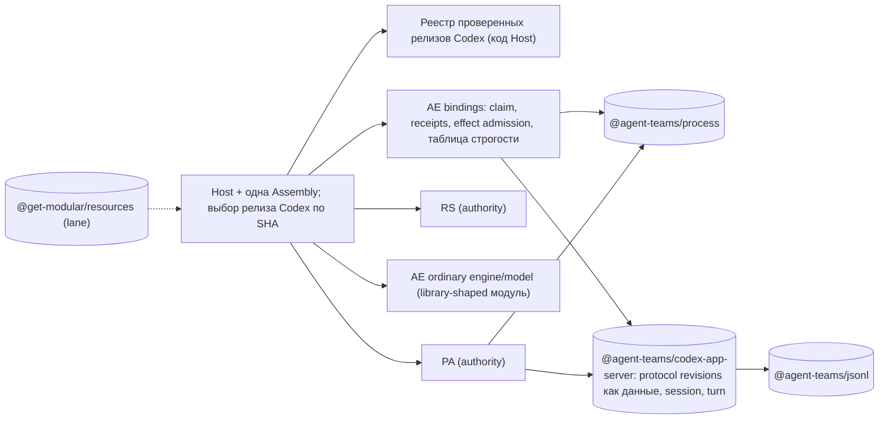

# Agent Runtime, раунд 2: сводка четырёх независимых критиков

1 октября 2026, вечер. **DRAFT / DECISION PENDING. Только исследование и планирование.** Код, manifests, CI, SQL, pins и ADR не менялись. Builds, tests, provider execution и запуск Codex не выполнялись. Решение по реализации не принято.

## 0. Основа

Раунд 2 запущен после уточнений владельца:
- **U1:** заморозку SDK-growth можно заменить.
- **U2:** library-first по EQS PR #328.
- **U3:** Codex в идеале всегда свежий.
- **U4:** строгая декомпозиция и SOLID / Clean / DRY.
- **U5:** соседняя программа `@get-modular/resources`.

Критики: `library-decomposition`, `codex-version`, `governance-sdk`, `skeptic-integration`. Полные отчёты лежат рядом. Контракт: `prompt-common-round2.md`, receipt: `launch-receipt.md`. Snapshots те же, что в раунде 1. Current main AR, GM, `.github` и EF не менялись.

**Перепроверено координатором** (✔ в тексте):
- вторая заморозка `ar-c0` и список required checks;
- размер receipts (4 877 224 байт);
- дубль цепочки CMS pin;
- PA-литерал версии на путях retire/settle;
- denylist фич;
- exact 9 ключей rate limits;
- stop-on-first-failure в Host;
- `JsonRpcLineClient.ts` в subscription-runtime;
- Codex `rust-v0.159.3`: `daemon_auto_start`, `worktrees`, `system_proxy_fallback` имеют `Stable, default_enabled: true` и отсутствуют на `rust-v0.153.4`; `normal_model_slug: Option<String>` без skip-атрибута; `#[experimental("thread/start.permissions")]`.

## 1. Главное

Уточнения владельца изменили вывод раунда 1 в трёх местах. Все четыре критика независимо пришли к одному каркасу:

1. **`codex-app-server` — безусловная библиотека, а не «по условию».** FMS v1 проходит буквально, без ссылки на #328:
   - **DEPENDENCY_LIFECYCLE:** Codex выпустил 12 stable-релизов за 26 дней после 0.153.4.
   - **REUSE:** AE и PA говорят на одном протоколе, и их валидаторы уже разошлись.
   - Ту же логику Codex App Server реализуют desktop agent-teams-ai и subscription-runtime (✔ `JsonRpcLineClient.ts`).
2. **`process` — библиотека, но только механизм.** Workspace `AGENTS.md:41` прямо говорит: «Keep … process supervision … in the product Host». Группой процессов (`detached` + `kill(-pgid)`) владеют как минимум 8 реализаций в 6 репозиториях владельца, из них 3 внутри AR.
3. **Engine, model и store пока остаются модулем AE**, хотя и в форме библиотеки. Основание теперь другое: не «FMS запрещает», а:
   - внешнего потребителя engine нет;
   - engine фактически означает SPI семи ролей с authority-семантикой;
   - durable-семантика ещё не устоялась (v1, revision, owner-loss);
   - ordinary ни разу не исполнялся вживую (ADR-0090:197).
4. **Главная цена модульности — не код, а governance.** Сегодня новый пакет стоит примерно 400–750 строк ручного governance плюс пересъёмку receipts, и без снятия **двух** заморозок добавить его нельзя вообще.
5. **«Всегда свежий» должно значить «последний проверенный», а не «любой установленный».** Буквальное прочтение — регресс безопасности.

## 2. Новые факты раунда 2

| # | Факт | Кто | ✔ |
|---|---|---|---|
| R1 | **Заморозок две.** Кроме SDK-growth, workflow `ar-c0` на каждом PR сравнивает текущие байты FMS candidate profile и consumer profile с исторической ревизией (`validate-ar-c0-profile-migrations.mjs:100-103, 158-162`). Required checks: `check`, `docs-protocol`, `postgres-durability`. `ar-c0` не required, поэтому блок «мягкий» (красный CI). Раунд 1 ошибочно считал его не блокером | governance | ✔ |
| R2 | **Полезная часть SDK-growth (цепочка CMS pin) уже проверяется** в `check-consumer-module-standard.mjs:405-419`. Остальное — история отменённого маршрута или прямой вред: например, пин EF 1.6.0 блокирует апгрейд до 1.7.0 | governance | ✔ |
| R3 | **Paired L0 receipts — крупнейший постоянный налог.** Любое изменение пакетов, профилей, lock или ряда ADR требует пересъёмки на Linux и Darwin и замены файла на 4,9 МБ. С 12.09 так было в 100 из 277 коммитов | governance | ✔ размер; доля — по замеру критика |
| R4 | **Bump Codex на текущем коде ломает не только чтение AE.** Retire и settle старых grants в PA и RS становятся невыполнимыми: `ordinary-provider-access.ts:25-26` вызывается на каждом пути store, включая `retire`/`settle`. RS сравнивает policy целиком через `JSON.stringify` | skeptic, codex | ✔ PA |
| R5 | **Deny-list фич безопасен только при exact SHA.** `ORDINARY_CODEX_DISABLED` — список запрещённого. В 0.159.3 появились новые фичи, включённые по умолчанию. `config/read` показывает лишь 16 из 145 effective features, поэтому runtime-проверка их не увидит | codex, skeptic | ✔ |
| R6 | **Конкретная поломка 0.159.3:** `RateLimitSnapshot` получил `normalModelSlug`, а exact 9-key проверка (`ordinary-codex-protocol.ts:191`) отвергнет `account/rateLimits/updated`. То, что это уведомление приходит во время turn, — ASSUMPTION | codex | ✔ |
| R7 | **Security-поля ordinary стоят на experimental API Codex** (`thread/start.permissions`, `runtimeWorkspaceRoots`). Upstream удаляет API в minor-релизах. PA auth стоит на deprecated `getAuthStatus` | codex | ✔ experimental |
| R8 | **Upstream хранит схемы на каждом теге**, и экспорт для 0.153.4 байт-в-байт совпадает с нашей схемой, снятой запуском бинаря. Проекцию для bump можно строить без запуска | codex | не перепроверял |
| R9 | **Последний реальный bump** (0.150.1 → 0.153.4, `5ccd986b`) стоил +1798/−964 в 54 файлах | codex | не перепроверял |
| R10 | **Cutover v3→v1 сбросом таблицы теряет идемпотентность `commandId`:** повтор после `potential_acceptance` запустит эффект второй раз. «v3» есть только у AE, PA и RS уже «v1». DDL PA защищён триггером и digest, поэтому правка DDL на живой БД отключает PA до явной миграции | skeptic | частично |
| R11 | **Ошибка миграции валит весь Host вместе с passive setup:** схемы применяются в фабриках Assembly. Это класс OpenClaw #158383 | skeptic | не перепроверял |
| R12 | **Стык с `@get-modular/resources`:** Host сейчас останавливает cleanup на первой ошибке (✔ `ordinary-agent-runtime-host.ts:60`), а resources продолжает дальше. PA при dispose пишет в журнал, закрытый журнал бросает ошибку, и долг PA становится постоянным. Второй потребитель resources «Darwin deployment» — это contained (legacy). Порядок settlement в engine — доменная последовательность authority, а не LIFO | skeptic, library | ✔ `:60` |
| R13 | **Та же заморозка есть в GM** (`sdk-growth.mjs:151` «v1 package scope», `ownership-checkpoint.test.mjs:148`), и она ударит по `@get-modular/resources`: около 900–1100 строк разморозки GM | governance | не перепроверял |
| R14 | **`./host` блокируют ещё FMS checker** (`feature-module-profile.mjs:59, 369`) **и текст ADR-0017:64-66.** Нужен successor ADR | governance | не перепроверял |
| R15 | **Публичный mapper отличает ordinary от contained по наличию profile-полей.** Удалить Codex-литералы из view без явного дискриминатора — сломать mapping ordinary `failed` | skeptic | не перепроверял |

Поправка к раунду 1: моя догадка «per-operation child scope закроет N8 и G2» неверна (library). N8 закрывается удалением Map, G2 — cleanup-only handle в engine.

## 3. Согласие и разногласия раунда 2

**Согласны все четверо:**
- `process` и `codex-app-server` — библиотеки;
- engine и store — модули AE с триггерами выноса;
- PA/RS — authority, их не объединять;
- без kernel, DI, общего «contracts» и SPI ролей;
- замена SDK-growth обязательна;
- публичный API (`operations`, `./host`, без Codex-литерала) — после реестра версий, до любой публикации;
- framing parity — до выноса;
- в форматах данных «breaking OK» не отменяет безопасную миграцию.

**Расходятся:**

| Вопрос | Позиции | Вывод координатора |
|---|---|---|
| JSONL | library: отдельный `@agent-teams/jsonl` (нейтрален к протоколу и платформе, есть Claude stream-json в desktop). skeptic: subpath `codex-app-server/jsonl` до появления не-Codex потребителя в AR | После удешевления границ (§4, фаза A) отдельный пакет почти бесплатен и чище по SRP. Без реформы — subpath. Решить в R0 |
| Версия в данных | codex: разделить **profile revision** (стабильна, хранится в AE/PA/RS) и **Codex release** (привязан к попытке при `prepare`). Bump не трогает данные, PA/RS и публичный API. skeptic: реестр tuple; durable id = id tuple; decode любой известной, claim только активной | Чище вариант codex: bump вообще не касается данных. Требования безопасности skeptic сохраняются: SHA-allowlist в коде, а не опция Host; security-валидаторы exact; info-shapes tolerant только по решению владельца |
| Закрытие denylist | skeptic: runtime-allowlist «все features = false, кроме списка». codex: `config/read` неполон (16 из 145), поэтому набор `--disable` вычисляется при bump из исходника точного тега и хранится в записи релиза | Runtime-allowlist не видит все фичи, поэтому основной механизм — вычисление при bump плюс review. Канарейка сверяет effective config |
| Объём governance-реформы | governance: «дешёвые границы» (retire C0 и SDK-growth, единый источник, генерация, tiers, isolated install; receipts — отдельным решением). skeptic, library: U1 за 400–1000 | U1 дороже, чем считали: нужно снять и `ar-c0`. Минимальная разморозка — 1850–2150 строк, в основном удаления |

## 4. Три варианта (синтез координатора)

LOC = additions + deletions кода, tests, docs, gates и ADR. Moves считаются отдельно. Диапазоны собраны из компонентных оценок критиков без двойного счёта. Отдельные lanes (§5) в суммы не входят.

### Вариант 1 (Recommended): дешёвые границы → проверенный свежий Codex → три библиотеки

| Фаза | Содержание | Changed | Moves |
|---|---|---:|---:|
| **A. Дешёвые границы** | ADR-0091: снять C0 (`ar-c0`) и SDK-growth (байты остаются историей) — 1850–2150, в основном удаления. G1: единый источник идентичности модуля и CMS pin + ADR-0092 (successor ADR-0017 export set) — 500–950. Isolated single-root install — 250–500 | 2600–3600 (≈2000 удалений) | 0–100 |
| **B. Ядро и свежий Codex** | PR-0 решений — 200–450. Швы на месте (байтовый канал, LaunchRecipe, framing parity, удаление `prepared` Map) — 350–800. Разделение profile и release + реестр релизов + удаление литералов из AE/PA/RS/ER — 650–1300. Формат v1 + guard + tombstone `commandId` — 250–500. Protocol revisions как данные + таблица строгости — 450–850 | 1900–3900 | 100–360 |
| **C. Библиотеки** | `jsonl` — 450–800 / 150–250. `process` — 800–1400 / 150–300. `codex-app-server` — 750–1350 / 400–650. Перевод PA — 350–700. Docs — 150–350 | 2500–4600 | 700–1200 |
| **Итого** | | **7000–12100** | **800–1660** |

🎯 7/10 · 🛡️ 8/10 · 🧠 6/10 во время программы. После неё сопровождение проще: новый пакет ≈40–90 строк, bump Codex без изменения схемы ≈40–150 строк данных. Уверенность в LOC 3/10.

**Даёт:**
- дешёвые границы, так что модульность больше не упирается в налог;
- безопасный и дешёвый bump Codex без касания данных;
- три библиотеки, доказанные реальными потребителями в той же поставке;
- один владелец у каждого security-инварианта.

**Не даёт:** замены ролей через Host (ADR-0090:76-78), пакетов engine/store и публикации.

### Вариант 2: минимальная разморозка + две библиотеки

Только снятие двух заморозок, без единого источника и без генерации. Ядро как в фазе B. `process` и `codex-app-server` с `./jsonl` как subpath, перевод PA.

Около **6000–10500 changed + 700–1400 moves**. 🎯 7/10 · 🛡️ 7/10 · 🧠 6/10. Уверенность в LOC 3/10.

Сразу дешевле, но в сумме почти не выигрывает: каждый пакет по-прежнему стоит 400–750 строк ручного governance, плюс пересъёмка receipts на каждом PR. Подходит, если владелец хочет сохранить двойную запись и receipts как защиту от дрейфа при параллельных агентах.

### Вариант 3: максимальная декомпозиция сейчас

Вариант 1 плюс пакеты `ordinary-operations`, `ordinary-store-postgres` и `codex-provider`, conformance kit, перенос discovery, release route. Prerequisites: guards в domain, отвязка от contained, restart-проекция, нейтральные receipts провайдера.

Плюс **+4000–7000 changed + 3000–5000 moves** к варианту 1. 🎯 3/10 · 🛡️ 6/10 · 🧠 8/10. Уверенность в LOC 3/10.

Все четыре критика против этого варианта сейчас. Причины: публикация модели и store сожжёт свободу «breaking OK» именно на данных; внешнего потребителя engine нет; по FMS нужен successor или явное owned deviation.

**Запасной вариант без пакетов:** только фаза B (1900–3900). Даёт свежий Codex и чистые швы, но не выполняет U2/U4, и дубли AE/PA остаются.

## 5. Отдельные lanes

| Lane | Объём | Когда |
|---|---:|---|
| Публичный API: `operations`, curated `./host`, имя passive factory, без Codex-литерала с явным дискриминатором | 700–1400 | После разделения identity, до любой публикации |
| Receipts как условие PR → required CI `check` + `runtime-macos` (решение владельца) | 1500–1700, в основном удаления | Сразу после фазы A, иначе каждый PR платит пересъёмку |
| Генерация census (нужна одна фраза в CMS) | 300–600 | Вместе с ревизией CMS для resources |
| Tiers + surface report + бюджеты | 600–1100 | После G1 |
| Library-shaped ядро: guards в domain, G1 store, примитивы из contained, нейтральные receipts | 600–1100 | После v1 |
| Bump tool + первый bump до 0.159.3 с TEST canary (только с разрешения) | 400–800 + 150–600 | После protocol-as-data; bump-probe — до фиксации API `codex-app-server` |
| `@get-modular/resources` в AR | 450–1000 | После релиза GM 0.1.0; merge строго последовательно с изменениями Host |
| FMS v2 delta (`LIBRARY_FIRST`), текст в отчёте governance §7 | 100–180 в `.github` | После merge PR #328 |

## 6. Порядок (предложение, не разрешение)

1. Решения: ADR-0091, ADR extraction (FMS REUSE + DEPENDENCY_LIFECYCLE), successor ADR-0090 о политике релизов Codex, ответ об инвентаризации БД.
2. Снятие C0 ‖ швы на месте с parity-тестами.
3. Снятие SDK-growth (и receipts, если одобрено) → G1.
4. Разделение identity + реестр релизов + v1/guard (если данных нет) ‖ protocol-as-data.
5. `jsonl` ‖ `process` → bump-probe (офлайн-diff 0.153.4 → 0.159.3) → `codex-app-server` → перевод PA (секретный путь, отдельное ревью).
6. Lanes: публичный API; library-shaped ядро; bump tool и canary; resources.

Обязательная последовательность:
- разделение identity идёт раньше любого bump и раньше переименования публичного API;
- framing parity — раньше выноса;
- снятие заморозок — раньше любого пакета, subpath и интеграции resources.

Единственный integrator владеет root manifests, lock, профилями, ADR, Host/Assembly и AE model/ports/store.

## 7. Риски, о которых надо знать

1. **Bump до разделения identity** делает невыполнимыми retire и settle старых grants в PA/RS. Это незакрываемый долг authority.
2. **Буквальное «всегда последний»** — регресс безопасности: новые default-on фичи, experimental permissions, бинарь, выбранный вызывающим, против настоящего `auth.json`.
3. **Cutover без guard и tombstone** создаёт двойные эффекты по `commandId`.
4. **Большие deletion-PR** могут случайно удалить живую проверку. Снятие receipts без required `runtime-macos` теряет гарантию на macOS.
5. **Меньше трения — больше риск дрейфа** при параллельных агентах. Решение 25.09 принимает ревью как защиту; если появится auto-merge, это надо пересмотреть.
6. **`@get-modular/resources`** меняет семантику cleanup Host, и журнал надо закрывать после owners. Второй потребитель (Darwin deployment) — legacy.
7. **PR #328 не смёржен.** Раздел library-first в workspace `AGENTS.md` адресован `@get-modular/*`. Для AR библиотеки обосновывать буквой FMS v1 (это работает), а не только #328. Engine/store без successor FMS или явного deviation выносить нельзя: GOVERNANCE.md запрещает молчаливую переинтерпретацию.
8. **Ни одного живого ordinary-запуска.** Механизм bump проектируется до первой квалификации. Минимум, если это смущает: только разделение identity + protocol-as-data, без bump tool.

## 8. Вопросы владельцу (первый вариант рекомендуемый)

1. **Что значит «всегда свежий Codex»?**
   - (a) Последний проверенный stable: реестр релизов в коде, bump tool, TEST canary, непроверенный бинарь отклоняется (🎯8 🛡️8).
   - (b) Floor + warn, как OpenClaw (🎯4 🛡️3).
   - (c) Exact pin, ручной bump раз в месяц (🎯7 🛡️7).
2. **Объём governance-реформы?**
   - (a) «Дешёвые границы»: снять C0 и SDK-growth, единый источник, isolated install (🎯7 🛡️8).
   - (b) Только снять две заморозки (🎯8 🛡️7; каждый пакет 400–750 строк).
   - (c) Плюс общая платформа в EF/GM (🎯5 🛡️8).
3. **Receipts как условие каждого PR?**
   - (a) Заменить required CI `check` + `runtime-macos` (🎯7 🛡️7).
   - (b) Оставить, но сузить входы и снимать пачкой (🎯6 🛡️8).
   - (c) Оставить как есть (🎯5 🛡️8; 36% коммитов платят налог).
4. **Есть ли реальные строки в `ordinary_turn_operations_v3`, `provider_access.ordinary_grant`, `runtime_security_ordinary_grants_v1` в какой-либо БД?**
   - (a) Нет → один cutover: разделение identity + v1 + guard (🎯8 🛡️8).
   - (b) Только тестовые → guard + tombstone (🎯7 🛡️8).
   - (c) Есть → drain + узкий reader (🎯7 🛡️9).
5. **Разрешить перевод PA auth capture на общие библиотеки** (секретный путь, отдельный PR с ревью)?
   - (a) Да (🎯7 🛡️8).
   - (b) Нет → у `jsonl`/`codex-app-server` в AR остаётся один потребитель, обоснование держится только на DEPENDENCY_LIFECYCLE (🎯6 🛡️8).
   - (c) После Claude sync (🎯6 🛡️8).
