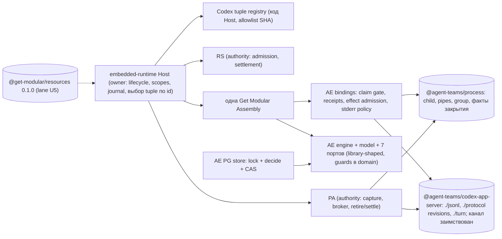
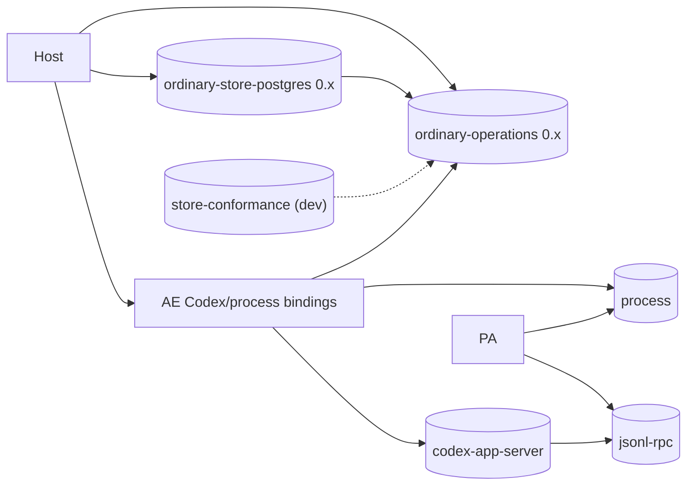

# Раунд 2, критик 4 из 4: скептик, безопасность и интеграционный план

- Исполнитель: независимый критик. Роль: `skeptic-integration`. Дата: 2026-10-01 (вечер).
- Статус: только анализ. Исходники, manifests, CI, SQL, pins и ADR не менялись. Install/build/test/typecheck не запускались, Codex-бинарь и providers не запускались, коммитов/PR/комментариев нет. Единственный созданный файл — этот отчёт.
- Snapshots (read-only, `git rev-parse HEAD` проверен мной):
  - agent-runtime `b0bcb265d1466da3272078f9dfdb7c6784624283` (через `gh api .../commits/main` — всё ещё current main, коммит 2026-09-30T20:30:40Z);
  - get-modular `9c722ceff4ede307d06d7a4b63fdebe615f54c53` (current main; открытых PR нет, `@get-modular/resources` в main нет);
  - `.github` `3fe0f135ffc446b3bb174397c6b5783f72a008a2` (PR #328 `OPEN`, head `255fa3b2c5cb6c70cba410d2c2d1e52216008772`);
  - engineering-foundation `b8ec0f17d1b8d6f9b7a45798931715d59a126888`;
  - openclaw `510beb8d52bd6be9fea27513b9008a50c92a1d2d` (upstream main на момент проверки `1ba51273303d263802c44d5473ee5631d6696ed3`, 2026-10-01T18:15:51Z; дельта проверена через `gh`, см. §6).

## Реально полученные внешние источники

Веб-поиска не было. Широкого online research не проводилось. Получено только следующее:

| Источник | Что получено |
|---|---|
| `gh issue view` openclaw #158383, #154419, #146265, #103884, #162768 | тела issues (миграции persisted state, глобальный scope, отставание версии Codex, дублирование version literal) |
| `gh pr view` openclaw #132621, #132745, #133111, #79152 | тела PR (orphan reaper, recycled pid, bump Codex и closed enum) |
| `gh search issues/prs` openclaw | только заголовки и номера |
| `gh api compare 510beb8d...c0c8fc9a` и `...1ba51273` | 41 и 45 коммитов вперёд; изменения `extensions/codex` в основном удаляющие рефакторинги |
| `gh api contents .../version.ts?ref=1ba51273` | `CODEX_APP_SERVER_VERSION = "0.158.0"`, floor `0.149.0` без изменений; blob `transport-process-registration.ts` идентичен 510beb8d |
| `gh api commits/main` для agent-runtime, get-modular, `.github`; `gh pr view 328`; `gh pr list` get-modular/agent-runtime | актуальность snapshots; открытые PR AR #184, #180, #72 |
| `gh search code` по `@agent-teams/embedded-runtime`, `ordinary_turn_operations_v3`, `createAgentRuntimeHost` | пусто. Это **не** доказательство отсутствия потребителей: поиск не находит даже сам AR |
| `npm view @openai/codex` (2026-10-01) | latest `0.159.3` (2026-09-30); после `0.153.4` (2026-09-04) вышло **12** стабильных релизов: 0.154.0 … 0.159.3 |
| Локально, read-only, вне snapshots | текущий workspace `<workspace>/AGENTS.md`; `plans/module-resource-scopes-design-2026-10-01.md`; соседний локальный checkout Subscription Runtime (`<private-repo>`); прочитанный файл совпадает с публичным `777genius/ar` @`7086f891` |

Остальное ниже — чтение snapshots. Чтение исходников не является production qualification.

Сокращения путей (относительно корня agent-runtime):
- `AE/` = `packages/contexts/agent-execution/src/features/contained-agent-turn/`
- `PA/` = `packages/contexts/provider-access/src/features/contained-turn-access/`
- `RS/` = `packages/contexts/runtime-security/src/features/contained-turn-dispatch-authority/`
- `ER/` = `packages/apps/embedded-runtime/src/`

---

## 0. Короткий вывод

Направление владельца **в целом улучшает систему в трёх местах** и **может навредить в трёх других**.

Улучшает:
1. **Свежий Codex — это не каприз, а эксплуатационная необходимость.** У OpenClaw backend отказал модели для устаревшего клиента («The 'gpt-5.6-sol' model requires a newer version of Codex», #103884). У нас 12 релизов отставания и exact pin. Но сегодня любой bump **ломает не только чтение ordinary-строк в AE** (это уже знали), а ещё **расчёт PA и RS по старым grants** и публичный mapper. Значит, единый источник tuple с decode-tolerant / claim-strict обязателен **до** первого bump (§4).
2. **Библиотеки механизма процесса и протокола Codex App Server обоснованы фактами, а не гипотезой.** Есть три независимые реализации в двух проектах: AE ordinary, PA auth capture и `JsonRpcLineClient` в `subscription-runtime`. Плюс Codex обновляется независимо. Это FMS v1 REUSE и DEPENDENCY_LIFECYCLE без всякой интерпретации (§7.2).
3. **Замена dormant SDK-growth гейта (U1)** снимает блокер, который не защищает ничего опубликованного. Новое: без неё **не пройдёт и миграция CMS pin под `@get-modular/resources` (U5)** (§5.6).

Может навредить:
1. **Публикация ordinary engine/model и PostgreSQL store как библиотек сейчас** съедает свободу «breaking OK» именно там, где она нужнее всего: в durable формате. Формат ещё будет меняться (v1, Codex revision, owner-loss). После публикации каждое изменение формата требует миграции чужих БД. EQS #328 прямо оставляет это требование: «Persisted user data, durable recovery state and in-flight work still need a safe migration».
2. **«Всегда свежий» в смысле автоследования за установленным бинарём (floor+warn, как у OpenClaw)** — регресс безопасности. SHA бинаря сейчас несёт нагрузку безопасности: (а) список отключённых features — denylist, и новые default-on features нового бинаря проходят валидацию; (б) PA запускает бинарь, выбранный вызывающим Host, против настоящего `auth.json` пользователя (§4.2).
3. **«Breaking changes OK» против данных:** если при переходе v3→v1 просто сбросить таблицу, теряется идемпотентность `commandId`. Повтор после `potential_acceptance` даст **второй запуск того же эффекта** (§3.3).

**Моя рекомендация (Вариант 1):** библиотеки механизма сейчас (`process`, `codex-app-server` с subpath `jsonl`), до этого — данные и tuple. Модель и store довести до library-shaped на месте, а выносить по триггерам. U5 вести параллельной lane с двумя поправками. Ядро программы **5000–9400 changed + 950–1790 moves**, плюс отдельные lanes: публичный API **800–1400** и U5 в AR **450–1000**. 🎯 7/10 · 🛡️ 8/10 · 🧠 6/10. Уверенность в LOC 3/10.

---

## 1. Разделение: цели, прошлые гипотезы, факты, мой выбор

**(a) Цели владельца.** Handoff §1 плюс приоритетные U1–U5: заменяемая заморозка SDK-growth (U1); library-first и допустимые breaking changes (U2, EQS #328); Codex в идеале всегда свежий (U3); строгая модульность и SOLID/Clean/DRY как цель (U4); параллельная программа `@get-modular/resources` с первым потребителем AR (U5). Неизменные ограничения: без новых фич, ordinary — единственный активный путь, сначала Codex, не ослаблять безопасность, authority и durable data.

**(b) Прошлые гипотезы (раунд 1, evidence, не решение).** Рекомендовался вариант «швы на месте → пакет процесса с PA → Codex-пакет по условию», 2200–4550 + 450–950 moves (`critique-synthesis.md:74-106`). Codex-пакет откладывался из-за FMS «one adapter / hypothetical consumer» (`synthesis.md:43`, N11). U2 запрещает использовать это правило как блокер для вероятно переиспользуемых компонентов. Поэтому вывод пересматриваю ниже по фактам.

**(c) Текущие факты** — §2–§6, с `file:line` и цитатами; VERIFIED и ASSUMPTION помечены.

**(d) Мой выбор** — §5.3–§5.6.

Важное уточнение по U2 (VERIFIED, текущий workspace `AGENTS.md:43-53`). Раздел «Library-first modularity at the early stage» сформулирован для `@get-modular/*`: «Owner direction recorded 2026-10-01 for Get Modular and our modularity libraries». На AR-библиотеки распространяется org-уровень EQS #328 (ещё не merged). Там же есть полезная оговорка: «the second-consumer rule above limits claims of a stable SPI, not where the code lives». То есть library-first разрешает **размещение** кода в пакете, но **не** разрешает заявлять стабильный SPI без второго потребителя. Это важно для варианта 2 (§5.3).

---
## 2. «Максимально модульная» карта: где extraction может ослабить инварианты

Для каждой границы указано: какой инвариант держится сегодня и где (VERIFIED), чем рискует extraction, и какой должна быть граница, чтобы его не ослабить.

### 2.1 `process` (child, pipes, signals, bounded bytes, physical closure)

| Инвариант сегодня | Где | Риск при выносе | Обязательная форма границы |
|---|---|---|---|
| Запуск только после durable claim, ровно один раз | `AE/adapters/outbound/ordinary-process/node-ordinary-process.ts:143-149`: `if (attempted \|\| closing) { throw refusal(); } attempted = true;` и сверка `claim.reservationId !== reservationId …` | Generic-библиотека не знает claim. Если её `start()` будет доступен всем, кто держит reservation, инвариант держится только дисциплиной вызывающего | В библиотеке остаётся только «start ровно один раз». Сверку claim делает AE binding, который единственный держит library reservation и отдаёт engine свою обёртку. Engine по-прежнему видит `start(claim, signal)` (`AE/application/ordinary-ports.ts:48`) |
| Синхронный write-ahead hook до spawn; Promise считается отказом | `node-ordinary-process.ts:74-78` (`if (acknowledged !== undefined) {… throw refusal();}`), `:151-152` (`record({… kind: "launch_requested"}); spawnInvoked = true;`); PA: `PA/adapters/outbound/ordinary-codex-auth-capture.ts:18` (`types.isAsyncFunction(input.record)` → отказ) | Типичный library-API на событиях (`EventEmitter`) или async hook делает intent «best effort» и теряет write-ahead | `onObservation` обязан вернуть `undefined` синхронно. Promise или throw — отказ до spawn. Сделать это частью контракта и rejecting-теста библиотеки |
| Не сигналить группе после наблюдённого выхода лидера | `node-ordinary-process.ts:102-103`: «An exited leader cannot justify signalling a possibly recycled process group.»; PA `ordinary-codex-auth-capture.ts:73-74` | Удобный `kill()` в публичном API без проверки `exited` | Эскалация TERM→KILL только внутри handle и только пока `!exited`. Публичного «kill by pid» нет |
| Общий бюджет 1 MiB на stdout+stderr | `node-ordinary-process.ts:106-107` и `:163` (один `totalBytes`) | После переноса framing на сторону клиента stderr клиенту не виден, и бюджет легко разрезать на два | `maxTotalBytes` — опция процесса, общая на оба потока. У PA другие значения (262 144 на оба потока, `PA/adapters/outbound/ordinary-codex-auth-ipc.ts:78-83`), значит это параметр, а не константа |
| Fatal UTF-8 на stderr с обнулением | `node-ordinary-process.ts:163` (`stderrDecoder.decode(…)`; `bytes.fill(0)`) | Библиотека «просто отбрасывает stderr» | Политика stderr — enum (`discard` / `validate-utf8-and-discard`), по умолчанию строгая |
| Обнуление секретных байтов stdout в PA | `PA/…/ordinary-codex-auth-ipc.ts:79-100` (фиксированный буфер 64 KiB, `frame.fill(0, 0, used)`, `chunk.fill(0)` в `finally`) | Pull-итератор с внутренней очередью чанков создаёт необнуляемые копии секрета | Режим без внутренней очереди: либо синхронный sink «буфер валиден только во время callback», либо pull с backpressure и без удержания ссылок. Обнуление остаётся у PA. Это best effort: `JSON.parse` всё равно создаёт строки |
| Раздельные факты закрытия | `node-ordinary-process.ts:47-53` (`closed`, `exited`, `stdoutClosed`, `stderrClosed`, `unread`, `groupExists`), `:186-188` | Один `closed: true` или «success» в результате | Структурный результат: `exitObserved`, `stdoutEof`, `stderrEof`, `unreadBytes`, `groupEmptyObserved` или `uncertain`. `output_drain` собирает AE binding из фактов процесса, чистого EOF клиента и `finalSequence` engine (r1 core F6) |
| `close()` идемпотентен, успех мемоизирован, после ошибки повтор | `node-ordinary-process.ts:171-204` (`closePromise ??=`, сброс при ошибке) | При переходе на scope (U5) cleanup может вызываться дважды: engine и backstop | Так и оставить. Повторный вызов после успеха возвращает те же факты. Это совместимо с инвариантом 8 resources (single-flight) |

Вывод: **библиотека процесса не ослабляет инварианты, если claim, receipts и журнал остаются в AE binding, а библиотека отдаёт факты и синхронный hook.** Это граница типа «самостоятельная библиотека». Authority boundary здесь нет.

### 2.2 `jsonl` (строгий bounded framer и JSON-RPC envelope)

| Инвариант | Где | Риск | Форма |
|---|---|---|---|
| Отказ от незавершённого хвоста на EOF | `AE/adapters/outbound/codex-app-server/codex-app-server-jsonl.ts:226-228` («closed with an unterminated message»); process `node-ordinary-process.ts:162` | У OpenClaw framer доставляет хвост как строку (r1 skeptic §5.1). Взять «популярное» поведение = ослабить | Опции «принять хвост» в 0.x нет |
| Fatal UTF-8, duplicate decoded keys, только JSON object | `codex-app-server-jsonl.ts:203-216` | В AE нет лимита вложенности, в PA он есть (`PA/…/ordinary-codex-auth-json.ts:22`: `stack.length > 32`). При слиянии можно взять более слабый вариант | Взять строгое объединение: duplicate keys + лимит глубины + лимит строки + лимит сообщений и байт |
| Одна запись на request, без повтора | `AE/…/ordinary-codex/ordinary-codex-protocol.ts:32-46`; `ordinary-codex-provider.ts:101-102`: «This is the only turn/start write…» | Библиотека для «любого harness» соблазняется retry на transient error (у OpenClaw retry при `-32001`) | По умолчанию retry нет. Ошибка несёт disposition `not_written` / `possibly_written` / `answered`. Любой retry — политика вызывающего |
| Id: строки в AE, числа в PA | `codex-app-server-jsonl.ts:94` (только string id); `PA/…/ordinary-codex-auth-ipc.ts:117` (`const id = ++sequence`) | Унификация, ломающая один из путей | Envelope принимает `string \| number`; выбор id — у вызывающего |

Это тоже библиотечная граница. Отдельный ли это пакет — см. §5.4.

### 2.3 `codex-app-server` с versioned protocol

| Инвариант | Где | Риск | Форма |
|---|---|---|---|
| Effect admission: пути внутри cwd, allowlist типов items | `AE/…/ordinary-codex/ordinary-codex-items.ts:37-45` (`inside(cwd, change.path)`), `:65` (неизвестный `item.type` → отказ) | В library-first клиенте «полная валидация Codex items» уходит в vendor-библиотеку. Потом мейнтейнер делает её tolerant под новую revision и молча ослабляет security | Библиотека даёт структурную валидацию по revision. **Effect admission (пути, типы эффектов, отказ на неизвестный тип item)** остаётся exact в AE binding, через hook |
| Проверка эффективного sandbox и config | `ordinary-codex-provider.ts:34` (`sandbox … networkAccess: false …`), `ordinary-codex-config.ts:108-114` | То же | Security-проверки — AE (политика), не библиотека |
| Revision выбирается доверенным Host, handshake её только подтверждает | `ordinary-codex-provider.ts:31` (`cliVersion !== "0.153.4"`), `:147` (regex user agent) | Удобная «автодетекция revision по `initialize.userAgent`» означает доверие самоотчёту бинаря. Это модель OpenClaw (`extensions/codex/src/app-server/client-initialize.ts:61-80`@510beb8d) | `protocolRevision` приходит из tuple, выбранного Host. Handshake сверяет равенство и при расхождении отказывает |
| Клиент заимствует канал и не владеет процессом | r1 консенсус; у OpenClaw `client.ts:742-752` client закрывает transport | Библиотека «для удобства» получает `close()`/`kill()` | В API клиента нет ничего, что закрывает процесс. Только `detach()` / `stopAdmission()` |

### 2.4 `ordinary-operations` (engine, model, ports, решения)

| Инвариант | Где | Риск | Форма |
|---|---|---|---|
| Claim перед start; unknown claim не запускает | `AE/application/ordinary-engine.ts:83-99` | Сам перенос безопасен. Опасна «универсализация» API engine (например, retry или resume-хуки для чужих harness) | Без новых хуков. Перенос только moves |
| Guards переходов store | inline в SQL-адаптере: `AE/adapters/outbound/postgres/ordinary-postgres-store.ts:108, :115, :124, :131` | Опубликованный SPI store заставит каждую реализацию повторять неформализованные guards (LSP). Если SPI будет «generic repository read/write», атомарность сломается | До выноса — чистые decision-функции в domain. SPI store — **именованные атомарные методы**, реализуемые как lock → decide → CAS |
| Асимметрия revision: prepare/claim сверяют caller revision, cancel/append работают с текущей locked-записью | `ordinary-postgres-store.ts:108, :115` против `:121-126, :128-134` | Единый CAS «для порядка» на все записи: cancel параллельно append получит CAS conflict и потеряет запрос отмены | Сохранить асимметрию в контракте SPI и в conformance |
| PA consume одноразовый, RS идемпотентный | PA `PA/adapters/outbound/postgres/ordinary-pa-store.ts:72-75` (`ON CONFLICT … DO NOTHING`, `rowCount !== 1` → fail); RS `RS/adapters/outbound/postgres/ordinary-security-owner.ts:75-81` (возвращает существующий unsettled grant) | Общий `AuthorityPort` или conformance «resolveAndConsume идемпотентен» заставит PA выдавать повторную материализацию credentials. Это прямое ослабление | Два разных типа портов с явными JSDoc-контрактами. Никакого общего базового порта |
| Restart-семантика | нет owner-loss/reconcile (r1 skeptic F11, core F5) | Публичный engine без записанной restart-семантики фиксирует «бесконечный running» как контракт | До выноса записать хотя бы проекцию «orphaned non-terminal → reconcile_required» как решение (поведение — отдельная задача) |
| Type closure тянет contained-turn domain | `AE/domain/ordinary-model.ts:1-2` (импорт `ContainedTurnAuthorityScope`, `ContainedTurnKernelOutputKind`) | Пакет либо зависит от AE, либо копирует примитивы (DRY) | Сначала разделить владение примитивами внутри AE (§2.7) |

### 2.5 `ordinary-store-postgres`

| Инвариант | Где | Риск | Форма |
|---|---|---|---|
| Unknown COMMIT → readback/`unknown`, никогда не право на dispatch | `ordinary-postgres-store.ts:63-66, :92-100, :119` | Библиотечный «retry транзакции» | Retry нет; `unknown` — отдельный исход |
| Сверка ключа строки с payload (G1) | отсутствует: `#read` только декодирует (`:71-74`), `#write` берёт WHERE из payload (`:77`) | Conformance kit закрепит дефект | Исправить до любого SPI |
| Schema как явная миграция | `:48`: «Explicit migration, never an effect of constructing the borrowed-pool adapter.»; но Host вызывает её в фабрике: `ER/features/ordinary-session-runtime/composition/ordinary-agent-runtime-host.ts:74` | Опубликованный store потянет схему в конструирование Host у чужих потребителей | Миграция — отдельная команда с отчётом; см. §3.4 и урок OpenClaw #158383 |

### 2.6 Consumer SDK (`operations`, curated `./host`)

| Инвариант | Где | Риск | Форма |
|---|---|---|---|
| `potential_acceptance` — не разрешение на повтор | `ER/features/contained-turn-runtime-access/contracts/runtime-access.ts:255`: «these references are evidence, not a persisted operation or retry permission» | При rename потерять или переименовать различие outcomes | Rename-only PR с type-level parity старого и нового union |
| Ordinary отличается от contained **по наличию profile-полей** в owner snapshot | `ER/features/contained-turn-runtime-validation/composition/contained-turn-runtime-validation.ts:192-194` (`isOrdinaryOwnerTurn` = любое из трёх полей задано); `:200-206` (для ordinary refs требуются только при `succeeded`) | Рекомендация r1 «убрать Codex-литералы из публичного view» без замены дискриминатора: ordinary `failed` без artifact refs будет принят за contained, и mapper вернёт `undefined` | Заменить дискриминатор явным полем или раздельными mapper'ами **в том же PR**, что и удаление литералов |
| Литерал tuple в публичном типе | `runtime-access.ts:233`; mapper `contained-turn-runtime-validation.ts:196-199, :257` | Rename до tuple — два публичных break | Сначала tuple (§4), потом rename |

### 2.7 Общие примитивы (canonical codec, exact record, limits, fingerprint)

| Инвариант | Где | Риск | Форма |
|---|---|---|---|
| Fingerprint команды — durable identity, пересчитывается при каждом decode | `AE/domain/contained-turn-authority.ts:188-195` (`version: 1` внутри canonical input); `AE/domain/ordinary-validation.ts:65` | Если вынести в свободно эволюционирующий 0.x «utils» пакет, безобидная правка канонизации (порядок ключей, нормализация) сделает **каждую** сохранённую строку невалидной (decode бросит), а duplicate accept начнёт отвечать `conflict` на законный повтор | Hash/canonicalization — часть **format identity**: golden vectors, отдельная версия алгоритма, изменение только с миграцией. «Breaking OK» к ним **не относится** |
| Digest состояния | `AE/adapters/outbound/postgres/ordinary-state-codec.ts:15, :25` | То же | То же |
| DRY против «utils dumping ground» | EQS: «Avoid unowned `shared` or `utils` dumping grounds» | Пакет-свалка без владельца | Если выносить, то только как часть `ordinary-operations` (владелец формата). Contained импортирует оттуда, а не наоборот. Отдельный пакет «primitives» не делать |

### 2.8 Четыре разных понятия по этим границам

| Граница | Внутренний порт | Поддерживаемый внешний SPI | Самостоятельная библиотека | Security/authority | Единица публикации |
|---|---|---|---|---|---|
| process | AE `OrdinaryProcessPort` остаётся | нет | **да** | нет | пакет 0.x (private до решения о публикации) |
| jsonl / codex-app-server | AE byte channel (непрозрачный) | нет | **да** | нет (политика в AE) | пакет 0.x |
| Codex tuple registry | — | нет | нет | **да** (выбор доверенным Host; allowlist SHA) | модуль Host, не пакет |
| ordinary-operations | 7 портов | только после триггеров | позже | частично (claim) | позже |
| store-postgres | `OrdinaryOperationStore` | только после G1 и R1c | позже | нет | позже |
| PA / RS | — | **нет** (не открывать ради симметрии) | нет | **да** | — |
| consumer SDK | — | публичный API продукта | entrypoint существующего пакета | scope binding | `@agent-teams/embedded-runtime` |

---
## 3. «Breaking changes OK» против durable данных

### 3.1 Что именно лежит в БД (VERIFIED)

Ordinary-состояние хранится в **трёх** местах, у трёх владельцев. Codex revision встроена во все три.

| Хранилище | Форма | Идентичность формата | Codex revision внутри |
|---|---|---|---|
| AE `ordinary_turn_operations_v3` (схема по умолчанию, без квалификатора) | `ordinary-postgres-store.ts:16-20`: `PRIMARY KEY (tenant_id, project_id, operation_id), UNIQUE (tenant_id, project_id, command_id)`; state — JSON envelope | `codecVersion: 3, schemaVersion: 3` (`ordinary-state-codec.ts:15`) | envelope, payload и **каждый receipt** (`AE/domain/ordinary-model.ts:8-14`: receipt = `OrdinaryBinding & …`) |
| PA `provider_access.ordinary_grant`, `provider_access.ordinary_request` | `PA/adapters/outbound/postgres/ordinary-pa-schema.ts:5-21` | компонент `'ordinary-pa-v1'`, version 1 + **digest DDL** (`:48-51`, `:58-61`) | `binding jsonb`; триггер запрещает его менять |
| RS `runtime_security_ordinary_grants_v1` | `RS/adapters/outbound/postgres/ordinary-security-owner.ts:13, :69` | уже `_v1` | `state` с `input`, `policy`, `authority`, `settlement` |

Новое наблюдение: **формат «v3» есть только у AE.** PA и RS ordinary уже «v1». Значит, цель «один v1» сводится к переименованию одного AE-формата, а эволюция Codex revision — это **другая миграция**, которая затрагивает все три хранилища. Прошлые отчёты их частично смешивали.

### 3.2 Что ломает bump Codex на текущем коде (VERIFIED по чтению; не исполнялось)

1. **AE.** Decode сравнивает литерал строго: `ordinary-state-codec.ts:23` (`envelope.capabilityManifestRevision !== ORDINARY_PROFILE.capabilityManifestRevision` → `TypeError("ordinary envelope profile invalid")`), `ordinary-validation.ts:61` и `:81` (receipts сверяются с binding из текущей константы). Старые строки перестают читаться. `observe`, `cancel` и duplicate `accept` (`ordinary-postgres-store.ts:88-91` декодирует prior) бросают исключение. Тот же `commandId` невозможно ни увидеть, ни переиспользовать.
2. **PA.** `PA/domain/ordinary-provider-access.ts:25-26`: `get('capabilityManifestRevision') !== 'ordinary-codex-macos-arm64-0.153.4-v1'` → `OrdinaryPaBindingInvalid`. Его вызывают `decodeRow` (`ordinary-pa-store.ts:27-29`) и **каждый** метод store, включая `retire` (`:79-89`) и `settle` (`:90-98`). **Credential retirement и settlement grants, выданных до bump, становятся невыполнимыми.** Это не только «не видно», это незакрываемый долг authority. Раньше этого не отмечали.
3. **RS.** `ordinary-security-owner.ts:21`: `JSON.stringify(capturedPolicy) !== JSON.stringify(policy)` → `ordinarySecurityDenied`. Policy включает revision (`RS/domain/ordinary-security-policy.ts:15, :39`). Settlement старых RS grants тоже невозможен.
4. **Публичный mapper.** `contained-turn-runtime-validation.ts:196-199` требует точный литерал. Публичный `observe` старой операции не отдаст view.
5. **Engine view лжёт даже при tolerant decode.** `AE/application/ordinary-engine.ts:9` собирает view через `...ORDINARY_PROFILE`, а не из полей операции. Если сделать decode tolerant и ничего больше, старая операция будет показана с **текущей** revision.

Следствие для U3: **до единого источника tuple любой bump недопустим. Это жёсткое ограничение порядка, а не стиль.**

### 3.3 Что ломает «простой» переход v3 → v1

1. **Идемпотентность `commandId` — durable контракт с вызывающим.** Публичный API прямо говорит, что `potential_acceptance` — «evidence, not … retry permission» (`runtime-access.ts:255`). Корректный клиент после неопределённого ответа повторяет submit **с тем же `commandId`**, чтобы получить duplicate (`ordinary-postgres-store.ts:86-91`). Если cutover создаёт новую таблицу и бросает старую, повтор с тем же `commandId` создаст **новую операцию и второй эффект**. Это нарушает «safe recovery without duplicate effects» (`dotgithub/docs/engineering-quality-standard.md:47-50`). ASSUMPTION: реальных таких клиентов сегодня нет. Но правило обязано быть в процедуре.
2. **Accepted ADR задаёт процедуру удаления reader.** `docs/decisions/0090-…md:45-46`: «Rollback closes new admission and reconciles in-flight ordinary records before removing the reader; it never replays them as V1.» Переход на v1 и есть удаление reader codec 3. Пока нет successor ADR, процедура нормативна (repo `AGENTS.md`: «Treat accepted ADRs … as normative»).
3. **Коллизия имени «V1».** ADR-0090:42-46 называет «V1» исторический contained-формат. В AE уже есть таблица `agent_execution.contained_turn_operation_v1` (`AE/adapters/outbound/postgres/contained-turn-postgres-migration-artifacts.ts:15`). Голое `ordinary…_v1` / `schemaVersion: 1` создаёт двусмысленность (r1 skeptic это отметил; подтверждаю на SQL-уровне).
4. **PA DDL нельзя менять «между делом».** Триггер `ordinary_grant_identity_immutable` (`ordinary-pa-schema.ts:22-35`) запрещает DELETE («IF TG_OP = 'DELETE' THEN RAISE EXCEPTION») и изменение `binding`. `assertOrdinaryPaSchema` (`:49-52`) сверяет digest DDL на каждой транзакции. Любая правка текста DDL на существующей БД переводит **весь** PA ordinary в `OrdinaryPaUnavailable`, пока не написана явная миграция. Это хорошая fail-closed защита. Её следствие: «breaking OK» для PA-формата **не бесплатно даже без данных**, если БД уже инициализирована.

### 3.4 Обязательный минимум безопасной миграции (даже в MVP)

EQS #328 (`eqs-pr328.diff:39-44`) и ADR-0090:45-46 требуют одного и того же. Предлагаю минимальную процедуру без compatibility framework:

1. **Drain, а не reader.** Закрыть admission и дождаться завершения disposal Host. Engine уже умеет это: `dispose` отменяет flights, ждёт их и выполняет cleanup (`ordinary-engine.ts:257-269`). Turn ограничен 45 с, authority TTL — 60 с (ADR-0090:114-117), поэтому drain ограничен примерно минутой.
2. **Guard перед cutover (fail-closed, детерминированный).** Миграция отказывает, если в старой таблице есть строки `accepted`/`running`, либо `reconcile_required` без settled PA/RS grants. Если строк нет, старая таблица удаляется. Если строки только терминальные, их `commandId` переносятся в новую таблицу как резерв идемпотентности (tombstone).
3. **Guard не должен ронять весь Host.** Сегодня схемы применяются в фабриках Assembly (`ordinary-agent-runtime-host.ts:74, :77, :82`). Ошибка миграции валит создание Host целиком, вместе с passive setup. Это тот же класс, что OpenClaw #158383 (§6). Отказ guard должен делать недоступной **только ordinary-capability** (`capability_unavailable`), а лучше быть отдельной командой миграции.
4. **Не трогать retained-ресурсы.** `workspaceRoot`, `artifactRoot`, `evidenceRoot` и JSONL-журналы (`ER/features/ordinary-session-runtime/adapters/ordinary-observation-journal.ts:51`) — evidence reconciliation. Cutover их не чистит.
5. **Отдельная format identity** (например, `ordinary.operation/1` и таблица в квалифицированной схеме) вместо голой цифры. Совпадает с r1 skeptic.
6. **Golden vectors для fingerprint и digest** в том же PR (§2.7).

Оценка: guard + tombstone + изменение identity — 250–500 changed, включая тесты.

### 3.5 Что можно упростить

- Исторический reader codec 3 **не нужен**, если guard доказал отсутствие нетерминальных строк. Это совпадает с целью владельца «без лишних readers».
- PA и RS ordinary уже v1: переименовывать нечего, DDL не трогать.
- Отдельный framework миграций не нужен: одна одноразовая проверка плюс tombstone.
- Если владелец подтверждает, что ни одна персистентная БД не видела ordinary Host, guard сводится к проверке «таблица пуста или отсутствует».

### 3.6 Есть ли реальные ordinary-записи

VERIFIED по репозиторию:
- В `docs/architecture/qualification-registry.json` ordinary-записей нет. Ближайшая — contained `codex-app-server-contained-turn:0.153.4…` (`:1140-1141`).
- ADR-0090:197: «The prior P0 is closed FAIL with zero provider attempts.»
- Postgres-тесты создают одноразовую схему на каждый прогон: `ordinary_test_${randomUUID()}` (`packages/contexts/agent-execution/tests/features/contained-agent-turn/ordinary-core-postgres.test.ts:10`).
- `gh search code` ничего не нашёл, но AR он не находит вообще, так что это не evidence.

ASSUMPTION: production-записей нет. Но ни код, ни документы не доказывают отсутствие строк в локальной или dev-БД владельца, где запускался `createAgentRuntimeHost`. **Вопросы владельцу** — §11, Q2.

---
## 4. «Всегда свежий Codex» против безопасности

### 4.1 Что защищает каждый pin (VERIFIED)

| Pin | Где | Что защищает | Можно ли ослабить |
|---|---|---|---|
| SHA-256 бинаря (AE) | `AE/adapters/outbound/ordinary-codex/ordinary-codex-config.ts:13, :66` | Запуск только проверенного бинаря; косвенно — набор default-on features (см. ниже) | **Нет** как allowlist. Можно сделать дешёвым добавление новой проверенной записи |
| SHA-256 бинаря (PA, вторая копия) | `PA/adapters/outbound/ordinary-codex-auth-contracts.ts:3` | **Бинарь, который PA запускает против настоящего `auth.json` пользователя** (симлинк источника, ADR-0090:104-108). `executablePath` задаёт вызывающий Host (`ordinary-agent-runtime-host.ts:16, :83`) | **Нет.** Если digest станет опцией Host, вызывающий `createAgentRuntimeHost` сможет подсунуть PA любой бинарь вместе с credentials пользователя |
| Список отключённых features — **denylist** | `ordinary-codex-config.ts:14-17`; проверка `:110-111` (`ORDINARY_CODEX_DISABLED.every(key => features[key] === false)`); `containsExpected` не покрывает `features` | Отключает известные опасные features | **Сейчас это дыра, которую закрывает только SHA.** Новый бинарь может принести default-on feature (новый tool или сетевой канал), которой нет в списке, и проверка её пропустит. До ухода от exact SHA денилист нужно превратить в allowlist: «каждый ключ `features` равен `false`, кроме проверенного списка» |
| `cliVersion`, regex user agent | `ordinary-codex-provider.ts:31, :147` | Handshake подтверждает выбранный tuple | Да: брать значение из tuple, сверять на равенство |
| Эффективный sandbox, permissions, layers | `ordinary-codex-provider.ts:32-34`; `ordinary-codex-config.ts:95-125` | Сеть выключена, нет login shell, нет MCP/plugins, единственный user layer | **Нет.** Exact для каждого tuple |
| Allowlist типов items и пути внутри cwd | `ordinary-codex-items.ts:37-45, :65` | Effect admission | **Нет.** Неизвестный тип item → отказ при любом tuple |
| Exact-key для информационных уведомлений | `ordinary-codex-protocol.ts:188-214` (rate limits, credits, spend), `:216-221` (passive) | Почти ничего: эти поля не несут authority | **Да, но только явным решением владельца.** Терпимость к лишним ключам, сохраняя лимиты. Это главный источник цены каждого bump |
| Broker: header `version`, модель, `stream` | `PA/adapters/outbound/ordinary-pa-broker.ts:61, :66` | Граница egress credentials: что брокер подписывает | **Нет.** Значения брать из tuple, сверять exact |
| Политика RS и binding PA с литералом revision | `RS/domain/ordinary-security-policy.ts:6, :15, :39`; `PA/domain/ordinary-provider-access.ts:8, :25-26` | Defense in depth: grant привязан к профилю | Да для чтения и расчёта (принимать известные revision), **нет** для новых grants (только активная) |

### 4.2 Чего нельзя ослабить

1. **Allowlist бинарей остаётся кодом, а не конфигурацией.** Реестр проверенных tuple компилируется в продукт и проходит ревью. Host выбирает tuple **по id**; digest, модель и header опции Host не задают. Тогда «trusted outer selection with immutable descriptor» (handoff §4.1) не превращается в «caller string».
2. **Security-проверки exact для каждого tuple:** sandbox, permissions, layers, server requests, approval policy, effect items, egress брокера.
3. **Новые grants и новые запуски — только для активного tuple** (claim-strict). Чтение, отмена, retirement и settlement — для любого известного tuple (decode-tolerant). Иначе bump оставляет незакрываемый долг (§3.2).

### 4.3 Минимальный безопасный механизм обновления (предложение, не реализация)

1. **Реестр tuple в Host** — по одному файлу на tuple: `cliVersion`, SHA по платформам, `capabilityManifestRevision`, модель, pattern user agent, allowlist features, header версии, ожидаемые тексты warning, `protocolRevision` и digest схемы. Статус tuple: `active` / `retired`.
2. **Durable identity = id tuple** (поле уже есть: `capabilityManifestRevision`). AE codec/validation, PA binding и RS policy принимают любой id из реестра. Claim, consume, materialize и launch требуют `active` и равенства с выбранным Host. View берёт revision **из операции** (исправить `ordinary-engine.ts:9`).
3. **PA и RS получают от Host политику revision** (`active` и `known`), а не держат свои литералы. Owner-local проверки сохраняются: PA и RS по-прежнему отказывают в новом grant для неактивного tuple.
4. **Protocol revisions в `codex-app-server` — данные**, а не ветвления кода. Прецедент уже есть: `packages/contexts/agent-execution/tests/fixtures/protocol/codex-app-server-0.153.4/generate-runtime-item-schema.mjs` и `manifest.json` с generated-схемой `CODEX_ITEM_SCHEMA_SOURCE_SHA256` (`AE/adapters/outbound/codex-app-server/generated-codex-item-schema.ts:1-2`). Новая revision — новый каталог фикстур плюс перегенерация.
5. **Процедура bump:** drain (§3.4) → новый файл tuple + фикстуры → офлайн synthetic-тесты протокола → живая квалификация в disposable-окружении с разрешения владельца → `active`. Старый tuple становится `retired`, но остаётся читаемым.
6. **Первый bump (0.153.4 → latest) сделать сразу после реестра, как design probe**, до фиксации API `codex-app-server`. Тогда граница revision спроектирована по реальному diff двух версий, а не по воображаемому.

Цена bump после этого — ориентировочно файл tuple на 40–80 строк плюс перегенерированные фикстуры, без правок domain-кода AE/PA/RS. Сегодня: 22 production-файла (13 ordinary) и 210 вхождений в 103 тестовых файлах (`grep -c "0\.153\.4"` по `packages/**/tests`), плюс 8 docs/evidence-файлов.

### 4.4 Почему не floor+warn, как у OpenClaw

OpenClaw: «Inclusive runtime compatibility floor» `0.149.0`, для более новых — только warn («continuing with normal startup validation») (`extensions/codex/src/app-server/version.ts:1-4`, `client-initialize.ts:61-80`@510beb8d; на current main `1ba51273` без изменений). У OpenClaw Codex — агент пользователя с полным доверием пользователя. У нас PA брокерит credentials, а главный процесс Codex сырых credentials не получает (ADR-0090:122-125). Модель угроз строже. Автоследование за бинарём ослабило бы egress-границу и открыло дыру denylist. **Это место, где направление «всегда свежий» в буквальном прочтении вредит.** «Свежий» должен означать «дешёвый проверенный bump», а не «любой установленный бинарь».

---
## 5. Объём, варианты и план

### 5.1 Реальные размеры (VERIFIED, `wc -l`)

| Область | Файлы и строки |
|---|---|
| Процесс | `node-ordinary-process.ts` 208; PA spawn/finish в `ordinary-codex-auth-capture.ts` 169 и `-ipc.ts` 169 (механизм процесса ≈100 из них); тест `ordinary-node-process.test.ts` 223 |
| JSONL | `codex-app-server-jsonl.ts` 240 (импортируют 15 файлов AE, включая contained); `codex-app-server-linear-framing.test.ts` 92; PA `ordinary-codex-auth-json.ts` 37 |
| Codex wire | `ordinary-codex-protocol.ts` 222, `-items.ts` 170, `-provider.ts` 155, `-config.ts` 125; `codex-app-server-item-schema.ts` 106 плюс generated (3 строки, 22 129 байт); `ordinary-codex.test.ts` 192 |
| Ordinary core | `ordinary-engine.ts` 271, `-ports.ts` 68, `-model.ts` 71, `-validation.ts` 144, `ordinary-feature-factory.ts` 19; примитивы `contained-turn-codecs.ts` 139, `-record.ts` 79, `-limits.ts` 54, `-authority.ts` 280, `-kernel-model.ts` 143; `ordinary-core.test.ts` 357 |
| Store | `ordinary-postgres-store.ts` 152, `ordinary-state-codec.ts` 27 |
| Host/SDK | `ordinary-agent-runtime-host.ts` 132, `ordinary-runtime-assembly.ts` 75, `ordinary-owner-acl.ts` 30, `ordinary-observation-journal.ts` 85, `runtime-access.ts` 292, `contained-turn-runtime-access.ts` 474 |
| PA/RS ordinary | `ordinary-pa-broker.ts` 186, `ordinary-pa-store.ts` 125, `ordinary-pa-schema.ts` 63, `ordinary-provider-access-owner.ts` 191; RS `ordinary-security-owner.ts` 94, `ordinary-security-policy.ts` 74 |
| Governance | `source-dependencies.yaml` 3013, `consumer-profile.json` 6302, FMS `candidate-profile.json` 828, `ordinary-scope.json` (43 файла в scope); на `filesystem-custody` ссылаются 56 не-evidence файлов вне самого пакета |

### 5.2 Governance-налог

- Один новый пакет стоит **≈300–550 changed** только на governance: manifest и tsconfig, Foundation `packageRoots`/boundary, рёбра в `consumer-profile.json`, FMS-профиль, ADR, single-root packed proof. Это подтверждают r1 skeptic F8 и libraries F18; я перепроверил число ссылок.
- Write-режима для census нет. В `get-modular-source-census.mjs` и `check-get-modular-adoption.mjs` нет `--write` и `writeFileSync` (VERIFIED grep). Рёбра правятся вручную.
- **Скрытое ослабление при переименованиях и переносах.** `scripts/architecture/check-ordinary-feature-scope.mjs:13` считает ordinary-источником файл, если путь в feature **или** имя файла содержит `ordinary`. На `:54` в профиль обязательно включаются только такие файлы. Если файл переименовать (`ordinary-engine.ts` → `operations-engine.ts`) или перенести в новый пакет и одновременно убрать из `files`, проверка **молча** сужается. Каждый PR с rename/move должен расширять профиль явными корнями, а не полагаться на regex.
- *Моё предложение (tooling, не фича):* генератор census с режимом `--check` до начала extraction. Снижает налог для варианта 2 сильнее, чем для варианта 1. 200–400 строк.

### 5.3 Три варианта

LOC = additions + deletions кода, тестов, docs, manifests и gates. Moves — логические строки, перенесённые без изменения, считаются отдельно. Отдельные lanes (публичный API, U5 в AR) в «ядро» не входят, чтобы не смешивать бюджеты. Время работы агентов в трудоёмкость не входит.

#### Вариант 1 (Recommended): сначала данные и tuple, затем библиотеки механизма; модель library-shaped на месте



Владельцы ресурсов. Child и группа процессов — handle `process`, владеет им AE binding или PA capture. Канал Codex — только заимствован клиентом. Pool заимствован у вызывающего. Workspace — AE. Credentials и grants — PA и RS. Журнал и scopes — Host. Порядок закрытия Host: owners → журнал (§5.6).

| PR | Содержание | Changed | Moves |
|---|---|---:|---:|
| 0 | Записи решений: ADR extraction по FMS v1 (REUSE + DEPENDENCY_LIFECYCLE), ADR реестра tuple и процедуры bump (successor части ADR-0090), ADR замены SDK-growth, обещания и не-обещания пакетов, ответ владельца об инвентаризации данных | 200–400 | 0 |
| 1 | U1: заменить заморозку лёгкой активной проверкой (inventory с явным добавлением пакетов, tiers exports, без hash архивов и без связки с EF 1.6.0), пометить evidence историческим. Цепочку CMS pin не дублировать: её уже проверяет `check-consumer-module-standard.mjs:374, :418-419` | 500–1000 | 0 |
| 2 | Швы на месте: непрозрачный байтовый канал в портах AE, LaunchRecipe в портах AE, framing на стороне Codex внутри AE с parity-матрицей, удаление `prepared` Map, гигиена manifest AE | 400–800 | 0–60 |
| 3 | Реестр tuple: decode-tolerant / claim-strict в AE (codec, validation, store, view), PA (binding, store), RS (policy, decode), ER mapper; header и модель брокера из tuple; allowlist features вместо denylist | 700–1300 | 0–80 |
| 4 | Формат ordinary v1: отдельная identity, guard миграции, tombstone `commandId`, отказ только ordinary-capability; golden vectors fingerprint/digest | 250–500 | 0 |
| 5 | `@agent-teams/process` + AE binding + single-root packed proof + governance | 800–1400 | 150–300 |
| 6 | `@agent-teams/codex-app-server`, часть 1: scaffold и governance, `./jsonl` (framer + envelope + disposition), перенаправление 15 импортёров | 400–700 | 250–350 |
| 7 | `@agent-teams/codex-app-server`, часть 2: `./protocol` с revisions как данными, разделение валидаторов на exact (security) и информационные, `./turn`, AE binding с effect admission через hook | 700–1250 | 400–650 |
| 8 | PA переходит на `process` и `codex-app-server/jsonl` + строгие валидаторы; обнуление остаётся в PA; ревью владельца PA | 300–600 | 0–50 |
| 11 | Модель library-shaped на месте: guards в domain (R1c), сверка ключа G1, разделение владения примитивами внутри AE, Foundation boundary «только builtins» для ordinary core, явные корни в `ordinary-scope.json` | 600–1100 | 150–300 |
| 12 | Docs, guidance, профили | 150–350 | 0 |
| **Ядро** | | **5000–9400** | **950–1790** |
| 9 (lane API) | `operations`, curated `./host`, удаление Codex-литералов из публичного view **с явным дискриминатором** (§2.6), имя passive factory, successor ADR-0090 | 800–1400 | 0 |
| 10 (lane U5) | Миграция CMS pin (с разделом resources), catalog `@get-modular/resources@0.1.0`, стек cleanup Host → scopes; журнал закрывается после owners | 450–1000 | 0 |
| **Полностью** | | **6250–11800** | **950–1790** |

🎯 7/10 · 🛡️ 8/10 · 🧠 6/10. Уверенность в LOC 3/10. Неопределённость в основном в PR 1, 3 и 7.

Даёт: безопасный и дешёвый bump Codex; две устанавливаемые библиотеки, обоснованные тремя реализациями; данные и идемпотентность защищены; модель готова к выносу почти одними moves. Не даёт: публичного SPI ролей Host, публикации, пакетов engine и store.

#### Вариант 2: максимальная модульность сейчас (направление владельца целиком)

Вариант 1 плюс отдельные пакеты `jsonl-rpc`, `ordinary-operations` (engine, model, ports, decisions и примитивы как его часть), `ordinary-store-postgres` и dev-пакет store conformance, плюс release route (Changesets, активация EF v1 API gate для публикуемых пакетов, publish workflow, учёт skew TS 5.9.3 у API Extractor против TS 7.0.2).



| Добавка к ядру варианта 1 | Changed | Moves |
|---|---:|---:|
| `jsonl-rpc` отдельным пакетом (налог второго пакета) | +300–550 | 0 |
| `ordinary-operations` вместо PR 11 на месте (чистый прирост) | +700–1200 | +750–1100 |
| Примитивы внутри `ordinary-operations`; contained импортирует оттуда | +400–800 | +300–450 |
| `ordinary-store-postgres` + conformance kit | +900–1600 | +180–260 |
| Release route | +400–900 | 0 |
| **Ядро** | **7700–14450** | **2180–3600** |
| **С lanes 9 и 10** | **8950–16850** | **2180–3600** |

🎯 4/10 · 🛡️ 6/10 · 🧠 8/10. Уверенность в LOC 3/10. Налог governance ≈2100–3850 строк (≈25%).

Почему 🛡️ ниже: публикация model и store до стабилизации формата (v1, revision, owner-loss) превращает каждое изменение формата в миграцию чужих БД. Store SPI фиксирует семантику атомарности, unknown COMMIT, асимметрию revision и раздельность PA/RS. Ошибиться в ней дорого. По workspace `AGENTS.md:53` второго потребителя по-прежнему нужно иметь до заявлений о stable SPI.

#### Вариант 3: минимально безопасный (обновлённый вариант раунда 1)

PR 0 (150–300), PR 1 в минимальной форме (400–700), PR 2, PR 3, PR 4, PR 5, PA только на `process` (200–450), docs (100–250). Протокол Codex остаётся в AE, но с реестром tuple.

**3000–5700 changed + 150–440 moves**, плюс те же lanes. 🎯 5/10 (не выполняет U2 и U4 в той мере, в какой хочет владелец) · 🛡️ 8/10 · 🧠 4/10. Уверенность в LOC 4/10.

Важно: даже минимальный вариант **обязан** включать PR 3 (реестр tuple) и PR 4 (guard). Без них U3 небезопасен.

### 5.4 Пакеты рекомендованного варианта

**`@agent-teams/process`** (рабочее имя; роль platform, как `filesystem-custody`).
- *Почему самостоятельный:* три независимые реализации владения процессом и stdio-JSONL к Codex App Server — AE (`node-ordinary-process.ts`), PA (`ordinary-codex-auth-capture.ts:53-56`) и Subscription Runtime (`777genius/ar` @`7086f891`: `packages/agent-account-observability/src/infrastructure/JsonRpcLineClient.ts`, 315 строк, `spawn` из `node:child_process`). Причина изменений — семантика ОС и Node, а не наша политика.
- *Owner:* platform-модуль AR. Политику (claim, receipts, darwin/non-root) держат AE и PA.
- *Обещает:* spawn без shell с явным env; detached process group; start ровно один раз; синхронный hook наблюдений (Promise = отказ); байты без внутренней очереди; общий лимит байт на оба потока; политика stderr; эскалация только до наблюдённого выхода лидера; идемпотентный `close()` с раздельными фактами или `uncertain`; start identity (pid, pgid), чтобы не закрыть будущий reaper.
- *Не обещает:* claim, receipts, retry, restart и reaping, hostile containment, Windows и Linux qualification, framing.
- *Dependencies:* только `node:*`.
- *Эволюция:* 0.x; breaking — minor с changelog и migration guide (EQS #328). Перед любым breaking — сверка с Claude spawn hook (`claude-agent-sdk-query-contracts.ts:15-28`, r1 skeptic F7).

**`@agent-teams/codex-app-server`** (subpaths `./jsonl`, `./protocol`, `./turn`).
- *Почему самостоятельный:* те же три потребителя плюс FMS DEPENDENCY_LIFECYCLE: «independently updated dependencies» (`dotgithub/…/feature-module-standard/v1.md:457`) — 12 релизов Codex за 26 дней. U3 делает это главным драйвером.
- *Owner:* владелец Codex-интеграции (сегодня AE).
- *Обещает:* строгий JSONL (fatal UTF-8, duplicate keys, лимиты глубины, строки, сообщений и байт, отказ от хвоста); envelope с id `string | number`; disposition записи; structural-валидаторы по revision, которую задаёт вызывающий; reducer turn; клиент никогда не закрывает процесс.
- *Не обещает:* effect admission, sandbox и config policy, credentials, retry, approvals и server requests, совместимость с revision, которой нет в каталоге.
- *Dependencies:* нет. Revisions — данные.
- *Эволюция:* новая revision — minor. Удаление revision — minor с migration guide. Подробнее §4.3.

Отдельный пакет `jsonl-rpc` в варианте 1 **не** делаю: все известные потребители говорят с Codex App Server. Триггер выделения — появление не-Codex потребителя (например, Claude stream-json вне SDK). Тогда выделение — почти чистые moves.

### 5.5 Порядок PR, lanes, integrator

```text
GM lane (другой репозиторий): resources ADR + пакет + CMS ──> релиз 0.1.0 ─────────────────┐
AR:  PR0 ──┬─> PR1 (U1) ─────────────┬──────────────┬──────────────┐                        │
           └─> PR2 (швы, parity) ─┬──┴─> PR5 process ┴─> PR8 PA ───┤                        │
                                  ├─> PR3 tuple ─┬─> PR4 v1+guard ─┴─> PR11 модель на месте │
                                  │              ├─> [bump-probe] ─> PR7 codex протокол     │
                                  └─> PR6 codex jsonl ─────────────┘                        │
                                                 └─> PR9 API (lane) ─> PR10 U5 в AR <──────┘
                                                                            └─> PR12 docs
```

Где порядок критичен (VERIFIED основания):
1. **PR1 до любого нового пакета, subpath и до PR10.** `check-sdk-growth-profile.mjs:99-104` (`SDK_SCOPE_DRIFT`) и `:157` (`SDK_EXPORT_MATRIX_DRIFT`) не пропустят новый пакет и subpath. `:119-125` требует, чтобы текущий review CMS pin ссылался на `a3-cms-pin-review.json` (`historicalReview`) и продолжал его цепочку. Миграция CMS pin под U5 создаст новый review с `before = 9c722cef`, и проверка упадёт с `SDK_CMS_REVIEW_DRIFT`. **U5 в AR без U1 не проходит `pnpm check`.**
2. **PR2 до PR5 и PR6.** Parity framing на месте до выноса: общий бюджет 1 MiB, fatal UTF-8 на stderr, отказ от хвоста, «непрочитанное при close = невалидный drain».
3. **PR3 до PR7, PR9 и любого bump.** Revisions протокола привязаны к tuple. Литерал tuple лежит в публичном типе. До PR3 bump ломает расчёты PA и RS (§3.2).
4. **PR4 после PR3** (те же файлы model/codec/validation) **и до любого пакета model/store** (вариант 2), чтобы пакеты родились с новой identity.
5. **PR9 и PR10 строго последовательно:** оба меняют `ordinary-agent-runtime-host.ts`.
6. **PR11 после PR4.** Guards в domain переписывают тот же store.

Параллельные lanes: после PR0 — PR1 ‖ PR2. После них — PR3 (integrator) ‖ PR5 (worker «процесс») ‖ PR6 (worker «Codex»). Затем PR4 ‖ PR7 ‖ PR8. GM lane параллелен с первого дня.

**Единственный integrator** владеет root manifests, `pnpm-lock.yaml`, catalog, Foundation/FMS/CMS профилями, `consumer-profile.json`, `source-dependencies.yaml`, `ordinary-scope.json`, заменой SDK-growth, Host, Assembly и ACL, портами, model, codec и store AE, публичными barrels и ADR. Workers не трогают эти файлы. Изменения в PA проходят ревью владельца PA (секретный путь).

### 5.6 Пересечение с `@get-modular/resources` (U5): две поправки

1. **Семантика закрытия Host меняется, и это надо решить явно.** Сейчас стек cleanup Host останавливается на первой ошибке: `ordinary-agent-runtime-host.ts:60` — `try {await dispose(); …} catch (error) {errors.push(error); break;}`. Resources продолжает после ошибки (инвариант 7, решение Q1). Цепочка VERIFIED:
   - PA при dispose вызывает `capture.dispose()` (`PA/composition/ordinary-provider-access-owner.ts:16-30`);
   - тот пишет в журнал (`PA/adapters/outbound/ordinary-codex-auth-capture.ts:30-33, :77`: `input.record(…)`);
   - а журнал после `close()` бросает `ordinary_journal_closed` (`ER/features/ordinary-session-runtime/adapters/ordinary-observation-journal.ts:11, :76`).

   С continue-on-failure журнал закроется, хотя у PA остался долг. Повтор cleanup PA тогда упадёт на записи в журнал и **долг станет постоянным**. Нужна политика Host: закрывать scope журнала только после `complete` отчёта scope owners. Дизайн это допускает: «Host решает **когда**» (Q5, `plans/module-resource-scopes-design-2026-10-01.md:359-361`).
2. **«Darwin deployment» — contained-путь.** План назначает первым потребителем «ordinary host и Darwin deployment» (`plans/…design…:445-446`). Но `ER/features/darwin-contained-turn-deployment/…` (161 строка) — contained-фича, экспортируется только через `ER/composition.ts:100-103` и ordinary Host не используется. Владелец не развивает contained (handoff §1). Второй «материально разный scope» на пути, который пойдёт под удаление, — слабое evidence. *Моё предложение:* вторым scope взять per-operation backstop в ordinary — только физические ресурсы: reservation процесса, materialization, workspace handle. Доменный settlement engine не трогать: он упорядочен фактами, а не LIFO (`ordinary-engine.ts:133-179`; правило дизайна «Выполняющаяся работа — не ресурс», `plans/…design…:217-218`). Двойной вызов cleanup (engine и backstop) требует идемпотентности; для process и PA retire она есть (`node-ordinary-process.ts:171-204`, `ordinary-pa-store.ts:84-86`), для workspace close — нужно проверить.

Также: стек Host запускает `host.dispose()` и `feature.dispose()` **параллельно** (`ordinary-agent-runtime-host.ts:96-99`), а resources v1 строго последовательный (инвариант 6). Порядок нужно выбрать осознанно.

---
## 6. OpenClaw @510beb8d (и дельта до current main): чему учат failure cases

Дельта `510beb8d → 1ba51273` (45 коммитов, `gh api compare`): `extensions/codex` в основном удаляющие рефакторинги (config-security, session-permission-policy, transport-websocket). `version.ts` и `transport-process-registration.ts` не менялись (тот же blob `6745b513…`). Выводы ниже от дельты не зависят.

| Случай | Факт (источник) | Урок для нашей программы |
|---|---|---|
| **Закрытый enum vendor-значений в persisted state** | #79152 (merged 2026-05-08): «a persisted `serviceTier: "fast"` setting could make an otherwise healthy thread start fail as soon as the newer harness returned the current value»; исправили нормализацией legacy-значений и принимают «non-empty Codex service-tier strings» | Наш литерал revision в persisted-типах AE/PA/RS — тот же класс. Чтение должно принимать известные значения (decode-tolerant), запись — только активное (§4.3) |
| **Отставание версии имеет функциональную цену** | #103884 (closed 2026-07-13): backend отвечает «The 'gpt-5.6-sol' model requires a newer version of Codex» | U3 оправдан. Spark на 0.153.4 однажды может стать недоступен, и ordinary-путь умрёт целиком. Дешёвый проверенный bump — необходимость |
| **Продублированный version literal разъехался** | #162768 (OPEN, 2026-10-01): discovery моделей держит свою копию `OPENAI_CODEX_CLIENT_VERSION = "0.158.0"` и игнорирует настроенный внешний Codex 0.159.3 | Прямое подтверждение риска наших 22 файлов. Единый источник tuple, остальные места получают значение от Host |
| **Миграция persisted state роняет readiness всего продукта** | #158383 (closed 2026-09-25): после update «startup migrations refuse ready on orphaned codex session bindings», gateway лежал ~20 минут | Наш Host применяет схемы в фабриках Assembly (`ordinary-agent-runtime-host.ts:74, :77, :82`), и ошибка валит весь Host вместе с passive setup. Guard v1 и миграции должны отключать **только ordinary-capability** (§3.4) |
| **Миграция никогда не завершается** | #154419 (closed 2026-09-21): «state migration is pending» бесконечно, `doctor --fix` заблокирован | У guard должен быть терминальный исход: точный список блокирующих строк и явная команда оператора. Никакого вечного «pending» |
| **Orphan после SIGKILL продолжает turn** | #132621 (closed): «The orphan keeps executing the in-flight native turn against the pre-restart rollout state» → #132745 (merged 2026-08-29): `ps lstart` на macOS секундный, recycled pid мог получить SIGKILL, добавили fingerprint команды → #133111 (merged 2026-08-30): чужие нечитаемые процессы ломали старт | Upgrade — это restart Host. Делать upgrade только после drain (§3.4). API `process` отдаёт start identity, чтобы будущий reaper был возможен. Если reaper когда-нибудь появится: pid + start time недостаточны на macOS, нужен fingerprint команды; инспекция только известных pid. Сейчас reaper — вне scope |
| **Даже pre-release строки с cleanup-обязательствами не выбрасывают** | `transport-process-registration.ts:27-33`@510beb8d: «Unreleased dev/nightly rows stay reapable with identity-only authority instead of blocking spawns» | «Нет обязательств совместимости» относится к API, а не к строкам, которые несут cleanup-долг. Наши ordinary-строки несут долг settlement PA/RS и retained workspaces. Отсюда guard (§3.4) |
| **Скрытое глобальное состояние scope** | #146265 (closed 2026-09-16): после restart общий `AsyncWorkScope` «stays closed process-wide»; health OK, а все tools падают | Прямо про U5. Scope — только экземпляр Host, никаких module-level и `Symbol.for` синглтонов (дизайн это запрещает, инвариант 14). Нужен тест «dispose Host A → create Host B в том же процессе → B работает». Закрытый scope должен давать типизированную ошибку и быть виден в диагностике, а не тихо отказывать |
| **Bounded store с отказом вместо вытеснения** | `transport-process-registration.ts:61-63`: `maxEntries: 512`, `overflowPolicy: "reject-new"`, «Expiration or eviction could forget a child that still owns a native turn» | Принцип для любых наших реестров с обязательствами: отказ вместо вытеснения |

Чего не перенимать: автоследование за версией (§4.4); владение процессом в клиенте (`client.ts:742-752`); framer без лимитов и доставку хвоста; глобальные синглтоны.

---

## 7. SOLID / Clean / DDD / DRY / CMS / FMS по существу и конфликт EQS #328 с FMS

### 7.1 По существу

- **SRP.** `node-ordinary-process.ts` смешивает процесс, framing, claim и platform policy; `ordinary-codex-protocol.ts` смешивает RPC и policy (точный текст warning, `:83-84`). Разрезать на механизм (библиотека) и политику (AE binding) — реальная польза. Выносить engine ради SRP не нужно: он когезивен.
- **OCP.** Bump Codex = правки в 22 production-файлах четырёх пакетов. Реестр tuple закрывает именно эту ось изменений. Обобщение под новых providers — нет.
- **LSP.** (а) Store: guards inline в SQL-адаптере — любая другая реализация их перепишет (§2.4). (б) Одинаковое имя `resolveAndConsume` у PA и RS скрывает разную семантику. Общий порт нарушил бы LSP.
- **ISP.** Публичные опции Host выведены из конкретного адаптера (`ordinary-agent-runtime-host.ts:26`). Чинится в lane API.
- **DIP.** `ordinary-runtime-assembly.ts:18` ссылается на `NodeOrdinaryProcessOptions["prepareLaunch"]`. Чинится PR2.
- **DDD.** AE, PA и RS — разные владельцы. Реестр tuple — trusted selection Host, а не shared kernel. Проверки revision у PA и RS остаются owner-local (defense in depth), но сравниваются со значением от Host.
- **DRY.** Настоящие дубли знания: группа процессов (AE/PA), duplicate-key парсер (AE/PA, разной строгости), валидатор `remoteControl/status/changed` (AE `:80` против PA `ordinary-codex-auth-ipc.ts:28-40`), SHA бинаря (`ordinary-codex-config.ts:13` и `ordinary-codex-auth-contracts.ts:3`), литерал revision. **Ложный DRY:** общий authority-порт PA/RS, общий «utils» с durable hash.
- **CMS.** Библиотеки — fixed library dependencies, не graph nodes (`get-modular/docs/architecture/common-assembly.md:69-71`). Меняется только тип capability `ordinary/prepare-launch`. U5 потребует обновить pin, и цепочку надо провести через замену U1 (§5.5).
- **FMS** — §7.2.

### 7.2 Конфликт EQS #328 с FMS v1 и как его снять

Факт: PR #328 оставляет стандарты неизменными. Строка diff `:43-44`: «Accepted decisions and pinned standards still change through their successor process». FMS v1 запрещает extraction «merely for … one adapter, or a hypothetical future consumer» и требует «a repository-owned architecture decision» (`v1.md:468-470`). `GOVERNANCE.md:43-45` (`.github`): «A local profile may strengthen the standard or record an explicit owned deviation, but it cannot silently reinterpret the central version.»

Мой вывод:
1. **Для `process` и `codex-app-server` конфликта нет.** FMS v1 выполняется буквально: REUSE (`v1.md:455`: «At least two real independent consumers») — AE и PA, плюс `subscription-runtime` в другом проекте; DEPENDENCY_LIFECYCLE (`v1.md:457`: «independently updated dependencies») — Codex. Нужен только repository-owned ADR (PR0). Ссылка на library-first здесь не нужна.
2. **Для engine/model/store конфликт реален.** Есть три законных пути:
   - (a) **Explicit owned deviation в FMS-профиле AR** со ссылкой на EQS library-first, списком пакетов, критериями READY и запретом заявлений stable SPI. Дёшево, легально по `GOVERNANCE.md:43-45`. Рекомендую, если владелец выберет вариант 2.
   - (b) **Org successor FMS** (новая версия в append-only реестре `governance/feature-module-standard.json`) с условием LIBRARY_FIRST. Правильно для всей организации, но дольше. Делать, только когда library-first встретится во втором репозитории.
   - (c) Строгое применение FMS в AR (вариант 1). Конфликта нет, потому что engine/store не выносятся до триггеров.
3. **Нелегитимно:** ссылаться на #328, чтобы молча переопределить `v1.md:468-469`. Это «silent reinterpretation», прямо запрещённая `GOVERNANCE.md:44-45`.

---

## 8. Сильнейшие контраргументы и что изменит рекомендацию

### 8.1 Сильнейший контраргумент к максимальной модульности

Упаковка фиксирует durable-семантику, которая ещё не определена: restart и owner-loss (r1 core F5), формат v1, эволюция revision, guards inline в SQL. «Breaking OK» дёшево для API и **дорого для persisted данных**. Как только `ordinary-operations` и `ordinary-store-postgres` опубликованы, каждое изменение формата — миграция чужих БД и migration guide. Свобода владельца расходуется там, где она нужнее всего. Плюс ~25% LOC на governance и узкое место в виде единственного integrator. Плюс в продукте до сих пор ни одного квалифицированного ordinary-запуска (ADR-0090:197). Пакеты модели проектируются под поведение, которое ни разу не исполнялось вживую.

### 8.2 Сильнейший контраргумент к минимализму раунда 1

Раунд 1 обусловил Codex-пакет переводом PA или публикацией и опирался на FMS «one adapter». Факты другие. Реализаций три в двух проектах. Codex выпускает примерно релиз каждые два дня. Backend отсекает модели по версии клиента (#103884). Литерал версии в 22 файлах — ровно тот дефект, что сейчас открыт у OpenClaw (#162768). DEPENDENCY_LIFECYCLE выполнен **сегодня**. Откладывание Codex-библиотеки и реестра tuple оставляет каждый bump дорогим и опасным для данных, то есть прямо противоречит U3. Кроме того, у раунда 1 не было guard миграции и защиты идемпотентности `commandId`.

### 8.3 Сильнейший контраргумент к моему выбору

Ядро варианта 1 — 5000–9400 строк, а функционально продукт тот же. Пакеты private, внешнего потребителя нет, `subscription-runtime` может и не перейти. Механизм bump строится до первого живого запуска. Честная альтернатива: вариант 3 плюс один ручной bump до latest как эксперимент, а библиотеки — после того, как bump покажет реальную границу revision. Я частично принимаю это: в плане есть **bump-probe до PR7** (§4.3, п. 6). Если владелец не готов к ~6–12 тысячам строк, вариант 3 + bump-probe — правильный fallback.

### 8.4 Что изменит рекомендацию

| Evidence | Изменение |
|---|---|
| В какой-либо персистентной БД есть ordinary-строки | PR4 превращается в миграцию с переносом и reader на время drain; +300–600; PR4 сдвигается позже PR7 |
| Назван потребитель полного ordinary workflow (Claude ordinary binding на том же engine без правок ядра или внешний harness с 9-receipt closure) | Вариант 2 для `ordinary-operations` (через explicit owned deviation или по REUSE) |
| Владелец запрещает правки PA | Убрать PR8. Если и `subscription-runtime` не будет потребителем — вариант 3 |
| Решение публиковать AR-библиотеки в ближайшие 1–2 месяца | Добавить release route из варианта 2 (+400–900) |
| Владелец понимает «всегда свежий» как автоследование за бинарём | Возражаю (§4.4). Без allowlist features и code-owned SHA это регресс безопасности |
| Bump-probe покажет, что большинство изменений между версиями — информационные поля | Аргумент за tolerant информационные валидаторы (решение владельца) и более простой `./protocol` |
| Bump-probe покажет ломку в security-полях (sandbox, permissions, config layers) | Каждый bump остаётся дорогим. Реестр tuple ещё важнее, а цена PR7 растёт |

---
## 9. Находки

Новые — те, которых нет в отчётах и сводке раунда 1.

| # | Sev | Conf | Находка | Где (VERIFIED, если не сказано иное) | Новая? |
|---|---|---:|---|---|---|
| S1 | P0 | 8 | **Bump Codex до реестра tuple делает невыполнимыми retirement и settlement PA/RS по старым grants, а не только чтение AE.** Жёсткое ограничение порядка для U3 | PA `domain/ordinary-provider-access.ts:25-26` → `ordinary-pa-store.ts:27-29, :79-98`; RS `ordinary-security-owner.ts:21`; AE `ordinary-state-codec.ts:23`. Поведение выведено чтением кода, не исполнялось | да (PA/RS) |
| S2 | P1 | 8 | **Denylist features + exact SHA: SHA несёт нагрузку безопасности.** Новый бинарь с default-on feature вне списка пройдёт проверку `features` | `ordinary-codex-config.ts:14-17, :108-114` | да |
| S3 | P1 | 7 | **Allowlist SHA должен остаться кодом.** PA запускает бинарь с путём от Host против `auth.json` пользователя; digest как опция Host = подмена бинаря вызывающим | `ordinary-codex-auth-contracts.ts:3`; `ordinary-agent-runtime-host.ts:16, :83`; ADR-0090:104-108 | да |
| S4 | P1 | 8 | **v3→v1 сбросом таблицы теряет идемпотентность `commandId`:** повтор после `potential_acceptance` даст второй эффект | `ordinary-postgres-store.ts:19, :86-91`; `runtime-access.ts:255` | да |
| S5 | P1 | 8 | **U5 в AR не пройдёт `pnpm check` до U1:** SDK-growth скрипт привязывает текущий review CMS к цепочке `a3-cms-pin-review.json` | `check-sdk-growth-profile.mjs:119-125`; `consumer-module-standard-pin.mjs:4-5` | да |
| S6 | P1 | 7 | **U5 меняет stop-on-first-failure на continue-on-failure;** журнал закроется раньше, чем PA допишет cleanup, и долг PA станет постоянным | `ordinary-agent-runtime-host.ts:60`; `ordinary-codex-auth-capture.ts:30-33, :77`; `ordinary-observation-journal.ts:11, :76`; дизайн, инвариант 7 | да |
| S7 | P1 | 6 | **Публикация model/store до стабилизации формата съедает «breaking OK» для данных** (EQS #328 сохраняет требование безопасной миграции) | `eqs-pr328.diff:39-44`; `AGENTS.md:53` (stable SPI только со вторым потребителем) | частично |
| S8 | P2 | 7 | Ошибка миграции/guard валит весь Host вместе с passive setup (класс OpenClaw #158383) | `ordinary-agent-runtime-host.ts:74, :77, :82`; ср. комментарий `ordinary-postgres-store.ts:48` | да |
| S9 | P2 | 7 | Удаление Codex-литералов из публичного view без нового дискриминатора ломает mapping ordinary `failed` | `contained-turn-runtime-validation.ts:192-206` | да |
| S10 | P2 | 9 | View engine собирает профиль из константы, а не из операции; при tolerant decode покажет неверную revision | `ordinary-engine.ts:9` | да |
| S11 | P2 | 8 | Durable hash (fingerprint, digest состояния) нельзя держать в свободно эволюционирующем «primitives» 0.x; нужны golden vectors | `contained-turn-authority.ts:188-195`; `ordinary-validation.ts:65`; `ordinary-state-codec.ts:15, :25` | да |
| S12 | P2 | 7 | Gate ordinary scope опирается на имя файла: rename/move молча сужает enforcement | `check-ordinary-feature-scope.mjs:13, :54` | да |
| S13 | P2 | 7 | Второй потребитель U5 «Darwin deployment» — contained-путь, не используемый ordinary Host | `ER/composition.ts:100-103`; `plans/…design…:445-446` | да |
| S14 | P2 | 7 | Третья реализация process + JSONL-RPC к Codex в другом проекте (`subscription-runtime`): evidence для library-first | `777genius/ar` @`7086f891`: `packages/agent-account-observability/src/infrastructure/JsonRpcLineClient.ts` | да |
| S15 | P2 | 9 | Правка DDL PA ordinary на инициализированной БД делает PA недоступным до явной миграции (триггер запрещает DELETE и смену binding, digest сверяется на каждой транзакции) | `ordinary-pa-schema.ts:22-35, :48-52` | да |
| S16 | P2 | 7 | Конфликт #328/FMS: для process/codex его нет (REUSE + DEPENDENCY_LIFECYCLE). Для engine/store — только explicit owned deviation или successor; «тихая интерпретация» запрещена | `v1.md:454-470`; `GOVERNANCE.md:43-45` | частично |
| S17 | P3 | 8 | Workspace-раздел library-first сформулирован для `@get-modular/*`; для AR действует org #328 (ещё не merged) | `AGENTS.md:47, :53` | да |
| S18 | P3 | 9 | «v3» есть только у AE; PA и RS ordinary уже «v1». Переименование формата и эволюция revision — разные миграции | `ordinary-pa-schema.ts:50`; `ordinary-security-owner.ts:13` | да |

## 10. Риски безопасности и durable data, scope exclusions

**Топ-риски реализации (по убыванию):**
1. Bump до реестра tuple (S1) — потеря закрываемости authority-долга.
2. Ослабление allowlist (S2, S3) под лозунгом «всегда свежий».
3. Cutover без guard и tombstone (S4) — дублирование эффектов.
4. Перенос framing без parity: общий 1 MiB, fatal UTF-8 на stderr, отказ от хвоста, непрочитанное при close.
5. U5: порядок закрытия журнала (S6), параллельный → последовательный dispose.
6. Слияние PA с общими механизмами: потеря обнуления секретов из-за внутренней очереди чанков.
7. Унификация authority-портов PA/RS или единый CAS для всех записей store.
8. Узкое место integrator: PR1, PR3, PR4, PR9, PR10, PR11 у одного владельца.
9. Toolchain skew TS 5.9.3 (API Extractor) против TS 7.0.2 — только при активации EF v1 для публикации.

**Уже известные риски вне scope (не переоткрываю):** owner-loss и вечный `running` после падения Host; orphan process group после SIGKILL; G1/G2; `prepared` Map с credential material (r1 core N8 — закрывается в PR2).

**Scope exclusions:** streaming, approvals и server requests, новые providers/ОС/transports, resume, remote, orphan reaper, owner-loss recovery как поведение, contained Assembly, переписывание Claude, удаление legacy contained (отдельно и позже), публикация в npm (только по решению владельца), store/process/provider SPI для Host.

## 11. Вопросы владельцу (первый вариант рекомендуемый)

1. **Как понимать «всегда свежий Codex»?**
   - (a) Дешёвый проверенный bump по реестру tuple; SHA и allowlist features — код (Recommended; 🎯8 🛡️9).
   - (b) Floor+warn как у OpenClaw (🎯6 🛡️4; регресс egress и features).
   - (c) Exact pin как сейчас, bump вручную по 22 файлам (🎯7 🛡️6; данные ломаются при bump).
2. **Были ли ordinary-строки в персистентной БД (локальная/dev/hosted), где запускался `createAgentRuntimeHost`?** Проверить три таблицы: `ordinary_turn_operations_v3`, `provider_access.ordinary_grant`, `runtime_security_ordinary_grants_v1`.
   - (a) Нет → PR4 с guard «пусто» (Recommended; 🎯8 🛡️8).
   - (b) Только тестовые → guard плюс tombstone `commandId` (🎯7 🛡️8).
   - (c) Есть реальные → drain, перенос, временный reader (🎯7 🛡️9; +300–600).
3. **Engine и store как пакеты сейчас?**
   - (a) Нет; library-shaped на месте, вынос по триггерам (Recommended; 🎯7 🛡️8).
   - (b) Да, через explicit owned deviation в FMS-профиле AR (🎯5 🛡️6).
   - (c) Да, через successor FMS на уровне организации (🎯4 🛡️7; долго).
4. **Второй scope для `@get-modular/resources` в AR?**
   - (a) Ordinary Host плюс per-operation backstop физических ресурсов (Recommended; 🎯6 🛡️7).
   - (b) Как в плане: ordinary Host + Darwin contained deployment (🎯5 🛡️7; вклад в путь под удаление).
   - (c) Только ordinary Host (🎯6 🛡️8; одна форма scope — слабее как proof).
5. **Будет ли `subscription-runtime` потребителем `process`/`codex-app-server`?**
   - (a) Да, после выпуска 0.x (Recommended; 🎯6 🛡️8).
   - (b) Нет, только AR (🎯6 🛡️8; REUSE держится на AE+PA).
   - (c) Не знаю (🎯5 🛡️8; library-first всё равно оправдан DEPENDENCY_LIFECYCLE).

## 12. Пределы анализа

- Поведение при bump (S1) и при сбросе таблицы (S4) выведено чтением кода. Ни один тест и ни один бинарь не запускался.
- `subscription-runtime` прочитан поверхностно (существование и форма клиента). Статус этого репозитория как потребителя — вопрос владельцу.
- LOC — оценка по размерам файлов и governance-прецедентам раунда 1; уверенность 3/10.
- Static gates и чтение кода не являются production qualification. Ordinary tuple не квалифицирован (ADR-0090:133-140).
